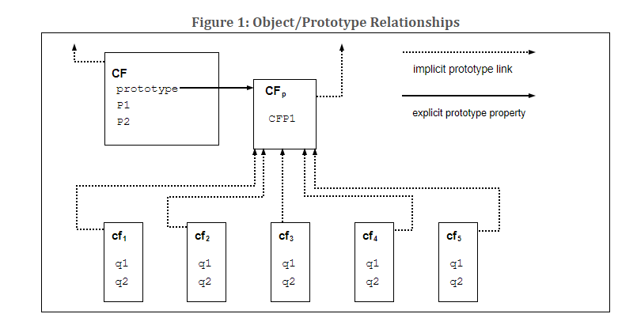

4 Обзор
==========

Этот раздел содержит ненормативный обзор языка ECMAScript.

ECMAScript - это объектно-ориентированный язык программирования для выполнения вычислений и манипулирования вычислительными объектами в [среде хоста] (overview.html#host-environment). ECMAScript, как он определен здесь, не предназначен для самодостаточности в вычислениях; действительно, в этой спецификации нет положений для ввода внешних данных или вывода вычисленных результатов. Вместо этого предполагается, что вычислительная среда программы на ECMAScript будет предоставлять не только объекты и другие средства, описанные в данной спецификации, но и некоторые специфические для среды объекты, описание и поведение которых выходит за рамки данной спецификации, за исключением указания на то, что они могут предоставлять определенные свойства, к которым можно получить доступ, и определенные функции, которые можно вызвать из программы на ECMAScript.

ECMAScript изначально разрабатывался как язык сценариев, но получил широкое распространение как язык программирования общего назначения. Язык сценариев - это язык программирования, который используется для манипулирования, настройки и автоматизации возможностей существующей системы. В таких системах полезная функциональность уже доступна через пользовательский интерфейс, а язык сценариев - это механизм, позволяющий сделать эту функциональность доступной для программного управления. Таким образом, можно сказать, что существующая система предоставляет [host environment](overview.html#host-environment) объектов и средств, которые дополняют возможности языка сценариев. Язык сценариев предназначен для использования как профессиональными, так и непрофессиональными программистами.

Изначально ECMAScript был разработан как _язык веб-сценариев_, предоставляющий механизм для оживления веб-страниц в браузерах и выполнения серверных вычислений в рамках веб-архитектуры клиент-сервер. В настоящее время ECMAScript используется для предоставления основных возможностей написания сценариев для различных [хостовых сред] (overview.html#host-environment). Поэтому основной язык указан в этом документе отдельно от конкретной [среды хоста](overview.html#host-environment).

Использование ECMAScript вышло за рамки простого создания сценариев, и теперь он применяется для всего спектра задач программирования в различных средах и масштабах. По мере расширения использования ECMAScript расширяются и предоставляемые им возможности. Сейчас ECMAScript - это полнофункциональный язык программирования общего назначения.

4.1 Веб-скриптинг
=================

Веб-браузер предоставляет ECMAScript [host environment](overview.html#host-environment) для вычислений на стороне клиента, включая, например, объекты, представляющие окна, меню, всплывающие окна, диалоговые окна, текстовые области, якоря, фреймы, историю, cookies и ввод/вывод. Кроме того, [среда хоста] (overview.html#host-environment) предоставляет возможность прикреплять код сценария к таким событиям, как изменение фокуса, загрузка страницы и изображения, выгрузка, ошибка и прерывание, выбор, отправка формы и действия мыши. Код сценария отображается в HTML, а отображаемая страница представляет собой комбинацию элементов пользовательского интерфейса, фиксированного и вычисляемого текста и изображений. Код сценария реагирует на взаимодействие с пользователем, поэтому нет необходимости в основной программе.

Веб-сервер предоставляет различную среду [host environment] (overview.html#host-environment) для вычислений на стороне сервера, включая объекты, представляющие запросы, клиентов и файлы, а также механизмы для блокировки и совместного использования данных. Совместное использование сценариев на стороне браузера и на стороне сервера позволяет распределить вычисления между клиентом и сервером, обеспечивая при этом индивидуальный пользовательский интерфейс для веб-приложения.

Каждый веб-браузер и сервер, поддерживающий ECMAScript, предоставляет свое собственное окружение [host environment] (overview.html#host-environment), завершающее среду выполнения ECMAScript.

4.2 Хосты и реализации
=============================

Чтобы облегчить интеграцию ECMAScript в [host environments](overview.html#host-environment), данная спецификация откладывает определение некоторых средств (например, [abstract operations](notational-conventions.html#sec-algorithm-conventions-abstract-operations)), полностью или частично, в источник за пределами данной спецификации. В редакционном плане данная спецификация различает следующие виды отсрочек.

Реализация_ - это внешний источник, который дополнительно определяет средства, перечисленные в приложении [D](host-layering-points.html#sec-host-layering-points), или те, которые отмечены как [определенная реализация](overview.html#implementation-defined) или [приближенная реализация](overview.html#implementation-approximated). В неформальном употреблении реализация относится к конкретному артефакту, например, конкретному веб-браузеру.

Средство, определяемое реализацией, - это средство, определение которого передано внешнему источнику без дополнительной квалификации. Данная спецификация не дает никаких рекомендаций по определенному поведению, и соответствующие реализации могут выбирать любое поведение в рамках ограничений, установленных данной спецификацией.

Средство, приближенное к реализации, - это средство, которое откладывает свое определение на внешний источник, рекомендуя идеальное поведение. Хотя соответствующие реализации вольны выбирать любое поведение в рамках ограничений, установленных данной спецификацией, им рекомендуется стремиться к приближению к идеалу. Некоторые математические операции, такие как [`Math.exp`](numbers-and-dates.html#sec-math.exp), являются [implementation-approximated](overview.html#implementation-approximated).

Хост - это внешний источник, который дополнительно определяет средства, перечисленные в приложении [D](host-layering-points.html#sec-host-layering-points), но не определяет другие [implementation-defined](overview.html#implementation-defined) или [implementation-approximated](overview.html#implementation-approximated) средства. В неформальном использовании [host](overview.html#host) означает набор всех реализаций, например, набор всех веб-браузеров, которые взаимодействуют с данной спецификацией одинаковым образом через приложение [D](host-layering-points.html#sec-host-layering-points). Хост [host](overview.html#host) часто является внешней спецификацией, такой как WHATWG HTML ([https://html.spec.whatwg.org/](https://html.spec.whatwg.org/)). Другими словами, средства, которые определяются [хостом](overview.html#host-defined), часто дополнительно определяются во внешних спецификациях.

Хост-хук - это абстрактная операция, которая полностью или частично определена внешним источником. Все [host hooks](overview.html#host-hook) должны быть перечислены в приложении [D](host-layering-points.html#sec-host-layering-points). Крючок [host hook](overview.html#host-hook) должен соответствовать, по крайней мере, следующим требованиям:

* Он должен возвращать либо [нормальное завершение](ecmascript-data-types-and-values.html#sec-completion-record-specification-type), либо [throw completion](ecmascript-data-types-and-values.html#sec-completion-record-specification-type).

Объект, определяемый хостом, - это объект, определение которого передается внешнему источнику без дополнительной квалификации и перечисляется в приложении [D](host-layering-points.html#sec-host-layering-points). Реализации, которые не являются [хостами](overview.html#host), могут также предоставлять определения для [определяемых хостами](overview.html#host-defined) объектов.

Окружение хоста - это конкретный выбор определения для всех [определяемых хостом](overview.html#host-defined) объектов. Среда [хоста](overview.html#host-environment) обычно включает объекты или функции, которые позволяют получать входные и предоставлять выходные данные как [определяемые хостом](overview.html#host-defined) свойства [глобального объекта](global-object.html#sec-global-object).

В данной спецификации соблюдается редакционная конвенция, согласно которой всегда используется наиболее конкретный термин. Например, если объект является [определяемым хостом](overview.html#host-defined), он не должен упоминаться как [определяемый реализацией](overview.html#implementation-defined).

Как [хосты](overview.html#host), так и реализации могут взаимодействовать с данной спецификацией через типы языка, типы спецификации, [абстрактные операции](notational-conventions.html#sec-algorithm-conventions-abstract-operations), грамматические постановки, присущие объекты и присущие символы, определенные здесь.

4.3 Обзор ECMAScript
=======================

Ниже представлен неофициальный обзор ECMAScript - описаны не все части языка. Этот обзор не является частью собственно стандарта.

ECMAScript основан на объектах: базовый язык и средства [host](overview.html#host) предоставляются объектами, а программа на ECMAScript представляет собой кластер взаимодействующих объектов. В ECMAScript _объект_ - это набор из нуля или более _свойств_, каждое из которых имеет _атрибуты_, определяющие, как каждое свойство может быть использовано. Например, когда атрибут Writable для свойства установлен в false, любая попытка исполняемого кода ECMAScript присвоить свойству другое значение не удается. Свойства - это контейнеры, в которых хранятся другие объекты, _примитивные значения_ или _функции_. Примитивное значение - это член одного из следующих встроенных типов: **Undefined**, **Null**, **Boolean**, **Number**, **BigInt**, **String** и **Symbol;** объект - это член встроенного типа **Object**; а функция - это вызываемый объект. Функция, связанная с объектом через свойство, называется _методом_.

ECMAScript определяет набор _встроенных объектов_, которые завершают определение сущностей ECMAScript. Эти встроенные объекты включают [глобальный объект](global-object.html#sec-global-object); объекты, которые являются фундаментальными для [семантики времени выполнения](notational-conventions. html#sec-runtime-semantics) языка, включая `Object`, `Function`, `Boolean`, `Symbol` и различные объекты `Error`; объекты, представляющие числовые значения и манипулирующие ими, включая `Math`, `Number` и `Date`; объекты обработки текста `String` и `RegExp`; объекты, представляющие собой индексированные коллекции значений, включая `Array` и девять различных видов типизированных массивов, все элементы которых имеют определенное числовое представление данных; коллекции с ключами, включая объекты `Map` и `Set`; объекты, поддерживающие структурированные данные, включая объект `JSON`, `ArrayBuffer`, `SharedArrayBuffer` и `DataView`; объекты, поддерживающие абстракции управления, включая функции-генераторы и объекты `Promise`; и объекты отражения, включая `Proxy` и `Reflect`.

ECMAScript также определяет набор встроенных _операторов_. Операторы ECMAScript включают различные унарные операции, мультипликативные операторы, аддитивные операторы, операторы побитового сдвига, реляционные операторы, операторы равенства, бинарные побитовые операторы, бинарные логические операторы, операторы присваивания и оператор запятой.

Большие программы ECMAScript поддерживаются _модулями_, которые позволяют разделить программу на несколько последовательностей утверждений и деклараций. Каждый модуль явно определяет используемые им декларации, которые должны быть предоставлены другими модулями, и какие из его деклараций доступны для использования другими модулями.

Синтаксис ECMAScript намеренно напоминает синтаксис Java. Синтаксис ECMAScript смягчен, чтобы позволить ему служить простым в использовании языком сценариев. Например, переменная не обязана объявлять свой тип, равно как и типы, связанные со свойствами, а определенные функции не обязаны иметь текстовое объявление перед обращением к ним.

4.3.1 Объекты
=============

Несмотря на то, что ECMAScript включает синтаксис для определения классов, объекты ECMAScript не являются фундаментально классовыми, как в C++, Smalltalk или Java. Вместо этого объекты могут создаваться различными способами, включая литеральную нотацию или _[конструкторы](ecmascript-data-types-and-values.html#constructor)_, которые создают объекты и затем выполняют код, инициализирующий все или часть из них путем присвоения начальных значений их свойствам. Каждый [конструктор](ecmascript-data-types-and-values.html#constructor) - это функция, имеющая свойство "прототип", которое используется для реализации _наследования по прототипу_ и _общих свойств_. Объекты создаются с помощью [конструкторов](ecmascript-data-types-and-values.html#constructor) в выражениях **new**; например, `new Date(2009, 11)` создает новый объект Date. Вызов [конструктора](ecmascript-data-types-and-values.html#constructor) без использования **new** имеет последствия, которые зависят от [конструктора](ecmascript-data-types-and-values.html#constructor). Например, `Date()` выдает строковое представление текущей даты и времени, а не объект.

Каждый объект, созданный с помощью [конструктора](ecmascript-data-types-and-values.html#constructor), имеет неявную ссылку (называемую _прототипом_ объекта) на значение свойства "прототип" его [конструктора](ecmascript-data-types-and-values.html#constructor). Кроме того, прототип может иметь ненулевую неявную ссылку на свой прототип, и так далее; это называется цепочкой _прототипов_. Когда делается ссылка на свойство объекта, это ссылка на свойство с таким именем в первом объекте в цепочке прототипов, который содержит свойство с таким именем. Другими словами, сначала исследуется непосредственно упомянутый объект на наличие такого свойства; если этот объект содержит названное свойство, то это и есть то свойство, на которое ссылается ссылка; если этот объект не содержит названного свойства, то следующим исследуется прототип этого объекта, и так далее.

Рисунок 1: Отношения между объектом и прототипом

В объектно-ориентированном языке, основанном на классах, как правило, состояние передается экземплярам, методы - классам, а наследование касается только структуры и поведения. В ECMAScript состояние и методы передаются объектами, а структура, поведение и состояние наследуются.

Все объекты, не содержащие непосредственно определенного свойства, которое содержит их прототип, разделяют это свойство и его значение. Рисунок 1 иллюстрирует это:

**CF** - это [конструктор](ecmascript-data-types-and-values.html#constructor) (а также объект). С помощью выражений `new` было создано пять объектов: **cf1**, **cf2**, **cf3**, **cf4** и **cf5**. Каждый из этих объектов содержит свойства с именами "q1" и "q2". Пунктирными линиями обозначены неявные отношения прототипов; так, например, прототипом **cf3** является **CFp**. У [конструктора](ecmascript-data-types-and-values.html#constructor), **CF**, есть два свойства, названные "P1" и "P2", которые не видны для **CFp**, **cf1**, **cf2**, **cf3**, **cf4** или **cf5**. Свойство с именем "CFP1" в **CFp** является общим для **cf1**, **cf2**, **cf3**, **cf4** и **cf5** (но не для **CF**), как и все свойства, найденные в неявной цепи прототипов **CFp**, которые не имеют имен "q1", "q2" или "CFP1". Обратите внимание, что между **CF** и **CFp** нет неявной связи прототипов.

В отличие от большинства объектных языков, основанных на классах, свойства можно добавлять к объектам динамически, присваивая им значения. То есть [конструкторы](ecmascript-data-types-and-values.html#constructor) не обязаны называть или присваивать значения всем или любым свойствам конструируемого объекта. На приведенной выше диаграмме можно добавить новое общее свойство для **cf1**, **cf2**, **cf3**, **cf4** и **cf5**, присвоив новое значение свойству в **CFp**.

Хотя объекты ECMAScript по своей сути не являются классами, часто бывает удобно определять классоподобные абстракции на основе общего шаблона [constructor](ecmascript-data-types-and-values.html#constructor) функций, объектов-прототипов и методов. Сами встроенные объекты ECMAScript следуют такому классоподобному шаблону. Начиная с ECMAScript 2015, язык ECMAScript включает синтаксические определения классов, которые позволяют программистам кратко определять объекты, соответствующие тому же шаблону классоподобной абстракции, который используется встроенными объектами.

4.3.2 Строгий вариант ECMAScript
======================================

Язык ECMAScript признает возможность того, что некоторые пользователи языка захотят ограничить использование некоторых возможностей, доступных в языке. Они могут сделать это в интересах безопасности, чтобы избежать того, что они считают склонными к ошибкам функциями, чтобы получить улучшенную проверку ошибок или по другим причинам по своему выбору. В поддержку этой возможности в ECMAScript определен строгий вариант языка. Строгий вариант языка исключает некоторые специфические синтаксические и семантические особенности обычного языка ECMAScript и изменяет подробную семантику некоторых особенностей. Строгий вариант также определяет дополнительные условия ошибок, о которых необходимо сообщать, выбрасывая исключения ошибок в ситуациях, которые не определены как ошибки в нестрогом варианте языка.

Строгий вариант ECMAScript принято называть _строгим режимом_ языка. Выбор строгого режима и использование синтаксиса и семантики строгого режима ECMAScript явно осуществляется на уровне отдельных единиц [ECMAScript source text](ecmascript-language-source-code.html#sec-source-text), как описано в [11.2.2](ecmascript-language-source-code.html#sec-strict-mode-code). Поскольку строгий режим выбирается на уровне синтаксической единицы исходного текста, строгий режим накладывает только те ограничения, которые имеют локальный эффект в пределах такой единицы исходного текста. Строгий режим не ограничивает и не изменяет никаких аспектов семантики ECMAScript, которые должны действовать последовательно в нескольких единицах исходного текста. Полная программа ECMAScript может состоять как из блоков строгого режима, так и из блоков нестрогого режима [ECMAScript source text](ecmascript-language-source-code.html#sec-source-text). В этом случае строгий режим применяется только при фактическом выполнении кода, определенного в блоке исходного текста строгого режима.

Чтобы соответствовать этой спецификации, реализация ECMAScript должна реализовать как полный неограниченный язык ECMAScript, так и строгий вариант языка ECMAScript, как определено в этой спецификации. Кроме того, реализация должна поддерживать объединение исходных текстов в неограниченном и строгом режимах в одну составную программу.

4.4 Термины и определения
=========================

Для целей настоящего документа применяются следующие термины и определения.

4.4.1 приближенная к реализации
=================================

объект [приближенный к реализации](overview.html#implementation-approximated) полностью или частично определен внешним источником, но в данной спецификации имеет рекомендуемое, идеальное поведение

4.4.2 определенная реализация
============================

объект [определенный реализацией](overview.html#implementation-defined) полностью или частично определен внешним по отношению к данной спецификации источником

4.4.3 определяемый хостом
==================

то же, что и [implementation-defined](overview.html#implementation-defined)

Примечание

Редакционно см. пункт [4.2](overview.html#sec-hosts-and-implementations).

4.4.4 тип
==========

набор значений данных, как определено в пункте [6](ecmascript-data-types-and-values.html#sec-ecmascript-data-types-and-values)

4.4.5 примитивное значение
=====================

член одного из типов Undefined, Null, Boolean, Number, BigInt, Symbol или String, как определено в пункте [6](ecmascript-data-types-and-values.html#sec-ecmascript-data-types-and-values)

Примечание

Примитивное значение - это данные, которые представлены непосредственно на самом низком уровне реализации языка.

4.4.6 объект
============

член типа Object

Примечание

Объект представляет собой набор свойств и имеет один объект-прототип. Прототип может быть нулевым.

4.4.7 конструктор
=================

[функция-объект](ecmascript-data-types-and-values.html#function-object), которая создает и инициализирует объекты

Примечание

Значение свойства [constructor](ecmascript-data-types-and-values.html#constructor) "prototype" - это объект-прототип, который используется для реализации наследования и общих свойств.

4.4.8 прототип
===============

объект, предоставляющий общие свойства для других объектов

Примечание

Когда [конструктор](ecmascript-data-types-and-values.html#constructor) создает объект, этот объект неявно ссылается на свойство "прототип" [конструктора](ecmascript-data-types-and-values.html#constructor) для разрешения ссылок на свойства. На свойство "прототип" [constructor](ecmascript-data-types-and-values.html#constructor) можно ссылаться с помощью программного выражения `constructor.prototype`, а свойства, добавленные в прототип объекта, передаются по наследству всем объектам, разделяющим этот прототип. В качестве альтернативы можно создать новый объект с явно указанным прототипом с помощью встроенной функции `Object.create`.

4.4.9 обычный объект
=====================

объект, имеющий поведение по умолчанию для основных внутренних методов, которые должны поддерживаться всеми объектами

4.4.10 экзотический объект
====================

объект, который не имеет поведения по умолчанию для одного или нескольких основных внутренних методов

Примечание

Любой объект, который не является [обычным объектом](ecmascript-data-types-and-values.html#ordinary-object), является [экзотическим объектом](ecmascript-data-types-and-values.html#exotic-object).

4.4.11 стандартный объект
======================

объект, семантика которого определена данной спецификацией

4.4.12 встроенный объект
======================

объект, указанный и предоставленный реализацией ECMAScript

Примечание

В данной спецификации определены стандартные встроенные объекты. Реализация ECMAScript может определять и поставлять дополнительные виды встроенных объектов. Встроенный [конструктор](ecmascript-data-types-and-values.html#constructor)_ - это встроенный объект, который также является [конструктором](ecmascript-data-types-and-values.html#constructor).

4.4.13 неопределенное значение
======================

примитивное значение, используемое, когда переменной не присвоено значение

4.4.14 Неопределенный тип
=====================

тип, единственным значением которого является неопределенное значение

4.4.15 null зачение
=================

примитивное значение, представляющее собой намеренное отсутствие какого-либо значения объекта

4.4.16 Null тип
================

тип, единственным значением которого является значение null

4.4.17 Boolean значение
====================

член [Boolean type](ecmascript-data-types-and-values.html#sec-ecmascript-language-types-boolean-type)

Примечание

Существует только два булевых значения - true и false.

4.4.18 Булевский тип
===================

тип, состоящий из примитивных значений true и false

4.4.19 Булевский объект
=====================

член типа Object, являющийся экземпляром стандартного встроенного Boolean [конструктор](ecmascript-data-types-and-values.html#constructor)

Примечание

Объект Boolean создается с помощью конструктора Boolean [constructor](ecmascript-data-types-and-values.html#constructor) в выражении `new`, предоставляя в качестве аргумента значение Boolean. Результирующий объект имеет внутренний слот, значением которого является булево значение. Булевский объект может быть принудительно приведен к булеву значению.

4.4.20 Строковое значение
===================

примитивное значение, представляющее собой [конечную](ecmascript-data-types-and-values.html#finite) упорядоченную последовательность из нуля или более 16-битных беззнаковых [целочисленных](notational-conventions.html#integer) значений

Примечание

Значение String является членом типа [String](ecmascript-data-types-and-values.html#sec-ecmascript-language-types-string-type). Каждое значение [integer](notational-conventions.html#integer) в последовательности обычно представляет собой одну 16-битную единицу текста UTF-16. Однако ECMAScript не накладывает никаких ограничений или требований на значения, кроме того, что они должны быть 16-битными беззнаковыми [целыми](notational-conventions.html#integer).

4.4.21 Тип строки
==================

множество всех возможных значений String

4.4.22 Строковый объект
====================

член типа Object, являющийся экземпляром стандартной встроенной строки String [конструктор](ecmascript-data-types-and-values.html#constructor)

Примечание

Объект String создается с помощью конструктора String [constructor](ecmascript-data-types-and-values.html#constructor) в выражении `new`, предоставляя в качестве аргумента значение String. Результирующий объект имеет внутренний слот, значением которого является значение String. Объект String можно преобразовать в значение String, вызвав конструктор String [constructor](ecmascript-data-types-and-values.html#constructor) как функцию ([22.1.1.1](text-processing.html#sec-string-constructor-string-value)).

4.4.23 Значение числа
===================

примитивное значение, соответствующее 64-битному двоичному значению с двойной точностью [IEEE 754-2019](bibliography.html#sec-bibliography)

Примечание

Значение Number является членом [Number type](ecmascript-data-types-and-values.html#sec-ecmascript-language-types-number-type) и представляет собой прямое представление числа.

4.4.24 Тип номера
==================

набор всех возможных значений Number, включая специальное значение "не-число" (NaN), положительную бесконечность и отрицательную бесконечность

4.4.25 Номерной объект
====================

член типа Object, являющийся экземпляром стандартного встроенного числа Number [constructor](ecmascript-data-types-and-values.html#constructor)

Примечание

Объект Number создается с помощью конструктора Number [constructor](ecmascript-data-types-and-values.html#constructor) в выражении `new` с указанием значения Number в качестве аргумента. Результирующий объект имеет внутренний слот, значением которого является значение Number. Объект Number может быть приведен к значению Number путем вызова [конструктора Number](ecmascript-data-types-and-values.html#constructor) в виде функции ([21.1.1.1](numbers-and-dates.html#sec-number-constructor-number-value)).

4.4.26 Бесконечность
===============

Значение числа, которое является положительным бесконечным значением числа

4.4.27 NaN
==========

Числовое значение, которое является [IEEE 754-2019](bibliography.html#sec-bibliography) "Не-числовым" значением

4.4.28 Значение BigInt
===================

примитивное значение, соответствующее значению произвольной точности [integer](notational-conventions.html#integer)

4.4.29 Тип BigInt
==================

множество всех возможных значений BigInt

4.4.30 Объект BigInt
====================

член типа Object, являющийся экземпляром стандартного встроенного BigInt [конструктор](ecmascript-data-types-and-values.html#constructor)

4.4.31 Значение символа
===================

Примитивное значение, представляющее уникальный, нестроковый объект [ключ свойства] (ecmascript-data-types-and-values.html#sec-object-type)

4.4.32 Тип символа
==================

множество всех возможных значений символа

4.4.33 Символьный объект
====================

член типа Object, являющийся экземпляром стандартного встроенного символа Symbol [constructor](ecmascript-data-types-and-values.html#constructor)

4.4.34 функция
===============

член типа Object, который может быть вызван как подпрограмма

Примечание

Помимо свойств, функция содержит исполняемый код и состояние, которые определяют, как она ведет себя при вызове. Код функции может быть написан на языке ECMAScript, а может и не быть.

4.4.35 встроенная функция
========================

встроенный объект, являющийся функцией

Примечание

Примерами встроенных функций являются `parseInt` и `Math.exp`. В [host](overview.html#host) или реализации могут быть предусмотрены дополнительные встроенные функции, которые не описаны в данной спецификации.

4.4.36 свойство
===============

часть объекта, которая связывает ключ (либо строковое значение, либо значение символа) и значение

Примечание

В зависимости от формы свойства значение может быть представлено либо непосредственно как значение данных (примитивное значение, объект или [функциональный объект](ecmascript-data-types-and-values.html#function-object)), либо косвенно с помощью пары функций-аксессоров.

4.4.37 метод
=============

функция, которая является значением свойства

Примечание

Когда функция вызывается как метод объекта, объект передается в функцию как значение this.

4.4.38 встроенный метод
======================

метод, являющийся встроенной функцией

Примечание

Стандартные встроенные методы определены в этой спецификации. В [host](overview.html#host) или реализации могут быть предусмотрены дополнительные встроенные методы, которые не описаны в данной спецификации.

4.4.39 атрибут
================

внутреннее значение, определяющее некоторую характеристику свойства

4.4.40 own property
===================

свойство, которое непосредственно содержится в его объекте

4.4.41 унаследованные свойства
=========================

свойство объекта, которое не является собственным свойством, но является свойством (собственным или унаследованным) прототипа объекта

4.5 Организация данной спецификации
======================================

Остальная часть данной спецификации организована следующим образом:

Пункт [5](notational-conventions.html#sec-notational-conventions) определяет условные обозначения, используемые во всей спецификации.

Пункты [6](ecmascript-data-types-and-values.html#sec-ecmascript-data-types-and-values) - [10](ordinary-and-exotic-objects-behaviours.html#sec-ordinary-and-exotic-objects-behaviours) определяют среду выполнения, в которой работают программы ECMAScript.

Пункты [11](ecmascript-language-source-code.html#sec-ecmascript-language-source-code) - [17](error-handling-and-language-extensions.html#sec-error-handling-and-language-extensions) определяют собственно язык программирования ECMAScript, включая его синтаксическую кодировку и семантику выполнения всех функций языка.

Пункты [18](ecmascript-standard-built-in-objects.html#sec-ecmascript-standard-built-in-objects) - [28](reflection.html#sec-reflection) определяют стандартную библиотеку ECMAScript. Они включают определения всех стандартных объектов, которые доступны для использования программами ECMAScript в процессе их выполнения.

Пункт [29](memory-model.html#sec-memory-model) описывает модель согласованности доступа к памяти с поддержкой SharedArrayBuffer и методам объекта Atomics.
