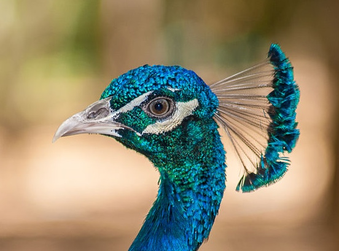

Комплексные изображения
==============

в разделе [Самоучитель по изображениям](https://www.w3.org/WAI/tutorials/images/)

Обзор
--------

Сложные изображения содержат значительную информацию - больше, чем можно передать в короткой фразе или предложении. Как правило, это:

* графики и диаграммы, включая блок-схемы и организационные диаграммы;
* диаграммы и иллюстрации, где текст страницы зависит от того, сможет ли пользователь понять изображение;
* карты, показывающие местоположение или другую информацию, например, погодные системы.

В этих случаях требуется текстовая альтернатива, состоящая из двух частей. Первая часть - краткое описание, позволяющее идентифицировать изображение и, при необходимости, указать местоположение длинного описания. Вторая часть - длинное описание - текстовое представление основной информации, передаваемой изображением. В следующих примерах показаны различные подходы, которые можно использовать для создания коротких и длинных описаний.

Содержание страницы

* [Длинные описания](#long-descriptions)
* [**Пример 1:** Описание, содержащее структурированную информацию](#example-1-description-containing-structured-information)
  * [**Пример 1:** Текстовая ссылка на длинное описание, прилегающее к изображению](#approach-1-a-text-link-to-the-long-description-adjacent-to-the-image)
  * [**Прием 2:** Описание местоположения длинного описания в атрибуте `alt`](#approach-2-describing-the-location-of-the-long-description-in-the-alt-attribute)
  * [**Начало 3:** Структурное объединение изображения и примыкающего к нему длинного описания (HTML5)](#approach-3-structurally-associating-the-image-and-its-adjacent-long-description-html5)
  * [**Пример 4:** Предоставление ссылки на длинное описание через `longdesc`](#approach-4-providing-a-link-to-the-long-description-via-longdesc)
* [**Пример 2:** Описание, содержащее текстовую информацию](#example-2-description-containing-textual-information)

Длинные описания
-----------------

Бывают ситуации, когда композиция изображения важна и должна быть представлена в длинном описании. Например, последовательность используемых цветов и относительная высота столбцов в гистограмме может быть важной информацией о структуре графика, помимо фактических значений и тенденций, которые он отображает.

Сложные изображения могут быть трудны для понимания многими людьми - особенно теми, у кого слабое зрение, проблемы с обучением и ограниченный опыт работы с предметом. Сделайте длинные описания доступными для всех, чтобы охватить своим контентом более широкую аудиторию. Например, показывайте описание как часть основного контента. Также можно уменьшить ненужную сложность изображений и сделать их более понятными для всех.

Хорошей практикой также является ссылка на более сложные изображения и их краткое описание в сопроводительном тексте. Например, такая ссылка, как "Следующий график показывает, что в первом квартале посетители были потеряны, но во втором квартале их число восстановилось", поможет указать на соответствующую информацию, которую должно представить изображение.

**Пример 1:** Описание, содержащее структурированную информацию
------------------------------------------------------------

В этом примере гистограмма статистики посещений сайта имеет краткое описание "Гистограмма, показывающая ежемесячных и общих посетителей за первый квартал 2014 года для сайтов с 1 по 3", предоставленное через атрибут `alt` изображения. Длинное описание содержит подробную информацию, включая шкалы, значения, взаимосвязи и тенденции, которые представлены визуально. Например, длинное описание может указывать на уменьшающиеся значения для участка 1, неизменные значения для участка 2 и увеличивающиеся значения для участка 3, которые закодированы в гистограмме. Подход [longdesc](#providing-a-link-to-the-long-description-via-longdesc), используемый в следующем примере, описан далее в разделе.

Пример

  
[Описание изображения](https://www.w3.org/WAI/tutorials/images/examples/2014-first-qtr/)

Примечание

Смотрите [длинное описание примера](https://www.w3.org/WAI/tutorials/images/examples/2014-first-qtr/), связанное с этим изображением.

Среди приведенных ниже подходов первый и четвертый делают информацию доступной для других программ, таких как веб-браузеры и поисковые системы.

### **Подход 1:** Текстовая ссылка на длинное описание рядом с изображением.

Этот подход предусматривает размещение рядом с изображением текстовой ссылки, которая ссылается на отдельную веб-страницу или раздел той же веб-страницы, содержащий длинное описание. Текст ссылки должен уточнять место назначения и связывать его с изображением.

Код

    

      
       
      <a href="2014-first-qtr.html">Example.com Посетители сайта с января по март 2014 года текстовое описание гистограммы</a>
    

Такой подход поддерживается всеми веб-браузерами и вспомогательными технологиями и делает длинные описания доступными для всех. Однако ссылка не связана с изображением семантическим образом.

Элементы HTML5 `<figure>` и `<figcaption>` можно использовать для семантической группировки изображений и ссылок. Добавление `role="group"` к рисунку поддерживает обратную совместимость с веб-браузерами, которые не поддерживают родную семантику элемента `<figure>`.

Код

    <figure role="group">
        
        <figcaption>
            <a href="2014-first-qtr.html">Пример.com Посетители сайта с января по март 2014 года текстовое описание гистограммы</a>
        </figcaption>
    </figure>

### **Прием 2:** Описание расположения длинного описания в атрибуте `alt`.

Когда длинное описание размещается на той же веб-странице, что и изображение, его местоположение можно описать с помощью атрибута `alt` изображения. Информация о местоположении должна быть четкой и точной, чтобы помочь пользователям найти содержимое.

Код

    

      
    

    [...]
    <h4>Посетители сайта полный текст</h4>
    [...]

### **Прием 3:** Структурное объединение изображения и примыкающего к нему длинного описания (HTML5)

Элемент HTML5 `<figure>` может быть использован для размещения изображения и его длинного описания. Длинное описание (представленное в виде заголовков, текста и таблицы) оборачивается в элемент `<figcaption>`. Он явно ассоциируется с изображением с помощью `role="group"` на содержащем его элементе `<figure>` в веб-браузерах, которые не передают семантику элемента `<figure>`.

Код

    <figure role="group">
      
      <figcaption
        <h2>Обзор</h2>
        
На диаграмме показаны посещения сайтов за первый квартал 2014 года...

        <h2>Значения</h2>
        <table>
          <caption>Посетители сайтаExample.com с января по март 2014 года</caption>
          <tr>...</tr>
        </table>
      </figcaption
    </figure>

### **Прием 4:** Предоставление ссылки на длинное описание через `longdesc`.

Поддержка доступности: `Longdesc`, веб-браузеры и вспомогательные технологии

В Firefox длинные описания, связанные с помощью `longdesc`, доступны через "Просмотр описания" в контекстном меню изображения. Существует [официальное расширение для Chrome](https://chrome.google.com/webstore/detail/long-descriptions-in-cont/ohbmencljkleiedahijfkagnmmhbilgp), которое добавляет доступ к длинным описаниям аналогичным образом. Safari не поддерживает `longdesc`. В других веб-браузерах `longdesc` в настоящее время доступен только для пользователей скринридеров. Мобильные платформы в настоящее время не поддерживают `longdesc`.

Ни один браузер не указывает на наличие атрибута `longdesc` визуально, кроме как через контекстные меню изображений, как отмечалось выше.

Атрибут `longdesc` может содержать URI отдельной веб-страницы, на которой представлено длинное описание изображения, или идентификатор фрагмента, который ссылается на элемент на той же странице, где представлено длинное описание.

Если атрибут `longdesc` содержит URI для ссылки на другую веб-страницу с длинным описанием, рекомендуется также применить [Подход 1 (текстовая ссылка на длинное описание, примыкающая к изображению)](#a-text-link-to-the-long-description-adjacent-to-the-image). Этот метод является обходным решением для браузеров и вспомогательных технологий, которые не полностью поддерживают атрибут `longdesc`.

Код

    
    <a href="2014-first-qtr.html">Длинное описание</a>

Когда атрибут `longdesc` содержит идентификатор фрагмента (`#`, за которым следует `id` элемента на той же веб-странице - "хэш-ссылка"), он ссылается на элемент на той же веб-странице, который предоставляет длинное описание. Это аналогично [Примеру 2, Подход 1] (#structurally-associating-image-and-long-description-with-aria-describedby), хотя поддержка веб-браузерами и вспомогательными технологиями может отличаться. Дополнительная ссылка (с применением [Примера 2](#a-text-link-to-the-long-description-adjacent-to-the-image)) не нужна, если длинное описание находится в непосредственной близости от изображения.

Код

    
    [...]
    

      [...]
    

**Пример 2:** Описание, содержащее текстовую информацию
---------------------------------------------------------

Атрибут WAI-ARIA `aria-describedby` может быть использован для ссылки на описание изображения, которое предоставляется в любом месте той же веб-страницы, аналогично подходу [longdesc] (#providing-a-link-to-the-long-description-via-longdesc). Значением атрибута является `id` элемента, предоставляющего длинное описание.

Важно: Элемент, на который ссылается `aria-describedby`, рассматривается как один непрерывный абзац текста. Программы чтения с экрана и другие вспомогательные технологии не имеют доступа к структурной информации, такой как заголовки и таблицы. Они будут считывать или предоставлять текст любых содержащихся элементов без указания их структурных связей и без соответствующих механизмов навигации. В результате такой подход работает только для длинных описаний, которые содержат только текст, не нуждаясь в структурной информации, как это было в предыдущем примере.

В этом примере голова павлина описывается с помощью абзаца текста, который находится на веб-странице.

Пример

У самца корона металлически-синяя, перья на голове короткие и завитые. Веерообразный хохолок на голове состоит из перьев с голыми черными стержнями и окантован румяно-зеленой паутинкой. Белая полоса над глазом и серповидный белый участок под глазом образованы голой белой кожей. Бока головы покрыты переливчатыми зеленовато-голубыми перьями. Спина покрыта чешуйчатыми бронзово-зелеными перьями с черными и медными отметинами.

Код

    
    [...]
    
.
      Самец имеет металлически-синий цвет короны, перья на голове короткие и завитые. Веерообразный хохолок на голове состоит из перьев с голыми черными стержнями и окантован румяно-зеленой паутинкой. Белая полоса над глазом и серповидный белый участок под глазом образованы голой белой кожей. Бока головы покрыты переливчатыми зеленовато-голубыми перьями. Спина покрыта чешуйчатыми бронзово-зелеными перьями с черными и медными отметинами.
    

Похожие ресурсы WCAG

В этих руководствах представлены лучшие практические рекомендации по реализации доступности в различных ситуациях. На этой странице объединены следующие критерии успеха WCAG и техники из разных уровней соответствия:

**Техники:**

* [C22: Использование CSS для управления визуальным представлением текста](https://www.w3.org/TR/WCAG20-TECHS/C22)
* [G94: Предоставление краткой текстовой альтернативы для нетекстового контента, которая служит той же цели и представляет ту же информацию, что и нетекстовый контент](https://www.w3.org/TR/WCAG20-TECHS/G94)

* [Предыдущий: Изображения текста](https://www.w3.org/WAI/tutorials/images/textual/)
* [Следующая: Группы изображений](https://www.w3.org/WAI/tutorials/images/groups/)

Помогите улучшить эту страницу
----------------------

Пожалуйста, делитесь своими идеями, предложениями или комментариями по электронной почте в публично архивируемом списке [wai-eo-editors@w3.org](mailto:wai-eo-editors@w3.org?subject=%5Ben%5D%20Complex%20Images&body=%5Bput%20comment%20here...%5D%0A%0A) или через GitHub.

[E-mail](mailto:wai-eo-editors@w3.org?subject=%5Ben%5D%20Complex%20Images&body=%5Bput%20comment%20here...%5D%0A%0A)[Fork & Edit on GitHub](https://github.com/w3c/wai-tutorials/edit/master-2.0/content/images/complex.md)[New GitHub Issue](https://github.com/w3c/wai-tutorials/issues/new?template=content-issue.yml&wai-url=https://www.w3.orghttps://www.w3.org/WAI/tutorials/images/complex/)

[Вернуться к началу](#top)
