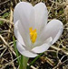
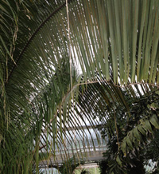

Декоративные изображения
=================

в разделе [Самоучитель по изображениям](https://www.w3.org/WAI/tutorials/images/)

Обзор
--------

Декоративные изображения не добавляют информации к содержимому страницы. Например, информация, предоставляемая изображением, может быть уже дана с помощью соседнего текста, или изображение может быть включено, чтобы сделать сайт более визуально привлекательным.

В таких случаях следует указывать нулевой (пустой) текст `alt` (`alt=""`), чтобы его могли игнорировать вспомогательные технологии, например, программы чтения с экрана. Текстовые значения для этих типов изображений добавят звуковой беспорядок в вывод программы чтения с экрана или могут отвлекать пользователей, если тема отличается от соседнего текста. Отсутствие атрибута `alt` также нежелательно, поскольку, если он не указан, некоторые программы чтения с экрана вместо него сообщают имя файла изображения.

Вопрос о том, считать ли изображение декоративным или [информативным](https://www.w3.org/WAI/tutorials/images/informative/), решает только автор, исходя из причины включения изображения на страницу. Изображения могут быть декоративными, если они:

* Визуальный стиль, такой как границы, разделители и углы;
* Дополняют текст ссылки, чтобы улучшить его внешний вид или увеличить область клика;
* Иллюстрируют соседний текст, но не несут информации ("конфетка для глаз");
* Идентифицируется и описывается окружающим текстом.

В примерах ниже показано, как использовать атрибут `alt`, когда декоративные изображения предоставляются с помощью элемента ``. По возможности, декоративные изображения должны быть предоставлены с помощью фоновых изображений CSS.

Содержание страницы

* [**Пример 1:** Изображение использовано как часть дизайна страницы](#example-1-image-used-as-part-of-page-design)
* [**Пример 2:** Декоративное изображение как часть текстовой ссылки](#example-2-decorative-image-as-part-of-a-text-link)
* [**Пример 3:** Изображение с примыкающей текстовой альтернативой](#example-3-image-with-adjacent-text-alternative)
* [**Пример 4:** Изображение, используемое для создания атмосферы (eye-candy)](#example-4-image-used-for-ambiance-eye-candy)

**Пример 1:** Изображение используется как часть дизайна страницы
------------------------------------------------

Это изображение используется в качестве границы в дизайне страницы и имеет чисто декоративное назначение.

Пример


Код
```html
.
```

Программы чтения с экрана также позволяют использовать WAI-ARIA для скрытия элементов с помощью `role="presentation"`. Однако в настоящее время эта возможность не так широко поддерживается, как использование нулевого атрибута `alt`.

Код

```html

```

Примечание

Если изображение используется для обозначения тематического перерыва, например, смены сцены в сюжете или перехода к другой теме, то для уведомления вспомогательных технологий будет уместно использовать элемент `<hr>`.

**Пример 2:** Декоративное изображение в составе текстовой ссылки
------------------------------------------------------

Иллюстрация луковицы крокуса используется для облегчения идентификации ссылки и увеличения площади клика, но не дополняет информацию, уже представленную в соседнем тексте ссылки (с тем же анкором). В этом случае используйте для изображения нулевое (пустое) значение `alt`.

Пример

[**Луковицы крокуса**](../beyond.html)

Код

```html
<a href="crocuspage.html">
  
  <strong>Луковицы крокуса</strong>.
</a>
```

**Пример 3:** Изображение с прилегающей текстовой альтернативой
---------------------------------------------------

Это изображение спящей собаки уже достаточно описано в соседнем тексте. Нет необходимости повторять эту информацию, и для этого изображения можно использовать нулевое (пустое) значение `alt`.

Пример

 **Спящая собака:** Let sleeping dogs lie - это пословица, которая означает "не инициируй проблемы". Если что-то, что может доставить неприятности, затихло, оставьте это в покое".

Код

```html
<p>
  
  <strong>Спящая собака:</strong> ...
</p>
```

**Пример 4:** Изображение используется для создания атмосферы (привлекает внимание)
--------------------------------------------------

Это изображение используется только для придания странице атмосферы или визуального интереса.

Пример

 Не пропустите впечатляющий Тропический дом - огромную оранжерею, в которой представлены образцы экзотических растений из любой тропической среды на планете.

Код

```html

```

Примечание

Если целью этого изображения является идентификация растения или передача другой информации, а не просто улучшение внешнего вида страницы, то его, вероятно, следует рассматривать как [информативное](https://www.w3.org/WAI/tutorials/images/informative/). Автор определяет цель использования изображения.

Связанные ресурсы WCAG

Эти учебные пособия содержат рекомендации по реализации доступности в различных ситуациях. На этой странице объединены следующие критерии успеха WCAG и техники из разных уровней соответствия:

**Техники:**

* [H2: Объединение соседних ссылок на изображение и текст для одного и того же ресурса](https://www.w3.org/TR/WCAG20-TECHS/H2)
* [H67: Использование нулевого текста alt и отсутствие атрибута title в элементах img для изображений, которые AT должны игнорировать](https://www.w3.org/TR/WCAG20-TECHS/H67)

* [Предыдущий: Информативные изображения](https://www.w3.org/WAI/tutorials/images/informative/)
* [Следующая: Функциональные изображения](https://www.w3.org/WAI/tutorials/images/functional/)

Помогите улучшить эту страницу
----------------------

Пожалуйста, поделитесь своими идеями, предложениями или комментариями по электронной почте в общедоступном списке [wai-eo-editors@w3.org](mailto:wai-eo-editors@w3.org?subject=%5Ben%5D%20Decorative%20Images&body=%5Bput%20comment%20here...%5D%0A%0A) или через GitHub.

[E-mail](mailto:wai-eo-editors@w3.org?subject=%5Ben%5D%20Decorative%20Images&body=%5Bput%20comment%20here...%5D%0A%0A)[Fork & Edit on GitHub](https://github.com/w3c/wai-tutorials/edit/master-2.0/content/images/decorative.md)[New GitHub Issue](https://github.com/w3c/wai-tutorials/issues/new?template=content-issue.yml&wai-url=https://www.w3.orghttps://www.w3.org/WAI/tutorials/images/decorative/)

[Вернуться к началу](#top)
