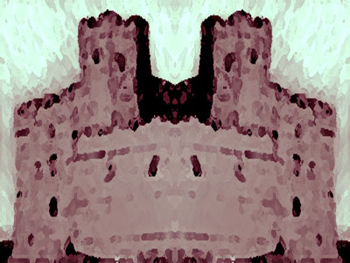

Группы изображений
================

в разделе [Самоучитель по изображениям](https://www.w3.org/WAI/tutorials/images/)

Обзор
--------

Иногда группы изображений используются вместе для представления одной информации. Например, набор значков звезд, которые вместе представляют рейтинг. В этом случае только одно из изображений нуждается в текстовой альтернативе для описания всей коллекции, а остальные изображения имеют нулевой (пустой) атрибут `alt`, поэтому они игнорируются вспомогательными технологиями.

В других случаях группа изображений может представлять собой коллекцию связанных между собой изображений. Например, показать коллекцию художественных впечатлений, тематически связанных между собой. В этом случае каждое изображение нуждается в текстовой альтернативе, которая описывает его отдельно, а также его взаимосвязь в группе.

Содержание страницы

* [**Пример 1:** Несколько изображений, передающих одну часть информации](#example-1-multiple-images-conveying-a-single-piece-of-information)
* [**Пример 2:** Коллекция изображений](#example-2-a-collection-of-images)

**Пример 1:** Несколько изображений, передающих одну часть информации
----------------------------------------------------------------------

Эта группа из пяти изображений показывает рейтинг товара. Имеется пять изображений (три заполненные звезды, одна полузаполненная звезда и одна пустая звезда), указывающих на общий рейтинг. Текстовая альтернатива для первого изображения - "Рейтинг: 3,5 из 5 звезд". Все остальные изображения имеют нулевой (пустой) атрибут `alt` (`alt=""`).

Пример

Рейтинг: ! 

Код

    Рейтинг:
    .
    
    
    
    

**Пример 2:** Коллекция изображений
-------------------------------------

В приведенном ниже примере элементы HTML5 `<figure>` и `<figcaption>` используются для создания подписи к каждому изображению в коллекции. Элемент `<figure>` может быть вложенным, что используется в примере для создания подписи для всей коллекции изображений. Атрибут WAI-ARIA `role` со значением `group` используется для указания этой группировки вспомогательным технологиям, а `aria-labelledby` обеспечивает использование элементов `figcaption` в качестве ярлыков для отдельных групп.

Примечание: Поддержка веб-браузером и вспомогательными технологиями этого конкретного атрибута и значения WAI-ARIA различна.

Пример

Замок сквозь века: 1423, 1756 и 1936 годы соответственно.

Замок имеет одну башню и высокую стену вокруг нее.](images/castle-etching.jpg)

Уголь на дереве. Аноним, около 1423 года.

Масляная краска на холсте. Элоиза Фолкнер, 1756 г.

Замок лежит в руинах, цела только оригинальная башня.](images/castle-fluro.jpg)

Фотография из фильма. Серафин Медерик Мьезен, 1936 год.

Код

    <figure role="group" aria-labelledby="fig1">
      <figcaption id="fig1">.
        Замок сквозь века: 1423, 1756 и 1936 годы соответственно.
      </figcaption
    
    
      <figure role="group" aria-labelledby="fig11">
        
        <figcaption id="fig11">Уголь на дереве. Аноним, около 1423 г.</figcaption>.
      </figure>
    
      <figure role="group" aria-labelledby="fig12">
        
        <figcaption id="fig12">Краска на масляной основе на холсте. Элоиза Фолкнер, 1756 г.</figcaption
      </figure>
    
      <figure role="group" aria-labelledby="fig13">
        
        <figcaption id="fig13">Фотография из фильма. Séraphin Médéric Mieusement, 1936.</figcaption>.
      </figure>
    
    </figure>

Связанные ресурсы WCAG

В этих руководствах представлены лучшие практические рекомендации по реализации доступности в различных ситуациях. На этой странице объединены следующие критерии успеха WCAG и техники из разных уровней соответствия:

**Техники:**

* [ARIA13: Использование aria-labelledby для названия регионов и достопримечательностей](https://www.w3.org/TR/WCAG20-TECHS/ARIA13)
* [G196: Использование текстовой альтернативы на одном элементе в группе изображений, которая описывает все элементы в группе](https://www.w3.org/TR/WCAG20-TECHS/G196)
* [H67: Использование нулевого текста alt и отсутствие атрибута title в элементах img для изображений, которые AT должен игнорировать](https://www.w3.org/TR/WCAG20-TECHS/H67)

* [Предыдущий: Сложные изображения](https://www.w3.org/WAI/tutorials/images/complex/)
* [Следующая: Карты изображений](https://www.w3.org/WAI/tutorials/images/imagemap/)

Помогите улучшить эту страницу
----------------------

Пожалуйста, делитесь своими идеями, предложениями или комментариями по электронной почте в публично архивируемом списке [wai-eo-editors@w3.org](mailto:wai-eo-editors@w3.org?subject=%5Ben%5D%20Groups%20of%20Images&body=%5Bput%20comment%20here...%5D%0A%0A) или через GitHub.

[E-mail](mailto:wai-eo-editors@w3.org?subject=%5Ben%5D%20Groups%20of%20Images&body=%5Bput%20comment%20here...%5D%0A%0A)[Fork & Edit on GitHub](https://github.com/w3c/wai-tutorials/edit/master-2.0/content/images/groups.md)[New GitHub Issue](https://github.com/w3c/wai-tutorials/issues/new?template=content-issue.yml&wai-url=https://www.w3.orghttps://www.w3.org/WAI/tutorials/images/groups/)

[Вернуться к началу](#top)
