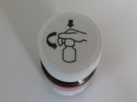

Информационные изображения
==================

в разделе [Учебник по изображениям](https://www.w3.org/WAI/tutorials/images/)

Обзор
--------

Информативные изображения передают простую концепцию или информацию, которую можно выразить короткой фразой или предложением. Текстовая альтернатива должна передавать смысл или содержание, отображаемое визуально, что обычно не является буквальным описанием изображения.

В некоторых ситуациях может потребоваться подробное дословное описание, но только в том случае, если содержание изображения составляет всю или часть передаваемой информации. Рассматривать ли изображение как информативное или [декоративное](https://www.w3.org/WAI/tutorials/images/decorative/), решают авторы, исходя из причины включения изображения на страницу.

Содержание страницы

* [**Пример 1:** Изображения, используемые для обозначения другой информации](#example-1-images-used-to-label-other-information)
* [**Пример 2:** Изображения, используемые для дополнения другой информации](#example-2-images-used-to-supplement-other-information)
* [**Пример 3:** Изображения, передающие лаконичную информацию](#example-3-images-conveying-succinct-information)
* [**Пример 4:** Изображения, передающие впечатление или эмоцию](#example-4-images-conveying-an-impression-or-emotion)
* [**Пример 5:** Изображения, передающие формат файла](#example-5-images-conveying-file-format)

**Пример 1:** Изображения, используемые для обозначения другой информации
-----------------------------------------------------

В этом примере показаны две пиктограммы - телефон и факс. За каждым изображением следует номер телефона. В соответствии с визуальным представлением, текстовые альтернативы "Телефон:" и "Факс:" используются для идентификации устройства, связанного с каждым номером.

Пример

 0123 456 7890

 0123 456 7891

Код

```html
<p>
   0123 456 7890
</p>
<p>
   0123 456 7891
</p>
```

**Пример 2:** Изображения, используемые для дополнения другой информации
----------------------------------------------------------

На следующем изображении показана собака с колокольчиком. Оно дополняет соседний текст, объясняющий назначение этого колокольчика. Для описания информации, которая отображается визуально, но не поясняется в тексте, достаточно краткой текстовой альтернативы: "Собака с колокольчиком на ошейнике".

Пример

 

Собаки-поводыри, работающие вне службы, часто носят колокольчик. Его кольцо помогает слепому владельцу отслеживать местоположение собаки.

Код

```html
<p>
  .
Собаки-поводыри часто носят ...
</p>
```


Примечание

Если бы в тексте было объяснение того, как собака носит колокольчик, изображение можно было бы считать избыточным и, следовательно, [декоративным](https://www.w3.org/WAI/tutorials/images/decorative/). Поскольку в тексте это не упоминается, изображение считается информативным.

**Пример 3:** Изображения, передающие краткую информацию
----------------------------------------------------

Эта простая схема иллюстрирует направление откручивания крышки бутылки или пробки против часовой стрелки. Информацию можно описать коротким предложением, поэтому в атрибуте `alt` указывается текстовая альтернатива "Надавите на крышку и поверните ее против часовой стрелки (справа налево)".

Пример



Код

```html
.
```

Примечания

1.  Альтернативным вариантом может быть размещение инструкций в основном контенте, а не в виде текстовой альтернативы изображению. В этом случае вся информация будет доступна в виде текста для всех, а для тех, кто предпочитает воспринимать информацию визуально, будет предоставлена иллюстрация.

2.  Если изображение должно передать больше информации, чем диаграмма, возможно, лучше следовать одному из подходов, описанных в разделе [Сложные изображения](https://www.w3.org/WAI/tutorials/images/complex/). Например, если факт того, что эта диаграмма изображена на бутылке, или форма и размер бутылки являются значимой информацией, используйте более подробный альтернативный текст.


**Пример 4:** Изображения, передающие впечатление или эмоции
--------------------------------------------------------

На этой фотографии изображена счастливая семейная компания. Это стоковое изображение, поэтому идентифицировать людей не следует. Она используется, чтобы создать впечатление, что сайт или компания, которую она представляет, дружелюбна к семье. Альтернативный вариант текста - "Мы дружелюбны к семье", так как это лучше всего описывает предполагаемое впечатление.

Пример


Код

```html

```

Примечание

Если бы целью этого изображения было просто улучшить внешний вид страницы, а не передать впечатление, оно могло бы считаться декоративным, как показано в ["Декоративные изображения: изображение, используемое для создания атмосферы"](https://www.w3.org/WAI/tutorials/images/decorative/#image-used-for-ambiance-eye-candy). Автор определяет цель использования изображения.

**Пример 5:** Изображения, передающие формат файла
-------------------------------------------

В этом примере документ доступен для загрузки в трех различных форматах, обозначенных значками формата в текстовых ссылках. Они имеют текстовые альтернативы "HTML", "Word document" и "PDF", чтобы различать тип файла для каждой ссылки:

Пример

[2012 Annual report and accounts  (43KB)](../beyond.html), также доступен в [! [Word document](images/worddocument.png) (254KB)](../beyond.html) или [ (353KB)](../beyond.html) формате.

Код

```html
<p>
  <a href="...">
    Годовой отчет и отчетность за 2012 год
     (43KB)
  </a>, также доступен в
  <a href="...">
     (254 КБ)
  </a>
  или
  <a href="...">
     (353 КБ)
  </a>
  формат.
</p>
```

Примечание

1.  Если бы идентификация формата была написана как часть текста ссылки, изображение могло бы считаться [декоративным](https://www.w3.org/WAI/tutorials/images/decorative/) и иметь нулевой (пустой) атрибут `alt` (`alt=""`). Он может находиться в том же элементе ссылки (`<a>`), что и текст, чтобы включить его в область клика. Дальнейшее обсуждение приведено в ["Функциональные изображения: изображение логотипа в тексте ссылки"](https://www.w3.org/WAI/tutorials/images/functional/#logo-image-within-link-text).

2.  Этот конкретный пример похож на пример [Функциональные изображения: иконка в тексте ссылки](https://www.w3.org/WAI/tutorials/images/functional/#icon-image-conveying-information-within-link-text) в том, что изображение передает информацию, которая не указана в тексте ссылки.


Связанные ресурсы WCAG

В этих руководствах представлены лучшие практические рекомендации по реализации доступности в различных ситуациях. На этой странице объединены следующие критерии успеха WCAG и техники из разных уровней соответствия:

**Техники:**

* [G94: Предоставление краткой текстовой альтернативы для нетекстового содержимого, которая служит той же цели и представляет ту же информацию, что и нетекстовое содержимое](https://www.w3.org/TR/WCAG20-TECHS/G94)
* [H37: Использование атрибутов alt для элементов img](https://www.w3.org/TR/WCAG20-TECHS/H37)

* [Предыдущий: Учебник по изображениям](https://www.w3.org/WAI/tutorials/images/)
* [Следующая: Декоративные изображения](https://www.w3.org/WAI/tutorials/images/decorative/)

Помогите улучшить эту страницу
----------------------

Пожалуйста, поделитесь своими идеями, предложениями или комментариями по электронной почте в общедоступном списке [wai-eo-editors@w3.org](mailto:wai-eo-editors@w3.org?subject=%5Ben%5D%20Informative%20Images&body=%5Bput%20comment%20here...%5D%0A%0A) или через GitHub.

[E-mail](mailto:wai-eo-editors@w3.org?subject=%5Ben%5D%20Informative%20Images&body=%5Bput%20comment%20here...%5D%0A%0A)[Fork & Edit on GitHub](https://github.com/w3c/wai-tutorials/edit/master-2.0/content/images/informative.md)[New GitHub Issue](https://github.com/w3c/wai-tutorials/issues/new?template=content-issue.yml&wai-url=https://www.w3.orghttps://www.w3.org/WAI/tutorials/images/informative/)

[Вернуться к началу](#top)
