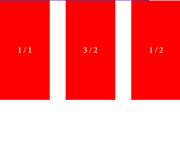

## Неочевидные вещи, которые ломают aspect-ratio

- Если для элемента заданы и высота и ширина, то aspect-ratio игнорируется.

  ```css
  .element-1 {
    inline-size: 300px;
    block-size: 200px;
    aspect-ratio: 1 / 1; /* не работает */
  }
  ```
  
  `aspect-ratio` не понимает, что ему игнорировать в этом примере

- такая же ситуация, когда размеры указаны из разных источников

  ```html
  
  ```
  
  ```css
  img {
    height: 200px;
    aspect-ratio: 1 / 1; /* не работает */
  }
  ```
  
  - нужно знать контекст
  
  Если `aspect-ratio` используется для flex-детей, то он может работать не так как рассчитывается
  
  ```css
  div:nth-child(1) {
    aspect-ratio: 1 / 1;
  }
  
  div:nth-child(2) {
    aspect-ratio: 3 / 2;
  }
  
  div:nth-child(3) {
    aspect-ratio: 1 / 2;
  }
  ```
  
  
  
  так как по умолчанию `align-items` имеет значение `stretch`. Чтобы исправить, нужно указать `align-items: flex-start;`
  
  

- паддинг-хак

паддинг-хак `padding-top: 56.25%;` плохо работал в момент, когда контента становилось больше, чем указанная пропорция. Например, текст по высоте просто на просто выходил из пропорцит.

С `aspect-ratio` можно забыть как о хаке, так и проблеме неожиданного переполнения.
