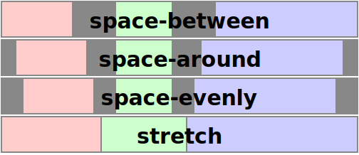

1\. Введение
--------------------------

Уровни CSS 1 и 2 позволяли выравнивать текст с помощью [text-align](https://www.w3.org/TR/css-text-3/#propdef-text-align) и выравнивать блоки с помощью балансировки автоматических полей. Однако, за исключением ячеек таблиц, вертикальное выравнивание было невозможно. По мере того как CSS добавляет новые возможности, способность выравнивать блоки по различным размерам становится все более важной. В этом модуле сделана попытка создать целостную и общую модель выравнивания ячеек, которая будет использоваться во всех CSS.

Примечание: Выравнивание текста и содержимого на уровне строк определено в [\[CSS-TEXT-3\]](#biblio-css-text-3 "CSS Text Module Level 3") и [\[CSS-INLINE-3\]](#biblio-css-inline-3 "CSS Inline Layout Module Level 3").

Примечание: Эта спецификация не предназначена для изменения поведения, определенного в [CSS2.1](https://www.w3.org/TR/CSS2/), когда свойства, определенные здесь, устанавливаются в свои начальные значения. Если исполнители или кто-либо другой заметит несоответствие, пожалуйста, сообщите об этом в CSSWG как об ошибке.

Этот раздел (выше) не является нормативным.

### 1.1. Модуль Interactions

Этот модуль добавляет некоторые новые возможности выравнивания к модели блочной верстки, описанной в [\[CSS2\]](#biblio-css2 "Cascading Style Sheets Level 2 Revision 1 (CSS 2.1) Specification") [главы 9](https://www.w3.org/TR/CSS2/visuren.html) и [10](https://www.w3.org/TR/CSS2/visudet. html), [переопределяет, как разрешаются чрезмерно ограниченные поля блоков](#justify-block), и определяет взаимодействие этих новых свойств выравнивания с выравниванием содержимого ячеек таблицы с помощью [vertical-align](https://drafts.csswg.org/css2/#propdef-vertical-align), как определено в \[CSS2\] [глава 17](https://www.w3.org/TR/CSS2/tables.html#height-layout).

Взаимодействие этих свойств с Grid Layout [\[CSS-GRID-1\]](#biblio-css-grid-1 "CSS Grid Layout Module Level 1") и Flexible Box Layout [\[CSS-FLEXBOX-1\]](#biblio-css-flexbox-1 "CSS Flexible Box Layout Module Level 1") определено в их соответствующих модулях. Определения свойств здесь заменяют определения в \[CSS-FLEXBOX-1\] (которые имеют меньшее, более раннее подмножество допустимых значений).

Никакие свойства в этом модуле не применяются к псевдоэлементам `::first-line` или `::first-letter`.

### 1.2. Определения значений

Данная спецификация следует [соглашениям определения свойств CSS](https://www.w3.org/TR/CSS2/about.html#property-defs) из [\[CSS2\]](#biblio-css2 "Cascading Style Sheets Level 2 Revision 1 (CSS 2.1) Specification"), используя [синтаксис определения значений](https://www.w3.org/TR/css-values-3/#value-defs) из [\[CSS-VALUES-3\]](#biblio-css-values-3 "CSS Values and Units Module Level 3"). Типы значений, не определенные в данной спецификации, определены в CSS Values & Units \[CSS-VALUES-3\]. Сочетание с другими модулями CSS может расширить определения этих типов значений.

В дополнение к значениям свойств, перечисленным в их определениях, все свойства, определенные в данной спецификации, также принимают в качестве значения свойства [CSS-wide keywords](https://www.w3.org/TR/css-values-4/#css-wide-keywords). Для удобства чтения они не повторяются в явном виде.

### 1.3. Частичные реализации

Поскольку ожидается, что поддержка свойств в этом модуле будет развертываться поэтапно, в соответствии с различными моделями верстки, настоящим разъясняется, что [правила для частичных реализаций](https://www.w3.org/TR/CSS/#partial), требующие считать недопустимым любое неподдерживаемое свойство, применяются к любому ключевому слову выравнивания, которое не поддерживается во всех модулях верстки, к которым оно применяется, для моделей верстки, в которых реализация поддерживает свойство в целом.

Например, если реализация поддерживает [align-self](#propdef-align-self) в [\[CSS-GRID-1\]](#biblio-css-grid-1 "CSS Grid Layout Module Level 1") и [\[CSS-FLEXBOX-1\]](#biblio-css-flexbox-1 "CSS Flexible Box Layout Module Level 1"), то она должна рассматривать [start](#valdef-self-position-start) как недопустимое, если оно не поддерживается как в контейнерах grid, так и flex. Однако если та же реализация вообще не поддерживает align-self для элементов на уровне блоков, то отсутствие реализации align-self: start не приводит к требованию считать его недопустимым.

2\. Обзор свойств выравнивания
-------------------------------------------------

Свойства выравнивания коробки

Информация об определении 'свойств выравнивания коробки'.**[#box-alignment-properties](#box-alignment-properties)****Ссылка на:**

* [2\. Обзор свойств выравнивания](#ref-for-box-alignment-properties①)
* [Приложение A: Терминология статических позиций](#ref-for-box-alignment-properties②)

в CSS - это набор из 6 свойств, которые управляют выравниванием боксов внутри других боксов. Они могут быть описаны по двум осям:

* к какому размеру они относятся ([main](https://www.w3.org/TR/css-flexbox-1/#main-axis)/[inline](https://www.w3.org/TR/css-writing-modes-4/#inline-axis) против [cross](https://www.w3.org/TR/css-flexbox-1/#cross-axis)/[block](https://www.w3.org/TR/css-writing-modes-4/#block-axis)), и
* управляют ли они положением блока внутри его родителя или содержимым блока внутри него самого.

Примечание: В данной спецификации используются термины "justify" и "align" для различения выравнивания по размерам main/inline и cross/block, соответственно. Выбор несколько произволен, но наличие этих двух терминов позволяет создать последовательную схему именования, которая работает во всех моделях верстки CSS (включая [CSS Flexbox 1 § 2 Flex Layout Box Model and Terminology](https://www.w3.org/TR/css-flexbox-1/#box-model)).

В следующей таблице приведены свойства [выравнивания бокса](#box-alignment-properties) и типы отображения, к которым они могут применяться.

| Общая | ось | Выравнивание | Применяется к |
| --- | --- | --- | --- |
| [justify-content](#propdef-justify-content) | main/inline |  содержимое внутри элемента (эффективно регулирует отступы) | [блочные контейнеры](https://www.w3.org/TR/css-display-3/#block-container), [гибкие контейнеры](https://www.w3.org/TR/css-flexbox-1/#flex-container) и [контейнеры сетки](https://www.w3.org/TR/css-grid-2/#grid-container) |
| [align-content](#propdef-align-content) | cross/block |
| [justify-self](#propdef-justify-self) | inline |  элемент внутри родительского (эффективно корректирует поля) | боксы на уровне блоков, абсолютно позиционированные боксы и [элементы сетки](https://www.w3.org/TR/css-grid-2/#grid-item) | |
| [align-self](#propdef-align-self) | cross/block | абсолютно позиционированные боксы, [flex items](https://www.w3.org/TR/css-flexbox-1/#flex-item) и [grid items](https://www.w3.org/TR/css-grid-2/#grid-item)|
| [justify-items](#propdef-justify-items) | inline |  элементы внутри бокса (управление justify-self дочерних элементов: auto) | [блочные контейнеры](https://www.w3.org/TR/css-display-3/#block-container) и [контейнеры сетки](https://www.w3.org/TR/css-grid-2/#grid-container) |
| [align-items](#propdef-align-items) | cross/block | [flex containers](https://www.w3.org/TR/css-flexbox-1/#flex-container) and [grid containers](https://www.w3.org/TR/css-grid-2/#grid-container) |

Примечание: Свойства *-items не влияют на сам элемент. Когда они установлены для контейнера, они определяют интерпретацию любого *-self: auto, используемого для дочерних элементов контейнера.

3\. Терминология выравнивания
-----------------------------------

Поскольку этот модуль определяет свойства выравнивания для всех режимов верстки в CSS, вводится некоторая абстрактная терминология:

объект выравнивания

Информация об определении 'alignment subject'.**[#alignment-subject](#alignment-subject)****Ссылка на:**

* [3\. Терминология выравнивания](#ref-for-alignment-subject) [(2)](#ref-for-alignment-subject①) [(3)](#ref-for-alignment-subject②) [(4)](#ref-for-alignment-subject③) [(5)](#ref-for-alignment-subject④) [(6)](#ref-for-alignment-subject⑤)
* [4\. Ключевые слова выравнивания](#ref-for-alignment-subject⑥) [(2)](#ref-for-alignment-subject⑦)
* [4.1. Позиционное выравнивание: center, start, end, self-start, self-end, flex-start, flex-end, left, и правые ключевые слова](#ref-for-alignment-subject⑧) [(2)](#ref-for-alignment-subject⑨) [(3)](#ref-for-alignment-subject①⓪) [(4)](#ref- for-alignment-subject①①) [(5)](#ref-for-alignment-subject①②) [(6)](#ref-for-alignment-subject①③) [(7)](#ref-for- выравнивание-субъект①④) [(8)](#ref-for-alignment-subject①⑤) [(9)](#ref-for-alignment-subject①⑥) [(10)](#ref-for-alignment- subject①⑦) [(11)](#ref-for-alignment-subject①⑧) [(12)](#ref-for-alignment-subject①⑨) [(13)](#ref-for-alignment-subject②⓪)
* [4.2. Выравнивание по базовой линии: ключевое слово baseline и первый/последний модификаторы](#ref-for-alignment-subject②①) [(2)](#ref-for-alignment-subject②②)
* [4.3. Распределенное выравнивание: растяжение, пространство между, пространство вокруг, и ключевые слова space-evenly](#ref-for-alignment-subject②③) [(2)](#ref-for-alignment-subject②④) [(3)](#ref-for-alignment-subject②⑤) [(4)](#ref-for-alignment- subject②⑥) [(5)](#ref-for-alignment-subject②⑦) [(6)](#ref-for-alignment-subject②⑧) [(7)](#ref-for-alignment-subject②⑨) [(8)](#ref-for-alignment-subject③⓪) [(9)](#ref- for-alignment-subject③①) [(10)](#ref-for-alignment-subject③②) [(11)](#ref-for-alignment-subject③③) [(12)](#ref-for-alignment-subject③④) [(13)](#ref-for-alignment- subject③⑤) [(14)](#ref-for-alignment-subject③⑥) [(15)](#ref-for-alignment-subject③⑦) [(16)](#ref-for-alignment-subject③⑧) [(17)](#ref-for-alignment-subject③⑨)
* [4.4. Выравнивание по переполнению: безопасные и небезопасные ключевые слова и границы безопасности прокрутки](#ref-for-alignment-subject④⓪) [(2)](#ref-for-alignment- subject④①) [(3)](#ref-for-alignment-subject④②) [(4)](#ref-for-alignment-subject④③) [(5)](#ref-for-alignment-subject④④)
* [5.1. Свойства justify-content и align-content](#ref-for-alignment-subject④⑤) [(2)](#ref-for-alignment-subject④⑥)
* [5.1.1. Блочные контейнеры (включая ячейки таблиц)](#ref-for-alignment-subject④⑦)
* [5.1.2. Многоцветные контейнеры](#ref-for-alignment-subject④⑧)
* [5.1.3. Гибкие контейнеры](#ref-for-alignment-subject④⑨)
* [5.1.4. Grid Containers](#ref-for-alignment-subject⑤⓪)
* [5.3. Позиции переполнения и прокрутки](#ref-for-alignment-subject⑤①) [(2)](#ref-for-alignment-subject⑤②) [(3)](#ref-for-alignment-subject⑤③) [(4)](#ref- for-alignment-subject⑤④) [(5)](#ref-for-alignment-subject⑤⑤) [(6)](#ref-for-alignment-subject⑤⑥) [(7)](#ref-for-alignment-subject⑤⑦)
* [6.1. Выравнивание по оси инлайна (или по главной оси): свойство justify-self](#ref-for-alignment-subject⑤⑧)
* [6.1.1. Блоки на уровне блоков](#ref-for-alignment-subject⑤⑨)
* [6.1.2. Абсолютно расположенные блоки](#ref-for-alignment-subject⑥⓪)
* [6.1.5. Элементы сетки](#ref-for-alignment-subject⑥①)
* [6.2. Выравнивание по осям блоков (или по осям крестов): свойство align-self](#ref-for-alignment-subject⑥②)
* [6.2.2. Абсолютно расположенные ячейки](#ref-for-alignment-subject⑥③)
* [6.2.4. Гибкие элементы](#ref-for-alignment-subject⑥④)
* [6.2.5. Grid Items](#ref-for-alignment-subject⑥⑤)
* [9.3. Выравнивание ячеек по базовой линии](#ref-for-alignment-subject⑥⑥) [(2)](#ref-for-alignment-subject⑥⑦) [(3)](#ref-for-alignment- subject⑥⑧) [(4)](#ref-for-alignment-subject⑥⑨) [(5)](#ref-for-alignment-subject⑦⓪) [(6)](#ref-for-alignment-subject⑦①)

Объект [выравнивания](#alignment-subject) - это вещь или вещи, которые выравниваются с помощью свойства. Для [justify-self](#propdef-justify-self) и [align-self](#propdef-align-self) объектом выравнивания является поле поля поля, для которого установлено свойство, и принимает [режим записи](https://www.w3.org/TR/css-writing-modes-4/#writing-mode) этого поля. Для [justify-content](#propdef-justify-content) и [align-content](#propdef-align-content) объект выравнивания определяется режимом макета и ссылается на некоторый аспект его содержимого; он также принимает режим записи поля, для которого установлено свойство.

контейнер выравнивания

Информация об определении 'контейнера выравнивания'.**[#alignment-container](#alignment-container)****Ссылка на:**

* [3\. Терминология выравнивания](#ref-for-alignment-container)
* [4\. Alignment Keywords](#ref-for-alignment-container①)
* [4.1. Позиционное выравнивание: center, start, end, self-start, self-end, flex-start, flex-end, left, и правые ключевые слова](#ref-for-alignment-container②) [(2)](#ref-for-alignment-container③) [(3)](#ref-for-alignment-container④) [(4)](#ref-for-alignment-container⑤) [(5)](#ref-for-alignment-container⑥) [(6)](#ref-for-alignment-container⑦) [(7)](#ref- for-alignment-container⑧) [(8)](#ref-for-alignment-container⑨) [(9)](#ref-for-alignment-container①⓪) [(10)](#ref- for-alignment-container①①) [(11)](#ref-for-alignment-container①②) [(12)](#ref-for-alignment-container①③)
* [4.2. Выравнивание по базовой линии: ключевое слово baseline и первый/последний модификаторы](#ref-for-alignment-container①④) [(2)](#ref-for-alignment-container①⑤)
* [4.3. Распределенное выравнивание: ключевые слова stretch, space-between, space-around, и ключевые слова space-evenly](#ref-for-alignment-container①⑥) [(2)](#ref-for-alignment-container①⑦) [(3)](#ref-for-alignment-container①⑧) [(4)](#ref- for-alignment-container①⑨) [(5)](#ref-for-alignment-container②⓪) [(6)](#ref-for-alignment-container②①) [(7)](#ref-for-alignment-container②②)
* [4.4. Выравнивание по переливу: безопасные и небезопасные ключевые слова и границы безопасности прокрутки](#ref-for-alignment-container②③) [(2)](#ref-for-alignment-container②④) [(3)](#ref-for-alignment-container②⑤) [(4)](#ref-for-alignment-container②⑥)
* [5.1. Свойства justify-content и align-content](#ref-for-alignment-container②⑦) [(2)](#ref-for-alignment-container②⑧)
* [5.1.1. Блочные контейнеры (включая ячейки таблиц)](#ref-for-alignment-container②⑨)
* [5.1.2. Многоколоночные контейнеры](#ref-for-alignment-container③⓪)
* [5.1.3. Гибкие контейнеры](#ref-for-alignment-container③①)
* [5.1.4. Grid-контейнеры](#ref-for-alignment-container③②)
* [5.3. Позиции переполнения и прокрутки](#ref-for-alignment-container③③) [(2)](#ref-for-alignment-container③④)
* [6.1. Выравнивание по осям (или по главной оси): свойство justify-self](#ref-for-alignment-container③⑤) [(2)](#ref-for-alignment-container③⑥) [(3)](#ref-for-alignment-container③⑦) [(4)](#ref-for-alignment-container③⑧)
* [6.1.1. Блок-уровни](#ref-for-alignment-container③⑨) [(2)](#ref-for-alignment-container④⓪)
* [6.1.2. Абсолютно расположенные ящики](#ref-for-alignment-container④①)
* [6.1.5. Элементы сетки](#ref-for-alignment-container④②)
* [6.2. Выравнивание по оси блока (или по оси креста): свойство align-self](#ref-for-alignment-container④③) [(2)](#ref-for-alignment-container④④) [(3)](#ref-for-alignment-container④⑤)
* [6.2.2. Абсолютно расположенные ящики](#ref-for-alignment-container④⑥)
* [6.2.4. Гибкие элементы](#ref-for-alignment-container④⑦)
* [6.2.5. Grid Items](#ref-for-alignment-container④⑧)
* [9.3. Выравнивание ячеек по базовой линии](#ref-for-alignment-container④⑨) [(2)](#ref-for-alignment-container⑤⓪) [(3)](#ref-for-alignment-container⑤①)

Контейнер [выравнивания](#alignment-container) - это прямоугольник, внутри которого выравнивается [объект выравнивания](#alignment-subject). Он определяется режимом верстки, но обычно является содержащим блоком субъекта выравнивания и принимает [режим записи](https://www.w3.org/TR/css-writing-modes-4/#writing-mode) блока, создающего содержащий блок.

обратное выравнивание

Информация об определении 'выравнивания с отступлением'.**[#fallback-alignment](#fallback-alignment)****Ссылка на:**

* [4.2. Выравнивание по базовой линии: ключевое слово baseline и первый/последний модификаторы](#ref-for-fallback-alignment) [(2)](#ref-for-fallback-alignment①) [(3)](#ref-for-fallback-alignment②) [(4)](#ref-for-fallback-alignment③) [(5)](#ref-for-fallback-alignment④)
* [4.3. Распределенное выравнивание: ключевые слова stretch, space-between, space-around, и ключевые слова space-evenly](#ref-for-fallback-alignment⑤) [(2)](#ref-for-fallback-alignment⑥) [(3)](#ref-for-fallback-alignment⑦) [(4)](#ref- for-fallback-alignment⑧) [(5)](#ref-for-fallback-alignment⑨) [(6)](#ref-for-fallback-alignment①⓪) [(7)](#ref-for-fallback-alignment①①)
* [5.1.1. Блочные контейнеры (включая ячейки таблиц)](#ref-for-fallback-alignment①②)
* [5.1.2. Многоколоночные контейнеры](#ref-for-fallback-alignment①③)
* [5.4. Базовое выравнивание содержимого](#ref-for-fallback-alignment①④) [(2)](#ref-for-fallback-alignment①⑤)
* [6.5. Влияние на размеры абсолютно позиционированных боксов со статическими позиционными вставками](#ref-for-fallback-alignment①⑥)
* [9.3. Выравнивание боксов по базовой линии](#ref-for-fallback-alignment①⑦) [(2)](#ref-for-fallback-alignment①⑧) [(3)](#ref-for-fallback-alignment①⑨)
* [10\. Изменения](#ref-for-fallback-alignment②⓪) [(2)](#ref-for-fallback-alignment②①) [(3)](#ref-for-fallback-alignment②②)

Некоторые выравнивания могут быть выполнены только в определенных ситуациях или ограничены по объему занимаемого пространства; например, [space-between](#valdef-align-content-space-between) может работать только при наличии более одного [alignment subject](#alignment-subject), и базового выравнивания после его выполнения может не хватить для поглощения всего лишнего пространства. В таких случаях вступает в силу резервное выравнивание (как определено ниже), чтобы полностью занять избыточное пространство.

4\. Выравнивание Ключевые слова
-------------------------------------------

Все свойства выравнивания используют общий набор значений ключевых слов, которые определены в этом разделе. Ключевые слова делятся на три категории:

[позиционное выравнивание](#positional-values)

Эти ключевые слова определяют выравнивание как абсолютную позицию внутри [контейнера выравнивания](#alignment-container).

[базовое выравнивание](#baseline-values)

Эти ключевые слова определяют выравнивание как отношение между базовыми линиями нескольких [субъектов выравнивания](#alignment-subject) в рамках [контекста выравнивания](#shared-alignment-context).

[распределенное выравнивание](#distribution-values)

Эти ключевые слова определяют выравнивание как распределение пространства между [субъектами выравнивания](#alignment-subject).

### 4.1. Позиционное выравнивание: [center](#valdef-self-position-center), [start](#valdef-self-position-start), [end](#valdef-self-position-end), [self-start](#valdef-self-position-self-start), [self end](#valdef-self-position-self-end), [flex-start](#valdef-self-position-flex-start), [flex-end](#valdef-self-position-flex-end), [left](#valdef-justify-content-left) и [right](#valdef-justify-content-right) keywords

Позиционное выравнивание

Информация об определении 'позиционного выравнивания'.**[#positional-alignment](#positional-alignment)****Ссылка на:**.

* [4.1. Позиционное выравнивание: ключевые слова center, start, end, self-start, self-end, flex-start, flex-end, left и right](#ref-for-positional-alignment)

Ключевые слова задают позицию для [субъекта выравнивания](#alignment-subject) относительно его [контейнера выравнивания](#alignment-container).

Значения имеют следующие значения:

center

Информация об определении 'center'.**[#valdef-self-position-center](#valdef-self-position-center)****Ссылка на:**.

* [4.1. Выравнивание по позициям: ключевые слова center, start, end, self-start, self-end, flex-start, flex-end, left и right](#ref-for-valdef-self-position-center)
* [5.1.1. Блочные контейнеры (включая ячейки таблиц)](#ref-for-valdef-self-position-center①)
* [6.5. Влияние на размеры абсолютно позиционированных блоков со статическими позиционными вставками](#ref-for-valdef-self-position-center②) [(2)](#ref-for-valdef-self-position-center③)
* [7.1. Выравнивание по осям (или по главной оси): свойство justify-items](#ref-for-valdef-self-position-center④)

([self](#self-alignment), [content](#content-distribution))

Центрирует [объект выравнивания](#alignment-subject) внутри его [контейнера выравнивания](#alignment-container).

начало

Информация об определении 'start'.**[#valdef-self-position-start](#valdef-self-position-start)****Ссылка на:**.

* [1.3. Частичные реализации](#ref-for-valdef-self-position-start)
* [4.1. Позиционное выравнивание: center, start, end, self-start, self-end, flex-start, flex-end, left, и правые ключевые слова](#ref-for-valdef-self-position-start①) [(2)](#ref-for-valdef-self-position-start②) [(3)](#ref-for-valdef-self-position-start③) [(4)](#ref-for-valdef-self-position-start④) [(5)](#ref- for-valdef-self-position-start⑤) [(6)](#ref-for-valdef-self-position-start⑥) [(7)](#ref-for-valdef-self-position-start⑦) [(8)](#ref-for-valdef-self-position-start⑧) [(9)](#ref-for-valdef-self- position-start⑨) [(10)](#ref-for-valdef-self-position-start①⓪) [(11)](#ref-for-valdef-self-position-start①①) [(12)](#ref-for-valdef-self-position-start①②) [(13)](#ref-for-valdef-self-position- start①③) [(14)](#ref-for-valdef-self-position-start①④) [(15)](#ref-for-valdef-self-position-start①⑤) [(16)](#ref-for-valdef-self-position-start①⑥) [(17)](#ref-for-valdef-self-position-start①⑦)
* [4.2. Выравнивание по базовой линии: базовое ключевое слово и первый/последний модификаторы](#ref-for-valdef-self-position-start①⑧) [(2)](#ref-for-valdef-self-position-start①⑨)
* [4.3. Распределенное выравнивание: ключевые слова stretch, space-between, space-around и space-evenly](#ref-for-valdef-self-position-start②⓪) [(2)](#ref-for-valdef-self-position-start②①)
* [4.4. Выравнивание по переполнению: безопасные и небезопасные ключевые слова и границы безопасности прокрутки](#ref-for-valdef-self-position-start②②)
* [5.1.1. Блочные контейнеры (включая ячейки таблиц)](#ref-for-valdef-self-position-start②③) [(2)](#ref-for-valdef-self-position-start②④)
* [5.2. Сокращение распределения содержимого: свойство place-content](#ref-for-valdef-self-position-start②⑤)
* [5.3. Позиции переполнения и прокрутки](#ref-for-valdef-self-position-start②⑥)
* [6.1.2. Абсолютно расположенные блоки](#ref-for-valdef-self-position-start②⑦)
* [6.1.5. Элементы сетки](#ref-for-valdef-self-position-start②⑧)
* [6.2.2. Абсолютно расположенные ячейки](#ref-for-valdef-self-position-start②⑨)
* [6.2.5. Элементы сетки](#ref-for-valdef-self-position-start③⓪)
* [6.5. Влияние на размеры абсолютно позиционированных боксов со статическими позиционными вставками](#ref-for-valdef-self-position-start③①)

([self](#self-alignment), [content](#content-distribution))

Выравнивает объект [выравнивания](#alignment-subject) заподлицо с начальным краем [выравнивания-контейнера](#alignment-container) по соответствующей оси.

end

Информация об определении 'end'.**[#valdef-self-position-end](#valdef-self-position-end)****Ссылка на:**.

* [4.1. Позиционное выравнивание: center, start, end, self-start, self-end, flex-start, flex-end, left, и правые ключевые слова](#ref-for-valdef-self-position-end) [(2)](#ref-for-valdef-self-position-end①) [(3)](#ref-for-valdef-self-position-end②) [(4)](#ref- для-valdef-self-position-end③) [(5)](#ref-for-valdef-self-position-end④) [(6)](#ref-for-valdef-self-position-end⑤) [(7)](#ref-for-valdef- self-position-end⑥) [(8)](#ref-for-valdef-self-position-end⑦) [(9)](#ref-for-valdef-self-position-end⑧) [(10)](#ref-for-valdef-self-position- end⑨) [(11)](#ref-for-valdef-self-position-end①⓪) [(12)](#ref-for-valdef-self-position-end①①) [(13)](#ref-for-valdef-self-position-end①②)
* [5.1.1. Блочные контейнеры (включая ячейки таблиц)](#ref-for-valdef-self-position-end①③)
* [5.3. Позиции переполнения и прокрутки](#ref-for-valdef-self-position-end①④)
* [6.5. Влияние на размер абсолютно позиционированных боксов со статическими позиционными вставками](#ref-for-valdef-self-position-end①⑤)
* [10\. Изменения](#ref-for-valdef-self-position-end①⑥)

([self](#self-alignment), [content](#content-distribution))

Выравнивает объект [выравнивания](#alignment-subject) заподлицо с торцевым краем [выравнивания-контейнера](#alignment-container) по соответствующей оси.

self-start

Информация об определении 'self-start'.**[#valdef-self-position-self-start](#valdef-self-position-self-start)****Ссылка на:**.

* [4.1. Позиционное выравнивание: center, start, end, self-start, self-end, flex-start, flex-end, left, and right keywords](#ref-for-valdef-self-position-self-start) [(2)](#ref-for-valdef-self-position-self-start①) [(3)](#ref-for-valdef-self-position-self-start②) [(4)](#ref-for-valdef-self-position-self-start③)
* [5.4. Baseline Content-Alignment](#ref-for-valdef-self-position-self-start④)
* [6.1. Выравнивание по оси инлайна (или главной оси): свойство justify-self](#ref-for-valdef-self-position-self-start⑤)

([self](#self-alignment))

Выравнивает [объект выравнивания](#alignment-subject) вровень с краем [контейнера выравнивания](#alignment-container), соответствующим начальной стороне объекта выравнивания, по соответствующей оси.

self-end

Информация об определении 'self-end'.**[#valdef-self-position-self-end](#valdef-self-position-self-end)****Ссылается в:**.

* [4.1. Выравнивание по месту: ключевые слова center, start, end, self-start, self-end, flex-start, flex-end, left и right](#ref-for-valdef-self-position-self-end) [(2)](#ref-for-valdef-self-position-self-end①)
* [5.4. Baseline Content-Alignment](#ref-for-valdef-self-position-self-end②)
* [6.1. Выравнивание по оси инлайна (или главной оси): свойство justify-self](#ref-for-valdef-self-position-self-end③)

([self](#self-alignment))

Выравнивает [объект выравнивания](#alignment-subject) вровень с краем [контейнера выравнивания](#alignment-container), соответствующим торцевой стороне объекта выравнивания по соответствующей оси.

flex-start

Информация об определении 'flex-start'.**[#valdef-self-position-flex-start](#valdef-self-position-flex-start)****Ссылается в:**.

* [4.1. Выравнивание по положению: ключевые слова center, start, end, self-start, self-end, flex-start, flex-end, left и right](#ref-for-valdef-self-position-flex-start)
* [4.3. Распределенное выравнивание: ключевые слова stretch, space-between, space-around и space-evenly](#ref-for-valdef-self-position-flex-start①) [(2)](#ref-for-valdef-self-position-flex-start②) [(3)](#ref-for-valdef-self-position-flex-start③) [(4)](#ref-for-valdef-self-position-flex-start④)
* [5.1.3. Гибкие контейнеры](#ref-for-valdef-self-position-flex-start⑤)
* [6.1. Выравнивание по оси инлайна (или главной оси): свойство justify-self](#ref-for-valdef-self-position-flex-start⑥)

([self](#self-alignment), [content](#content-distribution))

**Используется только в гибкой верстке** [\[CSS-FLEXBOX-1\]](#biblio-css-flexbox-1 "CSS Flexible Box Layout Module Level 1") Выравнивает [alignment subject](#alignment-subject) вровень с краем [alignment container](#alignment-container), соответствующим главной начальной или поперечной стороне [flex container](https://www.w3.org/TR/css-flexbox-1/#flex-container), в зависимости от ситуации.

При использовании вне контекста [flex formatting context](https://www.w3.org/TR/css-flexbox-1/#flex-formatting-context) это значение ведет себя как [start](#valdef-self-position-start). То есть для боксов, не являющихся [гибкими элементами](https://www.w3.org/TR/css-flexbox-1/#flex-item) (или претендующих на роль гибких элементов, например, при определении [статической позиции](https://www.w3.org/TR/css-position-3/#static-position) абсолютно позиционированного бокса, являющегося дочерним элементом [гибкого контейнера](https://www.w3.org/TR/css-flexbox-1/#flex-container)), это значение ведет себя как start при использовании в свойствах [self-alignment-properties](#self-alignment-properties), а для боксов, не являющихся гибкими контейнерами, это значение ведет себя как start при использовании в свойствах [content-distribution properties](#content-distribution-properties).

flex-end

Информация об определении 'flex-end'.**[#valdef-self-position-flex-end](#valdef-self-position-flex-end)****Ссылка на:**.

* [4.1. Выравнивание по месту: ключевые слова center, start, end, self-start, self-end, flex-start, flex-end, left и right](#ref-for-valdef-self-position-flex-end)

([self](#self-alignment), [content](#content-distribution))

**Используется только в гибкой верстке.** Выравнивает [alignment subject](#alignment-subject) вровень с краем [alignment container](#alignment-container), соответствующим главной или поперечной стороне [flex container](https://www.w3.org/TR/css-flexbox-1/#flex-container), в зависимости от ситуации.

При использовании вне контекста [flex formatting context](https://www.w3.org/TR/css-flexbox-1/#flex-formatting-context) это значение ведет себя как [end](#valdef-self-position-end). То есть для боксов, не являющихся [гибкими элементами](https://www.w3.org/TR/css-flexbox-1/#flex-item) (или претендующих на роль гибких элементов, например, при определении [статической позиции](https://www.w3.org/TR/css-position-3/#static-position) абсолютно позиционированного бокса, являющегося дочерним элементом [гибкого контейнера](https://www.w3.org/TR/css-flexbox-1/#flex-container)), это значение ведет себя как end при использовании в свойствах [самовыравнивания](#self-alignment-properties), а для боксов, не являющихся гибкими контейнерами, это значение ведет себя как end при использовании в свойствах [распределения содержимого](#content-distribution-properties).

left

Информация об определении 'left'.**[#valdef-justify-content-left](#valdef-justify-content-left)****Ссылка на:**.

* [4.1. Позиционное выравнивание: center, start, end, self-start, self-end, flex-start, flex-end, left, и правые ключевые слова](#ref-for-valdef-justify-content-left) [(2)](#ref-for-valdef-justify-content-left①) [(3)](#ref-for-valdef-justify-content- left②) [(4)](#ref-for-valdef-justify-content-left③) [(5)](#ref-for-valdef-justify-content-left④) [(6)](#ref-for-valdef-justify-content-left⑤)
* [7.1. Выравнивание по осям (или по главной оси): свойство justify-items](#ref-for-valdef-justify-content-left⑥)
* [10\. Изменения](#ref-for-valdef-justify-content-left⑦)

(только justify-*)

Выравнивает объект [выравнивания](#alignment-subject) вровень с [выравнивающим контейнером](#alignment-container) по [line-left](https://www.w3.org/TR/css3-writing-modes/#line-left) или [physical left](https://www.w3.org/TR/css-writing-modes-4/#physical-left) краю, в зависимости от того, что находится на соответствующей оси.

Если ось свойства не параллельна оси left↔right, это значение ведет себя как [start](#valdef-self-position-start). В настоящее время единственным случаем, когда ось свойства не параллельна оси left↔right, является флексбокс со столбцами.

right

Информация об определении 'right'.**[#valdef-justify-content-right](#valdef-justify-content-right)****Ссылка на:**.

* [4.1. Позиционное выравнивание: center, start, end, self-start, self-end, flex-start, flex-end, left, и правые ключевые слова](#ref-for-valdef-justify-content-right) [(2)](#ref-for-valdef-justify-content-right①) [(3)](#ref-for-valdef-justify-content- right②) [(4)](#ref-for-valdef-justify-content-right③) [(5)](#ref-for-valdef-justify-content-right④) [(6)](#ref-for-valdef-justify-content-right⑤)
* [7.1. Выравнивание по оси инлайна (или главной оси): свойство justify-items](#ref-for-valdef-justify-content-right⑥)
* [10\. Изменения](#ref-for-valdef-justify-content-right⑦)

(только обосновать*)

Выравнивает объект [выравнивания](#alignment-subject) вровень с [выравнивающим контейнером](#alignment-container) по [line-right](https://www.w3.org/TR/css3-writing-modes/#line-right) или [physical right](https://www.w3.org/TR/css-writing-modes-4/#physical-right) краю, в зависимости от того, что находится на соответствующей оси.

Если ось свойства не параллельна оси left↔right, это значение ведет себя как [start](#valdef-self-position-start). В настоящее время единственный случай, когда ось свойства не параллельна оси left↔right, - это флексбокс колонки.

Для обозначения определенных подмножеств этих значений используются два грамматических термина:

[&lt;self-position&gt;](#typedef-self-position "Expands to: center | end | flex-end | flex-start | self-end | self-start | start")

Этот набор используется в [justify-self](#propdef-justify-self) и [align-self](#propdef-align-self) для выравнивания бокса в пределах его [alignment-container](#alignment-container), а также в [justify-items](#propdef-justify-items) и [align-items](#propdef-align-items) (чтобы указать значения по умолчанию для justify-self и align-self).

&lt;self-position&gt; Информация об определении '&lt;self-position&gt;'.**[#typedef-self-position](#typedef-self-position)****Ссылка на:**.

    * [4.1.   Выравнивание по месту: ключевые слова center, start, end, self-start, self-end, flex-start, flex-end, left, and right](#ref-for-typedef-self-position) [(2)](#ref-for-typedef-self-position①)

* [6.1.  Выравнивание по осям (или по главной оси): свойство justify-self](#ref-for-typedef-self-position②) [(2)](#ref-for-typedef-self-position③)

* [6.2.  Выравнивание по осям блоков (или крестовин): свойство align-self](#ref-for-typedef-self-position④) [(2)](#ref-for-typedef-self-position⑤)

* [7.1.  Выравнивание по осям (или по главной оси): свойство justify-items](#ref-for-typedef-self-position⑥)

* [7.2.  Выравнивание по оси блока (или поперечной оси): свойство align-items](#ref-for-typedef-self-position⑦) = center [|](https://www.w3.org/TR/css-values-4/#comb-one) start [|](https://www.w3.org/TR/css-values-4/#comb-one) end [|](https://www.w3.org/TR/css-values-4/#comb-one) self-start [|](https://www.w3.org/TR/css-values-4/#comb-one) self-end [|](https://www.w3.org/TR/css-values-4/#comb-one) self-end [|](https://www.w3.org/TR/css-values-4/#comb-one)
  flex-start [|](https://www.w3.org/TR/css-values-4/#comb-one) flex-end

[&lt;content-position&gt;](#typedef-content-position "Расширяется до: center | end | flex-end | flex-start | start")

Этот набор используется [justify-content](#propdef-justify-content) и [align-content](#propdef-align-content) для выравнивания содержимого бокса внутри себя.

&lt;content-position&gt; Информация об определении '&lt;content-position&gt;'.**[#typedef-content-position](#typedef-content-position)****Ссылка в:**.

    * [4.1.   Выравнивание по месту: ключевые слова center, start, end, self-start, self-end, flex-start, flex-end, left, and right](#ref-for-typedef-content-position) [(2)](#ref-for-typedef-content-position①)

* [5.1.  Свойства justify-content и align-content](#ref-for-typedef-content-position②) [(2)](#ref-for-typedef-content-position③)

* [10\.  Изменения](#ref-for-typedef-content-position④) = center [|](https://www.w3.org/TR/css-values-4/#comb-one) start [|](https://www.w3.org/TR/css-values-4/#comb-one) end [|](https://www.w3.org/TR/css-values-4/#comb-one) flex-start [|](https://www.w3.org/TR/css-values-4/#comb-one) flex-end

Примечание: [left](#valdef-justify-content-left) и [right](#valdef-justify-content-right) исключены из [&lt;self-position&gt;](#typedef-self-position "Expands to: center | end | flex-end | flex-start | self end | self-start | start | start") и [&lt;content-position&gt;](#typedef-content-position "Expands to: center | end | flex-end | flex-start | start"), несмотря на то, что они являются допустимыми значениями [позиционного выравнивания](#positional-alignment) для [justify-content](#propdef-justify-content)/[justify-self](#propdef-justify-self)/[justify-items](#propdef-justify-items), поскольку они не допускаются в свойствах align-*. Вместо этого они явно включены в грамматику свойств justify-*.

Ключевые слова [start](#valdef-self-position-start) и [end](#valdef-self-position-end) являются [flow-relative](https://www.w3.org/TR/css-writing-modes-4/#flow-relative): они используют [writing mode](https://www.w3.org/TR/css-writing-modes-4/#writing-mode), чтобы определить, к какой стороне выравнивать.

 

[начало](#valdef-self-position-start) vs [конец](#valdef-self-position-end) в [inline axis](https://www.w3.org/TR/css-writing-modes-4/#inline-axis) ([typically†](#flexbox-exception) justify-*)

Ключевые слова [left](#valdef-justify-content-left) и [right](#valdef-justify-content-right) являются абсолютными (не [flow-relative](https://www.w3.org/TR/css-writing-modes-4/#flow-relative)).

 

[left](#valdef-justify-content-left) vs [right](#valdef-justify-content-right)

Ключевые слова [start](#valdef-self-position-start) и [end](#valdef-self-position-end) имеют значение для осей [inline](https://www.w3.org/TR/css-writing-modes-4/#inline-axis) и [block](https://www.w3.org/TR/css-writing-modes-4/#block-axis): start всегда ориентируется на начало текста (верхний левый угол для языков с лево-правым/верхним/нижним углами, таких как английский), а end всегда ориентируется на конец текста.

 

[начало](#valdef-self-position-start) vs [конец](#valdef-self-position-end) по [оси блока](https://www.w3.org/TR/css-writing-modes-4/#block-axis) ([typically†](#flexbox-exception) align-*)

Ключевые слова [start](#valdef-self-position-start) и [end](#valdef-self-position-end) используют [режим записи](https://www.w3.org/TR/css-writing-modes-4/#writing-mode) контейнера [alignment-container](#alignment-container), чтобы помочь сохранить последовательность. Но если необходимо выравнивание с использованием режима записи [alignment subject](#alignment-subject), можно использовать ключевые слова [self-start](#valdef-self-position-self-start) и [self-end](#valdef-self-position-self-end).

 

[начало](#valdef-self-position-start) против [self-start](#valdef-self-position-self-start) на отдельных элементах

Поведение ключевых слов выравнивания аналогично в [вертикальных режимах записи](https://www.w3.org/TR/css-writing-modes-4/#vertical-writing-mode): [start](#valdef-self-position-start) и [end](#valdef-self-position-end) - относительно начала/конца текста по соответствующей оси. Ключевые слова [left](#valdef-justify-content-left) и [right](#valdef-justify-content-right) интерпретируются как [line-left](https://www.w3.org/TR/css-writing-modes-4/#line-left) и [line-right](https://www.w3.org/TR/css-writing-modes-4/#line-right), относительно "левой" и "правой" сторон текста LTR/RTL.

 

[начало](#valdef-self-position-start) vs [конец](#valdef-self-position-end) в [inline axis](https://www.w3.org/TR/css-writing-modes-4/#inline-axis) ([typically†](#flexbox-exception) justify-*)

 

[left](#valdef-justify-content-left) vs [right](#valdef-justify-content-right)

[начало](#valdef-self-position-start) vs [конец](#valdef-self-position-end) по [оси блока](https://www.w3.org/TR/css-writing-modes-4/#block-axis) ([typically†](#flexbox-exception) align-*)

 

[начало](#valdef-self-position-start) против [self-start](#valdef-self-position-self-start) на отдельных элементах

Для большинства моделей верстки (блок, таблица, сетка и т. д.) свойства justify-* всегда выравнивают объекты по оси [inline axis](https://www.w3.org/TR/css-writing-modes-4/#inline-axis), а свойства align-* всегда выравнивают объекты по оси [block axis](https://www.w3.org/TR/css-writing-modes-4/#block-axis).

У Flexbox, с другой стороны, justify-* выравнивает объекты по [главной оси](https://www.w3.org/TR/css-flexbox-1/#main-axis), а align-* - по [поперечной оси](https://www.w3.org/TR/css-flexbox-1/#cross-axis). Это зависит от значения параметра [flex-direction](https://www.w3.org/TR/css-flexbox-1/#propdef-flex-direction): если flex-direction равен [row](https://www.w3.org/TR/css-flexbox-1/#valdef-flex-direction-row) или [row-reverse](https://www.w3.org/TR/css-flexbox-1/#valdef-flex-direction-row-reverse), он соответствует другим режимам верстки ([inline axis](https://www.w3.org/TR/css-writing-modes-4/#inline-axis) с justify-*, [block axis](https://www.w3.org/TR/css-writing-modes-4/#block-axis) с align-*); если flex-direction равен [column](https://www.w3.org/TR/css-flexbox-1/#valdef-flex-direction-column) или [column-reverse](https://www.w3.org/TR/css-flexbox-1/#valdef-flex-direction-column-reverse), он имеет обратное соответствие.

Упростите понимание двухосевой природы "начала" и "конца" по отношению к ортогональным потокам.

### 4.2. Выравнивание по базовой линии: ключевое слово [baseline](#valdef-justify-self-baseline) и модификаторы [first](#valdef-justify-self-first-baseline)/[last](#valdef-justify-self-last-baseline)

См. [CSS Writing Modes 3 § 4.1 Introduction to Baselines](https://www.w3.org/TR/css-writing-modes-3/#intro-baselines).

Выравнивание по базовой линии

Информация об определении 'Выравнивание по базовой линии'.**[#baseline-alignment](#baseline-alignment)****Ссылка на:**.

* [4.2. Выравнивание по базовой линии: ключевое слово baseline и первый/последний модификаторы](#ref-for-baseline-alignment) [(2)](#ref-for-baseline-alignment①)
* [9.1. Определение базовых линий вставки](#ref-for-baseline-alignment②)

это форма позиционного выравнивания, которая выравнивает несколько [субъектов выравнивания](#alignment-subject) в [общем контексте выравнивания](#shared-alignment-context) (например, ячейки в строке) путем совпадения их [базовых линий выравнивания](#alignment-baseline). Если положение субъектов выравнивания в пределах [группы совместного использования базовой линии](#baseline-sharing-group) не полностью ограничено [выравниванием по базовой линии](#baseline-alignment) (т. е. они могут быть смещены в пределах соответствующих [контейнеров выравнивания](#alignment-container) с сохранением выравнивания по базовой линии), они выравниваются [выравниванием с отступлением](#fallback-alignment) настолько, насколько это возможно, с сохранением их выравнивания по базовой линии.

Ключевые слова выравнивания по базовой линии представлены грамматическим термином [&lt;baseline-position&gt;](#typedef-baseline-position "Expands to: baseline | first | last"):

&lt;baseline-position&gt; Информация об определении '&lt;baseline-position&gt;'.**[#typedef-baseline-position](#typedef-baseline-position)****Ссылается в:**.

    * [4.2.  Выравнивание по базовой линии: ключевое слово baseline и модификаторы first/last](#ref-for-typedef-baseline-position)

* [5.1.  Свойства justify-content и align-content](#ref-for-typedef-baseline-position①)

* [5.2.  Скорость распределения контента: свойство place-content](#ref-for-typedef-baseline-position②)

* [6.1.  Выравнивание по оси (или главной оси): свойство justify-self](#ref-for-typedef-baseline-position③) [(2)](#ref-for-typedef-baseline-position④)

* [6.2.  Выравнивание по осям блоков (или крестовин): свойство align-self](#ref-for-typedef-baseline-position⑤) [(2)](#ref-for-typedef-baseline-position⑥)

* [7.1.  Выравнивание по осям (или по главной оси): свойство justify-items](#ref-for-typedef-baseline-position⑦)

* [7.2.  Выравнивание по оси блока (или по оси креста): свойство align-items](#ref-for-typedef-baseline-position⑧)

* [10\.  Изменения](#ref-for-typedef-baseline-position⑨) [(2)](#ref-for-typedef-baseline-position①⓪) = \[ first [|](https://www.w3.org/TR/css-values-4/#comb-one) last \][?](https://www.w3.org/TR/css-values-4/#mult-opt) [&&](https://www.w3.org/TR/css-values-4/#comb-all) baseline

Значения [first](#valdef-justify-self-first-baseline) и [last](#valdef-justify-self-last-baseline) дают боксу предпочтение выравнивания по базовой линии.

Информация об определении 'baseline alignment preference'.**[#baseline-alignment-preference](#baseline-alignment-preference)****Ссылка на:**

* [4.2. Базовое выравнивание: ключевое слово baseline и первый/последний модификаторы](#ref-for-baseline-alignment-preference) [(2)](#ref-for-baseline-alignment-preference①)
* [5.4. Baseline Content-Alignment](#ref-for-baseline-alignment-preference②) [(2)](#ref-for-baseline-alignment-preference③) [(3)](#ref-for-baseline-alignment-preference④)
* [9.2. Группировка базовых выравниваний](#ref-for-baseline-alignment-preference⑤) [(2)](#ref-for-baseline-alignment-preference⑥) [(3)](#ref-for-baseline-alignment-preference⑦)

  : либо "первый", либо "последний", соответственно, по умолчанию "первый".

Значения имеют следующие значения:

baseline

Информация об определении 'baseline'.**[#valdef-justify-self-baseline](#valdef-justify-self-baseline)****Ссылка на:**.

* [4.2. Выравнивание по базовой линии: ключевое слово baseline и первый/последний модификаторы](#ref-for-valdef-justify-self-baseline) [(2)](#ref-for-valdef-justify-self-baseline①) [(3)](#ref-for-valdef-justify-self-baseline②) [(4)](#ref-for-valdef-justify-self-baseline③)
* [5.1.1. Блочные контейнеры (включая ячейки таблиц)](#ref-for-valdef-justify-self-baseline④)
* [10\. Изменения](#ref-for-valdef-justify-self-baseline⑤)

Вычисляется по [первой базовой линии](#valdef-justify-self-first-baseline), определенной ниже.

первая базовая линия

Информация об определении 'первой базовой линии'.**[#valdef-justify-self-first-baseline](#valdef-justify-self-first-baseline)****Ссылается в:**.

* [4.2. Выравнивание по базовой линии: ключевое слово baseline и модификаторы first/last](#ref-for-valdef-justify-self-first-baseline) [(2)](#ref-for-valdef-justify-self-first-baseline①) [(3)](#ref-for-valdef-justify-self- first-baseline②) [(4)](#ref-for-valdef-justify-self-first-baseline③) [(5)](#ref-for-valdef-justify-self-first-baseline④) [(6)](#ref-for-valdef-justify-self-first-baseline⑤)
* [5.4. Baseline Content-Alignment](#ref-for-valdef-justify-self-first-baseline⑥) [(2)](#ref-for-valdef-justify-self-first-baseline⑦) [(3)](#ref-for-valdef-justify-self-first-baseline⑧)
* [6.4. Базовая самоориентация](#ref-for-valdef-justify-self-first-baseline⑨) [(2)](#ref-for-valdef-justify-self-first-baseline①⓪)
* [9.1. Определение базовых линий ящика](#ref-for-valdef-justify-self-first-baseline①①)

Указывает участие в выравнивании по первой базовой линии

Информация об определении 'первого базового выравнивания'.**[#first-baseline-alignment](#first-baseline-alignment)****Ссылка на:**

* [9.2. Группировка выравнивания по базовой линии](#ref-for-first-baseline-alignment)

  : выравнивает [базовую линию выравнивания](#alignment-baseline) [первого набора базовых линий](#first-baseline-set) бокса с соответствующей базовой линией его [группы совместного использования базовых линий](#baseline-sharing-group). Подробнее см. в [§ 9.3 Выравнивание боксов по базовой линии](#align-by-baseline).

Выравнивание [fallback-alignment](#fallback-alignment) для [first baseline](#valdef-justify-self-first-baseline) - это безопасный самостарт (для [self-align](#self-align)) или безопасный старт (для [content-distribution](#content-distribute)).

последняя базовая линия

Информация об определении 'последней базовой линии'.**[#valdef-justify-self-last-baseline](#valdef-justify-self-last-baseline)****Ссылка на:**.

* [4.2. Выравнивание по базовой линии: ключевое слово baseline и первый/последний модификаторы](#ref-for-valdef-justify-self-last-baseline) [(2)](#ref-for-valdef-justify-self-last-baseline①) [(3)](#ref-for-valdef-justify-self-last-baseline②)
* [5.4. Baseline Content-Alignment](#ref-for-valdef-justify-self-last-baseline③) [(2)](#ref-for-valdef-justify-self-last-baseline④) [(3)](#ref-for-valdef-justify-self-last-baseline⑤)
* [6.4. Базовая самоориентация](#ref-for-valdef-justify-self-last-baseline⑥) [(2)](#ref-for-valdef-justify-self-last-baseline⑦)
* [9.1. Определение базовых линий коробки](#ref-for-valdef-justify-self-last-baseline⑧)
* [10\. Изменения](#ref-for-valdef-justify-self-last-baseline⑨)

Указывает участие в выравнивании по последней базовой линии

Информация об определении 'last-baseline alignment'.**[#last-baseline-alignment](#last-baseline-alignment)****Ссылка на:**.

* [9.2. Группировка выравнивания по базовой линии](#ref-for-last-baseline-alignment)

  : выравнивает [базовую линию выравнивания](#alignment-baseline) из [последнего набора базовых линий](#last-baseline-set) бокса с соответствующей базовой линией его [группы совместного использования базовых линий](#baseline-sharing-group).̣ Подробнее см. в [§ 9.3 Выравнивание боксов по базовым линиям](#align-by-baseline).

Выравнивание [fallback-alignment](#fallback-alignment) для [last baseline](#valdef-justify-self-last-baseline) - это безопасный конец (для [self-align](#self-align)) или безопасный конец (для [content-distribution](#content-distribute)).

Когда эти значения указаны для [align-content](#propdef-align-content), они вызывают [baseline content-alignment](#baseline-content-alignment), смещая содержимое бокса в пределах его контент-бокса, а также могут влиять на размер самого бокса. См. [§ 5.4 Базовое выравнивание содержимого](#baseline-align-content).

Когда эти значения указаны для [align-self](#propdef-align-self)/[justify-self](#propdef-justify-self), они вызывают [baseline self-alignment](#baseline-self-alignment), смещая весь бокс в пределах его контейнера, что может повлиять на размеры его контейнера. Смотрите [§ 6.4 Базовое самовыравнивание](#baseline-align-self).

Когда для бокса задано [базовое самовыравнивание](#baseline-self-align), сначала выполняется [распределение содержимого](#content-distribute), затем результирующий бокс и его содержимое выравниваются самостоятельно. Однако если бокс также имеет [базовое выравнивание содержимого](#baseline-content-align) по той же оси или если его [свойство распределения содержимого](#content-distribution-properties) по той же оси является [нормальным](#valdef-justify-content-normal), его [используется](https://www. w3.org/TR/css-cascade-5/#used-value) свойство content-distribution в этой оси является [start](#valdef-self-position-start) или safe end для [baseline alignment preference](#baseline-alignment-preference) его базового самовыравнивания "first" или "last", соответственно.

Добавьте сюда примеры изображений.

Если блок не принадлежит к [общему контексту выравнивания](#shared-alignment-context), то используется [обратное выравнивание](#fallback-alignment). Например, выравнивание [align-content: baseline](#propdef-align-content) на блочном боксе возвращается к выравниванию [start](#valdef-self-position-start). Обратное выравнивание также используется для выравнивания [baseline-sharing group](#baseline-sharing-group) внутри его [alignment container](#alignment-container).

Примечание: Поскольку они эквивалентны, а [baseline](#valdef-justify-self-baseline) короче, CSSOM сериализует [first baseline](#valdef-justify-self-first-baseline) как baseline. См. [CSSOM § 6.7.2 Сериализация значений CSS](https://www.w3.org/TR/cssom-1/#serializing-css-values).

Примечание: Для свойства [vertical-align](https://drafts.csswg.org/css2/#propdef-vertical-align), имеющего некоторое отношение к вертикальному выравниванию, из-за непоследовательных решений в CSS2.1, [baseline](#valdef-justify-self-baseline) не эквивалентно [first baseline](#valdef-justify-self-first-baseline), поскольку [baseline-alignment preference](#baseline-alignment-preference) блока inline-уровня зависит от [display](https://www.w3.org/TR/css-display-3/#propdef-display). (Например, [inline-block](https://www.w3.org/TR/css-display-3/#valdef-display-inline-block) по умолчанию использует последнюю базовую линию, а [inline-table](https://www.w3.org/TR/css-display-3/#valdef-display-inline-table) по умолчанию использует первую базовую линию).

### 4.3. Распределенное выравнивание: ключевые слова [stretch](#valdef-align-content-stretch), [space-between](#valdef-align-content-space-between), [space-around](#valdef-align-content-space-around), и [space-evenly](#valdef-align-content-space-evenly)

Распределенное выравнивание

Информация об определении 'распределенного выравнивания'.**[#distributed-alignment](#distributed-alignment)****Ссылка на:**.

* [4.3. Распределенное выравнивание: ключевые слова stretch, space-between, space-around и space-evenly](#ref-for-distributed-alignment)
* [6.5. Влияние на размеры абсолютно позиционированных боксов со статическими позиционными вставками](#ref-for-distributed-alignment①)

значения используются в [justify-content](#propdef-justify-content) и [align-content](#propdef-align-content) для распределения дополнительного пространства контейнера между его [alignment subjects](#alignment-subject).

Значения [распределенного выравнивания](#distributed-alignment)

Когда пространство не может быть распределено таким образом, эти значения ведут себя как их [fallback-выравнивание](#fallback-alignment). Каждое значение распределения имеет соответствующее выравнивание по умолчанию. (Будущий уровень этого модуля может позволить указывать выравнивание по умолчанию явным образом).

space-between

Информация об определении 'space-between'.**[#valdef-align-content-space-between](#valdef-align-content-space-between)****Ссылка на:**.

* [3\. Терминология выравнивания](#ref-for-valdef-align-content-space-between)
* [4.3. Распределенное выравнивание: ключевые слова stretch, space-between, space-around и space-evenly](#ref-for-valdef-align-content-space-between①)
* [6.5. Влияние на размер абсолютно позиционированных боксов со статическими позиционными вставками](#ref-for-valdef-align-content-space-between②)
* [8.1. Желоба строк и столбцов: свойства row-gap и column-gap](#ref-for-valdef-align-content-space-between③) [(2)](#ref-for-valdef-align-content-space-between④)

Объекты [выравнивания](#alignment-subject) равномерно распределены в [контейнере выравнивания](#alignment-container). Первый предмет выравнивания размещается заподлицо с начальным краем контейнера выравнивания, последний предмет выравнивания размещается заподлицо с конечным краем контейнера выравнивания, а остальные предметы выравнивания распределяются так, чтобы расстояние между любыми двумя соседними предметами выравнивания было одинаковым.

Например, при наличии трех предметов все лишнее пространство делится на две части и распределяется: одна половина между первыми двумя и одна половина между последними двумя предметами](images/space-between.svg).

По умолчанию [fallback-alignment](#fallback-alignment) для этого значения - [flex-start](#valdef-self-position-flex-start). (Для режимов верстки, отличных от flex layout, [flex-start](#valdef-self-position-flex-start) идентичен [start](#valdef-self-position-start)).

space-around

Информация об определении 'space-around'.**[#valdef-align-content-space-around](#valdef-align-content-space-around)****Ссылка на:**.

* [4.3. Распределенное выравнивание: ключевые слова stretch, space-between, space-around и space-evenly](#ref-for-valdef-align-content-space-around)
* [10\. Изменения](#ref-for-valdef-align-content-space-around①)

Объекты [выравнивания](#alignment-subject) равномерно распределены в [контейнере выравнивания](#alignment-container), с полуразмерным пространством по обе стороны. Предметы выравнивания распределяются таким образом, чтобы расстояние между любыми двумя соседними предметами выравнивания было одинаковым, а расстояние перед первым и после последнего предмета выравнивания было в два раза меньше, чем расстояние между другими предметами.

Например, при наличии трех предметов все лишнее пространство делится на шестые части и распределяется: одна шестая часть в начале, одна в конце и по две шестые части (одна треть) между первыми двумя и между последними двумя предметами](images/space-around.svg).

Выравнивание по умолчанию [fallback alignment](#fallback-alignment) для этого значения - безопасный центр.

space-evenly

Информация об определении 'space-evenly'.**[#valdef-align-content-space-evenly](#valdef-align-content-space-evenly)****Ссылка на:**.

* [4.3. Распределенное выравнивание: ключевые слова stretch, space-between, space-around и space-evenly](#ref-for-valdef-align-content-space-evenly)
* [8.1. Желоба строк и столбцов: свойства row-gap и column-gap](#ref-for-valdef-align-content-space-evenly①)
* [10\. Изменения](#ref-for-valdef-align-content-space-evenly②)

Объекты [выравнивания](#alignment-subject) равномерно распределены в [контейнере выравнивания](#alignment-container), с полноразмерным пространством по обе стороны. Предметы выравнивания распределяются таким образом, чтобы расстояние между любыми двумя соседними предметами выравнивания, перед первым предметом выравнивания и после последнего предмета выравнивания было одинаковым.

.

Выравнивание по умолчанию [fallback-alignment](#fallback-alignment) для этого значения - безопасный центр.

stretch

Информация об определении 'stretch'.**[#valdef-align-content-stretch](#valdef-align-content-stretch)****Ссылка на:**.

* [4.3. Распределенное выравнивание: ключевые слова stretch, space-between, space-around и space-evenly](#ref-for-valdef-align-content-stretch)
* [5.1.2. Многоцветные контейнеры](#ref-for-valdef-align-content-stretch①) [(2)](#ref-for-valdef-align-content-stretch②)
* [5.1.3. Flex Containers](#ref-for-valdef-align-content-stretch③) [(2)](#ref-for-valdef-align-content-stretch④)
* [5.1.4. Контейнеры сетки](#ref-for-valdef-align-content-stretch⑤)

Если суммарный размер [объектов выравнивания](#alignment-subject) меньше размера [контейнера выравнивания](#alignment-container), любые объекты выравнивания с автоматическим изменением размера увеличиваются равномерно (не пропорционально), при этом соблюдаются ограничения, накладываемые [max-height](https://drafts.csswg.org/css2/#propdef-max-height)/[max-width](https://drafts.csswg.org/css2/#propdef-max-width) (или эквивалентной функциональностью), так что суммарный размер точно заполняет контейнер выравнивания.

Например, при наличии трех элементов все лишнее пространство делится на трети и распределяется: по одной трети на каждый элемент](images/space-stretch.svg).

По умолчанию [fallback-alignment](#fallback-alignment) для этого значения - [flex-start](#valdef-self-position-flex-start). (Для режимов верстки, отличных от flex layout, [flex-start](#valdef-self-position-flex-start) идентичен [start](#valdef-self-position-start)).

Эти значения представлены с помощью грамматического термина [&lt;content-distribution&gt;](#typedef-content-distribution "Expands to: space-around | space-between | space-evenly | stretch"):

&lt;content-distribution&gt; Информация об определении '&lt;content-distribution&gt;'.**[#typedef-content-distribution](#typedef-content-distribution)****Ссылается в:**.

    * [4.3.   Распределенное выравнивание: ключевые слова stretch, space-between, space-around и space-evenly](#ref-for-typedef-content-distribution)

* [5.1.  Свойства justify-content и align-content](#ref-for-typedef-content-distribution①) [(2)](#ref-for-typedef-content-distribution②)

* [5.1.1. Блочные контейнеры (включая ячейки таблиц)](#ref-for-typedef-content-distribution③)

* [5.1.2. Многоколоночные контейнеры](#ref-for-typedef-content-distribution④) = space-between [|](https://www.w3.org/TR/css-values-4/#comb-one) space-around [|](https://www.w3.org/TR/css-values-4/#comb-one) space-evenly [|](https://www.w3.org/TR/css-values-4/#comb-one) stretch

### 4.4. Выравнивание по переполнению: ключевые слова [safe](#valdef-overflow-position-safe) и [unsafe](#valdef-overflow-position-unsafe) и границы безопасности прокрутки

Если объект [выравнивания](#alignment-subject) больше, чем контейнер [выравнивания](#alignment-container), он переполнится. Некоторые режимы выравнивания, если их использовать в данной ситуации, могут привести к потере данных: например, если содержимое боковой панели центрировано, то при переполнении оно может отправить часть своих боксов за начальную границу области просмотра, до которой нельзя будет прокрутить.

На рисунке ниже показана разница между "безопасным" и "небезопасным" центрированием на примере флексбокса с колонками:

О сайте

Авторитаризм

Блог

О блоге

Авторитаризм

Блог

Элементы на рисунке слева строго центрированы, даже если тот, который слишком длинный, чтобы поместиться, переполняется с обеих сторон, в то время как элементы на рисунке справа центрированы, если они не переполняются, и в этом случае все переполнение уходит за край. Если контейнер расположен у левого края страницы, то "безопасное" поведение будет более предпочтительным, так как длинный элемент будет полностью читаемым, а не обрезанным левым краем экрана. В других обстоятельствах "небезопасное" поведение центрирования может быть лучше, так как оно правильно центрирует все элементы.

Для контроля этой ситуации используется выравнивание по переполнению

Информация об определении 'выравнивания по переполнению'.**[#overflow-alignment](#overflow-alignment)****Ссылка на:**

* [4.4. Выравнивание по переполнению: безопасные и небезопасные ключевые слова и границы безопасности прокрутки](#ref-for-overflow-alignment) [(2)](#ref-for-overflow-alignment①)
* [5.4. Базовое выравнивание содержимого](#ref-for-overflow-alignment②)

режим может быть указан явно. "Небезопасное" выравнивание сохраняет заданный режим выравнивания в ситуациях переполнения, даже если это приводит к потере данных, в то время как "безопасное" выравнивание изменяет режим выравнивания в ситуациях переполнения, пытаясь избежать потери данных. По умолчанию объект выравнивания находится в пределах прокручиваемой области, однако на момент написания статьи эта функция безопасности еще не реализована.

&lt;overflow-position&gt; Информация об определении '&lt;overflow-position&gt;'.**[#typedef-overflow-position](#typedef-overflow-position)****Ссылка в:**.

    * [5.1.  Свойства justify-content и align-content](#ref-for-typedef-overflow-position②) [(2)](#ref-for-typedef-overflow-position③)

* [6.1.  Выравнивание по осям (или по главной оси): свойство justify-self](#ref-for-typedef-overflow-position④) [(2)](#ref-for-typedef-overflow-position⑤)

* [6.2.  Выравнивание по оси блока (или креста): свойство align-self](#ref-for-typedef-overflow-position⑥) [(2)](#ref-for-typedef-overflow-position⑦)

* [7.1.  Выравнивание по осям (или по главной оси): свойство justify-items](#ref-for-typedef-overflow-position⑧)

* [7.2.  Выравнивание по оси блока (или по оси креста): свойство align-items](#ref-for-typedef-overflow-position⑨)

* [10\.  Изменения](#ref-for-typedef-overflow-position①⓪) = unsafe [|](https://www.w3.org/TR/css-values-4/#comb-one) safe

безопасный

Информация об определении 'safe'.**[#valdef-overflow-position-safe](#valdef-overflow-position-safe)****Ссылается в:**.

* [4.4. Выравнивание переполнения: ключевые слова safe и unsafe и границы безопасности прокрутки](#ref-for-valdef-overflow-position-safe①)
* [10\. Изменения](#ref-for-valdef-overflow-position-safe②)

Если размер [объекта выравнивания](#alignment-subject) переполняет [контейнер выравнивания](#alignment-container), то вместо этого объект выравнивания выравнивается так, как если бы режим выравнивания был [start](#valdef-self-position-start).

unsafe

Информация об определении 'unsafe'.**[#valdef-overflow-position-unsafe](#valdef-overflow-position-unsafe)****Ссылается в:**.

* [4.4. Выравнивание переполнения: безопасные и небезопасные ключевые слова и границы безопасности прокрутки](#ref-for-valdef-overflow-position-unsafe) [(2)](#ref-for-valdef-overflow-position-unsafe①)
* [5.4. Базовое выравнивание содержимого](#ref-for-valdef-overflow-position-unsafe②)

Независимо от относительных размеров [alignment subject](#alignment-subject) и [alignment container](#alignment-container), заданное значение выравнивания соблюдается.

(значение не указано)

Если [выравнивание по переполнению](#overflow-alignment) не указано явно, выравнивание по переполнению по умолчанию представляет собой смесь "безопасного" и "небезопасного", то есть переполненному [объекту выравнивания](#alignment-subject) разрешается переполнить его [контейнер выравнивания](#alignment-container), но если это приведет к переполнению [прокручиваемой области переполнения](https://www. w3.org/TR/css-overflow-3/#scrollable-overflow-region) своего ближайшего предка [scroll container](https://www.w3.org/TR/css-overflow-3/#scroll-container) (таким образом, распространяясь на "непрокручиваемую" область), то его переполнение в этом направлении ограничивается путем смещения любого оставшегося переполнения в противоположную сторону.

Реализация "умного" поведения по умолчанию может быть несовместима с Web (хотя мы надеемся и считаем это вероятным), поэтому UA должны передавать любые отзывы по этому вопросу в WG. UA, не реализовавшие "умное" поведение по умолчанию, должны вести себя как [unsafe](#valdef-overflow-position-unsafe).

5\. Распределение содержимого: Выравнивание содержимого блока внутри самого себя
------------------------------------------------------------------------------------------

Распределение содержимого

Информация об определении 'Распределение содержимого'.**[#content-distribute](#content-distribute)****Ссылка на:**

* [4.2. Выравнивание по базовой линии: базовое ключевое слово и первый/последний модификаторы](#ref-for-content-distribute) [(2)](#ref-for-content-distribute①) [(3)](#ref-for-content-distribute②)
* [10\. Changes](#ref-for-content-distribute③)

управляет выравниванием содержимого бокса в пределах его контент-бокса. Оно задается свойствами content-distribution

Информация об определении 'content-distribution properties'.**[#content-distribution-properties](#content-distribution-properties)****Ссылка на:**.

* [4.1. Позиционное выравнивание: ключевые слова center, start, end, self-start, self-end, flex-start, flex-end, left и right](#ref-for-content-distribution-properties) [(2)](#ref-for-content-distribution-properties①)
* [4.2. Выравнивание по базовой линии: базовое ключевое слово и первый/последний модификаторы](#ref-for-content-distribution-properties②) [(2)](#ref-for-content-distribution-properties③)
* [5.3. Позиции переполнения и прокрутки](#ref-for-content-distribution-properties④)
* [8.1. Желоба строк и столбцов: свойства row-gap и column-gap](#ref-for-content-distribution-properties⑤)
* [10\. Изменения](#ref-for-content-distribution-properties⑥)

[align-content](#propdef-align-content) и [justify-content](#propdef-justify-content) (и их сокращение [place-content](#propdef-place-content)).

### 5.1. Свойства [justify-content](#propdef-justify-content) и [align-content](#propdef-align-content)

| | |
| --- | --- |
| Имя: | align-content  Информация об определении 'align-content'.**[#propdef-align-content](#propdef-align-content)****Ссылка в:**  * [2\. Обзор свойств выравнивания](#ref-for-propdef-align-content) * [3\. Терминология выравнивания](#ref-for-propdef-align-content①) * [4.1. Позиционное выравнивание: ключевые слова center, start, end, self-start, self-end, flex-start, flex-end, left и right](#ref-for-propdef-align-content②) * [4.2. Выравнивание по базовой линии: ключевое слово baseline и модификаторы first/last](#ref-for-propdef-align-content③) [(2)](#ref-for-propdef-align-content④) * [4.3. Распределенное выравнивание: ключевые слова stretch, space-between, space-around и space-evenly](#ref-for-propdef-align-content⑤) * [5\. Content Distribution: Aligning a Box's Contents Within Itself](#ref-for-propdef-align-content⑥) * [5. 1. Свойства justify-content и align-content](#ref-for-propdef-align-content⑦) [(2)](#ref-for-propdef-align-content⑧) * [5. 1.1. Блочные контейнеры (включая ячейки таблиц)](#ref-for-propdef-align-content⑨) [(2)](#ref-for-propdef-align-content①⓪) * [5.1.2. Multicol Containers](#ref-for-propdef-align-content①①) * [5.1.3. Flex Containers](#ref-for-propdef-align-content①②) [(2)](#ref-for-propdef-align-content①③) * [5.1.4. Контейнеры сетки](#ref-for-propdef-align-content①④) * [5.2. Сокращение распределения содержимого: свойство place-content](#ref-for-propdef-align-content①⑤) [(2)](#ref-for-propdef-align-content①⑥) [(3)](#ref-for-propdef-align-content①⑦) * [5.4. Baseline Content-Align](#ref-for-propdef-align-content①⑧) [(2)](#ref-for-propdef-align-content①⑨) [(3)](#ref-for-propdef-align-content②⓪) [(4)](#ref-for-propdef-align-content②①) * [8.1. Желоба строк и столбцов: свойства row-gap и column-gap](#ref-for-propdef-align-content②②) * [9\. Детали базового выравнивания](#ref-for-propdef-align-content②③) * [10\. Изменения](#ref-for-propdef-align-content②④) |
| [Value:](https://www.w3.org/TR/css-values/#value-defs) | normal [\|](https://www.w3. org/TR/css-values-4/#comb-one) [&lt;baseline-position&gt;](#typedef-baseline-position "Расширяется до: baseline \| first \| last")\| [&lt;content-distribution&gt;](#typedef-content-distribution "Расширяется до: \| пространство вокруг \| пространство между \| пространство равномерно \| растягивается") \| [&lt;overflow-position&gt;](#typedef-overflow-position "Расширяется до: безопасный \| небезопасный")[? ](https://www.w3.org/TR/css-values-4/#mult-opt) [&lt;content-position&gt;](#typedef-content-position "Расширяется до: center \| end \| flex-end \| flex-start \| start") |
| [Initial:](https://www.w3.org/TR/css-cascade/#initial-values) | normal | |
| [Применяется к:](https://www.w3.org/TR/css-cascade/#applies-to)| блок-контейнерам, мультиконтейнерам, флекс-контейнерам и грид-контейнерам |
| [Наследуется:](https://www.w3.org/TR/css-cascade/#inherited-property) | нет |
| [Проценты:](https://www.w3.org/TR/css-values/#percentages) | n/a |
| [Вычисленное значение:](https://www.w3.org/TR/css-cascade/#computed) | указанное ключевое слово(а) |
| [Канонический порядок:](https://www.w3.org/TR/cssom/#serializing-css-values) | по грамматике |
| [Тип анимации:](https://www.w3.org/TR/web-animations/#animation-type) | дискретный |

| | |
| --- | --- |
| Имя: | justify-content  Информация об определении 'justify-content'.**[#propdef-justify-content](#propdef-justify-content)****Ссылка на:**  * [2\. Обзор свойств выравнивания](#ref-for-propdef-justify-content) * [3\. Терминология выравнивания](#ref-for-propdef-justify-content①) * [4.1. Позиционное выравнивание: ключевые слова center, start, end, self-start, self-end, flex-start, flex-end, left и right](#ref-for-propdef-justify-content②) [(2)](#ref-for-propdef-justify-content③) * [4.3. Распределенное выравнивание: ключевые слова stretch, space-between, space-around и space-evenly](#ref-for-propdef-justify-content④) * [5\. Content Distribution: Aligning a Box's Contents Within Itself](#ref-for-propdef-justify-content⑤) * [5. 1. Свойства justify-content и align-content](#ref-for-propdef-justify-content⑥) [(2)](#ref-for-propdef-justify-content⑦) * [5. 1.1. Блочные контейнеры (включая ячейки таблиц)](#ref-for-propdef-justify-content⑧) * [5.1.2. Многоцветные контейнеры](#ref-for-propdef-justify-content⑨) [(2)](#ref-for-propdef-justify-content①⓪) [(3)](#ref-for-propdef-justify-content①①) * [5. 1.3. Flex-контейнеры](#ref-for-propdef-justify-content①②) [(2)](#ref-for-propdef-justify-content①③) [(3)](#ref-for-propdef-justify-content①④) * [5. 1.4. Сетчатые контейнеры](#ref-for-propdef-justify-content①⑤) * [5.2. Распределение содержимого Сокращение: свойство place-content](#ref-for-propdef-justify-content①⑥) [(2)](#ref-for-propdef-justify-content①⑦) [(3)](#ref-for-propdef-justify-content①⑧) * [5. 3. Переполнение и позиции прокрутки](#ref-for-propdef-justify-content①⑨) [(2)](#ref-for-propdef-justify-content②⓪) * [6.1.4. Гибкие элементы](#ref-for-propdef-justify-content②①) * [6.5. Влияние на размеры абсолютно позиционированных боксов с вставками статического положения](#ref-for-propdef-justify-content②②) * [8.1. Желоба строк и столбцов: свойства row-gap и column-gap](#ref-for-propdef-justify-content②③) * [10\. Изменения](#ref-for-propdef-justify-content②④)|
| [Value:](https://www.w3.org/TR/css-values/#value-defs) | normal [\|](https://www.w3.org/TR/css-values-4/#comb-one) [&lt;content-distribution&gt;](#typedef-content-distribution "Expands to: space-around \| space-between \| space-evenly \| stretch")\| [&lt;overflow-position&gt;](#typedef-overflow-position "Expands to: safe \| unsafe")[? ](https://www.w3.org/TR/css-values-4/#mult-opt)\[ [&lt;content-position&gt;](#typedef-content-position "Expands to: center \| end \| flex-end \| flex-start \| start")\| left \| right \] |
| [Initial:](https://www.w3.org/TR/css-cascade/#initial-values) | normal |
| [Применяется к:](https://www.w3.org/TR/css-cascade/#applies-to)| контейнерам multicol, контейнерам flex и контейнерам grid |
| [Наследуется:](https://www.w3.org/TR/css-cascade/#inherited-property)| нет |
| [Проценты:](https://www.w3.org/TR/css-values/#percentages) | n/a |
| [Вычисленное значение:](https://www.w3.org/TR/css-cascade/#computed) | указанное ключевое слово(а) |
| [Канонический порядок:](https://www.w3.org/TR/cssom/#serializing-css-values) | по грамматике |
| [Тип анимации:](https://www.w3.org/TR/web-animations/#animation-type) | дискретный |

Выравнивает содержимое блока в целом (как [alignment-subject](#alignment-subject)) внутри самого блока (как [alignment-container](#alignment-container)): по оси inline/row/main блока (для [justify-content](#propdef-justify-content)) или по оси block/column/cross блока (для [align-content](#propdef-align-content)). Значения, отличные от normal

Информация об определении 'normal'.**[#valdef-justify-content-normal](#valdef-justify-content-normal)****Ссылка на:**.

* [4.2. Выравнивание по базовой линии: ключевое слово baseline и первый/последний модификаторы](#ref-for-valdef-justify-content-normal)
* [5.1.1. Блочные контейнеры (включая ячейки таблиц)](#ref-for-valdef-justify-content-normal①) [(2)](#ref-for-valdef-justify-content-normal②) [(3)](#ref-for-valdef-justify-content-normal③)
* [5.1.2. Multicol Containers](#ref-for-valdef-justify-content-normal④) [(2)](#ref-for-valdef-justify-content-normal⑤) [(3)](#ref-for-valdef-justify-content-normal⑥)
* [5.1.3. Flex Containers](#ref-for-valdef-justify-content-normal⑦) [(2)](#ref-for-valdef-justify-content-normal⑧)
* [5.1.4. Контейнеры сетки](#ref-for-valdef-justify-content-normal⑨) [(2)](#ref-for-valdef-justify-content-normal①⓪)
* [10\. Изменения](#ref-for-valdef-justify-content-normal①①)

определены в [§ 4 Ключевые слова выравнивания](#alignment-values), выше.

Для всех режимов компоновки [alignment subject](#alignment-subject) и [alignment container](#alignment-container) предполагают [writing mode](https://www.w3.org/TR/css-writing-modes-4/#writing-mode) поля, для которого установлено свойство *-content.

#### 5.1.1. Блочные контейнеры (включая ячейки таблиц)

| | |
| --- | --- |
| [Контейнер выравнивания](#alignment-container) | Блок содержимого [блочного контейнера](https://www.w3.org/TR/css-display-3/#block-container). |
| | [Alignment Subject(s)](#alignment-subject) | Все содержимое блока как единое целое. |
| | [align-content](#propdef-align-content) Ось | Ось [блока](https://www.w3.org/TR/css-writing-modes-4/#block-axis). Если указано [&lt;content-distribution&gt;](#typedef-content-distribution "Expands to: space-around \| space-between \| space-evenly \| stretch"), вместо него используется [fallback alignment](#fallback-alignment). |
| [justify-content](#propdef-justify-content) Ось | Не применяется и не влияет на [блочные контейнеры](https://www.w3.org/TR/css-display-3/#block-container). |
| [normal](#valdef-justify-content-normal) Поведение | Все значения, отличные от [normal](#valdef-justify-content-normal), заставляют контейнер блока [устанавливать независимый контекст форматирования](https://www.w3.org/TR/css-display-3/#establish-an-independent-formatting-context).  Для ячеек таблицы поведение [align-content: normal](#propdef-align-content) зависит от вычисленного значения [vertical-align](https://drafts.csswg.org/css2/#propdef-vertical-align): [top](https://www.w3.org/TR/css-inline-3/#valdef-baseline-shift-top) ведет себя как [start](#valdef-self-position-start) и [bottom](https://www.w3.org/TR/css-inline-3/#valdef-baseline-shift-bottom) ведет себя как [end](#valdef-self-position-end); иначе [middle](https://www.w3.org/TR/css-inline-3/#valdef-alignment-baseline-middle) ведет себя как [center](#valdef-self-position-center), а все остальные значения ведут себя как [baseline](#valdef-justify-self-baseline). [\[CSS2\]](#biblio-css2 "Cascading Style Sheets Level 2 Revision 1 (CSS 2.1) Specification")  [normal](#valdef-justify-content-normal) иначе ведет себя как [start](#valdef-self-position-start). |

#### 5.1.2. Контейнеры multicol

| | |
| --- | --- |
| [Контейнер выравнивания](#alignment-container) | Блок содержимого [многоколоночного контейнера](https://www.w3.org/TR/css-multicol-1/#multi-column-container). |
| | [Тема(ы) выравнивания](#alignment-subject) | Поля колонок, с любыми промежутками между полями колонок, добавленными к соответствующим промежуткам колонок. |
| | [align-content](#propdef-align-content) Ось | Ось [block axis](https://www.w3.org/TR/css-writing-modes-4/#block-axis), рассматривающая блоки колонок (и любые элементы, охватывающие колонки) как единое целое. Если указано [&lt;content-distribution&gt;](#typedef-content-distribution "Expands to: space-around \| space-between \| space-evenly \| stretch"), вместо него используется [fallback alignment](#fallback-alignment). |
| [justify-content](#propdef-justify-content) Ось | Ось [inline axis](https://www.w3.org/TR/css-writing-modes-4/#inline-axis). |
| [normal](#valdef-justify-content-normal) Поведение | [normal](#valdef-justify-content-normal) ведет себя как [stretch](#valdef-align-content-stretch); оба определяются как описано в правилах изменения размера колонок в [\[CSS-MULTICOL-1\]](#biblio-css-multicol-1 "CSS Multi-column Layout Module Level 1").  В случае многоколоночных контейнеров с не[auto](https://www.w3. org/TR/css-multicol-1/#valdef-column-width-auto) [column-width](https://www.w3.org/TR/css-multicol-1/#propdef-column-width), [justify-content](#propdef-justify-content) значения, отличные от [normal](#valdef-justify-content-normal) или [stretch](#valdef-align-content-stretch), заставляют колонки занимать указанную ширину колонок, а не растягиваться для заполнения контейнера. После этого поля столбцов выравниваются в соответствии с параметром justify-content. |

#### 5.1.3. Гибкие контейнеры

| | |
| --- | --- |
| [Контейнер выравнивания](#alignment-container) | Блок содержимого [flex-контейнера](https://www.w3.org/TR/css-flexbox-1/#flex-container). |
| | [Alignment Subject(s)](#alignment-subject) | Для [justify-content](#propdef-justify-content), [flex items](https://www.w3.org/TR/css-flexbox-1/#flex-item) в каждой [flex line](https://www.w3.org/TR/css-flexbox-1/#flex-line).  Для [align-content](#propdef-align-content), [flex lines](https://www.w3.org/TR/css-flexbox-1/#flex-line). Обратите внимание, что это влияет только на [многострочные гибкие контейнеры](https://www.w3.org/TR/css-flexbox-1/#multi-line-flex-container). |
Ось | [align-content](#propdef-align-content) Ось | Ось [cross axis](https://www.w3.org/TR/css-flexbox-1/#cross-axis). |
| | [justify-content](#propdef-justify-content) Ось | Свойство [justify-content](#propdef-justify-content) применяется вдоль [главной оси](https://www.w3.org/TR/css-flexbox-1/#main-axis), но поскольку растяжение по главной оси контролируется [flex](https://www.w3.org/TR/css-flexbox-1/#propdef-flex), [stretch](#valdef-align-content-stretch) ведет себя как [flex-start](#valdef-self-position-flex-start). |
| [normal](#valdef-justify-content-normal) Поведение | [normal](#valdef-justify-content-normal) ведет себя как [stretch](#valdef-align-content-stretch). |

Подробности см. в [\[CSS-FLEXBOX-1\]](#biblio-css-flexbox-1 "CSS Flexible Box Layout Module Level 1").

#### 5.1.4. Контейнеры сетки

| | |
| --- | --- |
| [Контейнер выравнивания](#alignment-container) | Блок содержимого [контейнера сетки](https://www.w3.org/TR/css-grid-2/#grid-container). |
| | [Объект(ы) выравнивания](#alignment-subject) | Дорожки [сетки](https://www.w3.org/TR/css-grid-2/#grid-track) по соответствующим осям, при этом расстояние между дорожками добавляется в соответствующие [желоба](#gutter), а [свернутые желоба](https://www.w3.org/TR/css-grid-1/#collapsed-gutter) рассматриваются как единая возможность для вставки пространства. |
Ось | [align-content](#propdef-align-content) Ось | Ось [блока](https://www.w3.org/TR/css-writing-modes-4/#block-axis), выравнивающая [строки сетки](https://www.w3.org/TR/css-grid-2/#grid-row). |
| [justify-content](#propdef-justify-content) Ось | Ось [inline](https://www.w3.org/TR/css-writing-modes-4/#inline-axis), выравнивающая [столбцы сетки](https://www.w3.org/TR/css-grid-2/#grid-column). |
| [normal](#valdef-justify-content-normal) Поведение | [normal](#valdef-justify-content-normal) ведет себя как [stretch](#valdef-align-content-stretch). |

Подробности см. в [\[CSS-GRID-1\]](#biblio-css-grid-1 "CSS Grid Layout Module Level 1").

### 5.2. Распределение содержимого Сокращение: свойство [place-content](#propdef-place-content)

| | |
| --- | --- |
| Имя: | place-content  Информация об определении 'place-content'.**[#propdef-place-content](#propdef-place-content)****Ссылка на:**  * [5\. Распределение содержимого: выравнивание содержимого блока внутри него самого](#ref-for-propdef-place-content) * [5.2. Сокращение распределения содержимого: свойство place-content](#ref-for-propdef-place-content①)| |
| [Значение:](https://www.w3.org/TR/css-values/#value-defs) | [&lt;'align-content'&gt;](#propdef-align-content) [&lt;'justify-content'&gt;](#propdef-justify-content)[?](https://www.w3.org/TR/css-values-4/#mult-opt) |
| [Initial:](https://www.w3.org/TR/css-cascade/#initial-values) | normal | |
| [Применяется к:](https://www.w3.org/TR/css-cascade/#applies-to)| блок-контейнерам, гибким контейнерам и контейнерам сетки |
| [Наследуется:](https://www.w3.org/TR/css-cascade/#inherited-property) | нет |
| [Проценты:](https://www.w3.org/TR/css-values/#percentages) | n/a |
| [Вычисленное значение:](https://www.w3.org/TR/css-cascade/#computed) | см. отдельные свойства |
| [Канонический порядок:](https://www.w3.org/TR/cssom/#serializing-css-values) | согласно грамматике |
| [Тип анимации:](https://www.w3.org/TR/web-animations/#animation-type) | дискретный |

Это [сокращенное свойство](https://www.w3.org/TR/css-cascade-5/#shorthand-property) устанавливает оба свойства [align-content](#propdef-align-content) и [justify-content](#propdef-justify-content) в одном объявлении. Первое значение присваивается align-content. Второе значение присваивается justify-content; если оно опущено, то копируется из первого значения, если только это значение не является [&lt;baseline-position&gt;](#typedef-baseline-position "Expands to: baseline | first | last"), в этом случае по умолчанию используется [start](#valdef-self-position-start).

### 5.3. Позиции переполнения и прокрутки

Когда свойства [content-distribution properties](#content-distribution-properties) установлены для [контейнера прокрутки](https://www.w3.org/TR/css-overflow-3/#scroll-container) с переполненным [alignment subject](#alignment-subject), они не смещают позиции макета его содержимого, а изменяют его [initial scroll position](https://www.w3.org/TR/css-overflow-3/#initial-scroll-position) так, чтобы первоначально видимое содержимое контейнера прокрутки удовлетворяло [expected alignment](#alignment-values) объекта выравнивания и [alignment container](#alignment-container).

Примечание: Наличие полос прокрутки может изменить размер поля содержимого [контейнера прокрутки](https://www.w3.org/TR/css-overflow-3/#scroll-container), а значит, и размер [контейнера выравнивания](#alignment-container) и/или [субъекта выравнивания](#alignment-subject).

Например, если для прокручиваемого гибкого контейнера установлено значение [justify-content: flex-end](#propdef-justify-content) (или justify-content: flex-start с [flex-flow: row-reverse](https://www.w3.org/TR/css-flexbox-1/#propdef-flex-flow)), он будет изначально отображаться прокрученным до конца основного края своего содержимого, и его содержимое будет выглядеть переполняющим основной начальный край.

Проблема: Замените это изображение правильным SVG.

Все это не меняет того, как назначаются координаты прокрутки: начало по-прежнему находится там, где оно было бы в [start](#valdef-self-position-start)-выровненном контейнере, оно просто может быть изначально расположено за пределами [scrollport](https://www.w3.org/TR/css-overflow-3/#scrollport).

Примечание: [объект выравнивания](#alignment-subject) не обязательно совпадает с [областью переполнения прокрутки](https://www.w3.org/TR/css-overflow-3/#scrollable-overflow-region): содержимое, превышающее объект выравнивания, например, абсолютно позиционированный или выходящий из потока элемент, увеличивает область переполнения прокрутки, но не объект выравнивания, поэтому [end](#valdef-self-position-end)-выровненный [контейнер прокрутки](https://www.w3.org/TR/css-overflow-3/#scroll-container) может быть изначально прокручен не до самого низа.

Переполнение не является частью [темы выравнивания](#alignment-subject), даже для [контейнера прокрутки](https://www.w3.org/TR/css-overflow-3/#scroll-container).

Замените и это изображение.

### 5.4. Базовое выравнивание содержимого

Содержимое боксов, участвующих в контекстах компоновки типа row ([shared alignment contexts](#shared-alignment-context)), может быть выровнено по базовой линии относительно друг друга. Базовое выравнивание содержимого

Информация об определении 'Baseline content-alignment'.**[#baseline-content-alignment](#baseline-content-alignment)****Ссылка на:**

* [4.2. Базовое выравнивание: ключевое слово baseline и первый/последний модификаторы](#ref-for-baseline-content-alignment) [(2)](#ref-for-baseline-content-alignment①)
* [5.4. Baseline Content-Alignment](#ref-for-baseline-content-alignment②) [(2)](#ref-for-baseline-content-alignment③) [(3)](#ref-for-baseline-content-alignment④) [(4)](#ref-for-baseline-content- alignment⑤) [(5)](#ref-for-baseline-content-alignment⑥) [(6)](#ref-for-baseline-content-alignment⑦) [(7)](#ref-for-baseline-content-alignment⑧) [(8)](#ref-for-baseline-content-alignment⑨)
* [6.1. Выравнивание по осям (или по главной оси): свойство justify-self](#ref-for-baseline-content-alignment①⓪)
* [9.2. Группировка выравнивания по базовой линии](#ref-for-baseline-content-alignment①①)
* [9.3. Выравнивание боксов по базовой линии](#ref-for-baseline-content-alignment①②)
* [10\. Изменения](#ref-for-baseline-content-alignment①③)

эффективно увеличивает **прокладку** на боксе, чтобы выровнять [базовую линию выравнивания](#alignment-baseline) его содержимого с другими боксами с базовой линией выравнивания в его [группе совместного использования базовой линии](#baseline-sharing-group).

[Baseline content-alignment](#baseline-content-alignment) может применяться, только если ось [align-content](#propdef-align-content) параллельна оси [block axis](https://www.w3.org/TR/css-writing-modes-4/#block-axis) бокса (т. е. не применяется к "колоночным" [flex-контейнерам](https://www.w3.org/TR/css-flexbox-1/#flex-container)); в противном случае используется [fallback-alignment](#fallback-alignment).

Набор ячеек, участвующих в [базовом выравнивании содержимого](#baseline-content-alignment), зависит от модели верстки:

Ячейки таблицы:

Ячейка таблицы ([non-replaced](https://www.w3.org/TR/css-display-3/#non-replaced)) участвует в первом/последнем [baseline content-alignment](#baseline-content-alignment) в своей самой начальной/самой конечной строке, если ее линейная ось параллельна оси самой таблицы и ее вычисленный [align-content](#propdef-align-content) является [first baseline](#valdef-justify-self-first-baseline) ([last baseline](#valdef-justify-self-last-baseline)).

Примечание: [Базовое выравнивание содержимого](#baseline-content-alignment) ячеек, разделяющих столбец, не поддерживается; однако это может быть добавлено в будущем уровне, если будет достаточный спрос и заинтересованность исполнителей.

Гибкие элементы:

[незамещенный](https://www.w3.org/TR/css-display-3/#non-replaced) [гибкий элемент](https://www.w3.org/TR/css-flexbox-1/#flex-item) участвует в первом/последнем [baseline content-alignment](#baseline-content-alignment) в своей гибкой линии, если его вычисленный [align-content](#propdef-align-content) является [first baseline](#valdef-justify-self-first-baseline)/[last baseline](#valdef-justify-self-last-baseline) и его [inline axis](https://www.w3.org/TR/css-writing-modes-4/#inline-axis) параллелен [main axis](https://www.w3.org/TR/css-flexbox-1/#main-axis).

Элементы сетки:

[незамещенный](https://www.w3.org/TR/css-display-3/#non-replaced) [элемент сетки](https://www.w3.org/TR/css-grid-2/#grid-item) участвует в первом/последнем [baseline content-alignment](#baseline-content-alignment) в своей самой начальной/самой конечной строке или колонке (в зависимости от того, что параллельно его [inline axis](https://www.w3.org/TR/css-writing-modes-4/#inline-axis)) и если его вычисленный [align-content](#propdef-align-content) является [first baseline](#valdef-justify-self-first-baseline)/[last baseline](#valdef-justify-self-last-baseline).

Кроме того, чтобы участвовать в [baseline content-alignment](#baseline-content-alignment), он также должен иметь предпочтение согласованного самовыравнивания.

Информация об определении 'coordinated self-alignment preference'.**[#coordinated-self-alignment-preference](#coordinated-self-alignment-preference)****Ссылка на:**.

* [5.4. Базовое выравнивание содержимого](#ref-for-coordinated-self-alignment-preference) [(2)](#ref-for-coordinated-self-alignment-preference①)
* [10\. Changes](#ref-for-coordinated-self-alignment-preference②)

чтобы гарантировать, что бокс выровняет соответствующее ребро с другими боксами в его [группе разделения базовой линии](#baseline-sharing-group). То есть [начальный](https://www.w3.org/TR/css-writing-modes-3/#start) ([конечный](https://www.w3.org/TR/css-writing-modes-3/#end)) [край поля](https://www.w3.org/TR/css-box-4/#margin-edge) бокса должен быть предназначен для выравнивания и фактически выравнивается с соответствующим [краем](https://www.w3.org/TR/css-box-4/#box-box-edge) его [содержащего блока](https://www.w3.org/TR/css-display-3/#containing-block), когда его [предпочтение базового выравнивания](#baseline-alignment-preference) является "первым" ("последним"). В противном случае он принимает свое [выравнивание назад](#fallback-alignment).

Когда предпочтение самовыравнивания согласовывается?

[начало](https://www.w3.org/TR/css-writing-modes-3/#start) [край поля](https://www.w3.org/TR/css-box-4/#margin-edge) бокса выровнен по соответствующему краю его [содержащего блока](https://www.w3.org/TR/css-display-3/#containing-block), и он имеет [согласованное предпочтение самовыравнивания](#coordinated-self-alignment-preference) для "первого" [предпочтения базового выравнивания](#baseline-alignment-preference), если в соответствующей оси:

* отсутствуют авто [поля](https://www.w3.org/TR/css-box-4/#margin) и соответствующее свойство [самовыравнивание](#self-alignment-properties) либо является, либо выравнивается идентично [stretch](#valdef-align-self-stretch) или [self-start](#valdef-self-position-self-start); или

* Имеется только автоматический [end](https://www.w3.org/TR/css-writing-modes-3/#end)-крайний [margin](https://www.w3.org/TR/css-box-4/#margin), который поглощает любое положительное свободное пространство и отключает эффекты любого [свойства самовыравнивания](#self-alignment-properties), _и_ его [margin box](https://www.w3.org/TR/css-box-4/#margin-box) не переполняет его [содержащий блок](https://www.w3.org/TR/css-display-3/#containing-block) при обстоятельствах, которые заставили бы его эффективно выравниваться в конец (например, при наличии содержащего блока с противоположным [режимом записи](https://www.w3.org/TR/css-writing-modes-4/#writing-mode)).

Конец [end](https://www.w3.org/TR/css-writing-modes-3/#end) [margin edge](https://www.w3.org/TR/css-box-4/#margin-edge) бокса выравнивается по соответствующему краю его [содержащего блока](https://www.w3.org/TR/css-display-3/#containing-block), и он имеет [coordinated self-alignment preference](#coordinated-self-alignment-preference) для "последнего" [baseline alignment preference](#baseline-alignment-preference), когда на соответствующей оси:

* отсутствуют автоматические [поля](https://www.w3.org/TR/css-box-4/#margin) и соответствующее свойство [самовыравнивание](#self-alignment-properties) либо является, либо выравнивается идентично [self-end](#valdef-self-position-self-end) _и_ его самовыравнивание является тем, что было бы результатом [небезопасного](#valdef-overflow-position-unsafe) [выравнивания по переполнению](#overflow-alignment); или

* Имеется только авто [начало](https://www.w3.org/TR/css-writing-modes-3/#start)-крайний [margin](https://www.w3.org/TR/css-box-4/#margin), который поглощает любое положительное свободное пространство и отключает эффекты любого [свойства самовыравнивания](#self-alignment-properties) _и_ его [margin box](https://www.w3.org/TR/css-box-4/#margin-box) не переполняет его [содержащий блок](https://www.w3.org/TR/css-display-3/#containing-block) при обстоятельствах, которые заставили бы его эффективно выравниваться по началу вместо этого.

Дополнительные сведения см. в [§ 9.3 Выравнивание блоков по базовой линии](#align-by-baseline). [Выравнивание содержимого по базовой линии](#baseline-content-alignment) может увеличить собственный размер блока.

6\. Самовыравнивание: Выравнивание бокса внутри родительского
-------------------------------------------------------------------------

Самовыравнивание

Информация об определении 'Self-alignment'.**[#self-align](#self-align)****Ссылка на:**

* [4.2. Выравнивание по базовой линии: ключевое слово baseline и первый/последний модификаторы](#ref-for-self-align) [(2)](#ref-for-self-align①)
* [6.5. Влияние на размер абсолютно позиционированных боксов со статическими позиционными вставками](#ref-for-self-align②)

управляет выравниванием бокса внутри содержащего его блока. Оно задается свойствами самовыравнивания

Информация об определении 'свойств самовыравнивания'.**[#self-alignment-properties](#self-alignment-properties)****Ссылка на:**.

* [4.1. Выравнивание по месту: ключевые слова center, start, end, self-start, self-end, flex-start, flex-end, left и right](#ref-for-self-alignment-properties) [(2)](#ref-for-self-alignment-properties①)
* [5.4. Базовое выравнивание содержимого](#ref-for-self-alignment-properties②) [(2)](#ref-for-self-alignment-properties③) [(3)](#ref-for-self-alignment-properties④) [(4)](#ref-for-self-alignment-properties⑤)
* [6.1.2. Абсолютно расположенные ящики](#ref-for-self-alignment-properties⑥)
* [6.2.2. Абсолютно-позиционные ячейки](#ref-for-self-alignment-properties⑦)
* [6.5. Влияние на размеры абсолютно позиционированных боксов со статическими позиционными вставками](#ref-for-self-alignment-properties⑧)

[align-self](#propdef-align-self) и [justify-self](#propdef-justify-self) (и их сокращение [place-self](#propdef-place-self)).

### 6.1. Выравнивание по оси строки (или по главной оси): свойство [justify-self](#propdef-justify-self)

| | |
| --- | --- |
| Имя: | justify-self  Информация об определении 'justify-self'.**[#propdef-justify-self](#propdef-justify-self)****Ссылки в:**  * [2\. Обзор свойств выравнивания](#ref-for-propdef-justify-self) * [3\. Терминология выравнивания](#ref-for-propdef-justify-self①) * [4.1. Позиционное выравнивание: ключевые слова center, start, end, self-start, self-end, flex-start, flex-end, left и right](#ref-for-propdef-justify-self②) [(2)](#ref-for-propdef-justify-self③) [(3)](#ref-for-propdef-justify-self④) * [4. 2. Выравнивание по базовой линии: базовое ключевое слово и первый/последний модификаторы](#ref-for-propdef-justify-self⑤) * [6\. Самовыравнивание: выравнивание блока внутри его родителя](#ref-for-propdef-justify-self⑥) * [6.1. Выравнивание по оси (или главной оси): свойство justify-self](#ref-for-propdef-justify-self⑦) [(2)](#ref-for-propdef-justify-self⑧) * [6.1.1. Блочно-уровневые блоки](#ref-for-propdef-justify-self⑨) * [6.1.2. Абсолютно расположенные блоки](#ref-for-propdef-justify-self①⓪) [(2)](#ref-for-propdef-justify-self①①) [(3)](#ref-for-propdef-justify-self①②) * [6. 1.5. Элементы сетки](#ref-for-propdef-justify-self①③) * [6.2. Выравнивание по оси блока (или крестообразное выравнивание): свойство align-self](#ref-for-propdef-justify-self①④) * [6.3. Сокращение самовыравнивания: свойство place-self](#ref-for-propdef-justify-self①⑤) [(2)](#ref-for-propdef-justify-self①⑥) [(3)](#ref-for-propdef-justify-self①⑦) * [6. 4. Базовое самовыравнивание](#ref-for-propdef-justify-self①⑧) * [6.5. Влияние на размеры абсолютно позиционированных ящиков со статическими позиционными вставками](#ref-for-propdef-justify-self①⑨) [(2)](#ref- for-propdef-justify-self②⓪) [(3)](#ref-for-propdef-justify-self②①) [(4)](#ref-for-propdef-justify-self②②) * [7\. Выравнивание по умолчанию](#ref-for-propdef-justify-self②③) * [7.1. Выравнивание по оси инлайна (или главной оси): свойство justify-items](#ref-for-propdef-justify-self②④) [(2)](#ref-for-propdef-justify-self②⑤)|
| [Value:](https://www.w3.org/TR/css-values/#value-defs) | auto [\|](https://www.w3.org/TR/css-values-4/#comb-one) normal \| stretch \| [&lt;baseline-position&gt;](#typedef-baseline-position "Expands to: baseline \| first \| last")\| [&lt;overflow-position&gt;](#typedef-overflow-position "Expands to: safe \| unsafe")[? ](https://www.w3.org/TR/css-values-4/#mult-opt) \[ [&lt;self-position&gt;](#typedef-self-position "Expands to: center \| end \| flex-end \| flex-start \| self-end \| self-start \| start") \| left \| right \|] |
| [Initial:](https://www.w3.org/TR/css-cascade/#initial-values) | auto | |
| [Применяется к:](https://www.w3.org/TR/css-cascade/#applies-to)| блокам на уровне блоков, абсолютно позиционированным блокам и элементам сетки |
| [Наследуется:](https://www.w3.org/TR/css-cascade/#inherited-property) | нет |
| [Проценты:](https://www.w3.org/TR/css-values/#percentages) | n/a |
| [Вычисленное значение:](https://www.w3.org/TR/css-cascade/#computed) | указанное ключевое слово(а) |
| [Канонический порядок:](https://www.w3.org/TR/cssom/#serializing-css-values) | по грамматике |
| [Тип анимации:](https://www.w3.org/TR/web-animations/#animation-type) | дискретный |

Выравнивает бокс (как [субъект выравнивания](#alignment-subject)) внутри содержащего его блока (как [контейнер выравнивания](#alignment-container)) по оси inline/row/main контейнера выравнивания: внешние края бокса выравниваются внутри его контейнера выравнивания [как описано его значением выравнивания](#alignment-values). Значения имеют следующие значения:

auto

Ведет себя как [normal](#valdef-justify-self-normal), если у бокса нет родителя, или при определении фактического положения абсолютно позиционированного бокса. В противном случае (в том числе при определении _статической_ позиции абсолютно позиционированного бокса) он ведет себя как вычисленное значение [justify-items](#propdef-justify-items) родительского бокса (за вычетом любых ключевых слов [legacy](#valdef-justify-items-legacy)).

normal

Информация об определении 'normal'.**[#valdef-justify-self-normal](#valdef-justify-self-normal)****Ссылается в:**.

* [6.1. Выравнивание по осям (или по главной оси): свойство justify-self](#ref-for-valdef-justify-self-normal)
* [6.1.1. Блоки на уровне блоков](#ref-for-valdef-justify-self-normal①)
* [6.1.2. Абсолютно-позиционные блоки](#ref-for-valdef-justify-self-normal②) [(2)](#ref-for-valdef-justify-self-normal③) [(3)](#ref- for-valdef-justify-self-normal④) [(4)](#ref-for-valdef-justify-self-normal⑤) [(5)](#ref-for-valdef-justify-self-normal⑥)
* [6.1.5. Элементы сетки](#ref-for-valdef-justify-self-normal⑦)
* [6.2.2. Абсолютно расположенные ячейки](#ref-for-valdef-justify-self-normal⑧)
* [6.5. Влияние на размеры абсолютно позиционированных блоков со статическими позиционными вставками](#ref-for-valdef-justify-self-normal⑨)

Представляет выравнивание "по умолчанию" для режима верстки. Его поведение зависит от режима верстки, как описано ниже.

stretch

Информация об определении 'stretch'.**[#valdef-justify-self-stretch](#valdef-justify-self-stretch)****Ссылка на:**.

* [6.1. Выравнивание по осям (или по главной оси): свойство justify-self](#ref-for-valdef-justify-self-stretch) [(2)](#ref-for-valdef-justify-self-stretch①)
* [6.1.2. Абсолютно расположенные ящики](#ref-for-valdef-justify-self-stretch②) [(2)](#ref-for-valdef-justify-self-stretch③)
* [6.1.5. Элементы сетки](#ref-for-valdef-justify-self-stretch④)
* [6.2.2. Абсолютно расположенные ячейки](#ref-for-valdef-justify-self-stretch⑤) [(2)](#ref-for-valdef-justify-self-stretch⑥)
* [6.2.5. Элементы сетки](#ref-for-valdef-justify-self-stretch⑦)

Если [вычисляемая](https://www.w3.org/TR/css-cascade-5/#computed-value) [ширина](https://www.w3.org/TR/css-sizing-3/#propdef-width)/[высота](https://www.w3.org/TR/css-sizing-3/#propdef-height) бокса (в соответствии с осью) равна [auto](https://www.w3. org/TR/css-sizing-3/#valdef-width-auto) и ни одно из его полей (по соответствующей оси) не является автоматическим, устанавливает используемый размер бокса на длину, необходимую для того, чтобы его внешний размер максимально близко заполнял [контейнер выравнивания](#alignment-container), соблюдая при этом ограничения, налагаемые [min-height](https://drafts.csswg.org/css2/#propdef-min-height)/[min-width](https://drafts.csswg.org/css2/#propdef-min-width)/[max-height](https://drafts.csswg.org/css2/#propdef-max-height)/[max-width](https://drafts.csswg.org/css2/#propdef-max-width).

Если не указано иное, это значение обычно возвращается к [flex-start](#valdef-self-position-flex-start), а также к [self-start](#valdef-self-position-self-start) или [self-end](#valdef-self-position-self-end), если в поле также указаны [first baseline](#first-baseline-set) или [last baseline](#last-baseline-set) [baseline content-alignment](#baseline-content-alignment) (соответственно) на той же оси.

Примечание: Ключевое слово [stretch](#valdef-justify-self-stretch) может заставить элементы сжаться, чтобы вместить их в контейнер.

[&lt;baseline-position&gt;](#typedef-baseline-position "Расширяется до: baseline | first | last")

Указывает на [выравнивание по базовой линии](#baseline-self-align), как определено в [§ 4.2 Baseline Alignment: the baseline keyword and first/last modifiers](#baseline-values), [§ 6.4 Baseline Self-Alignment](#baseline-align-self), и [§ 9 Baseline Alignment Details](#baseline-rules).

[&lt;overflow-position&gt;](#typedef-overflow-position "Expands to: safe | unsafe")? [&lt;self-position&gt;](#typedef-self-position "Расширяется до: center | end | flex-end | flex-start | self end | self-start | start | start")

Определены в [§ 4 Ключевые слова выравнивания](#alignment-values), выше.

Значения, отличные от [stretch](#valdef-justify-self-stretch), заставляют [width](https://www.w3.org/TR/css-sizing-3/#propdef-width)/[height](https://www.w3.org/TR/css-sizing-3/#propdef-height) из [auto](https://www.w3.org/TR/css-sizing-3/#valdef-width-auto) рассматриваться как [fit-content](https://www.w3.org/TR/css-sizing-4/#valdef-width-fit-content).

Примечание: автополя, поскольку они эффективно регулируют размер области полей, имеют приоритет над [justify-self](#propdef-justify-self).

#### 6.1.1. Блоки на уровне блоков

| | |
| --- | --- |
| [justify-self](#propdef-justify-self) Ось | Ось блока [содержащего блока](https://www.w3.org/TR/css-display-3/#containing-block) [ось инлайна](https://www.w3.org/TR/css-writing-modes-4/#inline-axis), в общем случае. Ось строки [блока, содержащего статическую позицию](https://www.w3.org/TR/css-position-3/#static-position-containing-block) при определении [статической позиции](https://www.w3.org/TR/css-position-3/#static-position). |
| [Контейнер выравнивания](#alignment-container) | [содержащий блок](https://www.w3.org/TR/css-display-3/#containing-block), за исключением того, что для элементов уровня блока, которые устанавливают [контекст форматирования блока](https://www.w3.org/TR/css-display-3/#block-formatting-context) и размещаются рядом с плавающей точкой, [контейнер выравнивания](#alignment-container) уменьшается на пространство, занимаемое плавающей точкой, при условии [режима записи](https://www.w3.org/TR/css-writing-modes-4/#writing-mode) содержащего блока. |
| | [Объект выравнивания](#alignment-subject) | Поле поля блока, в соответствии с [режимом записи](https://www.w3.org/TR/css-writing-modes-4/#writing-mode) блока. |
| | [normal](#valdef-justify-self-normal) Поведение | Блок выстраивается в соответствии со стандартными правилами оформления блоков (см. [Cascading Style Sheets Level 2 Revision 1 (CSS 2.1) Specification § visudet](https://www.w3.org/TR/CSS21/#visudet)). |
| Другие детали | С точки зрения форматирования на уровне блоков CSS2.1 [\[CSS2\]](#biblio-css2 "Cascading Style Sheets Level 2 Revision 1 (CSS 2.1) Specification"), правила вычислений "с избыточными ограничениями" в [section 10.3.3](https://www.w3.org/TR/CSS2/visudet.html#blockwidth) игнорируются в пользу выравнивания, как указано здесь, и используемые значения свойств margin, таким образом, не корректируются для исправления избыточных ограничений.  Это свойство не применяется к плавающим элементам. |

Следствием этих правил является то, что, например, таблица с авторазмером на уровне блоков может быть выровнена и при этом иметь боковые поля. Если максимальный размер содержимого таблицы меньше, чем размер содержащего ее блока, то она сжимается до этого размера и выравнивается, как указано. Если максимальный размер содержимого таблицы шире, то она заполняет содержащийся в ней блок, а поля обеспечивают соответствующее расстояние от краев содержащегося блока.

#### 6.1.2. Абсолютно расположенные блоки

В этом разделе описывается влияние [justify-self](#propdef-justify-self) на то, как поле margin абсолютно позиционированного блока позиционируется относительно его (абсолютно позиционированного) содержащего блока.

| | |
| --- | --- |
| [justify-self](#propdef-justify-self) Ось | Ось [inline axis](https://www.w3.org/TR/css-writing-modes-4/#inline-axis) содержащего блока. |
| | [Alignment Container](#alignment-container) | [Содержащий блок](https://www.w3.org/TR/css-display-3/#containing-block), измененный свойствами вставки ([top](https://www.w3.org/TR/css-position-3/#propdef-top)/[right](https://www.w3.org/TR/css-position-3/#propdef-right)/[bottom](https://www.w3.org/TR/css-position-3/#propdef-bottom)/[left](https://www.w3.org/TR/css-position-3/#propdef-left)), предполагающими [режим записи](https://www.w3.org/TR/css-writing-modes-4/#writing-mode) содержащего блока. Если оба свойства вставки по соответствующей оси имеют значение [auto](https://www.w3.org/TR/css-position-3/#valdef-top-auto), используйте [static-position rectangle](#static-position-rectangle) бокса (т. е. установите обе вставки в [static position](https://www.w3.org/TR/css-position-3/#static-position) бокса) и примите режим записи [static-position containing block](https://www.w3.org/TR/css-position-3/#static-position-containing-block). |
| | [Alignment Subject](#alignment-subject) | Поле поля бокса, принимая [режим написания](https://www.w3.org/TR/css-writing-modes-4/#writing-mode) бокса. |
| | [normal](#valdef-justify-self-normal) Поведение | * Для замененных абсолютно позиционированных боксов ключевое слово [normal](#valdef-justify-self-normal) ведет себя как [start](#valdef-self-position-start).   * Для всех остальных абсолютно позиционированных боксов [normal](#valdef-justify-self-normal) ведет себя как stretch. Кроме того, если ни одна из вставок по этой оси не является [auto](https://www.w3.org/TR/css-position-3/#valdef-top-auto), но [width](https://www.w3.org/TR/css-sizing-3/#propdef-width) ([height](https://www.w3.org/TR/css-sizing-3/#propdef-height), для [вертикальных режимов записи](https://www.w3.org/TR/css-writing-modes-4/#vertical-writing-mode)) является [auto](https://www.w3. org/TR/css-sizing-3/#valdef-width-auto), автоматические поля считаются нулевыми.    (В не[нормальных](#valdef-justify-self-normal) случаях, автоматические поля приоритетны над [свойствами самовыравнивания](#self-alignment-properties), как обычно.)     Примечание: Это несколько странное поведение необходимо для совместимости с поведением, указанным в CSS 2.1. |
| Другие детали | С точки зрения форматирования CSS2.1 [\[CSS2\]](#biblio-css2 "Cascading Style Sheets Level 2 Revision 1 (CSS 2.1) Specification"), правила для вычислений "с избыточным ограничением" в [разделе 10.3.7](https://www.w3.org/TR/CSS2/visudet.html#abs-non-replaced-width) игнорируются в пользу выравнивания, как указано здесь, и используемое значение свойств вставки не корректируется для исправления избыточного ограничения.    Значения, отличные от [stretch](#valdef-justify-self-stretch) или [normal](#valdef-justify-self-normal), заставляют использовать [non-replaced absolutely-positioned boxes](https://www.w3.org/TR/CSS2/visudet.html#abs-non-replaced-width) для [fit-content sizing](https://www. w3.org/TR/css-sizing-3/#fit-content-size) для вычисления [auto](https://www.w3.org/TR/css-sizing-3/#valdef-width-auto) размеров в затрагиваемой оси.  Заметим, что [stretch](#valdef-justify-self-stretch) _достаточно_ заставляет замененные абсолютно-позиционные боксы заполнять содержащий их блок так же, как и незамененные.   Примечание: Если только одно свойство вставки имеет значение [auto](https://www.w3.org/TR/css-position-3/#valdef-top-auto), то вычисления в [CSS2 section 10.3.7](https://www.w3.org/TR/CSS2/visudet.html#abs-non-replaced-width) полностью определяют его размер и положение, а [justify-self](#propdef-justify-self) не оказывает никакого влияния. (Если оба значения равны auto, то бокс статически позиционирован, см. выше, и может быть выровнен в пределах [static-position rectangle](#static-position-rectangle)). |

#### 6.1.3. Ячейки таблицы

Это свойство не применяется к ячейкам таблицы, поскольку их положение и размер полностью ограничиваются разметкой таблицы.

#### 6.1.4. Flex Items

Это свойство не применяется к [flex items](https://www.w3.org/TR/css-flexbox-1/#flex-item), потому что в [main axis](https://www.w3.org/TR/css-flexbox-1/#main-axis) есть более одного элемента. См. [flex](https://www.w3.org/TR/css-flexbox-1/#propdef-flex) для растягивания и [justify-content](#propdef-justify-content) для выравнивания по главной оси. [\[CSS-FLEXBOX-1\]](#biblio-css-flexbox-1 "CSS Flexible Box Layout Module Level 1")

#### 6.1.5. Элементы сетки

| | |
| --- | --- |
| [justify-self](#propdef-justify-self) Ось | Ось [inline axis](https://www.w3.org/TR/css-writing-modes-4/#inline-axis) сетки. |
| | [Alignment Container](#alignment-container) | Область [элемента сетки](https://www.w3.org/TR/css-grid-2/#grid-item) [сетки](https://www.w3.org/TR/css-grid-2/#grid-area), при условии [режима записи](https://www.w3.org/TR/css-writing-modes-4/#writing-mode) [контейнера сетки](https://www.w3.org/TR/css-grid-2/#grid-container). |
| | [Alignment Subject](#alignment-subject) | Область полей [элемента сетки](https://www.w3.org/TR/css-grid-2/#grid-item), предполагающая [режим записи](https://www.w3.org/TR/css-writing-modes-4/#writing-mode) элемента сетки. |
| [normal](#valdef-justify-self-normal) Поведение | Размеры либо [stretch](#valdef-justify-self-stretch) (типичные [незамещенные элементы](https://www.w3.org/TR/css-display-3/#non-replaced)), либо [start](#valdef-self-position-start) (типичные [замещенные элементы](https://www.w3.org/TR/css-display-3/#replaced-element)); смотрите [Размер элемента сетки](https://www.w3.org/TR/css-grid-1/#grid-item-sizing) в [\[CSS-GRID-1\]](#biblio-css-grid-1 "CSS Grid Layout Module Level 1"). Полученное поле выравнивается по началу. |

Подробности см. в [\[CSS-GRID-1\]](#biblio-css-grid-1 "CSS Grid Layout Module Level 1").

### 6.2. Выравнивание по оси блока (или по оси креста): свойство [align-self](#propdef-align-self)

| | |
| --- | --- |
| Имя: | align-self  Информация об определении 'align-self'.**[#propdef-align-self](#propdef-align-self)****Ссылка в:**  * [1.3. Частичные реализации](#ref-for-propdef-align-self) [(2)](#ref-for-propdef-align-self①) [(3)](#ref-for-propdef-align-self②) * [2\. Обзор свойств выравнивания](#ref-for-propdef-align-self③) * [3\. Терминология выравнивания](#ref-for-propdef-align-self④) * [4.1. Выравнивание по месту: ключевые слова center, start, end, self-start, self-end, flex-start, flex-end, left, and right](#ref-for-propdef-align-self⑤) [(2)](#ref-for-propdef-align-self⑥) * [4.2. Выравнивание по базовой линии: ключевое слово baseline и модификаторы first/last](#ref-for-propdef-align-self⑦) * [6\. Самовыравнивание: выравнивание блока внутри его родителя](#ref-for-propdef-align-self⑧) * [6.2. Выравнивание по оси блока (или поперечной оси): свойство align-self](#ref-for-propdef-align-self⑨) [(2)](#ref-for-propdef-align-self①⓪) * [6.2.1. Блочно-уровневые боксы](#ref-for-propdef-align-self①①) * [6. 2.2. Абсолютно расположенные блоки](#ref-for-propdef-align-self①②) [(2)](#ref-for-propdef-align-self①③) [(3)](#ref-for-propdef-align-self①④) * [6. 2.4. Flex Items](#ref-for-propdef-align-self①⑤) * [6.2.5. Grid Items](#ref-for-propdef-align-self①⑥) * [6.3. Самовыравнивание Сокращение: свойство place-self](#ref-for-propdef-align-self①⑦) [(2)](#ref-for-propdef-align-self①⑧) [(3)](#ref-for-propdef-align-self①⑨) * [6. 4. Базовое самовыравнивание](#ref-for-propdef-align-self②⓪) [(2)](#ref-for-propdef-align-self②①) * [6.5. Влияние на размеры абсолютно позиционированных блоков со статическими позиционными вставками](#ref-for-propdef-align-self②②) [(2)](#ref-for-propdef-align-self②③) * [7\. Выравнивание по умолчанию](#ref-for-propdef-align-self②④) * [7.2. Выравнивание по оси блока (или по оси креста): свойство align-items](#ref-for-propdef-align-self②⑤) [(2)](#ref-for-propdef-align-self②⑥) * [9. 2. Группировка базового выравнивания](#ref-for-propdef-align-self②⑦) * [10\. Изменения](#ref-for-propdef-align-self②⑧)|
| [Value:](https://www.w3.org/TR/css-values/#value-defs) | auto [\|](https://www.w3.org/TR/css-values-4/#comb-one) normal \| stretch \| [&lt;baseline-position&gt;](#typedef-baseline-position "Expands to: baseline \| first \| last") \| [&lt;overflow-position&gt;](#typedef-overflow-position "Expands to: safe \| unsafe")[? ](https://www.w3.org/TR/css-values-4/#mult-opt) [&lt;self-position&gt;](#typedef-self-position "Expands to: center \| end \| flex-end \| flex-start \| self-end \| self-start \| start") |
| [Initial:](https://www.w3.org/TR/css-cascade/#initial-values) | auto | |
| [Применяется к:](https://www.w3.org/TR/css-cascade/#applies-to)| гибким элементам, элементам сетки и абсолютно позиционированным боксам |
| [Наследуется:](https://www.w3.org/TR/css-cascade/#inherited-property) | нет |
| [Проценты:](https://www.w3.org/TR/css-values/#percentages) | n/a |
| [Вычисленное значение:](https://www.w3.org/TR/css-cascade/#computed) | указанное ключевое слово(а) |
| [Канонический порядок:](https://www.w3.org/TR/cssom/#serializing-css-values) | по грамматике |
| [Тип анимации:](https://www.w3.org/TR/web-animations/#animation-type) | дискретный |

Выравнивает бокс (как [субъект выравнивания](#alignment-subject)) внутри содержащего его блока (как [контейнер выравнивания](#alignment-container)) вдоль оси блока/колонки/креста контейнера выравнивания: внешние края бокса выравниваются внутри его контейнера выравнивания [как описано его значением выравнивания](#alignment-values). Значения имеют следующие значения:

auto

Ведет себя как [normal](#valdef-align-self-normal), если у бокса нет родителя, или при определении фактического положения абсолютно позиционированного бокса. В противном случае (в том числе при определении _статического_ положения абсолютно позиционированного бокса) он ведет себя как вычисленное значение [align-items](#propdef-align-items) родительского бокса (за вычетом любых ключевых слов [legacy](#valdef-justify-items-legacy)).

normal

Информация об определении 'normal'.**[#valdef-align-self-normal](#valdef-align-self-normal)****Ссылается в:**.

* [6.2. Выравнивание по блочной (или поперечной) оси: свойство align-self](#ref-for-valdef-align-self-normal)
* [6.2.2. Абсолютно расположенные блоки](#ref-for-valdef-align-self-normal①) [(2)](#ref-for-valdef-align-self-normal②) [(3)](#ref-for-valdef-align-self-normal③) [(4)](#ref-for-valdef-align-self-normal④)
* [6.2.4. Flex Items](#ref-for-valdef-align-self-normal⑤)
* [6.2.5. Элементы сетки](#ref-for-valdef-align-self-normal⑥)

Представляет выравнивание "по умолчанию" для режима макета, как определено ниже.

растянуть

Информация об определении 'stretch'.**[#valdef-align-self-stretch](#valdef-align-self-stretch)****Ссылается в:**.

* [5.4. Baseline Content-Alignment](#ref-for-valdef-align-self-stretch)
* [6.2.4. Гибкие элементы](#ref-for-valdef-align-self-stretch①)
* [10\. Изменения](#ref-for-valdef-align-self-stretch②)

Как определено для [justify-self](#propdef-justify-self) в [§ 6.1 Выравнивание по оси инлайна (или главной оси): свойство justify-self](#justify-self-property).

[&lt;baseline-position&gt;](#typedef-baseline-position "Expands to: baseline | first | last")

Указывает на [базовое самовыравнивание](#baseline-self-align), как определено в [§ 4.2 Baseline Alignment: the baseline keyword and first/last modifiers](#baseline-values), [§ 6.4 Baseline Self-Alignment](#baseline-align-self), и [§ 9 Baseline Alignment Details](#baseline-rules).

[&lt;overflow-position&gt;](#typedef-overflow-position "Expands to: safe | unsafe")? [&lt;self-position&gt;](#typedef-self-position "Расширяется до: center | end | flex-end | flex-start | self end | self-start | start | start")

Определены в [§ 4 Ключевые слова выравнивания](#alignment-values), выше.

Примечание: автовыравнивание полей, поскольку оно эффективно регулирует размер области полей, имеет приоритет над [align-self](#propdef-align-self).

#### 6.2.1. Блоки на уровне блоков

Свойство [align-self](#propdef-align-self) не применяется к блокам блочного уровня (включая float), поскольку в [оси блока](https://www.w3.org/TR/css-writing-modes-4/#block-axis) имеется более одного элемента.

#### 6.2.2. Абсолютно позиционированные боксы

В этом разделе описывается влияние [align-self](#propdef-align-self) на то, как поле margin абсолютно позиционированного блока позиционируется относительно его (абсолютно позиционированного) содержащего блока.

| | |
| --- | --- |
| [align-self](#propdef-align-self) Ось | Ось [содержащего блока](https://www.w3.org/TR/css-display-3/#containing-block) [оси блока](https://www.w3.org/TR/css-writing-modes-4/#block-axis), в общем случае. Ось блока [содержащего блок со статической позицией](https://www.w3.org/TR/css-position-3/#static-position-containing-block) при определении [статической позиции](https://www.w3.org/TR/css-position-3/#static-position). |
| [Контейнер выравнивания](#alignment-container) | [Содержащий блок](https://www.w3.org/TR/css-display-3/#containing-block) бокса, измененный свойствами вставки ([top](https://www.w3.org/TR/css-position-3/#propdef-top)/[right](https://www.w3.org/TR/css-position-3/#propdef-right)/[bottom](https://www.w3.org/TR/css-position-3/#propdef-bottom)/[left](https://www.w3.org/TR/css-position-3/#propdef-left)), при условии [режима записи](https://www.w3.org/TR/css-writing-modes-4/#writing-mode) содержащего блока. Если оба свойства вставки по соответствующей оси имеют значение [auto](https://www.w3.org/TR/css-position-3/#valdef-top-auto), используйте [static-position rectangle](#static-position-rectangle) бокса (т. е. установите обе вставки в [static position](https://www.w3.org/TR/css-position-3/#static-position) бокса) и примите режим записи [static-position containing block](https://www.w3.org/TR/css-position-3/#static-position-containing-block). |
| | [Alignment Subject](#alignment-subject) | Поле поля бокса, принимая [режим написания](https://www.w3.org/TR/css-writing-modes-4/#writing-mode) бокса. |
| | [normal](#valdef-align-self-normal) Поведение | * Для замененных абсолютно позиционированных боксов ключевое слово [normal](#valdef-align-self-normal) ведет себя как [start](#valdef-self-position-start).   * Для всех остальных абсолютно позиционированных боксов [normal](#valdef-align-self-normal) ведет себя как stretch. Кроме того, если ни одна из вставок по этой оси не является [auto](https://www.w3.org/TR/css-position-3/#valdef-top-auto), но [width](https://www.w3.org/TR/css-sizing-3/#propdef-width) ([height](https://www.w3.org/TR/css-sizing-3/#propdef-height), для [вертикальных режимов записи](https://www.w3.org/TR/css-writing-modes-4/#vertical-writing-mode)) является [auto](https://www.w3. org/TR/css-sizing-3/#valdef-width-auto), автоматические поля считаются нулевыми.    (В не[нормальных](#valdef-align-self-normal) случаях, автоматические поля приоритетны над [свойствами самовыравнивания](#self-alignment-properties), как обычно.)    Примечание: Это несколько странное поведение необходимо для совместимости с поведением, указанным в CSS 2.1. |
| Другие детали | С точки зрения форматирования CSS2.1 [\[CSS2\]](#biblio-css2 "Cascading Style Sheets Level 2 Revision 1 (CSS 2.1) Specification"), правила для вычислений "с избыточными ограничениями" в [разделе 10.6.4](https://www.w3.org/TR/CSS2/visudet.html#abs-non-replaced-height) игнорируются в пользу выравнивания, как указано здесь, и используемое значение свойств вставки не корректируется для исправления избыточного ограничения.    Значения, отличные от [stretch](#valdef-justify-self-stretch) или [normal](#valdef-justify-self-normal), заставляют использовать [non-replaced absolutely-positioned boxes](https://www.w3.org/TR/CSS2/visudet.html#abs-non-replaced-height) для [fit-content sizing](https://www. w3.org/TR/css-sizing-3/#fit-content-size) для вычисления [auto](https://www.w3.org/TR/css-sizing-3/#valdef-width-auto) размеров в затрагиваемой оси.  Заметим, что [stretch](#valdef-justify-self-stretch) заставляет замененные абсолютно-позиционные боксы заполнять содержащий их блок так же, как и незамененные.   Примечание: Если только одно свойство вставки имеет значение [auto](https://www.w3.org/TR/css-position-3/#valdef-top-auto), то вычисления в [CSS2 section 10.6.4](https://www.w3.org/TR/CSS2/visudet.html#abs-non-replaced-height) полностью определяют его размер и положение, а [align-self](#propdef-align-self) не оказывает никакого влияния. (Если оба значения auto, то бокс статически позиционирован, см. выше, и может быть выровнен в пределах [static-position rectangle](#static-position-rectangle)). |

#### 6.2.3. Ячейки таблицы

Это свойство не применяется к ячейкам таблицы, поскольку их положение и размер полностью ограничиваются разметкой таблицы.

#### 6.2.4. Flex Items

| | |
| --- | --- |
| [align-self](#propdef-align-self) Ось | Ось [flex-контейнера](https://www.w3.org/TR/css-flexbox-1/#flex-container) [поперечная ось](https://www.w3.org/TR/css-flexbox-1/#cross-axis). |
| | [Alignment Container](#alignment-container) | Линия [flex line](https://www.w3.org/TR/css-flexbox-1/#flex-line), в которой находится [flex item](https://www.w3.org/TR/css-flexbox-1/#flex-item), при условии [режима записи](https://www.w3.org/TR/css-writing-modes-4/#writing-mode) [flex container](https://www.w3.org/TR/css-flexbox-1/#flex-container). |
| [Alignment Subject](#alignment-subject) | Поле для полей [гибкого элемента](https://www.w3.org/TR/css-flexbox-1/#flex-item), предполагая [режим записи](https://www.w3.org/TR/css-writing-modes-4/#writing-mode) гибкого элемента. |
| [normal](#valdef-align-self-normal) Поведение | Ведет себя как [stretch](#valdef-align-self-stretch). |

Подробности см. в [\[CSS-FLEXBOX-1\]](#biblio-css-flexbox-1 "CSS Flexible Box Layout Module Level 1").

#### 6.2.5. Элементы сетки

| | |
| --- | --- |
| [align-self](#propdef-align-self) Ось | Ось [блока](https://www.w3.org/TR/css-writing-modes-4/#block-axis) сетки. |
| | [Alignment Container](#alignment-container) | Область [элемента сетки](https://www.w3.org/TR/css-grid-2/#grid-item) [сетки](https://www.w3.org/TR/css-grid-2/#grid-area), при условии [режима записи](https://www.w3.org/TR/css-writing-modes-4/#writing-mode) [контейнера сетки](https://www.w3.org/TR/css-grid-2/#grid-container). |
| | [Alignment Subject](#alignment-subject) | Область полей [элемента сетки](https://www.w3.org/TR/css-grid-2/#grid-item), предполагающая [режим записи](https://www.w3.org/TR/css-writing-modes-4/#writing-mode) элемента сетки. |
| [normal](#valdef-align-self-normal) Поведение | Размеры либо [stretch](#valdef-justify-self-stretch) (типичные для [незамещенных элементов](https://www.w3.org/TR/css-display-3/#non-replaced)), либо [start](#valdef-self-position-start) (типичные для [замещенных элементов](https://www.w3.org/TR/css-display-3/#replaced-element)); см. [Размер элементов сетки](https://www.w3.org/TR/css-grid-1/#grid-item-sizing) в [\[CSS-GRID-1\]](#biblio-css-grid-1 "CSS Grid Layout Module Level 1"). Полученное поле выравнивается по началу. |

Подробности см. в [\[CSS-GRID-1\]](#biblio-css-grid-1 "CSS Grid Layout Module Level 1").

### 6.3. Самовыравнивание Сокращение: свойство [place-self](#propdef-place-self)

| | |
| --- | --- |
| Имя: | place-self  Информация об определении 'place-self'.**[#propdef-place-self](#propdef-place-self)****Ссылка на:**  * [6\. Self-Alignment: Aligning the Box Within Its Parent](#ref-for-propdef-place-self) * [6.3. Self-Alignment Shorthand: the place-self property](#ref-for-propdef-place-self①)|
| [Значение:](https://www.w3.org/TR/css-values/#value-defs) | [&lt;'align-self'&gt;](#propdef-align-self) [&lt;'justify-self'&gt;](#propdef-justify-self)[?](https://www.w3.org/TR/css-values-4/#mult-opt) |
| [Initial:](https://www.w3.org/TR/css-cascade/#initial-values) | auto | | [Initial:](https://www.w3.org/TR/css-cascade/#initial-values) | auto |
| [Применяется к:](https://www.w3.org/TR/css-cascade/#applies-to)| блокам на уровне блоков, абсолютно позиционированным блокам и элементам сетки |
| [Наследуется:](https://www.w3.org/TR/css-cascade/#inherited-property) | нет |
| [Проценты:](https://www.w3.org/TR/css-values/#percentages) | n/a |
| [Вычисленное значение:](https://www.w3.org/TR/css-cascade/#computed) | см. отдельные свойства |
| [Канонический порядок:](https://www.w3.org/TR/cssom/#serializing-css-values) | согласно грамматике |
| [Тип анимации:](https://www.w3.org/TR/web-animations/#animation-type) | дискретный |

Это [сокращенное свойство](https://www.w3.org/TR/css-cascade-5/#shorthand-property) задает оба свойства [align-self](#propdef-align-self) и [justify-self](#propdef-justify-self) в одном объявлении. Первое значение присваивается align-self. Второе значение присваивается justify-self; если оно опущено, то копируется из первого значения.

### 6.4. Базовое самовыравнивание

Боксы, участвующие в контекстах компоновки, подобных рядам ([общие контексты выравнивания](#shared-alignment-context)), могут быть выровнены по базовой линии относительно друг друга. Самовыравнивание по базовой линии

Информация об определении 'Baseline self-alignment'.**[#baseline-self-alignment](#baseline-self-alignment)****Ссылка на:**.

* [4.2. Базовое выравнивание: ключевое слово baseline и первый/последний модификаторы](#ref-for-baseline-self-alignment) [(2)](#ref-for-baseline-self-alignment①) [(3)](#ref-for-baseline-self-alignment②) [(4)](#ref-for-baseline-self-alignment③)
* [6.1. Выравнивание по осям строк (или по главной оси): свойство justify-self](#ref-for-baseline-self-alignment④)
* [6.2. Выравнивание по блочной (или поперечной) оси: свойство align-self](#ref-for-baseline-self-alignment⑤)
* [6.4. Базовое самовыравнивание](#ref-for-baseline-self-alignment⑥) [(2)](#ref-for-baseline-self-alignment⑦) [(3)](#ref-for-baseline-self-alignment⑧) [(4)](#ref-for-baseline-self-alignment⑨)
* [9.2. Группировка выравнивания по базовой линии](#ref-for-baseline-self-alignment①⓪)

эффективно увеличивает **margins** на боксе, чтобы выровнять его [базовую линию выравнивания](#alignment-baseline) с другими боксами, выровненными по базовой линии, в его [группе совместного использования базовой линии](#baseline-sharing-group).

Набор боксов, участвующих в [baseline self-alignment](#baseline-self-alignment), зависит от модели макета:

Flex Items:

Элемент [flex item](https://www.w3.org/TR/css-flexbox-1/#flex-item) участвует в первом/последнем [baseline self-alignment](#baseline-self-alignment) в своей гибкой линии, если его вычисленное [align-self](#propdef-align-self) равно [first baseline](#valdef-justify-self-first-baseline)/[last baseline](#valdef-justify-self-last-baseline). Подробности см. в [\[CSS-FLEXBOX-1\]](#biblio-css-flexbox-1 "Модуль макета гибкого блока CSS уровня 1").

Элементы сетки:

Элемент [сетки](https://www.w3.org/TR/css-grid-2/#grid-item) участвует в первом/последнем [базовом самовыравнивании](#baseline-self-align) в своей начальной/конечной строке или колонке, если его свойство [align-self](#propdef-align-self) или [justify-self](#propdef-justify-self) (соответственно) вычисляется как [first baseline](#valdef-justify-self-first-baseline)/[last baseline](#valdef-justify-self-last-baseline).

Точные сведения см. в [§ 9.3 Выравнивание боксов по базовой линии](#align-by-baseline). [Самовыравнивание по базовой линии](#baseline-self-alignment) может увеличить собственный вклад размера бокса.

### 6.5. Влияние на размеры абсолютно позиционированных боксов со статическими позиционными вставками

Для абсолютно позиционированных боксов, чьи смещения по оси инлайна равны [auto](https://www.w3.org/TR/css-position-3/#valdef-top-auto), [доступное пространство](https://www.w3.org/TR/css-sizing-3/#available) для вычисления [inline size](https://www.w3.org/TR/css-writing-modes-4/#inline-size) также зависит от выравнивания.

Примечание: В [\[CSS2\]](#biblio-css2 "Cascading Style Sheets Level 2 Revision 1 (CSS 2.1) Specification") [доступное пространство](https://www.w3.org/TR/css-sizing-3/#available) зависит от свойства [direction](https://www.w3.org/TR/css-writing-modes-3/#propdef-direction) [static-position containing block](https://www.w3.org/TR/css-position-3/#static-position-containing-block). (См. [CSS2§10.3.7](https://www.w3.org/TR/CSS2/visudet.html#abs-non-replaced-width) и [CSS2§10.3.8](https://www.w3.org/TR/CSS2/visudet.html#abs-replaced-width)). По сути, эти правила устанавливают одну из вставок [auto](https://www.w3.org/TR/css-position-3/#valdef-top-auto) (по умолчанию - начальную) на соответствующий край прямоугольника [static-position rectangle](#static-position-rectangle), а другую - на соответствующий край [containing block](https://www.w3.org/TR/css-display-3/#containing-block) (то есть устанавливают вставку на ноль). Так же как свойства [self-alignment properties](#self-alignment-properties) заменяют поиск направления содержащего блока для размещения, они также заменяют этот поиск для определения размера, как указано здесь.

Таким образом, при интерпретации правил в [CSS2§10.3.7](https://www.w3.org/TR/CSS2/visudet.html#abs-non-replaced-width) и [CSS2§10.3.8](https://www.w3.org/TR/CSS2/visudet.html#abs-replaced-width), где бы ни использовалось свойство [direction](https://www.w3.org/TR/css-writing-modes-3/#propdef-direction) [static-position containing block](https://www.w3. org/TR/css-position-3/#static-position-containing-block), вместо этого ссылайтесь на значение свойства [align-self](#propdef-align-self) или [justify-self](#propdef-justify-self) (в зависимости от того, что определено для применения к соответствующей оси), рассматривая выравнивание по левому краю как определено для [ltr](https://www.w3.org/TR/css-writing-modes-4/#valdef-direction-ltr) и выравнивание по правому краю как определено для [rtl](https://www.w3.org/TR/css-writing-modes-4/#valdef-direction-rtl). Рассматривайте [normal](#valdef-justify-self-normal) как [start](#valdef-self-position-start), а любое значение [distributed alignment](#distributed-alignment) как его [fallback alignment](#fallback-alignment).

В случае выравнивания по [центру](#valdef-self-position-center), [доступное пространство](https://www.w3.org/TR/css-sizing-3/#available) для блока - это удвоенное расстояние между центром прямоугольника [static-position rectangle](#static-position-rectangle) и ближайшим краем [содержащего блока](https://www.w3.org/TR/css-display-3/#containing-block) по соответствующей оси.

.

Вместо того чтобы всегда выравнивать размеры в пределах доступного пространства между [inline-start](https://www.w3.org/TR/css-writing-modes-4/#inline-start) [статической позицией](https://www.w3.org/TR/css-position-3/#static-position) и [inline-end](https://www.w3.org/TR/css-writing-modes-4/#inline-end) [содержащим блоком](https://www.w3. org/TR/css-display-3/#containing-block) краем, как указано в [\[CSS2\]](#biblio-css2 "Cascading Style Sheets Level 2 Revision 1 (CSS 2.1) Specification"), абсолютно позиционированный элемент с [auto](https://www.w3.org/TR/css-position-3/#valdef-top-auto) вставками будет иметь размер относительно края [static-position rectangle](#static-position-rectangle) _самого подходящего_ для его заданного [self-align](#self-align).

Например, когда [направление](https://www.w3.org/TR/css-writing-modes-3/#propdef-direction) [содержащего блока](https://www.w3.org/TR/css-display-3/#containing-block) равно [ltr](https://www.w3. org/TR/css-writing-modes-4/#valdef-direction-ltr), а его собственное [justify-self](#propdef-justify-self) - [end](#valdef-self-position-end), примените правила для направления: rtl; когда направление - [rtl](https://www.w3.org/TR/css-writing-modes-4/#valdef-direction-rtl), а [justify-content](#propdef-justify-content) - [space-between](#valdef-align-content-space-between), примените правила для направления: rtl; и т. д. Для случая [center](#valdef-self-position-center) (или его эквивалента) установите обе стороны в соответствие с [static position](https://www.w3.org/TR/css-position-3/#static-position). Абсолютно позиционированный бокс будет помещен в полученное пространство (с нулевым уровнем).

Примечание: Свойства [align-self](#propdef-align-self)/[justify-self](#propdef-justify-self) могут также изменять дополнительные аспекты размера: например, justify-self: stretch заменит "сжатие до размера" ([fit-content](https://www.w3.org/TR/css-sizing-3/#fit-content-size)) на [доступное пространство](https://www.w3.org/TR/css-sizing-3/#available) с помощью [stretch-fit sizing](https://www.w3.org/TR/css-sizing-3/#stretch-fit-size) (с использованием всего доступного пространства). Это независимый эффект от настройки доступного пространства.

Примечание: Это влияет только на то, как вычисляется [доступное пространство](https://www.w3.org/TR/css-sizing-3/#available) для определения размера абсолютно позиционированного бокса; его выравнивание выполняется, как указано в предыдущих разделах.

7\. Выравнивание по умолчанию
-------------------------------------------

Свойства [align-items](#propdef-align-items) и [justify-items](#propdef-justify-items) (и их сокращение [place-items](#propdef-place-items)) задают поведение дочерних боксов элемента по умолчанию [align-self](#propdef-align-self) и [justify-self](#propdef-justify-self).

### 7.1. Выравнивание по оси инлайна (или главной оси): свойство [justify-items](#propdef-justify-items)

| | |
| --- | --- |
| Имя: | justify-items  Информация об определении 'justify-items'.**[#propdef-justify-items](#propdef-justify-items)****Ссылка в:**  * [2\. Обзор свойств выравнивания](#ref-for-propdef-justify-items①) * [4.1. Позиционное выравнивание: центр, начало, конец, самоначало, самоконец, flex-start, flex-end, левое и правое ключевые слова](#ref-for-propdef-justify-items②) [(2)](#ref-for-propdef-justify-items③) * [6. 1. Выравнивание по осям (или по главной оси): свойство justify-self](#ref-for-propdef-justify-items④) * [7\. Выравнивание по умолчанию](#ref-for-propdef-justify-items⑤) * [7.1. Выравнивание по оси инлайна (или главной оси): свойство justify-items](#ref-for-propdef-justify-items⑥) [(2)](#ref-for-propdef-justify-items⑦) * [7.3. Сокращение самовыравнивания: свойство place-items](#ref-for-propdef-justify-items⑧) [(2)](#ref-for-propdef-justify-items⑨) [(3)](#ref-for-propdef-justify-items①⓪) * [10\. Изменения](#ref-for-propdef-justify-items①①) [(2)](#ref-for-propdef-justify-items①②)|
| [Value:](https://www.w3.org/TR/css-values/#value-defs) | normal [\|](https://www.w3.org/TR/css-values-4/#comb-one) stretch \| [&lt;baseline-position&gt;](#typedef-baseline-position "Expands to: baseline \| first \| last") \| [&lt;overflow-position&gt;](#typedef-overflow-position "Expands to: safe \| unsafe")[? ](https://www.w3.org/TR/css-values-4/#mult-opt) \[ [&lt;self-position&gt;](#typedef-self-position "Expands to: center \| end \| flex-end \| flex-start \| self-end \| self-start \| start") \| left \| right \] \| legacy \| legacy [&&](https://www.w3.org/TR/css-values-4/#comb-all) \[ left \| right \| center \] |
| [Initial:](https://www.w3.org/TR/css-cascade/#initial-values) | legacy |
| [Применяется к:](https://www.w3.org/TR/css-cascade/#applies-to) | [все элементы](https://www.w3.org/TR/css-pseudo/#generated-content "Включает ::before и ::after псевдоэлементы.") |
| [Наследуется:](https://www.w3.org/TR/css-cascade/#inherited-property) | нет |
| [Проценты:](https://www.w3.org/TR/css-values/#percentages) | n/a |
| | [Вычисленное значение:](https://www.w3.org/TR/css-cascade/#computed) | указанное ключевое слово(а), за исключением [legacy](#valdef-justify-items-legacy) (см. прозу) | |
| [Канонический порядок:](https://www.w3.org/TR/cssom/#serializing-css-values)| согласно грамматике |
| [Тип анимации:](https://www.w3.org/TR/web-animations/#animation-type) | дискретный |

Это свойство задает значение по умолчанию [justify-self](#propdef-justify-self) для всех дочерних боксов (включая анонимные), участвующих в контексте форматирования этого бокса. Значения имеют следующие значения:

legacy

Информация об определении 'legacy'.**[#valdef-justify-items-legacy](#valdef-justify-items-legacy)****Ссылается в:**.

* [6.1. Выравнивание по оси инлайна (или по главной оси): свойство justify-self](#ref-for-valdef-justify-items-legacy①)
* [6.2. Выравнивание по оси блока (или по оси креста): свойство align-self](#ref-for-valdef-justify-items-legacy②)
* [7.1. Выравнивание по оси инлайна (или главной оси): свойство justify-items](#ref-for-valdef-justify-items-legacy③) [(2)](#ref-for-valdef-justify-items-legacy④) [(3)](#ref-for-valdef-justify-items-legacy⑤) [(4)](#ref-for-valdef-justify-items-legacy⑥)

Это ключевое слово заставляет значение эффективно наследоваться в потомках.

Если ключевое слово [legacy](#valdef-justify-items-legacy) появляется само по себе (без сопутствующего ключевого слова [left](#valdef-justify-content-left), [right](#valdef-justify-content-right) или [center](#valdef-self-position-center)): если [inherited value](https://www.w3.org/TR/css-cascade-5/#inherited-value) justify-items включает ключевое слово legacy, это значение вычисляется как наследуемое значение; иначе оно вычисляется как обычное.

Когда justify-self:auto ссылается на значение [justify-items](#propdef-justify-items), оно ссылается только на ключевое слово выравнивания, а не на ключевое слово [legacy](#valdef-justify-items-legacy). Оно существует для реализации устаревшего поведения выравнивания элемента HTML `
` и атрибута `align`.

Другие значения не имеют специальной обработки и на них просто ссылается [justify-self](#propdef-justify-self).

### 7.2. Выравнивание по оси блока (или по оси креста): свойство [align-items](#propdef-align-items)

| | |
| --- | --- |
| Имя: | align-items  Информация об определении 'align-items'.**[#propdef-align-items](#propdef-align-items)****Ссылка в:**  * [2\. Обзор свойств выравнивания](#ref-for-propdef-align-items) * [4.1. Позиционное выравнивание: ключевые слова center, start, end, self-start, self-end, flex-start, flex-end, left и right](#ref-for-propdef-align-items①) * [6.2. Выравнивание по оси блока (или по оси креста): свойство align-self](#ref-for-propdef-align-items②) * [7\. Выравнивание по умолчанию](#ref-for-propdef-align-items③) * [7. Выравнивание по оси блока (или по оси креста): свойство align-items](#ref-for-propdef-align-items④) * [7.3. Самовыравнивание Сокращение: свойство place-items](#ref-for-propdef-align-items⑤) [(2)](#ref-for-propdef-align-items⑥) [(3)](#ref-for-propdef-align-items⑦) |
| [Value:](https://www.w3.org/TR/css-values/#value-defs) | normal [\|](https://www.w3.org/TR/css-values-4/#comb-one) stretch \| [&lt;baseline-position&gt;](#typedef-baseline-position "Expands to: baseline \| first \| last") \| \|[ [&lt;overflow-position&gt;](#typedef-overflow-position "Expands to: safe \| unsafe")[? ](https://www.w3.org/TR/css-values-4/#mult-opt) [&lt;self-position&gt;](#typedef-self-position "Expands to: center \| end \| flex-end \| flex-start \| self-end \| self-start \| start")\] |
| [Initial:](https://www.w3.org/TR/css-cascade/#initial-values) | normal |
| [Применяется к:](https://www.w3.org/TR/css-cascade/#applies-to) | [все элементы](https://www.w3.org/TR/css-pseudo/#generated-content "Включает ::before и ::after псевдоэлементы.") |
| [Наследуется:](https://www.w3.org/TR/css-cascade/#inherited-property) | нет |
| [Проценты:](https://www.w3.org/TR/css-values/#percentages) | n/a |
| [Вычисленное значение:](https://www.w3.org/TR/css-cascade/#computed) | указанное ключевое слово(а) |
| [Канонический порядок:](https://www.w3.org/TR/cssom/#serializing-css-values) | по грамматике |
| [Тип анимации:](https://www.w3.org/TR/web-animations/#animation-type) | дискретный |

Это свойство задает значение по умолчанию [align-self](#propdef-align-self) для всех дочерних боксов (включая анонимные), участвующих в контексте форматирования данного бокса.

Значения не имеют специальной обработки и просто ссылаются на [align-self](#propdef-align-self).

### 7.3. Краткое описание самовыравнивания: свойство [place-items](#propdef-place-items)

| | |
| --- | --- |
| Имя: | place-items  Информация об определении 'place-items'.**[#propdef-place-items](#propdef-place-items)****Ссылка в:**  * [7\. Выравнивание по умолчанию](#ref-for-propdef-place-items) * [7.3. Самовыравнивание Сокращение: свойство place-items](#ref-for-propdef-place-items①)|
| [Значение:](https://www.w3.org/TR/css-values/#value-defs) | [&lt;'align-items'&gt;](#propdef-align-items) [&lt;'justify-items'&gt;](#propdef-justify-items)[?](https://www.w3.org/TR/css-values-4/#mult-opt) |
| [Initial:](https://www.w3.org/TR/css-cascade/#initial-values) | см. отдельные свойства |
| [Применяется к:](https://www.w3.org/TR/css-cascade/#applies-to) | [всем элементам](https://www.w3.org/TR/css-pseudo/#generated-content "Включает ::before и ::after псевдоэлементы.") |
| [Наследуется:](https://www.w3.org/TR/css-cascade/#inherited-property) | нет |
| [Проценты:](https://www.w3.org/TR/css-values/#percentages) | n/a |
| [Вычисленное значение:](https://www.w3.org/TR/css-cascade/#computed) | см. отдельные свойства |
| [Канонический порядок:](https://www.w3.org/TR/cssom/#serializing-css-values) | согласно грамматике |
| [Тип анимации:](https://www.w3.org/TR/web-animations/#animation-type) | дискретный |

Это [сокращенное свойство](https://www.w3.org/TR/css-cascade-5/#shorthand-property) задает оба свойства [align-items](#propdef-align-items) и [justify-items](#propdef-justify-items) в одном объявлении. Первое значение присваивается align-items. Второе значение присваивается justify-items; если оно опущено, то копируется из первого значения.

8\. Промежутки между блоками
-------------------------------

Хотя [margin](https://www.w3.org/TR/css-box-4/#propdef-margin) и [padding](https://www.w3.org/TR/css-box-4/#propdef-padding) можно использовать для задания визуального расстояния между отдельными блоками, иногда удобнее глобально задать расстояние между соседними блоками в данном контексте макета, особенно когда расстояние между блоками разное, а не между первым/последним блоком и краем контейнера.

Свойство [gap](#propdef-gap) и его подсвойства [row-gap](#propdef-row-gap) и [column-gap](#propdef-column-gap) предоставляют такую возможность для [multi-column](https://www.w3.org/TR/css3-multicol/), [flex](https://www.w3.org/TR/css-flexbox/) и [grid layout](https://www.w3.org/TR/css-grid/).

### 8.1. Желоба для строк и столбцов: свойства [row-gap](#propdef-row-gap) и [column-gap](#propdef-column-gap)

| | |
| --- | --- |
| Имя: | row-gap  Информация об определении 'row-gap'.**[#propdef-row-gap](#propdef-row-gap)****Ссылка в:**  * [8\. Промежутки между ячейками](#ref-for-propdef-row-gap) * [8.1. Желоба строк и столбцов: свойства row-gap и column-gap](#ref-for-propdef-row-gap①) [(2)](#ref-for-propdef-row-gap②) [(3)](#ref- for-propdef-row-gap③) [(4)](#ref-for-propdef-row-gap④) [(5)](#ref-for-propdef-row-gap⑤) * [8. 2. Сокращение Gap: свойство gap](#ref-for-propdef-row-gap⑥) [(2)](#ref-for-propdef-row-gap⑦) [(3)](#ref-for-propdef-row-gap⑧) * [8.4. Унаследованные свойства зазора: свойства grid-row-gap, grid-column-gap и grid-gap](#ref-for-propdef-row-gap⑨) [(2)](#ref-for-propdef-row-gap①⓪) * [10\. Изменения](#ref-for-propdef-row-gap①①)  , column-gap  Информация об определении 'column-gap'.**[#propdef-column-gap](#propdef-column-gap)****Ссылка в:**  * [8\. Промежутки между ячейками](#ref-for-propdef-column-gap) * [8.1. Желоба строк и столбцов: свойства row-gap и column-gap](#ref-for-propdef-column-gap①) [(2)](#ref-for-propdef-column-gap②) [(3)](#ref- for-propdef-column-gap③) [(4)](#ref-for-propdef-column-gap④) [(5)](#ref-for-propdef-column-gap⑤) * [8. 2. Сокращение Gap: свойство gap](#ref-for-propdef-column-gap⑥) [(2)](#ref-for-propdef-column-gap⑦) [(3)](#ref-for-propdef-column-gap⑧) * [8.4. Унаследованные свойства зазора: свойства grid-row-gap, grid-column-gap и grid-gap](#ref-for-propdef-column-gap⑨) [(2)](#ref-for-propdef-column-gap①⓪) * [10\. Изменения](#ref-for-propdef-column-gap①①)|
| [Значение:](https://www.w3.org/TR/css-values/#value-defs) | normal [\|](https://www.w3.org/TR/css-values-4/#comb-one) [&lt;length-percentage \[0,∞\]&gt;](https://www.w3.org/TR/css-values-4/#typedef-length-percentage) |
| [Initial:](https://www.w3.org/TR/css-cascade/#initial-values) | normal |
| [Применяется к:](https://www.w3.org/TR/css-cascade/#applies-to) | [многоколоночным контейнерам](https://www.w3.org/TR/css-multicol-1/#multi-column-container), [гибким контейнерам](https://www.w3.org/TR/css-flexbox-1/#flex-container), [контейнерам с сеткой](https://www.w3.org/TR/css-grid-2/#grid-container) |
| [Наследуется:](https://www.w3.org/TR/css-cascade/#inherited-property) | нет |
| | [Проценты:](https://www.w3.org/TR/css-values/#percentages) | см. [§ 8.3 Проценты в свойствах зазора](#gap-percent) |
| [Вычисленное значение:](https://www.w3.org/TR/css-cascade/#computed) | указанное ключевое слово, иначе вычисленное значение [&lt;length-percentage&gt;](https://www.w3.org/TR/css-values-4/#typedef-length-percentage) |
| [Канонический порядок:](https://www.w3.org/TR/cssom/#serializing-css-values)| в соответствии с грамматикой |
| [Тип анимации:](https://www.w3.org/TR/web-animations/#animation-type) | по типу вычисляемого значения |

Эти свойства определяют желоба фиксированной длины

Информация об определении 'gutters'.**[#gutter](#gutter)****Ссылка на:**.

* [5.1.4. Контейнеры сетки](#ref-for-gutter)
* [8.1. Желоба строк и столбцов: свойства row-gap и column-gap](#ref-for-gutter①) [(2)](#ref-for-gutter②) [(3)](#ref-for-gutter③)
* [8.4. Унаследованные свойства зазора: свойства grid-row-gap, grid-column-gap и grid-gap](#ref-for-gutter④)

между элементами контейнера, добавляя пространство между ними - подобно ключевому слову [space-between](#valdef-align-content-space-between) в свойствах [content-distribution properties](#content-distribution-properties), но фиксированного размера, а не в виде доли оставшегося пространства. Свойство [column-gap](#propdef-column-gap) задает расстояние между "колонками", разделяющими блоки в [inline axis](https://www.w3.org/TR/css-writing-modes-4/#inline-axis) контейнера, аналогично inline-axis margin; а [row-gap](#propdef-row-gap) указывает расстояние между "строками", разделяющими блоки в [block axis](https://www.w3.org/TR/css-writing-modes-4/#block-axis) контейнера.

Значения имеют следующие значения:

[&lt;длина-процент \[0,∞\]&gt;](https://www.w3.org/TR/css-values-4/#typedef-length-percentage)

Задает промежуток между "строками" или "столбцами", как определено в режимах верстки, к которым он применяется; подробнее см. в подразделах ниже.

Отрицательные значения недопустимы. Проценты см. в [§ 8.3 Проценты в свойствах зазора](#gap-percent).

normal

Информация об определении 'normal'.**[#valdef-row-gap-normal](#valdef-row-gap-normal)****Ссылка на:**.

* [8.1. Желоба строк и столбцов: свойства row-gap и column-gap](#ref-for-valdef-row-gap-normal)

Свойство [normal](#valdef-row-gap-normal) представляет собой используемое значение 1em для [многоколоночных контейнеров](https://www.w3.org/TR/css-multicol-1/#multi-column-container), и используемое значение 0px во всех остальных контекстах.

Желобки задают минимальный интервал между элементами: дополнительный интервал может быть добавлен с помощью [justify-content](#propdef-justify-content)/[align-content](#propdef-align-content). Такое дополнительное пространство эффективно увеличивает размер этих [gutter](#gutter).

Точная работа с этими свойствами зависит от контейнера макета:

[многоколоночные контейнеры](https://www.w3.org/TR/css-multicol-1/#multi-column-container)

[column-gap](#propdef-column-gap) задает [gutter](#gutter) между соседними [column boxes](https://www.w3.org/TR/css-multicol-1/#column-box). См. раздел [\[CSS-MULTICOL-1\]](#biblio-css-multicol-1 "CSS Multi-column Layout Module Level 1") для получения подробной информации о том, как это влияет на расположение элементов multicol. [row-gap](#propdef-row-gap) в настоящее время не применяется.

[гибкие контейнеры](https://www.w3.org/TR/css-flexbox-1/#flex-container)

При применении к [главной оси](https://www.w3.org/TR/css-flexbox-1/#main-axis) (например, [column-gap](#propdef-column-gap) в строке [flex-контейнера](https://www.w3.org/TR/css-flexbox-1/#flex-container)) указывает минимальный интервал между элементами (как если бы между соседними [flex-элементами](https://www.w3.org/TR/css-flexbox-1/#flex-item) в одной строке было вставлено дополнительное поле фиксированного размера).

При применении к [поперечной оси](https://www.w3.org/TR/css-flexbox-1/#cross-axis) (например, [row-gap](#propdef-row-gap) в строке [flex-контейнера](https://www.w3.org/TR/css-flexbox-1/#flex-container)), указывает минимальное расстояние между соседними [flex-линиями](https://www.w3.org/TR/css-flexbox-1/#flex-line).

[контейнеры сетки](https://www.w3.org/TR/css-grid-2/#grid-container)

Свойства [row-gap](#propdef-row-gap) и [column-gap](#propdef-column-gap), указанные для [grid-контейнера](https://www.w3.org/TR/css-grid-2/#grid-container), определяют [gutter](#gutter) между [grid rows](https://www.w3.org/TR/css-grid-2/#grid-row) и [grid columns](https://www.w3.org/TR/css-grid-2/#grid-column), соответственно. Подробности см. в [CSS Grid Layout 1 § 10.1 Gutters: свойства row-gap, column-gap и gap](https://www.w3.org/TR/css-grid-1/#gutters).

Примечание: Поля таблиц не используют свойства [gap](#propdef-gap) для задания разделения между ячейками. Вместо этого они используют свойство [border-spacing](https://drafts.csswg.org/css2/#propdef-border-spacing), которое имеет немного другую функциональность: оно наследуется, а также задает дополнительный интервал между крайними ячейками и границей таблицы (аналогично [space-evenly](#valdef-align-content-space-evenly), а не [space-between](#valdef-align-content-space-between)).

### 8.2. Сокращение пробела: свойство [gap](#propdef-gap)

| | |
| --- | --- |
| Имя: | gap  Информация об определении 'gap'.**[#propdef-gap](#propdef-gap)****Ссылка в:**  * [8\. Промежутки между ячейками](#ref-for-propdef-gap) * [8.1. Желоба строк и столбцов: свойства row-gap и column-gap](#ref-for-propdef-gap①) * [8.2. Сокращение пробела: свойство пробела](#ref-for-propdef-gap②) [(2)](#ref-for-propdef-gap③) [(3)](#ref-for-propdef-gap④) * [8.3. Проценты в свойствах зазора](#ref-for-propdef-gap⑤) [(2)](#ref-for-propdef-gap⑥) [(3)](#ref-for-propdef-gap⑦) [(4)](#ref-for-propdef-gap⑧) [(5)](#ref-for-propdef-gap⑨) * [8.4. Унаследованные свойства зазора: свойства grid-row-gap, grid-column-gap и grid-gap](#ref-for-propdef-gap①⓪) * [10\. Изменения](#ref-for-propdef-gap①①) [(2)](#ref-for-propdef-gap①②)| |
| [Значение:](https://www.w3.org/TR/css-values/#value-defs) | [&lt;'row-gap'&gt;](#propdef-row-gap) [&lt;'column-gap'&gt;](#propdef-column-gap)[?](https://www.w3.org/TR/css-values-4/#mult-opt) |
| [Initial:](https://www.w3.org/TR/css-cascade/#initial-values) | см. отдельные свойства |
| [Применяется к:](https://www.w3.org/TR/css-cascade/#applies-to) | [многоколоночным контейнерам](https://www.w3.org/TR/css-multicol-1/#multi-column-container), [гибким контейнерам](https://www.w3.org/TR/css-flexbox-1/#flex-container), [контейнерам сетки](https://www.w3.org/TR/css-grid-2/#grid-container) |
| [Наследуется:](https://www.w3.org/TR/css-cascade/#inherited-property) | нет |
| [Проценты:](https://www.w3.org/TR/css-values/#percentages)| относятся к соответствующему размеру области содержимого |
| [Вычисленное значение:](https://www.w3.org/TR/css-cascade/#computed) | см. отдельные свойства |
| [Канонический порядок:](https://www.w3.org/TR/cssom/#serializing-css-values) | согласно грамматике |
| [Тип анимации:](https://www.w3.org/TR/web-animations/#animation-type) | по типу вычисляемого значения |

Это свойство является [сокращением](https://www.w3.org/TR/css-cascade-5/#shorthand-property), которое устанавливает [row-gap](#propdef-row-gap) и [column-gap](#propdef-column-gap) в одном объявлении. Если параметр &lt;'column-gap'&gt; опущен, он устанавливается в то же значение, что и &lt;'row-gap'&gt;.

Примечание: свойство [gap](#propdef-gap) - это только один из компонентов видимого "желоба" или "аллеи", создаваемой между боксами. Поля, подложки или использование распределенного выравнивания могут увеличить видимое разделение между боксами сверх того, что указано в gap.

### 8.3. Проценты в свойствах [gap](#propdef-gap)

В целом, зазоры, вводимые свойствами [gap](#propdef-gap), должны действовать как пустой элемент/дорожка/etc с размером зазора; другими словами, автор должен быть в состоянии воспроизвести эффект зазора, просто вставив дополнительные пустые элементы/дорожки/etc в контейнер.

[gap](#propdef-gap) всегда разрешается в процентах относительно соответствующего размера [content box](https://www.w3.org/TR/css-box-4/#content-box) элемента. Когда этот размер определён, поведение хорошо определено и единообразно в разных режимах вёрстки. Но поскольку разные режимы верстки по-разному относятся к [циклическим процентным размерам](https://www.w3.org/TR/css-sizing-3/#cyclic-percentage-size) для элементов/дорожек/и т. д., то и gap тоже:

В Grid Layout

[Как и в свойствах min size и margins/paddings](https://www.w3.org/TR/css-sizing-3/#percentage-sizing) [\[CSS-SIZING-3\]](#biblio-css-sizing-3 "CSS Box Sizing Module Level 3"), [циклические процентные размеры](https://www.w3.org/TR/css-sizing-3/#cyclic-percentage-size) разрешаются относительно нуля для определения собственных вкладов в размер, но разрешаются относительно поля содержимого бокса при размещении его содержимого.

В Flex Layout

[Cyclic percentage sizes](https://www.w3.org/TR/css-sizing-3/#cyclic-percentage-size) разрешаются относительно нуля во всех случаях.

### 8.4. Унаследованные свойства зазора: свойства [grid-row-gap](#propdef-grid-row-gap), [grid-column-gap](#propdef-grid-column-gap) и [grid-gap](#propdef-grid-gap)

Изначально модуль Grid Layout был написан с собственным набором свойств [gutter](#gutter), прежде чем все эти свойства были объединены в существующие именования [row-gap](#propdef-row-gap)/[column-gap](#propdef-column-gap). Для совместимости со старым контентом эти старые имена свойств должны поддерживаться в качестве псевдонимов:

* grid-row-gap

  Информация об определении 'grid-row-gap'.**[#propdef-grid-row-gap](#propdef-grid-row-gap)****Ссылается в:**.

  * [8.4. Унаследованные свойства зазора: свойства grid-row-gap, grid-column-gap и grid-gap](#ref-for-propdef-grid-row-gap)
  * [10\. Изменения](#ref-for-propdef-grid-row-gap①)

  следует рассматривать как сокращение для свойства [row-gap](#propdef-row-gap)

* grid-column-gap

  Информация об определении 'grid-column-gap'.**[#propdef-grid-column-gap](#propdef-grid-column-gap)****Ссылка на:**.

  * [8.4. Унаследованные свойства зазора: свойства grid-row-gap, grid-column-gap и grid-gap](#ref-for-propdef-grid-column-gap)
  * [10\. Изменения](#ref-for-propdef-grid-column-gap①)

  следует рассматривать как сокращение для свойства [column-gap](#propdef-column-gap)

* grid-gap

  Информация об определении 'grid-gap'.**[#propdef-grid-gap](#propdef-grid-gap)****Ссылка на:**.

  * [8.4. Унаследованные свойства зазора: свойства grid-row-gap, grid-column-gap и grid-gap](#ref-for-propdef-grid-gap)
  * [10\. Изменения](#ref-for-propdef-grid-gap①)

  следует рассматривать как сокращение для свойства [gap](#propdef-gap).

Во всех трех случаях унаследованные свойства должны иметь ту же грамматику, что и свойство, которое они анимируют, и просто "пересылать" значение своему анимированному свойству.

9\. Выравнивание по базовой линии Подробнее
-------------------------------------------------

Поля в группе [baseline-sharing group](#baseline-sharing-group) выравниваются относительно друг друга с помощью своих [alignment baseline](#alignment-baseline). Например, в горизонтальном режиме записи указание [align-content: baseline](#propdef-align-content) для ячеек таблицы в одной строке выровняет базовые линии их [первых отформатированных строк](https://www.w3.org/TR/selectors-3/#first-formatted-line0). Этот раздел определяет, как именно выполняется выравнивание базовых линий с учетом множества базовых линий и [режимов написания](https://www.w3.org/TR/css-writing-modes-4/#writing-mode), которые существуют в интернационализированном современном CSS.

Набор базовых линий

Информация об определении 'baseline set'.**[#baseline-set](#baseline-set)****Ссылка на:**.

* [9.1. Определение базовых линий ящика](#ref-for-baseline-set) [(2)](#ref-for-baseline-set①) [(3)](#ref-for-baseline-set②) [(4)](#ref-for- baseline-set③) [(5)](#ref-for-baseline-set④) [(6)](#ref-for-baseline-set⑤) [(7)](#ref-for-baseline-set⑥) [(8)](#ref-for-baseline- set⑦) [(9)](#ref-for-baseline-set⑧) [(10)](#ref-for-baseline-set⑨) [(11)](#ref-for-baseline-set①⓪) [(12)](#ref-for-baseline- set①①) [(13)](#ref-for-baseline-set①②) [(14)](#ref-for-baseline-set①③) [(15)](#ref-for-baseline-set①④) [(16)](#ref-for-baseline-set①⑤)
* [10\. Изменения](#ref-for-baseline-set①⑥)

это набор базовых линий (алфавитных, центральных и т.д.), связанных с общей базовой таблицей. Обычно в традициях набора используется только одна из них, но в разных системах письма используются разные базовые линии, и смешение систем письма может привести к использованию более одной в одной строке. Дополнительную информацию о базовых линиях и режимах письма см. в [CSS Writing Modes 3 § 4.1 Introduction to Baselines](https://www.w3.org/TR/css-writing-modes-3/#intro-baselines).

### 9.1. Определение базовых линий бокса

Каждый бокс для данной оси потенциально имеет первый набор базовых линий

Информация об определении "первого базового набора".**[#first-baseline-set](#first-baseline-set)****Ссылка на:**.

* [4.2. Выравнивание по базовой линии: ключевое слово baseline и модификаторы first/last](#ref-for-first-baseline-set)
* [6.1. Выравнивание по осям строк (или по главной оси): свойство justify-self](#ref-for-first-baseline-set①)

(и последний базовый набор

Информация об определении 'последнего базового набора'.**[#last-baseline-set](#last-baseline-set)****Ссылка на:**.

* [4.2. Выравнивание по базовой линии: ключевое слово baseline и модификаторы first/last](#ref-for-last-baseline-set)
* [6.1. Выравнивание по оси инлайна (или по главной оси): свойство justify-self](#ref-for-last-baseline-set①)
* [9.1. Определение базовых линий рамки](#ref-for-last-baseline-set②)
* [10\. Изменения](#ref-for-last-baseline-set③)

), который номинально соответствует [базовой линии](#baseline-set) первой/последней строки текста в рамке. Базовая линия выравнивания

Информация об определении 'базовой линии выравнивания'.**[#alignment-baseline](#alignment-baseline)****Ссылка на:**

* [4.2. Выравнивание по базовой линии: ключевое слово baseline и первый/последний модификаторы](#ref-for-alignment-baseline) [(2)](#ref-for-alignment-baseline①) [(3)](#ref-for-alignment-baseline②)
* [5.4. Baseline Content-Alignment](#ref-for-alignment-baseline③)
* [6.4. Базовое самовыравнивание](#ref-for-alignment-baseline④)
* [9\. Детали выравнивания базовой линии](#ref-for-alignment-baseline⑤)
* [9.1. Определение базовых линий коробки](#ref-for-alignment-baseline⑥) [(2)](#ref-for-alignment-baseline⑦) [(3)](#ref-for-alignment-baseline⑧)
* [9.3. Выравнивание боксов по базовой линии](#ref-for-alignment-baseline⑨) [(2)](#ref-for-alignment-baseline①⓪)
* [10\. Changes](#ref-for-alignment-baseline①①)

, которая является базовой линией, используемой для выравнивания бокса в его [контексте выравнивания](#shared-alignment-context), является одной из базовых линий в его наборе базовых линий, обычно доминирующей базовой линией, связанной с общим контекстом выравнивания. (См. свойства [dominant-baseline](https://www.w3.org/TR/css-inline-3/#propdef-dominant-baseline) и [alignment-baseline](https://www.w3.org/TR/css-inline-3/#propdef-alignment-baseline) в [\[CSS-INLINE-3\]](#biblio-css-inline-3 "CSS Inline Layout Module Level 3").)

Первый и последний [baseline sets](#baseline-set) бокса определяются по-разному в зависимости от модели макета, как показано ниже:

линейный бокс

Первый/последний набор [базовых линий](#baseline-set) строчного бокса [генерируется](#generate-baselines) из доминирующей базовой линии и настроек шрифта его [корневого инлайн-бокса](https://www.w3.org/TR/css-inline-3/#root-inline-box).

контейнеры блоков

Первый/последний [набор базовых линий](#baseline-set) [блочного контейнера](https://www.w3.org/TR/css-display-3/#block-container) берется из первого/последнего втекающего линейного блока в блочном контейнере или первого/последнего втекающего дочернего блока блочного контейнера, который вносит набор первых/последних базовых линий, в зависимости от того, что наступит первым/последним. Если такого линейного блока или дочернего элемента нет, то у блочного контейнера нет набора базовых линий.

Тем не менее, по причинам наследия [блочно-уровневый](https://www.w3.org/TR/css-display-3/#block-level) или [инлайн-уровень](https://www.w3.org/TR/css-display-3/#inline-level) [контейнер прокрутки](https://www.w3.org/TR/css-overflow-3/#scroll-container) всегда имеет [последний набор базовых линий](#last-baseline-set), все базовые линии которого соответствуют его [блочно-концевому](https://www.w3.org/TR/css-writing-modes-4/#block-end) [краю поля](https://www.w3.org/TR/css-box-4/#margin-edge).

многоколоночные контейнеры

Первый набор [базовых линий](#baseline-set) [многоколонного контейнера](https://www.w3.org/TR/css-multicol-1/#multi-column-container) - это первый набор базовых линий [колонки](https://www.w3.org/TR/css-tables-3/#column) или [многоколонного баннера](https://drafts.csswg.org/css-multicol-1/#multi-column-spanner) с самой высокой ([block-start](https://www.w3.org/TR/css-writing-modes-4/#block-start)-самой) базовой линией, соответствующей [alignment baseline](#alignment-baseline) многоколонного контейнера. Если такого строчного блока или дочернего элемента нет, то у многоколоночного контейнера нет первой базовой линии.

Последний набор [baseline set](#baseline-set) аналогичен, но использует _последний_ набор базовых линий и _самую нижнюю_ ([block-end](https://www.w3.org/TR/css-writing-modes-4/#block-end)-most) базовую линию.

таблицы

Первый/последний [базовый набор](#baseline-set) поля таблицы - это первый/последний базовый набор ее первой/последней строки.

При нахождении первого/последнего базового набора инлайн-блока любые базовые наборы, созданные блоками таблиц, должны быть пропущены. (Эта особенность унаследована от [\[CSS2\]](#biblio-css2 "Cascading Style Sheets Level 2 Revision 1 (CSS 2.1) Specification").

строки таблицы

Если какие-либо ячейки в строке участвуют в выравнивании по [первой базовой линии](#valdef-justify-self-first-baseline)/[последней базовой линии](#valdef-justify-self-last-baseline) вдоль [inline axis](https://www.w3.org/TR/css-writing-modes-4/#inline-axis), первый/последний набор [базовых линий](#baseline-set) строки [генерируется](#generate-baselines) из их общей [базовой линии выравнивания](#alignment-baseline) и [первого доступного шрифта](https://www.w3.org/TR/css-fonts-4/#first-available-font) строки, после выполнения выравнивания. В противном случае первый/последний набор базовых линий ряда [синтезируется](#synthesize-baseline) из самых низких и самых высоких границ содержимого ячеек ряда. [\[CSS2\]](#biblio-css2 "Cascading Style Sheets Level 2 Revision 1 (CSS 2.1) Specification")

гибкие контейнеры

См. [Flex Baselines](https://www.w3.org/TR/css3-flexbox/#flex-baselines) в [\[CSS-FLEXBOX-1\]](#biblio-css-flexbox-1 "CSS Flexible Box Layout Module Level 1").

контейнеры сетки

См. раздел [Grid Baselines](https://www.w3.org/TR/css3-grid-layout/#grid-baselines) в [\[CSS-GRID-1\]](#biblio-css-grid-1 "CSS Grid Layout Module Level 1").

Чтобы сгенерировать базовые линии

Информация об определении 'generate baselines'.**[#generate-baselines](#generate-baselines)****Ссылка на:**.

* [9.1. Определение базовых линий ящика](#ref-for-generate-baselines) [(2)](#ref-for-generate-baselines①)

для бокса с одной базовой линией, используйте таблицу базовых линий из настроек шрифта и [первого доступного шрифта](https://www.w3.org/TR/css-fonts-4/#first-available-font) этого бокса, и выровняйте этот набор базовых линий по заданной единой базовой линии.

Если рамка, участвующая в [выравнивании по базовой линии](#baseline-alignment), не имеет [набора базовых линий](#baseline-set), то ее [базовая линия выравнивания](#alignment-baseline) [синтезируется](#synthesize-baseline) в соответствии с правилами [контекста форматирования](https://www.w3.org/TR/css-display-3/#formatting-context), в котором она участвует. Синтезировать базовые линии

Информация об определении 'synthesize baselines'.**[#synthesize-baseline](#synthesize-baseline)****Ссылка на:**.

* [9.1. Определение базовых линий коробки](#ref-for-synthesize-baseline) [(2)](#ref-for-synthesize-baseline①) [(3)](#ref-for-synthesize-baseline②) [(4)](#ref-for-synthesize-baseline③) [(5)](#ref-for-synthesize-baseline④) [(6)](#ref-for-synthesize-baseline⑤)

из прямоугольника (или двух параллельных линий), синтезируйте буквенную базовую линию из линии [line-under](https://www.w3.org/TR/css-writing-modes-4/#line-under), а центральную базовую линию путем усреднения позиций двух краев или линий. Правила синтеза дополнительных базовых линий см. в [CSS Inline Layout 3 § Appendix A: Synthesizing Alignment Metrics](https://www.w3.org/TR/css-inline-3/#baseline-synthesis).

Примечание: Края, используемые для [синтеза](#synthesize-baseline) базовых линий из бокса, зависят от его [контекста форматирования](https://www.w3.org/TR/css-display-3/#formatting-context): боксы inline-уровня синтезируются из краев полей [\[CSS-INLINE-3\]](#biblio-css-inline-3 "CSS Inline Layout Module Level 3"), ячейки таблицы синтезируются из краев содержимого [\[CSS2\]](#biblio-css2 "Cascading Style Sheets Level 2 Revision 1 (CSS 2. 1) Specification"), а элементы сетки и флекса синтезируются из их границ [\[CSS-GRID-1\]](#biblio-css-grid-1 "CSS Grid Layout Module Level 1") [\[CSS-FLEXBOX-1\]](#biblio-css-flexbox-1 "CSS Flexible Box Layout Module Level 1").

В общем случае для определения границ [line-under](https://www.w3.org/TR/css-writing-modes-4/#line-under) и [line-over](https://www.w3.org/TR/css-writing-modes-4/#line-over) для синтеза используется [режим записи](https://www.w3.org/TR/css-writing-modes-4/#writing-mode) коробки, фигуры или другого выравниваемого объекта. Однако, если направление [потока блоков](https://www.w3.org/TR/css-writing-modes-4/#block-flow-direction) этого режима записи параллельно оси [контекста выравнивания](#shared-alignment-context), необходимо использовать режим записи, совместимый с осью:

* Если блок, устанавливающий [контекст выравнивания](#shared-alignment-context), имеет [направление потока блоков](https://www.w3.org/TR/css-writing-modes-4/#block-flow-direction), которое ортогонально оси контекста выравнивания, используйте его [режим записи](https://www.w3.org/TR/css-writing-modes-4/#writing-mode).

* В противном случае используйте либо [horizontal-tb](https://www.w3.org/TR/css-writing-modes-4/#valdef-writing-mode-horizontal-tb), либо [vertical-lr](https://www.w3.org/TR/css-writing-modes-4/#valdef-writing-mode-vertical-lr) [writing-mode](https://www.w3.org/TR/css-writing-modes-4/#propdef-writing-mode), в зависимости от того, что ортогонально собственному режиму записи блока.

Для целей определения базовых линий бокса он и все его потоковые потомки с механизмом прокрутки (см. свойство [overflow](https://www.w3.org/TR/css-overflow-3/#propdef-overflow)) должны рассматриваться как прокрученные до их начальной позиции прокрутки. Кроме того, если позиция первой/последней базовой линии [scroll container](https://www.w3.org/TR/css-overflow-3/#scroll-container) находится за пределами его границы, то позиция этой базовой линии прижимается к границе.

### 9.2. Группировка выравнивания базовых линий

Группа совместного использования базовых линий

Информация об определении 'baseline-sharing group'.**[#baseline-sharing-group](#baseline-sharing-group)****Ссылка на:**

* [4.2. Выравнивание по базовой линии: ключевое слово baseline и первый/последний модификаторы](#ref-for-baseline-sharing-group) [(2)](#ref-for-baseline-sharing-group①) [(3)](#ref-for-baseline-sharing-group②) [(4)](#ref-for-baseline-sharing-group③)
* [5.4. Baseline Content-Alignment](#ref-for-baseline-sharing-group④) [(2)](#ref-for-baseline-sharing-group⑤)
* [6.4. Базовое самовыравнивание](#ref-for-baseline-sharing-group⑥)
* [9\. Детали выравнивания базовой линии](#ref-for-baseline-sharing-group⑦)
* [9.2. Группировка базового выравнивания](#ref-for-baseline-sharing-group⑧) [(2)](#ref-for-baseline-sharing-group⑨)
* [9.3. Выравнивание боксов по базовой линии](#ref-for-baseline-sharing-group①⓪) [(2)](#ref-for-baseline-sharing-group①①) [(3)](#ref- for-baseline-sharing-group①②) [(4)](#ref-for-baseline-sharing-group①③) [(5)](#ref-for-baseline-sharing-group①④)
* [10\. Изменения](#ref-for-baseline-sharing-group①⑤)

состоит из боксов, которые вместе участвуют в выравнивании базовой линии. Это возможно, только если они оба:

* имеют общий [контекст выравнивания](#shared-alignment-context) вдоль оси, перпендикулярной оси, по которой они выравниваются по базовой линии. (Например, элементы сетки с [align-self: baseline](#propdef-align-self) выравниваются по оси блока сетки и поэтому участвуют в выравнивании вместе с другими элементами в своем ряду).
* Имеют [совместимые предпочтения выравнивания базовой линии](#compatible-baseline-alignment-preferences) (т. е. базовые линии, которые хотят выровнять, находятся на одной стороне контекста выравнивания).

Примечание: ящики, участвующие в [baseline content-alignment](#baseline-content-alignment) и ящики, участвующие в [baseline self-alignment](#baseline-self-alignment) могут быть частью одной и той же [baseline-sharing group](#baseline-sharing-group), и, таким образом, могут выравниваться друг с другом. Разница между этими двумя методами заключается в том, где вставляется дополнительное пространство для выравнивания (внутри или вне границы бокса).

Боксы имеют общий контекст выравнивания

Информация об определении 'контекста выравнивания'.**[#shared-alignment-context](#shared-alignment-context)****Ссылка на:**

* [4\. Alignment Keywords](#ref-for-shared-alignment-context)
* [4.2. Базовое выравнивание: ключевое слово baseline и первые/последние модификаторы](#ref-for-shared-alignment-context①) [(2)](#ref-for-shared-alignment-context②)
* [5.4. Baseline Content-Alignment](#ref-for-shared-alignment-context③)
* [6.4. Базовое самовыравнивание](#ref-for-shared-alignment-context④)
* [9.1. Определение базовых линий ящика](#ref-for-shared-alignment-context⑤) [(2)](#ref-for-shared-alignment-context⑥) [(3)](#ref-for-shared-alignment-context⑦) [(4)](#ref-for-shared-alignment-context⑧) [(5)](#ref-for-shared-alignment-context⑨)
* [9.2. Группировка базового выравнивания](#ref-for-shared-alignment-context①⓪) [(2)](#ref-for-shared-alignment-context①①) [(3)](#ref-for-shared-alignment-context①②)
* [9.3. Выравнивание ящиков по базовой линии](#ref-for-shared-alignment-context①③) [(2)](#ref-for-shared-alignment-context①④) [(3)](#ref-for-shared-alignment-context①⑤)

, вдоль определенной оси и установленной определенной рамкой, когда они являются:

* ячейки таблицы в одной строке, вдоль оси строки (inline) таблицы, установленной рамкой строки
* элементы сетки в одной строке, вдоль оси строки (inline) сетки, установленной [контейнером сетки](https://www.w3.org/TR/css-grid-2/#grid-container)
* элементы сетки в том же столбце, вдоль оси столбца (блока) сетки, установленной [контейнером сетки](https://www.w3.org/TR/css-grid-2/#grid-container)
* гибкие элементы в одной гибкой линии, вдоль главной оси гибкого контейнера, установленной [гибким контейнером](https://www.w3.org/TR/css-flexbox-1/#flex-container)

Примечание: Концептуально, боксы уровня inline в боксе линии также разделяют контекст самовыравнивания и участвуют в группе разделения базовой линии; однако они выравниваются только по базовой линии в ответ на свойство [vertical-align](https://drafts.csswg.org/css2/#propdef-vertical-align), а не на любое из свойств, определенных в этом модуле. См. [\[CSS-INLINE-3\]](#biblio-css-inline-3 "Модуль инлайн-макетов CSS 3-го уровня").

Если ячейка охватывает несколько [общих контекстов выравнивания](#shared-alignment-context), то она участвует в выравнивании по первой/последней базовой линии в пределах своего самого начального/самого конечного общего контекста выравнивания по этой оси. Например, ячейка таблицы, охватывающая три строки, участвует в [первом выравнивании по базовой линии](#first-baseline-alignment) с ячейками таблицы в первой строке, которую она охватывает, или, наоборот, в [последнем выравнивании по базовой линии](#last-baseline-alignment) с ячейками таблицы в последней строке, которую она охватывает.

Предпочтения [базового выравнивания](#baseline-alignment-preference) двух ячеек в [группе совместного использования базовой линии](#baseline-sharing-group) совместимы.

Информация об определении 'compatible'.**[#compatible-baseline-alignment-preferences](#compatible-baseline-alignment-preferences)****Ссылка на:**

* [9.2. Группировка выравнивания по базовой линии](#ref-for-compatible-baseline-alignment-preferences)

если они имеют:

* одинаковое [направление потока блоков](https://www.w3.org/TR/css-writing-modes-4/#block-flow-direction) и одинаковое [предпочтение базового выравнивания](#baseline-alignment-preference)

* противоположное [направление потока блоков](https://www.w3.org/TR/css-writing-modes-4/#block-flow-direction) и противоположное [предпочтение выравнивания по базовой линии](#baseline-alignment-preference)

### 9.3. Выравнивание блоков по базовой линии

Если задан набор [субъектов выравнивания](#alignment-subject) и их базовых линий, которые принадлежат одной [группе совместного использования базовых линий](#baseline-sharing-group), то субъекты выравнивания выравниваются по базовым линиям следующим образом:

1.  Генерируем таблицу базовых линий [группы совместного использования базовых линий](#baseline-sharing-group) из [первого доступного шрифта](https://www.w3.org/TR/css-fonts-4/#first-available-font) [контекста выравнивания](#shared-alignment-context) группы и накладываем также зеркало этой таблицы базовых линий, выравнивая их центральные базовые линии. Это базовые "сетки", по которым будут выравниваться [субъекты выравнивания](#alignment-subject).

2.  Выровняйте каждый [субъект выравнивания](#alignment-subject) по его указанной [базовой линии выравнивания](#alignment-baseline) к базовой таблице группы или ее зеркалу, в зависимости от того, что соответствует [ориентации линии](https://www.w3.org/TR/css-writing-modes-4/#line-orientation) субъекта выравнивания. Если не указано иное (например, через свойство [alignment-baseline](https://www.w3.org/TR/css-inline-3/#propdef-alignment-baseline)), базовой линией выравнивания является [dominant baseline](https://www.w3.org/TR/css-writing-modes-3/#dominant-baseline) из [alignment context](#shared-alignment-context).

3.  Расположите выровненную [группу совместного использования базовой линии](#baseline-sharing-group) в [контейнере выравнивания](#alignment-container) в соответствии с ее [обратным выравниванием](#fallback-alignment). Обратное выравнивание группы совместного использования базовых линий - это обратное выравнивание ее элементов, разрешенное по [физическим направлениям](https://www.w3.org/TR/css-writing-modes-4/#physical-direction).

4.  Для первого/последнего [базового выравнивания _содержания_](#baseline-content-alignment) добавьте минимально необходимое дополнительное пространство между начальным/конечным краем содержимого [контейнера выравнивания](#alignment-container) и краем [субъекта выравнивания](#alignment-subject), чтобы выровнять начальные/конечные края всех контейнеров выравнивания в [контексте выравнивания](#shared-alignment-context), сохраняя базовое выравнивание в пределах [группы совместного использования базовой линии](#baseline-sharing-group).

Приложение A: Терминология статического положения
----------------------------------------------------------

Когда оба [свойства вставки](https://drafts.csswg.org/css-logical-1/#inset-properties) в данной оси являются [auto](https://www.w3.org/TR/css-position-3/#valdef-top-auto) на [абсолютно позиционированном боксе](https://www.w3.org/TR/CSS2/visuren.html#absolutely-positioned), CSS2 использует его [статическую позицию](https://www.w3.org/TR/css-position-3/#static-position) для определения его размера и положения. См. [Cascading Style Sheets Level 2 Revision 1 (CSS 2.1) Specification § #abs-non-replaced-width](https://www.w3.org/TR/CSS21//#abs-non-replaced-width). Свойства [box alignment properties](#box-alignment-properties) изменяют эти вычисления, так же как и вычисления размера и положения в других режимах верстки. Эти модификации относятся к прямоугольнику статического положения

Информация об определении 'static-position rectangle'.**[#static-position-rectangle](#static-position-rectangle)****Ссылка на:**.

* [6.1.2. Абсолютно позиционированные боксы](#ref-for-static-position-rectangle) [(2)](#ref-for-static-position-rectangle①)
* [6.2.2. Абсолютно-позиционные блоки](#ref-for-static-position-rectangle②) [(2)](#ref-for-static-position-rectangle③)
* [6.5. Влияние на размеры абсолютно позиционированных ящиков со статическими позиционными вставками](#ref-for-static-position-rectangle④) [(2)](#ref-for-static-position-rectangle⑤) [(3)](#ref-for-static-position-rectangle⑥)
* [Приложение A: Терминология статического положения](#ref-for-static-position-rectangle⑦) [(2)](#ref-for-static-position-rectangle⑧) [(3)](#ref-for-static-position- rectangle⑨) [(4)](#ref-for-static-position-rectangle①⓪) [(5)](#ref-for-static-position-rectangle①①) [(6)](#ref-for-static-position-rectangle①②)

, края которого представляют статическое положение бокса с каждой стороны его [содержащего блока](https://www.w3.org/TR/css-display-3/#containing-block).

Прямоугольник [static-position rectangle](#static-position-rectangle) и [static positions](https://www.w3.org/TR/css-position-3/#static-position), которым он соответствует, определяются моделью компоновки его "гипотетического блока":

Макет блока

[статические позиции](https://www.w3.org/TR/css-position-3/#static-position) [блочного блока](https://www.w3.org/TR/css-display-3/#block-level-box) определены в [\[CSS2\]](#biblio-css2 "Cascading Style Sheets Level 2 Revision 1 (CSS 2.1) Specification") главе 10. Прямоугольник [static-position rectangle](#static-position-rectangle) - это прямоугольник нулевой толщины, проходящий между сторонами оси inline [static-position containing block](https://www.w3.org/TR/css-position-3/#static-position-containing-block) бокса (см. [CSS2§10.3.7](https://www.w3.org/TR/CSS2/visudet.html#abs-non-replaced-width)) и расположенный в его [block-start](https://www.w3.org/TR/css-writing-modes-4/#block-start) статической позиции (см. [CSS2§10.6.4](https://www.w3.org/TR/CSS2/visudet.html#abs-non-replaced-height)).

Инлайн-макет

[статические позиции](https://www.w3.org/TR/css-position-3/#static-position) [inline-level box](https://www.w3.org/TR/css-display-3/#inline-level-box) определены в [\[CSS2\]](#biblio-css2 "Cascading Style Sheets Level 2 Revision 1 (CSS 2.1) Specification") главе 10. Прямоугольник [static-position rectangle](#static-position-rectangle) - это прямоугольник нулевой толщины, расположенный между [line-over](https://www.w3.org/TR/css-writing-modes-4/#line-over)/[line-under](https://www.w3.org/TR/css-writing-modes-4/#line-under) сторонами [line box](https://drafts.csswg.org/css2/#line-box), которые содержали бы его "гипотетический бокс" (см. [CSS2§10.3.7](https://www.w3.org/TR/CSS2/visudet.html#abs-non-replaced-width)); и расположенный в его [inline-start](https://www.w3.org/TR/css-writing-modes-4/#inline-start) статической позиции.

Гибкий макет

Прямоугольник [static-position rectangle](#static-position-rectangle) дочернего элемента [flex-контейнера](https://www.w3.org/TR/css-flexbox-1/#flex-container) соответствует [content edges](https://www.w3.org/TR/css-box-4/#content-edge) гибкого контейнера. См. [CSS Flexbox 1 § 4.1 Абсолютно позиционированные дочерние элементы Flex](https://www.w3.org/TR/css-flexbox-1/#abspos-items).

Макет сетки

По умолчанию [static-position rectangle](#static-position-rectangle) дочернего элемента [контейнера сетки](https://www.w3.org/TR/css-grid-2/#grid-container) соответствует [content edges](https://www.w3.org/TR/css-box-4/#content-edge) контейнера сетки. Однако если этот контейнер сетки также устанавливает фактический [содержащий блок](https://www.w3.org/TR/css-display-3/#containing-block) бокса, то вместо него устанавливается [область сетки](https://www.w3.org/TR/css-grid-2/#grid-area), указанная в свойствах [grid-placement](https://www.w3.org/TR/css-grid-2/#grid-placement-property) прямоугольника статического положения. Смотрите [статическое положение дочернего контейнера сетки](https://www.w3.org/TR/css-grid-1/#static-position) в [\[CSS-GRID-1\]](#biblio-css-grid-1 "CSS Grid Layout Module Level 1").

10\. Changes
------------------------

Изменения с [24 декабря 2021 г. Рабочий проект](https://www.w3.org/TR/2021/WD-css-align-3-20211224/) включают:

* Определение базовых линий [многоколоночного контейнера](https://www.w3.org/TR/css-multicol-1/#multi-column-container). ([Выпуск 7856](https://github.com/w3c/csswg-drafts/issues/7856), [Выпуск 7639](https://github.com/w3c/csswg-drafts/issues/7639))
* Использовать [режим записи](https://www.w3.org/TR/css-writing-modes-4/#writing-mode) [содержащего статическую позицию блока](https://www.w3.org/TR/css-position-3/#static-position-containing-block) при определении [статической позиции](https://www.w3.org/TR/css-position-3/#static-position). ([Выпуск 7599](https://github.com/w3c/csswg-drafts/issues/7599), [Выпуск 7612](https://github.com/w3c/csswg-drafts/issues/7612); [Изменения](https://github.com/w3c/csswg-drafts/commit/29e253d0344d4a2bec47305a70cbcbfde669af7b))
* Убрать определение специального поведения для включения padding в [scrollable overflow](https://www.w3.org/TR/css-overflow-3/#scrollable-overflow) для не[нормального](#valdef-justify-content-normal) выравнивания, поскольку теперь это определено безусловно в [\[CSS-OVERFLOW-3\]](#biblio-css-overflow-3 "CSS Overflow Module Level 3"). ([Issue 129](https://github.com/w3c/csswg-drafts/issues/129#issuecomment-1113489051)])
* Небольшие уточнения:
  * Определите [выравнивание по падению](#fallback-alignment) группы [baseline-sharing group](#baseline-sharing-group) как общее выравнивание по падению для ее отдельных элементов.

  * Аннотируйте определения значений [&lt;length-percentage&gt;](https://www.w3.org/TR/css-values-4/#typedef-length-percentage), используя [CSS-нотацию диапазона со скобками](https://www.w3.org/TR/css-values-4/#css-bracketed-range-notation).

Изменения по сравнению с [Рабочим проектом от 21 апреля 2020 года](https://www.w3.org/TR/2020/WD-css-align-3-20200421/) включают:

* Разрешено изменение порядка следования \[ первый | последний \] и [baseline](#valdef-justify-self-baseline) компонентов [&lt;baseline-position&gt;](#typedef-baseline-position "Expands to: baseline | first | last"). ([Issue 5235](https://github.com/w3c/csswg-drafts/issues/5235))
* Заставить [fallback-alignment](#fallback-alignment) из [space-around](#valdef-align-content-space-around) и [space-evenly](#valdef-align-content-space-evenly) включать [safe](#valdef-overflow-position-safe). ([Issue 5088](https://github.com/w3c/csswg-drafts/issues/5088))
* Различные исправления нормального выравнивания и процентных зазоров для соответствия соответствующим спецификациям верстки.
* Исправления специальной устаревшей обработки [последнего базового набора](#last-baseline-set) в [контейнерах прокрутки](https://www.w3.org/TR/css-overflow-3/#scroll-container). ([Выпуск 3611](https://github.com/w3c/csswg-drafts/issues/3611))
* Уточнить, что бокс без набора [базовых линий](#baseline-set) синтезирует свою [базовую линию выравнивания](#alignment-baseline) по мере необходимости. ([Выпуск 3611](https://github.com/w3c/csswg-drafts/issues/3611))
* Уточнено, что [распределение содержимого](#content-distribute) затрагивает только незамещенные ячейки. ([Issue 4545](https://github.com/w3c/csswg-drafts/issues/4545))
* Уточнено, когда у бокса есть предпочтение [coordinated self-alignment preference](#coordinated-self-alignment-preference), которое включает [baseline content-alignment](#baseline-content-alignment), особенно в отношении авто [margins](https://www.w3.org/TR/css-box-4/#margin). ([Issue 5923](https://github.com/w3c/csswg-drafts/issues/5923))
* Лучше определить, как взаимодействуют базовое самовыравнивание и выравнивание содержимого. ([Issue 6389](https://github.com/w3c/csswg-drafts/issues/6389))
* Уточнить, как группы совместного использования базовых линий определяют свое резервное выравнивание. ([Выпуск 7645](https://github.com/w3c/csswg-drafts/issues/7645))

Изменения по сравнению с [Рабочим проектом от 6 декабря 2018 г.](https://www.w3.org/TR/2018/WD-css-align-3-20181206/) включают:

* Улучшено самовыравнивание по центру абсолютно позиционированных элементов. [Issue 4659](https://github.com/w3c/csswg-drafts/issues/4659)
* Исправлен непоследовательный откат выравнивания по базовой линии в смешанных режимах записи. [Выпуск 3454](https://github.com/w3c/csswg-drafts/issues/3454)
* Мелкие редакционные исправления и уточнения.

Изменения с [30 августа 2018 г. Рабочий проект](https://www.w3.org/TR/2018/WD-css-align-3-20180830/) состоят из незначительных уточнений.

Изменения с [23 апреля 2018 г. Рабочий проект](https://www.w3.org/TR/2018/WD-css-align-3-20180423/) включают:

* Лучшее определение того, как свойства выравнивания взаимодействуют с абсолютно позиционированными боксами со смещениями [auto](https://www.w3.org/TR/css-position-3/#valdef-top-auto). См. [§ 6.1.2 Абсолютно позиционированные боксы](#justify-abspos), [§ 6.2.2 Абсолютно позиционированные боксы](#align-abspos), [§ 6.5 Влияние на размер абсолютно позиционированных боксов со вставками статической позиции](#abspos-sizing), и [Приложение A: Терминология статической позиции](#staticpos-rect).
* Более подробное определение того, как свойства [content-distribution properties](#content-distribution-properties) работают с [scroll containers](https://www.w3.org/TR/css-overflow-3/#scroll-container). См. [§ 5.3 Переполнение и позиции прокрутки](#overflow-scroll-position).
* Отмечены специальные правила CSS2 о базовых линиях inline-block [scroll containers](https://www.w3.org/TR/css-overflow-3/#scroll-container).
* Определено, что процентные зазоры вычисляются относительно нуля при расчете собственных размеров и устраняются при верстке. ([Выпуск 509](https://github.com/w3c/csswg-drafts/issues/509))
* Различные мелкие уточнения.

Изменения по сравнению с [Рабочим проектом от 6 сентября 2017 года](https://www.w3.org/TR/2017/WD-css-align-3-20170906/) включают:

* Добавлено больше иллюстраций! Большое спасибо Мелани Ричардс за работу над сложной проблемой с диаграммами.
* Исправлены ошибки в таблице определений свойств стенограммы [gap](#propdef-gap).
* Определение процентных зазоров, чтобы они обращались в ноль, когда размер содержащего блока зависит от зазоров. ([Выпуск 509](https://github.com/w3c/csswg-drafts/issues/509), [Выпуск 2297](https://github.com/w3c/csswg-drafts/issues/2297))
* Исправлены ошибки при работе с левым и правым углами в грамматиках.
* Исправлена неточность в выравнивании с возвратом по пробелу (space-align). ([Выпуск 2316](https://github.com/w3c/csswg-drafts/issues/2316))
* Уточнена обработка выравнивания по базовой линии в случаях, когда края бокса не выравниваются. ([Выпуск 1556](https://github.com/w3c/csswg-drafts/issues/1556), [Выпуск 1611](https://github.com/w3c/csswg-drafts/issues/1611))
* Различные уточнения.

Изменения по сравнению с [Рабочим проектом от 20 июля 2017 года](https://www.w3.org/TR/2017/WD-css-align-3-20170720/#changes) включают:

* Добавлены свойства [row-gap](#propdef-row-gap) и [column-gap](#propdef-column-gap) и сокращение [gap](#propdef-gap), которые применяются как к [grid layout](https://www.w3.org/TR/css-grid-2/#grid-layout), так и к [flex layout](https://www. w3.org/TR/css-flexbox-1/#flex-layout) для замены специфических для сетки свойств [grid-row-gap](#propdef-grid-row-gap)/[grid-column-gap](#propdef-grid-column-gap)/[grid-gap](#propdef-grid-gap).

Изменения с [15 мая 2017 года Рабочий проект](https://www.w3.org/TR/2017/WD-css-align-3-20170515/) включают:

* Убраны ключевые слова [left](#valdef-justify-content-left) и [right](#valdef-justify-content-right) из [align-self](#propdef-align-self) и [align-content](#propdef-align-content). Они могут быть вновь введены на более поздних уровнях, если на них будет спрос. ([Выпуск 1403](https://github.com/w3c/csswg-drafts/issues/1403))
* Назначено выравнивание [end](#valdef-self-position-end) для случаев [stretch](#valdef-align-self-stretch) в сочетании с [last baseline](#valdef-justify-self-last-baseline) content-alignment.
* Отключено выравнивание базовой линии по ячейкам в столбце таблицы из-за сложности реализации.
* Большое количество мелких исправлений и уточнений [о которых сообщил Дэвид Бэрон](https://github.com/w3c/csswg-drafts/issues?q=is%3Aissue+label%3Acss-align-3+author%3Adbaron).

Изменения по сравнению с [Рабочим проектом от 7 апреля 2017 года](https://www.w3.org/TR/2017/WD-css-align-3-20170407/) включают:

* Добавление раздела для уточнения обработки частичных реализаций. ([Issue 1167](https://github.com/w3c/csswg-drafts/issues/1167))
* Убрано значение [&lt;baseline-position&gt;](#typedef-baseline-position "Expands to: baseline | first | last") из [justify-content](#propdef-justify-content), поскольку оно все равно ничего не может сделать. ([Issue 1184](https://github.com/w3c/csswg-drafts/issues/1184))
* Перенесена возможность указывать выравнивание с возвратом на четвертый уровень. ([Issue 1002](https://github.com/w3c/csswg-drafts/issues/1002#issuecomment-295143297))
* Исправлено положение [&lt;overflow-position&gt;](#typedef-overflow-position "Expands to: safe | unsafe") относительно [&lt;content-position&gt;](#typedef-content-position "Expands to: center | end | flex-end | flex-start | start"). ([Issue 1001](https://github.com/w3c/csswg-drafts/issues/1001))
* Исправлены правила для обработки выровненных по базовой линии боксов, выровненных по оси блока. ([Выпуск 1038](https://github.com/w3c/csswg-drafts/issues/1038))
* Переименовано [justify-items: auto](#propdef-justify-items) в justify-items: legacy. ([Выпуск 1318](https://github.com/w3c/csswg-drafts/issues/1318))
* Привязка базовых линий прокручиваемых боксов к краю границы, а не к краю поля. ([Выпуск 766](https://github.com/w3c/csswg-drafts/issues/766))

11\. Соображения конфиденциальности
---------------------------------------

Как простая спецификация макета, это не вводит никаких новых соображений конфиденциальности.

12\. Соображения безопасности
-----------------------------------------

Как простая спецификация макета, это не вводит никаких новых соображений безопасности.

Благодарности
-----------------------------------

Особая благодарность Дэвиду Бэрону, Хавьеру Фернандесу, Маркусу Мильке, Алексу Могилевскому и участникам F2F-обсуждений CSSWG в марте 2008 года за их вклад в модель выравнивания, описанную здесь, а также Мелани Ричардс за ее иллюстрации различных [ключевых слов выравнивания](#alignment-values).
