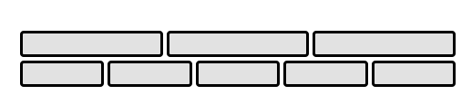
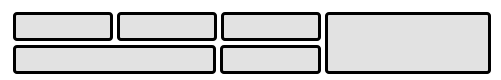
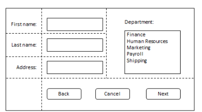
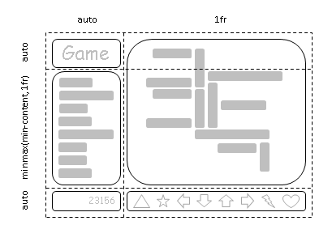
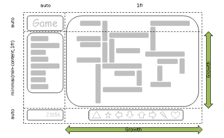
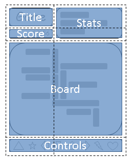
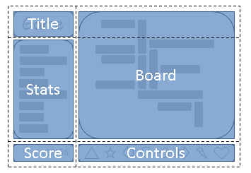

## 1. Введение

*Этот раздел не является нормативным.*

Grid Layout - это модель макета для CSS, которая обладает мощными возможностями для управления размерами и позиционированием блоков и их содержимого. В отличие от Flexible Box Layout, которая ориентирована на одну ось, Grid Layout оптимизирована для двумерных макетов: тех, в которых требуется выравнивание содержимого в обоих измерениях.



Пример макета Flex



Пример репрезентативной сетки

Кроме того, благодаря возможности явного позиционирования элементов в сетке, Grid Layout позволяет кардинально менять визуальную структуру макета, не требуя соответствующих изменений в разметке. Комбинируя медиазапросы со свойствами CSS, которые управляют расположением контейнера сетки и его дочерних элементов, авторы могут адаптировать свои макеты к изменениям форм-факторов устройств, ориентации и доступного пространства, сохраняя при этом более идеальную семантическую структуру контента в презентациях.

Хотя многие макеты могут быть выражены с помощью Grid или Flexbox, у каждого из них есть свои особенности. Grid обеспечивает двумерное выравнивание, использует нисходящий подход к компоновке, позволяет явно перекрывать элементы и имеет более мощные возможности для разметки. Flexbox фокусируется на распределении пространства внутри оси, использует более простой подход к верстке "снизу вверх", может использовать систему обертывания линий на основе размера содержимого для управления вторичной осью и опирается на иерархию разметки для создания более сложных макетов. Предполагается, что оба варианта станут ценными и взаимодополняющими инструментами для авторов CSS.

Grid Level 2 добавляет функцию субсетки: ось с субсеткой - это ось, линии сетки которой совпадают с линиями сетки родительского элемента, и которая получает размеры своих дорожек через эту интеграцию с родительской сеткой.

### 1.1. Предпосылки и мотивация

По мере того как веб-сайты превращались из простых документов в сложные интерактивные приложения, методы верстки документов, например, плавающие элементы, не всегда хорошо подходили для верстки приложений. Используя комбинацию таблиц, JavaScript или тщательные измерения плавающих элементов, авторы находили обходные пути для достижения желаемых макетов. Макеты, адаптированные к доступному пространству, часто были хрупкими и приводили к неинтуитивному поведению, когда пространство становилось ограниченным. В качестве альтернативы авторы многих веб-приложений выбирают фиксированный макет, который не может использовать изменения в доступном пространстве для визуализации на экране.



Пример макета приложения, требующего выравнивания по горизонтали и вертикали.

Возможности сетчатой верстки решают эти проблемы. Она предоставляет авторам механизм для разделения доступного пространства для компоновки на столбцы и строки с использованием набора предсказуемых моделей поведения при изменении размера. Затем авторы могут точно расположить и изменить размер элементов приложения в областях сетки, определенных пересечениями этих столбцов и строк. Следующие примеры иллюстрируют адаптивные возможности сетчатой верстки и то, как она позволяет более четко разделять содержимое и стиль.

### 1.1.1. Адаптация макетов к имеющемуся пространству

Сетчатая разметка может использоваться для интеллектуального изменения размеров элементов на веб-странице. На соседних рисунках представлена игра с пятью основными компонентами в макете: название игры, область статистики, игровое поле, область счета и область управления. По замыслу автора, пространство для игры должно быть разделено таким образом:

- Область статистики всегда располагается сразу под названием игры.
- Справа от статистики и названия появляется игровое поле.
- Верхняя часть названия игры и игровое поле всегда должны быть на одном уровне.
- Нижняя часть игрового поля и нижняя часть области статистики выравниваются, когда игра достигает минимальной высоты. В остальных случаях игровое поле растягивается, чтобы занять все доступное ему пространство.
- Элементы управления расположены по центру игрового поля.
- Верхняя часть области счета выровнена по верхней части области управления.
- Область счета находится под областью статистики.
- Область счета выровнена по отношению к элементам управления под областью статистики.
- Следующий пример расположения сетки показывает, как автор может декларативно достичь всех правил определения размера, размещения и выравнивания.



Пять элементов сетки расположены в соответствии с размером содержимого и доступным пространством.



Рост сети за счет увеличения свободного пространства.

**Пример 1**

```css
/**
 * Определите пространство для каждого элемента сетки, объявив сетку 
 * в контейнере сетки.
 */
#grid {
  /** * Два столбца: 
  * 1. первый имеет размер до содержимого, 
  * 2. второй получает оставшееся пространство 
  * (но никогда не бывает меньше минимального размера доски 
  * или элементов управления игры, которые занимают этот столбец [Рисунок 4]) 
  * 
  * Три строки: 
  * 3. первый имеет размер до содержимого, 
  * 4. средний ряд получает оставшееся пространство 
  * (но никогда не бывает меньше минимальной высоты * доски или областей статистики) 
  * 5. последний имеет размер до содержимого. 
  */
  display: grid;
  grid-template-columns:
    /* 1 */ auto
    /* 2 */ 1fr;
  grid-template-rows:
    /* 3 */ auto
    /* 4 */ 1fr
    /* 5 */ auto;
}

/* Укажите положение каждого элемента сетки, используя координаты в 
* свойствах 'grid-row' и 'grid-column' каждого элемента сетки. 
*/
#title    { grid-column: 1; grid-row: 1; }
#score    { grid-column: 1; grid-row: 3; }
#stats    { grid-column: 1; grid-row: 2; align-self: start; }
#board    { grid-column: 2; grid-row: 1 / span 2; }
#controls { grid-column: 2; grid-row: 3; justify-self: center; }
```

```html
<div id="grid">
  <div id="title">Game Title</div>
  <div id="score">Score</div>
  <div id="stats">Stats</div>
  <div id="board">Board</div>
  <div id="controls">Controls</div>
</div>
```

> ПРИМЕЧАНИЕ: Существует несколько способов задать структуру сетки, а также расположение и размер элементов сетки, каждый из которых оптимизирован для различных сценариев.

### 1.1.2. Независимость источника от порядка

Продолжая предыдущий пример, автор также хочет, чтобы игра адаптировалась к различным устройствам. Кроме того, игра должна оптимизировать расположение компонентов при просмотре в портретной или ландшафтной ориентации (рис. 6 и 7). Комбинируя grid layout с media queries, автор может использовать ту же семантическую разметку, но переставлять расположение элементов независимо от их исходного порядка, чтобы добиться желаемого расположения в обеих ориентациях.

В следующем примере используется способность макета сетки называть пространство, которое будет занято элементом сетки. Это позволяет автору не переписывать правила для элементов сетки при изменении ее определения.



Расположение, подходящее для "портретной" ориентации.



Расположение, подходящее для "альбомной" ориентации.

**Пример 2**

```css
@media (orientation: portrait) {
  #grid {
    display: grid;

    /* Строки, столбцы и области сетки определяются визуально 
    * с помощью свойства grid-template-areas.  Каждая строка - это строка, 
    * а каждое слово - область.  Количество слов в строке 
    * определяет количество столбцов. Обратите внимание, что количество слов 
    * в каждой строке должно быть одинаковым. 
    */
    grid-template-areas: "title stats"
                         "score stats"
                         "board board"
                         "ctrls ctrls";

    /* Способ определения размеров столбцов и строк может быть задан с помощью 
    * свойств grid-template-columns и grid-template-rows. 
    */
    grid-template-columns: auto 1fr;
    grid-template-rows: auto auto 1fr auto;
  }
}

@media (orientation: landscape) {
  #grid {
    display: grid;

    /* Снова свойство шаблона определяет одноименные области, 
    * но на этот раз расположенные по-другому, чтобы лучше соответствовать 
    * альбомной ориентации. 
    */
    grid-template-areas: "title board"
                         "stats board"
                         "score ctrls";

    grid-template-columns: auto 1fr;
    grid-template-rows: auto 1fr auto;
  }
}

/* Свойство grid-area помещает элемент сетки в указанную 
* область сетки. 
*/
#title    { grid-area: title }
#score    { grid-area: score }
#stats    { grid-area: stats }
#board    { grid-area: board }
#controls { grid-area: ctrls }
```

```html
<div id="grid">
  <div id="title">Game Title</div>
  <div id="score">Score</div>
  <div id="stats">Stats</div>
  <div id="board">Board</div>
  <div id="controls">Controls</div>
</div>
```

### 1.2. Определения значений

Данная спецификация следует соглашениям определения свойств CSS из [CSS2], используя синтаксис определения значений из [CSS-VALUES-3]. Типы значений, не определенные в данной спецификации, определены в CSS Values & Units [CSS-VALUES-3]. Комбинация с другими модулями CSS может расширить определения этих типов значений.

В дополнение к специфическим значениям свойств, перечисленным в их определениях, все свойства, определенные в данной спецификации, также принимают в качестве значения свойства общепринятые в CSS ключевые слова. Для удобства чтения они не повторяются в явном виде.
