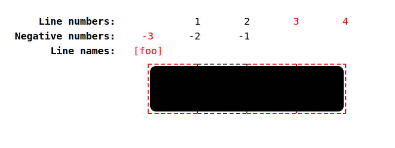

8\. Размещение элементов сетки
------------------------------------

Каждый [элемент сетки](#grid-item) связан с [областью сетки](#grid-area), прямоугольным набором смежных [ячеек сетки](#grid-cell), которые занимает данный элемент сетки. Эта область сетки определяет [содержащий блок](https://www.w3.org/TR/css-display-3/#containing-block) для элемента сетки, внутри которого свойства самовыравнивания ([justify-self](https://www.w3.org/TR/css-align-3/#propdef-justify-self) и [align-self](https://www.w3.org/TR/css-align-3/#propdef-align-self)) определяют их фактическое положение. Ячейки, которые занимает элемент сетки, также влияют на размер строк и столбцов сетки, определенный в [§ 12 Размер сетки](#layout-algorithm).

Расположение [элемента сетки](#grid-item) [области сетки](#grid-area) в [сетке](#grid) определяется его размещением, которое состоит из [позиции сетки](#grid-position) и [диапазона сетки](#grid-span):

позиция сетки

Расположение элемента [сетки](#grid-item) в [сетке](#grid) по каждой оси. Позиция [grid position](#grid-position) может быть как определенной (заданной явно), так и автоматической (определяемой с помощью [auto-placement](#auto-placement)).

размах сетки

Сколько [треков сетки](#grid-track) занимает [элемент сетки](#grid-item) на каждой оси. В [субгрид-оси](#subgridded-axis), если *-начальное или *-конечное значение его [свойства grid-placement](#grid-placement-property) равно auto, то элемент сетки имеет неопределенный диапазон и [определяется](#subgrid-span) из его [&lt;line-name-list&gt;](#typedef-line-name-list). В противном случае [размах сетки](#grid-span) элемента сетки является определенным, по умолчанию равным 1 по каждой оси, если он не может быть определен иначе для этой оси.

Свойства смещения сетки - длинные [grid-row-start](#propdef-grid-row-start), [grid-row-end](#propdef-grid-row-end), [grid-column-start](#propdef-grid-column-start), [grid-column-end](#propdef-grid-column-end), а также их сокращения [grid-row](#propdef-grid-row), [grid-column](#propdef-grid-column) и [grid-area](#propdef-grid-area)- позволяют автору указать [размещение](#grid-item) элемента [сетки](#grid-placement), предоставив любую (или ни одной) из следующих шести частей информации:

| | Row | Column |
| --- | --- | --- |
| Начало | Строка-начало | Строка-начало столбца |
| Конец | строка-конец строки | строка-конец столбца |
| Span | row span | column span |

Определенное значение для любых двух из Start, End и Span в данном измерении подразумевает определенное значение для третьего.

В следующей таблице приведены условия, при которых позиция или диапазон сетки являются _определенными_ или _автоматическими_:

| | Position | Span |
| --- | --- | --- |
| Определенная | По крайней мере, одна указанная линия | Явный, неявный или заданный по умолчанию диапазон. |
| Автоматически | Нет явно указанных строк | N/A |

### 8.1. Общие шаблоны для размещения сетки

Этот раздел носит информационный характер.

Длинные слова [grid-placement property](#grid-placement-property) организованы в три коротких слова:

| | | | |
| --- | --- | --- | --- |
| [grid-area](#propdef-grid-area) | | | | | | |
| [grid-column](#propdef-grid-column) | | | [grid-row](#propdef-grid-row) | | |
| [grid-column-start](#propdef-grid-column-start) | [grid-column-end](#propdef-grid-column-end) | [grid-row-start](#propdef-grid-row-start) | [grid-row-end](#propdef-grid-row-end) |

#### 8.1.1. Именованные области

Элемент может быть помещен в [именованную область сетки](#named-grid-area) (например, созданную шаблоном в [grid-template-areas](#propdef-grid-template-areas)), указав имя области в [grid-area](#propdef-grid-area):

статья {
grid-area: main;
/\* Помещает элемент в область с именем "main". */
}

Элемент также может быть _частично_ выровнен по [именованной области сетки](#named-grid-area), а другие края выровнены по какой-либо другой линии:

.one {
grid-row-start: main;
/\* Выравниваем край начала ряда по краю начала "главной" именованной области. */
}

#### 8.1.2. Числовые индексы и диапазоны

Элементы сетки можно позиционировать и изменять их размер по числам, что особенно полезно для макетов, управляемых сценариями:

.two {
grid-row: 2; /* Поместите элемент во второй ряд. */
grid-column: 3; /* Поместите элемент в третий столбец. */
/\* Эквивалентно grid-area: 2 / 3; */
}

По умолчанию элемент сетки имеет ширину 1. Различные ширины могут быть заданы явно:

.three {
grid-row: 2 / span 5;
/\* Начинается со 2-го ряда,
простирается на 5 рядов вниз (заканчивается в 7-м ряду). */
}

.four {
grid-row: span 5 / 7;
/\* _Заканчивается_ в 7-м ряду,
охватывает 5 рядов вверх (начиная со 2-го ряда). */
}

Примечание: Обратите внимание, что индексы сетки [режим записи](https://www.w3.org/TR/css-writing-modes-4/#writing-mode) являются относительными. Например, в языке с правым расположением букв, таком как арабский, первый столбец - это самый правый столбец.

#### 8.1.3. Именованные строки и отрезки

Вместо подсчета строк по номерам, на строки можно ссылаться по их [имени строки](#line-name):

.five {
grid-column: first / middle;
/\* Промежуток от строки "first" до строки "middle". */
}

Примечание: Обратите внимание, что если [именованная область сетки](#named-grid-area) имеет то же имя, что и [имя линии](#line-name), алгоритм размещения предпочтет использовать линии именованной области сетки.

Если есть несколько линий с одинаковым именем, они фактически создают именованный набор линий сетки, который может быть исключительно индексирован путем фильтрации размещения по имени:

.six {
grid-row: text 5 / text 7;
/\* Промежуток между 5-й и 7-й строками с именем "text". */
grid-row: text 5 / span text 2;
/\* То же самое, что и выше - начинаем с 5-ой строки с названием "text",
затем пройдите еще через две строки "text" до 7-й. */
}

#### 8.1.4. Авторазмещение

Элемент [сетки](#grid-item) может быть автоматически помещен в следующую доступную пустую ячейку [сетки](#grid-cell), увеличивая [сетку](#grid), если в ней не осталось места.

.8 {
grid-area: auto; /* Начальное значение */
}

Это можно использовать, например, для размещения списка распродажных товаров на сайте-каталоге в виде сетки.

Авторазмещение можно комбинировать с явным span, если элемент должен занимать более одной ячейки:

.nine {
grid-area: span 2 / span 3;
/\* Авторазмещение элемента, занимающего две строки и три столбца. */
}

Управляет ли алгоритм [авторазмещения](#grid-item-placement-algorithm) поиском по строкам и добавлением строк, или поиском по столбцам и добавлением столбцов, свойство [grid-auto-flow](#propdef-grid-auto-flow).

Примечание: По умолчанию [алгоритм автоматического размещения](#grid-item-placement-algorithm) просматривает сетку линейно, не возвращаясь назад; если ему придется пропустить несколько пустых мест, чтобы разместить больший элемент, он не будет возвращаться, чтобы заполнить эти места. Чтобы изменить это поведение, укажите ключевое слово [dense](#valdef-grid-auto-flow-dense) в [grid-auto-flow](#propdef-grid-auto-flow).

### 8.2. Размещение элементов сетки в сравнении с порядком источника

> "С большой силой приходит большая ответственность".

Возможности свойств [grid-placement](#grid-placement-property) позволяют свободно располагать и переупорядочивать содержимое внутри [grid](#grid), так что визуальное представление может быть в значительной степени отделено от порядка исходного документа. Эти возможности дают автору большую свободу в адаптации визуализации к различным устройствам и способам представления, например, с помощью [media queries](https://www.w3.org/TR/mediaqueries-5/#media-query). Однако **они не заменяют правильного упорядочивания источников**.

Правильный порядок источников важен для речи, для последовательной навигации (например, клавиатурной), а также для UA, не связанных с CSS, таких как поисковые системы, тактильные браузеры и т. д. Размещение сетки _только_ влияет на визуальное представление! Это позволяет авторам оптимизировать исходный текст документа для не-CSS/невизуальных режимов взаимодействия и использовать технику размещения сетки для дальнейших манипуляций с визуальным представлением, чтобы оставить порядок исходного текста нетронутым.

### 8.3. Размещение на основе строк: свойства [grid-row-start](#propdef-grid-row-start), [grid-column-start](#propdef-grid-column-start), [grid-row-end](#propdef-grid-row-end) и [grid-column-end](#propdef-grid-column-end)

| | |
| --- | --- |
| Имя: | grid-row-start, grid-column-start, grid-row-end, grid-column-end |
| [Значение:](https://www.w3.org/TR/css-values/#value-defs) | [&lt;grid-line&gt;](#typedef-grid-row-start-grid-line "Расширяется до: <custom-ident> \| <integer> && <custom-ident>? \| auto \| span && [ <integer> \| <custom-ident> ]") |
| [Initial:](https://www.w3.org/TR/css-cascade/#initial-values) | auto | |
| Применяется к: | [элементам сетки](#grid-item) и абсолютно позиционированным блокам, чей содержащий блок является [контейнером сетки](#grid-container)|.
| [Наследуется:](https://www.w3.org/TR/css-cascade/#inherited-property) | нет |
| [Проценты:](https://www.w3.org/TR/css-values/#percentages) | n/a |
| [Вычисленное значение:](https://www.w3.org/TR/css-cascade/#computed)| указанное ключевое слово, идентификатор и/или целое число |
| Канонический порядок: | согласно грамматике |
| [Тип анимации:](https://www.w3.org/TR/web-animations/#animation-type) | дискретный |

[&lt;grid-line&gt;](#typedef-grid-row-start-grid-line "Расширяется до: <custom-ident> | <integer> && <custom-ident>? | auto | span && [ <integer> || <custom-ident> ]") =
auto [|](https://www.w3.org/TR/css-values-4/#comb-one)
[&lt;custom-ident&gt;](https://www.w3.org/TR/css-values-4/#identifier-value) [|](https://www.w3.org/TR/css-values-4/#comb-one)
\[ [&lt;integer&gt;](https://www.w3.org/TR/css-values-3/#integer-value) [&&](https://www.w3.org/TR/css-values-4/#comb-all) [&lt;custom-ident&gt;](https://www.w3.org/TR/css-values-4/#identifier-value)[?](https://www.w3.org/TR/css-values-4/#mult-opt)\] [|](https://www.w3.org/TR/css-values-4/#comb-one)
\[ span [&&](https://www.w3.org/TR/css-values-4/#comb-all)\[ [&lt;integer&gt;](https://www.w3.org/TR/css-values-3/#integer-value) [||](https://www.w3.org/TR/css-values-4/#comb-any) [&lt;custom-ident&gt;](https://www.w3.org/TR/css-values-4/#identifier-value)\] \]

[grid-row-start](#propdef-grid-row-start), [grid-column-start](#propdef-grid-column-start), [grid-row-end](#propdef-grid-row-end), и [grid-column-end](#propdef-grid-column-end) свойства определяют размер и расположение [элемента сетки](#grid-item) в [сетке](#grid), внося линию, промежуток или ничего (автоматически) в его [размещение сетки](#grid-placement), тем самым указывая [inline-start](https: //www. w3.org/TR/css-writing-modes-4/#inline-start), [block-start](https://www.w3.org/TR/css-writing-modes-4/#block-start), [inline-end](https://www.w3.org/TR/css-writing-modes-4/#inline-end) и [block-end](https://www.w3.org/TR/css-writing-modes-4/#block-end) края его [grid area](#grid-area).

Значения имеют следующие значения:

[&lt;custom-ident&gt;](https://www.w3.org/TR/css-values-4/#identifier-value)

Первая попытка сопоставить край [области сетки](#grid-area) с [именованной областью сетки](#named-grid-area): если существует [линия сетки](#grid-line), чье [имя линии](#line-name) равно [&lt;custom-ident&gt;](https://www.w3. org/TR/css-values-4/#identifier-value)-start (для grid-*-start) / [&lt;custom-ident&gt;](https://www.w3.org/TR/css-values-4/#identifier-value)-end (для grid-*-end), вносит первую такую строку в [размещение](#grid-item) элемента [сетки](#grid-placement).

Примечание: [Именованные области сетки](#named-grid-area) автоматически генерируют [неявно назначенные имена линий](#implicitly-assigned-line-name) такой формы, поэтому указание [grid-row-start: foo](#propdef-grid-row-start) выберет начальный край этой именованной области сетки (если перед ней не была явно указана другая строка с именем foo-start).

В противном случае это будет выглядеть так, как если бы вместе с [&lt;custom-ident&gt;](https://www.w3.org/TR/css-values-4/#identifier-value) было указано целое число 1.

[&lt;integer&gt;](https://www.w3.org/TR/css-values-3/#integer-value) && [&lt;custom-ident&gt;](https://www.w3.org/TR/css-values-4/#identifier-value)?

Добавляет N-ую [линию сетки](#grid-line) к [размещению](#grid-item) элемента [сетки](#grid-placement). Если задано отрицательное целое число, то отсчет ведется в обратном порядке, начиная с конечного края [явной сетки](#explicit-grid).

Если имя задано как [&lt;custom-ident&gt;](https://www.w3.org/TR/css-values-4/#identifier-value), подсчитываются только линии с этим именем. Если линий с таким именем недостаточно, то для нахождения данной позиции предполагается, что все линии [неявной сетки](#implicit-grid-lines) имеют это имя.

Значение [&lt;integer&gt;](https://www.w3.org/TR/css-values-3/#integer-value), равное нулю, делает объявление недействительным.

span && \[ [&lt;integer&gt;](https://www.w3.org/TR/css-values-3/#integer-value) || [&lt;custom-ident&gt;](https://www.w3.org/TR/css-values-4/#identifier-value) \]

Добавляет [grid span](#grid-span) к [размещению](#grid-item) элемента сетки так, чтобы соответствующий край [области сетки](#grid-area) элемента сетки находился на расстоянии N линий от противоположного края в соответствующем направлении. Например, [grid-column-end: span 2](#propdef-grid-column-end) указывает на вторую линию сетки в направлении в конец от линии [grid-column-start](#propdef-grid-column-start).

Если имя задано как [&lt;custom-ident&gt;](https://www.w3.org/TR/css-values-4/#identifier-value), учитываются только линии с таким именем. Если строк с таким именем недостаточно, предполагается, что все линии [неявной сетки](#implicit-grid-lines) на стороне [явной сетки](#explicit-grid), соответствующей направлению поиска, имеют это имя для целей подсчета этого пролета.

Например, при следующих объявлениях:

.grid { grid-template-columns: 100px; }
.griditem { grid-column: span foo / 4; }

Контейнер [grid](#grid-container) имеет [явную сетку](#explicit-grid) с двумя линиями сетки, пронумерованными 1 и 2. Край конца столбца [элемента сетки](#grid-item) указан на строке 4, поэтому в конце [неявной сетки](#implicit-grid) генерируются две строки.

Начальный край столбца должен быть первой строкой "foo", которую он может найти в начале этой строки. Однако в сетке нет строки "foo", поэтому единственная возможность - это строка в [неявной сетке](#implicit-grid). Строка 3 не подходит, потому что она находится на торцевой стороне [явной сетки](#explicit-grid), а пролет [grid-column-start](#propdef-grid-column-start) заставляет ее искать в начале. Таким образом, единственным вариантом является создание неявной сеткой линии на начальной стороне явной сетки.

Иллюстрация результата.

Если параметр [&lt;integer&gt;](https://www.w3.org/TR/css-values-3/#integer-value) опущен, то по умолчанию он равен 1. Отрицательные целые числа или ноль недопустимы.

auto

Свойство не вносит никакого вклада в [размещение](#grid-item) элемента сетки, указывая [авторазмещение](#grid-placement) или значение по умолчанию равное единице. (См. [§ 8 Размещение элементов сетки](#placement), выше.)

Во всех приведенных выше постановках [&lt;custom-ident&gt;](https://www.w3.org/TR/css-values-4/#identifier-value) дополнительно исключает ключевые слова span и auto.

Дана сетка с одной строкой, 8 столбцами и следующими 9 именованными строками:

1 2 3 4 5 6 7 8 9
+--+--+--+--+--+--+--+--+
| | | | | | | | |
A B C A B C A B C
| | | | | | | | |
+--+--+--+--+--+--+--+--+

Следующие объявления размещают элемент сетки между строками, обозначенными индексом:

grid-column-start: 4; grid-column-end: auto;
/\* От строки 4 до строки 5 */

grid-column-start: auto; grid-column-end: 6;
/\* С 5 по 6 строку */

grid-column-start: C; grid-column-end: C -1;
/\* Со строки 3 по строку 9 */

grid-column-start: C; grid-column-end: span C;
/\* С 3 по 6 строку */

grid-column-start: span C; grid-column-end: C -1;
/\* Со строки 6 по строку 9 */

grid-column-start: span C; grid-column-end: span C;
/\* Ошибка: Конечный диапазон игнорируется, и автоматически размещаемый
элемент не может переместиться в именованную строку.
Эквивалентно [grid-column: span 1;](#propdef-grid-column). */

grid-column-start: 5; grid-column-end: C -1;
/\* Со строки 5 по строку 9 */

grid-column-start: 5; grid-column-end: span C;
/\* Со строки 5 по строку 6 */

grid-column-start: 8; grid-column-end: 8;
/\* Ошибка: от строки 8 до строки 9 */

grid-column-start: B 2; grid-column-end: span 1;
/\* От строки 5 до строки 6 */

#### 8.3.1. Обработка конфликтов при размещении сетки

Если [размещение](#grid-placement) для [элемента сетки](#grid-item) содержит две строки, и [начальная](https://www.w3.org/TR/css-writing-modes-3/#start) строка находится дальше от конца, чем [конечная](https://www.w3.org/TR/css-writing-modes-3/#end) строка, поменяйте эти две строки местами. Если начальная строка _равна_ конечной, удалите конечную строку.

Если [размещение](#grid-placement) содержит два отрезка, удалите тот, на который влияет [end](https://www.w3.org/TR/css-writing-modes-3/#end) [свойство grid-placement](#grid-placement-property).

Если [размещение](#grid-placement) содержит только пролет для именованной строки, замените его пролетом, равным 1.

### 8.4. Краткие обозначения размещения: свойства [grid-column](#propdef-grid-column), [grid-row](#propdef-grid-row) и [grid-area](#propdef-grid-area)

| | |
| --- | --- |
| Имя: | grid-row, grid-column |
| [Значение:](https://www.w3.org/TR/css-values/#value-defs) | [&lt;grid-line&gt;](#typedef-grid-row-start-grid-line "Расширяется до: <custom-ident> \| <integer> && <custom-ident>? \| auto \| span && [ <integer> \| <custom-ident> ]") \[ / &lt;grid-line&gt; \][?](https://www.w3.org/TR/css-values-4/#mult-opt) |
| [Initial:](https://www.w3.org/TR/css-cascade/#initial-values) | auto | |
| Применяется к: | [элементам сетки](#grid-item) и абсолютно позиционированным блокам, чей содержащий блок является [контейнером сетки](#grid-container)|.
| [Наследуется:](https://www.w3.org/TR/css-cascade/#inherited-property) | нет |
| [Проценты:](https://www.w3.org/TR/css-values/#percentages) | нет/нет |
| [Вычисленное значение:](https://www.w3.org/TR/css-cascade/#computed) | см. отдельные свойства |
| [Тип анимации:](https://www.w3.org/TR/web-animations/#animation-type) | дискретный |
| Канонический порядок: | по грамматике |

Свойства [grid-row](#propdef-grid-row) и [grid-column](#propdef-grid-column) являются сокращением для [grid-row-start](#propdef-grid-row-start)/[grid-row-end](#propdef-grid-row-end) и [grid-column-start](#propdef-grid-column-start)/[grid-column-end](#propdef-grid-column-end), соответственно.

Если два [&lt;grid-line&gt;](#typedef-grid-row-start-grid-line "Expands to: <custom-ident> | <integer> && <custom-ident>? | auto | span && [ <integer> || <custom-ident> ]") указаны значения, то длинная строка [grid-row-start](#propdef-grid-row-start)/[grid-column-start](#propdef-grid-column-start) устанавливается на значение перед слешем, а длинная строка [grid-row-end](#propdef-grid-row-end)/[grid-column-end](#propdef-grid-column-end) устанавливается на значение после слеша.

Если второе значение опущено, то если первое значение - это [&lt;custom-ident&gt;](https://www.w3.org/TR/css-values-4/#identifier-value), то для отрезка [grid-row-end](#propdef-grid-row-end)/[grid-column-end](#propdef-grid-column-end) также устанавливается этот &lt;custom-ident&gt;; в противном случае устанавливается [auto](#grid-placement-auto).

| | |
| --- | --- |
| Имя: | grid-area |
| [Значение:](https://www.w3.org/TR/css-values/#value-defs) | [&lt;grid-line&gt;](#typedef-grid-row-start-grid-line "Расширяется до: <custom-ident> \| <integer> && <custom-ident>? \| auto \| span && [ <integer> \| <custom-ident> ]") \[ / &lt;grid-line&gt; \][{0,3}](https://www.w3.org/TR/css-values-4/#mult-num-range)|
| [Initial:](https://www.w3.org/TR/css-cascade/#initial-values) | auto | |
| Применяется к: | [элементам сетки](#grid-item) и абсолютно позиционированным боксам, чей содержащий блок является [контейнером сетки](#grid-container)|.
| [Наследуется:](https://www.w3.org/TR/css-cascade/#inherited-property) | нет |
| [Проценты:](https://www.w3.org/TR/css-values/#percentages) | нет/нет |
| [Вычисленное значение:](https://www.w3.org/TR/css-cascade/#computed) | см. отдельные свойства |
| [Тип анимации:](https://www.w3.org/TR/web-animations/#animation-type) | дискретный |
| Канонический порядок: | по грамматике |

Свойство [grid-area](#propdef-grid-area) является [сокращением](https://www.w3.org/TR/css-cascade-4/#shorthand-property) для [grid-row-start](#propdef-grid-row-start), [grid-column-start](#propdef-grid-column-start), [grid-row-end](#propdef-grid-row-end) и [grid-column-end](#propdef-grid-column-end).

Если четыре [&lt;grid-line&gt;](#typedef-grid-row-start-grid-line "Расширяется до: <custom-ident> | <integer> && <custom-ident>? | auto | span && [ <integer> || <custom-ident> ]") указаны значения, [grid-row-start](#propdef-grid-row-start) устанавливается на первое значение, [grid-column-start](#propdef-grid-column-start) устанавливается на второе значение, [grid-row-end](#propdef-grid-row-end) устанавливается на третье значение, и [grid-column-end](#propdef-grid-column-end) устанавливается на четвертое значение.

Когда [grid-column-end](#propdef-grid-column-end) опущен, если [grid-column-start](#propdef-grid-column-start) - это [&lt;custom-ident&gt;](https://www.w3.org/TR/css-values-4/#identifier-value), grid-column-end устанавливается на этот &lt;custom-ident&gt;; в противном случае устанавливается значение [auto](#grid-placement-auto).

Когда [grid-row-end](#propdef-grid-row-end) опущен, если [grid-row-start](#propdef-grid-row-start) - это [&lt;custom-ident&gt;](https://www.w3.org/TR/css-values-4/#identifier-value), grid-row-end устанавливается на этот &lt;custom-ident&gt;; в противном случае устанавливается на [auto](#grid-placement-auto).

Когда [grid-column-start](#propdef-grid-column-start) опущен, если [grid-row-start](#propdef-grid-row-start) - это [&lt;custom-ident&gt;](https://www.w3.org/TR/css-values-4/#identifier-value), все четыре длинные строки устанавливаются в это значение. В противном случае устанавливается значение [auto](#grid-placement-auto).

Примечание: Порядок разрешения для этого сокращения - row-start/column-start/row-end/column-end, что для LTR-страниц идет против часовой стрелки, в противоположном направлении от соответствующих 4-краевых свойств, использующих физические направления, например [margin](https://www.w3.org/TR/CSS2/box.html#propdef-margin).

### 8.5. Алгоритм размещения элементов сетки

Следующий алгоритм размещения элементов сетки разрешает [автоматические позиции](#automatic-grid-position) [элементов сетки](#grid-item) в [определенные позиции](#definite-grid-position), гарантируя, что каждый элемент сетки имеет четко определенную [область сетки](#grid-area) для размещения. ([Размахи сетки](#grid-span) не требуют специального разрешения; если они не указаны явно, по умолчанию они равны 1).

Примечание: Этот алгоритм может привести к созданию новых строк или столбцов в [неявной сетке](#implicit-grid), если в [явной сетке](#explicit-grid) нет места для размещения автопозиционируемого [элемента сетки](#grid-item).

Каждая ячейка [сетки](#grid-cell) (как в [явной](#explicit-grid), так и в [неявной сетке](#implicit-grid)) может быть занята или не занята. Ячейка является [занятой](#occupied), если она покрыта [областью сетки](#grid-area) элемента [сетки](#grid-item) с [определенной позицией сетки](#definite-grid-position); в противном случае ячейка является [незанятой](#unoccupied). Статус занятой/незанятой ячейки может меняться во время выполнения этого алгоритма.

Для наглядности этот алгоритм написан в предположении, что для [grid-auto-flow](#propdef-grid-auto-flow) задана [row](#valdef-grid-auto-flow-row). Если вместо этого указано [column](#valdef-grid-auto-flow-column), поменяйте местами все упоминания строк и столбцов, inline и block и т. д. в этом алгоритме.

Примечание: Алгоритм [автоматического размещения](#grid-item-placement-algorithm) работает с [элементами сетки](#grid-item) в [измененном порядке документов](https://www.w3.org/TR/css-flexbox-1/#order-modified-document-order), а не с их исходным порядком документов.

0.  **Генерировать анонимные элементы сетки**, как описано в [§ 6 Элементы сетки](#grid-items). (Анонимные [элементы сетки](#grid-item) всегда размещаются автоматически, поскольку для их полей не могут быть заданы свойства [grid-placement](#grid-placement-property)).

1.  **Поместите все, что не помещается автоматически.**

2.  **Обработайте элементы, привязанные к данной строке.**

    Для каждого [элемента сетки](#grid-item) с [определенной позицией строки](#definite-grid-position) (то есть свойства [grid-row-start](#propdef-grid-row-start) и [grid-row-end](#propdef-grid-row-end) определяют определенную позицию сетки), в [порядке, измененном порядком документов](https://www.w3.org/TR/css-flexbox-1/#order-modified-document-order):

    "разреженная" упаковка (поведение по умолчанию)

    Устанавливает начальную строку столбца своего [размещения](#grid-placement) на самый ранний (наименьший положительный индекс) индекс строки, который гарантирует, что [область сетки](#grid-area) этого элемента не будет перекрывать какие-либо [занятые](#occupied) ячейки сетки и который находится после любых [элементов сетки](#grid-item), ранее размещенных в этой строке на этом шаге.

    "Плотная" упаковка ([dense](#valdef-grid-auto-flow-dense) specified)

    Установите начальную строку столбца [размещения](#grid-placement) на самый ранний (наименьший положительный индекс) индекс строки, который гарантирует, что [область сетки](#grid-area) этого элемента не будет перекрывать какие-либо [занятые](#occupied) ячейки сетки.

3.  **Определите столбцы в неявной сетке*.

    Создайте столбцы в [неявной сетке](#implicit-grid):

1.  Начните со столбцов из [явной сетки](#explicit-grid).

2.  Среди всех элементов с [определенной позицией столбца](#definite-grid-position) (явно позиционированные элементы, элементы, позиционированные на предыдущем шаге, и элементы, еще не позиционированные, но с определенным столбцом) добавьте столбцы в начало и конец [неявной сетки](#implicit-grid), необходимые для размещения этих элементов.

3.  Если наибольший [диапазон столбцов](#grid-span) среди всех элементов, не имеющих [определенного положения столбцов](#definite-grid-position), больше ширины [неявной сетки](#implicit-grid), добавьте столбцы в конец неявной сетки, чтобы учесть этот диапазон столбцов.

    Например, в следующем фрагменте стиля:
    
    #grid {
      display: grid;
      grid-template-columns: repeat(5, 100px);
      grid-auto-flow: row;
    }
    #grid-item {
      grid-column: 4 / span 3;
    }
    
    Количество необходимых колонок равно 6. В [явной сетке](#explicit-grid) предусмотрено 5 колонок (из [grid-template-columns](#propdef-grid-template-columns)) со строками с 1 по 6, но положение колонки `#grid-item` означает, что она заканчивается на строке 7, что требует дополнительной колонки, добавленной в конец [неявной сетки](#implicit-grid).

4.  **Разместите оставшиеся элементы сетки.**.

    Курсор автоматического перемещения определяет текущую "точку вставки" в сетку, заданную как пара строк и столбцов [линий сетки](#grid-line). Изначально [курсор автосмещения](#auto-placement-cursor) устанавливается на самые начальные строки и столбцы [неявной сетки](#implicit-grid).

    Используемое значение [grid-auto-flow](#propdef-grid-auto-flow) определяет способ расположения элементов:

    "разреженная" упаковка (поведение по умолчанию)

    Для каждого элемента [сетки](#grid-item), который не был позиционирован предыдущими шагами, в [порядке, измененном порядком документов](https://www.w3.org/TR/css-flexbox-1/#order-modified-document-order):

    Если элемент имеет [определенную позицию в столбце](#definite-grid-position):

1.  Установите позицию столбца [курсора](#auto-placement-cursor) на строку начала столбца [элемента сетки](#grid-item). Если это меньше, чем предыдущая позиция курсора в столбце, увеличьте позицию строки на 1.

2.  Увеличивайте позицию строки [курсора](#auto-placement-cursor) до тех пор, пока не будет найдено значение, при котором [элемент сетки](#grid-item) не перекрывает ни одной [занятой](#occupied) ячейки сетки (при необходимости создавая новые строки в [неявной сетке](#implicit-grid)).

3.  Установите начальную строку элемента на позицию строки [курсора](#auto-placement-cursor) и установите конечную строку элемента в соответствии с его расстоянием от этой позиции.

    Если элемент имеет [автоматическую позицию сетки](#automatic-grid-position) по обеим осям:
    
    1.  Увеличивайте позицию столбца [курсора автоматического перемещения](#auto-placement-cursor) до тех пор, пока либо область [сетки](#grid-area) этого элемента не перекроет ни одной [занятой](#occupied) ячейки сетки, либо позиция столбца курсора плюс расстояние между столбцами элемента не превысят количество столбцов в неявной сетке, определенное ранее в этом алгоритме.
        
    2.  Если на предыдущем шаге была найдена неперекрывающаяся позиция, установите строки начала строки и начала столбца элемента в позицию [курсора](#auto-placement-cursor). В противном случае увеличьте позицию строки курсора автоматического перемещения (при необходимости создавая новые строки в [неявной сетке](#implicit-grid)), установите его позицию столбца на самую начальную строку столбца в неявной сетке и вернитесь к предыдущему шагу.
        
    
    "Плотная" упаковка ([dense](#valdef-grid-auto-flow-dense) specified)
    
    Для каждого элемента [сетки](#grid-item), который не был позиционирован предыдущими шагами, в [порядке, измененном порядком документов](https://www.w3.org/TR/css-flexbox-1/#order-modified-document-order):
    
    Если элемент имеет [определенную позицию столбца](#definite-grid-position):
    
    1.  Установите позицию строки курсора на самую начальную строку в [неявной сетке](#implicit-grid). Установите позицию курсора в столбце на начальную строку столбца [элемента сетки](#grid-item).
        
    2.  Увеличивайте позицию строки [курсора автоматического перемещения](#auto-placement-cursor) до тех пор, пока не будет найдено значение, при котором [элемент сетки](#grid-item) не перекрывает ни одной [занятой](#occupied) ячейки сетки (при необходимости создавая новые строки в [неявной сетке](#implicit-grid)).
        
    3.  Установите индекс строки начала строки элемента на позицию строки [курсора](#auto-placement-cursor). (Неявно установите также строку конца строки элемента в соответствии с его диапазоном).
        
    
    Если элемент имеет [автоматическую позицию сетки](#automatic-grid-position) по обеим осям:
    
    1.  Установите позиции строк и столбцов курсора на крайние начальные линии строк и столбцов в [неявной сетке](#implicit-grid).
        
    2.  Увеличивайте позицию столбца [курсора автоматического перемещения](#auto-placement-cursor) до тех пор, пока либо область [сетки](#grid-area) этого элемента не перекроет ни одной [занятой](#occupied) ячейки сетки, либо позиция столбца курсора плюс размах столбца элемента не превысят количество столбцов в неявной сетке, определенное ранее в этом алгоритме.
        
    3.  Если на предыдущем шаге была найдена неперекрывающаяся позиция, установите строки начала строки и начала столбца элемента в позицию [курсора](#auto-placement-cursor). В противном случае увеличьте позицию строки курсора автозамещения (при необходимости создавая новые строки в [неявной сетке](#implicit-grid)), сбросьте его позицию столбца на самую начальную строку столбца в неявной сетке и вернитесь к предыдущему шагу.
