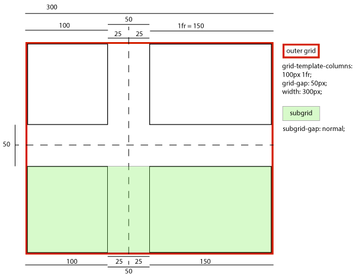
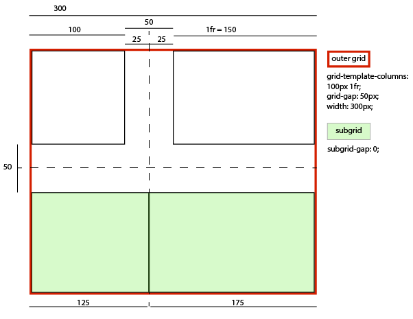
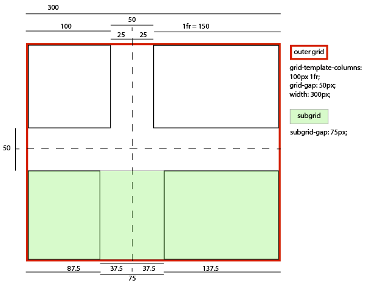

9\. Subgrids
-------------------------

Подсетка [subgrid](#subgrid) ведёт себя так же, как и обычный контейнер [grid-container](#grid-container), за исключением того, что:

* Размещение [subgrid](#subgrid) создает соответствие между его [subgridded](#subgridded-axis) дорожками и теми, которые он охватывает в его [parent grid](#parent-grid). Линии сетки, разделяемые таким образом между подсеткой и ее родителем, образуют [явную сетку](#explicit-grid) подсетки, а размеры ее дорожек определяются родительской сеткой.
* Число явных дорожек в [подсеточке](#subgrid) в измерении [subgridded](#subgridded-axis) всегда соответствует числу дорожек [сетки](#grid-track), которые она охватывает в своей родительской [сетке](#grid):
  * Если [размах сетки](#subgrid) [подсеток](#grid-span) в подсеточном измерении определен, то количество явных путей в каждом подсеточном измерении берется из его используемого размаха сетки в этом измерении (независимо от его свойств grid-template-*).
  * Если ось имеет [неопределенный диапазон сетки](#indefinite-grid-span), то ее используемый [диапазон сетки](#grid-span) берется из числа явных дорожек, заданных для этой оси свойствами grid-template-*, равного единице.
* Свойства [grid-placement](#grid-placement-property) элементов [grid items](#subgrid) и используемые ими номера линий привязываются к линиям, охватываемым подсеточкой, в точном соответствии с тем, что линии вне подсеточки исключаются из ее [explicit grid](#explicit-grid). Например, числовые индексы отсчитываются, начиная с первой строки подсетки, а не с первой строки [родительской сетки](#parent-grid).

  Правила нумерации и размещения строк подчиняются собственному [режиму записи](#subgrid) [subgrid](https://www.w3.org/TR/css-writing-modes-4/#writing-mode), как и для вложенной независимой сетки.

* Поскольку [подсетки](#subgrid) могут быть размещены до размещения их содержимого, линии [подсеток](#subgridded-axis) автоматически получают [явно назначенные имена линий](#explicitly-assigned-line-name), указанные на соответствующих линиях родительской [сетки](#grid).

  Эти имена являются дополнением к любым [именам линий](#line-name), указанным локально на [подсеточке](#subgrid).

*  Когда [подсетка](#subgrid) перекрывает [именованную область сетки](#named-grid-area) в своем родителе, которая была создана объявлением свойства [grid-template-areas](#propdef-grid-template-areas), [неявно назначенные имена линий](#implicitly-assigned-line-name) назначаются для представления именованной области сетки родителя внутри подсетки.

  Примечание: Если область [именованной сетки](#named-grid-area) лишь частично перекрывает [подсетку](#subgrid), ее [неявно назначенные имена линий](#implicitly-assigned-line-name) будут назначены первой и/или последней строке подсетки так, чтобы существовала область именованной сетки, представляющая эту частично перекрытую область подсетки; таким образом, назначения [имен линий](#line-name) подсетки могут не всегда точно соответствовать назначениям имен линий родительской [сетки](#grid).

  Эти имена также являются _дополнением_ к любым [именам строк](#line-name), заданным локально на [подсеточке](#subgrid).

  В следующем примере 4-колоночная большая родительская сетка имеет как явные имена строк, так и неявные, генерируемые [grid-template-areas](#propdef-grid-template-areas):

  &lt;style type="css"&gt;
  .outer {
  отображение: сетка;
  grid-template-columns:
  \[outer-edge\] 20px \[main-start\] 1fr \[center\] 1fr max-content \[main-end\];
  grid-template-areas:
  "gutter info info photos";
  }
  .middle {
  grid-column: main-start / main-end;
  display: grid;
  grid: subgrid / subgrid;
  }
  .inner {
  grid-column: center / -1;
  отображение: сетка;
  grid: subgrid / subgrid;
  }
  &lt;/style&gt;

  &lt;div class="outer"&gt;
  &lt;div class="middle"&gt;
  &lt;div class="inner"&gt; &hellip;&lt;/div&gt;
  &lt;/div&gt;
  &lt;/div&gt;

  После всех типов разрешения имен, имена для каждой сетки будут такими:

  .outer = \[outer-edge gutter-start\] \[gutter-end info-start main-start\] \[center\] \[info-end photos-start\] \[main-end photos-end\]
  .middle = \[info-start main-start\] \[center\] \[info-end photos-start\] \[main-end photos-end\]
  .inner = \[center info-start\] \[info-end photos-start\] \[main-end photos-end\]

  Обратите внимание, что все [явно назначенные имена линий](#explicitly-assigned-line-name) наследуются прямо через .inner, но [неявно назначенные имена линий](#implicitly-assigned-line-name) рассчитываются на основе перекрытия каждой [подсетки](#subgrid) исходной [именованной области сетки](#named-grid-area).

* У [подсеток](#subgrid) нет никаких [неявных путей сетки](#implicit-grid-track) в измерении(ях) [subgridded](#subgridded-axis). Гипотетические [неявные линии сетки](#implicit-grid-lines) используются для разрешения размещения как обычно, когда [явная сетка](#explicit-grid) не имеет достаточно линий; однако каждый [элемент сетки](#grid-item) [область сетки](#grid-area) [зажимается](#clamp-a-grid-area) к явной сетке подсетей (используя ту же процедуру, что и для зажима размещения в чрезмерно большой сетке).

  Например, если в подсетке с диапазоном 1 есть [элемент сетки](#grid-item) с [grid-column: 2 / span 3;](#propdef-grid-column), то этот элемент вместо этого будет принудительно помещен (и ограничен) первой (единственной) дорожкой в подсетке.

* Сама [подсетка](#subgrid) выстраивается как обычный [элемент сетки](#grid-item) в своей [родительской сетке](#parent-grid), но действует так, как будто она совершенно пустая для целей определения размеров дорожек в измерении [subgridded](#subgridded-axis).
* Собственные [элементы сетки](#subgrid) участвуют в определении размеров [subgridded](#subgridded-axis) и выравниваются с ней в этих измерениях.

  В этом процессе сумма полей, подкладок и границ [подсеток](#subgrid) на каждом краю применяется как дополнительный слой (потенциально отрицательный) полей к элементам на этих краях. Этот дополнительный слой "маржи" накапливается на нескольких уровнях подсеток.

  Например, если у нас есть сетка 3×3 со следующими дорожками:

  #parent-grid { grid-template-columns: 300px auto 300px; }

  Если подсетка занимает последние две дорожки, ее первые два столбца соответствуют последним двум столбцам родительской сетки, и любые элементы, размещенные на этих дорожках, участвуют в изменении размеров родительской сетки. В частности, элемент, расположенный на первой дорожке подсеточки, влияет на авторазмер средней дорожки родительской сетки.

  #subgrid { grid-column: 2 / span 2; } /* охватывают 2-ю и 3-ю дорожки родительской сетки */
  #subgrid > :first-child { grid-column: 1; } /* 1-я дорожка субгрида, 2-я дорожка родительского грида */

  Если у подсеток есть поля/границы/отступы, размер этих полей/границ/отступов также влияет на размер. Например, если у подсеточки есть 100px padding:

  #subgrid { padding: 100px; }

  Тогда элемент [сетки](#grid-item) на первой дорожке [subgrid](#subgrid) ведет себя так, как будто у него есть дополнительные 100px верхнего, левого и нижнего полей, влияя на размеры дорожек родительской сетки и на позицию самого элемента сетки.

  Тем временем половина разницы между [желобами](https://www.w3.org/TR/css-align-3/#gutter) [subgrid](#subgrid) ([row-gap](https://www.w3.org/TR/css-align-3/#propdef-row-gap)/[column-gap](https://www.w3.org/TR/css-align-3/#propdef-column-gap)) и желобами [parent grid](#parent-grid) применяется в качестве дополнительного слоя (потенциально отрицательного) поля к элементам, не находящимся на этих краях. Этот дополнительный слой "маржи" также накапливается на нескольких уровнях подсеток. Значение [normal](https://www.w3.org/TR/css-align-3/#valdef-row-gap-normal) означает, что подсетка имеет желоба того же размера, что и ее родительская сетка, т. е. применяемая разница равна нулю.

  Примечание: В результате дорожки родительской сетки будут иметь указанный размер, а [желоба](#subgrid) [subgrid](https://www.w3.org/TR/css-align-3/#gutter) будут визуально выровнены по центру с желобами [родительской сетки](#parent-grid).

  

  Например, предположим, что у нас есть внешняя сетка шириной 300px с промежутками 50px, а ее столбцы заданы как 100px 1fr. Подсетка, охватывающая обе дорожки, будет иметь...

  ... если бы ее [column-gap](https://www.w3.org/TR/css-align-3/#propdef-column-gap) был [normal](https://www.w3.org/TR/css-align-3/#valdef-row-gap-normal) (или 50px):

  * Элемент сетки в левом столбце, размер и расположение которого (и вклад его размера в расчеты размера родительской сетки) не требует специальной настройки, растягиваясь до 100px в ширину и оставаясь выровненным по левому краю подсетки.
  * Элемент сетки в правой колонке, размер и расположение которого (и его вклад в расчеты размера родительской сетки) не требует специальной настройки, растягивается до 150px в ширину, оставаясь выровненным по правому краю подсетки.
  * Эффективный визуальный [gutter](https://www.w3.org/TR/css-align-3/#gutter) между элементами составляет 50px, точно соответствуя родительской сетке.

  

  ... если бы его [column-gap](https://www.w3.org/TR/css-align-3/#propdef-column-gap) был равен 0:

  * Элемент сетки в левом столбце имеет размер и расположение (и вносит свой размер в расчеты размера родительской сетки), как если бы у него было -25px правое поле, таким образом растягиваясь до 125px в ширину, оставаясь выровненным по левому краю подсетки.
  * Элемент сетки в правой колонке, размещенный и расположенный (и вносящий свой размер в расчеты размеров родительской сетки) так, как если бы у него было -25px левое поле, таким образом растягиваясь до 175px в ширину, оставаясь выровненным по правому краю подсетки.
  * Эффективный визуальный [gutter](https://www.w3.org/TR/css-align-3/#gutter) между элементами нулевой, как указано в его [column-gap](https://www.w3.org/TR/css-align-3/#propdef-column-gap).

  

  ... если бы его [column-gap](https://www.w3.org/TR/css-align-3/#propdef-column-gap) был равен 25px:

  * Элемент сетки в левом столбце размещается и выкладывается (и вносит свой размер в расчеты размера родительской сетки) так, как если бы у него было -12,5px правое поле, таким образом растягиваясь до 112,5px в ширину, оставаясь выровненным по левому краю подсетки.
  * Элемент сетки в правой колонке, размещенный и расположенный (и вносящий свой размер в расчеты размера родительской сетки) так, как если бы у него было -12,5px левое поле, таким образом растягиваясь до 162,5px в ширину, оставаясь выровненным по правому краю подсетки.
  * Эффективный визуальный [водосток](https://www.w3.org/TR/css-align-3/#gutter) между элементами составляет 25px, как указано в его [column-gap](https://www.w3.org/TR/css-align-3/#propdef-column-gap).

  

  ... если бы его [column-gap](https://www.w3.org/TR/css-align-3/#propdef-column-gap) был равен 75px:

  * Элемент сетки в левом столбце размещается и выкладывается (и вносит свой размер в расчеты размера родительской сетки) так, как если бы у него было 12,5px правое поле, таким образом растягиваясь до 87,5px в ширину, оставаясь выровненным по левому краю подсетки.
  * Элемент сетки в правой колонке, размещенный и расположенный (и вносящий свой размер в расчеты размера родительской сетки) так, как если бы у него было 12,5px левое поле, таким образом растягиваясь до 137,5px в ширину, оставаясь выровненным по правому краю подсетки.
  * Эффективный визуальный [водосток](https://www.w3.org/TR/css-align-3/#gutter) между элементами составляет 75px, как указано в [column-gap](https://www.w3.org/TR/css-align-3/#propdef-column-gap).

  

* Для каждого края непустой [subgrid](#subgrid), чтобы учесть отступ/бордюр/падинг субгрида на этом краю, в алгоритм определения размера дорожки вносится гипотетический элемент для каждого размера пролета в наборе элементов, проходящих в занятую дорожку, ближайшую к этому краю субгрида. Размеры этого элемента берутся из размеров самого большого такого элемента каждого размера пролета и дополнительно увеличиваются на величину собственного поля/границы/подкладки подрешетки на этом краю (или на обоих краях, если этот элемент является самым крайним с обеих сторон и при этом имеет наименьший размер пролета). Аналогичным образом, ширина гипотетического элемента берется из ширины реального элемента и увеличивается на количество пустых дорожек между ним и соответствующим краем (краями) подсетки.

  Примечание: Этот шаг можно сократить, если дорожки, ближайшие к краям [подсерии](#subgrid), содержат реальные элементы, которые уже [учли margin/border/padding](#subgrid-item-contribution) подсерии, как описано выше.

  Например, в следующем макете подсеток:

  5px auto auto 5px
  . aaaaaaaaa .
  . bbbbb cccc .

  Если предположить, что элементы подсеток a, b и c занимают соответствующие области сетки, а отступы подсеток равны 25px, то для обработки начальных отступов подсеток в алгоритм определения размеров дорожек будут внесены два гипотетических элемента сетки: один размером b плюс 25px, занимающий первые два столбца; и один размером a плюс 25px, занимающий первые три столбца.

  Если бы существовал только элемент a, что заставило бы его одновременно занимать ближайшие колонки с обеих сторон и быть самым маленьким по размеру элементом с каждой стороны, то гипотетический элемент, которому он способствует, был бы увеличен в размере на 50px и занимал бы все четыре колонки.

*  [subgrid](#subgrid) всегда растягивается в своем [subgridded](#subgridded-axis) измерении(ях): свойства [align-self](https://www.w3.org/TR/css-align-3/#propdef-align-self)/[justify-self](https://www.w3.org/TR/css-align-3/#propdef-justify-self) для него игнорируются, как и любые указанные ограничения ширины/высоты.
* По расположению [сетка](#subgrid) всегда выравнивается по соответствующему участку родительской сетки; свойства [align-content](https://www.w3.org/TR/css-align-3/#propdef-align-content)/[justify-content](https://www.w3.org/TR/css-align-3/#propdef-justify-content) для нее также игнорируются в измерении [subgridded](#subgridded-axis).
* Свойство [overflow](https://www.w3.org/TR/css-overflow-3/#propdef-overflow) действительно применяется к [subgrids](#subgrid), так что переполненное содержимое подсеток может быть прокручено в поле зрения. (Примечание: прокрутка не влияет на расположение).
