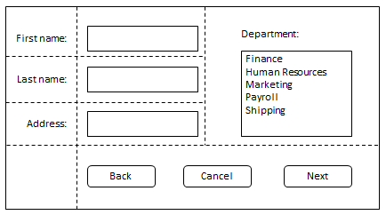
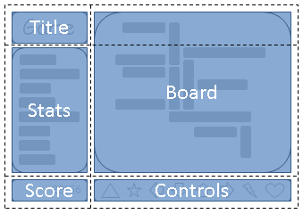
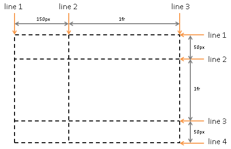
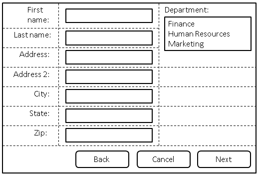
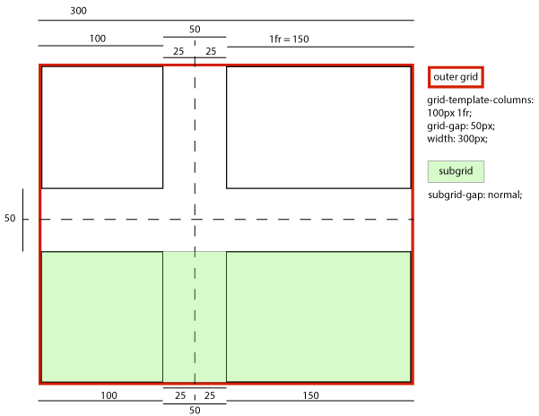
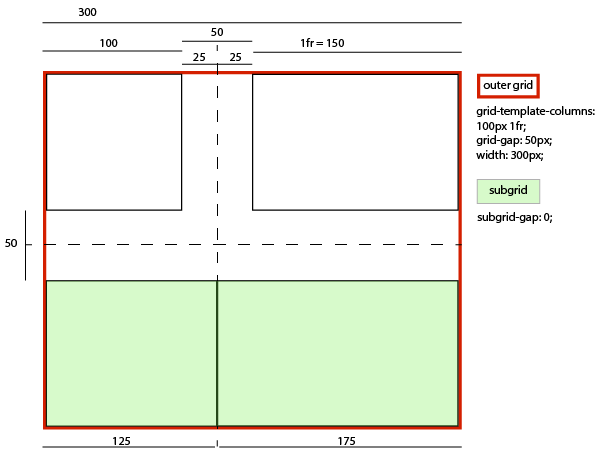

1\. Введение
--------------------------

Этот раздел не является нормативным.

Grid Layout - это модель макета для CSS, которая обладает мощными возможностями для управления размерами и позиционированием боксов и их содержимого. В отличие от [Flexible Box Layout](https://www.w3.org/TR/css-flexbox-1/), которая ориентирована на одну ось, Grid Layout оптимизирована для двумерных макетов: тех, в которых требуется выравнивание содержимого в обоих измерениях.

Пример репрезентативного Flex-макета

Пример репрезентативного макета сетки

Кроме того, благодаря возможности явного позиционирования элементов в сетке, Grid Layout позволяет кардинально менять визуальную структуру макета, не требуя соответствующих изменений в разметке. Комбинируя [media queries](https://www.w3.org/TR/css3-mediaqueries/) со свойствами CSS, которые управляют расположением контейнера сетки и его дочерних элементов, авторы могут адаптировать свои макеты к изменениям форм-факторов устройств, ориентации и доступного пространства, сохраняя при этом более идеальную семантическую структуру контента в презентациях.

Хотя многие макеты могут быть выражены с помощью Grid или Flexbox, у каждого из них есть свои особенности. Grid обеспечивает двумерное выравнивание, использует нисходящий подход к компоновке, позволяет явно перекрывать элементы и имеет более мощные возможности для разметки. Flexbox фокусируется на распределении пространства внутри оси, использует более простой подход к верстке "снизу вверх", может использовать систему обертывания линий на основе размера содержимого для управления вторичной осью и опирается на иерархию разметки для создания более сложных макетов. Предполагается, что оба варианта станут ценными и взаимодополняющими инструментами для авторов CSS.

Grid Level 2 добавляет функцию [subgrid](#subgrids): ось с субсеткой - это та ось, линии сетки которой совпадают с линиями сетки родительского элемента, и которая получает размеры своих дорожек через эту интеграцию с родительской сеткой.

### 1.1. Предыстория и мотивация

Пример макета приложения, требующего горизонтального и вертикального выравнивания.

По мере того как веб-сайты превращались из простых документов в сложные интерактивные приложения, методы верстки документов, например, плавающие элементы, не всегда хорошо подходили для верстки приложений. Используя комбинацию таблиц, JavaScript или тщательные измерения плавающих элементов, авторы находили обходные пути для достижения желаемых макетов. Макеты, адаптированные к доступному пространству, часто были хрупкими и приводили к неинтуитивному поведению, когда пространство становилось ограниченным. В качестве альтернативы авторы многих веб-приложений выбирали фиксированный макет, который не мог использовать изменения в доступном пространстве для визуализации на экране.

Возможности сетчатой верстки решают эти проблемы. Она предоставляет авторам механизм для разделения доступного пространства на столбцы и строки с помощью набора предсказуемых моделей поведения при изменении размера. Затем авторы могут точно расположить и изменить размер элементов приложения в [областях сетки](#grid-area), определенных пересечениями этих столбцов и строк. Следующие примеры иллюстрируют адаптивные возможности сетчатой верстки и то, как она позволяет более четко разделять содержание и стиль.

#### 1.1.1. Адаптация макетов к доступному пространству

Давайте рассмотрим макет игры в два столбца и три строки: название игры в левом верхнем углу, меню под ним, счет в левом нижнем углу, игровое поле занимает верхнюю и среднюю ячейки справа, а элементы управления игрой заполняют левый нижний угол. Размер левого столбца точно соответствует размеру его содержимого (название игры, пункты меню и счет), а правый столбец заполняет оставшееся пространство](images/game-smaller.png)

Пять элементов сетки расположены в соответствии с размером содержимого и свободным пространством.

По мере увеличения пространства на больших экранах средняя строка и правая колонка расширяются, чтобы заполнить это пространство](images/game-larger.png)

Увеличение сетки из-за увеличения доступного пространства.

Разметка сетки может использоваться для интеллектуального изменения размеров элементов на веб-странице. На соседних рисунках представлена игра с пятью основными компонентами макета: название игры, область статистики, игровое поле, область счета и область управления. По замыслу автора, пространство для игры должно быть разделено таким образом:

* Область статистики всегда располагается сразу под названием игры.
* Игровое поле располагается справа от статистики и названия.
* Верхняя часть названия игры и игровое поле всегда должны быть на одном уровне.
* Нижняя часть игрового поля и нижняя часть области статистики выравниваются, если игра достигла минимальной высоты. В остальных случаях игровое поле растягивается, чтобы занять все доступное ему пространство.
* Элементы управления расположены по центру игрового поля.
* Верхняя часть области счета выровнена по верхней части области управления.
* Область счета находится под областью статистики.
* Область счета выровнена по отношению к элементам управления под областью статистики.

Следующий пример макета сетки показывает, как автор может декларативно достичь всех правил определения размера, размещения и выравнивания.

/**
\* Определите пространство для каждого [элемента сетки](#grid-item), объявив сетку
\* на [контейнере сетки](#grid-container).
*/
#grid {
/**
\* Два столбца:
\* 1\. первая имеет размер под содержимое,
\* 2\. вторая занимает оставшееся пространство
\* (но никогда не бывает меньше минимального размера доски
\* или элементов управления игрой, которые занимают эту колонку \[Рисунок 4\])
*
\* Три ряда:
\* 3\. первый по размеру,
\* 4\. средний ряд занимает оставшееся пространство
\* (но никогда не бывает меньше минимальной высоты
\* доски или области статистики)
\* 5\. последний размер под содержание.
*/
отображение: сетка;
grid-template-columns:
/\* 1 */ auto
/\* 2 */ 1fr;
grid-template-rows:
/\* 3 */ auto
/\* 4 */ 1fr
/\* 5 */ auto;
}

/\* Укажите положение каждого элемента [сетки](#grid-item), используя координаты на
\* свойства 'grid-row' и 'grid-column' каждого [элемента сетки](#grid-item).
*/
#title { grid-column: 1; grid-row: 1; }
#score { grid-column: 1; grid-row: 3; }
#stats { grid-column: 1; grid-row: 2; align-self: start; }
#board { grid-column: 2; grid-row: 1 / span 2; }
#controls { grid-column: 2; grid-row: 3; justify-self: center; }

  
Название игры

  
Счет

  
Статистика

  
Board

  
Controls

Примечание: Существует несколько способов задать структуру сетки, а также расположение и размер [элементов сетки](#grid-item), каждый из которых оптимизирован для различных сценариев.

#### 1.1.2. Независимость источника от порядка

Аранжировка, подходящая для "портретной" ориентации.

Аранжировка, подходящая для "ландшафтной" ориентации.

Продолжая предыдущий пример, автор также хочет, чтобы игра адаптировалась к различным устройствам. Кроме того, игра должна оптимизировать расположение компонентов при просмотре в портретной или ландшафтной ориентации (рис. 6 и 7). Комбинируя grid layout с media queries, автор может использовать ту же семантическую разметку, но переставлять расположение элементов независимо от их исходного порядка, чтобы добиться желаемого расположения в обеих ориентациях.

В следующем примере используется способность макета сетки называть пространство, которое будет занято элементом [grid item](#grid-item). Это позволяет автору не переписывать правила для элементов сетки при изменении ее определения.

@media (orientation: portrait) {
#grid {
display: grid;

    /\* Строки, столбцы и области сетки определяются визуально
\* с помощью свойства grid-template-areas.  Каждая строка - это строка,
\* а каждое слово - область.  Количество слов в строке
\* определяет количество столбцов. Обратите внимание, что количество слов
\* в каждой строке должно быть одинаковым. */
grid-template-areas: "статистика заголовка"
"score stats"
"board board"
"ctrls ctrls";

    /\* Размер столбцов и строк может быть задан с помощью свойств
\* Свойства grid-template-columns и grid-template-rows. */
grid-template-columns: auto 1fr;
grid-template-rows: auto auto 1fr auto;
}
}

@media (orientation: landscape) {
#grid {
display: grid;

    /\* И снова свойство шаблона определяет одноименные области,
\* но на этот раз расположенные по-другому, чтобы лучше соответствовать
\* альбомной ориентации. */
grid-template-areas: "титульная доска"
"таблица статистики"
"score ctrls";

    grid-template-columns: auto 1fr;
    grid-template-rows: auto 1fr auto;
}
}

/\* Свойство grid-area помещает элемент сетки в названную
\* область сетки. */
#title { grid-area: title }
#score { grid-area: score }
#stats { grid-area: stats }
#board { grid-area: board }
#controls { grid-area: ctrls }

  
Название игры

  
Счет

  
Статистика

  
Board

  
Controls

Примечание: возможности переупорядочивания сетки макетов намеренно влияют только на визуальный рендеринг, оставляя порядок речи и навигацию на основе исходного порядка. Это позволяет авторам манипулировать визуальным представлением, оставляя исходный порядок нетронутым и оптимизируя его для UA, не использующих CSS, и для линейных моделей, таких как речь и последовательная навигация.

**Размещение и переупорядочивание элементов сетки не должно использоваться вместо правильного упорядочивания источника, так как это может испортить доступность документа.**

### 1.2. Определения значений

Данная спецификация следует [соглашениям определения свойств CSS](https://www.w3.org/TR/CSS2/about.html#property-defs) из [\[CSS2\]](#biblio-css2), используя [синтаксис определения значений](https://www.w3.org/TR/css-values-3/#value-defs) из [\[CSS-VALUES-3\]](#biblio-css-values-3). Типы значений, не определенные в данной спецификации, определены в CSS Values & Units \[CSS-VALUES-3\]. Сочетание с другими модулями CSS может расширить определения этих типов значений.

В дополнение к значениям свойств, перечисленным в их определениях, все свойства, определенные в данной спецификации, также принимают в качестве значения свойства [CSS-wide keywords](https://www.w3.org/TR/css-values-4/#css-wide-keywords). Для удобства чтения они не повторяются в явном виде.

2\. Обзор
-------------------------

Этот раздел не является нормативным.

Grid Layout управляет расположением своего содержимого с помощью [сетки](#grid): пересекающегося набора горизонтальных и вертикальных линий, которые создают систему координат размера и позиционирования для содержимого [контейнера сетки](#grid-container). Функции макета сетки

* фиксированные, гибкие и основанные на содержимом [функции отслеживания размеров](#track-sizing)
* [явное размещение элементов](#placement) через прямые (положительные) и обратные (отрицательные) числовые координаты сетки, именованные линии сетки и именованные области сетки; автоматическое размещение элементов в пустых областях, включая [переупорядочивание с помощью свойства order](#order-property)
* повторение треков с учетом пробелов и автоматическое добавление строк или столбцов для размещения дополнительного содержимого
* контроль над выравниванием и интервалами с помощью [полей](#auto-margins), [желобов](https://www.w3.org/TR/css-align-3/#gutter) и [свойств выравнивания](https://www.w3.org/TR/css-align/)
* возможность перекрытия содержимого и [управление наслоением с помощью z-index](#z-order)

[Grid-контейнеры](#grid-container) могут быть вложены или смешаны с [flex-контейнерами](https://www.w3.org/TR/css-flexbox-1/#flex-container) при необходимости для создания более сложных макетов.

### 2.1. Объявление сетки

Дорожки [tracks](#grid-track) ([rows](#grid-row) и [columns](#grid-column)) [grid](#grid) объявляются и определяются либо явно через свойства [explicit grid](#explicit-grid), либо создаются неявно при размещении элементов за пределами явной сетки. Сокращение [grid](#propdef-grid) и его подсвойства определяют параметры сетки. [§ 7 Определение сетки](#grid-definition)

Ниже приведены примеры объявления сетки:

* Ниже объявлена сетка с четырьмя именованными областями: `H`, `A`, `B` и `F`. Первый столбец имеет размер, соответствующий его содержимому ([auto](#valdef-grid-template-columns-auto)), а второй столбец занимает оставшееся пространство ([1fr](#valdef-flex-fr)). Строки по умолчанию имеют автоматический (основанный на содержимом) размер; последняя строка имеет фиксированный размер 30px.

  главная {
  grid: "H H "
  "A B "
  "F F " 30px
  / auto 1fr;
  }

* Ниже объявляется сетка с таким количеством строк размером не менее 5em, которое помещается в высоту контейнера сетки (100vh). У сетки нет явных столбцов; вместо этого столбцы добавляются по мере добавления содержимого, а ширина столбцов в результате выравнивается ([1fr](#valdef-flex-fr)). Поскольку содержимое, переливающееся вправо, не будет печататься, альтернативный макет для печати добавляет строки.

  главная {
  grid: repeat(auto-fill, 5em) / auto-flow 1fr;
  height: 100vh;
  }
  @media print {
  главный {
  grid: auto-flow 1fr / repeat(auto-fill, 5em);
  }
  }

* Ниже объявлена сетка с 5 равномерно расположенными столбцами и тремя строками, причем средняя строка занимает все оставшееся пространство (по крайней мере, достаточное для размещения ее содержимого).

  main {
  grid: auto 1fr auto / repeat(5, 1fr);
  min-height: 100vh;
  }

### 2.2. Размещение элементов

Содержимое [контейнера сетки](#grid-container) организуется в отдельные [элементы сетки](#grid-item) (по аналогии с [flex items](https://www.w3.org/TR/css-flexbox-1/#flex-item)), которые затем назначаются предопределенным [областям](#grid-area) в [сетке](#grid). Они могут быть явно размещены с помощью координат через свойства [grid-placement](#grid-placement-property) или неявно помещены в пустые области с помощью [auto-placement](#auto-placement). [§ 8 Размещение элементов сетки](#placement)

Ниже приведены примеры объявления размещения элементов сетки с использованием сокращения [grid-area](#propdef-grid-area):

grid-area: a; /* Помещение в именованную область сетки "a" */
grid-area: auto; /* Автоматическое помещение в следующую пустую область */
grid-area: 2 / 4; /* Помещается в строку 2, столбец 4 */
grid-area: 1 / 3 / -1; /* Помещается в столбец 3, охватывает все строки */
grid-area: header-start / sidebar-start / footer-end / sidebar-end;
/\* Разместить с помощью именованных строк */

Это эквивалентно следующим объявлениям [grid-row](#propdef-grid-row)\+ [grid-column](#propdef-grid-column):

grid-row: a; grid-column: a;
grid-row: auto; grid-column: auto;
grid-row: 2; grid-column: 4;
grid-row: 1 / -1; grid-column: 3;
grid-row: header-start / footer-end; grid-column: sidebar-start / sidebar-end;

Далее они могут быть разложены на [grid-row-start](#propdef-grid-row-start)/[grid-row-end](#propdef-grid-row-end)/[grid-column-start](#propdef-grid-column-start)/[grid-column-end](#propdef-grid-column-end) лонгплей, например.

grid-area: a;
/\* Эквивалентно grid-row-start: a; grid-column-start: a; grid-row-end: a; grid-column-end: a; */

grid-area: 1 / 3 / -1;
/\* Эквивалентно grid-row-start: 1; grid-column-start: 3; grid-row-end: -1; grid-column-end: auto; */

### 2.3. Изменение размера сетки

После того как [элементы сетки](#grid-item) были [размещены](#placement), вычисляются размеры [треков сетки](#grid-track) (строк и столбцов) с учетом размеров их содержимого и/или доступного пространства, как указано в определении сетки.

Полученная сетка выравнивается [align](#grid-align) внутри [grid container](#grid-container) в соответствии со свойствами [align-content](https://www.w3.org/TR/css-align-3/#propdef-align-content) и [justify-content](https://www.w3.org/TR/css-align-3/#propdef-justify-content) контейнера сетки. [§ 11 Выравнивание и интервалы](#alignment)

Следующий пример выравнивает все столбцы, распределяя между ними лишнее пространство, и центрирует сетку в [контейнере сетки](#grid-container), когда она меньше 100vh.

main {
grid: auto-flow 1fr / repeat(auto-fill, 5em);
min-height: 100vh;
justify-content: space-between;
align-content: safe center;
}

Наконец, каждый элемент [сетки](#grid-item) имеет размер и выравнивается в пределах назначенной ему [области сетки](#grid-area), как указано в его собственных [размерах](https://www.w3.org/TR/CSS2/visudet.html) [\[CSS2\]](#biblio-css2) и [свойствах выравнивания](https://www.w3.org/TR/css-align-3/#box-alignment-properties) [\[CSS-ALIGN-3\]](#biblio-css-align-3).

3\. Концепции и терминология разметки сетки
----------------------------------------------------------

При сетчатой верстке содержимое [контейнера сетки](#grid-container) размещается путем позиционирования и выравнивания в [сетке](#grid). Сетка - это пересекающийся набор горизонтальных и вертикальных [линий сетки](#grid-line), который делит пространство контейнера сетки на [области сетки](#grid-area), в которые могут быть помещены [элементы сетки](#grid-item) (представляющие содержимое контейнера сетки). Существует два набора линий сетки: один набор определяет столбцы, идущие вдоль оси [block axis](https://www.w3.org/TR/css3-writing-modes/#block-axis), и ортогональный набор, определяющий строки вдоль оси [inline axis](https://www.w3.org/TR/css3-writing-modes/#inline-axis). [\[CSS3-WRITING-MODES\]](#biblio-css3-writing-modes)

Линии сетки: Три по оси блока и четыре по оси инлайна.

### 3.1. Линии сетки

Линии сетки - это горизонтальные и вертикальные разделительные линии [сетки](#grid). Линия [сетки](#grid-line) существует по обе стороны от столбца или строки. На них можно ссылаться по числовому индексу или по имени, указанному автором. Элемент [сетки](#grid-item) ссылается на линии сетки, чтобы определить свое положение в сетке, используя свойства [grid-placement](#placement).

В следующих двух примерах создаются три колонки [линий сетки](#grid-line) и четыре строки сетки.

Первый пример демонстрирует, как автор будет позиционировать элемент [сетки](#grid-item), используя номера [линий сетки](#grid-line):

#grid {
display: grid;
grid-template-columns: 150px 1fr;
grid-template-rows: 50px 1fr 50px;
}

#item1 { grid-column: 2;
grid-row-start: 1; grid-row-end: 4; }

Этот второй пример использует явно именованные [линии сетки](#grid-line):

/\* эквивалентный макет предыдущему примеру, но с использованием именованных линий */
#grid {
display: grid;
grid-template-columns: 150px \[item1-start\] 1fr \[item1-end\];
grid-template-rows: \[item1-start\] 50px 1fr 50px \[item1-end\];
}

#item1 {
grid-column: item1-start / item1-end;
grid-row: item1-start / item1-end;
}

### 3.2. Дорожки сетки и ячейки

Дорожка сетки - это общий термин для [столбца сетки](#grid-column) или [строки сетки](#grid-row) - другими словами, это пространство между двумя соседними [линиями сетки](#grid-line). Каждой дорожке [grid track](#grid-track) назначается функция размера, которая управляет тем, насколько широким или высоким может быть столбец или строка, и, следовательно, насколько далеко друг от друга находятся ограничивающие их линии сетки. Смежные дорожки сетки могут быть разделены [gutters](#gutters), но в остальном они плотно упакованы.

Ячейка сетки - это пересечение строки и столбца сетки. Это наименьшая единица сетки, на которую можно ссылаться при позиционировании [элементов сетки](#grid-item).

В следующем примере есть два столбца и три строки. Первый столбец имеет фиксированный размер 150px. Второй столбец использует гибкий размер, который зависит от нераспределенного пространства в сетке, и поэтому будет меняться при изменении ширины [контейнера сетки](#grid-container). Если используемая ширина контейнера сетки составляет 200px, то второй столбец будет иметь ширину 50px. Если используемая ширина контейнера сетки равна 100px, то второй столбец будет иметь ширину 0px, и любое содержимое, размещенное в столбце, будет переполнять контейнер сетки.

#grid {
display: grid;
grid-template-columns: 150px 1fr; /* две колонки */
grid-template-rows: 50px 1fr 50px; /* три строки */
}

### 3.3. Области сетки

Область сетки - это логическое пространство, используемое для размещения одного или нескольких [элементов сетки](#grid-item). Область [сетки](#grid-area) состоит из одной или нескольких смежных ячеек [сетки](#grid-cell). Она ограничена четырьмя [линиями сетки](#grid-line), по одной с каждой стороны области сетки, и участвует в определении размеров [треков сетки](#grid-track), которые она пересекает. Область сетки может быть названа явно с помощью свойства [grid-template-areas](#propdef-grid-template-areas) контейнера [grid-container](#grid-container), или на нее можно ссылаться неявно по ее граничным линиям сетки. Элемент сетки назначается на область сетки с помощью свойств [grid-placement](#placement).

/\* с использованием синтаксиса шаблона */
#grid {
display: grid;
grid-template-areas: ". a"
"b a"
". a";
grid-template-columns: 150px 1fr;
grid-template-rows: 50px 1fr 50px;
}

#item1 { grid-area: a }
#item2 { grid-area: b }
#item3 { grid-area: b }

/\* Выровняйте элементы 2 и 3 по разным точкам в области сетки "b".  */
/\* По умолчанию, элементы сетки растягиваются, чтобы соответствовать их области сетки */
/\* и эти элементы будут располагаться один над другим. */
#item2 { align-self: start; }
#item3 { justify-self: end; align-self: end; }

Область сетки [grid item](#grid-item) [grid area](#grid-area) формирует содержащий блок, в который он помещается. Элементы сетки, размещенные в одной и той же области сетки, не оказывают прямого влияния на расположение друг друга. Однако косвенно элемент сетки, занимающий дорожку [grid track](#grid-track) с [intrinsic sizing function](#intrinsic-sizing-function), может влиять на размер этой дорожки (и, следовательно, на положение ее ограничивающих [grid lines](#grid-line)), что, в свою очередь, может влиять на положение или размер другого элемента сетки.

### 3.4. Вложенные и подсеточные элементы

Элемент [сетки](#grid-item) может сам быть контейнером [сетки](#grid-container), задав ему [display: grid](https://www.w3.org/TR/css-display-3/#propdef-display). В общем случае расположение содержимого вложенной сетки не зависит от расположения родительской сетки, в которой она участвует.

Однако в некоторых случаях может потребоваться, чтобы содержимое нескольких [элементов сетки](#grid-item) было выровнено по отношению друг к другу. Вложенная сетка [nested grid](#nested-grid) может отложить определение своих строк и/или столбцов до своего родительского [grid-контейнера](#grid-container), сделав его подсеткой. В этом случае элементы сетки [subgrid](#subgrid) участвуют в определении размеров [parent grid](#parent-grid), позволяя содержимому обеих сеток выравниваться. Смотрите [§ 9 Подсетки](#subgrids).

Сетка [subgrid](#subgrid) устанавливается ключевым словом [subgrid](#valdef-grid-template-rows-subgrid) в [grid-template-rows](#propdef-grid-template-rows) или [grid-template-columns](#propdef-grid-template-columns), и может быть [subgridded](#subgridded-axis) по одной из осей или по обеим. Сетка, не имеющая подсеточных осей, является автономной сеткой.

Например, предположим, что у нас есть форма, состоящая из списка входов с метками:

<ul>
  <li><label>Имя:</label> <input name=fn>
  <li><label>Адрес:</label> <input name=address>
  <li><label>Телефон:</label> <input name=phone>
</ul>

Мы хотим, чтобы метки и вводимые данные были выровнены, а для каждого элемента списка была сделана граница. Этого можно добиться с помощью вложенной сетки:

ul {
display: grid;
grid: auto-flow / auto 1fr;
}
li {
grid-column: span 2;
отображение: сетка;
grid-template-columns: subgrid;
border: solid;
}
label {
grid-column: 1;
}
input {
колонка-сетка: 2;
}

4\. Упорядочивание и доступность
--------------------------------------------------------

Сетчатая верстка дает авторам большие возможности по переупорядочиванию документа. Однако они не заменяют правильного упорядочивания источника документа. Свойство [order](https://www.w3.org/TR/css-flexbox-1/#propdef-order) и [grid placement](#grid-placement) _не_ влияют на упорядочивание в невизуальных медиа (таких как [speech](https://www.w3.org/TR/css3-speech/)). Аналогично, визуальная перестановка элементов сетки не влияет на порядок обхода по умолчанию в режимах последовательной навигации (таких, как циклический переход по ссылкам, см. например, [`tabindex`](https://html.spec.whatwg.org/multipage/interaction.html#attr-tabindex) [\[HTML\]](#biblio-html)).

**Авторы _должны_ использовать [order](https://www.w3.org/TR/css-flexbox-1/#propdef-order) и свойства [grid-placement](#grid-placement-property) только для визуального, а не логического упорядочивания содержимого. Таблицы стилей, использующие эти свойства для логического упорядочивания, являются несоответствующими**.

Примечание: Это сделано для того, чтобы невизуальные медиа и UA без CSS, которые обычно представляют контент линейно, могли полагаться на логический порядок источника, в то время как функции размещения и упорядочивания сетки используются для визуального упорядочивания. (Поскольку визуальное восприятие двухмерно и нелинейно, желаемый визуальный порядок не всегда эквивалентен желаемому порядку чтения).

Многие веб-страницы имеют похожую форму в разметке: верхний колонтитул, нижний колонтитул, затем область содержимого и одна или две дополнительные колонки в середине. Как правило, желательно, чтобы в исходном коде страницы контент шел первым, до дополнительных колонок. Однако из-за этого многие распространенные дизайны, например, когда дополнительные колонки располагаются слева, а область содержимого - справа, становятся трудновыполнимыми. На протяжении многих лет эта проблема решалась разными способами, часто называясь "макет Святого Грааля", когда есть две дополнительные колонки. Grid Layout делает этот пример тривиальным. Например, возьмем следующий набросок кода страницы и желаемого макета:

&lt;!DOCTYPE html&gt;
<Заголовок>...</Заголовок>
<article>...</article>
<nav>...</nav>
<aside>...</aside>
<footer>...</footer>

На этой странице верхний колонтитул находится вверху, нижний - внизу, а статья - в центре, справа от нее располагается навигатор, а слева - отступ](images/grid-order-page.svg).

Такого расположения можно легко добиться с помощью сетчатой верстки:

body { display: grid;
grid: "h h h"
"a b c"
"f f";
grid-template-columns: auto 1fr 20%; }
article { grid-area: b; min-width: 12em; }
nav { grid-area: a; /\* auto min-width */ }
aside { grid-area: c; min-width: 12em; }

В качестве дополнительного бонуса, все колонки будут [equal-height](https://www.w3.org/TR/css-align-3/#valdef-align-self-stretch) по умолчанию, а основной контент будет настолько широким, насколько это необходимо для заполнения экрана. Кроме того, это может быть объединено с медиа-запросами для переключения на полностью вертикальный макет на узких экранах:

@media all and (max-width: 60em) {
/\* Слишком узкий экран для поддержки трех колонок */
main { display: block; }
}

Чтобы сохранить задуманное автором упорядочивание во всех режимах представления, инструменты авторинга, включая WYSIWYG-редакторы, а также средства веб-авторинга, должны переупорядочивать базовый источник документа и не использовать [order](https://www.w3.org/TR/css-flexbox-1/#propdef-order) или [свойства grid-placement](#grid-placement-property) для выполнения переупорядочивания, если только автор явно не указал, что порядок базового документа (который определяет порядок речи и навигации) должен быть _не синхронизирован_ с визуальным порядком.

Например, инструмент может предлагать как расположение элементов сетки с помощью перетаскивания, так и обработку медиа-запросов для альтернативных макетов в зависимости от размера экрана.

Поскольку в большинстве случаев переупорядочивание должно затрагивать все диапазоны экранов, а также навигацию и порядок речи, инструмент будет соответствовать визуальному расположению, полученному перетаскиванием, одновременно переупорядочивая слой DOM. Однако в некоторых случаях автору может потребоваться разное визуальное расположение для каждого размера экрана. Инструмент может предложить такую функциональность, используя свойства [grid-placement properties](#grid-placement-property) вместе с медиа-запросами, но при этом привязывая расположение экрана наименьшего размера к базовому порядку DOM (поскольку это, скорее всего, будет логичный линейный порядок представления), а также используя свойства grid-placement для изменения визуального представления в других диапазонах размеров.

Такой инструмент будет соответствовать требованиям, в то время как инструмент, использующий только свойства [grid-placement properties](#grid-placement-property) для перестановки сетки с помощью перетаскивания (как бы удобно это ни было реализовано), будет несоответствующим.

5\. Контейнеры сетки
----------------------------------

### 5.1. Создание контейнеров сетки: значения [grid](#valdef-display-grid) и [inline-grid](#valdef-display-inline-grid) [display](https://www.w3.org/TR/css-display-3/#propdef-display)

| | |
| --- | --- |
| Имя: | [display](https://www.w3.org/TR/css-display-3/#propdef-display) |
| [Новые значения:](https://www.w3.org/TR/css-values/#value-defs) | grid [\|](https://www.w3.org/TR/css-values-4/#comb-one) inline-grid |

grid

Это значение заставляет элемент генерировать поле [grid container](#grid-container), которое является [block-level](https://www.w3.org/TR/css-display-3/#block-level) при размещении в [flow layout](https://www.w3.org/TR/css-display-3/#flow-layout).

inline-grid

Это значение заставляет элемент генерировать [grid-контейнер](#grid-container) бокс, который является [inline-level](https://www.w3.org/TR/css-display-3/#inline-level) при размещении в [flow layout](https://www.w3.org/TR/css-display-3/#flow-layout).

Контейнер сетки, не являющийся [subgrid](#subgrid), устанавливает [независимый](https://www.w3.org/TR/css-display-3/#independent-formatting-context) контекст форматирования сетки для своего содержимого. Это то же самое, что и создание независимого [контекста форматирования блока](https://www.w3.org/TR/css-display-3/#block-formatting-context), за исключением того, что вместо блочной раскладки используется сетчатая: плавающие элементы не вторгаются в контейнер сетки, а поля контейнера сетки не совпадают с полями его содержимого. Содержимое [grid-контейнера](#grid-container) выстраивается в [grid](#grid), при этом [grid-линии](#grid-line) образуют границы каждого [grid items](#grid-item)' содержащего блока.

В отличие от содержимого обычной вложенной сетки, содержимое [подсетки](#subgrid) участвует в родительском [контексте форматирования сетки](#grid-formatting-context); таким образом, подсетка не создает [независимый контекст форматирования](https://www.w3.org/TR/css-display-3/#independent-formatting-context).

Контейнеры сетки не являются блочными контейнерами, поэтому некоторые свойства, которые были разработаны в предположении блочной компоновки, не применяются в контексте сетки. В частности:

* [float](https://www.w3.org/TR/CSS2/visuren.html#propdef-float) и [clear](https://www.w3.org/TR/CSS2/visuren.html#propdef-clear) не влияют на [элемент сетки](#grid-item). Однако свойство float по-прежнему влияет на вычисляемое значение [display](https://www.w3.org/TR/css-display-3/#propdef-display) для дочерних элементов контейнера сетки, поскольку это происходит до того, как определяются элементы сетки.
* [vertical-align](https://www.w3.org/TR/css-inline-3/#propdef-vertical-align) не влияет на элемент сетки.
* псевдоэлементы [::first-line](https://www.w3.org/TR/css-pseudo-4/#selectordef-first-line) и [::first-letter](https://www.w3.org/TR/css-pseudo-4/#selectordef-first-letter) не применяются к [grid-контейнерам](#grid-container), а grid-контейнеры не передают первую отформатированную строку или первую букву своим предкам.

Если для элемента [display](https://www.w3.org/TR/css-display-3/#propdef-display) указано [inline-grid](#valdef-display-inline-grid), а сам элемент плавающий или абсолютно позиционированный, то вычисляемое значение display - [grid](#valdef-display-grid). Таким образом, таблица в [CSS 2.1 Chapter 9.7](https://www.w3.org/TR/CSS2/visuren.html#dis-pos-flo) дополнена дополнительной строкой, в которой inline-grid находится в столбце "Указанное значение", а grid - в столбце "Вычисленное значение".

### 5.2. Изменение размеров контейнеров сетки

Определение терминов в этом разделе см. в [\[CSS-SIZING-3\]](#biblio-css-sizing-3).

Размер [контейнера сетки](#grid-container) определяется правилами контекста форматирования, в котором он участвует:

* Как [блок-уровень](https://www.w3.org/TR/css-display-3/#block-level) в [блочном контексте форматирования](https://www.w3.org/TR/css-display-3/#block-formatting-context), он имеет размер как [блок-бокс](https://www.w3.org/TR/css-display-3/#block-box), который устанавливает контекст форматирования, с [авто](#grid-placement-auto) [inline size](https://www.w3.org/TR/css-writing-modes-4/#inline-size), рассчитанным как для не заменяемых блок-боксов.
* В качестве блока inline-уровня в [inline formatting context](https://www.w3.org/TR/css-display-3/#inline-formatting-context) он имеет размер атомарного блока inline-уровня (например, inline-блока).

В контекстах форматирования как в строке, так и в блоке [grid-контейнер](#grid-container) [auto](#valdef-grid-template-columns-auto) [block size](https://www.w3.org/TR/css-writing-modes-4/#block-size) является его максимальным размером содержимого.

Вероятно, это должно быть определено в спецификации верстки блока, но она еще не написана.

[max-content size](https://www.w3.org/TR/css-sizing-3/#max-content) ([min-content size](https://www.w3.org/TR/css-sizing-3/#min-content)) [грид-контейнера](#grid-container) - это сумма размеров дорожек грид-контейнера (включая желоба) по соответствующей оси, когда размер грида задан с помощью [max-content constraint](https://www.w3.org/TR/css-sizing-3/#max-content-constraint) ([min-content constraint](https://www.w3.org/TR/css-sizing-3/#min-content-constraint)).

### 5.3. Переполнение прокручиваемой сетки

Свойство [overflow](https://www.w3.org/TR/css-overflow-3/#propdef-overflow) применяется к [контейнерам сетки](#grid-container).

Подобно тому, как [grid](#grid) включается в собственный размер (см. выше), он также включается в [grid container](#grid-container) в [scrollable overflow region](https://www.w3.org/TR/css-overflow-3/#scrollable-overflow-region).

Примечание: обратите внимание на взаимодействие с padding, когда [grid-контейнер](#grid-container) является [scroll-контейнером](https://www.w3.org/TR/css-overflow-3/#scroll-container): определено, что дополнительная padding добавляется к [scrollable overflow rectangle](https://www.w3.org/TR/css-overflow-3/#scrollable-overflow-rectangle) по мере необходимости, чтобы обеспечить [place-content: end](https://www.w3.org/TR/css-align-3/#propdef-place-content) выравнивание прокручиваемого содержимого. См. [CSS Overflow 3 §2.2 Scrollable Overflow](https://www.w3.org/TR/css-overflow-3/#scrollable)

### 5.4. Ограничение больших сеток

Поскольку память ограничена, UA могут ограничить возможный размер [неявной сетки](#implicit-grid), чтобы он был в пределах определенного UA предела (который должен вмещать строки в диапазоне \[-10000, 10000\]), отбрасывая все строки за пределами этого предела. Если элемент сетки размещен за пределами этого предела, его область сетки должна быть [зажата](#clamp-a-grid-area), чтобы находиться в пределах этой ограниченной сетки.

Чтобы зажать область сетки:

* Если область [сетки](#grid-area) будет [выходить](#grid-span) за пределы ограниченной сетки, ее область будет зажата до последней строки ограниченной [сетки](#grid).

* Если область [сетки](#grid-area) будет размещена полностью за пределами ограниченной сетки, ее диапазон должен быть усечен до 1, а область перепозиционирована на последнюю дорожку [сетки](#grid-track) на этой стороне сетки.

Например, если UA поддерживает только сетки с не более чем 1000 дорожек в каждом измерении, следующие свойства размещения:

.grid-item {
grid-row: 500 / 1500;
grid-column: 2000 / 3000;
}

В итоге получится эквивалент:

.grid-item {
grid-row: 500 / 1001;
grid-column: 1000 / 1001;
}

6\. Grid Items
-----------------------------

Грубо говоря, элементы сетки [grid-контейнера](#grid-container) - это ячейки, представляющие его содержимое в потоке.

Каждый дочерний элемент [grid-контейнера](#grid-container) становится [grid item](#grid-item), а каждая смежная последовательность дочерних [text runs](https://www.w3.org/TR/css-display-3/#text-run) оборачивается в [anonymous](https://www.w3.org/TR/css-display-3/#anonymous) [block container](https://www.w3.org/TR/css-display-3/#block-container) grid item. Однако если вся последовательность дочерних текстовых блоков содержит только [белое пространство](https://www.w3.org/TR/CSS2/text.html#white-space-prop) (т. е. символы, на которые может влиять свойство [white-space](https://www.w3.org/TR/css-text-3/#propdef-white-space)), она не отображается (как если бы ее [текстовые узлы](https://www.w3.org/TR/css-display-3/#text-nodes) имели display:none).

Примеры элементов сетки:

&lt;!\-\- элемент сетки: блок-ребенок --&gt;
  
block

&lt;!\-\- элемент сетки: плавающий элемент; плавание игнорируется --&gt;
  
float

&lt;!\-\- элемент сетки: анонимный блок вокруг строчного содержимого --&gt;
анонимный элемент 3

&lt;!\-\- элемент сетки: встроенный ребенок --&gt;

элемент 4
<!\-\- элементы сетки не [разделяются](https://www.w3.org/TR/CSS2/visuren.html#anonymous-block-level) вокруг блоков -->
<q style="display: block" id=not-an-item>item 4</q>
элемент 4

элементы сетки определяются из приведенного выше блока кода

[1. элемент сетки, содержащий блок. 2. элемент сетки, содержащий float. 3. (анонимный, нестилируемый) элемент сетки, содержащий анонимный элемент 3. 4. элемент сетки, содержащий три блока подряд:  * анонимный блок, содержащий элемент 4.  * блок `<q>` элементов, содержащий элемент 4.  * анонимный блок, содержащий элемент 4.](examples/grid-item-determination.html)

Примечание: межэлементное белое пространство исчезает: оно не становится собственным элементом сетки, хотя межэлементный текст _дополнительно_ заворачивается в анонимный элемент сетки.

Примечание: поле анонимного элемента не подлежит стилизации, поскольку нет элемента, которому можно назначить правила стиля. Однако его содержимое будет наследовать стили (например, настройки шрифта) от контейнера сетки.

### 6.1. Отображение элементов сетки

Если это не [подсетка](#subgrid), элемент [сетки](#grid-item) [устанавливает независимый контекст форматирования](https://www.w3.org/TR/css-display-3/#establish-an-independent-formatting-context) для своего содержимого. Однако элементы сетки являются ячейками на уровне сетки, а не на уровне блоков: они участвуют в [контексте форматирования сетки](#grid-formatting-context) своего контейнера, а не в контексте форматирования блока.

Если значение [computed](https://www.w3.org/TR/css-cascade-4/#computed-value) [display](https://www.w3.org/TR/css-display-3/#propdef-display) ближайшего элемента-предка элемента (пропуская предков display:contents) равно [grid](#valdef-display-grid) или [inline-grid](#valdef-display-inline-grid), собственное значение display элемента равно [blockified](https://www.w3.org/TR/css-display-3/#blockify). (Подробнее об этом типе преобразования значений отображения см. в [CSS2.1§9.7](https://www.w3.org/TR/CSS2/visuren.html#dis-pos-flo) [\[CSS2\]](#biblio-css2) и [CSS Display 3 §2.7 Automatic Box Type Transformations](https://www.w3.org/TR/css-display-3/#transformations)).)

Примечание: Блокировка происходит даже тогда, когда элемент [grid](#valdef-display-grid) или [inline-grid](#valdef-display-inline-grid) не генерирует в итоге бокс [grid container](#grid-container), например, когда он [replaced](https://www.w3.org/TR/css-display-3/#replaced-element) или находится в поддереве [display: none](https://www.w3.org/TR/css-display-3/#propdef-display).

Примечание: Некоторые значения [display](https://www.w3.org/TR/css-display-3/#propdef-display) обычно вызывают создание анонимных боксов вокруг исходного бокса. Если такой бокс является [элементом сетки](#grid-item), он блокируется первым, и поэтому создание анонимных боксов не произойдет. Например, два смежных элемента сетки с display: table-cell станут двумя отдельными элементами сетки с display: block, вместо того чтобы быть завернутыми в одну анонимную таблицу.

### 6.2. Размер элементов сетки

Размер [элемента сетки](#grid-item) определяется в пределах содержащего блока, определяемого его [областью сетки](#grid-area).

Расчеты [элементов сетки](#grid-item) для [автоматических размеров](https://www.w3.org/TR/css-sizing-3/#automatic-size) в заданных размерах зависят от их [значений самовыравнивания](https://www.w3.org/TR/css-align-3/#self-alignment):

[normal](https://www.w3.org/TR/css-align-3/#valdef-align-self-normal)

Если элемент сетки является [замененным элементом](https://www.w3.org/TR/css-display-3/#replaced-element) с [естественным размером](https://www.w3.org/TR/css-images-3/#natural-size) в соответствующем измерении (или с [предпочтительным соотношением сторон](https://www.w3.org/TR/css-sizing-3/#preferred-aspect-ratio) и естественным размером в другом измерении), то размер элемента сетки определяется как для [align-self: start](https://www.w3.org/TR/css-align-3/#propdef-align-self) (в соответствии с правилами расчета ширины для заменяемых элементов на уровне блоков в [CSS 2 §10.3.4 Заменяемые элементы на уровне блоков в нормальном потоке](https://www.w3.org/TR/CSS2/visudet.html#block-replaced-width)).

В противном случае, если элемент сетки имеет [предпочтительное соотношение сторон](https://www.w3.org/TR/css-sizing-3/#preferred-aspect-ratio), размер элемента сетки определяется как для [блочно-уровневого бокса](https://www.w3.org/TR/css-display-3/#block-level-box).

В противном случае размер элемента сетки определяется как для [stretch](https://www.w3.org/TR/css-align-3/#valdef-align-self-stretch).

[stretch](https://www.w3.org/TR/css-align-3/#valdef-align-self-stretch)

Используйте правила расчета [inline size](https://www.w3.org/TR/css-writing-modes-4/#inline-size) для неперемещаемых блоков (определены в [CSS 2 §10.3.3 Блочно-неперемещаемые элементы в нормальном потоке](https://www.w3.org/TR/CSS2/visudet.html#blockwidth)).

Примечание: Это может исказить соотношение сторон элемента с [preferred aspect ratio](https://www.w3.org/TR/css-sizing-3/#preferred-aspect-ratio), если его размер также ограничен по другой оси.

все остальные значения

Определить размер элемента в соответствии с содержимым.

В следующей информативной таблице приведены сведения об автоматическом определении размеров элементов сетки:

| | | |
| --- | --- | --- | --- | Сводная информация об автоматическом изменении размеров элементов сетки
| Выравнивание | Размер незамещенного элемента | Размер замещенного элемента |
| --- | --- | --- |
| [нормальный](https://www.w3.org/TR/css-align-3/#valdef-align-self-normal) | Заполнить область сетки | Использовать [естественный размер](https://www.w3.org/TR/css-images-3/#natural-size) |
| [растянуть](https://www.w3.org/TR/css-align-3/#valdef-align-self-stretch) | Заполнить область сетки | Заполнить область сетки |
| [start](https://drafts.csswg.org/css-align-3/#valdef-self-position-start)/[center](https://drafts.csswg.org/css-align-3/#valdef-self-position-center)/etc. | Подгонка размера содержимого (как у плавающих элементов) | Используйте [естественный размер](https://www.w3.org/TR/css-images-3/#natural-size)|

Примечание: Значение [auto](https://www.w3.org/TR/css-sizing-3/#valdef-width-auto) для [min-width](https://www.w3.org/TR/CSS2/visudet.html#propdef-min-width) и [min-height](https://www.w3.org/TR/CSS2/visudet.html#propdef-min-height) влияет на размер дорожки по соответствующей оси подобно тому, как оно влияет на основной размер [flex item](https://www.w3.org/TR/css-flexbox-1/#flex-item). Смотрите [§ 6.6 Автоматический минимальный размер элементов сетки](#min-size-auto).

### 6.3. Упорядочивание элементов сетки: свойство [order](https://www.w3.org/TR/css-flexbox-1/#propdef-order)

Свойство [order](https://www.w3.org/TR/css-flexbox-1/#propdef-order) также применяется к [элементам сетки](#grid-item). Оно влияет на их [авторазмещение](#grid-auto-flow-property) и [порядок рисования](#z-order).

**Как и в случае с переупорядочиванием гибких элементов, свойство [order](https://www.w3.org/TR/css-flexbox-1/#propdef-order) должно использоваться только в том случае, если визуальный порядок должен быть _не синхронизирован_ с порядком речи и навигации; в противном случае вместо этого следует переупорядочить базовый источник документа. См. [CSS Flexbox 1 §5.4.1 Переупорядочивание и доступность](https://www.w3.org/TR/css-flexbox-1/#order-accessibility) в [\[CSS-FLEXBOX-1\]](#biblio-css-flexbox-1)**.

### 6.4. Поля и отступы элементов сетки

Поскольку соседние элементы сетки независимо содержатся в блоке, образованном их [областями сетки](#grid-area), поля соседних [элементов сетки](#grid-item) не [сворачиваются](https://www.w3.org/TR/CSS2/box.html#collapsing-margins).

Процентные поля и отступы для [элементов сетки](#grid-item), как и для [блок-боксов](https://www.w3.org/TR/css-display-3/#block-box), определяются относительно [inline size](https://www.w3.org/TR/css-writing-modes-4/#inline-size) их [содержащего блока](https://www.w3.org/TR/css-display-3/#containing-block), например, проценты left/right/top/bottom все определяются относительно _ширины_ их содержащего блока в горизонтальных [режимах записи](https://www.w3.org/TR/css-writing-modes-4/#writing-mode).

Автоматические поля расширяются, чтобы поглотить дополнительное пространство в соответствующем измерении, и поэтому могут быть использованы для выравнивания. См. [§ 11.2 Выравнивание с помощью автоматических полей](#auto-margins)

### 6.5. Упорядочивание по оси Z: свойство [z-index](https://www.w3.org/TR/CSS2/visuren.html#propdef-z-index)

Элементы [сетки](#grid-item) могут пересекаться, когда они расположены в пересекающихся [областях сетки](#grid-area), или даже когда они расположены в непересекающихся областях из-за отрицательных полей или позиционирования. Порядок окраски элементов сетки точно такой же, как и у инлайн-блоков [\[CSS2\]](#biblio-css2), за исключением того, что вместо исходного порядка документа используется [ord-modified document order](https://www.w3.org/TR/css-flexbox-1/#order-modified-document-order), а значения [z-index](https://www.w3.org/TR/CSS2/visuren.html#propdef-z-index), отличные от [auto](https://drafts.csswg.org/css2/#valdef-z-index-auto), создают контекст укладки, даже если [position](https://www.w3.org/TR/css-position-3/#propdef-position) является [static](https://www.w3.org/TR/css-position-3/#valdef-position-static) (ведет себя точно так же, как если бы position была [relative](https://www.w3.org/TR/css-position-3/#valdef-position-relative)). Таким образом, свойство z-index можно легко использовать для управления порядком элементов сетки по оси z.

Примечание: Потомки, расположенные вне элемента сетки, все равно участвуют в любом контексте укладки, установленном элементом сетки.

На следующей диаграмме показано несколько перекрывающихся элементов сетки, для управления порядком укладки которых используется комбинация неявного порядка источника и явного [z-index](https://www.w3.org/TR/CSS2/visuren.html#propdef-z-index).

Порядок рисования, управляемый z-индексом и порядком источника.

&lt;style type="text/css"&gt;
#grid {
display: grid;
grid-template-columns: 1fr 1fr;
grid-template-rows: 1fr 1fr
}
#A { grid-column: 1 / span 2; grid-row: 2; align-self: end; }
#B { grid-column: 1; grid-row: 1; z-index: 10; }
#C { grid-column: 2; grid-row: 1; align-self: start; margin-left: -20px; }
#D { grid-column: 2; grid-row: 2; justify-self: end; align-self: start; }
#E { grid-column: 1 / span 2; grid-row: 1 / span 2;
z-index: 5; justify-self: center; align-self: center; }
&lt;/style&gt;

&lt;div id="grid"&gt;
&lt;div id="A"&gt; A&lt;/div&gt;
&lt;div id="B"&gt;B&lt;/div&gt;
&lt;div id="C"&gt;C&lt;/div&gt;
&lt;div id="D"&gt;D&lt;/div&gt;
&lt;div id="E"&gt;E&lt;/div&gt;
&lt;/div&gt;

### 6.6. Автоматический минимальный размер элементов сетки

Примечание: Большая часть терминологии, используемой в этом разделе (и во всей остальной части спецификации), определена в [CSS Intrinsic and Extrinsic Sizing](https://www.w3.org/TR/css-sizing-3/) [\[CSS-SIZING-3\]](#biblio-css-sizing-3).

Чтобы обеспечить более разумный [минимальный размер](https://www.w3.org/TR/css-sizing-3/#min-width) по умолчанию для [элементов сетки](#grid-item), используемое значение его [автоматического минимального размера](https://www.w3.org/TR/css-sizing-3/#automatic-minimum-size) в данной оси - это [минимальный размер на основе содержимого](#content-based-minimum-size), если верно все из следующего:

* он не является [контейнером прокрутки](https://www.w3.org/TR/css-overflow-3/#scroll-container)

* она охватывает хотя бы одну [дорожку](#grid-track) на этой оси, чья [функция минимального размера дорожки](#min-track-sizing-function) равна [auto](#valdef-grid-template-columns-auto)

* если он охватывает более одной дорожки на этой оси, ни одна из этих дорожек не является [гибкой](#flexible-tracks)

В противном случае [автоматический минимальный размер](https://www.w3.org/TR/css-sizing-3/#automatic-minimum-size) равен нулю, как обычно.

Минимальным размером [элемента сетки](#grid-item) в данном измерении является его [предложение заданного размера](#specified-size-suggestion), если оно существует, иначе его [предложение перенесенного размера](#transferred-size-suggestion), если оно существует, иначе его [предложение размера содержимого](#content-size-suggestion), см. ниже. Однако если в данном измерении элемент сетки охватывает только [дорожки сетки](#grid-track), которые имеют [фиксированную](#fixed-sizing-function) [функцию максимального размера дорожки](#max-track-sizing-function), то его предложение заданного размера и предложение размера содержимого в этом измерении (и его вход из этого измерения в предложение переданного размера в противоположном измерении) дополнительно ограничиваются до значения меньше или равного [stretch fit](https://www. w3.org/TR/css-sizing-3/#stretch-fit) в максимальный размер [области сетки](#grid-area) в этом измерении, как представлено суммой функций максимального размера этих дорожек сетки плюс любые промежуточные фиксированные [желоба](https://www.w3.org/TR/css-align-3/#gutter).

Во всех случаях предложение размера дополнительно ограничивается [максимальным размером](https://www.w3.org/TR/css-sizing-3/#max-width) по затронутой оси, если она определена.

Примечание: Аргумент [fit-content()](#valdef-grid-template-columns-fit-content) _не_ зажимает [content-based-minimum-size](#content-based-minimum-size) так же, как [fixed](#fixed-sizing-function) [max track sizing function](#max-track-sizing-function).

Используемые в этом расчете [предложение размера содержимого](#content-size-suggestion), [предложение заданного размера](#specified-size-suggestion) и [предложение переданного размера](#transferred-size-suggestion) учитывают соответствующие свойства минимального/максимального/предпочтительного размера, чтобы [минимальный размер на основе содержимого](#content-based-minimum-size) не нарушал никаких ограничений, установленных автором, и определены ниже:

предположение о заданном размере

Если [предпочтительный размер](https://www.w3.org/TR/css-sizing-3/#preferred-size) элемента по соответствующей оси является [определенным](https://www.w3.org/TR/css-sizing-3/#definite), то [предложение определенного размера](#specified-size-suggestion) - это этот размер. В противном случае он не определен.

переданное предложение размера

Если предмет имеет [предпочтительное соотношение сторон](https://www.w3.org/TR/css-sizing-3/#preferred-aspect-ratio) и его [предпочтительный размер](https://www.w3.org/TR/css-sizing-3/#preferred-size) на противоположной оси является [определенным](https://www.w3.org/TR/css-sizing-3/#definite), то [предложение перенесенного размера](#transferred-size-suggestion) - это этот размер (зажатый [минимальным](https://www.w3.org/TR/css-sizing-3/#min-width) и [максимальным](https://www.w3.org/TR/css-sizing-3/#max-width) размерами на противоположной оси, если они определены), преобразованный через соотношение сторон. В противном случае он не определен.

предложение по размеру контента

Предложение по [размеру содержимого](#content-size-suggestion) - это [минимальный размер содержимого](https://www.w3.org/TR/css-sizing-3/#min-content) по соответствующей оси, зажатый, если он имеет [предпочтительное соотношение сторон](https://www.w3.org/TR/css-sizing-3/#preferred-aspect-ratio), любыми [определенными](https://www.w3.org/TR/css-sizing-3/#definite) противоположными осями [минимального](https://www.w3.org/TR/css-sizing-3/#min-width) и [максимального размеров](https://www.w3.org/TR/css-sizing-3/#max-width), преобразованными через соотношение сторон.

Для вычисления собственного размера бокса (например, [min-content size](https://www.w3.org/TR/css-sizing-3/#min-content)) минимальный размер [content-based-minimum-size](#content-based-minimum-size) делает размер бокса по этой оси неопределенным (даже если, например, его свойство [width](https://www.w3.org/TR/css-sizing-3/#propdef-width) задает [определенный](https://www.w3.org/TR/css-sizing-3/#definite) размер). Обратите внимание, это означает, что проценты, вычисленные относительно этого размера, будут [вести себя как auto](https://www.w3.org/TR/css-sizing-3/#behave-as-auto).

Тем не менее, хотя в некоторых случаях может потребоваться дополнительный проход верстки для повторного определения процентов, это значение (как и значения [min-content](#valdef-grid-template-columns-min-content), [max-content](#valdef-grid-template-columns-max-content) и fit-content, определенные в [\[CSS-SIZING-3\]](#biblio-css-sizing-3)) не препятствует определению процентных размеров внутри элемента.

Обратите внимание, что хотя минимальный размер, основанный на содержимом, часто бывает уместен и помогает предотвратить перекрытие или вытекание содержимого за пределы контейнера, в некоторых случаях это не так:

В частности, если сетчатая верстка используется для основной области содержимого документа, лучше задать явную минимальную ширину относительно шрифта, например [min-width: 12em](https://www.w3.org/TR/CSS2/visudet.html#propdef-min-width). Минимальная ширина на основе содержания может привести к тому, что большая таблица или большое изображение растянут по размеру всю область содержания, потенциально в зону переполнения, и тем самым сделают строки текста ненужно длинными и трудночитаемыми.

Обратите внимание, что при использовании размера на основе содержимого для элемента с большим количеством содержимого механизм верстки должен просмотреть все это содержимое, прежде чем найти его минимальный размер, в то время как если автор задает явный минимум, этого не требуется. (Однако для элементов с небольшим количеством содержимого этот обход тривиален и поэтому не вызывает проблем с производительностью).

7\. Определение сетки
-----------------------------------------

### 7.1. Явная сетка

Три свойства [grid-template-rows](#propdef-grid-template-rows), [grid-template-columns](#propdef-grid-template-columns) и [grid-template-areas](#propdef-grid-template-areas) вместе определяют явную сетку [контейнера сетки](#grid-container), указывая его явные пути сетки. Итоговая сетка может оказаться больше из-за [элементов сетки](#grid-item), размещенных за пределами [явной сетки](#explicit-grid); в этом случае будут созданы неявные дорожки, размер которых определяется свойствами [grid-auto-rows](#propdef-grid-auto-rows) и [grid-auto-columns](#propdef-grid-auto-columns).

Размер [явной сетки](#explicit-grid) определяется как большее из числа строк/столбцов, определенных [grid-template-areas](#propdef-grid-template-areas), и числа строк/столбцов, определенных [grid-template-rows](#propdef-grid-template-rows)/[grid-template-columns](#propdef-grid-template-columns). Любые строки/столбцы, определенные через grid-template-areas, но не имеющие размеров через grid-template-rows/grid-template-columns, получают свои размеры из свойств [grid-auto-rows](#propdef-grid-auto-rows)/[grid-auto-columns](#propdef-grid-auto-columns). Если эти свойства не определяют _ни одного_ явного пути, то явная сетка все равно содержит по одной [линии сетки](#grid-line) на каждой оси.

Числовые индексы в свойствах [grid-placement properties](#grid-placement-property) отсчитываются от краев [explicit grid](#explicit-grid). Положительные индексы отсчитываются со стороны [start](https://www.w3.org/TR/css-writing-modes-3/#start) (начиная с 1 для самой начальной явной линии), а отрицательные - со стороны [end](https://www.w3.org/TR/css-writing-modes-3/#end) (начиная с -1 для самой конечной явной линии).

Свойства [grid](#propdef-grid) и [grid-template](#propdef-grid-template) - это [стенограммы](https://www.w3.org/TR/css-cascade-4/#shorthand-property), которые можно использовать для установки всех трех явных свойств сетки ([grid-template-rows](#propdef-grid-template-rows), [grid-template-columns](#propdef-grid-template-columns) и [grid-template-areas](#propdef-grid-template-areas)) в одно и то же время. Сокращение grid также сбрасывает свойства, управляющие [implicit grid](#implicit-grid), тогда как свойство grid-template оставляет их неизменными.

### 7.2. Явное изменение размера дорожек: свойства [grid-template-rows](#propdef-grid-template-rows) и [grid-template-columns](#propdef-grid-template-columns)

| | |
| --- | --- |
| Имя: | grid-template-columns, grid-template-rows |
| [Значение:](https://www.w3.org/TR/css-values/#value-defs) | none [\|](https://www.w3.org/TR/css-values-4/#comb-one) [&lt;track-list&gt;](#typedef-track-list)\| [&lt;auto-track-list&gt;](#typedef-auto-track-list)\| subgrid [&lt;line-name-list&gt;](#typedef-line-name-list)[?](https://www.w3.org/TR/css-values-4/#mult-opt)|
| [Initial:](https://www.w3.org/TR/css-cascade/#initial-values) | none |
| Применяется к: | [контейнерам сетки](#grid-container)|
| [Наследуется:](https://www.w3.org/TR/css-cascade/#inherited-property) | нет |
| [Проценты:](https://www.w3.org/TR/css-values/#percentages)| относятся к соответствующему размеру области содержимого |
| [Вычисленное значение:](https://www.w3.org/TR/css-cascade/#computed)| ключевое слово [none](#valdef-grid-template-rows-none) или [вычисленный список дорожек](#computed-track-list)|
| Канонический порядок: | согласно грамматике |
| [Тип анимации:](https://www.w3.org/TR/web-animations/#animation-type)| если длины списков совпадают, по типу вычисленного значения для каждого элемента в [вычисленном списке дорожек](#computed-track-list) (см. [§ 7.2.5 Вычисленное значение списка дорожек](#computed-tracks) и [§ 7.2.3.3 Интерполяция/комбинация repeat()](#repeat-interpolation)); дискретно иначе |

Эти свойства задают в виде списка дорожек, разделенных пробелами, [имена строк](#line-name) и [функции размера дорожек](#grid-template-rows-track-sizing-function) [сетки](#grid). Свойство [grid-template-columns](#propdef-grid-template-columns) задает [список дорожек](#track-list) для столбцов сетки, а [grid-template-rows](#propdef-grid-template-rows) - список дорожек для строк сетки.

Значения имеют следующие значения:

none

Указывает, что с помощью этого свойства не создаются [явные](#explicit-grid) дорожки сетки (хотя явные дорожки сетки все же могут быть созданы с помощью [grid-template-areas](#propdef-grid-template-areas)).

Примечание: В отсутствие [явной сетки](#explicit-grid) любые строки/столбцы будут [неявно сгенерированы](#implicit-grids), а их размер будет определяться свойствами [grid-auto-rows](#propdef-grid-auto-rows) и [grid-auto-columns](#propdef-grid-auto-columns).

[&lt;track-list&gt;](#typedef-track-list) | [&lt;auto-track-list&gt;](#typedef-auto-track-list)

Определяет [список дорожек](#track-list) как серию [функций размера дорожек](#grid-template-rows-track-sizing-function) и [имен строк](#line-name). Каждая функция размера дорожки может быть задана как длина, процент от размера [контейнера сетки](#grid-container), измерение содержимого, занимающего столбец или строку, или доля свободного пространства в сетке. Его также можно задать в виде диапазона, используя нотацию [minmax()](#valdef-grid-template-columns-minmax), которая может сочетать любой из ранее упомянутых механизмов для задания отдельных [min](#min-track-sizing-function) и [max track sizing functions](#max-track-sizing-function) для столбца или строки.

subgrid [&lt;line-name-list&gt;](#typedef-line-name-list)?

Значение subgrid указывает, что сетка будет принимать охваченную часть своей [родительской сетки](#parent-grid) по данной оси (оси subgridded). Размеры строк/столбцов сетки не указываются явно, а берутся из определения родительской сетки, а элементы [subgrid](#subgrid) будут участвовать в вычислениях [внутренних размеров](https://www.w3.org/TR/css-grid-1/#algo-content) ([CSS Grid Layout 1 §11.5 Resolve Intrinsic Track Sizes](https://www.w3.org/TR/css-grid-1/#algo-content)]) всех дорожек, общих с родительской сеткой. По сути, подсетки предоставляют возможность передавать параметры сетки вниз через вложенные элементы и информацию о размерах на основе содержимого обратно в родительскую сетку.

Аргумент [&lt;line-name-list&gt;](#typedef-line-name-list) позволяет локально именовать линии сетки, общие с [родительской сеткой](#parent-grid): если задан &lt;line-name-list&gt;, указанные [&lt;line-names&gt;](#typedef-line-names) назначаются линиям [subgrid](#subgrid) [явной сетки](#explicit-grid), по одной на линию, начиная со строки 1. Лишние &lt;имена линий&gt; игнорируются.

Если нет [родительской сетки](#parent-grid), это значение эквивалентно начальному значению, [none](#valdef-grid-template-rows-none), а контейнер [сетки](#grid-container) не является [subgrid](#subgrid).

Ось, которая не является [subgridded](#subgridded-axis), является отдельной осью.

Синтаксис [списка треков](#track-list) следующий:

&lt;track-list&gt; = \[ [&lt;line-names&gt;](#typedef-line-names)[?](https://www.w3.org/TR/css-values-4/#mult-opt)\[ [&lt;track-size&gt;](#typedef-track-size) [|](https://www.w3.org/TR/css-values-4/#comb-one) [&lt;track-repeat&gt;](#typedef-track-repeat)\] \][+](https://www.w3.org/TR/css-values-4/#mult-one-plus) [&lt;line-names&gt;](#typedef-line-names)[?](https://www.w3.org/TR/css-values-4/#mult-opt)
&lt;auto-track-list&gt; = \[ [&lt;line-names&gt;](#typedef-line-names)[?](https://www.w3.org/TR/css-values-4/#mult-opt) \[ [&lt;fixed-size&gt;](#typedef-fixed-size) [|](https://www.w3.org/TR/css-values-4/#comb-one) [&lt;fixed-repeat&gt;](#typedef-fixed-repeat)\] \][*](https://www.w3.org/TR/css-values-4/#mult-zero-plus) [&lt;line-names&gt;](#typedef-line-names)[?](https://www.w3.org/TR/css-values-4/#mult-opt) [&lt;auto-repeat&gt;](#typedef-auto-repeat)
\[ [&lt;line-names&gt;](#typedef-line-names)[?](https://www.w3.org/TR/css-values-4/#mult-opt)\[ [&lt;fixed-size&gt;](#typedef-fixed-size) [|](https://www.w3.org/TR/css-values-4/#comb-one) [&lt;fixed-repeat&gt;](#typedef-fixed-repeat)\] \][*](https://www.w3.org/TR/css-values-4/#mult-zero-plus) [&lt;line-names&gt;](#typedef-line-names)[?](https://www.w3.org/TR/css-values-4/#mult-opt)
&lt;explicit-track-list&gt; = \[ [&lt;line-names&gt;](#typedef-line-names)[?](https://www.w3.org/TR/css-values-4/#mult-opt) [&lt;track-size&gt;](#typedef-track-size)\][+](https://www.w3.org/TR/css-values-4/#mult-one-plus) [&lt;line-names&gt;](#typedef-line-names)[?](https://www.w3.org/TR/css-values-4/#mult-opt)

&lt;line-name-list&gt; = \[ [&lt;line-names&gt;](#typedef-line-names) [|](https://www.w3.org/TR/css-values-4/#comb-one) [&lt;name-repeat&gt;](#typedef-name-repeat)\][+](https://www.w3.org/TR/css-values-4/#mult-one-plus)
&lt;track-size&gt; = [&lt;track-breadth&gt;](#typedef-track-breadth) [|](https://www.w3.org/TR/css-values-4/#comb-one) minmax( [&lt;inflexible-breadth&gt;](#typedef-inflexible-breadth) [,](https://www.w3.org/TR/css-values-4/#comb-comma) [&lt;track-breadth&gt;](#typedef-track-breadth) ) [|](https://www.w3.org/TR/css-values-4/#comb-one) fit-content( [&lt;length-percentage&gt;](https://www.w3.org/TR/css-values-4/#typedef-length-percentage) )
&lt;fixed-size&gt; = [&lt;fixed-breadth&gt;](#typedef-fixed-breadth) [|](https://www.w3.org/TR/css-values-4/#comb-one) minmax( [&lt;fixed-breadth&gt;](#typedef-fixed-breadth) [,](https://www.w3.org/TR/css-values-4/#comb-comma) [&lt;track-breadth&gt;](#typedef-track-breadth) ) [|](https://www.w3.org/TR/css-values-4/#comb-one) minmax( [&lt;inflexible-breadth&gt;](#typedef-inflexible-breadth) [,](https://www.w3.org/TR/css-values-4/#comb-comma) [&lt;fixed-breadth&gt;](#typedef-fixed-breadth) )
&lt;track-breadth&gt; = [&lt;length-percentage&gt;](https://www.w3.org/TR/css-values-4/#typedef-length-percentage) [|](https://www.w3.org/TR/css-values-4/#comb-one) [&lt;flex&gt;](#typedef-flex "Expands to: fr") [|](https://www.w3.org/TR/css-values-4/#comb-one) min-content [|](https://www.w3.org/TR/css-values-4/#comb-one) max-content [|](https://www.w3.org/TR/css-values-4/#comb-one) auto
&lt;inflexible-breadth&gt; = [&lt;length-percentage&gt;](https://www.w3.org/TR/css-values-4/#typedef-length-percentage) [|](https://www.w3.org/TR/css-values-4/#comb-one) min-content [|](https://www.w3.org/TR/css-values-4/#comb-one) max-content [|](https://www.w3.org/TR/css-values-4/#comb-one) auto
&lt;fixed-breadth&gt; = [&lt;length-percentage&gt;](https://www.w3.org/TR/css-values-4/#typedef-length-percentage)
&lt;line-names&gt; = '\[' [&lt;custom-ident&gt;](https://www.w3.org/TR/css-values-4/#identifier-value)[*](https://www.w3.org/TR/css-values-4/#mult-zero-plus) '\]'

Где значения компонентов определяются следующим образом...

#### 7.2.1. Размеры дорожек

[&lt;length-percentage&gt;](https://www.w3.org/TR/css-values-4/#typedef-length-percentage)

Неотрицательная длина или процент, как определено в CSS3 Values. [\[CSS-VALUES-3\]](#biblio-css-values-3)

Значения [&lt;percentage&gt;](https://www.w3.org/TR/css-values-3/#percentage-value) относятся к [внутреннему](https://www.w3.org/TR/css-sizing-3/#inner-size) [inline size](https://www.w3.org/TR/css-writing-modes-4/#inline-size) [контейнера сетки](#grid-container) в столбцах [дорожек сетки](#grid-track), и внутреннему [block size](https://www.w3.org/TR/css-writing-modes-4/#block-size) контейнера сетки в дорожках сетки строк. Если размер контейнера сетки зависит от размера его дорожек, то &lt;процент&gt; должен рассматриваться как [auto](https://www.w3.org/TR/css-sizing-3/#valdef-width-auto), для вычисления собственных размеров контейнера сетки и затем разрешаться относительно этого результирующего размера контейнера сетки для размещения [grid](#grid) и его элементов.

[&lt;flex&gt;](#typedef-flex "Expands to: fr")

Неотрицательная величина с единицей измерения [fr](#valdef-flex-fr), определяющая коэффициент изгиба дорожки. Каждая дорожка размера [&lt;flex&gt;](#typedef-flex "Expands to: fr") занимает часть оставшегося пространства пропорционально своему [flex factor](#grid-template-columns-flex-factor). Например, если список дорожек имеет размер 1fr 2fr, то они займут ⅓ и ⅔ от [оставшегося пространства](#leftover-space) соответственно. Подробнее см. в [§ 7.2.4 Гибкие длины: единица fr](#fr-unit).

Примечание: Если сумма [flex factors](#grid-template-columns-flex-factor) меньше 1, они будут занимать только соответствующую часть [leftover space](#leftover-space), а не расширяться, заполняя все пространство.

При появлении вне нотации [minmax()](#valdef-grid-template-columns-minmax) подразумевает автоматический минимум (например, ''minmax(auto, [&lt;flex&gt;](#typedef-flex "Expands to: fr"))'').

minmax(min, max)

Определяет диапазон размеров, больший или равный min и меньший или равный max. Если max меньше min, то max будет перекрываться min (по сути, получается minmax(min, min)). В качестве максимума значение [&lt;flex&gt;](#typedef-flex "Expands to: fr") устанавливает [flex factor](#grid-template-columns-flex-factor) дорожки; в качестве минимума оно недействительно.

Примечание: Будущий уровень этой спецификации может разрешить [&lt;flex&gt;](#typedef-flex "Expands to: fr") минимумы, и будет обновлен [алгоритм определения размера дорожки](#track-sizing-algorithm), чтобы учесть это правильно

auto

Как _максимум_: представляет собой наибольший вклад [max-content](https://www.w3.org/TR/css-sizing-3/#max-content-contribution) из [элементов сетки](#grid-item), занимающих [дорожку сетки](#grid-track); однако, в отличие от [max-content](#valdef-grid-template-columns-max-content), позволяет расширять дорожку свойствами [align-content](https://www.w3.org/TR/css-align-3/#propdef-align-content) и [justify-content](https://www.w3.org/TR/css-align-3/#propdef-justify-content).

Как _минимум_: представляет собой наибольший [минимальный размер](https://www.w3.org/TR/css-sizing-3/#min-width) (заданный [min-width](https://www.w3.org/TR/CSS2/visudet.html#propdef-min-width)/[min-height](https://www.w3.org/TR/CSS2/visudet.html#propdef-min-height)) из [элементов сетки](#grid-item), занимающих [дорожку сетки](#grid-track). (Изначально это значение часто, но не всегда, равно минимальному [min-content](#valdef-grid-template-columns-min-content) - смотрите [§ 6.6 Автоматический минимальный размер элементов сетки](#min-size-auto).)

При появлении вне нотации [minmax()](#valdef-grid-template-columns-minmax): эквивалентно minmax(auto, auto), представляя диапазон между минимумом и максимумом, описанным выше. (В самых простых случаях ведет себя аналогично minmax(min-content, max-content), но с дополнительными возможностями).

max-content

Представляет наибольший [max-content вклад](https://www.w3.org/TR/css-sizing-3/#max-content-contribution) из [элементов сетки](#grid-item), занимающих [дорожку сетки](#grid-track).

min-content

Представляет наибольший [min-content contribution](https://www.w3.org/TR/css-sizing-3/#min-content-contribution) из [элементов сетки](#grid-item), занимающих [grid track](#grid-track).

fit-content( [&lt;length-percentage&gt;](https://www.w3.org/TR/css-values-4/#typedef-length-percentage) )

Представляет формулу `max(minimum, min(limit, [max-content](#valdef-grid-template-columns-max-content)))`, где minimum представляет собой [auto](#valdef-grid-template-columns-auto) минимум (который часто, но не всегда, равна [min-content](#valdef-grid-template-columns-min-content) минимуму), а limit - это [функция изменения размера дорожки](#grid-template-rows-track-sizing-function), переданная в качестве аргумента в [fit-content()](#valdef-grid-template-columns-fit-content). По сути, это вычисляется как меньшее из minmax(auto, max-content) и minmax(auto, limit).

Учитывая следующее объявление [grid-template-columns](#propdef-grid-template-columns):

grid-template-columns: 100px 1fr max-content minmax(min-content, 1fr);

Создается пять линий сетки:

1.  На начальном краю [контейнера сетки](#grid-container).
2.  В 100px от начального края [контейнера сетки](#grid-container).
3.  На расстоянии от предыдущей строки, равном половине [свободного пространства](#free-space) (ширина [контейнера сетки](#grid-container), минус ширина негибких [дорожек сетки](#grid-track)).
4.  Расстояние от предыдущей строки, равное максимальному размеру любых [элементов сетки](#grid-item), принадлежащих столбцу между этими двумя строками.
5.  Расстояние от предыдущей строки не меньше минимального размера любых [элементов сетки](#grid-item), принадлежащих столбцу между этими двумя строками, но не больше второй половины [свободного пространства](#free-space).

Если негибкие размеры (100px, [max-content](#valdef-grid-template-columns-max-content) и [min-content](#valdef-grid-template-columns-min-content)) в сумме превышают ширину [контейнера сетки](#grid-container), то конечная линия [сетки](#grid-line) будет находиться на расстоянии, равном их сумме, от начального края контейнера сетки (размеры 1fr оба разрешаются в 0). Если сумма меньше ширины контейнера сетки, то конечная линия сетки будет находиться точно на конечном краю контейнера сетки. Это справедливо в общем случае, когда среди размеров [grid track](#grid-track) есть хотя бы одно значение [&lt;flex&gt;](#typedef-flex "Expands to: fr").

Дополнительные примеры допустимых определений [grid track](#grid-track):

/\* примеры допустимых определений дорожек */
grid-template-rows: 1fr minmax(min-content, 1fr);
grid-template-rows: 10px repeat(2, 1fr auto minmax(30%, 1fr));
grid-template-rows: calc(4em - 5px);

Примечание: Размер сетки не является чисто суммой размеров дорожек, так как [row-gap](https://www.w3.org/TR/css-align-3/#propdef-row-gap), [column-gap](https://www.w3.org/TR/css-align-3/#propdef-column-gap) и [justify-content](https://www.w3.org/TR/css-align-3/#propdef-justify-content), [align-content](https://www.w3.org/TR/css-align-3/#propdef-align-content) могут добавлять дополнительное пространство между дорожками.

#### 7.2.2. Именование линий сетки: синтаксис \[[&lt;custom-ident&gt;](https://www.w3.org/TR/css-values-4/#identifier-value)*\]

Хотя на [линии сетки](#grid-line) всегда можно ссылаться по их числовому индексу, имена линий могут облегчить понимание и поддержку [свойств смещения сетки](#grid-placement-property). [Имена линий](#line-name) могут быть явно назначены с помощью свойств [grid-template-rows](#propdef-grid-template-rows) и [grid-template-columns](#propdef-grid-template-columns), или [неявно назначены](#implicitly-assigned-line-name) с помощью [named grid areas](#named-grid-area) с помощью свойства [grid-template-areas](#propdef-grid-template-areas).

Например, следующий код дает осмысленные имена всем линиям в сетке. Обратите внимание, что некоторые строки имеют несколько имен.

#grid {
display: grid;
grid-template-columns: \[first nav-start\] 150px \[main-start\] 1fr \[last\];
grid-template-rows: \[первый header-start\] 50px \[main-start\] 1fr \[footer-start\] 50px \[last\];
}

Именованные линии сетки.

Имя [линии](#line-name) не может быть span или auto, т.е. [&lt;custom-ident&gt;](https://www.w3.org/TR/css-values-4/#identifier-value) в производстве [&lt;line-names&gt;](#typedef-line-names) исключает ключевые слова span и auto.

#### 7.2.3. Повторяющиеся строки и столбцы: нотация [repeat()](#funcdef-repeat)

Нотация repeat() представляет собой повторяющийся фрагмент [списка треков](#track-list), позволяя записать большое количество столбцов или строк, которые демонстрируют повторяющийся шаблон, в более компактной форме.

В этом примере показаны два эквивалентных способа записи одного и того же определения сетки. Оба объявления создают четыре "основных" столбца, каждый шириной 250px, окруженные 10px "водосточными" столбцами.

grid-template-columns: 10px \[col-start\] 250px \[col-end\]
10px \[col-start\] 250px \[col-end\]
10px \[col-start\] 250px \[col-end\]
10px \[col-start\] 250px \[col-end\] 10px;
/\* то же самое, что и выше, только проще */
grid-template-columns: repeat(4, 10px \[col-start\] 250px \[col-end\]) 10px;

##### 7.2.3.1. Синтаксис [repeat()](#funcdef-repeat)

Общая форма синтаксиса [repeat()](#funcdef-repeat) примерно такова,

repeat( \[ [&lt;integer \[1,∞\]&gt;](https://www.w3.org/TR/css-values-3/#integer-value) [|](https://www.w3.org/TR/css-values-4/#comb-one) auto-fill [|](https://www.w3.org/TR/css-values-4/#comb-one) auto-fit \] [,](https://www.w3.org/TR/css-values-4/#comb-comma) [&lt;track-list&gt;](#typedef-track-list) )

Первый аргумент задает количество повторений. Второй аргумент - это [список треков](#track-list), который повторяется столько же раз. Однако есть некоторые ограничения:

* Нотация [repeat()](#funcdef-repeat) не может быть вложенной.

* Автоматические повторы ([auto-fill](#valdef-repeat-auto-fill) или [auto-fit](#valdef-repeat-auto-fit)) нельзя комбинировать с размерами [intrinsic](#intrinsic-sizing-function) или [flexible](#flexible-sizing-function).

Таким образом, точный синтаксис нотации [repeat()](#funcdef-repeat) имеет несколько форм:

[&lt;track-repeat&gt;](#typedef-track-repeat) = repeat( \[ [&lt;integer \[1,∞\]&gt;](https://www.w3.org/TR/css-values-3/#integer-value)\] [,](https://www.w3.org/TR/css-values-4/#comb-comma) \[ [&lt;line-names&gt;](#typedef-line-names)[?](https://www.w3.org/TR/css-values-4/#mult-opt) [&lt;track-size&gt;](#typedef-track-size) \][+](https://www.w3.org/TR/css-values-4/#mult-one-plus) [&lt;line-names&gt;](#typedef-line-names)[?](https://www.w3.org/TR/css-values-4/#mult-opt) )
[&lt;auto-repeat&gt;](#typedef-auto-repeat) = repeat( \[ auto-fill [|](https://www.w3.org/TR/css-values-4/#comb-one) auto-fit \] [,](https://www.w3.org/TR/css-values-4/#comb-comma) \[ [&lt;line-names&gt;](#typedef-line-names)[?](https://www.w3.org/TR/css-values-4/#mult-opt) [&lt;fixed-size&gt;](#typedef-fixed-size) \][+](https://www.w3.org/TR/css-values-4/#mult-one-plus) [&lt;line-names&gt;](#typedef-line-names)[?](https://www.w3.org/TR/css-values-4/#mult-opt) )
[&lt;fixed-repeat&gt;](#typedef-fixed-repeat) = repeat( \[ [&lt;integer \[1,∞\]&gt;](https://www.w3.org/TR/css-values-3/#integer-value)\] [,](https://www.w3.org/TR/css-values-4/#comb-comma)\[ [&lt;line-names&gt;](#typedef-line-names)[?](https://www.w3.org/TR/css-values-4/#mult-opt) [&lt;fixed-size&gt;](#typedef-fixed-size)\][+](https://www.w3.org/TR/css-values-4/#mult-one-plus) [&lt;line-names&gt;](#typedef-line-names)[?](https://www.w3.org/TR/css-values-4/#mult-opt) )
[&lt;name-repeat&gt;](#typedef-name-repeat) = repeat( \[ [&lt;integer \[1,∞\]&gt;](https://www.w3.org/TR/css-values-3/#integer-value) [|](https://www.w3.org/TR/css-values-4/#comb-one) auto-fill \][,](https://www.w3.org/TR/css-values-4/#comb-comma) [&lt;line-names&gt;](#typedef-line-names)[+](https://www.w3.org/TR/css-values-4/#mult-one-plus))

* Вариант [&lt;track-repeat&gt;](#typedef-track-repeat) может представлять повторение любого [&lt;track-size&gt;](#typedef-track-size), но ограничен фиксированным числом повторений.

* Вариант [&lt;auto-repeat&gt;](#typedef-auto-repeat) может автоматически повторяться для заполнения пространства, но требует [определенного](https://www.w3.org/TR/css-sizing-3/#definite) размера дорожки, чтобы можно было рассчитать количество повторений. Он может появиться только один раз в [списке дорожек](#track-list), но тот же список дорожек может содержать [&lt;fixed-repeat&gt;](#typedef-fixed-repeat)ы.

* Вариант [&lt;name-repeat&gt;](#typedef-name-repeat) предназначен для добавления [имен строк](#line-name) в [подсети](#subgrid). Он может использоваться только с ключевым словом [subgrid](#valdef-grid-template-rows-subgrid) и не может указывать размеры дорожек, только имена строк.

Если функция [repeat()](#funcdef-repeat), не являющаяся [&lt;name-repeat&gt;](#typedef-name-repeat), помещает два [&lt;line-names&gt;](#typedef-line-names) рядом друг с другом, списки имен объединяются. Например, repeat(2, \[a\] 1fr \[b\]) эквивалентен \[a\] 1fr \[b a\] 1fr \[b\].

##### 7.2.3.2. Повторение-заполнение: [auto-fill](#valdef-repeat-auto-fill) и [auto-fit](#valdef-repeat-auto-fit) repetitions

На оси [subgridded axis](#subgridded-axis) ключевое слово [auto-fill](#valdef-repeat-auto-fill) действует только один раз на [&lt;line-name-list&gt;](#typedef-line-name-list), и повторяется достаточно раз, чтобы список имен соответствовал заданному [subgrid](#subgrid) [grid span](#grid-span) (возвращаясь к 0, если диапазон уже выполнен).

В противном случае на [отдельной оси](#standalone-axis), когда автозаполнение задано как число повторений, если [контейнер сетки](#grid-container) имеет [определенный](https://www.w3.org/TR/css-sizing-3/#definite) размер или максимальный размер по соответствующей оси, то число повторений - это наибольшее возможное положительное целое число, которое не приводит к переполнению [сетки](#grid) в [боксе содержимого](https://www.w3. org/TR/css-box-4/#content-box) своего контейнера сетки (рассматривая каждую дорожку как свою [максимальную функцию размера дорожки](#max-track-sizing-function), если она определена, или как свою минимальную функцию размера дорожки в противном случае, уменьшая максимальную функцию размера дорожки на [минимальную функцию размера дорожки](#min-track-sizing-function), если обе определены, и учитывая [gap](https://www.w3.org/TR/css-align-3/#propdef-gap)); если любое число повторений переполнится, то 1 повторение. В противном случае, если контейнер сетки имеет определенный минимальный размер по соответствующей оси, количество повторений равно наименьшему возможному положительному целому числу, удовлетворяющему этому минимальному требованию. В противном случае указанный [список дорожек](#track-list) повторяется только один раз.

Например, следующий код создаст столько 25-символьных колонок, сколько поместится в ширину окна. Если останется свободное место, оно будет распределено между 25-символьными колонками.

тело {
display: grid;
grid-template-columns: repeat(auto-fill, minmax(25ch, 1fr));
}

Ключевое слово auto-fit ведет себя так же, как [auto-fill](#valdef-repeat-auto-fill), за исключением того, что после [размещения элементов сетки](#auto-placement-algo) все пустые повторяющиеся дорожки [сворачиваются](#collapsed-track). Пустой дорожкой считается та, на которой нет элементов сетки, размещенных в потоке или проходящих по ней. (Это может привести к тому, что _все_ дорожки будут свернуты, если они все пусты).

Свернутая дорожка считается имеющей фиксированную [функцию размера дорожки](#grid-template-rows-track-sizing-function) 0px, а [желоба](https://www.w3.org/TR/css-align-3/#gutter) по обе стороны от нее - включая любое пространство, выделенное через [распределенное выравнивание](https://www.w3.org/TR/css-align-3/#distributed-alignment)-[коллапс](#collapsed-gutter).

Для определения количества автоповторяющихся дорожек в [standalone axis](#standalone-axis) UA должен уменьшить размер дорожки до заданного UA значения, чтобы избежать деления на ноль. Предполагается, что это значение должно быть 1px.

##### 7.2.3.3. Интерполяция/комбинация [repeat()](#funcdef-repeat)

Если две нотации [repeat()](#funcdef-repeat) имеют одинаковый первый аргумент (счетчик повторений) и одинаковое количество треков во втором аргументе (список треков), они объединяются путем объединения каждого компонента их [вычисленных списков треков](#computed-track-list) [по вычисленному значению](https://www.w3.org/TR/web-animations-1/#by-computed-value) (так же, как объединение трек-листа верхнего уровня). В противном случае они объединяются [дискретно](https://www.w3.org/TR/web-animations-1/#discrete).

#### 7.2.4. Гибкие длины: единица [fr](#valdef-flex-fr)

Гибкая длина или [&lt;flex&gt;](#typedef-flex "Expands to: fr") - это размер с единицей fr, которая представляет собой часть [оставшегося пространства](#leftover-space) в [контейнере сетки](#grid-container). Дорожки с размером [fr](#valdef-flex-fr) называются гибкими дорожками, поскольку они сгибаются в ответ на оставшееся пространство подобно тому, как [flex items](https://www.w3.org/TR/css-flexbox-1/#flex-item) с нулевым базовым размером заполняют пространство в [flex container](https://www.w3.org/TR/css-flexbox-1/#flex-container).

Распределение [оставшегося пространства](#leftover-space) происходит после того, как все негибкие [функции изменения размера дорожек](#grid-template-rows-track-sizing-function) достигли своего максимума. Общий размер таких строк или столбцов вычитается из доступного пространства, образуя остаток, который затем делится между строками и столбцами с гибкими размерами пропорционально их [коэффициенту гибкости](#grid-template-columns-flex-factor).

Доля каждого столбца или строки в [оставшемся пространстве](#leftover-space) может быть вычислена как `<flex> * <оставшееся пространство> / <сумма всех [flex-факторов](#grid-template-columns-flex-factor)>`.

Значения [&lt;flex&gt;](#typedef-flex "Expands to: fr") между 0fr и 1fr имеют несколько особое поведение: когда сумма flex-факторов меньше 1, они будут занимать менее 100% оставшегося пространства.

Значение [&lt;flex&gt;](#typedef-flex "Expands to: fr") трека фактически является запросом на некоторую долю оставшегося пространства, при этом 1fr означает "100% оставшегося пространства"; тогда, если треки на этой оси запрашивают больше 100% в сумме, запросы перебалансируются, чтобы сохранить то же соотношение, но использовать ровно 100%. Однако если дорожки запрашивают _меньше_, чем полный объем (например, три дорожки по .25fr), то каждая из них получит именно то, что запрашивает (по 25 % оставшегося пространства каждой, а последние 25 % останутся незаполненными). Точные детали распределения оставшегося пространства см. в [§ 12.7 Расширение гибких дорожек](#algo-flex-tracks).

Этот паттерн необходим для непрерывного поведения по мере приближения значений [fr](#valdef-flex-fr) к нулю (что означает, что дорожкам нужно _ничего_ из оставшегося пространства). Без этого, дорожка в 1 фр заняла бы все свободное место; но так же поступила бы и дорожка в 0,1 фр, и дорожка в 0,01 фр, и т. д., пока, наконец, значение не станет достаточно малым, чтобы переполниться до нуля, и дорожка внезапно не займет все свободное место. При таком поведении дорожка постепенно занимает все меньше оставшегося пространства по мере того, как ее коэффициент изгиба уменьшается ниже 1fr, плавно переходя к тому, чтобы не занимать ничего из оставшегося пространства при нулевом значении.

Если такое поведение "частичного заполнения" не является _специфическим_ желаемым, авторам следует придерживаться значений ≥ 1; например, использование 1fr и 2fr обычно лучше, чем использование .33fr и .67fr, так как они с большей вероятностью будут вести себя как положено при добавлении или удалении дорожек.

Когда доступное пространство бесконечно (это происходит, когда ширина или высота [контейнера сетки](#grid-container) [неопределенная](https://www.w3.org/TR/css-sizing-3/#indefinite)), гибкие [дорожки сетки](#grid-track) подбираются по размеру их содержимого с сохранением соответствующих пропорций. Используемый размер каждой дорожки сетки с гибким размером вычисляется путем определения размера [max-content](#valdef-grid-template-columns-max-content) каждой дорожки сетки с гибким размером и деления этого размера на соответствующий [flex factor](#grid-template-columns-flex-factor) для определения "гипотетического размера 1fr". Максимальное из этих значений используется в качестве разрешенной длины 1fr (фракция flex), которая затем умножается на коэффициент flex каждой дорожки сетки для определения ее окончательного размера.

Примечание: значения [&lt;flex&gt;](#typedef-flex "Expands to: fr") не являются значениями [&lt;length&gt;](https://www.w3. org/TR/css-values-3/#length-value "Expands to: advance measure | cap | ch | cm | em | ex | ic | in | lh | mm | pc | pt | px | q | rem | rlh | vb | vh | vi | vmax | vmin | vw") (и они не совместимы с &lt;length&gt;, как некоторые [&lt;percentage&gt;](https://www. w3.org/TR/css-values-3/#percentage-value)), поэтому они не могут быть представлены в выражениях [calc()](https://www.w3.org/TR/css-values-4/#funcdef-calc) и сочетаться с другими типами единиц измерения.

#### 7.2.5. Вычисленное значение списка дорожек

Вычисленный список путей для [автономной оси](#standalone-axis) представляет собой [список](https://infra.spec.whatwg.org/#list), чередующий [наборы имен линий](#line-name-set) и [секции путей](#track-section), причем первый и последний элементы являются наборами имен линий.

Набор имен строк - это (потенциально пустой) [набор](https://infra.spec.whatwg.org/#ordered-set) идентификаторов, представляющих имена строк.

Секция пути - это либо:

* функциональная нотация [minmax()](#valdef-grid-template-columns-minmax), представляющая размер одной дорожки, с вычислением каждой [&lt;длины-процента&gt;](https://www.w3.org/TR/css-values-4/#typedef-length-percentage)

* функциональная нотация [repeat()](#funcdef-repeat), представляющая повторяющийся участок списка треков, с его [&lt;integer&gt;](https://www.w3.org/TR/css-values-3/#integer-value) вычисленным и его [&lt;track-list&gt;](#typedef-track-list) представленным как [computed track list](#computed-track-list).

[Вычисленный список путей](#computed-track-list) [субгрид-оси](#subgridded-axis) - это ключевое слово [subgrid](#valdef-grid-template-rows-subgrid), за которым следует [список](https://infra.spec.whatwg.org/#list) наборов [имен линий](#line-name-set), представляющих каждую линию на этой оси.

#### 7.2.6. Разрешенное значение списка дорожек

Свойства [grid-template-rows](#propdef-grid-template-rows) и [grid-template-columns](#propdef-grid-template-columns) являются свойствами [resolved value special case properties](https://drafts.csswg.org/cssom-1/#resolved-value-special-case-property). [\[CSSOM\]](#biblio-cssom)

##### 7.2.6.1. Разрешенное значение отдельного трек-листа

Когда элемент генерирует блок [grid-контейнер](#grid-container), [разрешенное значение](https://www.w3.org/TR/cssom/#resolved-values) его свойства [grid-template-rows](#propdef-grid-template-rows) или [grid-template-columns](#propdef-grid-template-columns) в [standalone axis](#standalone-axis) является [используемым значением](https://www.w3.org/TR/css-cascade-4/#used-value), сериализованным с:

* Каждый трек, перечисленный отдельно, как явно, так и неявно созданный, без использования нотации [repeat()](#funcdef-repeat).
* Размер каждой дорожки указан как длина в пикселях, независимо от функции изменения размера.
* Имена соседних строк сведены в единый набор скобок.

Первый пункт вышеприведенного списка означает, что неявные дорожки сериализуются как часть [grid-template-rows](#propdef-grid-template-rows)/etc., несмотря на то, что автор _не может_ фактически указать неявные размеры дорожек в этих свойствах! Поэтому значения grid-template-rows и [grid-template-columns](#propdef-grid-template-columns) могут округляться некорректно:

const s = getComputedStyle(gridEl);
gridEl.style.gridTemplateRows = s.gridTemplateRows;
// Код, подобный этому, _должен_ быть безотказным,
// но если есть неявные строки,
// это преобразует их в явные строки,
// возможно, изменится расположение элементов сетки
// и изменит общий размер сетки!

Это случайное свойство ранней реализации, которое просочилось в последующие реализации без особого внимания. Мы намерены удалить его из спецификации, но только после того, как определим CSSOM API для получения информации о неявных дорожках, поскольку в настоящее время это единственный способ получить такую информацию, и ряд страниц полагается на него.

В противном случае (например, когда элемент имеет [display: none](https://www.w3.org/TR/css-display-3/#propdef-display) или не является [grid container](#grid-container)) разрешенное значение - это просто [computed value](https://www.w3.org/TR/css-cascade-4/#computed-value).

  

  

Примечание: В целом, разрешенные значения являются вычисленными значениями, за исключением небольшого списка унаследованных свойств 2.1. Однако совместимость с ранними реализациями этого модуля требует, чтобы мы определили [grid-template-rows](#propdef-grid-template-rows) и [grid-template-columns](#propdef-grid-template-columns) как возвращающие использованные значения.

Рабочая группа CSS рассматривает возможность возврата использованных значений для свойств [grid-placement](#grid-placement-property) и ищет отзывы, особенно от реализаторов. См. [обсуждение](https://github.com/w3c/csswg-drafts/issues/2681).

##### 7.2.6.2. Разрешенное значение подсеточного списка треков

Когда элемент генерирует блок [grid container](#grid-container), который является [subgrid](#subgrid), [разрешенное значение](https://drafts.csswg.org/cssom-1/#resolved-value) свойств [grid-template-rows](#propdef-grid-template-rows) и [grid-template-columns](#propdef-grid-template-columns) представляет собой [used](https://www.w3. org/TR/css-cascade-4/#used-value) количество столбцов, сериализованное в виде ключевого слова [subgrid](#valdef-grid-template-rows-subgrid), за которым следует список, представляющий каждую из его строк как [набор имен строк](#line-name-set) всех имен строк, явно определенных на подсерии (без учета тех, что взяты из [родительской сетки](#parent-grid)), без использования обозначения [repeat()](#funcdef-repeat).

Например, при применении к [subgrid](#subgrid) с [grid-column: span 4](#propdef-grid-column), каждый из следующих [grid-template-columns](#propdef-grid-template-columns) [specified values](https://www.w3.org/TR/css-cascade-4/#specified-value) становится соответствующим [resolved values](https://drafts.csswg.org/cssom-1/#resolved-value):

specified: subgrid \[a\] repeat(auto-fill, \[b\]) \[c\]
разрешено: подсеть \[a\] \[b\] \[b\] \[b\] \[b\] \[c\]

определено: subgrid \[a\] \[a\] \[a\] \[a\] repeat(auto-fill, \[b\]) \[c\] \[c\]
разрешено: подсеть \[a\] \[a\] \[a\] \[a\] \[a\] \[c\]

определено: подсистема \[\] \[a\]
разрешено: subgrid \[\] \[a\] \[\] \[\] \[\] \[\]

определено: подсистема \[a\] \[b\] \[c\] \[d\] \[e\] \[f\]
разрешено: подсистема \[a\] \[b\] \[c\] \[d\] \[e\]

Примечание: Это нарушает общий принцип "кратчайшей эквивалентной сериализации", поскольку сериализация пустых наборов имен строк [line-name-set](#line-name-set) предоставляет потенциально полезную информацию о том, сколько путей охватывает [subgrid](#subgrid).

### 7.3. Именованные области: свойство [grid-template-areas](#propdef-grid-template-areas)

| | |
| --- | --- |
| Имя: | grid-template-areas |
| [Значение:](https://www.w3.org/TR/css-values/#value-defs) | none [\|](https://www.w3.org/TR/css-values-4/#comb-one) [&lt;string&gt;](https://www.w3.org/TR/css-values-3/#string-value)[+](https://www.w3.org/TR/css-values-4/#mult-one-plus)|
| [Initial:](https://www.w3.org/TR/css-cascade/#initial-values) | none |
| Применяется к: | [контейнерам сетки](#grid-container)|
| [Наследуется:](https://www.w3.org/TR/css-cascade/#inherited-property) | нет |
| [Проценты:](https://www.w3.org/TR/css-values/#percentages) | n/a |
| [Вычисленное значение:](https://www.w3.org/TR/css-cascade/#computed)| ключевое слово [none](#valdef-grid-template-areas-none) или список строковых значений |
| Канонический порядок: | согласно грамматике |
| [Тип анимации:](https://www.w3.org/TR/web-animations/#animation-type) | дискретный |

Это свойство определяет именованные области сетки, которые не связаны с каким-либо конкретным [элементом сетки](#grid-item), но на них можно ссылаться из свойств [grid-placement](#grid-placement-property). Синтаксис свойства [grid-template-areas](#propdef-grid-template-areas) также обеспечивает визуализацию структуры [grid](#grid), облегчая понимание общего расположения [grid-контейнера](#grid-container).

Значения имеют следующие значения:

none

Указывает, что никакие [именованные области сетки](#named-grid-area), а также никакие [явные дорожки сетки](#explicit-grid), не определяются этим свойством (хотя явные дорожки сетки все же могут быть созданы с помощью [grid-template-columns](#propdef-grid-template-columns) или [grid-template-rows](#propdef-grid-template-rows)).

Примечание: В отсутствие [явной сетки](#explicit-grid) любые строки/столбцы будут [неявно сгенерированы](#implicit-grids), а их размер будет определяться свойствами [grid-auto-rows](#propdef-grid-auto-rows) и [grid-auto-columns](#propdef-grid-auto-columns).

[&lt;string&gt;](https://www.w3.org/TR/css-values-3/#string-value)+

Для каждой отдельной строки, указанной для свойства [grid-template-areas](#propdef-grid-template-areas), создается строка, а для каждой ячейки в строке - столбец, если разобрать ее следующим образом:

Токенизируйте строку в список следующих лексем, используя семантику наибольшего совпадения:

* Последовательность [кодовых точек имени](https://www.w3.org/TR/css-syntax-3/#name-code-point), представляющая маркер именованной ячейки с именем, состоящим из ее кодовых точек.
* Последовательность из одного или нескольких "." (U+002E FULL STOP), представляющая маркер нулевой ячейки.
* Последовательность [пробельных символов](https://www.w3.org/TR/css-syntax-3/#whitespace), ничего не обозначающая (не создает маркер).
* Последовательность любых других символов, представляющая маркер мусора.

Примечание: Эти правила могут создавать имена ячеек, которые не соответствуют синтаксису [&lt;ident&gt;](https://www.w3.org/TR/css-values-4/#typedef-ident), например "1st 2nd 3rd", что требует экранирования при ссылке на эти области по имени в других свойствах, например [grid-row: \\\31st;](#propdef-grid-row) для ссылки на область с именем 1st.

* Токен [нулевой ячейки](#grid-template-areas-null-cell-token) представляет собой неименованную область в [контейнере сетки](#grid-container).
* Токен [именованной ячейки](#grid-template-areas-named-cell-token) создает [именованную область сетки](#named-grid-area) с тем же именем. Несколько токенов именованных ячеек внутри и между строками создают одну именованную область сетки, которая охватывает соответствующие [ячейки сетки](#grid-cell).
* Токен [мусор](#grid-template-areas-trash-token) является синтаксической ошибкой и делает объявление недействительным.

Все строки должны определять одинаковое количество маркеров ячеек ([named cell tokens](#grid-template-areas-named-cell-token) и/или [null cell tokens](#grid-template-areas-null-cell-token)) и хотя бы один маркер ячейки, иначе объявление будет недействительным. Если [именованная область сетки](#named-grid-area) охватывает несколько [ячеек сетки](#grid-cell), но эти ячейки не образуют единого заполненного прямоугольника, декларация считается недействительной.

Примечание: В будущей версии модуля могут быть разрешены непрямоугольные или несвязанные области.

В этом примере свойство [grid-template-areas](#propdef-grid-template-areas) используется для создания макета страницы, где определены области для содержимого заголовка (`head`), навигационного содержимого (`nav`), содержимого нижнего колонтитула (`foot`) и основного содержимого (`main`). Соответственно, шаблон создает три строки и две колонки с четырьмя [именованными областями сетки](#named-grid-area). Область `head` охватывает обе колонки и первую строку сетки.

#grid {
отображение: сетка;
grid-template-areas: "head head"
"nav main"
"foot ...."
}
#grid > header { grid-area: head; }
#grid > nav { grid-area: nav; }
#grid > main { grid-area: main; }
#grid > footer { grid-area: foot; }

#### 7.3.1. Сериализация строк шаблонов

При сериализации [указанного](https://www.w3.org/TR/css-cascade-4/#specified-value) или [вычисленного значения](https://www.w3.org/TR/css-cascade-4/#computed-value) [&lt;string&gt;](https://www.w3. org/TR/css-values-3/#string-value) значения [grid-template-areas](#propdef-grid-template-areas), каждая [null cell token](#grid-template-areas-null-cell-token) сериализуется как один "." (U+002E FULL STOP), а последовательные cell tokens разделяются одним пробелом (U+0020 SPACE), все остальные пробелы исключаются.

#### 7.3.2. Неявно заданные имена строк

Свойство [grid-template-areas](#propdef-grid-template-areas) генерирует неявно назначенные имена линий из [named grid areas](#named-grid-area) в шаблоне. Для каждой именованной области сетки foo создаются четыре [неявно назначенные имена строк](#implicitly-assigned-line-name): два с именем foo-start, называющие строки начала строки и начала столбца именованной области сетки, и два с именем foo-end, называющие строки конца строки и конца столбца именованной области сетки.

Эти [неявно назначенные имена строк](#implicitly-assigned-line-name) ведут себя так же, как и любые другие [имена строк](#line-name), за исключением того, что они не появляются в значении [grid-template-rows](#propdef-grid-template-rows)/[grid-template-columns](#propdef-grid-template-columns). Даже если определено [явно назначенное имя строки](#explicitly-assigned-line-name) с тем же именем, неявно назначенные имена строк - это просто больше строк с тем же именем.

#### 7.3.3. Неявно именованные области

Поскольку на [именованную область сетки](#named-grid-area) ссылаются [неявно назначенные имена линий](#implicitly-assigned-line-name), которые она производит, явное добавление именованных линий той же формы (foo-start/foo-end) эффективно создает именованную область сетки. Такие неявно именованные области не появляются в значении параметра [grid-template-areas](#propdef-grid-template-areas), но на них по-прежнему можно ссылаться в свойствах [grid-placement](#grid-placement-property).

### 7.4. Явное сокращение сетки: свойство [grid-template](#propdef-grid-template)

| | |
| --- | --- |
| Имя: | grid-template |
| [Значение:](https://www.w3.org/TR/css-values/#value-defs) | none [\|](https://www.w3.org/TR/css-values-4/#comb-one) \[ [&lt;'grid-template-rows'&gt;](#propdef-grid-template-rows) / [&lt;'grid-template-columns'&gt;](#propdef-grid-template-columns)\] \| \[ [&lt;line-names&gt;](#typedef-line-names)[?](https://www.w3.org/TR/css-values-4/#mult-opt) [&lt;string&gt;](https://www.w3.org/TR/css-values-3/#string-value) [&lt;track-size&gt;](#typedef-track-size)? &lt;line-names&gt;? \][+](https://www.w3.org/TR/css-values-4/#mult-one-plus)\[ / [&lt;explicit-track-list&gt;](#typedef-explicit-track-list)\]? |
| [Initial:](https://www.w3.org/TR/css-cascade/#initial-values) | none |
| Применяется к: | [контейнерам сетки](#grid-container)|
| | [Наследуется:](https://www.w3.org/TR/css-cascade/#inherited-property) | см. отдельные свойства |
| [Проценты:](https://www.w3.org/TR/css-values/#percentages) | см. отдельные свойства |
| [Вычисленное значение:](https://www.w3.org/TR/css-cascade/#computed) | см. отдельные свойства |
| [Тип анимации:](https://www.w3.org/TR/web-animations/#animation-type) | см. отдельные свойства |
| Канонический порядок: | согласно грамматике |

Свойство [grid-template](#propdef-grid-template) - это [сокращение](https://www.w3.org/TR/css-cascade-4/#shorthand-property) для задания [grid-template-columns](#propdef-grid-template-columns), [grid-template-rows](#propdef-grid-template-rows) и [grid-template-areas](#propdef-grid-template-areas) в одном объявлении. Имеет несколько различных синтаксических форм:

none

Устанавливает все три свойства в их начальные значения ([none](#valdef-grid-template-rows-none)).

[&lt;'grid-template-rows'&gt;](#propdef-grid-template-rows) / [&lt;'grid-template-columns'&gt;](#propdef-grid-template-columns)

Устанавливает [grid-template-rows](#propdef-grid-template-rows) и [grid-template-columns](#propdef-grid-template-columns) в указанные значения, соответственно, и устанавливает [grid-template-areas](#propdef-grid-template-areas) в [none](#valdef-grid-template-areas-none).

grid-template: auto 1fr / auto 1fr auto;

эквивалентно

grid-template-rows: auto 1fr;
grid-template-columns: auto 1fr auto;
grid-template-areas: none;

\[ [&lt;line-names&gt;](#typedef-line-names)? [&lt;string&gt;](https://www.w3.org/TR/css-values-3/#string-value) [&lt;track-size&gt;](#typedef-track-size)?&lt;line-names&gt;? \]\+ \[ / [&lt;explicit-track-list&gt;](#typedef-explicit-track-list)\]?

* Устанавливает [grid-template-areas](#propdef-grid-template-areas) на перечисленные строки.

* Устанавливает [grid-template-rows](#propdef-grid-template-rows) на [&lt;track-size&gt;](#typedef-track-size), следующие за каждой строкой (заполняя [auto](#valdef-grid-template-columns-auto) для всех отсутствующих размеров), и вставляя именованные строки, определенные до/после каждого размера.

* Устанавливает [grid-template-columns](#propdef-grid-template-columns) на список треков, указанный после слэша (или [none](#valdef-grid-template-rows-none), если он не указан).

Этот синтаксис позволяет автору выровнять названия и размеры треков в линию с соответствующими областями сетки.

grid-template: \[header-top\] "a a a" \[header-bottom\]
\[main-top\] "b b b" 1fr \[main-bottom\]
/ auto 1fr auto;

эквивалентно

grid-template-areas: "a a a"
"b b b";
grid-template-rows: \[header-top\] auto \[header-bottom main-top\] 1fr \[main-bottom\];
grid-template-columns: auto 1fr auto;

и создает следующую сетку:

* Три колонки размером [auto](#valdef-grid-template-columns-auto), 1fr и [auto](#grid-placement-auto), соответственно.
* Две строки размером [auto](#grid-placement-auto) и 1fr, соответственно.
* Строка с именами "header-top" и "a-start" вверху, строка с четырьмя именами - "header-bottom", "main-top", "a-end" и "b-start" - в середине, строка с именами "main-bottom" и "b-end" внизу.
* Линия с именами "a-start" и "b-start" на левом краю, и линия с именами "a-end" и "b-end" на правом краю.

Сетка, созданная с помощью деклараций выше. (Имена "a/b-start/end" [неявно назначены](#implicitly-assigned-line-name) [именованными областями сетки](#named-grid-area)).

Примечание: Обратите внимание, что функция [repeat()](#funcdef-repeat) не допускается в этих списках треков, так как треки должны визуально выстраиваться один к одному со строками/колонками в "ASCII-арте".

Примечание: Сокращение [grid](#propdef-grid) принимает тот же синтаксис, но также сбрасывает неявные свойства сетки к их начальным значениям. Если авторы не хотят, чтобы они каскадировались отдельно, рекомендуется использовать grid вместо [grid-template](#propdef-grid-template).

### 7.5. Неявная сетка

Свойства [grid-template-rows](#propdef-grid-template-rows), [grid-template-columns](#propdef-grid-template-columns) и [grid-template-areas](#propdef-grid-template-areas) определяют фиксированное количество дорожек, которые формируют [явную сетку](#explicit-grid). Когда элементы [сетки](#grid-item) располагаются вне этих границ, [контейнер сетки](#grid-container) генерирует дорожки неявной сетки, добавляя линии неявной сетки к [сетке](#grid). Эти линии вместе с явной сеткой образуют неявную сетку. Свойства [grid-auto-rows](#propdef-grid-auto-rows) и [grid-auto-columns](#propdef-grid-auto-columns) определяют размер этих [неявных путей сетки](#implicit-grid-track), а также любых [явных путей сетки](#explicit-grid-track), созданных grid-template-areas, но не имеющих явного размера с помощью grid-template-rows или grid-template-columns.

Свойство [grid-auto-flow](#propdef-grid-auto-flow) управляет автоматическим размещением [элементов сетки](#grid-item) без явного указания позиции. После заполнения [явной сетки](#explicit-grid) (или при отсутствии явной сетки) автоперемещение также вызовет генерацию [неявных треков сетки](#implicit-grid-track).

Свойство [grid](#propdef-grid) [сокращение](https://www.w3.org/TR/css-cascade-4/#shorthand-property) может задавать свойства неявной сетки ([grid-auto-flow](#propdef-grid-auto-flow), [grid-auto-rows](#propdef-grid-auto-rows) и [grid-auto-columns](#propdef-grid-auto-columns)) вместе со свойствами [explicit grid](#explicit-grid-properties) в одном объявлении.

### 7.6. Неявное определение размера дорожек: свойства [grid-auto-rows](#propdef-grid-auto-rows) и [grid-auto-columns](#propdef-grid-auto-columns)

| | |
| --- | --- |
| Имя: | grid-auto-columns, grid-auto-rows |
| [Значение:](https://www.w3.org/TR/css-values/#value-defs) | [&lt;track-size&gt;](#typedef-track-size)[+](https://www.w3.org/TR/css-values-4/#mult-one-plus)|
| [Начальное значение:](https://www.w3.org/TR/css-cascade/#initial-values) | auto |
| Применяется к: | [контейнерам сетки](#grid-container)|
| [Наследуется:](https://www.w3.org/TR/css-cascade/#inherited-property) | нет |
| [Проценты:](https://www.w3.org/TR/css-values/#percentages) | см. [Track Sizing](#track-sizing) |
| [Вычисленное значение:](https://www.w3.org/TR/css-cascade/#computed) | см. [Track Sizing](#track-sizing) |
| Канонический порядок: | согласно грамматике |
| [Тип анимации:](https://www.w3.org/TR/web-animations/#animation-type) | по типу вычисляемого значения |

Свойства [grid-auto-columns](#propdef-grid-auto-columns) и [grid-auto-rows](#propdef-grid-auto-rows) задают размер дорожек, которым не присвоен размер с помощью [grid-template-rows](#propdef-grid-template-rows) или [grid-template-columns](#propdef-grid-template-columns). Если задано несколько размеров дорожек, шаблон повторяется по мере необходимости, чтобы найти размер затронутых дорожек. Первая дорожка после последней дорожки с явным размером получает первый указанный размер, и так далее вперед; а последняя дорожка [неявной сетки](#implicit-grid-track) перед [явной сеткой](#explicit-grid) получает последний указанный размер, и так далее назад.

Примечание: Если элемент сетки размещается в строке или столбце, которые не объявлены явно в [grid-template-rows](#propdef-grid-template-rows)/[grid-template-columns](#propdef-grid-template-columns) и/или [grid-template-areas](#propdef-grid-template-areas), для его размещения создаются [implicit grid tracks](#implicit-grid-track). Это может произойти либо при явном позиционировании в строку или столбец, которые находятся вне диапазона, либо при помощи [алгоритма авторазмещения](#grid-item-placement-algorithm), создающего дополнительные строки или столбцы.

  
A

  
B

  
C

  
D

Сетка 2×2 с одной явной ячейкой сетки 20px×20px в первой строке+столбце и тремя дополнительными ячейками, полученными в результате неявного создания столбцов и строк по 40px для размещения дополнительных элементов сетки.

### 7.7. Автоматическое размещение: свойство [grid-auto-flow](#propdef-grid-auto-flow)

| | |
| --- | --- |
| Имя: | grid-auto-flow |
| [Значение:](https://www.w3.org/TR/css-values/#value-defs) | \[ строка [\|](https://www.w3.org/TR/css-values-4/#comb-one) столбец \] [\|](https://www.w3.org/TR/css-values-4/#comb-any) плотный |
| [Начальное значение:](https://www.w3.org/TR/css-cascade/#initial-values) | row |
| Применяется к: | [контейнерам сетки](#grid-container)|
| [Унаследовано:](https://www.w3.org/TR/css-cascade/#inherited-property) | нет |
| [Проценты:](https://www.w3.org/TR/css-values/#percentages) | n/a |
| [Вычисленное значение:](https://www.w3.org/TR/css-cascade/#computed) | указанное ключевое слово(а) |
| Канонический порядок: | по грамматике |
| [Тип анимации:](https://www.w3.org/TR/web-animations/#animation-type) | дискретный |

[Элементы сетки](#grid-item), которые не размещены явно, автоматически помещаются в незанятое место в [контейнере сетки](#grid-container) с помощью [алгоритма авторазмещения](#grid-item-placement-algorithm). [grid-auto-flow](#propdef-grid-auto-flow) управляет работой алгоритма авторазмещения, указывая, как именно авторазмещаемые элементы попадают в сетку. Подробности о том, как именно работает алгоритм авторазмещения, см. в [§ 8.5 Алгоритм размещения элементов сетки](#auto-placement-algo).

строка

Алгоритм [auto-placement](#grid-item-placement-algorithm) размещает элементы, заполняя каждый ряд по очереди, добавляя новые ряды по мере необходимости. Если не указаны ни [row](#valdef-grid-auto-flow-row), ни [column](#valdef-grid-auto-flow-column), то предполагается row.

столбец

Алгоритм [автоматического размещения](#grid-item-placement-algorithm) размещает элементы, заполняя каждый столбец по очереди, добавляя новые столбцы по мере необходимости.

dense

Если указано, то [алгоритм автоматического размещения](#grid-item-placement-algorithm) использует алгоритм "плотной" упаковки, который пытается заполнить дыры раньше в сетке, если более мелкие элементы появляются позже. Это может привести к тому, что элементы будут располагаться не по порядку, если это приведет к заполнению дыр, оставленных более крупными элементами.

Если этот параметр опущен, используется "разреженный" алгоритм, при котором алгоритм размещения перемещается только вперед по сетке при размещении элементов, никогда не возвращаясь назад для заполнения дыр. Это гарантирует, что все автоматически размещаемые элементы появляются "по порядку", даже если при этом остаются дыры, которые могли бы быть заполнены более поздними элементами.

Примечание: Ожидается, что в будущем уровне этого модуля будет добавлено значение, объединяющее авторазмещаемые элементы в одну ячейку "по умолчанию".

Авторазмещение происходит по [элементам сетки](#grid-item) в [порядке, измененном порядком документа](https://www.w3.org/TR/css-flexbox-1/#order-modified-document-order).

В следующем примере есть три столбца, каждый из которых имеет авторазмер в соответствии со своим содержимым. Строки явно не определены. Свойство [grid-auto-flow](#propdef-grid-auto-flow) - [row](#valdef-grid-auto-flow-row), которое предписывает сетке искать по трем столбцам, начиная с первой строки, затем со следующей, добавляя строки по мере необходимости, пока не будет найдено достаточно места для размещения любого автоматически размещаемого [элемента сетки](#grid-item).

Форма, оформленная с помощью автоматического размещения.

&lt;style type="text/css"&gt;
форма {
display: grid;
/\* Определите три колонки, все размером с контент,
и назовите соответствующие строки. */
grid-template-columns: \[labels\] auto \[controls\] auto \[oversized\] auto;
grid-auto-flow: row dense;
}
form > label {
/\* Поместите все метки в колонку "labels" и
автоматически находит следующую доступную строку. */
grid-column: labels;
grid-row: auto;
}
form > input, form > select {
/\* Поместите все элементы управления в столбец "controls" и
автоматически находит следующую доступную строку. */
grid-column: controls;
grid-row: auto;
}

#department-block {
/\* Автоматическое размещение этого элемента в колонке "негабарит"
в первой строке, где область, охватывающая три строки
не перекрывает другие явно размещенные элементы или области
или любые элементы, автоматически размещенные до этой области. */
grid-column: oversized;
grid-row: span 3;
}

/\* Поместите все кнопки формы
в явно определенной области сетки. */
#buttons {
grid-row: auto;

/\* Убедитесь, что область кнопок охватывает весь элемент сетки
по оси inline. */
grid-column: 1 / -1;
text-align: end;
}
&lt;/style&gt;
&lt;Форма&gt;
&lt;label for="firstname"&gt; Имя и фамилия:&lt;/label&gt;
&lt;input type="text" id="firstname" name="firstname" /&gt;
&lt;label for="lastname"&gt;Фамилия:&lt;/label&gt;
&lt;input type="text" id="lastname" name="фамилия" /&gt;
&lt;label for="address"&gt;Адрес:&lt;/label&gt;
&lt;input type="text" id="адрес" name="адрес" /&gt;
&lt;label for="address2"&gt;Адрес 2:&lt;/label&gt;
&lt;input type="text" id="address2" name="address2" /&gt;
&lt;label for="city"&gt;Город:&lt;/label&gt;
&lt;input type="text" id="city" name="city" /&gt;
&lt;label for="state"&gt;State:&lt;/label&gt;
&lt;select type="text" id="state" name="state"&gt;
&lt;option value="WA"&gt; Вашингтон&lt;/option&gt;
&lt;/select&gt;
&lt;label for="zip"&gt; Zip:&lt;/label&gt;
&lt;input type="text" id="zip" name="zip" /&gt;

&lt;div id="department-block"&gt;
&lt;label for="department"&gt; Department:&lt;/label&gt;
&lt;select id="department" name="department" multiple&gt;
&lt;option value="финансы"&gt;Финансы&lt;/option&gt;
&lt;option value="humanresources"&gt;Отдел кадров&lt;/option&gt;
&lt;option value="marketing"&gt;Маркетинг&lt;/option&gt;
&lt;/select&gt;
&lt;/div&gt;

&lt;div id="buttons"&gt;
&lt;button id="cancel"&gt; &lt;Cancel&lt;/button&gt;
&lt;button id="back"&gt;Back&lt;/button&gt;
&lt;button id="next"&gt;Next&lt;/button&gt;
&lt;/div&gt;
&lt;/form&gt;

### 7.8. Сокращение определения сетки: свойство [grid](#propdef-grid)

| | |
| --- | --- |
| Имя: | grid |
| [Значение:](https://www.w3.org/TR/css-values/#value-defs) | [&lt;'grid-template'&gt;](#propdef-grid-template) [\|](https://www.w3.org/TR/css-values-4/#comb-one) [&lt;'grid-template-rows'&gt;](#propdef-grid-template-rows) / \[ auto-flow [&&](https://www.w3.org/TR/css-values-4/#comb-all) dense[?](https://www.w3.org/TR/css-values-4/#mult-opt)\] [&lt;'grid-auto-columns'&gt;](#propdef-grid-auto-columns)? \| \[ auto-flow [&&](https://www.w3.org/TR/css-values-4/#comb-all) dense[?](https://www.w3.org/TR/css-values-4/#mult-opt)\] [&lt;'grid-auto-rows'&gt;](#propdef-grid-auto-rows)? / [&lt;'grid-template-columns'&gt;](#propdef-grid-template-columns) |
| [Initial:](https://www.w3.org/TR/css-cascade/#initial-values) | none |
| Применяется к: | [контейнерам сетки](#grid-container)|
| [Наследуется:](https://www.w3.org/TR/css-cascade/#inherited-property) | см. отдельные свойства |
| [Проценты:](https://www.w3.org/TR/css-values/#percentages) | см. отдельные свойства |
| [Вычисленное значение:](https://www.w3.org/TR/css-cascade/#computed) | см. отдельные свойства |
| [Тип анимации:](https://www.w3.org/TR/web-animations/#animation-type) | см. отдельные свойства |
| Канонический порядок: | согласно грамматике |

Свойство [grid](#propdef-grid) - это [сокращение](https://www.w3. org/TR/css-cascade-4/#shorthand-property), которое задает все [явные свойства сетки](#explicit-grid-properties) ([grid-template-rows](#propdef-grid-template-rows), [grid-template-columns](#propdef-grid-template-columns), и [grid-template-areas](#propdef-grid-template-areas)), и все [неявные свойства сетки](#implicit-grid-properties) ([grid-auto-rows](#propdef-grid-auto-rows), [grid-auto-columns](#propdef-grid-auto-columns) и [grid-auto-flow](#propdef-grid-auto-flow)), в одном объявлении. (При этом свойства [gutter](https://www.w3.org/TR/css-align-3/#gutter) не сбрасываются). Его синтаксис соответствует [grid-template](#propdef-grid-template), плюс дополнительная синтаксическая форма для определения сетки с автопотоком:

[&lt;'grid-template-rows'&gt;](#propdef-grid-template-rows) / \[ auto-flow && dense? \] [&lt;'grid-auto-columns'&gt;](#propdef-grid-auto-columns)?

\[ auto-flow && dense? \] [&lt;'grid-auto-rows'&gt;](#propdef-grid-auto-rows)? / [&lt;'grid-template-columns'&gt;](#propdef-grid-template-columns)

Устанавливает автопоток, явно задавая пути по одной оси (устанавливая либо [grid-template-rows](#propdef-grid-template-rows), либо [grid-template-columns](#propdef-grid-template-columns), как указано, и устанавливая для другой [none](#valdef-grid-template-rows-none)), и указание способа автоповтора треков по другой оси (установка либо [grid-auto-rows](#propdef-grid-auto-rows), либо [grid-auto-columns](#propdef-grid-auto-columns), как указано, и установка другого значения на auto). Для [grid-auto-flow](#propdef-grid-auto-flow) также устанавливается либо [row](#valdef-grid-auto-flow-row), либо [column](#valdef-grid-auto-flow-column) соответственно, с [dense](#valdef-grid-auto-flow-dense), если он указан.

Все остальные [grid](#propdef-grid) [sub-properties](https://www.w3.org/TR/css-cascade-4/#longhand) сбрасываются к своим первоначальным значениям.

Примечание: Обратите внимание, что в одном объявлении [grid](#propdef-grid) можно указать только явные _или_ неявные свойства сетки. Подсвойства, которые вы не указали, устанавливаются в начальное значение, как обычно для [shorthands](https://www.w3.org/TR/css-cascade-4/#shorthand-property).

В дополнение к принятию синтаксиса [grid-template](#propdef-grid-template) для установки [explicit grid](#explicit-grid), стенограмма [grid](#propdef-grid) также может легко установить параметры для автоформатируемой сетки. Например, grid: auto-flow 1fr / 100px; эквивалентно

grid-template: none / 100px;
grid-auto-flow: row;
grid-auto-rows: 1fr;
grid-auto-columns: auto;

Аналогично, [grid: none / auto-flow 1fr](#propdef-grid) эквивалентно

шаблон сетки: нет;
grid-auto-flow: column;
grid-auto-rows: auto;
grid-auto-columns: 1fr;

8\. Размещение элементов сетки
------------------------------------

Каждый [элемент сетки](#grid-item) связан с [областью сетки](#grid-area), прямоугольным набором смежных [ячеек сетки](#grid-cell), которые занимает данный элемент сетки. Эта область сетки определяет [содержащий блок](https://www.w3.org/TR/css-display-3/#containing-block) для элемента сетки, внутри которого свойства самовыравнивания ([justify-self](https://www.w3.org/TR/css-align-3/#propdef-justify-self) и [align-self](https://www.w3.org/TR/css-align-3/#propdef-align-self)) определяют их фактическое положение. Ячейки, которые занимает элемент сетки, также влияют на размер строк и столбцов сетки, определенный в [§ 12 Размер сетки](#layout-algorithm).

Расположение [элемента сетки](#grid-item) [области сетки](#grid-area) в [сетке](#grid) определяется его размещением, которое состоит из [позиции сетки](#grid-position) и [диапазона сетки](#grid-span):

позиция сетки

Расположение элемента [сетки](#grid-item) в [сетке](#grid) по каждой оси. Позиция [grid position](#grid-position) может быть как определенной (заданной явно), так и автоматической (определяемой с помощью [auto-placement](#auto-placement)).

размах сетки

Сколько [треков сетки](#grid-track) занимает [элемент сетки](#grid-item) на каждой оси. В [субгрид-оси](#subgridded-axis), если *-начальное или *-конечное значение его [свойства grid-placement](#grid-placement-property) равно auto, то элемент сетки имеет неопределенный диапазон и [определяется](#subgrid-span) из его [&lt;line-name-list&gt;](#typedef-line-name-list). В противном случае [размах сетки](#grid-span) элемента сетки является определенным, по умолчанию равным 1 по каждой оси, если он не может быть определен иначе для этой оси.

Свойства смещения сетки - длинные [grid-row-start](#propdef-grid-row-start), [grid-row-end](#propdef-grid-row-end), [grid-column-start](#propdef-grid-column-start), [grid-column-end](#propdef-grid-column-end), а также их сокращения [grid-row](#propdef-grid-row), [grid-column](#propdef-grid-column) и [grid-area](#propdef-grid-area)- позволяют автору указать [размещение](#grid-item) элемента [сетки](#grid-placement), предоставив любую (или ни одной) из следующих шести частей информации:

| | Row | Column |
| --- | --- | --- |
| Начало | Строка-начало | Строка-начало столбца |
| Конец | строка-конец строки | строка-конец столбца |
| Span | row span | column span |

Определенное значение для любых двух из Start, End и Span в данном измерении подразумевает определенное значение для третьего.

В следующей таблице приведены условия, при которых позиция или диапазон сетки являются _определенными_ или _автоматическими_:

| | Position | Span |
| --- | --- | --- |
| Определенная | По крайней мере, одна указанная линия | Явный, неявный или заданный по умолчанию диапазон. |
| Автоматически | Нет явно указанных строк | N/A |

### 8.1. Общие шаблоны для размещения сетки

Этот раздел носит информационный характер.

Длинные слова [grid-placement property](#grid-placement-property) организованы в три коротких слова:

| | | | |
| --- | --- | --- | --- |
| [grid-area](#propdef-grid-area) | | | | | | |
| [grid-column](#propdef-grid-column) | | | [grid-row](#propdef-grid-row) | | |
| [grid-column-start](#propdef-grid-column-start) | [grid-column-end](#propdef-grid-column-end) | [grid-row-start](#propdef-grid-row-start) | [grid-row-end](#propdef-grid-row-end) |

#### 8.1.1. Именованные области

Элемент может быть помещен в [именованную область сетки](#named-grid-area) (например, созданную шаблоном в [grid-template-areas](#propdef-grid-template-areas)), указав имя области в [grid-area](#propdef-grid-area):

статья {
grid-area: main;
/\* Помещает элемент в область с именем "main". */
}

Элемент также может быть _частично_ выровнен по [именованной области сетки](#named-grid-area), а другие края выровнены по какой-либо другой линии:

.one {
grid-row-start: main;
/\* Выравниваем край начала ряда по краю начала "главной" именованной области. */
}

#### 8.1.2. Числовые индексы и диапазоны

Элементы сетки можно позиционировать и изменять их размер по числам, что особенно полезно для макетов, управляемых сценариями:

.two {
grid-row: 2; /* Поместите элемент во второй ряд. */
grid-column: 3; /* Поместите элемент в третий столбец. */
/\* Эквивалентно grid-area: 2 / 3; */
}

По умолчанию элемент сетки имеет ширину 1. Различные ширины могут быть заданы явно:

.three {
grid-row: 2 / span 5;
/\* Начинается со 2-го ряда,
простирается на 5 рядов вниз (заканчивается в 7-м ряду). */
}

.four {
grid-row: span 5 / 7;
/\* _Заканчивается_ в 7-м ряду,
охватывает 5 рядов вверх (начиная со 2-го ряда). */
}

Примечание: Обратите внимание, что индексы сетки [режим записи](https://www.w3.org/TR/css-writing-modes-4/#writing-mode) являются относительными. Например, в языке с правым расположением букв, таком как арабский, первый столбец - это самый правый столбец.

#### 8.1.3. Именованные строки и отрезки

Вместо подсчета строк по номерам, на строки можно ссылаться по их [имени строки](#line-name):

.five {
grid-column: first / middle;
/\* Промежуток от строки "first" до строки "middle". */
}

Примечание: Обратите внимание, что если [именованная область сетки](#named-grid-area) имеет то же имя, что и [имя линии](#line-name), алгоритм размещения предпочтет использовать линии именованной области сетки.

Если есть несколько линий с одинаковым именем, они фактически создают именованный набор линий сетки, который может быть исключительно индексирован путем фильтрации размещения по имени:

.six {
grid-row: text 5 / text 7;
/\* Промежуток между 5-й и 7-й строками с именем "text". */
grid-row: text 5 / span text 2;
/\* То же самое, что и выше - начинаем с 5-ой строки с названием "text",
затем пройдите еще через две строки "text" до 7-й. */
}

#### 8.1.4. Авторазмещение

Элемент [сетки](#grid-item) может быть автоматически помещен в следующую доступную пустую ячейку [сетки](#grid-cell), увеличивая [сетку](#grid), если в ней не осталось места.

.8 {
grid-area: auto; /* Начальное значение */
}

Это можно использовать, например, для размещения списка распродажных товаров на сайте-каталоге в виде сетки.

Авторазмещение можно комбинировать с явным span, если элемент должен занимать более одной ячейки:

.nine {
grid-area: span 2 / span 3;
/\* Авторазмещение элемента, занимающего две строки и три столбца. */
}

Управляет ли алгоритм [авторазмещения](#grid-item-placement-algorithm) поиском по строкам и добавлением строк, или поиском по столбцам и добавлением столбцов, свойство [grid-auto-flow](#propdef-grid-auto-flow).

Примечание: По умолчанию [алгоритм автоматического размещения](#grid-item-placement-algorithm) просматривает сетку линейно, не возвращаясь назад; если ему придется пропустить несколько пустых мест, чтобы разместить больший элемент, он не будет возвращаться, чтобы заполнить эти места. Чтобы изменить это поведение, укажите ключевое слово [dense](#valdef-grid-auto-flow-dense) в [grid-auto-flow](#propdef-grid-auto-flow).

### 8.2. Размещение элементов сетки в сравнении с порядком источника

> "С большой силой приходит большая ответственность".

Возможности свойств [grid-placement](#grid-placement-property) позволяют свободно располагать и переупорядочивать содержимое внутри [grid](#grid), так что визуальное представление может быть в значительной степени отделено от порядка исходного документа. Эти возможности дают автору большую свободу в адаптации визуализации к различным устройствам и способам представления, например, с помощью [media queries](https://www.w3.org/TR/mediaqueries-5/#media-query). Однако **они не заменяют правильного упорядочивания источников**.

Правильный порядок источников важен для речи, для последовательной навигации (например, клавиатурной), а также для UA, не связанных с CSS, таких как поисковые системы, тактильные браузеры и т. д. Размещение сетки _только_ влияет на визуальное представление! Это позволяет авторам оптимизировать исходный текст документа для не-CSS/невизуальных режимов взаимодействия и использовать технику размещения сетки для дальнейших манипуляций с визуальным представлением, чтобы оставить порядок исходного текста нетронутым.

### 8.3. Размещение на основе строк: свойства [grid-row-start](#propdef-grid-row-start), [grid-column-start](#propdef-grid-column-start), [grid-row-end](#propdef-grid-row-end) и [grid-column-end](#propdef-grid-column-end)

| | |
| --- | --- |
| Имя: | grid-row-start, grid-column-start, grid-row-end, grid-column-end |
| [Значение:](https://www.w3.org/TR/css-values/#value-defs) | [&lt;grid-line&gt;](#typedef-grid-row-start-grid-line "Расширяется до: <custom-ident> \| <integer> && <custom-ident>? \| auto \| span && [ <integer> \| <custom-ident> ]") |
| [Initial:](https://www.w3.org/TR/css-cascade/#initial-values) | auto | |
| Применяется к: | [элементам сетки](#grid-item) и абсолютно позиционированным блокам, чей содержащий блок является [контейнером сетки](#grid-container)|.
| [Наследуется:](https://www.w3.org/TR/css-cascade/#inherited-property) | нет |
| [Проценты:](https://www.w3.org/TR/css-values/#percentages) | n/a |
| [Вычисленное значение:](https://www.w3.org/TR/css-cascade/#computed)| указанное ключевое слово, идентификатор и/или целое число |
| Канонический порядок: | согласно грамматике |
| [Тип анимации:](https://www.w3.org/TR/web-animations/#animation-type) | дискретный |

[&lt;grid-line&gt;](#typedef-grid-row-start-grid-line "Расширяется до: <custom-ident> | <integer> && <custom-ident>? | auto | span && [ <integer> || <custom-ident> ]") =
auto [|](https://www.w3.org/TR/css-values-4/#comb-one)
[&lt;custom-ident&gt;](https://www.w3.org/TR/css-values-4/#identifier-value) [|](https://www.w3.org/TR/css-values-4/#comb-one)
\[ [&lt;integer&gt;](https://www.w3.org/TR/css-values-3/#integer-value) [&&](https://www.w3.org/TR/css-values-4/#comb-all) [&lt;custom-ident&gt;](https://www.w3.org/TR/css-values-4/#identifier-value)[?](https://www.w3.org/TR/css-values-4/#mult-opt)\] [|](https://www.w3.org/TR/css-values-4/#comb-one)
\[ span [&&](https://www.w3.org/TR/css-values-4/#comb-all)\[ [&lt;integer&gt;](https://www.w3.org/TR/css-values-3/#integer-value) [||](https://www.w3.org/TR/css-values-4/#comb-any) [&lt;custom-ident&gt;](https://www.w3.org/TR/css-values-4/#identifier-value)\] \]

[grid-row-start](#propdef-grid-row-start), [grid-column-start](#propdef-grid-column-start), [grid-row-end](#propdef-grid-row-end), и [grid-column-end](#propdef-grid-column-end) свойства определяют размер и расположение [элемента сетки](#grid-item) в [сетке](#grid), внося линию, промежуток или ничего (автоматически) в его [размещение сетки](#grid-placement), тем самым указывая [inline-start](https: //www. w3.org/TR/css-writing-modes-4/#inline-start), [block-start](https://www.w3.org/TR/css-writing-modes-4/#block-start), [inline-end](https://www.w3.org/TR/css-writing-modes-4/#inline-end) и [block-end](https://www.w3.org/TR/css-writing-modes-4/#block-end) края его [grid area](#grid-area).

Значения имеют следующие значения:

[&lt;custom-ident&gt;](https://www.w3.org/TR/css-values-4/#identifier-value)

Первая попытка сопоставить край [области сетки](#grid-area) с [именованной областью сетки](#named-grid-area): если существует [линия сетки](#grid-line), чье [имя линии](#line-name) равно [&lt;custom-ident&gt;](https://www.w3. org/TR/css-values-4/#identifier-value)-start (для grid-*-start) / [&lt;custom-ident&gt;](https://www.w3.org/TR/css-values-4/#identifier-value)-end (для grid-*-end), вносит первую такую строку в [размещение](#grid-item) элемента [сетки](#grid-placement).

Примечание: [Именованные области сетки](#named-grid-area) автоматически генерируют [неявно назначенные имена линий](#implicitly-assigned-line-name) такой формы, поэтому указание [grid-row-start: foo](#propdef-grid-row-start) выберет начальный край этой именованной области сетки (если перед ней не была явно указана другая строка с именем foo-start).

В противном случае это будет выглядеть так, как если бы вместе с [&lt;custom-ident&gt;](https://www.w3.org/TR/css-values-4/#identifier-value) было указано целое число 1.

[&lt;integer&gt;](https://www.w3.org/TR/css-values-3/#integer-value) && [&lt;custom-ident&gt;](https://www.w3.org/TR/css-values-4/#identifier-value)?

Добавляет N-ую [линию сетки](#grid-line) к [размещению](#grid-item) элемента [сетки](#grid-placement). Если задано отрицательное целое число, то отсчет ведется в обратном порядке, начиная с конечного края [явной сетки](#explicit-grid).

Если имя задано как [&lt;custom-ident&gt;](https://www.w3.org/TR/css-values-4/#identifier-value), подсчитываются только линии с этим именем. Если линий с таким именем недостаточно, то для нахождения данной позиции предполагается, что все линии [неявной сетки](#implicit-grid-lines) имеют это имя.

Значение [&lt;integer&gt;](https://www.w3.org/TR/css-values-3/#integer-value), равное нулю, делает объявление недействительным.

span && \[ [&lt;integer&gt;](https://www.w3.org/TR/css-values-3/#integer-value) || [&lt;custom-ident&gt;](https://www.w3.org/TR/css-values-4/#identifier-value) \]

Добавляет [grid span](#grid-span) к [размещению](#grid-item) элемента сетки так, чтобы соответствующий край [области сетки](#grid-area) элемента сетки находился на расстоянии N линий от противоположного края в соответствующем направлении. Например, [grid-column-end: span 2](#propdef-grid-column-end) указывает на вторую линию сетки в направлении в конец от линии [grid-column-start](#propdef-grid-column-start).

Если имя задано как [&lt;custom-ident&gt;](https://www.w3.org/TR/css-values-4/#identifier-value), учитываются только линии с таким именем. Если строк с таким именем недостаточно, предполагается, что все линии [неявной сетки](#implicit-grid-lines) на стороне [явной сетки](#explicit-grid), соответствующей направлению поиска, имеют это имя для целей подсчета этого пролета.

Например, при следующих объявлениях:

.grid { grid-template-columns: 100px; }
.griditem { grid-column: span foo / 4; }

Контейнер [grid](#grid-container) имеет [явную сетку](#explicit-grid) с двумя линиями сетки, пронумерованными 1 и 2. Край конца столбца [элемента сетки](#grid-item) указан на строке 4, поэтому в конце [неявной сетки](#implicit-grid) генерируются две строки.

Начальный край столбца должен быть первой строкой "foo", которую он может найти в начале этой строки. Однако в сетке нет строки "foo", поэтому единственная возможность - это строка в [неявной сетке](#implicit-grid). Строка 3 не подходит, потому что она находится на торцевой стороне [явной сетки](#explicit-grid), а пролет [grid-column-start](#propdef-grid-column-start) заставляет ее искать в начале. Таким образом, единственным вариантом является создание неявной сеткой линии на начальной стороне явной сетки.

Иллюстрация результата.

Если параметр [&lt;integer&gt;](https://www.w3.org/TR/css-values-3/#integer-value) опущен, то по умолчанию он равен 1. Отрицательные целые числа или ноль недопустимы.

auto

Свойство не вносит никакого вклада в [размещение](#grid-item) элемента сетки, указывая [авторазмещение](#grid-placement) или значение по умолчанию равное единице. (См. [§ 8 Размещение элементов сетки](#placement), выше.)

Во всех приведенных выше постановках [&lt;custom-ident&gt;](https://www.w3.org/TR/css-values-4/#identifier-value) дополнительно исключает ключевые слова span и auto.

Дана сетка с одной строкой, 8 столбцами и следующими 9 именованными строками:

1 2 3 4 5 6 7 8 9
+--+--+--+--+--+--+--+--+
| | | | | | | | |
A B C A B C A B C
| | | | | | | | |
+--+--+--+--+--+--+--+--+

Следующие объявления размещают элемент сетки между строками, обозначенными индексом:

grid-column-start: 4; grid-column-end: auto;
/\* От строки 4 до строки 5 */

grid-column-start: auto; grid-column-end: 6;
/\* С 5 по 6 строку */

grid-column-start: C; grid-column-end: C -1;
/\* Со строки 3 по строку 9 */

grid-column-start: C; grid-column-end: span C;
/\* С 3 по 6 строку */

grid-column-start: span C; grid-column-end: C -1;
/\* Со строки 6 по строку 9 */

grid-column-start: span C; grid-column-end: span C;
/\* Ошибка: Конечный диапазон игнорируется, и автоматически размещаемый
элемент не может переместиться в именованную строку.
Эквивалентно [grid-column: span 1;](#propdef-grid-column). */

grid-column-start: 5; grid-column-end: C -1;
/\* Со строки 5 по строку 9 */

grid-column-start: 5; grid-column-end: span C;
/\* Со строки 5 по строку 6 */

grid-column-start: 8; grid-column-end: 8;
/\* Ошибка: от строки 8 до строки 9 */

grid-column-start: B 2; grid-column-end: span 1;
/\* От строки 5 до строки 6 */

#### 8.3.1. Обработка конфликтов при размещении сетки

Если [размещение](#grid-placement) для [элемента сетки](#grid-item) содержит две строки, и [начальная](https://www.w3.org/TR/css-writing-modes-3/#start) строка находится дальше от конца, чем [конечная](https://www.w3.org/TR/css-writing-modes-3/#end) строка, поменяйте эти две строки местами. Если начальная строка _равна_ конечной, удалите конечную строку.

Если [размещение](#grid-placement) содержит два отрезка, удалите тот, на который влияет [end](https://www.w3.org/TR/css-writing-modes-3/#end) [свойство grid-placement](#grid-placement-property).

Если [размещение](#grid-placement) содержит только пролет для именованной строки, замените его пролетом, равным 1.

### 8.4. Краткие обозначения размещения: свойства [grid-column](#propdef-grid-column), [grid-row](#propdef-grid-row) и [grid-area](#propdef-grid-area)

| | |
| --- | --- |
| Имя: | grid-row, grid-column |
| [Значение:](https://www.w3.org/TR/css-values/#value-defs) | [&lt;grid-line&gt;](#typedef-grid-row-start-grid-line "Расширяется до: <custom-ident> \| <integer> && <custom-ident>? \| auto \| span && [ <integer> \| <custom-ident> ]") \[ / &lt;grid-line&gt; \][?](https://www.w3.org/TR/css-values-4/#mult-opt) |
| [Initial:](https://www.w3.org/TR/css-cascade/#initial-values) | auto | |
| Применяется к: | [элементам сетки](#grid-item) и абсолютно позиционированным блокам, чей содержащий блок является [контейнером сетки](#grid-container)|.
| [Наследуется:](https://www.w3.org/TR/css-cascade/#inherited-property) | нет |
| [Проценты:](https://www.w3.org/TR/css-values/#percentages) | нет/нет |
| [Вычисленное значение:](https://www.w3.org/TR/css-cascade/#computed) | см. отдельные свойства |
| [Тип анимации:](https://www.w3.org/TR/web-animations/#animation-type) | дискретный |
| Канонический порядок: | по грамматике |

Свойства [grid-row](#propdef-grid-row) и [grid-column](#propdef-grid-column) являются сокращением для [grid-row-start](#propdef-grid-row-start)/[grid-row-end](#propdef-grid-row-end) и [grid-column-start](#propdef-grid-column-start)/[grid-column-end](#propdef-grid-column-end), соответственно.

Если два [&lt;grid-line&gt;](#typedef-grid-row-start-grid-line "Expands to: <custom-ident> | <integer> && <custom-ident>? | auto | span && [ <integer> || <custom-ident> ]") указаны значения, то длинная строка [grid-row-start](#propdef-grid-row-start)/[grid-column-start](#propdef-grid-column-start) устанавливается на значение перед слешем, а длинная строка [grid-row-end](#propdef-grid-row-end)/[grid-column-end](#propdef-grid-column-end) устанавливается на значение после слеша.

Если второе значение опущено, то если первое значение - это [&lt;custom-ident&gt;](https://www.w3.org/TR/css-values-4/#identifier-value), то для отрезка [grid-row-end](#propdef-grid-row-end)/[grid-column-end](#propdef-grid-column-end) также устанавливается этот &lt;custom-ident&gt;; в противном случае устанавливается [auto](#grid-placement-auto).

| | |
| --- | --- |
| Имя: | grid-area |
| [Значение:](https://www.w3.org/TR/css-values/#value-defs) | [&lt;grid-line&gt;](#typedef-grid-row-start-grid-line "Расширяется до: <custom-ident> \| <integer> && <custom-ident>? \| auto \| span && [ <integer> \| <custom-ident> ]") \[ / &lt;grid-line&gt; \][{0,3}](https://www.w3.org/TR/css-values-4/#mult-num-range)|
| [Initial:](https://www.w3.org/TR/css-cascade/#initial-values) | auto | |
| Применяется к: | [элементам сетки](#grid-item) и абсолютно позиционированным боксам, чей содержащий блок является [контейнером сетки](#grid-container)|.
| [Наследуется:](https://www.w3.org/TR/css-cascade/#inherited-property) | нет |
| [Проценты:](https://www.w3.org/TR/css-values/#percentages) | нет/нет |
| [Вычисленное значение:](https://www.w3.org/TR/css-cascade/#computed) | см. отдельные свойства |
| [Тип анимации:](https://www.w3.org/TR/web-animations/#animation-type) | дискретный |
| Канонический порядок: | по грамматике |

Свойство [grid-area](#propdef-grid-area) является [сокращением](https://www.w3.org/TR/css-cascade-4/#shorthand-property) для [grid-row-start](#propdef-grid-row-start), [grid-column-start](#propdef-grid-column-start), [grid-row-end](#propdef-grid-row-end) и [grid-column-end](#propdef-grid-column-end).

Если четыре [&lt;grid-line&gt;](#typedef-grid-row-start-grid-line "Расширяется до: <custom-ident> | <integer> && <custom-ident>? | auto | span && [ <integer> || <custom-ident> ]") указаны значения, [grid-row-start](#propdef-grid-row-start) устанавливается на первое значение, [grid-column-start](#propdef-grid-column-start) устанавливается на второе значение, [grid-row-end](#propdef-grid-row-end) устанавливается на третье значение, и [grid-column-end](#propdef-grid-column-end) устанавливается на четвертое значение.

Когда [grid-column-end](#propdef-grid-column-end) опущен, если [grid-column-start](#propdef-grid-column-start) - это [&lt;custom-ident&gt;](https://www.w3.org/TR/css-values-4/#identifier-value), grid-column-end устанавливается на этот &lt;custom-ident&gt;; в противном случае устанавливается значение [auto](#grid-placement-auto).

Когда [grid-row-end](#propdef-grid-row-end) опущен, если [grid-row-start](#propdef-grid-row-start) - это [&lt;custom-ident&gt;](https://www.w3.org/TR/css-values-4/#identifier-value), grid-row-end устанавливается на этот &lt;custom-ident&gt;; в противном случае устанавливается на [auto](#grid-placement-auto).

Когда [grid-column-start](#propdef-grid-column-start) опущен, если [grid-row-start](#propdef-grid-row-start) - это [&lt;custom-ident&gt;](https://www.w3.org/TR/css-values-4/#identifier-value), все четыре длинные строки устанавливаются в это значение. В противном случае устанавливается значение [auto](#grid-placement-auto).

Примечание: Порядок разрешения для этого сокращения - row-start/column-start/row-end/column-end, что для LTR-страниц идет против часовой стрелки, в противоположном направлении от соответствующих 4-краевых свойств, использующих физические направления, например [margin](https://www.w3.org/TR/CSS2/box.html#propdef-margin).

### 8.5. Алгоритм размещения элементов сетки

Следующий алгоритм размещения элементов сетки разрешает [автоматические позиции](#automatic-grid-position) [элементов сетки](#grid-item) в [определенные позиции](#definite-grid-position), гарантируя, что каждый элемент сетки имеет четко определенную [область сетки](#grid-area) для размещения. ([Размахи сетки](#grid-span) не требуют специального разрешения; если они не указаны явно, по умолчанию они равны 1).

Примечание: Этот алгоритм может привести к созданию новых строк или столбцов в [неявной сетке](#implicit-grid), если в [явной сетке](#explicit-grid) нет места для размещения автопозиционируемого [элемента сетки](#grid-item).

Каждая ячейка [сетки](#grid-cell) (как в [явной](#explicit-grid), так и в [неявной сетке](#implicit-grid)) может быть занята или не занята. Ячейка является [занятой](#occupied), если она покрыта [областью сетки](#grid-area) элемента [сетки](#grid-item) с [определенной позицией сетки](#definite-grid-position); в противном случае ячейка является [незанятой](#unoccupied). Статус занятой/незанятой ячейки может меняться во время выполнения этого алгоритма.

Для наглядности этот алгоритм написан в предположении, что для [grid-auto-flow](#propdef-grid-auto-flow) задана [row](#valdef-grid-auto-flow-row). Если вместо этого указано [column](#valdef-grid-auto-flow-column), поменяйте местами все упоминания строк и столбцов, inline и block и т. д. в этом алгоритме.

Примечание: Алгоритм [автоматического размещения](#grid-item-placement-algorithm) работает с [элементами сетки](#grid-item) в [измененном порядке документов](https://www.w3.org/TR/css-flexbox-1/#order-modified-document-order), а не с их исходным порядком документов.

0.  **Генерировать анонимные элементы сетки**, как описано в [§ 6 Элементы сетки](#grid-items). (Анонимные [элементы сетки](#grid-item) всегда размещаются автоматически, поскольку для их полей не могут быть заданы свойства [grid-placement](#grid-placement-property)).

1.  **Поместите все, что не помещается автоматически.**

2.  **Обработайте элементы, привязанные к данной строке.**

    Для каждого [элемента сетки](#grid-item) с [определенной позицией строки](#definite-grid-position) (то есть свойства [grid-row-start](#propdef-grid-row-start) и [grid-row-end](#propdef-grid-row-end) определяют определенную позицию сетки), в [порядке, измененном порядком документов](https://www.w3.org/TR/css-flexbox-1/#order-modified-document-order):

    "разреженная" упаковка (поведение по умолчанию)

    Устанавливает начальную строку столбца своего [размещения](#grid-placement) на самый ранний (наименьший положительный индекс) индекс строки, который гарантирует, что [область сетки](#grid-area) этого элемента не будет перекрывать какие-либо [занятые](#occupied) ячейки сетки и который находится после любых [элементов сетки](#grid-item), ранее размещенных в этой строке на этом шаге.

    "Плотная" упаковка ([dense](#valdef-grid-auto-flow-dense) specified)

    Установите начальную строку столбца [размещения](#grid-placement) на самый ранний (наименьший положительный индекс) индекс строки, который гарантирует, что [область сетки](#grid-area) этого элемента не будет перекрывать какие-либо [занятые](#occupied) ячейки сетки.

3.  **Определите столбцы в неявной сетке*.

    Создайте столбцы в [неявной сетке](#implicit-grid):

  1.  Начните со столбцов из [явной сетки](#explicit-grid).

  2.  Среди всех элементов с [определенной позицией столбца](#definite-grid-position) (явно позиционированные элементы, элементы, позиционированные на предыдущем шаге, и элементы, еще не позиционированные, но с определенным столбцом) добавьте столбцы в начало и конец [неявной сетки](#implicit-grid), необходимые для размещения этих элементов.

  3.  Если наибольший [диапазон столбцов](#grid-span) среди всех элементов, не имеющих [определенного положения столбцов](#definite-grid-position), больше ширины [неявной сетки](#implicit-grid), добавьте столбцы в конец неявной сетки, чтобы учесть этот диапазон столбцов.

    Например, в следующем фрагменте стиля:
    
    #grid {
      display: grid;
      grid-template-columns: repeat(5, 100px);
      grid-auto-flow: row;
    }
    #grid-item {
      grid-column: 4 / span 3;
    }
    
    Количество необходимых колонок равно 6. В [явной сетке](#explicit-grid) предусмотрено 5 колонок (из [grid-template-columns](#propdef-grid-template-columns)) со строками с 1 по 6, но положение колонки `#grid-item` означает, что она заканчивается на строке 7, что требует дополнительной колонки, добавленной в конец [неявной сетки](#implicit-grid).

4.  **Разместите оставшиеся элементы сетки.**.

    Курсор автоматического перемещения определяет текущую "точку вставки" в сетку, заданную как пара строк и столбцов [линий сетки](#grid-line). Изначально [курсор автосмещения](#auto-placement-cursor) устанавливается на самые начальные строки и столбцы [неявной сетки](#implicit-grid).

    Используемое значение [grid-auto-flow](#propdef-grid-auto-flow) определяет способ расположения элементов:

    "разреженная" упаковка (поведение по умолчанию)

    Для каждого элемента [сетки](#grid-item), который не был позиционирован предыдущими шагами, в [порядке, измененном порядком документов](https://www.w3.org/TR/css-flexbox-1/#order-modified-document-order):

    Если элемент имеет [определенную позицию в столбце](#definite-grid-position):

  1.  Установите позицию столбца [курсора](#auto-placement-cursor) на строку начала столбца [элемента сетки](#grid-item). Если это меньше, чем предыдущая позиция курсора в столбце, увеличьте позицию строки на 1.

  2.  Увеличивайте позицию строки [курсора](#auto-placement-cursor) до тех пор, пока не будет найдено значение, при котором [элемент сетки](#grid-item) не перекрывает ни одной [занятой](#occupied) ячейки сетки (при необходимости создавая новые строки в [неявной сетке](#implicit-grid)).

  3.  Установите начальную строку элемента на позицию строки [курсора](#auto-placement-cursor) и установите конечную строку элемента в соответствии с его расстоянием от этой позиции.

    Если элемент имеет [автоматическую позицию сетки](#automatic-grid-position) по обеим осям:
    
    1.  Увеличивайте позицию столбца [курсора автоматического перемещения](#auto-placement-cursor) до тех пор, пока либо область [сетки](#grid-area) этого элемента не перекроет ни одной [занятой](#occupied) ячейки сетки, либо позиция столбца курсора плюс расстояние между столбцами элемента не превысят количество столбцов в неявной сетке, определенное ранее в этом алгоритме.
        
    2.  Если на предыдущем шаге была найдена неперекрывающаяся позиция, установите строки начала строки и начала столбца элемента в позицию [курсора](#auto-placement-cursor). В противном случае увеличьте позицию строки курсора автоматического перемещения (при необходимости создавая новые строки в [неявной сетке](#implicit-grid)), установите его позицию столбца на самую начальную строку столбца в неявной сетке и вернитесь к предыдущему шагу.
        
    
    "Плотная" упаковка ([dense](#valdef-grid-auto-flow-dense) specified)
    
    Для каждого элемента [сетки](#grid-item), который не был позиционирован предыдущими шагами, в [порядке, измененном порядком документов](https://www.w3.org/TR/css-flexbox-1/#order-modified-document-order):
    
    Если элемент имеет [определенную позицию столбца](#definite-grid-position):
    
    1.  Установите позицию строки курсора на самую начальную строку в [неявной сетке](#implicit-grid). Установите позицию курсора в столбце на начальную строку столбца [элемента сетки](#grid-item).
        
    2.  Увеличивайте позицию строки [курсора автоматического перемещения](#auto-placement-cursor) до тех пор, пока не будет найдено значение, при котором [элемент сетки](#grid-item) не перекрывает ни одной [занятой](#occupied) ячейки сетки (при необходимости создавая новые строки в [неявной сетке](#implicit-grid)).
        
    3.  Установите индекс строки начала строки элемента на позицию строки [курсора](#auto-placement-cursor). (Неявно установите также строку конца строки элемента в соответствии с его диапазоном).
        
    
    Если элемент имеет [автоматическую позицию сетки](#automatic-grid-position) по обеим осям:
    
    1.  Установите позиции строк и столбцов курсора на крайние начальные линии строк и столбцов в [неявной сетке](#implicit-grid).
        
    2.  Увеличивайте позицию столбца [курсора автоматического перемещения](#auto-placement-cursor) до тех пор, пока либо область [сетки](#grid-area) этого элемента не перекроет ни одной [занятой](#occupied) ячейки сетки, либо позиция столбца курсора плюс размах столбца элемента не превысят количество столбцов в неявной сетке, определенное ранее в этом алгоритме.
        
    3.  Если на предыдущем шаге была найдена неперекрывающаяся позиция, установите строки начала строки и начала столбца элемента в позицию [курсора](#auto-placement-cursor). В противном случае увеличьте позицию строки курсора автозамещения (при необходимости создавая новые строки в [неявной сетке](#implicit-grid)), сбросьте его позицию столбца на самую начальную строку столбца в неявной сетке и вернитесь к предыдущему шагу.

9\. Subgrids
-------------------------

Подсетка [subgrid](#subgrid) ведёт себя так же, как и обычный контейнер [grid-container](#grid-container), за исключением того, что:

* Размещение [subgrid](#subgrid) создает соответствие между его [subgridded](#subgridded-axis) дорожками и теми, которые он охватывает в его [parent grid](#parent-grid). Линии сетки, разделяемые таким образом между подсеткой и ее родителем, образуют [явную сетку](#explicit-grid) подсетки, а размеры ее дорожек определяются родительской сеткой.
* Число явных дорожек в [подсеточке](#subgrid) в измерении [subgridded](#subgridded-axis) всегда соответствует числу дорожек [сетки](#grid-track), которые она охватывает в своей родительской [сетке](#grid):
  * Если [размах сетки](#subgrid) [подсеток](#grid-span) в подсеточном измерении определен, то количество явных путей в каждом подсеточном измерении берется из его используемого размаха сетки в этом измерении (независимо от его свойств grid-template-*).
  * Если ось имеет [неопределенный диапазон сетки](#indefinite-grid-span), то ее используемый [диапазон сетки](#grid-span) берется из числа явных дорожек, заданных для этой оси свойствами grid-template-*, равного единице.
* Свойства [grid-placement](#grid-placement-property) элементов [grid items](#subgrid) и используемые ими номера линий привязываются к линиям, охватываемым подсеточкой, в точном соответствии с тем, что линии вне подсеточки исключаются из ее [explicit grid](#explicit-grid). Например, числовые индексы отсчитываются, начиная с первой строки подсетки, а не с первой строки [родительской сетки](#parent-grid).

  Правила нумерации и размещения строк подчиняются собственному [режиму записи](#subgrid) [subgrid](https://www.w3.org/TR/css-writing-modes-4/#writing-mode), как и для вложенной независимой сетки.

* Поскольку [подсетки](#subgrid) могут быть размещены до размещения их содержимого, линии [подсеток](#subgridded-axis) автоматически получают [явно назначенные имена линий](#explicitly-assigned-line-name), указанные на соответствующих линиях родительской [сетки](#grid).

  Эти имена являются дополнением к любым [именам линий](#line-name), указанным локально на [подсеточке](#subgrid).

*  Когда [подсетка](#subgrid) перекрывает [именованную область сетки](#named-grid-area) в своем родителе, которая была создана объявлением свойства [grid-template-areas](#propdef-grid-template-areas), [неявно назначенные имена линий](#implicitly-assigned-line-name) назначаются для представления именованной области сетки родителя внутри подсетки.

  Примечание: Если область [именованной сетки](#named-grid-area) лишь частично перекрывает [подсетку](#subgrid), ее [неявно назначенные имена линий](#implicitly-assigned-line-name) будут назначены первой и/или последней строке подсетки так, чтобы существовала область именованной сетки, представляющая эту частично перекрытую область подсетки; таким образом, назначения [имен линий](#line-name) подсетки могут не всегда точно соответствовать назначениям имен линий родительской [сетки](#grid).

  Эти имена также являются _дополнением_ к любым [именам строк](#line-name), заданным локально на [подсеточке](#subgrid).

  В следующем примере 4-колоночная большая родительская сетка имеет как явные имена строк, так и неявные, генерируемые [grid-template-areas](#propdef-grid-template-areas):

  &lt;style type="css"&gt;
  .outer {
  отображение: сетка;
  grid-template-columns:
  \[outer-edge\] 20px \[main-start\] 1fr \[center\] 1fr max-content \[main-end\];
  grid-template-areas:
  "gutter info info photos";
  }
  .middle {
  grid-column: main-start / main-end;
  display: grid;
  grid: subgrid / subgrid;
  }
  .inner {
  grid-column: center / -1;
  отображение: сетка;
  grid: subgrid / subgrid;
  }
  &lt;/style&gt;

  &lt;div class="outer"&gt;
  &lt;div class="middle"&gt;
  &lt;div class="inner"&gt; &hellip;&lt;/div&gt;
  &lt;/div&gt;
  &lt;/div&gt;

  После всех типов разрешения имен, имена для каждой сетки будут такими:

  .outer = \[outer-edge gutter-start\] \[gutter-end info-start main-start\] \[center\] \[info-end photos-start\] \[main-end photos-end\]
  .middle = \[info-start main-start\] \[center\] \[info-end photos-start\] \[main-end photos-end\]
  .inner = \[center info-start\] \[info-end photos-start\] \[main-end photos-end\]

  Обратите внимание, что все [явно назначенные имена линий](#explicitly-assigned-line-name) наследуются прямо через .inner, но [неявно назначенные имена линий](#implicitly-assigned-line-name) рассчитываются на основе перекрытия каждой [подсетки](#subgrid) исходной [именованной области сетки](#named-grid-area).

* У [подсеток](#subgrid) нет никаких [неявных путей сетки](#implicit-grid-track) в измерении(ях) [subgridded](#subgridded-axis). Гипотетические [неявные линии сетки](#implicit-grid-lines) используются для разрешения размещения как обычно, когда [явная сетка](#explicit-grid) не имеет достаточно линий; однако каждый [элемент сетки](#grid-item) [область сетки](#grid-area) [зажимается](#clamp-a-grid-area) к явной сетке подсетей (используя ту же процедуру, что и для зажима размещения в чрезмерно большой сетке).

  Например, если в подсетке с диапазоном 1 есть [элемент сетки](#grid-item) с [grid-column: 2 / span 3;](#propdef-grid-column), то этот элемент вместо этого будет принудительно помещен (и ограничен) первой (единственной) дорожкой в подсетке.

* Сама [подсетка](#subgrid) выстраивается как обычный [элемент сетки](#grid-item) в своей [родительской сетке](#parent-grid), но действует так, как будто она совершенно пустая для целей определения размеров дорожек в измерении [subgridded](#subgridded-axis).
* Собственные [элементы сетки](#subgrid) участвуют в определении размеров [subgridded](#subgridded-axis) и выравниваются с ней в этих измерениях.

  В этом процессе сумма полей, подкладок и границ [подсеток](#subgrid) на каждом краю применяется как дополнительный слой (потенциально отрицательный) полей к элементам на этих краях. Этот дополнительный слой "маржи" накапливается на нескольких уровнях подсеток.

  Например, если у нас есть сетка 3×3 со следующими дорожками:

  #parent-grid { grid-template-columns: 300px auto 300px; }

  Если подсетка занимает последние две дорожки, ее первые два столбца соответствуют последним двум столбцам родительской сетки, и любые элементы, размещенные на этих дорожках, участвуют в изменении размеров родительской сетки. В частности, элемент, расположенный на первой дорожке подсеточки, влияет на авторазмер средней дорожки родительской сетки.

  #subgrid { grid-column: 2 / span 2; } /* охватывают 2-ю и 3-ю дорожки родительской сетки */
  #subgrid > :first-child { grid-column: 1; } /* 1-я дорожка субгрида, 2-я дорожка родительского грида */

  Если у подсеток есть поля/границы/отступы, размер этих полей/границ/отступов также влияет на размер. Например, если у подсеточки есть 100px padding:

  #subgrid { padding: 100px; }

  Тогда элемент [сетки](#grid-item) на первой дорожке [subgrid](#subgrid) ведет себя так, как будто у него есть дополнительные 100px верхнего, левого и нижнего полей, влияя на размеры дорожек родительской сетки и на позицию самого элемента сетки.

  Тем временем половина разницы между [желобами](https://www.w3.org/TR/css-align-3/#gutter) [subgrid](#subgrid) ([row-gap](https://www.w3.org/TR/css-align-3/#propdef-row-gap)/[column-gap](https://www.w3.org/TR/css-align-3/#propdef-column-gap)) и желобами [parent grid](#parent-grid) применяется в качестве дополнительного слоя (потенциально отрицательного) поля к элементам, не находящимся на этих краях. Этот дополнительный слой "маржи" также накапливается на нескольких уровнях подсеток. Значение [normal](https://www.w3.org/TR/css-align-3/#valdef-row-gap-normal) означает, что подсетка имеет желоба того же размера, что и ее родительская сетка, т. е. применяемая разница равна нулю.

  Примечание: В результате дорожки родительской сетки будут иметь указанный размер, а [желоба](#subgrid) [subgrid](https://www.w3.org/TR/css-align-3/#gutter) будут визуально выровнены по центру с желобами [родительской сетки](#parent-grid).

  

  Например, предположим, что у нас есть внешняя сетка шириной 300px с промежутками 50px, а ее столбцы заданы как 100px 1fr. Подсетка, охватывающая обе дорожки, будет иметь...

  ... если бы ее [column-gap](https://www.w3.org/TR/css-align-3/#propdef-column-gap) был [normal](https://www.w3.org/TR/css-align-3/#valdef-row-gap-normal) (или 50px):

  * Элемент сетки в левом столбце, размер и расположение которого (и вклад его размера в расчеты размера родительской сетки) не требует специальной настройки, растягиваясь до 100px в ширину и оставаясь выровненным по левому краю подсетки.
  * Элемент сетки в правой колонке, размер и расположение которого (и его вклад в расчеты размера родительской сетки) не требует специальной настройки, растягивается до 150px в ширину, оставаясь выровненным по правому краю подсетки.
  * Эффективный визуальный [gutter](https://www.w3.org/TR/css-align-3/#gutter) между элементами составляет 50px, точно соответствуя родительской сетке.

  

  ... если бы его [column-gap](https://www.w3.org/TR/css-align-3/#propdef-column-gap) был равен 0:

  * Элемент сетки в левом столбце имеет размер и расположение (и вносит свой размер в расчеты размера родительской сетки), как если бы у него было -25px правое поле, таким образом растягиваясь до 125px в ширину, оставаясь выровненным по левому краю подсетки.
  * Элемент сетки в правой колонке, размещенный и расположенный (и вносящий свой размер в расчеты размеров родительской сетки) так, как если бы у него было -25px левое поле, таким образом растягиваясь до 175px в ширину, оставаясь выровненным по правому краю подсетки.
  * Эффективный визуальный [gutter](https://www.w3.org/TR/css-align-3/#gutter) между элементами нулевой, как указано в его [column-gap](https://www.w3.org/TR/css-align-3/#propdef-column-gap).

  

  ... если бы его [column-gap](https://www.w3.org/TR/css-align-3/#propdef-column-gap) был равен 25px:

  * Элемент сетки в левом столбце размещается и выкладывается (и вносит свой размер в расчеты размера родительской сетки) так, как если бы у него было -12,5px правое поле, таким образом растягиваясь до 112,5px в ширину, оставаясь выровненным по левому краю подсетки.
  * Элемент сетки в правой колонке, размещенный и расположенный (и вносящий свой размер в расчеты размера родительской сетки) так, как если бы у него было -12,5px левое поле, таким образом растягиваясь до 162,5px в ширину, оставаясь выровненным по правому краю подсетки.
  * Эффективный визуальный [водосток](https://www.w3.org/TR/css-align-3/#gutter) между элементами составляет 25px, как указано в его [column-gap](https://www.w3.org/TR/css-align-3/#propdef-column-gap).

  

  ... если бы его [column-gap](https://www.w3.org/TR/css-align-3/#propdef-column-gap) был равен 75px:

  * Элемент сетки в левом столбце размещается и выкладывается (и вносит свой размер в расчеты размера родительской сетки) так, как если бы у него было 12,5px правое поле, таким образом растягиваясь до 87,5px в ширину, оставаясь выровненным по левому краю подсетки.
  * Элемент сетки в правой колонке, размещенный и расположенный (и вносящий свой размер в расчеты размера родительской сетки) так, как если бы у него было 12,5px левое поле, таким образом растягиваясь до 137,5px в ширину, оставаясь выровненным по правому краю подсетки.
  * Эффективный визуальный [водосток](https://www.w3.org/TR/css-align-3/#gutter) между элементами составляет 75px, как указано в [column-gap](https://www.w3.org/TR/css-align-3/#propdef-column-gap).

  

* Для каждого края непустой [subgrid](#subgrid), чтобы учесть отступ/бордюр/падинг субгрида на этом краю, в алгоритм определения размера дорожки вносится гипотетический элемент для каждого размера пролета в наборе элементов, проходящих в занятую дорожку, ближайшую к этому краю субгрида. Размеры этого элемента берутся из размеров самого большого такого элемента каждого размера пролета и дополнительно увеличиваются на величину собственного поля/границы/подкладки подрешетки на этом краю (или на обоих краях, если этот элемент является самым крайним с обеих сторон и при этом имеет наименьший размер пролета). Аналогичным образом, ширина гипотетического элемента берется из ширины реального элемента и увеличивается на количество пустых дорожек между ним и соответствующим краем (краями) подсетки.

  Примечание: Этот шаг можно сократить, если дорожки, ближайшие к краям [подсерии](#subgrid), содержат реальные элементы, которые уже [учли margin/border/padding](#subgrid-item-contribution) подсерии, как описано выше.

  Например, в следующем макете подсеток:

  5px auto auto 5px
  . aaaaaaaaa .
  . bbbbb cccc .

  Если предположить, что элементы подсеток a, b и c занимают соответствующие области сетки, а отступы подсеток равны 25px, то для обработки начальных отступов подсеток в алгоритм определения размеров дорожек будут внесены два гипотетических элемента сетки: один размером b плюс 25px, занимающий первые два столбца; и один размером a плюс 25px, занимающий первые три столбца.

  Если бы существовал только элемент a, что заставило бы его одновременно занимать ближайшие колонки с обеих сторон и быть самым маленьким по размеру элементом с каждой стороны, то гипотетический элемент, которому он способствует, был бы увеличен в размере на 50px и занимал бы все четыре колонки.

*  [subgrid](#subgrid) всегда растягивается в своем [subgridded](#subgridded-axis) измерении(ях): свойства [align-self](https://www.w3.org/TR/css-align-3/#propdef-align-self)/[justify-self](https://www.w3.org/TR/css-align-3/#propdef-justify-self) для него игнорируются, как и любые указанные ограничения ширины/высоты.
* По расположению [сетка](#subgrid) всегда выравнивается по соответствующему участку родительской сетки; свойства [align-content](https://www.w3.org/TR/css-align-3/#propdef-align-content)/[justify-content](https://www.w3.org/TR/css-align-3/#propdef-justify-content) для нее также игнорируются в измерении [subgridded](#subgridded-axis).
* Свойство [overflow](https://www.w3.org/TR/css-overflow-3/#propdef-overflow) действительно применяется к [subgrids](#subgrid), так что переполненное содержимое подсеток может быть прокручено в поле зрения. (Примечание: прокрутка не влияет на расположение).

10\. Абсолютное позиционирование
------------------------------------

### 10.1. С контейнером сетки в качестве содержащего блока

Если [содержащий блок](https://www.w3.org/TR/css-display-3/#containing-block) абсолютно позиционированного элемента генерируется [контейнером сетки](#grid-container), то содержащий блок соответствует области [сетки](#grid-area), определяемой его [свойствами grid-placement](#grid-placement-property). Свойства смещения ([top](https://www.w3.org/TR/css-position-3/#propdef-top)/[right](https://www.w3.org/TR/css-position-3/#propdef-right)/[bottom](https://www.w3.org/TR/css-position-3/#propdef-bottom)/[left](https://www.w3.org/TR/css-position-3/#propdef-left)) затем указывают смещения внутрь от соответствующих краев этого содержащего блока, как обычно.

Примечание: Хотя абсолютное позиционирование элемента в [контейнер сетки](#grid-container) позволяет ему выравниваться по [линиям сетки](#grid-line) этого контейнера, такие элементы не занимают места и не участвуют в компоновке сетки.

.grid {
сетка: 1fr 1fr 1fr 1fr 1fr / 10rem 10rem 10rem 10rem;
/\* 4 одинаковые по высоте строки заполняют контейнер [grid](#grid-container),
4 столбца по 10rem каждый */
justify-content: center;
/\* горизонтальное центрирование сетки внутри [контейнера сетки](#grid-container) */
position: relative;
/\* Установить abspos [содержащего блока](https://www.w3.org/TR/css-display-3/#containing-block) */
}

.abspos {
grid-row-start: 1; /* 1-я строка сетки = верхняя часть контейнера сетки */
grid-row-end: span 2; /* 3-я строка сетки */
grid-column-start: 3; /* 3-я строка столбцов сетки */
grid-column-end: auto; /* правый край подложки */
/\* [Содержащий блок](https://www.w3.org/TR/css-display-3/#containing-block) занимает правый верхний квадрант [контейнера сетки](#grid-container) */

position: absolute;
top: 70px;
bottom: 40px;
left: 100px;
right: 30px;
}

Примечание: Сетки и свойства [grid-placement](#grid-placement-property) являются [flow-relative](https://www.w3.org/TR/css-writing-modes-4/#flow-relative), а свойства смещения ([left](https://www.w3.org/TR/css-position-3/#propdef-left), [right](https://www.w3.org/TR/css-position-3/#propdef-right), [top](https://www.w3.org/TR/css-position-3/#propdef-top) и [bottom](https://www.w3.org/TR/css-position-3/#propdef-bottom)) являются [physical](https://www.w3.org/TR/css-writing-modes-4/#physical), поэтому при изменении свойств [direction](https://www.w3.org/TR/css-writing-modes-3/#propdef-direction) или [writing-mode](https://www.w3.org/TR/css-writing-modes-4/#propdef-writing-mode) сетка будет трансформироваться, но смещения не изменятся.

Вместо авторазмещения значение [auto](#valdef-grid-template-columns-auto) для свойства [grid-placement](#grid-placement-property) добавляет в [placement](#grid-placement) специальную строку, позиция которой соответствует соответствующему краю подкладки [контейнера сетки](#grid-container) (краю подкладки прокручиваемой области, если контейнер сетки переполнен). Эти строки становятся первой и последней строками (0-й и -0-й) дополненной сетки, используемой для позиционирования абсолютно позиционированных элементов.

Примечание: Таким образом, по умолчанию [содержащий блок](https://www.w3.org/TR/css-display-3/#containing-block) абсолютно позиционируемого блока будет соответствовать краям подложки [контейнера сетки](#grid-container), как и для [контейнеров блоков](https://www.w3.org/TR/css-display-3/#block-container).

Абсолютное позиционирование происходит после компоновки [сетки](#grid) и ее содержимого в потоке, и не способствует изменению размера дорожек сетки и не влияет на размер/конфигурацию сетки каким-либо образом. Если свойство [grid-placement](#grid-placement-property) ссылается на несуществующую линию, либо явно указывая такую линию, либо выходя за пределы существующей [implicit grid](#implicit-grid), оно рассматривается как указание [auto](#grid-placement-auto) (вместо создания новых [implicit grid lines](#implicit-grid-lines)).

Примечание: Помните, что предполагается, что неявные линии имеют все имена линий, поэтому ссылающаяся линия может существовать, даже если она не названа явно.

Если [размещение](#grid-placement) содержит только [grid span](#grid-span), замените его двумя [auto](#valdef-grid-template-columns-auto) линиями в этой оси. (Это происходит, когда оба свойства [grid-placement properties](#grid-placement-property) в оси изначально вносили span, и [§ 8.3.1 Обработка конфликтов размещения сетки](#grid-placement-errors) вызвала игнорирование второго span).

### 10.2. С контейнером сетки в качестве родителя

Абсолютно позиционированный дочерний элемент [контейнера сетки](#grid-container) находится вне потока и не является [элементом сетки](#grid-item), и поэтому не влияет на размещение других элементов или размер сетки.

[статическая позиция](https://www.w3.org/TR/CSS2/visudet.html#abs-non-replaced-width) [\[CSS2\]](#biblio-css2) абсолютно позиционированного дочернего элемента [контейнера сетки](#grid-container) определяется так, как если бы это был единственный элемент сетки в [области сетки](#grid-area), края которой совпадают с краями содержимого контейнера сетки. Однако, если родитель контейнера сетки является также генератором [содержащего блока](https://www.w3.org/TR/css-display-3/#containing-block) абсолютно позиционированного элемента, вместо этого используйте область сетки, определенную в [§ 10.1 С контейнером сетки в качестве содержащего блока](#abspos-items).

Примечание: Обратите внимание, что на эту позицию влияют значения [justify-self](https://www.w3.org/TR/css-align-3/#propdef-justify-self) и [align-self](https://www.w3.org/TR/css-align-3/#propdef-align-self) дочернего элемента, и что, как и в большинстве других моделей верстки, абсолютно позиционированный дочерний элемент не влияет на размер содержащего блока или расположение его содержимого.

11\. Выравнивание и интервалы
----------------------------------------

После того как размеры [дорожек сетки](#grid-container) [контейнера сетки](#grid-track) определены, а размеры всех [элементов сетки](#grid-item) окончательно определены, элементы сетки могут быть выровнены в пределах их [областей сетки](#grid-area).

Свойства [margin](https://www.w3.org/TR/CSS2/box.html#propdef-margin) могут быть использованы для выравнивания элементов подобно тому, как это делается в блочной верстке. [Элементы сетки](#grid-item) также используют свойства [выравнивания рамок](https://www.w3.org/TR/css-align-3/#box-alignment-properties) из [CSS Box Alignment Module](https://www.w3.org/TR/css-align/) [\[CSS-ALIGN-3\]](#biblio-css-align-3), которые позволяют легко выравнивать элементы по ключевым словам как в строках, так и в колонках.

По умолчанию элементы [сетки](#grid-item) растягиваются, заполняя свою [область сетки](#grid-area). Однако, если [justify-self](https://www.w3.org/TR/css-align-3/#propdef-justify-self) или [align-self](https://www.w3.org/TR/css-align-3/#propdef-align-self) имеют значение, отличное от [stretch](https://www.w3.org/TR/css-align-3/#valdef-justify-self-stretch), или поля являются автоматическими, элементы сетки будут автоматически подгоняться по размеру под их содержимое.

### 11.1. Желоба: свойства [row-gap](https://www.w3.org/TR/css-align-3/#propdef-row-gap), [column-gap](https://www.w3.org/TR/css-align-3/#propdef-column-gap) и [gap](https://www.w3.org/TR/css-align-3/#propdef-gap)

Свойства [row-gap](https://www.w3.org/TR/css-align-3/#propdef-row-gap) и [column-gap](https://www.w3.org/TR/css-align-3/#propdef-column-gap) (и их сокращение [gap](https://www.w3.org/TR/css-align-3/#propdef-gap)), указанные для [grid-контейнера](#grid-container), определяют [gutters](https://www.w3.org/TR/css-align-3/#gutter) между [grid rows](#grid-row) и [grid columns](#grid-column). Их синтаксис определен в [CSS Box Alignment 3 §8 Gaps Between Boxes](https://www.w3.org/TR/css-align-3/#gaps).

Эффект от этих свойств такой, как если бы затронутые [линии сетки](#grid-line) приобрели толщину: [дорожка сетки](#grid-track) между двумя линиями сетки - это пространство между [желобами](https://www.w3.org/TR/css-align-3/#gutter), которые их представляют. Для целей определения размеров [дорожек](#algo-track-sizing) каждый желоб рассматривается как дополнительная, пустая дорожка фиксированного размера, которая охватывается любыми [элементами сетки](#grid-item), которые проходят через соответствующую линию сетки.

Примечание: Между дорожками может быть добавлен дополнительный интервал за счет [justify-content](https://www.w3.org/TR/css-align-3/#propdef-justify-content)/[align-content](https://www.w3.org/TR/css-align-3/#propdef-align-content). См. [§ 12.1 Алгоритм определения размера сетки](#algo-overview). Это пространство эффективно увеличивает размер [водостоков](https://www.w3.org/TR/css-align-3/#gutter).

Если [сетка](#grid) [фрагментирована](https://www.w3.org/TR/css-break-3/#fragment) между дорожками, расстояние [желоба](https://www.w3.org/TR/css-align-3/#gutter) между этими дорожками должно быть подавлено. Обратите внимание, что желоба подавляются даже после принудительных разрывов, [в отличие от полей](https://www.w3.org/TR/css-break-3/#break-margins).

[Желобки](https://www.w3.org/TR/css-align-3/#gutter) появляются только _между_ дорожками [неявной сетки](#implicit-grid); нет никаких желобков ни перед первой, ни после последней дорожкой. (В частности, нет желоба между первой/последней дорожкой неявной сетки и линиями "auto" в [augmented grid](#augmented-grid)).

Когда желоба [collapsed track](#collapsed-track) разрушаются, они точно совпадают - два желоба накладываются друг на друга так, что их начальные и конечные края совпадают. Если одна из сторон свернутого трека не имеет желоба (например, если это первый или последний трек [неявной сетки](#implicit-grid)), то свертывание его желобов приводит к отсутствию желобов на обеих "сторонах" свернутого трека.

### 11.2. Выравнивание с автоматическими полями

Этот раздел не является нормативным. Нормативное определение того, как поля влияют на элементы сетки, находится в [§ 12 "Размер сетки"](#layout-algorithm)._

Автополя на [элементах сетки](#grid-item) имеют эффект, очень похожий на автополя в блочном потоке:

* При вычислении размеров [дорожек сетки](#grid-track) автополя считаются равными 0.
* автополя поглощают положительное свободное пространство перед выравниванием с помощью [свойств выравнивания бокса](https://www.w3.org/TR/css-align-3/#box-alignment-properties).
* Переполняющиеся элементы игнорируют свои автополя и переполняются, как указано в их [свойствах выравнивания бокса](https://www.w3.org/TR/css-align-3/#box-alignment-properties).

### 11.3. Выравнивание по оси: свойства [justify-self](https://www.w3.org/TR/css-align-3/#propdef-justify-self) и [justify-items](https://www.w3.org/TR/css-align-3/#propdef-justify-items)

[Элементы сетки](#grid-item) могут быть выровнены по оси, используя свойство [justify-self](https://www.w3.org/TR/css-align-3/#propdef-justify-self) для элемента сетки или [justify-items](https://www.w3.org/TR/css-align-3/#propdef-justify-items) для [контейнера сетки](#grid-container), как определено в [\[CSS-ALIGN-3\]](#biblio-css-align-3).

Например, для английского документа ось инлайна горизонтальна, поэтому свойства justify-* выравнивают [элементы сетки](#grid-item) по горизонтали.

Если для [элемента сетки](#grid-item), размер которого по этой оси зависит от размера дорожки собственного размера (размер которой, таким образом, зависит и от размера элемента, и от выравнивания по базовой линии, создавая циклическую зависимость), указано [выравнивание по базовой линии](https://www.w3.org/TR/css-align-3/#baseline-alignment), этот элемент не участвует в выравнивании по базовой линии и вместо этого использует свое [выравнивание по резервной линии](https://www.w3.org/TR/css-align-3/#fallback-alignment), как если бы оно было указано изначально. Для этой цели размеры дорожек [&lt;flex&gt;](#typedef-flex "Expands to: fr") считаются "внутренне заданными", если [grid-контейнер](#grid-container) имеет [неопределенный](https://www.w3.org/TR/css-sizing-3/#indefinite) размер по соответствующей оси.

Примечание: Использование или отсутствие обратного выравнивания не меняется в процессе верстки: если цикл существует, то он существует.

### 11.4. Выравнивание по осям блоков: свойства [align-self](https://www.w3.org/TR/css-align-3/#propdef-align-self) и [align-items](https://www.w3.org/TR/css-align-3/#propdef-align-items)

Элементы [сетки](#grid-item) также могут быть выровнены по блоку (перпендикулярно размеру inline) с помощью свойства [align-self](https://www.w3.org/TR/css-align-3/#propdef-align-self) для элемента сетки или свойства [align-items](https://www.w3.org/TR/css-align-3/#propdef-align-items) для [контейнера сетки](#grid-container), как определено в [\[CSS-ALIGN-3\]](#biblio-css-align-3).

Если для элемента [сетки](#grid-item), чей размер по оси зависит от размера дорожки собственного размера (чей размер зависит от размера элемента и базового выравнивания, создавая циклическую зависимость), указано [выравнивание по базовой линии](https://www.w3.org/TR/css-align-3/#baseline-alignment), этот элемент не участвует в базовом выравнивании и вместо этого использует свое [выравнивание назад](https://www.w3.org/TR/css-align-3/#fallback-alignment), как если бы оно было указано изначально. Для этой цели размеры дорожек [&lt;flex&gt;](#typedef-flex "Expands to: fr") считаются "внутренне заданными", если [grid-контейнер](#grid-container) имеет [неопределенный](https://www.w3.org/TR/css-sizing-3/#indefinite) размер по соответствующей оси.

### 11.5. Выравнивание сетки: свойства [justify-content](https://www.w3.org/TR/css-align-3/#propdef-justify-content) и [align-content](https://www.w3.org/TR/css-align-3/#propdef-align-content)

Если внешние края [сетки](#grid) не совпадают с краями содержимого [контейнера сетки](#grid-container) (например, если ни один столбец не имеет размера flex), дорожки [сетки](#grid-track) выравниваются в пределах поля содержимого в соответствии со свойствами [justify-content](https://www.w3.org/TR/css-align-3/#propdef-justify-content) и [align-content](https://www.w3.org/TR/css-align-3/#propdef-align-content) на контейнере сетки.

Например, следующая сетка центрируется по вертикали и выравнивается по правому краю своего [контейнера сетки](#grid-container):

.grid {
отображение: сетка;
сетка: 12rem 12rem 12rem 12rem 12rem / 10rem 10rem 10rem 10rem;
justify-content: end;
align-content: center;
}

Если нет [треков сетки](#grid-track) ([явная сетка](#explicit-grid) пуста, и в [неявной сетке](#implicit-grid) не было создано треков), единственная [линия сетки](#grid-line) на каждой оси выравнивается по начальному краю [контейнера сетки](#grid-container).

Обратите внимание, что при определенных значениях [justify-content](https://www.w3.org/TR/css-align-3/#propdef-justify-content) и [align-content](https://www.w3.org/TR/css-align-3/#propdef-align-content) дорожки могут быть разнесены друг от друга ([space-around](https://www.w3.org/TR/css-align-3/#valdef-align-content-space-around), [space-between](https://www.w3.org/TR/css-align-3/#valdef-align-content-space-between), [space-evenly](https://www.w3.org/TR/css-align-3/#valdef-align-content-space-evenly)) или изменены в размерах ([stretch](https://www.w3.org/TR/css-align-3/#valdef-align-content-stretch)). Если [сетка](#grid) [фрагментирована](https://www.w3.org/TR/css-break-3/#fragment) между дорожками, любые дополнительные промежутки между этими дорожками должны быть подавлены.

Например, в следующей сетке площадь сетки элемента spanning увеличена, чтобы учесть дополнительное пространство, отведенное для желобов из-за выравнивания:

.wrapper {
display: grid;
/\* 3-рядный / 4-колоночный контейнер сетки */
grid: repeat(3, auto) / repeat(4, auto);
промежуток: 10px;
align-content: space-around;
justify-content: space-between;
}

.item1 { grid-column: 1 / 5; }
.item2 { grid-column: 1 / 3; grid-row: 2 / 4; }
.item3 { grid-column: 3 / 5; }
/\* последние два элемента автоматически помещаются в последние две ячейки сетки */

Сетка до выравнивания

Сетка после выравнивания

Обратите внимание, что выравнивание (в отличие от [gap](https://www.w3.org/TR/css-align-3/#propdef-gap) spacing) происходит после определения размеров дорожек сетки, поэтому если размеры дорожек определяются содержимым элемента spanned, то на этапе выравнивания он получит дополнительное пространство для размещения интервала выравнивания.

### 11.6. Базовые линии контейнера сетки

Первая (последняя) базовая линия [контейнера сетки](#grid-container) определяется следующим образом:

1.  Найдите первую (последнюю) строку [контейнера сетки](#grid-container), содержащую хотя бы один [элемент сетки](#grid-item).

    Если любой из [элементов сетки](#grid-item), пересекающих этот ряд, участвует в [выравнивании базовой линии](https://www.w3.org/TR/css-align-3/#baseline-alignment) в этом ряду, то [набор базовых линий](https://www.w3.org/TR/css-align-3/#baseline-set) контейнера сетки [формируется](https://www.w3.org/TR/css-align-3/#generate-baselines) из общей [базовой линии выравнивания](https://www.w3.org/TR/css-align-3/#alignment-baseline) этих элементов сетки.

    В противном случае первый (последний) набор базовых линий контейнера сетки [генерируется](https://www.w3.org/TR/css-align-3/#generate-baselines) из [базовой линии выравнивания](https://www.w3.org/TR/css-align-3/#alignment-baseline) первого (последнего) [элемента сетки](#grid-item) в основном [порядке сетки](#grid-order) (в соответствии с [режимом записи](https://www.w3.org/TR/css-writing-modes-4/#writing-mode) [контейнера сетки](#grid-container)). Если элемент сетки не имеет базовой линии выравнивания по линейной оси сетки, то она сначала [синтезируется](https://www.w3.org/TR/css-align-3/#synthesize-baseline) из его граничных краев.

2.  Если [контейнер сетки](#grid-container) не содержит ни одного [элемента сетки](#grid-item), то у контейнера сетки нет первой (последней) [базовой линии](https://www.w3.org/TR/css-align-3/#baseline-set), а одна [синтезируется](https://www.w3.org/TR/css-align-3/#synthesize-baseline) при необходимости в соответствии с правилами его [контекста выравнивания](https://www.w3.org/TR/css-align-3/#shared-alignment-context). Выход из этого алгоритма.

Порядок документов в сетке (grid-modified document order) - это порядок, в котором встречаются [элементы сетки](#grid-item) при обходе [ячеек сетки](#grid-cell). Если два элемента встречаются одновременно, они берутся в [порядке, измененном порядком документов](https://www.w3.org/TR/css-flexbox-1/#order-modified-document-order).

При расчете базовой линии в соответствии с вышеприведенными правилами, если у поля, вносящего вклад в базовую линию, есть значение [overflow](https://www.w3.org/TR/css-overflow-3/#propdef-overflow), которое позволяет прокрутку, то для определения базовой линии поле должно рассматриваться как находящееся в начальной позиции прокрутки.

При [определении базовой линии ячейки таблицы](https://www.w3.org/TR/CSS2/tables.html#height-layout) контейнер сетки обеспечивает базовую линию так же, как и линейный бокс или table-row. [\[CSS2\]](#biblio-css2)

Дополнительные сведения о базовых линиях см. в [CSS Writing Modes 3 §4.1 Introduction to Baselines](https://www.w3.org/TR/css-writing-modes-3/#intro-baselines) и [CSS Box Alignment 3 §9 Baseline Alignment Details](https://www.w3.org/TR/css-align-3/#baseline-rules).

12\. Изменение размеров сетки
-------------------------------------

В этом разделе определяется алгоритм определения размера сетки, который определяет размер всех [дорожек сетки](#grid-track) и, как следствие, всей сетки.

Каждая дорожка имеет определенные [минимальную](#min-track-sizing-function) и [максимальную](#max-track-sizing-function) [функции размера](#grid-template-rows-track-sizing-function) (которые могут быть одинаковыми). Каждая функция определения размера является либо:

* Фиксированная функция определения размера ([&lt;length&gt;](https://www.w3.org/TR/css-values-3/#length-value "Expands to: advance measure | cap | ch | cm | em | ex | ic | in | lh | mm | pc | pt | px | q | rem | rlh | vb | vh | vi | vmax | vmin | vw") или разрешаемая [&lt;percentage&gt;](https://www.w3.org/TR/css-values-3/#percentage-value)).
* Внутренняя функция определения размера ([min-content](#valdef-grid-template-columns-min-content), [max-content](#valdef-grid-template-columns-max-content), [auto](#grid-placement-auto), [fit-content()](#valdef-grid-template-columns-fit-content)).
* Функция гибкого изменения размера ([&lt;flex&gt;](#typedef-flex "Expands to: fr")).

Алгоритм [grid sizing algorithm](#grid-sizing-algorithm) определяет, как разрешить эти ограничения на размер в используемые размеры дорожек.

### 12.1. Алгоритм определения размеров сетки

Примечание: Размещение всех элементов [сетки](#grid-item), включая [подсетки](#subgrid) и их подэлементы, происходит до определения размера.

1.  Сначала используется алгоритм [track-sizing-sizing-algorithm](#track-sizing-algorithm) для определения размеров [столбцов сетки](#grid-column).

    В этом процессе любой элемент [сетки](#grid-item), который является субсегментом [контейнера сетки](#grid-container) в [inline axis](https://www.w3.org/TR/css-writing-modes-4/#inline-axis), рассматривается как пустой, а его элементы сетки (внуки) рассматриваются как прямые дети контейнера сетки (их прародитель). Эта интроспекция является рекурсивной.

    Элементы, которые подразделяются только по оси [block axis](https://www.w3.org/TR/css-writing-modes-4/#block-axis), и чей [grid container](#grid-container) размер по оси [inline axis](https://www.w3. org/TR/css-writing-modes-4/#inline-axis) зависит от размера его содержимого, также интроспектируются: поскольку размер элемента в этом измерении может зависеть от размера его подсеточных дорожек в другом, вклад размера любого такого элемента в размер столбцов этой сетки (см. [Resolve Intrinsic Track Sizes](https://www.w3.org/TR/css-grid-1/#algo-content)) принимается с учетом того, что размер его дорожек определен только до той же точки в алгоритме определения размера сетки, что и сам этот элемент. Например, при первом проходе через этот шаг элемент будет иметь размеры своих дорожек только на этом первом шаге; если будет вызван второй проход этого шага, то элемент выполнит первый проход через шаги 1-3, а также второй проход этого шага, прежде чем вернет свой размер для рассмотрения при определении размеров столбцов этой сетки. Опять же, эта интроспекция является рекурсивной.

    Если расчет расположения [элемента сетки](#grid-item) на этом шаге зависит от [доступного пространства](https://www.w3.org/TR/css-sizing-3/#available) на [оси блока](https://www.w3.org/TR/css-writing-modes-4/#block-axis), предположите доступное пространство, которое он имел бы, если бы любая строка с [определенной](https://www.w3.org/TR/css-sizing-3/#definite) [функцией максимального размера дорожки](#max-track-sizing-function) имела этот размер, а все остальные строки были бы бесконечными. Если и [контейнер сетки](#grid-container), и все дорожки имеют определенные размеры, также примените [align-content](https://www.w3.org/TR/css-align-3/#propdef-align-content), чтобы найти окончательный эффективный размер всех промежутков, охватываемых такими элементами; в противном случае игнорируйте влияние выравнивания дорожек при этой оценке.

2.  Далее алгоритм [определения размеров дорожек](#track-sizing-algorithm) определяет размеры [строк сетки](#grid-row).

    В этом процессе любой элемент [сетки](#grid-item), который является субгридом [контейнера сетки](#grid-container) в [оси блока](https://www.w3.org/TR/css-writing-modes-4/#block-axis), рассматривается как пустой, а его элементы сетки (внуки) рассматриваются как прямые дети контейнера сетки (их прародитель). Эта интроспекция является рекурсивной.

    Как и в случае с размерами столбцов, интроспекции подвергаются элементы, которые подсегментированы только по оси [inline axis](https://www.w3.org/TR/css-writing-modes-4/#inline-axis) и чей размер [grid-контейнера](#grid-container) по оси [block axis](https://www.w3.org/TR/css-writing-modes-4/#block-axis) зависит от размера его содержимого. (Как и в случае с размерами столбцов, вклад размера в размер строки этой сетки берется с учетом того, что размер ее дорожки был определен только до данной соответствующей точки алгоритма; и опять же, эта интроспекция является рекурсивной).

    Чтобы найти [ось строк](https://www.w3.org/TR/css-writing-modes-4/#inline-axis) [свободное пространство](https://www.w3.org/TR/css-sizing-3/#available) для элементов, чьи [ось блоков](https://www.w3.org/TR/css-writing-modes-4/#block-axis) размерные вклады требуют его, используйте размеры [столбцов сетки](#grid-column), рассчитанные на предыдущем шаге. Если [inline size](https://www.w3.org/TR/css-writing-modes-4/#inline-size) [grid-container](#grid-container) является [definite](https://www.w3.org/TR/css-sizing-3/#definite), также примените [justify-content](https://www.w3.org/TR/css-align-3/#propdef-justify-content), чтобы учесть эффективные размеры зазора между колонками.

3.  Затем, если [min-content contribution](https://www.w3.org/TR/css-sizing-3/#min-content-contribution) любого элемента сетки изменился на основе размеров строк и выравнивания, рассчитанных в шаге 2, заново определите размеры [колонок сетки](#grid-column) с новыми min-content и [max-content contributions](https://www.w3.org/TR/css-sizing-3/#max-content-contribution) (только один раз).

    Чтобы найти [ось блока](https://www.w3.org/TR/css-writing-modes-4/#block-axis) [свободное пространство](https://www.w3.org/TR/css-sizing-3/#available) для элементов, чьи [ось инлайна](https://www.w3.org/TR/css-writing-modes-4/#inline-axis) размеры требуют этого, используйте размеры [строки сетки](#grid-row), рассчитанные на предыдущем шаге. Если [размер блока](https://www.w3.org/TR/css-writing-modes-4/#block-size) [контейнера сетки](#grid-container) является [определенным](https://www.w3.org/TR/css-sizing-3/#definite), также примените [align-content](https://www.w3.org/TR/css-align-3/#propdef-align-content), чтобы учесть эффективные размеры промежутков между строками.

    Это повторение необходимо для случаев, когда [inline size](https://www.w3.org/TR/css-writing-modes-4/#inline-size) элемента [сетки](#grid-item) зависит от [block size](https://www.w3.org/TR/css-writing-modes-4/#block-size) его [grid area](#grid-area). Примерами являются обернутые колонки [flex-контейнеры](https://www.w3.org/TR/css-flexbox-1/#flex-container) ([flex-flow: column wrap](https://www.w3.org/TR/css-flexbox-1/#propdef-flex-flow)), [orthogonal flows](https://www.w3.org/TR/css-writing-modes-4/#establish-an-orthogonal-flow) ([writing-mode](https://www.w3.org/TR/css-writing-modes-4/#propdef-writing-mode)) и [multi-column containers](https://www.w3.org/TR/css-multicol-1/#multi-column-container).

4.  Далее, если [min-content contribution](https://www.w3.org/TR/css-sizing-3/#min-content-contribution) какого-либо элемента сетки изменился на основе размеров столбцов и выравнивания, рассчитанных в шаге 3, заново определите размеры строк [grid rows](#grid-row) с новыми min-content и [max-content contributions](https://www.w3.org/TR/css-sizing-3/#max-content-contribution) (только один раз).

    Чтобы найти [inline-axis](https://www.w3.org/TR/css-writing-modes-4/#inline-axis) [доступное пространство](https://www.w3.org/TR/css-sizing-3/#available) для всех элементов, чьи [block-axis](https://www.w3.org/TR/css-writing-modes-4/#block-axis) размеры требуют этого, используйте размеры [grid column](#grid-column), рассчитанные на предыдущем шаге. Если [inline size](https://www.w3.org/TR/css-writing-modes-4/#inline-size) [grid-container](#grid-container) является [definite](https://www.w3.org/TR/css-sizing-3/#definite), также примените [justify-content](https://www.w3.org/TR/css-align-3/#propdef-justify-content), чтобы учесть эффективные размеры зазора между колонками.

5.  Наконец, размер [grid-контейнера](#grid-container) определяется с использованием полученного размера [grid](#grid) в качестве размера содержимого, а дорожки выравниваются внутри grid-контейнера в соответствии со свойствами [align-content](https://www.w3.org/TR/css-align-3/#propdef-align-content) и [justify-content](https://www.w3.org/TR/css-align-3/#propdef-justify-content).

    Примечание: Это может привести к появлению дополнительного пространства между дорожками, потенциально увеличивая область сетки для любых элементов сетки, охватывающих промежутки, за пределы пространства, выделенного при изменении размера дорожек.

Примечание: При определении размера дорожек в измерении [subgridded](#subgridded-axis) каждый элемент данной дорожки по этой оси рассматривается как член [parent grid](#parent-grid). Такое чередование требует, чтобы размерность сетки уменьшалась по оси на [подсетки](#subgrid), а не заполняла обе оси при рекурсии. Обратите внимание, это означает, что для подсеток, устанавливающих [ортогональный поток](https://www.w3.org/TR/css-writing-modes-4/#establish-an-orthogonal-flow), порядок определения размеров дорожек будет инвертирован по сравнению с вложенными сетками.

После того как размер каждой [области сетки](#grid-area) определен, элементы [сетки](#grid-item) раскладываются в соответствующие содержащие их блоки. Для этого ширина и высота области сетки считаются [определенными](https://www.w3.org/TR/css-sizing-3/#definite).

Примечание: Поскольку формулы, рассчитанные с использованием только определенных размеров, такие как формула [stretch fit](https://www.w3.org/TR/css-sizing-3/#stretch-fit), также являются определенными, размер элемента сетки, который растягивается, также считается определенным.

Следующий пример иллюстрирует, как определяются размеры подсеток по осям:

Предположим, у нас есть родительский контейнер сетки A, который содержит элемент B, имеющий подсеточные столбцы, и содержит внука B, имеющего подсеточные строки, и внука D, который является просто вложенной сеткой.

&lt;grid-A&gt;
&lt;grid-B subgrid=columns&gt;
&lt;grid-C subgrid=rows/&gt;
&lt;grid-D&gt;
&lt;/grid-B&gt;
&lt;grid-A&gt;

Когда A размещает свои столбцы, он рассматривает элементы B как вставленные в соответствующие столбцы A, но когда A размещает свои строки, он рассматривает B как отдельный элемент (контейнер сетки с собственными строками и некоторыми элементами, включая элементы C и D). Аналогично, когда B размещает свои строки, он рассматривает элементы C как вписанные в строки B, но когда B размещает свои столбцы, он рассматривает C как отдельный элемент, как и в случае с D. Нет никакой связи между строками C и строками A, потому что строки в B вложены, а не разбиты на подрешетки.

На высоком уровне алгоритм работы с сеткой выглядит следующим образом:

1.  Определить размер столбцов
2.  Определить размер строк
3.  Отрегулируйте столбцы (при необходимости, основываясь на окончательных размерах строк).

Таким образом, алгоритм изменения размеров сетки в этом примере будет выглядеть следующим образом:

1.  **Разрешить размеры столбцов сетки A, используя размеры элементов сетки A, рассматривая B как пустой, но рассматривая его дочерние элементы (включая C и D) как элементы сетки A.**.

    Алгоритм сетки просто выполняет рекурсию в D. Для C все сложнее:

  1.  Определите размер столбцов C.
  2.  Определите размер строк C, увеличив размер строк B.
  3.  Скорректируйте столбцы C.
  4.  Верните конечные размеры столбцов C.

    Правильный размер строк B требует конечных размеров столбцов C, поскольку размер строки зависит от размера столбца, и, следовательно, строки B вполне могут зависеть от конечных размеров столбцов C. Чтобы разорвать эту циклическую зависимость, нам нужно разделить алгоритм так, чтобы он зависел от начального приближения конечных размеров столбцов C, а корректировку выполнять позже. Таким образом, для C нам нужно выполнить рекурсию только для определения размера столбцов и передать этот начальный размер A для определения размера его начальных столбцов.

    Позже, когда мы будем определять размеры строк B, мы определим размеры строк C (которые являются подсеточными) и завершим определение размеров C, окончательно определив размеры его столбцов. Если это привело к изменениям, у нас есть возможность запустить проход корректировки для столбцов A во время прохода корректировки.

2.  **Далее определите размеры строк A, используя размеры элементов сетки A, рассматривая B как отдельный элемент**.

    Поскольку размер B, как подсетки, разделен на несколько проходов, алгоритм сетки выдает только рекурсию по определению размера строки в B: определяем размер строк B, рассматривая D как отдельный элемент, запрашивая его окончательный размер, а C рассматриваем как пустой элемент и поднимаем его дочерние элементы как элементы в сетку B.

    B возвращает свой окончательный размер строки, который учитывается при выполнении рекурсии A по определению размера строки.

3.  **Если окончательный размер C изменился в результате прохода через B, это должно вызвать изменение размера столбцов B, что вызовет проход изменения размера столбцов A.

### 12.2. Терминология определения размеров дорожек

функция определения размера дорожки min

Если размер дорожки был задан с помощью функции [minmax()](#valdef-grid-template-columns-minmax), то это первый аргумент этой функции. Если размер дорожки был задан с помощью значения [&lt;flex&gt;](#typedef-flex "Expands to: fr") или функции [fit-content()](#valdef-grid-template-columns-fit-content), то [auto](#valdef-grid-template-columns-auto). Иначе - функция размера дорожки.

Функция максимального размера дорожки

Если размер дорожки был задан с помощью функции [minmax()](#valdef-grid-template-columns-minmax), то это второй аргумент этой функции. В противном случае - функция определения размера дорожки. Во всех случаях [auto](#valdef-grid-template-columns-auto) и [fit-content()](#valdef-grid-template-columns-fit-content) рассматриваются как [max-content](#valdef-grid-template-columns-max-content), кроме случаев, когда для fit-content() указано иное.

доступное пространство сетки

Независимо в каждом измерении, [доступное пространство сетки](#available-grid-space) является:

* Если размер [контейнера сетки](#grid-container) определен, то используйте размер его поля содержимого.

* Если размер [контейнера сетки](#grid-container) определяется ограничением [min-content constraint](https://www.w3.org/TR/css-sizing-3/#min-content-constraint) или [max-content constraint](https://www.w3.org/TR/css-sizing-3/#max-content-constraint), то [доступное пространство сетки](#available-grid-space) является этим ограничением (и является неопределенным).

Примечание: размеры [auto](#grid-placement-auto), указывающие на размер, основанный на содержимом (например, высота блока-уровня в горизонтальном режиме письма), эквивалентны [max-content](#valdef-grid-template-columns-max-content).

Во всех случаях зажимайте [доступное пространство сетки](#available-grid-space) в соответствии со свойствами [контейнера сетки](#grid-container) min/max-width/height, если они определены.

свободное пространство

Равно [доступному пространству сетки](#available-grid-space) минус сумма [базовых размеров](#base-size) всех дорожек сетки (включая желоба), равная нулю. Если доступное пространство сетки [неограниченно](https://www.w3.org/TR/css-sizing-3/#indefinite), то [свободное пространство](#free-space) также неограниченно.

span count

Количество дорожек [сетки](#grid-track), пересеченных элементом [сетки](#grid-item) в применимом измерении.

Примечание: Помните, что [желоба](#gutters) рассматриваются как дорожки фиксированного размера - дорожки с их функциями min и max размера, установленными на используемый размер желоба - для целей алгоритма определения размера сетки. Их ширина должна быть включена в расчеты [алгоритма определения размера дорожек](#track-sizing-algorithm) соответствующим образом.

### 12.3. Алгоритм определения размера дорожки

Оставшаяся часть этого раздела представляет собой алгоритм определения размера дорожки, который вычисляет из функций [min](#min-track-sizing-function) и [max track sizing function](#max-track-sizing-function) используемый размер дорожки. Каждая дорожка имеет базовый размер, [&lt;length&gt;](https://www.w3. org/TR/css-values-3/#length-value "Expands to: advance measure | cap | ch | cm | em | ex | ic | in | lh | mm | pc | pt | px | q | rem | rlh | vb | vh | vi | vmax | vmin | vw"), который растет в течение всего алгоритма и в конечном итоге будет окончательным размером дорожки, и предел роста, &lt;length&gt;, который обеспечивает желаемый максимальный размер для [базового размера](#base-size). В алгоритме 5 шагов:

1.  [Инициализация размеров дорожек](#algo-init)
2.  [Решить внутренние размеры дорожек](#algo-content)
3.  [Maximize Tracks](#algo-grow-tracks)
4.  [Расширить гибкие дорожки](#algo-flex-tracks)
5.  \[\[#algo-stretch|Expand Stretched auto Tracks\]\]

### 12.4. Инициализация размеров дорожек

**Инициализируйте базовый размер и предел роста каждой дорожки.** Для каждой дорожки, если [функция минимального размера дорожки](#min-track-sizing-function) является:

A [функция фиксированного размера](#fixed-sizing-function)

Приведите к абсолютной длине и используйте этот размер в качестве начального [базового размера](#base-size) дорожки.

Примечание: [Неопределенные](https://www.w3.org/TR/css-sizing-3/#indefinite) длины не могут иметь место, так как они рассматриваются как [auto](#valdef-grid-template-columns-auto).

Функция [внутреннего размера](#intrinsic-sizing-function)

Используйте начальный [базовый размер](#base-size), равный нулю.

Для каждой дорожки, если [функция максимального размера дорожки](#max-track-sizing-function) является:

A [функция фиксированного размера](#fixed-sizing-function).

Приведите к абсолютной длине и используйте этот размер в качестве начального [предела роста](#growth-limit) дорожки.

[внутренняя функция определения размера](#intrinsic-sizing-function)

[гибкая функция определения размера](#flexible-sizing-function)

Использовать начальный [предел роста](#growth-limit), равный бесконечности.

Во всех случаях, если [предел роста](#growth-limit) меньше, чем [базовый размер](#base-size), увеличьте предел роста до соответствия базовому размеру.

Примечание: [Желоба](https://www.w3.org/TR/css-align-3/#gutter) рассматриваются как пустые дорожки фиксированного размера для целей алгоритма [определения размера дорожки](#track-sizing-algorithm).

### 12.5. Разрешение присущих размеров дорожек

На этом шаге выполняется преобразование присущих дорожкам [функций определения размеров](#grid-template-rows-track-sizing-function) в абсолютные длины. Сначала он определяет размеры на основе элементов, которые полностью содержатся в одной дорожке. Затем она постепенно добавляет требования к пространству для элементов, которые охватывают несколько дорожек, равномерно распределяя дополнительное пространство по этим дорожкам, насколько это возможно.

Примечание: После завершения этого шага все присущие [базовые размеры](#base-size) и [пределы роста](#growth-limit) будут приведены к абсолютной длине.

Примечание: [Помните, что](#algo-terms) [fit-content()](#valdef-grid-template-columns-fit-content) и [auto](#grid-placement-auto) [max track sizing functions](#max-track-sizing-function) рассматриваются так же, как [max-content](#valdef-grid-template-columns-max-content), за исключением случаев, когда явно указано иное.

1.  ** Выровняйте элементы, выровненные по базовой линии, чтобы их вклад в размер отражал их базовое выравнивание.** Для элементов в каждой [группе разделения базовой линии](https://www.w3.org/TR/css-align-3/#baseline-sharing-group) добавьте "шим" (фактически, дополнительное поле) на начальной/конечной стороне (для первого/последнего выравнивания по базовой линии) каждого элемента, чтобы при выравнивании по началу/концу их [базовые линии выравнивались, как указано](https://www.w3.org/TR/css-align-3/#baseline-values).

    Рассматривайте эти "прокладки" как часть вклада элементов в собственный размер для целей определения размеров дорожек, о которых речь пойдет ниже. Если элемент использует несколько собственных вкладов в размер, для каждого из них могут быть свои "шимы".

    Например, когда [grid-контейнер](#grid-container) имеет [неопределенный](https://www.w3.org/TR/css-sizing-3/#indefinite) размер, он сначала выкладывается под ограничениями min/max-содержания, чтобы найти размер, а затем выкладывается "по-настоящему" с этим размером (что может повлиять на такие вещи, как процентные треки). Шиммы, добавляемые для каждой фазы, независимы и влияют на раскладку только во время этой фазы.

    Примечание: Обратите внимание, что на этом этапе учитываются элементы [baseline self-aligned](https://www.w3.org/TR/css-align-3/#baseline-align-self) и [baseline content-aligned](https://www.w3.org/TR/css-align-3/#baseline-align-content).

    Примечание: Поскольку элементы [сетки](#grid-item), чей собственный размер зависит от размера дорожки собственного размера, [не участвуют в выравнивании по базовой линии](#row-align), они не шиммируются.

2.  **Размер дорожек для размещения нешироких элементов:** Для каждой дорожки с присущей [функцией размера дорожки](#grid-template-rows-track-sizing-function), а не [гибкой функцией размера](#flexible-sizing-function), учитывайте элементы в ней с диапазоном 1:

    Для минимумов min-содержания:

    Если дорожка имеет [min-content](#valdef-grid-template-columns-min-content) [min track sizing function](#min-track-sizing-function), установите ее [base size](#base-size) на максимальный из [min-content contributions](https://www.w3.org/TR/css-sizing-3/#min-content-contribution) элементов, равный нулю.

    Для минимумов max-содержания:

    Если у дорожки есть [max-content](#valdef-grid-template-columns-max-content) [min track sizing function](#min-track-sizing-function), установите ее [base size](#base-size) на максимальный из [max-content contributions](https://www.w3.org/TR/css-sizing-3/#max-content-contribution) элементов, равный нулю.

    Для автоминимумов:

    Если дорожка имеет [auto](#valdef-grid-template-columns-auto) [min track sizing function](#min-track-sizing-function) и размер [grid-контейнера](#grid-container) определяется ограничением [min-](https://www.w3.org/TR/css-sizing-3/#min-content-constraint)/[max-content constraint](https://www.w3.org/TR/css-sizing-3/#max-content-constraint), установите [base size](#base-size) дорожки на максимальный из [limited min-/max-content contributions](#limited-contribution) элементов (соответственно), равный нулю. Ограниченный минимальный/максимальный вклад элемента - это (для данной цели) его [минимальный](https://www.w3.org/TR/css-sizing-3/#min-content-contribution)/[максимальный вклад](https://www.w3. org/TR/css-sizing-3/#max-content-contribution) (соответственно), ограниченный функцией [max track sizing function](#max-track-sizing-function) (которая может быть аргументом функции [fit-content()](#valdef-grid-template-columns-fit-content)), если она [fixed](#fixed-sizing-function), и в конечном итоге ограниченный его [minimum contribution](#minimum-contribution) (определено ниже).

    В противном случае установите [базовый размер](#base-size) дорожки на максимальный из [минимальных вкладов](#minimum-contribution) ее элементов, равный нулю. Минимальный вклад элемента - это наименьший [внешний размер](https://www.w3.org/TR/css-sizing-3/#outer-size), который он может иметь. В частности, если вычисленный [предпочтительный размер](https://www.w3.org/TR/css-sizing-3/#preferred-size) элемента [ведет себя как auto](https://www.w3.org/TR/css-sizing-3/#behave-as-auto) или зависит от размера его [содержащего блока](https://www.w3.org/TR/css-display-3/#containing-block) на соответствующей оси, то его минимальный вклад - это внешний размер, который получится, если принять используемый [минимальный размер](https://www.w3.org/TR/css-sizing-3/#min-width) элемента за его предпочтительный размер; в противном случае минимальный вклад элемента - это его [минимальный вклад в содержание](https://www.w3.org/TR/css-sizing-3/#min-content-contribution). Поскольку минимальный вклад часто зависит от размера содержимого элемента, он считается разновидностью [вклада внутреннего размера](https://www.w3.org/TR/css-sizing-3/#intrinsic-size-contribution).

    Примечание: Для элементов с заданным минимальным размером [auto](https://www.w3.org/TR/css-sizing-3/#valdef-width-auto) (начальное значение), [минимальный вклад](#minimum-contribution) обычно эквивалентен [min-content contribution](https://www.w3.org/TR/css-sizing-3/#min-content-contribution)- но в некоторых случаях может отличаться, см. Кроме того, минимальный вклад ≤ минимальный вклад в контент ≤ [максимальный вклад в контент](https://www.w3.org/TR/css-sizing-3/#max-content-contribution).

    Для максимальных значений min-content:

    Если у трека есть [min-content](#valdef-grid-template-columns-min-content) [max track sizing function](#max-track-sizing-function), установите его [growth limit](#growth-limit) на максимальный из [min-content contributions](https://www.w3.org/TR/css-sizing-3/#min-content-contribution) элементов.

    Для максимумов max-содержания:

    Если у дорожки есть [max-content](#valdef-grid-template-columns-max-content) [max track sizing function](#max-track-sizing-function), установите ее [growth limit](#growth-limit) на максимальный вклад элементов [max-content contributions](https://www.w3.org/TR/css-sizing-3/#max-content-contribution). Для максимумов [fit-content()](#valdef-grid-template-columns-fit-content) дополнительно зажмите этот предел роста аргументом fit-content().

    Во всех случаях, если [предел роста](#growth-limit) дорожки теперь меньше, чем ее [базовый размер](#base-size), увеличьте предел роста до соответствия базовому размеру.

    Примечание: Этот шаг является упрощением описанных ниже шагов по работе с элементами, имеющими размах, и должен давать такое же поведение, как и выполнение этих инструкций для элементов с размахом 1.

3.  **Увеличение размеров для учета пролетающих элементов, пересекающих дорожки с размером содержимого:** Далее рассмотрим элементы с пролетом 2, которые не пересекают дорожку с [гибкой функцией определения размера](#flexible-sizing-function).

  1.  **Для присущих минимумов:** Сначала увеличьте [базовый размер](#base-size) дорожек с [присущей](#intrinsic-sizing-function) [функцией минимального размера дорожки](#min-track-sizing-function), [распределив дополнительное пространство](#extra-space), необходимое для размещения [минимального вклада](#minimum-contribution) этих элементов.

      Если размер контейнера сетки задан с учетом [min-](https://www.w3.org/TR/css-sizing-3/#min-content-constraint) или [max-content constraint](https://www.w3.org/TR/css-sizing-3/#max-content-constraint), используйте здесь [ограниченный min-content contributions](#limited-contribution) вместо их [minimum contributions](#minimum-contribution). (Для элемента, охватывающего несколько дорожек, верхний предел, используемый для вычисления его ограниченного вклада в мин/макс-контент, равен _сумме_ [фиксированных](#fixed-sizing-function) [max track sizing functions](#max-track-sizing-function) всех дорожек, которые он охватывает, и применяется, если он охватывает только такие дорожки).

  2.  **Для контентных минимумов: ** Далее продолжайте увеличивать [базовый размер](#base-size) дорожек с [минимальной функцией размера дорожки](#min-track-sizing-function) [min-content](#valdef-grid-template-columns-min-content) или [max-content](#valdef-grid-template-columns-max-content), [распределяя дополнительное пространство](#extra-space) по мере необходимости для учета вклада этих элементов [min-content](https://www. w3.org/TR/css-sizing-3/#min-content-contribution).
  3.  **Для минимумов максимального содержимого:** Далее, если размер контейнера сетки определяется ограничением [max-content](https://www.w3. org/TR/css-sizing-3/#max-content-constraint), продолжайте увеличивать [базовый размер](#base-size) дорожек с [функцией минимального размера дорожки](#min-track-sizing-function) [auto](#valdef-grid-template-columns-auto) или [max-content](#valdef-grid-template-columns-max-content), [распределяя дополнительное пространство](#extra-space) по мере необходимости, чтобы учесть [ограниченный вклад максимального содержания](#limited-contribution) этих элементов.

      Во всех случаях продолжайте увеличивать [базовый размер](#base-size) дорожек с [минимальной функцией размера дорожки](#min-track-sizing-function) от [max-content](#valdef-grid-template-columns-max-content) путем [распределения дополнительного пространства](#extra-space) по мере необходимости для учета [max-content contributions](https://www.w3.org/TR/css-sizing-3/#max-content-contribution) этих элементов.

  4.  Если на данный момент [предел роста](#growth-limit) какого-либо трека меньше, чем его [базовый размер](#base-size), увеличьте его предел роста до соответствия базовому размеру.
  5.  **Для присущих максимумов:** Далее увеличьте [предел роста](#growth-limit) дорожек с [присущей](#intrinsic-sizing-function) [функцией максимального размера дорожки](#max-track-sizing-function), [распределив дополнительное пространство](#extra-space), необходимое для учета [вклада min-содержания](https://www.w3.org/TR/css-sizing-3/#min-content-contribution) этих элементов. Пометьте все дорожки, чей предел роста изменился с бесконечного на конечный на этом шаге, как бесконечно растущие для следующего шага. Зачем существует флаг [infinitely growable](#infinitely-growable)?

      [Питер Салас объясняет](https://lists.w3.org/Archives/Public/www-style/2014Mar/0500.html):

      > Рассмотрим следующий случай:
      >
      > Два "автоматических" трека (т. е. minmax(min-content, max-content) minmax(min-content, max-content)).
      > Элемент 1 находится на дорожке 1 и имеет min-content = max-content = 10.
      > Элемент 2 охватывает дорожки 1 и 2 и имеет min-content = 30, max-content = 100.
      >
      > После определения min-content/max-content для первого элемента мы имеем следующее.
      >
      > дорожка 1: базовый размер = 10 предел роста = 10
      >
      > дорожка 2: базовый размер = 0 предел роста = бесконечность
      >
      > Затем мы определяем min-content/max-content для второго элемента.
      >
      > Фаза 1 устанавливает базовый размер дорожки 2 равным 20, так что базовые размеры двух дорожек в сумме составляют 30.
      > Фаза 2 ничего не делает, потому что нет соответствующих дорожек.
      > Фаза 3 устанавливает предел роста дорожки 2 равным 20, так что пределы роста двух дорожек равны 30.
      > В фазе 4 нам нужно увеличить сумму пределов роста на 70, чтобы учесть элемент 2.
      > Возможны два варианта:
      >
      > 1\. Увеличить пределы роста каждой дорожки поровну,
      > и в итоге получить пределы роста = \[45, 55\].
      > 2\. Увеличиваем предел роста только второй дорожки,
      > и в итоге пределы роста = \[10, 90\].
      >
      > Не рассматривая только что установленный предел роста как ограничение при распределении пространства
      > (т.е. рассматривая его как бесконечность),
      > мы получаем второй результат,
      > который мы считаем лучшим результатом, поскольку размер первой дорожки остается точно таким же, как у первого элемента.
  6.  **Для максимального содержания:** Наконец, продолжайте увеличивать [предел роста](#growth-limit) дорожек с [максимальной функцией размера дорожки](#max-track-sizing-function) от [max-content](#valdef-grid-template-columns-max-content), [распределяя дополнительное пространство](#extra-space), необходимое для учета [max-content contributions](https://www.w3.org/TR/css-sizing-3/#max-content-contribution) этих элементов. Однако ограничьте рост любых дорожек [fit-content()](#valdef-grid-template-columns-fit-content) их аргументом fit-content().

    Повторяйте шаг за шагом для элементов с большим диапазоном, пока не будут рассмотрены все элементы.

4.  **Увеличение размеров для размещения элементов, пересекающих [гибкие дорожки](#flexible-tracks):** Далее повторите предыдущий шаг, рассматривая (вместе, а не группируя по размеру пролета) все элементы, которые _до_ пересекают дорожку с [гибкой функцией определения размеров](#flexible-sizing-function), при этом
  * распределяя пространство _только_ на [гибкие дорожки](#flexible-tracks) (т. е. рассматривая все остальные дорожки как имеющие [фиксированную функцию размера](#fixed-sizing-function))
  * если сумма [функций гибкого размера](#flexible-sizing-function) всех [гибких путей](#flexible-tracks), охватываемых элементом, больше нуля, распределять пространство между такими путями в соответствии с соотношениями их функций гибкого размера, а не распределять пространство поровну.
5.  Если какая-либо дорожка все еще имеет бесконечный [предел роста](#growth-limit) (например, потому что на нее не было помещено ни одного предмета или она является [гибкой дорожкой](#flexible-tracks)), установите ее предел роста на ее [базовый размер](#base-size).

Примечание: Не существует единого способа удовлетворить внутренние ограничения по размеру, когда предметы располагаются на нескольких дорожках. Этот алгоритм воплощает в себе ряд эвристик, которые показали хорошие результаты в реальных примерах использования, таких как примеры "игры"̣, приведенные ранее в этой спецификации. В будущем этот алгоритм может быть обновлен, чтобы учесть более совершенные эвристики по мере их выявления.

#### 12.5.1. Распределение дополнительного пространства по пространственным дорожкам

Распределение дополнительного пространства путем увеличения затронутых размеров набора дорожек в соответствии с требованиями набора вкладов в размер,

1.  Ведите отдельно для каждого затронутого [базового размера](#base-size) или [предела роста](#growth-limit) запланированное увеличение, первоначально установленное на 0. (Это предотвращает зависимость увеличения размера от порядка).
2.  Для каждого рассматриваемого элемента,
  1.  **Найдите место для распределения:** Вычтите соответствующий размер ([базовый размер](#base-size) или [предел роста](#growth-limit)) _каждой_ охваченной дорожки из вклада элемента в размер, чтобы найти оставшийся вклад элемента в размер. (Для бесконечных пределов роста подставьте базовый размер дорожки.) Это пространство, которое нужно распределить. Установите нулевое значение.

      extra-space = max(0, size-contribution \- ∑track-sizes)

  2.  **Распределите пространство до пределов:** Найдите прирост, вызванный предметом, для каждого охваченного пути с затронутым размером, распределив пространство поровну между такими путями, заморозив прирост, вызванный предметом, когда его затронутый размер + прирост, вызванный предметом, достигнут предела (и продолжая увеличивать размороженные пути по мере необходимости).

      Для [базовых размеров](#base-size) пределом является его [предел роста](#growth-limit). Для пределов роста предел равен бесконечности, если он отмечен как [бесконечно растущий](#infinitely-growable), и равен пределу роста в противном случае.

      Примечание: Если затронутый размер был [пределом роста](#growth-limit), а трек не помечен как [infinitely growable](#infinitely-growable), то каждое увеличение, вызванное элементом, будет равно нулю.

  3.  **Распределение пространства за пределами ограничений:** Если после замораживания всех дорожек осталось пространство, разморозьте их и продолжайте распределять пространство в соответствии с приростом, вызванным...

    * при [размещении минимальных вкладов](#track-size-intrinsic-min) или [размещении минимальных вкладов в контент](#track-size-content-min): любой затронутый трек, у которого также есть присущая [max track sizing function](#max-track-sizing-function); если таких треков нет, то все затронутые треки.
    * при [учете вклада max-content](#track-size-max-content-min): любая затронутая дорожка, которая случайно также имеет [max-content](#valdef-grid-template-columns-max-content) [max track sizing function](#max-track-sizing-function); если таких дорожек нет, то все затронутые дорожки.
    * при обработке любого присущего [ограничения роста](#growth-limit): все затронутые дорожки.

      Для этого [максимальная функция размера дорожки](#max-track-sizing-function) дорожки [fit-content()](#valdef-grid-template-columns-fit-content) рассматривается как [max-content](#valdef-grid-template-columns-max-content) до достижения предела, указанного в качестве аргумента fit-content(), после чего она рассматривается как имеющая [фиксированную функцию размера](#fixed-sizing-function) этого аргумента.

      Примечание: На этом шаге приоритет распределения пространства для размещения пространства, необходимого дорожкам [min track sizing functions](#min-track-sizing-function) за пределами их текущих пределов роста, определяется типами их [max track sizing functions](#max-track-sizing-function).

  4.  Для каждого затронутого трека, если произошедшее увеличение элемента трека больше, чем запланированное увеличение трека, установите запланированное увеличение трека на это значение.
3.  **Обновите затронутые размеры дорожек**, добавив запланированное увеличение, чтобы следующий раунд распределения пространства учитывал это увеличение. (Если затронутый размер является бесконечным [пределом роста](#growth-limit), установите его на [базовый размер](#base-size) дорожки плюс запланированное увеличение).

### 12.6. Максимизировать дорожки

Если [свободное пространство](#free-space) положительно, распределите его поровну между [базовыми размерами](#base-size) всех дорожек, замораживая дорожки по мере достижения ими [пределов роста](#growth-limit) (и продолжая выращивать незамороженные дорожки по мере необходимости).

Для целей этого шага: если размер [контейнера сетки](#grid-container) определяется ограничением [max-content](https://www.w3.org/TR/css-sizing-3/#max-content-constraint), то [свободное пространство](#free-space) будет бесконечным; если размер определяется ограничением [min-content](https://www.w3.org/TR/css-sizing-3/#min-content-constraint), то свободное пространство будет равно нулю.

Если в результате сетка окажется больше, чем [внутренний размер](#grid-container)(https://www.w3.org/TR/css-sizing-3/#inner-size), ограниченный [max-width/height](https://www.w3.org/TR/CSS2/visudet.html#propdef-max-width), то выполните этот шаг заново, считая [доступное пространство сетки](#available-grid-space) равным внутреннему размеру контейнера сетки при его максимальных ширине/высоте.

### 12.7. Расширить гибкие дорожки

На этом шаге выполняется расширение [гибких дорожек](#flexible-tracks) с использованием наибольшего значения, которое может быть присвоено [fr](#valdef-flex-fr) без превышения [доступного пространства](https://www.w3.org/TR/css-sizing-3/#available).

Сначала найдите используемую [flex fraction](#flex-fraction) сетки:

Если [свободное пространство](#free-space) равно нулю или если размер [контейнера сетки](#grid-container) ограничен [min-content constraint](https://www.w3.org/TR/css-sizing-3/#min-content-constraint):

Используемая [flex fraction](#flex-fraction) равна нулю.

В противном случае, если [свободное пространство](#free-space) имеет [определенную](https://www.w3.org/TR/css-sizing-3/#definite) длину:

[flex fraction](#flex-fraction) является результатом [нахождения размера fr](#algo-find-fr-size) с использованием всех [треков сетки](#grid-track) и [пространства для заполнения](#space-to-fill) из [доступного пространства сетки](#available-grid-space).

Иначе, если [свободное пространство](#free-space) имеет [неопределенную](https://www.w3.org/TR/css-sizing-3/#indefinite) длину:

Используемая [flex fraction](#flex-fraction) является максимальной из:

* Для каждой гибкой дорожки, если [коэффициент гибкости](#grid-template-columns-flex-factor) больше единицы, результат деления [базового размера](#base-size) дорожки на коэффициент гибкости; в противном случае - базовый размер дорожки.
* Для каждого [элемента сетки](#grid-item), который пересекает гибкую дорожку, результат [нахождения размера fr](#algo-find-fr-size) с использованием всех дорожек сетки, которые пересекает элемент, и [пространства для заполнения](#space-to-fill) от [max-content contribution](https://www.w3.org/TR/css-sizing-3/#max-content-contribution) элемента.

Если использование этой [flex fraction](#flex-fraction) приведет к тому, что [grid](#grid) будет меньше, чем [min-width/height](https://www.w3.org/TR/CSS2/visudet.html#propdef-min-width) контейнера [grid-container] (или больше, чем [max-width/height](https://www.w3.org/TR/CSS2/visudet. html#propdef-max-width)), то повторите этот шаг, рассматривая [свободное пространство](#free-space) как определенное, а [доступное пространство сетки](#available-grid-space) как равное [внутреннему размеру](https://www.w3.org/TR/css-sizing-3/#inner-size) контейнера сетки, когда его размеры соответствуют его минимальной ширине/высоте (максимальной ширине/высоте).

Для каждой [гибкой дорожки](#flexible-tracks), если произведение используемой [flex fraction](#flex-fraction) и [flex factor](#grid-template-columns-flex-factor) дорожки больше, чем [base size](#base-size), установите ее базовый размер на это произведение.

#### 12.7.1. Поиск размера [fr](#valdef-flex-fr)

Этот алгоритм находит наибольший размер, который может иметь блок [fr](#valdef-flex-fr), не превышая целевого размера. Он должен быть вызван с набором [треков сетки](#grid-track) и некоторым количеством пространства для заполнения.

1.  Пусть оставшееся пространство - это [пространство для заполнения](#space-to-fill) минус [базовые размеры](#base-size) негибких [дорожек сетки](#grid-track).
2.  Пусть flex factor sum - это сумма [flex factors](#grid-template-columns-flex-factor) [гибких дорожек](#flexible-tracks). Если это значение меньше 1, установите вместо него 1.
3.  Пусть гипотетический размер fr будет равен [остаточному пространству](#leftover-space), деленному на сумму [flex factor sum](#flex-factor-sum).
4.  Если произведение [гипотетического размера fr](#hypothetical-fr-size) и [гибкой дорожки](#flexible-tracks) [flex factor](#grid-template-columns-flex-factor) меньше базового размера дорожки, перезапустите этот алгоритм, считая все такие дорожки негибкими.
5.  Верните [гипотетический размер фр](#hypothetical-fr-size).

### 12.8. Растянуть автотреки

Этот шаг расширяет дорожки, которые имеют [auto](#valdef-grid-template-columns-auto) [max track sizing function](#max-track-sizing-function) путем деления любого оставшегося положительного, [definite](https://www.w3.org/TR/css-sizing-3/#definite) [свободного пространства](#free-space) поровну между ними. Если свободное пространство [неопределенное](https://www.w3.org/TR/css-sizing-3/#indefinite), но у [контейнера сетки](#grid-container) есть определенный [min-width/height](https://www.w3.org/TR/CSS2/visudet.html#propdef-min-width), используйте этот размер для расчета свободного пространства для этого шага.

13\. Фрагментация макета сетки
-------------------------------------------

[Контейнеры сетки](#grid-container) могут разбивать страницы между строками или столбцами и внутри элементов. Свойства [break-*](https://www.w3.org/TR/css-break-3/#propdef-break-before) применяются к контейнерам сетки как обычно для контекста форматирования, в котором они участвуют. В этом разделе определено, как они применяются к элементам сетки и содержимому элементов сетки.

Следующие правила разбиения относятся к [контейнеру фрагментации](https://www.w3.org/TR/css-break-4/#fragmentation-container) как к "странице". Те же правила действуют в любом другом [контексте фрагментации](https://www.w3.org/TR/css-break-4/#fragmentation-context). (При необходимости замените "page" на соответствующий тип контейнера фрагментации). См. модуль [Фрагментация CSS](https://www.w3.org/TR/css-break/) [\[CSS3-BREAK\]](#biblio-css3-break).

Точное расположение фрагментированного контейнера сетки не определено на этом уровне Grid Layout. Однако разрывы внутри контейнера сетки подчиняются следующим правилам:

* Свойства [break-before](https://www.w3.org/TR/css-break-3/#propdef-break-before) и [break-after](https://www.w3.org/TR/css-break-3/#propdef-break-after) для [элементов сетки](#grid-item) распространяются на их ряд сетки. Свойство break-before для первой строки и свойство break-after для последней строки распространяются на контейнер сетки.
* Принудительный разрыв внутри элемента сетки эффективно увеличивает размер его содержимого; он не вызывает принудительного разрыва внутри элементов-смежников.
* [Возможности разрыва класса A](https://www.w3.org/TR/css3-break/#btw-blocks) возникают между строками или столбцами (в зависимости от того, что находится на соответствующей оси), а [Возможности разрыва класса C](https://www.w3.org/TR/css3-break/#end-block) возникают между первой/последней строкой (столбцом) и границами содержимого контейнера сетки. [\[CSS3-BREAK\]](#biblio-css3-break)
* Когда контейнер сетки продолжается после разрыва, пространство, доступное для его [элементов сетки](#grid-item) (в направлении потока блоков контекста фрагментации), уменьшается за счет пространства, занятого фрагментами контейнера сетки на предыдущих страницах. Пространство, занимаемое фрагментом контейнера сетки, равно размеру его поля содержимого на этой странице. Если в результате этой корректировки доступное пространство становится отрицательным, оно устанавливается равным нулю.
* Помимо перестановки элементов, навязанной предыдущим пунктом, UA должны попытаться минимизировать искажение контейнера сетки по отношению к нефрагментированному потоку.

### 13.1. Пример алгоритма фрагментации

Этот раздел не является нормативным.

Это черновой вариант одного из возможных алгоритмов фрагментации, и он все еще нуждается в серьезной перекрестной проверке с алгоритмом [\[CSS-FLEXBOX-1\]](#biblio-css-flexbox-1) для согласованности. Отзывы приветствуются; пожалуйста, обратитесь к приведенным выше правилам в качестве руководства по применению.

1.  Разместите сетку в соответствии с [§ 12 Grid Sizing](#layout-algorithm), используя встроенный размер [fragmentation container](https://www.w3.org/TR/css-break-4/#fragmentation-container) и предполагая неограниченный размер блока. На этом этапе должны быть разрешены все значения [grid-row](#propdef-grid-row) [auto](#grid-placement-auto) и [fr](#valdef-flex-fr).
2.  Разместите контейнер сетки, используя значения, разрешенные в предыдущем шаге.
3.  Если размер [области сетки](#grid-area) изменяется из-за фрагментации (не включайте в это решение элементы, которые охватывают строки), увеличьте размер строки сетки по мере необходимости для строк, которые либо:
  * имеют функцию определения размера содержимого min track.
  * находятся в сетке, у которой нет явной высоты, и строка сетки является гибкой.
4.  Если высота сетки [auto](#grid-placement-auto), высота сетки должна быть равна сумме конечных размеров строк.
5.  Если область сетки переполняет контейнер сетки из-за сворачивания полей во время фрагментации, расширьте контейнер сетки, чтобы вместить эту область сетки (этот шаг необходим, чтобы избежать круговых зависимостей макета из-за фрагментации).

Если высота сетки задана, шаги три и четыре могут привести к переполнению строк сетки.

14\. Конфиденциальность и безопасность
-----------------------------------------------------

Грид не вводит никаких новых утечек приватности или соображений безопасности, кроме "реализуйте это правильно".

15\. Изменения
------------------------

### 15.1. Изменения с [августа 2020 CR](https://www.w3.org/TR/2020/CR-css-grid-2-20200818/)

* Исправление ошибок, внесенных в предыдущий CR CSS Grid 1 недокументированной попыткой прояснить взаимодействие [§ 6.2 Grid Item Sizing](#grid-item-sizing) с [aspect-ratio](https://www.w3.org/TR/mediaqueries-5/#descdef-media-aspect-ratio).
*  Обновление некоторых случаев "внутреннего соотношения сторон" для использования более общего термина [предпочтительное соотношение сторон](https://www.w3.org/TR/css-sizing-3/#preferred-aspect-ratio). ([Выпуск 4962](https://github.com/w3c/csswg-drafts/issues/4962))
* Незначительная редакционная очистка и улучшение согласования терминологии в спецификациях.

### Изменения с момента выхода [Рабочего проекта CSS Grid Layout Level 2 от декабря 2019 года](https://www.w3.org/TR/2019/WD-css-grid-2-20191203/)

Никаких, кроме включения полного текста [CSS Grid level 1](https://www.w3.org/TR/css-grid-1/).

Предыдущие изменения см. в разделе [Изменения в рабочем проекте](https://www.w3.org/TR/2019/WD-css-grid-2-20191203/#changes).

### 15.2. Дополнения с уровня 2

С [Уровня 1](https://www.w3.org/TR/css-grid-1/) были добавлены следующие возможности:

* [Subgrids](#subgrids) ([subgrid](#valdef-grid-template-rows-subgrid))

16\. Благодарности
------------------------------------------

Большое спасибо Матсу Палмгрену из Mozilla, без чьей поддержки и обратной связи функция subgrid не смогла бы продвинуться. Спасибо также Дэниелу Тонону, который настаивал на разумной обработке пробелов в подсетках и предоставил иллюстрации; а также Рейчел Эндрю и Джен Симмонс, которые помогли преодолеть разрыв в обратной связи между рабочей группой CSS и сообществом веб-дизайнеров/авторов.

Наконец, раздел благодарностей CSS Grid Level 2 был бы неполным без признательности всем, кто сделал возможной монументальную задачу [CSS Grid Level 1](https://www.w3.org/TR/css-grid-1/).
