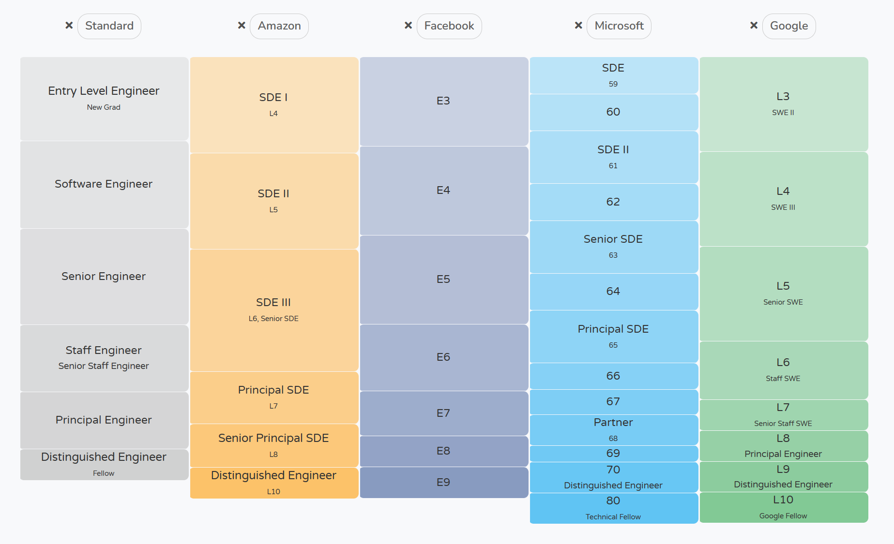

Справочник разработчика/инженера фронтэнда 2024
==============================================

### Написано [Коди Линдли](http://codylindley.com/) для [Frontend Masters](https://frontendmasters.com/?utm_source=guides&utm_medium=website&utm_campaign=feh2024)

Это автоперевод - https://frontendmasters.com/guides/front-end-handbook/2024/

Это руководство с открытым исходным кодом, пожалуйста, перейдите на ⭐️ на GitHub и вносите предложения/редактирования там! [https://github.com/FrontendMasters/front-end-handbook-2024](https://github.com/FrontendMasters/front-end-handbook-2024)

1\. Обзор сферы деятельности
-----------------------------

В этом разделе представлен обзор области front-end разработки/инжиниринга.

### 1.1 - Что такое (Frontend||UI|||UX) разработчик/инженер?

Разработчик/инженер фронтенда использует [технологии веб-платформы] (https://developer.mozilla.org/en-US/docs/web) - а именно HTML, CSS и JavaScript - для разработки фронтенда (т. е. пользовательского интерфейса, с которым взаимодействует пользователь) для веб-сайтов, веб-приложений и нативных приложений.

Большинство практиков знакомятся с этой профессией после создания своей первой веб-страницы на HTML. Самый простой и понятный результат работы front-end-разработчика/инженера - это HTML-документ, который запускается в веб-браузере и создает веб-страницу.

Профессиональные front-end разработчики в широком смысле создают:

* Фронт-энд **Веб-сайтов**, например, [wikipedia.org](https://www.wikipedia.org/)\- Веб-сайт - это набор взаимосвязанных веб-страниц и связанного с ними мультимедийного контента, доступного через Интернет. Обычно веб-сайт идентифицируется уникальным доменным именем и размещается на веб-серверах, а доступ к нему пользователи могут получить через веб-браузер. Веб-сайты выполняют различные функции - от простых статических до сложных динамических веб-страниц.
* Внешняя часть **Веб-приложений**, например, [gmail.com](https://www.gmail.com/)\- В отличие от нативных приложений, устанавливаемых на устройство, веб-приложения предоставляются пользователям через веб-браузер. Они часто взаимодействуют с базами данных для хранения, получения и манипулирования данными. Поскольку веб-приложения запускаются в браузере, они, как правило, являются кроссплатформенными и могут быть доступны на различных устройствах, включая настольные компьютеры, ноутбуки, планшеты и смартфоны. Распространенные библиотеки и фреймворки для разработки: [React.js](https://react.dev/)/[Next.js](https://nextjs.org/), [Svelte](https://svelte.dev/)/[SveltKit](https://kit.svelte.dev/), [Vue.js](https://vuejs.org/)/[Nuxt](https://nuxt.com/), [SolidJS](https://www.solidjs.com/)/[SolidStart](https://start.solidjs.com/), [Angular](https://angular.io/), [Astro](https://astro.build/), [Qwik](https://qwik.builder.io/), и [Lit](https://lit.dev/).
* Фронтенд **Нативные приложения на основе веб-технологий**, например, [Discord](https://discord.com/download)\- Нативное приложение на основе веб-технологий - это тип программного приложения, которое работает на одной или нескольких операционных системах (таких как Windows, macOS, Linux, iOS и Android) на основе единой кодовой базы веб-технологий (включая библиотеки и фреймворки веб-приложений). К распространенным фреймворкам и паттернам разработки в этой области относятся [Electron](https://www.electronjs.org/) для настольных приложений [React Native](https://reactnative.dev/) и [Capacitor](https://capacitorjs.com/) для мобильных приложений, а также более новые решения, такие как [Tauri V2](https://beta.tauri.app/guides/), которые поддерживают как мобильные, так и настольные операционные системы. Отметим, что нативные приложения, созданные на основе веб-технологий, либо запускают веб-технологии во время выполнения (например, Electron, Tauri), либо в той или иной степени трансформируют веб-технологии в нативный код и пользовательский интерфейс во время выполнения (например, React Native, [NativeScript](https://nativescript.org/)). Кроме того, [Progressive Web Apps (PWAs)](https://web.dev/articles/what-are-pwas) могут создавать приложения, устанавливаемые на одну или несколько операционных систем с нативным интерфейсом на основе единой кодовой базы веб-технологий.

### 1.2 - Распространенные названия должностей (на основе "Областей внимания" в разделе 2)

Ниже приведена таблица, содержащая большинство названий должностей в сфере front-end, сгруппированных по областям специализации.

| Область внимания | Общие названия вакансий |
| --- | --- |
| Разработка веб-сайтов | * Разработчик веб-сайтов * Front-end разработчик/инженер * Разработчик HTML и CSS |
| Разработка веб-приложений / разработка программного обеспечения | * Архитектор фронт-энд приложений * Инженер фронт-энд приложений * Разработчик фронт-энд программного обеспечения * Разработчик JavaScript * Веб-разработчик |
| Web UX / UI Engineering | * UX Developer/Engineer (aka UXE или User Experience Engineer) * UI Developer/Engineer * UI Design System Developer/Engineer |
| Web Test Engineering | * Front-end QA Developer/Engineer * UI Testing Developer/Engineer |
| Веб-инжиниринг производительности | * Разработчик/инженер производительности фронтэнда * Аналитик производительности веб-сайтов |
| Разработка веб-доступности | * Разработчик/инженер по доступности * Специалист по веб-доступности |
| Разработка веб-игр | * Разработчик/инженер фронт-энд игр * Разработчик/инженер HTML-игр |

### 1.3 - Карьерные уровни и компенсация

Грубо говоря, разработчики/инженеры (Frontend||UI||UX) продвигаются по карьерной лестнице/уровням (https://career-ladders.dev/engineering/) и получают следующую компенсацию.

| Уровень | Описание | Компенсация (USD)|
| --- | --- | --- |
| Младший инженер | Позиция начального уровня. Упор на обучение и развитие навыков. Под руководством старших сотрудников. | $40,000 - $80,000 |
| Инженер | Средний уровень, 2-5 лет опыта. Выполняет основные задачи по разработке и может браться за более сложные проекты. | $80,000 - $100,000 |
| Старший инженер | Опыт работы более пяти лет. Занимается сложными задачами и руководит проектами. | $100,000 - $130,000 |
| Ведущий инженер | Руководит командами или проектами. Участвует в принятии технических решений и планировании архитектуры. | $130,000 - $160,000 |
| Штатный инженер | Долгосрочные, высокопоставленные технические эксперты. Работают над архитектурой и дизайном высокого уровня. | $150,000 - $180,000 |
| Главный инженер | Высокоспециализированный специалист, часто с десятилетним или более опытом работы. Оказывает влияние на технические проекты всей компании. | $180,000 - $220,000 |
| Выдающийся инженер | Определяет или влияет на техническое направление на уровне всей компании. Работает над перспективными проектами. | $220,000 - $300,000 |

Обратите внимание, что компании обычно используют внутреннюю семантику уровней (например, уровень 66 от Microsoft).

Источник изображения: [https://www.levels.fyi/?compare=Standard,Amazon,Facebook,Microsoft,Google&track=Software%20Engineer](https://www.levels.fyi/?compare=Standard,Amazon,Facebook,Microsoft,Google&track=Software%20Engineer)

### 1.4 - Профессиональные проблемы

* **Разделение на фронт-энд:** ["Великое разделение"](https://css-tricks.com/the-great-divide/) в сфере фронт-энд веб-разработки описывает растущий раскол между двумя основными фракциями: JavaScript-ориентированными веб-программистами, которые сосредоточены на программных фреймворках и программировании для веб-приложений, и HTML/CSS-ориентированными разработчиками, которые специализируются на шаблонах пользовательского интерфейса, пользовательском опыте, взаимодействии, доступности, SEO, а также визуальных и структурных аспектах веб-страниц и приложений. Это разделение существует между программистами, ориентированными на компьютерные науки, которые отдают предпочтение навыкам программирования/программирования, необходимым для создания фронтенда веб-приложений, и теми, кто приходит к разработке фронтенда со стороны UI/UX, как правило, в качестве программистов-самоучек. Чтобы стать фронтенд-разработчиком, необходимо сочетать в себе и то, и другое, причем степень сочетания может быть субъективной. Однако в 2024 году очевидно, что на рынке труда предпочтение будет отдаваться программистам, ориентированным на JavaScript, владеющим такими навыками, как JavaScript/TypeScript, Terminal/CLI, Node.js, API, GIT, тестирование, CI/CD, принципы программного обеспечения, принципы программирования и т. д. (последующий пост: ["The great(er) divide in front-end"](https://pow.rs/blog/3-pillars-of-front-end-knowledge/) и ["Frontend design, React, and a bridge over the great divide"](https://bradfrost.com/blog/post/frontend-design-react-and-a-bridge-over-the-great-divide/)). Однако рынок труда - это лишь отражение выбора, сделанного в сфере веб-разработки, а не оценка качества этого выбора.
* **Отток технологий:** Отток технологий, быстрая эволюция и смена технологий, фреймворков и инструментов представляют собой серьезную проблему в области front-end разработки. Это явление может сделать роль одновременно захватывающей и в то же время пугающей и изнурительной.
* **Веб-совместимость:** Обеспечение стабильной работы веб-технологий на различных платформах (например, веб-браузеры, веб-вью, Electron и т. д.) хотя и не так сложно, как раньше, но все же требует значительных усилий и навыков.
* **Кроссплатформенная разработка:** Создание единой кодовой базы для работы на нескольких устройствах сопряжено с рядом трудностей, особенно в контексте фронтенд-разработки. Этот подход, часто называемый кросс-платформенной разработкой, направлен на создание программного обеспечения, которое будет легко работать на различных устройствах, таких как смартфоны, планшеты и настольные компьютеры, с различными операционными системами, такими как iOS, Android и Windows.
* **Адаптивный дизайн и разработка адаптивного дизайна:** Адаптивный и отзывчивый дизайн - важнейшие подходы в front-end разработке для создания веб-сайтов и приложений, обеспечивающих оптимальный просмотр на широком спектре устройств, от настольных мониторов до мобильных телефонов. Однако реализация этих решений зачастую может быть сложной и трудоемкой, что приводит к появлению сложного кода, который необходимо поддерживать и тестировать.
* **Фронтенд-разработка слишком сложна:** Все больше и больше растет общее мнение, что текущие практики и инструменты фронтенд-разработки слишком сложны и нуждаются в упрощении. Это напряжение реально, и мы все его чувствуем, но не все указывают на одни и те же причины.
* **Фронтенд-разработка несколько сбилась с пути:** В какой-то момент фронтенд-разработчик превратился в CS-программиста, способного работать с чрезмерно сложными фреймворками пользовательского интерфейса толстого клиента для создания программных решений в веб-браузерах на потенциально разных устройствах. Во многих отношениях фронтенд-разработка потеряла свой путь. Когда-то фронтенд-разработка в первую очередь фокусировалась на пользователе и пользовательском интерфейсе, а программирование играло второстепенную роль. Почему сегодня быть фронтенд-разработчиком означает, что нужно быть больше CS, чем UX? Потому что мы сбились с пути, мы приняли слишком много в области сложности и потеряли наше внимание к менее важным вопросам. Сейчас мы в некотором роде застряли во времени, когда мы были всем и ничем. Мы должны найти путь обратно к пользователю, обратно к пользовательскому интерфейсу.
* **Трудности при трудоустройстве:** В последнее время [поиск работы превратился в сложный процесс] (https://www.linkedin.com/pulse/ongoing-defence-frontend-full-time-job-christian-heilmann-%3FtrackingId=VHhV08dKVjv7a9ga59Govw%253D%253D/?trackingId=VHhV08dKVjv7a9ga59Govw%3D%3D), часто омрачаемый собеседованиями, в которых приоритет отдается субъективным и неважным критериям. В ходе таких собеседований часто не оцениваются навыки, относящиеся к реальным должностным обязанностям, что приводит к неполноценному процессу найма. В частности, технические роли часто понимаются неверно, а оценки сосредоточены на поверхностных обобщениях, а не на истинных технических знаниях. Успех при приеме на работу в этой области часто зависит скорее от случайности или связей, чем от всесторонней оценки личности человека, его способностей работать в команде, практического опыта, коммуникабельности, способности к обучению и критическому мышлению. Некоторые из наиболее эффективных практик найма связаны с признанием компаниями непредсказуемости процесса найма и применением более целостного подхода (т.е. отбор человека и привлечение его к небольшому короткому контракту на реальную работу).

2\. Области внимания
------------------

В этом разделе выделены и определены основные направления в области front-end разработки / проектирования.

### 2.1 - Разработка веб-сайтов

Разработка веб-сайтов в области front-end разработки относится к созданию и поддержке веб-сайтов. Она включает в себя создание как простых статических веб-страниц, так и сложных веб-приложений, обеспечивая их визуальную привлекательность, функциональность и удобство для пользователей.

**Ключевые обязанности:**

* Создание и структурирование веб-сайтов с использованием HTML, CSS и JavaScript.
* Обеспечение отзывчивого дизайна для различных устройств и размеров экрана.
* Front-end программирование для интерактивных и динамичных пользовательских интерфейсов.
* Внедрение SEO-оптимизации для улучшения рейтинга в поисковых системах.
* Повышение производительности сайта с помощью различных методов оптимизации.
* Поддержание кросс-браузерной совместимости.
* Соблюдение веб-стандартов и правил доступности.

**Инструменты и технологии:**

* Знание инструментов и языков веб-разработки, таких как HTML, CSS, JavaScript.
* Знакомство с инструментами графического дизайна для визуального оформления веб-сайтов.
* Использование инструментов тестирования и отладки для обеспечения функциональности сайта и решения проблем.

**Сотрудничество и коммуникация:**

* Сотрудничество с дизайнерами, создателями контента и другими разработчиками.
* Общение с заинтересованными сторонами для понимания и реализации веб-решений.

**Постоянное обучение и адаптация:**

* Постоянное знакомство с последними тенденциями и стандартами в области веб-разработки.
* Совершенствование навыков и адаптация к новым инструментам и методологиям веб-разработки.

### 2.2 - Разработка веб-приложений / разработка программного обеспечения

Разработка веб-приложений/программная инженерия в области front-end разработки фокусируется на создании сложных и динамичных веб-приложений. Эта область охватывает визуальные, интерактивные, архитектурные, производительные и интеграционные аспекты с внутренними службами веб-приложений.

**Ключевые обязанности:**

* Создание надежных и масштабируемых веб-приложений с использованием фронтенд-технологий и современных фреймворков.
* Проектирование структуры веб-приложений для обеспечения модульности, масштабируемости и ремонтопригодности.
* Интеграция внешних приложений с внутренними сервисами и API.
* Оптимизация веб-приложений для повышения скорости и эффективности.
* Создание отзывчивых дизайнов для различных устройств и размеров экрана.
* Обеспечение кроссбраузерной совместимости веб-приложений.
* Реализация лучших практик безопасности в веб-приложениях.

**Инструменты и технологии:**

* Знание языков и фреймворков фронтенда, таких как HTML, CSS, JavaScript, React, Angular, Vue.js.
* Умение пользоваться системами контроля версий, такими как Git.
* Знакомство с фреймворками для тестирования и инструментами для различных типов тестирования.

**Сотрудничество и коммуникация:**

* Сотрудничество с UX/UI дизайнерами, back-end разработчиками и менеджерами по продукту.
* Эффективное донесение технических концепций до членов команды и заинтересованных сторон.

**Постоянное обучение и адаптация:**

* Слежение за последними тенденциями в технологиях и методологиях веб-разработки.
* Постоянное изучение новых языков программирования, фреймворков и инструментов.

### 2.3 - Web UX / UI Engineering

Web UX/UI Engineering - это многогранное направление в области front-end разработки, посвященное проектированию и реализации удобных и визуально привлекательных интерфейсов для веб-приложений и веб-сайтов. Эта область объединяет принципы UX-дизайна, разработки пользовательского интерфейса, систем проектирования и дизайна взаимодействия для создания целостного и эффективного веб-опыта.

**Ключевые обязанности:**

* Проектирование пользовательского опыта (UX): Понимание потребностей и поведения пользователей для создания интуитивно понятных веб-интерфейсов, включая исследование пользователей и составление карты пути.
* Разработка пользовательского интерфейса (UI): Кодирование и создание интерфейса с использованием HTML, CSS и JavaScript, обеспечение отзывчивости и доступности дизайна.
* Системы дизайна: Разработка и поддержка систем дизайна для обеспечения согласованности веб-приложения.
* Дизайн взаимодействия: Создание привлекательных интерфейсов с продуманным взаимодействием и динамической обратной связью.
* Сотрудничество с дизайнерами: Работа с графическими дизайнерами и дизайнерами взаимодействия для воплощения визуальных концепций в функциональные интерфейсы.
* Прототипирование и создание каркасов: Использование инструментов для прототипирования и создания схем для демонстрации функциональности и макета.
* Тестирование юзабилити и обеспечение соответствия требованиям доступности: Проведение юзабилити-тестов и обеспечение соответствия стандартам доступности.
* Оптимизация производительности: Балансировка эстетических элементов и производительности сайта, оптимизация скорости и отзывчивости.

**Инструменты и технологии:**

* Инструменты для проектирования и прототипирования: Владение такими инструментами, как Adobe XD, Sketch или Figma, для проектирования UI/UX и создания прототипов.
* Языки и фреймворки для фронтальной разработки: Знание HTML, CSS, JavaScript и таких фреймворков, как React, Angular или Vue.js.
* Инструменты юзабилити и доступности: Использование инструментов для проведения юзабилити-тестов и обеспечения доступности.

**Коллаборация и коммуникация:**

* Взаимодействие с кросс-функциональными командами, включая разработчиков, менеджеров по продукту и заинтересованных лиц.
* Передача идей дизайна, прототипов и дизайна взаимодействия для согласования с целями проекта.

**Постоянное обучение и адаптация:**

* Постоянное знакомство с последними тенденциями в области UX/UI-дизайна, дизайна взаимодействия и front-end разработки.
* Адаптация к новым инструментам, технологиям и методологиям дизайна.

### 2.4 - Веб-тестирование

Тестовый инжиниринг в контексте front-end разработки включает в себя тщательное тестирование веб-приложений и веб-сайтов на предмет функциональности, производительности, кодирования и стандартов юзабилити. Эта область имеет решающее значение для поддержания качества и надежности веб-продуктов.

**Ключевые обязанности:**

* Разработка и реализация планов тестирования: Создание комплексных стратегий тестирования для различных аспектов веб-приложений.
* Автоматизированное тестирование: Использование автоматизированных фреймворков и инструментов для эффективного тестирования.
* Ручное тестирование: Дополнение автоматизированных тестов подходами ручного тестирования.
* Отслеживание ошибок и составление отчетов: Выявление и документирование ошибок, а также передача информации об обнаруженных ошибках для их устранения.
* Кросс-браузерное и кросс-платформенное тестирование: Обеспечение согласованной функциональности в различных браузерах и платформах.
* Тестирование производительности: Оценка скорости и эффективности работы веб-приложений в различных условиях.
* Тестирование безопасности: Оценка приложений на предмет уязвимостей и рисков безопасности.

**Инструменты и технологии:**

* Фреймворки и инструменты для тестирования: Знакомство с такими инструментами, как Selenium, Jest, PlayWright и Cypress.
* Инструменты для отслеживания ошибок: Использование таких инструментов, как JIRA, Bugzilla или Trello для отслеживания ошибок.

**Коллаборация и коммуникация:* *

* Работа с разработчиками, дизайнерами и менеджерами по продукту для обеспечения всестороннего тестирования.
* Эффективная передача результатов тестирования, отчетов об ошибках и показателей качества.

**Постоянное обучение и адаптация:**

* Постоянное знакомство с новейшими методологиями и инструментами тестирования.
* Адаптация к новым технологиям и фреймворкам в развивающейся сфере веб-разработки.

### 2.5 - Инженерия веб-производительности

Web Performance Engineering - это специализированная область фронтенд-разработки, направленная на оптимизацию производительности веб-сайтов и веб-приложений. Эта область влияет на пользовательский опыт, рейтинг в поисковых системах и общую эффективность сайта. Основная цель - обеспечить быструю загрузку и плавную работу веб-страниц.

**Ключевые обязанности:**

* Анализ производительности и бенчмаркинг: Оценка текущей производительности, выявление узких мест и установление контрольных показателей.
* Оптимизация времени загрузки: Использование методов для ускорения загрузки страниц.
* Отзывчивый и эффективный дизайн: Оптимизация использования ресурсов в веб-дизайне.
* Оптимизация производительности сети: Улучшение передачи данных по сети.
* Настройка производительности браузеров: Обеспечение бесперебойной работы в различных браузерах.
* Оптимизация производительности JavaScript: Написание эффективного JavaScript для повышения производительности сайта.
* Тестирование и мониторинг: Регулярное тестирование и мониторинг на предмет проблем с производительностью.

**Инструменты и технологии:**

* Инструменты тестирования производительности: Использование таких инструментов, как Google Lighthouse и WebPageTest.
* Инструменты мониторинга: Использование инструментов для постоянного отслеживания производительности.

**Сотрудничество и общение:**

* Работа с веб-разработчиками, дизайнерами и бэкэнд-командами для обеспечения комплексного учета производительности.
* Донесение важности производительности до заинтересованных сторон.

**Постоянное обучение и тенденции развития отрасли:**

* Постоянное обновление методов и технологий оптимизации веб-производительности.
* Следить за развитием веб-стандартов и лучших практик.

### 2.6 - Инженер по обеспечению веб-доступности

Инженер по веб-доступности призван обеспечить универсальную доступность веб-продуктов, особенно для пользователей с ограниченными возможностями. Их роль включает в себя глубокое понимание и внедрение стандартов веб-доступности, разработку доступных пользовательских интерфейсов, а также тщательное тестирование для выявления и устранения проблем с доступностью.

**Ключевые обязанности:**

* Знание Руководства по обеспечению доступности веб-контента (WCAG) является обязательным.
* Проектирование и адаптация веб-сайтов и приложений для обеспечения их полноценного использования людьми с различными нарушениями.
* Проведение регулярных оценок веб-продуктов с целью выявления и устранения препятствий доступности.

**Инструменты и технологии:**

* Использование программ чтения с экрана, средств тестирования доступности и браузерных средств обеспечения доступности.
* Применение HTML, CSS, тегов ARIA и JavaScript при разработке доступных веб-дизайнов.

**Сотрудничество и защита интересов:**

* Участие в командной работе с дизайнерами, разработчиками и заинтересованными сторонами.
* Продвижение идеи доступности и универсального веб-доступа.

**Постоянное обучение и обновление:**

* Следить за последними изменениями в стандартах доступности и технологиях.
* Совершенствование навыков и знаний для решения новых проблем доступности.

**Юридические и этические аспекты:**

* Понимание правовых рамок, таких как Закон об американцах с ограниченными возможностями (ADA).
* Соблюдение этических норм, направленных на обеспечение цифрового равенства и инклюзивности.

### 2.7 - Разработка веб-игр

Разработка веб-игр включает в себя создание интерактивных и увлекательных игр, которые запускаются непосредственно в веб-браузерах. Эта область отличается от традиционной разработки игр в первую очередь используемыми технологиями и платформой (веб-браузеры), на которой они создаются.

* **Технологии и инструменты -** Разработчики веб-игр часто используют HTML, CSS и JavaScript в качестве основных технологий. HTML позволяет создавать более интерактивный и насыщенный мультимедиа контент, что очень важно для разработки игр. JavaScript используется для игровой логики и динамики, а WebGL - для рендеринга 2D- и 3D-графики.
* **Фреймворки и библиотеки -** Несколько игровых движков и фреймворков на основе JavaScript облегчают разработку веб-игр. В качестве примера можно привести Phaser для общих целей, Three.js для 3D-игр и Pixi.js для 2D-игр.
* ** Дизайн игры -** Разработка веб-игр включает в себя такие элементы дизайна, как создание сюжета, дизайн персонажей, дизайн уровней и механики геймплея. Разработчику необходимо создать увлекательный пользовательский опыт в рамках ограничений веб-браузера.
* **Производительность -** Разработчики должны оптимизировать игры для производительности, обеспечивая быструю загрузку, плавную работу и отзывчивость. Среди приемов - использование анимации в спрайтовых листах и минимизация тяжелых активов.
* **Кроссплатформенный и отзывчивый дизайн -** Игры должны хорошо работать на различных браузерах и устройствах, что требует применения подхода, основанного на отзывчивом дизайне, и тщательного тестирования на различных платформах.
* **Монетизация и распространение -** Веб-игры можно монетизировать с помощью внутриигровых покупок, рекламы или прямых продаж. Они доступны непосредственно через веб-браузер без загрузки или установки.
* **Сообщество и поддержка -** Сообщество разработчиков веб-игр очень активно, с многочисленными форумами, учебными пособиями и ресурсами, доступными для разработчиков всех уровней.

Разработка веб-игр, как направление фронтенд-разработки, сочетает в себе творческий подход к дизайну игр и технические навыки в области веб-технологий, предлагая уникальную и захватывающую область для разработчиков, заинтересованных как в играх, так и в веб-разработке.

3\. Обучение / Образование / Тренинги
-----------------------------------

В этом разделе представлены ресурсы для тех, кто впервые знакомится с областью front-end разработки, а также ресурсы для тех, кто стремится стать профессионалом.

### 3.1 - Начальные шаги

Перед тем, как взять на себя долгосрочные обязательства по подписке, сертификации или получению формального образования, необходимо изучить область front-end разработки.

Вот несколько бесплатных ресурсов, которые можно использовать, чтобы получить представление о технологиях, инструментах и объеме знаний, необходимых для работы в качестве front-end разработчика/инженера:

* [WebGlossary.info](https://webglossary.info/)
* [Getting started with the web](https://developer.mozilla.org/en-US/docs/Learn/Getting_started_with_the_web) и [Front-end web developer](https://developer.mozilla.org/en-US/docs/Learn/Front-end_web_developer) на MDN
* [Learn HTML](https://web.dev/learn/html) на web.dev, [Learn CSS](https://web.dev/learn/css) на web.dev
* [HTML & CSS](https://www.codecademy.com/catalog/language/html-css), [JavaScript](https://www.codecademy.com/catalog/language/javascript) от Code Academy
* [Free Boot Camp](https://frontendmasters.com/bootcamp/?utm_source=guides&utm_medium=website&utm_campaign=feh2024) от Frontend Masters
* [Web Development for Beginners - A Curriculum](https://microsoft.github.io/Web-Dev-For-Beginners/#/?id=web-development-for-beginners-a-curriculum) от Microsoft
* [Complete Intro to Web Development, v3](https://frontendmasters.com/courses/web-development-v3/?utm_source=guides&utm_medium=website&utm_campaign=feh2024) от Frontend Masters
* [The Valley of Code](https://thevalleyofcode.com/)
* [Frontend Developer Roadmap](https://roadmap.sh/frontend) и [Frontend Developer Roadmap (Beginner Version)](https://roadmap.sh/frontend?r=frontend-beginner)

### 3.2 - Курсы по требованию

Курсы по требованию идеально подходят для тех, кто предпочитает учиться в своем собственном темпе и по своему собственному расписанию. Они также являются отличным дополнением к другим методам обучения, таким как очные занятия или самообучение.

* [Frontend Masters](https://frontendmasters.com/?utm_source=guides&utm_medium=website&utm_campaign=feh2024):
  * Описание: Frontend Masters - это специализированная обучающая платформа, ориентированная в первую очередь на веб-разработку. Здесь есть курсы и учебные курсы по всем наиболее важным технологиям front-end и fullstack.
  * Целевая аудитория: В первую очередь ориентирован на профессиональных веб-разработчиков и тех, кто хочет углубить свое понимание фронтенд-технологий. Контент варьируется от начального до продвинутого уровня.
  * Ключевые особенности: Предлагает семинары и курсы, проводимые отраслевыми экспертами, предоставляет пути обучения и включает в себя доступ к сообществу разработчиков. Платформа известна своими высококачественными, подробными курсами по всем ключевым технологиям и аспектам front-end разработки.
* [Code Academy](https://www.codecademy.com/):
  * Описание: Codecademy - это популярная платформа онлайн-обучения, предлагающая интерактивные курсы по широкому спектру языков программирования и технологических тем, включая веб-разработку, науку о данных и многое другое.
  * Целевая аудитория: Подходит для новичков и студентов среднего звена, предпочитающих более интерактивный, практический подход к изучению навыков кодирования.
  * Ключевые особенности: Известен своей интерактивной средой кодирования, в которой учащиеся могут практиковаться в написании кода прямо в браузере. Предлагает структурированные пути обучения, проекты и тесты для закрепления знаний.
* [LinkedIn Learning](https://www.linkedin.com/learning/) (бывший Lynda.com):
  * Описание: LinkedIn Learning предлагает широкий спектр курсов, охватывающих различные темы, включая веб-разработку, графический дизайн, бизнес и многое другое. Он интегрируется с платформой LinkedIn, предлагая персональные рекомендации по курсам.
  * Целевая аудитория: Идеально подходит для профессионалов, желающих расширить свой набор навыков в различных областях, не ограничиваясь только веб-разработкой.
  * Ключевые особенности: Предлагает видеокурсы с более общим подходом к профессиональному развитию. Учащиеся получают рекомендации по курсам на основе их профиля в LinkedIn, а пройденные курсы можно добавить в свой профиль в LinkedIn.
* [O'Reilly Learning](https://www.oreilly.com/online-learning/) (ранее Safari Books Online):
  * Описание: O'Reilly Learning - это комплексная образовательная платформа, предлагающая книги, видео, живые онлайн-тренинги и интерактивное обучение по широкому спектру технологических и бизнес-тем.
  * Целевая аудитория: Подходит для профессионалов и студентов в сфере технологий и бизнеса, которые ищут подробные материалы и ресурсы.
  * Ключевые особенности: Обширная библиотека книг и видеоматериалов от O'Reilly Media и других издательств, живые онлайн-тренинги и тематические исследования. Известен своей обширной коллекцией ресурсов и глубоким содержанием.

### 3.3 - Сертификация и пути обучения

Сертификация и учебные курсы - идеальный вариант для тех, кто предпочитает более структурированную программу обучения или хочет получить более формальную квалификацию. Обратите внимание, что сертификаты в области front-end разработки не воспринимаются так серьезно, как в других отраслях и профессиях, но они все равно могут быть ценными для демонстрации знаний и навыков.

* [Meta Front-End Developer Professional Certificate](https://www.coursera.org/professional-certificates/meta-front-end-developer) от Coursera.
* [Undergraduate Introduction to Web Development Certificate](https://extension.harvard.edu/academics/programs/undergraduate-introduction-to-web-development-certificate/) от Harvard Extension School
* [Профессиональный сертификат Front-End Web Developer](https://www.edx.org/certificates/professional-certificate/w3cx-front-end-web-developer?index=product&queryID=f80b0b0d548a3381ef4cc56f3d1eb6d9&position=5&linked_from=autocomplete&c=autocomplete) от edX
* [Front End Web Developer Nanodegree Program](https://www.udacity.com/course/front-end-web-developer-nanodegree--nd0011) от Udacity
* [Краткий курс Front-End Web Developer](https://generalassemb.ly/education/front-end-web-development) от General Assembly
* [Путь начинающего веб-разработчика](https://frontendmasters.com/learn/beginner/?utm_source=guides&utm_medium=website&utm_campaign=feh2024) и [Путь старшего веб-разработчика](https://frontendmasters.com/learn/professional/?utm_source=guides&utm_medium=website&utm_campaign=feh2024) от Frontend Masters
* [The Frontend Developer Career Path](https://scrimba.com/learn/frontend) от Scrimba
* [Front End Web Development Treehouse Techdegree](https://teamtreehouse.com/techdegree/front-end-web-development) от Treehouse

### 3.4 - Университетское/колледжное образование

В сфере высшего образования фронт-энд разработка обычно входит в более обширные академические дисциплины. Такие специальности, как компьютерные науки, информационные технологии и веб-разработка, часто включают в себя фронтенд-разработку в качестве важного компонента учебного плана.

4\. Основополагающие аспекты
------------------------

В этом разделе представлены и определены основные аспекты среды, в которой ведется фронтенд-разработка.

### 4.1 - Всемирная паутина (она же WWW или Web)

Всемирная паутина, широко известная как Web, представляет собой систему взаимосвязанных гипертекстовых документов и ресурсов. Доступ к ней осуществляется через Интернет. Для отображения веб-страниц используются браузеры, позволяющие пользователям просматривать, перемещаться и взаимодействовать с огромным количеством информации и мультимедиа. Создание Сети Тимом Бернерсом-Ли в 1989 году произвело революцию в обмене информацией и коммуникации, заложив основу для современной цифровой эры.

Подробнее:

* [Как работает веб](https://developer.mozilla.org/en-US/docs/Learn/Getting_started_with_the_web/How_the_Web_works) на MDN
* [The web](https://thevalleyofcode.com/the-web)

### 4.2 - Интернет

Интернет - это огромная сеть взаимосвязанных компьютеров, охватывающая весь земной шар. Это инфраструктура, обеспечивающая работу Всемирной паутины и других сервисов, таких как электронная почта и обмен файлами. Интернет работает на основе набора протоколов, наиболее фундаментальным из которых является протокол Интернета (IP), обеспечивающий маршрутизацию данных в этой огромной сети.

Подробнее:

* [Основы Интернета](http://internetfundamentals.com/) от Frontend Masters
* [Как работает Интернет?](https://developer.mozilla.org/en-US/docs/Learn/Common_questions/How_does_the_Internet_work) на MDN
* [The Internet](https://thevalleyofcode.com/the-internet)

### 4.3 - IP-адреса (Internet Protocol)

IP-адреса служат уникальными идентификаторами устройств в Интернете, подобно тому, как почтовый адрес определяет местоположение в физическом мире. Они необходимы для точной маршрутизации и доставки данных через Интернет. Каждому устройству, подключенному к Интернету, от компьютеров до смартфонов, присваивается IP-адрес.

Существует два основных типа стандартов IP-адресов:

* **IPv4 (Internet Protocol version 4)**: Это более старый и наиболее широко используемый стандарт. Длина адресов IPv4 составляет 32 бита, что позволяет теоретически получить около 4,3 миллиарда уникальных адресов. Обычно они представлены в десятичном формате, разделенном на четыре октета (например, 192.0.2.1).
* **IPv6 (Интернет-протокол версии 6)**: В связи с быстрым ростом Интернета и исчерпанием адресов IPv4 был введен протокол IPv6. Адреса IPv6 имеют длину 128 бит, что значительно расширяет количество доступных адресов. Они выражаются в шестнадцатеричном формате, разделенные двоеточиями (например, 2001:0db8:85a3:0000:0000:8a2e:0370:7334). Этот стандарт не только решает проблему ограниченности доступных адресов, но и улучшает различные аспекты IP-адресации, включая упрощение обработки маршрутизаторами и усиление функций безопасности.

Оба стандарта IP-адресов играют важную роль в современном ландшафте Интернета. Хотя IPv4 по-прежнему преобладает, переход на IPv6 происходит постепенно, так как потребность в увеличении количества интернет-адресов продолжает расти из-за распространения устройств, подключенных к Интернету.

### 4.4 - Доменные имена

Доменные имена служат интуитивными, удобными для человека идентификаторами веб-сайтов в Интернете, преобразуя технические адреса Интернет-протокола (IP) в легко запоминающиеся имена. По сути, они являются краеугольным камнем веб-навигации, упрощая процесс поиска и доступа к сайтам.

Например, такое доменное имя, как "example.com", гораздо более узнаваемо и легко запоминается, чем его цифровой аналог IP-адрес. Эта удобная система позволяет пользователям Интернета находить и посещать веб-сайты без необходимости запоминать сложные строки цифр (т. е. IP-адреса). Каждое доменное имя уникально, что позволяет каждому сайту иметь свой адрес в Интернете.

Структура доменных имен иерархична и обычно состоит из домена верхнего уровня (TLD), например '.com', '.org' или '.net', и домена второго уровня, который выбирает владелец сайта. Сочетание этих элементов образует полное доменное имя, которое представляет собой конкретный IP-адрес.

Доменные имена не только облегчают доступ к веб-сайтам, но и играют важнейшую роль в брендинге и создании онлайн-идентичности как для компаний, так и для частных лиц. В эпоху цифровых технологий доменное имя - это больше, чем просто адрес; это жизненно важная часть присутствия в Интернете и стратегии цифрового брендинга.

Узнать больше:

* [Что такое доменное имя?](https://developer.mozilla.org/en-US/docs/Learn/Common_questions/Web_mechanics/What_is_a_domain_name) на MDN.

### 4.5 - DNS (система доменных имен)

Система доменных имен (DNS) - это эквивалент телефонной книги в Интернете. Она переводит удобные для пользователя доменные имена (например, www.example.com) в IP-адреса, которые используют компьютеры. DNS очень важна для удобной навигации в Интернете, позволяя пользователям получать доступ к веб-сайтам без необходимости запоминать сложные цифровые IP-адреса.

Подробнее:

* [Как работает DNS - веселая и познавательная анимация](https://howdns.works/)

### 4.6 - URL (унифицированные указатели ресурсов)

Единые локаторы ресурсов (URL) - это адреса, используемые для доступа к ресурсам в Интернете. URL указывает местоположение ресурса на сервере и протокол, используемый для доступа к нему. Обычно он включает в себя протокол (например, HTTP или HTTPS), доменное имя и путь к ресурсу.

Подробнее:

* [Guide to URLs](https://developer.mozilla.org/en-US/docs/Learn/Common_questions/What_is_a_URL) на MDN.

### 4.7 - Серверы и веб-хостинг

Серверы - мощные двигатели цифрового мира - представляют собой специализированные компьютеры, предназначенные для обработки запросов и распространения данных через Интернет и локальные сети. Эти надежные машины составляют основу цифровой экосистемы, обеспечивая все - от размещения веб-сайтов до выполнения сложных приложений.

Веб-хостинг - важнейшая услуга в онлайн-сфере - подразумевает управление и предоставление серверной инфраструктуры наряду с надежным интернет-соединением. Необходимый для бесперебойной работы веб-сайтов и онлайн-приложений, веб-хостинг предлагает широкий спектр решений, отвечающих различным операционным потребностям и масштабам. Будь то персональный блог или крупный корпоративный сайт, множество вариантов веб-хостинга гарантирует идеальное соответствие любым уникальным требованиям и целям.

* ** Общий хостинг:** Экономичный вариант, при котором ресурсы одного сервера делятся между несколькими клиентами. Этот вариант лучше всего подходит для небольших сайтов и блогов, он выгоден с точки зрения бюджета, но предлагает ограниченные ресурсы и контроль.
* **VPS (Virtual Private Server) Hosting:** Баланс между доступностью и функциональностью. Клиенты пользуются общим сервером, но имеют индивидуальные виртуальные среды, что обеспечивает расширенные ресурсы и возможности настройки.
* **Dedicated Server Hosting:** Предлагает клиентам эксклюзивные серверы, обеспечивая максимальную доступность ресурсов, высочайшую производительность и повышенную безопасность. Идеально подходит для крупных компаний и сайтов с высокой посещаемостью.
* **Облачный хостинг:** Универсальное и масштабируемое решение, использующее сеть виртуальных серверов в облаке. Оно позволяет масштабировать ресурсы в зависимости от потребностей в трафике, что делает его идеальным для компаний с динамичным трафиком.

Выбор подходящего решения для веб-хостинга зависит от нескольких факторов, включая размер бизнеса, бюджетные ограничения, уровень трафика и конкретные технологические потребности. Постоянное совершенствование и диверсификация технологий хостинга серверов позволяют компаниям любого размера эффективно создавать и расширять свое присутствие в Интернете.

Узнать больше:

* [Что такое веб-сервер?](https://developer.mozilla.org/en-US/docs/Learn/Common_questions/What_is_a_web_server) на MDN
* [Все, что нужно знать о веб-хостинге](https://www.codecademy.com/resources/blog/what-is-web-hosting/)
* [Full Stack for Front-End Engineers, v3](https://frontendmasters.com/courses/fullstack-v3/?utm_source=guides&utm_medium=website&utm_campaign=feh2024) от Frontend Masters.

### 4.8 - CDN (Content Delivery Network)

Сеть доставки контента (CDN) представляет собой важнейшее достижение в технологиях распространения контента. Она представляет собой обширную сеть серверов, стратегически распределенных по различным географическим точкам. Эта сеть слаженно работает для ускорения доставки интернет-контента пользователям по всему миру.

Благодаря кэшированию контента, например веб-страниц, изображений и видеопотоков, на нескольких серверах, расположенных ближе к конечным пользователям, CDN значительно сокращают время задержки. Такая система особенно полезна для веб-сайтов с большим объемом трафика и онлайн-сервисов с глобальной базой пользователей. Близость серверов CDN к пользователям обеспечивает более высокую скорость доступа, улучшая общее впечатление пользователей за счет сокращения времени загрузки и повышения производительности сайта.

Помимо повышения скорости, CDN также способствуют балансировке нагрузки и обработке больших объемов трафика, повышая тем самым надежность и доступность веб-сайтов и веб-сервисов. Они эффективно справляются со скачками трафика и устраняют потенциальные "узкие места", обеспечивая стабильную доставку контента даже в пиковые моменты.

В современном цифровом ландшафте, где скорость и надежность имеют первостепенное значение, использование CDN стало неотъемлемой частью веб-инфраструктуры для компаний, стремящихся оптимизировать свое присутствие в Интернете и обеспечить превосходный пользовательский опыт.

Подробнее:

* [Что такое CDN?](https://www.cloudflare.com/learning/cdn/what-is-a-cdn/)
* [Введение в CDN](https://www.codecademy.com/article/intro-to-cdns)

### 4.9 - HTTP/HTTPS (протокол передачи гипертекста/безопасный протокол)

HTTP (HyperText Transfer Protocol) и HTTPS (HTTP Secure) - это основополагающие протоколы, используемые для передачи информации в Интернете. HTTP формирует основу для передачи данных во Всемирной паутине, в то время как HTTPS добавляет уровень безопасности к этой передаче.

Ключевые аспекты HTTP и HTTPS:

* **Основная функция:** HTTP предназначен для обеспечения связи между веб-браузерами и серверами. Он работает по схеме "запрос-ответ", когда браузер запрашивает данные, а сервер отвечает запрошенной информацией.
* **Безопасность с HTTPS:* ** HTTPS - это, по сути, HTTP с шифрованием. Он использует протоколы SSL/TLS для шифрования данных, передаваемых между браузером и сервером, повышая безопасность и защищая конфиденциальную информацию от перехвата или подделки.
* **Номера портов:** По умолчанию HTTP использует порт 80, а HTTPS - порт 443. Эти порты используются веб-серверами для приема входящих соединений от веб-клиентов.
* **Структура URL:** В URL-адресах HTTP обозначается 'http://', а HTTPS - 'https://'. Это небольшое различие в URL означает, защищено ли соединение с веб-сайтом с помощью шифрования или нет.

Различия и применение:

* **Безопасность данных:** Самое существенное различие - это безопасность. HTTPS обеспечивает безопасный канал, что особенно важно для сайтов, работающих с конфиденциальными данными, такими как банковские операции, покупки или личная информация.
* **SEO и доверие:** Поисковые системы, такие как Google, отдают предпочтение сайтам HTTPS, считая их более безопасными. Кроме того, веб-браузеры часто отображают предупреждения о безопасности для HTTP-сайтов, что влияет на доверие пользователей.
* **Требования к сертификатам:** Для внедрения HTTPS сайт должен получить сертификат SSL/TLS от признанного центра сертификации (CA). Этот сертификат необходим для создания надежного и зашифрованного соединения.
* **Производительность:** Хотя раньше HTTPS работал медленнее, чем HTTP, из-за процесса шифрования, развитие технологий позволило значительно сократить этот разрыв в производительности.

Понимание различий между HTTP и HTTPS крайне важно как для веб-разработчиков, так и для пользователей. Выбор между ними может существенно повлиять на безопасность сайта, доверие пользователей и рейтинг в поисковых системах.

Подробнее:

* [Руководство по HTTP](https://developer.mozilla.org/en-US/docs/Web/HTTP) на MDN
* [Краткий курс по HTTP, о котором никто не просил](https://fasterthanli.me/articles/the-http-crash-course-nobody-asked-for?ck_subscriber_id=478659505)

Спецификации:

* [Hypertext Transfer Protocol (HTTP/1.1)](https://httpwg.org/specs/rfc7230.html)
* [HTTP/2](https://http2.github.io/)

Ссылки:

* [Коды статуса ответа HTTP](https://developer.mozilla.org/en-US/docs/Web/HTTP/Status) на MDN

### 4.10 - Веб-браузеры

Веб-браузеры - это сложные программные приложения, которые играют решающую роль в доступе и взаимодействии с Всемирной паутиной. Они служат интерфейсом между пользователями и веб-контентом, отображая веб-страницы и обеспечивая беспрепятственное взаимодействие с пользователем. Вот более подробный обзор их функциональности и возможностей:

Основные функции веб-браузеров:

* **Обработка веб-контента:** Браузеры интерпретируют и отображают контент, написанный на HTML, CSS и JavaScript. Они обрабатывают HTML для структуры, CSS для представления и JavaScript для интерактивности, преобразуя их в визуальные и интерактивные веб-страницы.
* ** Цикл запросов и ответов:** Когда пользователь запрашивает веб-страницу, браузер отправляет этот запрос на сервер, где размещена страница. В ответ сервер предоставляет необходимые файлы (HTML, CSS, JavaScript, изображения и т. д.), которые браузер обрабатывает для визуализации страницы.
* **Выполнение JavaScript:** Современные браузеры оснащены движками JavaScript, которые выполняют код JavaScript, обеспечивая динамическое взаимодействие на веб-страницах, такое как проверка формы, анимация и асинхронный сбор данных.

Как браузеры работают за кулисами:

* **Парсинг:** Браузеры анализируют HTML, CSS и JavaScript файлы, чтобы понять структуру, стиль и поведение веб-страницы.
* **Рендеринг:** В каждом браузере есть механизм рендеринга, который преобразует веб-контент в то, что пользователи видят на экране. Это включает в себя расчеты макета, вычисление стиля и рисование конечного визуального результата.
* **Оптимизация:** Современные браузеры оптимизируют производительность с помощью таких методов, как кэширование (хранение копий часто используемых ресурсов) и ленивая загрузка (загрузка некритичных ресурсов только при необходимости).

Роль браузеров в веб-разработке:

* **Кросс-браузерная совместимость:** Разработчики должны обеспечить корректную работу веб-сайтов в различных браузерах, каждый из которых имеет свои особенности и поведение рендеринга.
* **Доступность:** Они предоставляют функции, которые помогают сделать веб-контент доступным для всех пользователей, включая людей с ограниченными возможностями.

Подробнее:

* [Наполнение страницы: как работают браузеры](https://developer.mozilla.org/en-US/docs/Web/Performance/How_browsers_work) на MDN
* [Как работают браузеры](https://web.dev/articles/howbrowserswork) на web.dev

Инструменты:

* [Edge](https://www.microsoft.com/en-us/edge?ep=250&form=MA13LM&es=40)
* [Chrome](https://www.google.com/chrome/)
* [Firefox](https://www.mozilla.org/en-US/firefox/new/)

### 4.11 - Движки JavaScript

Движки JavaScript, иногда называемые "виртуальными машинами JavaScript", - это специализированные программные компоненты, предназначенные для обработки, компиляции и выполнения кода JavaScript. JavaScript, будучи высокоуровневым интерпретируемым языком сценариев, требует движка для преобразования его в исполняемый код, который может понять компьютер. Эти движки являются не только частью веб-браузеров, но и используются в других контекстах, например, в серверах (в Node.js используется движок V8).

Основные функции движков JavaScript:

* **Парсинг**: Движок читает исходный код JavaScript, разбивая его на понятные ему элементы (лексемы) и создавая структуру (Abstract Syntax Tree - AST), которая представляет синтаксическую структуру программы.
* **Компиляция**: Современные движки JavaScript используют технику, называемую Just-In-Time (JIT) компиляцией. Во многих движках этот процесс включает два этапа:
  * Базовая компиляция: Быстро преобразует JavaScript в более простой промежуточный код.
  * Оптимизирующая компиляция: Дальнейшая компиляция кода в более оптимизированный машинный код, повышающий производительность. Движок может деоптимизировать код, если некоторые предположения больше не актуальны.
* **Исполнение**: Скомпилированный код выполняется процессором компьютера.
* **Оптимизация**: Во время выполнения движок собирает данные для оптимизации производительности кода в режиме реального времени, часто перекомпилируя его для повышения эффективности.

Основные движки JavaScript:

* **V8 (Google Chrome, Node.js, Microsoft Edge)**: Известный своей скоростью и эффективностью, V8 компилирует JavaScript непосредственно в нативный машинный код перед его выполнением.
* **SpiderMonkey (Mozilla Firefox)**: Первый движок JavaScript, который претерпел значительные изменения, сосредоточившись на производительности и масштабируемости.
* **JavaScriptCore (Safari)**: Известный также под названием Nitro, он делает упор на эффективное выполнение.

Подробнее:

* [Движок JavaScript](https://en.wikipedia.org/wiki/JavaScript_engine)
* [Bare Metal JavaScript: The JavaScript Virtual Machine](https://frontendmasters.com/courses/javascript-cpu-vm/) от Frontend Masters

5\. Основные компетенции
---------------------

В этом разделе выделены и определены основные компетенции, связанные с работой фронтенд-разработчика.

### 5.1 - Редакторы кода

Редакторы кода - это программные инструменты, используемые разработчиками для написания и редактирования кода. Они являются неотъемлемой частью инструментария программиста, призванного облегчить процесс написания кода за счет создания удобной и эффективной среды. Редакторы кода могут варьироваться от простых, легких программ до сложных интегрированных сред разработки (IDE) с широким набором функций.

**Основные характеристики редакторов кода:**

* Подсветка синтаксиса: Они выделяют различные части исходного кода различными цветами и шрифтами, улучшая читаемость и выделяя элементы кода.
* Завершение кода: Эта функция, также известная как IntelliSense или автозавершение, предлагает завершения для частично набранных строк.
* Обнаружение ошибок: Многие редакторы обнаруживают синтаксические ошибки в режиме реального времени, помогая быстро отлаживать код.
* Управление файлами и проектами: Часто включаются функции управления файлами и проектами, облегчающие навигацию в сложных проектах.
* Персонализация и расширения: Большинство редакторов предлагают возможность настройки и поддержку расширений для добавления дополнительных функций.
* Интегрированная среда разработки (IDE): Сочетает в себе возможности редактора кода с дополнительными инструментами, такими как отладчики и контроль версий.

Выбор редактора кода зависит от таких факторов, как язык программирования, сложность проекта, предпочтения по пользовательскому интерфейсу и необходимые функциональные возможности. Некоторые разработчики предпочитают простые редакторы для быстрого редактирования, в то время как другие выбирают надежные IDE для полноценной разработки. Редакторы кода незаменимы в процессе разработки программного обеспечения.

Подробнее:

* [Редакторы кода/текста](https://developer.mozilla.org/en-US/docs/Learn/Common_questions/Tools_and_setup/Available_text_editors) на MDN

Инструменты:

* [Visual Studio Code (aka VScode)](https://code.visualstudio.com/)
* [Zed](https://zed.dev/)

### 5.2 - Язык разметки гипертекста (HTML)

HTML, что расшифровывается как HyperText Markup Language, - это стандартный язык, используемый для создания и оформления веб-страниц. Это не язык программирования, как JavaScript; вместо этого это язык разметки, который определяет структуру и расположение веб-страницы.

Вот основные принципы работы HTML:

* **Элементы и теги:** HTML использует "элементы" для определения различных частей веб-страницы. Каждый элемент заключен в "теги", которые пишутся в угловых скобках. Например, &lt;p&gt; - это открывающий тег для абзаца, а &lt;/p&gt; - закрывающий тег. Содержание находится между этими тегами.
* **Структура документа:** HTML-документ имеет определенную структуру, состоящую из заголовка (&lt;head&gt;) и тела (&lt;body&gt;). Заголовок содержит метаинформацию, например, заголовок страницы, а тело - собственно содержимое, видимое пользователям.
* **Иерархия и вложенность:** Элементы могут быть вложены друг в друга для создания иерархии. Такая вложенность помогает организовать содержимое и определяет отношения родитель-ребенок между элементами.
* **Атрибуты:** Элементы могут иметь атрибуты, которые предоставляют дополнительную информацию о них. Например, атрибут href в элементе якоря (ссылки) (&lt;a&gt;) указывает URL, на который ведет ссылка.
* **Общие элементы:** Некоторые общие элементы HTML включают:
  * &lt;h1&gt; - &lt;h6&gt;: Элементы заголовков, причем &lt;h1&gt; является самым высоким уровнем.
  * &lt;p&gt;: Элемент абзаца.
  * &lt;a&gt;: Элемент якоря для ссылок.
  * &lt;img&gt;: Элемент изображения.
  * &lt;ul&gt;, &lt;ol&gt;, &lt;li&gt;: Элементы неупорядоченного (пули) и упорядоченного (числа) списка.

Представьте себе HTML как скелет веб-страницы. Он описывает структуру, но не занимается визуальным оформлением (для этого есть CSS) или интерактивной функциональностью (область JavaScript). Как фронтенд-инженер, вы будете использовать HTML в сочетании с CSS и JavaScript для создания и стилизации динамичных, интерактивных веб-страниц.

Подробнее:

* [Руководство по HTML](https://developer.mozilla.org/en-US/docs/Learn/HTML) на MDN
* [Введение в HTML](https://frontendmasters.com/bootcamp/introduction-html/?utm_source=guides&utm_medium=website&utm_campaign=feh2024) (часть бесплатного Bootcamp) от Frontend Masters
* [Полное введение в веб-разработку](https://frontendmasters.com/courses/web-development-v3/?utm_source=guides&utm_medium=website&utm_campaign=feh2024) (раздел HTML) от Frontend Masters
* [Изучаем HTML](https://web.dev/learn/html) на web.dev

Спецификации:

* [HTML Living Standard](https://html.spec.whatwg.org/multipage/)

Ссылки:

* [htmlreference.io](https://htmlreference.io)
* [Справочник по элементам HTML](https://developer.mozilla.org/en-US/docs/Web/HTML/Element)

Инструменты:

* [HTML5 Boilerplate](https://html5boilerplate.com/)
* [HTMLLint](https://htmlhint.com/)

### 5.3 - Каскадные таблицы стилей (CSS)

CSS, или каскадные таблицы стилей, - это основной язык таблиц стилей, используемый в веб-разработке для описания представления документов, написанных на HTML. Он позволяет разработчикам и дизайнерам управлять визуальной эстетикой веб-страниц, включая макет, цвета, шрифты и реагирование на различные размеры экрана. В отличие от HTML, который структурирует содержимое, CSS фокусируется на том, как это содержимое отображается, позволяя разделить содержание и дизайн для более эффективной и гибкой стилизации. Каскадный" аспект CSS позволяет нескольким таблицам стилей влиять на одну веб-страницу, при этом определенные правила имеют приоритет над другими, что обеспечивает целостность и визуальную привлекательность пользовательского опыта в Интернете.

Представьте себе HTML как скелет веб-страницы - он определяет, где располагаются заголовки, абзацы, изображения и другие элементы. CSS - это как одежда и макияж: он определяет, как выглядят эти элементы. Ниже приведено описание:

* **Селекторы и свойства**: В CSS вы пишете "правила", которые нацелены на элементы HTML. Эти правила определяют, как следует стилизовать элементы. Правило CSS состоит из "селектора" (который нацелен на элемент HTML) и "свойства" (которое его стилизует). Например, вы можете создать правило, которое нацелено на все элементы &lt;p&gt; (абзацы) и устанавливает для них красный цвет текста.
* **Каскадирование и специфика:** Стили применяются в порядке убывания специфичности, причем наиболее специфичными являются встроенные стили, за которыми следуют селекторы ID, классов и тегов.
* **Бокс-модель**: В CSS все рассматривается как коробка, со свойствами padding, borders и margins. Эти свойства определяют пространство вокруг и внутри каждого элемента, влияя на расположение и интервалы.
* **Внешний, внутренний и встроенный:** CSS может быть включен во внешний .css-файл, во внутренний HTML-шаблон или встроен в HTML-элементы.
* **Респонсивный дизайн**: CSS позволяет сделать так, чтобы веб-страницы хорошо смотрелись на различных устройствах и размерах экрана. Для этого часто используются "медиа-запросы", которые применяют различные стили в зависимости от характеристик устройства, например, его ширины.
* **Анимация и взаимодействие**: CSS - это не только статичные стили. Вы можете создавать анимацию, переходы и эффекты наведения, повышая интерактивность и визуальную привлекательность вашей веб-страницы.

Понимание CSS предполагает знакомство с его синтаксисом и правилами, а затем их применение для создания визуально привлекательных и функциональных веб-страниц. Будучи фронтенд-инженером, вы часто будете тесно работать с CSS, наряду с HTML и JavaScript, для создания пользовательской части веб-сайтов и приложений.

Подробнее:

* [Guide to CSS](https://developer.mozilla.org/en-US/docs/Learn/CSS) на MDN
* [Frontend Masters Introduction to CSS](https://frontendmasters.com/bootcamp/introduction-css/?utm_source=guides&utm_medium=website&utm_campaign=feh2024) (часть бесплатного Bootcamp) от Frontend Masters
* [Полное введение в веб-разработку](https://frontendmasters.com/courses/web-development-v3/?utm_source=guides&utm_medium=website&utm_campaign=feh2024) (раздел CSS) от Frontend Masters
* [Getting Started with CSS](https://frontendmasters.com/courses/getting-started-css/?utm_source=guides&utm_medium=website&utm_campaign=feh2024) от Frontend Masters
* [Learn CSS](https://web.dev/learn/css) на web.dev

Спецификации:

* [Спецификации CSS](https://www.w3.org/Style/CSS/current-work)

Ссылки:

* [cssreference.io](http://cssreference.io/)
* [css4-selectors.com](http://css4-selectors.com/)
* [CSS Reference](https://developer.mozilla.org/en-US/docs/Web/CSS/Reference) на MDN
* [CSS Selectors Reference](https://developer.mozilla.org/en-US/docs/Web/CSS/CSS_Selectors) на MDN
* [What's next for CSS?](https://cssdb.org/)

### 5.4 - Язык программирования JavaScript (ECMAScript 262)

**JavaScript**, также известный как ECMAScript, - это динамический язык программирования, имеющий решающее значение для веб-разработки. Он работает вместе с HTML и CSS для создания интерактивных веб-страниц и является неотъемлемой частью большинства веб-приложений.

**Роль в веб-разработке:**

* JavaScript, наряду с HTML и CSS, является основополагающей технологией Всемирной паутины. Он добавляет интерактивность веб-страницам.
* В основном он используется для создания сценариев на стороне клиента, запускаемых в веб-браузере пользователя для добавления интерактивных функций.

**За пределами веб-страниц:**

* С помощью Node.js JavaScript можно использовать и на стороне сервера, что позволяет разрабатывать полномасштабные веб-приложения.
* Node.js также позволяет разработчикам создавать инструменты интерфейса командной строки (CLI) с помощью JavaScript. Это расширяет возможности JavaScript, включая управление сервером, задачи автоматизации и средства разработки, причем на привычном для веб-разработчиков языке.

**Ключевые особенности:**

* JavaScript ориентирован на события и реагирует на действия пользователя, делая веб-сайты более динамичными.
* Он поддерживает асинхронное программирование для таких задач, как загрузка новых данных без перезагрузки всей страницы.
* Он использует объектную ориентацию на основе прототипов, предлагая гибкие модели наследования.

** Кривая обучения и сообщество:**

* Его часто рекомендуют в качестве первого языка программирования из-за его дружелюбности к новичкам и немедленной визуальной обратной связи в веб-браузерах.
* JavaScript имеет большое сообщество разработчиков, предоставляющее множество ресурсов, учебников и документации для изучающих.

JavaScript - это мощный язык программирования, который необходим для веб-разработки. Это универсальный язык, который можно использовать как для фронтенд-, так и для бэкенд-разработки, что делает его обязательным для изучения начинающими веб-разработчиками.

Подробнее:

* [Руководство по JavaScript](https://developer.mozilla.org/en-US/docs/Web/JavaScript) на MDN
* [Введение в JavaScript](https://frontendmasters.com/bootcamp/introduction-javascript/?utm_source=guides&utm_medium=website&utm_campaign=feh2024) (часть бесплатного Bootcamp) от Frontend Masters
* [JavaScript: от первых шагов до профессионала](https://frontendmasters.com/courses/javascript-first-steps/?utm_source=guides&utm_medium=website&utm_campaign=feh2024) от Frontend Masters
* [JavaScript Learning Path](https://frontendmasters.com/learn/javascript/?utm_source=guides&utm_medium=website&utm_campaign=feh2024) от Frontend Masters
* [JavaScript Roadmap](https://roadmap.sh/javascript)

Спецификации:

* [ECMAScript 262](https://tc39.es/ecma262/)

Ссылка:

* [MDN JavaScript Reference](https://developer.mozilla.org/en-US/docs/Web/JavaScript/Reference) на MDN

### 5.5 - Объектная модель документа (DOM)

Объектная модель документа (DOM) - это фундаментальный интерфейс программирования для веб-документов, который представляет веб-страницу как иерархическое дерево узлов, позволяющее динамическое взаимодействие и манипулирование. Эта модель превращает каждый элемент HTML, атрибут и фрагмент текста в доступный объект, позволяя языкам программирования, в частности JavaScript, эффективно изменять структуру, стиль и содержание страницы. Древовидная структура DOM не только упрощает навигацию и редактирование веб-документов, но и способствует обновлению в реальном времени, обработке событий и взаимодействию, что делает ее незаменимой для создания отзывчивых и интерактивных веб-приложений.

Ключевые особенности:

* **Деревянная структура:** DOM представляет веб-страницу в виде дерева с элементами, атрибутами и текстом в качестве узлов. Например, HTML-документ представляет собой дерево, включающее такие узлы, как `<html>`, `<head>` и `<body>`.
* **Манипулирование:** Языки программирования, особенно JavaScript, могут манипулировать DOM. Это позволяет изменять HTML-элементы, атрибуты и текст, а также добавлять или удалять элементы.
* **Обработка событий:** DOM обрабатывает события, вызванные взаимодействием с пользователем или действиями браузера. Он позволяет скриптам реагировать на эти события с помощью обработчиков событий.
* **Динамические изменения:** С помощью DOM веб-страницы могут динамически менять содержимое и структуру без необходимости перезагрузки, что позволяет создавать интерактивные и динамичные веб-приложения.

DOM - важнейшая часть веб-разработки, позволяющая создавать динамические и интерактивные веб-страницы. Это мощный интерфейс, который является основополагающим для веба и поддерживается всеми современными браузерами.

Подробнее:

* [Введение в DOM](https://developer.mozilla.org/en-US/docs/Web/API/Document_Object_Model/Introduction) на MDN
* [DOM Enlightenment](https://domenlightenment.com/)
* [Vanilla JS: Возможно, вам не нужен фреймворк](https://frontendmasters.com/courses/vanilla-js-apps/?utm_source=guides&utm_medium=website&utm_campaign=feh2024) на Frontend Masters

Спецификации:

* [DOM Living Standard](https://dom.spec.whatwg.org/)

Ссылки:

* [MDN DOM interfaces](https://developer.mozilla.org/en-US/docs/Web/API/Document_Object_Model) на MDN

### 5.6 - TypeScript

TypeScript - это язык программирования с открытым исходным кодом, разработанный и поддерживаемый компанией Microsoft. Он является надмножеством JavaScript, что означает, что любой правильный код JavaScript также является правильным кодом TypeScript. TypeScript добавляет в JavaScript необязательную статическую типизацию, а также другие возможности, улучшающие опыт разработки, особенно в больших или более сложных кодовых базах.

**Ключевые особенности TypeScript:**

* Статическая проверка типов: TypeScript обеспечивает статическую проверку типов, позволяя разработчикам определять типы для переменных, параметров функций и возвращаемых значений. Это помогает выявлять ошибки и недочеты во время разработки, а не во время выполнения.
* Вывод типов: Хотя TypeScript поощряет явное указание типов, он также обладает мощными возможностями вывода типов. Это означает, что он может выводить типы из контекста, сокращая количество кодового кода, связанного с типами.
* Расширенная система типов: Система типов TypeScript включает такие возможности, как дженерики, перечисления, кортежи и типы объединения/пересечения. Эти расширенные возможности обеспечивают надежную основу для написания сложного и хорошо структурированного кода.
* Интеграция с библиотеками JavaScript: TypeScript можно использовать с существующими библиотеками и фреймворками JavaScript. Доступны определения типов для многих популярных библиотек, что позволяет использовать их в проекте TypeScript с преимуществами проверки типов.
* Поддержка инструментария: TypeScript имеет отличную инструментальную поддержку в интегрированных средах разработки (IDE) и редакторах, таких как Visual Studio Code. Это включает такие функции, как автозавершение, навигация и рефакторинг.

**Преимущества использования TypeScript:**

* Повышение качества кода и удобство сопровождения: Статическая типизация помогает обнаружить ошибки на ранних этапах разработки, повышая общее качество кода.
* Облегчение рефакторинга и отладки: Типы облегчают рефакторинг и отладку кода, поскольку предоставляют больше информации о том, что должен делать код.
* Лучший опыт разработчика: Поддержка инструментов с автозаполнением, навигацией по коду и документацией улучшает работу разработчиков.
* Масштабируемость: TypeScript хорошо подходит для больших кодовых баз и команд, где его функции могут помочь справиться со сложностью и обеспечить согласованность кода.

**Вопросы:**

* Кривая обучения: Для разработчиков, не знакомых со статической типизацией, существует кривая обучения для эффективного использования TypeScript.
* Этап компиляции: Необходимость транспилировать TypeScript в JavaScript добавляет дополнительный шаг в процесс сборки.

В целом, TypeScript улучшает JavaScript, добавляя статическую типизацию и другие полезные функции, что делает его мощным выбором для разработки крупномасштабных приложений или проектов, в которых приоритетом является поддержка кода. Он широко распространен в сообществе разработчиков фронтенда, особенно в тех проектах, где разработчики выигрывают от его надежной системы типов и поддержки инструментария.

Подробнее:

* [TypeScript Handbook](https://www.typescriptlang.org/docs/handbook/2/basic-types.html)
* [TypeScript 5+ Fundamentals, v4](https://frontendmasters.com/courses/typescript-v4/?utm_source=guides&utm_medium=website&utm_campaign=feh2024) от Frontend Masters
* [TypeScript Learning Path](https://frontendmasters.com/learn/typescript/?utm_source=guides&utm_medium=website&utm_campaign=feh2024) от Frontend Masters
* [Beginner's TypeScript](https://www.totaltypescript.com/tutorials/beginners-typescript)
* [The Concise TypeScript Book](https://github.com/gibbok/typescript-book)
* [TypeScript Road Map](https://roadmap.sh/typescript)

Инструменты

* [TypeScript Playground](https://www.typescriptlang.org/play)
* [tsdocs.dev](https://tsdocs.dev/)
* [ts-reset](https://www.totaltypescript.com/ts-reset)

### 5.7 - JavaScript Web APIs (aka Web Browser APIs)

JavaScript Web Platform APIs - это набор интерфейсов прикладного программирования (API), которые встроены в веб-браузеры. Они представляют собой строительные блоки для современных веб-приложений, позволяя разработчикам взаимодействовать с браузером и базовой операционной системой. Эти API позволяют веб-приложениям выполнять различные задачи, которые традиционно были возможны только в нативных приложениях.

**Ключевые категории и примеры:**

* **Графические и мультимедийные API:** Графические API, такие как Canvas и WebGL, позволяют рендерить 2D и 3D графику. Медиа-интерфейсы позволяют воспроизводить аудио- и видеоконтент и манипулировать им, например, интерфейс `HTMLMediaElement` и Web Audio API.
* **Коммуникационные API:** Облегчают взаимодействие между различными частями веб-приложения или между приложениями. Примерами являются WebSockets и Fetch API.
* ** API устройств:** Предоставляют доступ к возможностям пользовательского устройства, таким как камера, микрофон, GPS. Примеры: Geolocation API, Media Capture and Streams API и Battery Status API.
* ** API хранения:** Позволяют веб-приложениям хранить данные локально на устройстве пользователя. Примеры: API локального хранения и IndexedDB.
* **Service Workers и Offline API:** Позволяют приложениям работать в автономном режиме и повышают производительность за счет кэширования ресурсов. Service Workers могут перехватывать сетевые запросы и доставлять push-сообщения.
* **Performance APIs:** Помогают измерять и оптимизировать производительность веб-приложений. В качестве примера можно привести API Navigation Timing и API Performance Observer.

API веб-платформы значительно расширили возможности веб-приложений, сделав их более интерактивными, отзывчивыми и многофункциональными. Они позволяют разработчикам создавать приложения, работающие на различных платформах и устройствах, без необходимости использования собственного кода, что сокращает время и стоимость разработки. Использование этих API является основой для создания современных веб-приложений, обеспечивающих пользовательский опыт, сравнимый с нативными приложениями.

Эти API стандартизированы такими организациями, как World Wide Web Consortium (W3C) и Web Hypertext Application Technology Working Group (WHATWG). Браузеры могут поддерживать различные API по-разному.

Подробнее:

* [Введение в веб-интерфейсы API](https://developer.mozilla.org/en-US/docs/Learn/JavaScript/Client-side_web_APIs/Introduction) на MDN
* [Список веб-интерфейсов JavaScript (спецификации и интерфейсы)](https://developer.mozilla.org/en-US/docs/Web/API) на MDN
* [The Web Platform: Browser technologies](https://html-now.github.io)
* [Browser APIs Learning Path](https://frontendmasters.com/learn/browser-apis/?utm_source=guides&utm_medium=website&utm_campaign=feh2024) от Frontend Masters

### 5.8 - Объектная нотация JavaScript (JSON)

JSON (JavaScript Object Notation) - это легкий формат обмена данными, который легко читается и пишется людьми и легко разбирается и генерируется машинами. Это текстовый формат, состоящий из пар имя-значение и упорядоченных списков значений, который широко используется в веб-разработке и различных других контекстах программирования. Вот описание его ключевых характеристик:

* **Легкий формат данных:** JSON основан на тексте, что делает его легким и подходящим для обмена данными.
* **Человекочитаемый и машиночитаемый:** Его структура проста и понятна, что делает его читаемым для людей и легко разбираемым для машин.
* **Независимость от языка:** Несмотря на свое название, JSON не зависит от JavaScript и может использоваться со многими языками программирования.

Простота, эффективность и широкая поддержка JSON в языках программирования сделали его фундаментальным инструментом в современной разработке программного обеспечения, особенно для веб-интерфейсов API, управления конфигурацией и обмена данными в распределенных системах.

Подробнее:

* [Официальный сайт JSON](https://www.json.org/json-en.html)
* [Работа с JSON](https://developer.mozilla.org/en-US/docs/Learn/JavaScript/Objects/JSON) на MDN

### 5.9 - Модули ES

Модули ES (ECMAScript Modules) - это официальный стандарт для модульного кода JavaScript. Они обеспечивают эффективную структуру и организацию кода JavaScript для повторного использования.

Ключевые особенности ES-модулей:

* **Синтаксис экспорта и импорта:* *
  * Модули ES позволяют разработчикам экспортировать функции, объекты или примитивы из модуля, чтобы их можно было повторно использовать в других файлах JavaScript. Для этого используется ключевое слово `export`.
  * И наоборот, ключевое слово `import` используется для переноса этих экспортируемых функций из других модулей, создавая сеть зависимостей, которые легко отслеживать и управлять ими.
* **Модульная структура кода:* *
  * Разбивая код JavaScript на более мелкие модульные файлы, ES-модули способствуют более организованной структуре кода. Такая модульность приводит к улучшению читаемости и сопровождаемости кода, особенно в крупномасштабных приложениях.
* ** Статическая структура модулей:* * *
  * Модули ES имеют статическую структуру, то есть импорт и экспорт определяются на верхнем уровне модуля и не могут быть динамически изменены во время выполнения. Эта статическая структура позволяет эффективно оптимизировать работу движков JavaScript во время компиляции, например, с помощью древовидных преобразований (удаление неиспользуемого кода).
* **Большая совместимость:**
  * ES-модули изначально поддерживаются в современных веб-браузерах и Node.js начиная с версии 12.17.0. Их также можно использовать в старых версиях браузеров и Node.js с помощью транспиляторов, таких как Babel, или бандлеров, таких как Rollup.js.

Подробнее:

* [Guide to ES Modules](https://developer.mozilla.org/en-US/docs/Web/JavaScript/Guide/Modules) на MDN
* [Использование модулей ES2015 сегодня](https://frontendmasters.com/guides/javascript-enlightenment/#9)

### 5.10 - Командная строка

Командная строка - это жизненно важный инструмент для front-end разработчиков, предлагающий текстовый интерфейс для эффективного взаимодействия с операционной системой компьютера. Она играет важную роль в современных рабочих процессах веб-разработки, особенно при работе с Node.js и различными инструментами фронтенд-разработки. Известная также как терминал, оболочка или командная строка, командная строка позволяет разработчикам выполнять ряд команд для таких задач, как запуск скриптов Node.js, управление зависимостями проекта или инициирование процессов сборки.

Владение командной строкой позволяет разработчикам фронтенда использовать такие инструменты Node.js, как npm (Node Package Manager), для установки, обновления и управления пакетами, необходимыми в веб-проектах. Она также облегчает использование инструментов для сборки и запуска задач, таких как Vite, которые необходимы для автоматизации повторяющихся задач, таких как минификация, компиляция и тестирование. Кроме того, командная строка обеспечивает прямой доступ к системам контроля версий, таким как Git, что повышает эффективность рабочего процесса и совместной работы в команде.

Хотя командная строка может поначалу показаться пугающей из-за отсутствия графического интерфейса, ее потенциал для автоматизации задач и оптимизации процессов разработки делает ее бесценным навыком для front-end-разработчиков.

Узнать больше:

* [Краткий курс по командной строке](https://developer.mozilla.org/en-US/docs/Learn/Tools_and_testing/Understanding_client-side_tools/Command_line) на MDN
* [Полное введение в Linux и командную строку](https://frontendmasters.com/courses/linux-command-line/?utm_source=guides&utm_medium=website&utm_campaign=feh2024) от Frontend Masters

### 5.11 - Node.js

Node.js - это кроссплатформенная среда выполнения JavaScript с открытым исходным кодом, которая позволяет выполнять JavaScript на стороне сервера, расширяя его возможности за пределы веб-браузеров. Она работает по модели событийного, неблокирующего ввода-вывода, что делает ее эффективной для приложений, требующих больших объемов данных в реальном времени и работающих на распределенных устройствах.

Помимо использования в серверной разработке, Node.js также служит мощным инструментом в среде командной строки для решения различных задач разработки, таких как запуск процессов сборки, автоматизация задач и управление зависимостями проекта. Его интеграция с NPM (Node Package Manager) обеспечивает доступ к обширному репозиторию библиотек и инструментов, что повышает его полезность в экосистеме разработки. Эта двойная функциональность - как серверного фреймворка, так и инструмента командной строки - делает Node.js универсальной платформой в сфере веб-разработки.

* **Среда выполнения:** Она предоставляет платформу для выполнения JavaScript на серверах и различных внутренних приложениях.
* **Неблокируемый ввод/вывод:** Node.js работает по модели неблокируемого ввода/вывода, управляемого событиями, что позволяет эффективно обрабатывать несколько операций одновременно.
* **Использование JavaScript:** Используется JavaScript, что обеспечивает последовательное использование языка в сценариях как на стороне клиента, так и на стороне сервера.
* **NPM (Node Package Manager):** Поставляется с обширной экосистемой библиотек через NPM, что облегчает разработку сложных приложений.

Node.js - это мощный инструмент в экосистеме веб-разработки. Он позволяет использовать JavaScript на стороне сервера, обеспечивая полнофункциональную разработку на одном языке. Он также предоставляет надежный интерфейс командной строки для выполнения различных задач разработки, что делает его универсальной платформой для веб-разработчиков.

Подробнее:

* [Введение в Node.js](https://nodejs.org/en/learn/getting-started/introduction-to-nodejs)
* [Введение в Node.js, v3](https://frontendmasters.com/courses/node-js-v3/?utm_source=guides&utm_medium=website&utm_campaign=feh2024) от Frontend Masters
* [Node.js Learning Path](https://frontendmasters.com/learn/node-js/?utm_source=guides&utm_medium=website&utm_campaign=feh2024) от Frontend Masters
* [Node.js Developer Road Map](https://roadmap.sh/nodejs)

### 5.12 - Менеджеры пакетов JavaScript

Менеджеры пакетов JavaScript - важнейшие инструменты современной веб-разработки, призванные упростить управление зависимостями проекта. Эти инструменты упрощают задачи по установке, обновлению, настройке и удалению библиотек и фреймворков JavaScript. Благодаря эффективной работе с зависимостями менеджеры пакетов способствуют беспрепятственной интеграции сторонних библиотек и инструментов в проекты разработки, что позволяет разработчикам сосредоточиться на написании кода, а не на управлении пакетами.

Среди наиболее известных менеджеров пакетов JavaScript - npm (Node Package Manager), Yarn и pnpm. Эти менеджеры пакетов позволяют разработчикам получать доступ и устанавливать пакеты из публичного реестра npm, в котором хранится обширная коллекция пакетов JavaScript с открытым исходным кодом, а также из частных реестров, удовлетворяющих требованиям как публичных, так и частных проектов.

Инструменты:

* [npm](https://nodejs.org/en/learn/getting-started/an-introduction-to-the-npm-package-manager)
* [yarn](https://yarnpkg.com/)
* [pnpm](https://pnpm.io/)

### 5.13 - Реестр NPM

Реестр npm является ключевым ресурсом в сообществе разработчиков JavaScript, функционирующим как обширный публичный репозиторий пакетов JavaScript с открытым исходным кодом. Эта обширная база данных незаменима для разработчиков, желающих опубликовать свои собственные пакеты или включить существующие пакеты в свои проекты. В реестре собраны самые разнообразные пакеты - от небольших утилитарных функций до крупных фреймворков, что позволяет удовлетворить широкий спектр потребностей разработчиков.

Реестр npm - это не просто место для хранения кода, это центр сотрудничества и инноваций, способствующий обмену и развитию JavaScript-кода по всему миру. Его всеобъемлющий характер упрощает обнаружение и интеграцию пакетов, оптимизируя процесс разработки. Разработчики могут получить доступ к этим пакетам и управлять ими с помощью менеджеров пакетов JavaScript, таких как npm, входящий в состав Node.js, а также других популярных менеджеров, таких как Yarn и pnpm. Эти инструменты обеспечивают беспрепятственное взаимодействие с реестром npm, позволяя эффективно устанавливать пакеты, управлять версиями и разрешать зависимости.

Реестр npm не только облегчает повторное использование кода, но и играет важнейшую роль в поддержании согласованности и совместимости проектов JavaScript в различных средах. Его широкое распространение и доверие к нему со стороны сообщества разработчиков подчеркивают его значение как краеугольного камня разработки JavaScript.

Подробнее:

* [О npm](https://docs.npmjs.com/about-npm)
* [Публичный реестр npm](https://docs.npmjs.com/cli/v10/using-npm/registry)

Инструменты:

* [pkg-size](https://pkg-size.dev/)
* [npmfs](https://npmfs.com/)
* [NPM Trends](https://npmtrends.com/)
* [Bundlephobia](https://bundlephobia.com/)
* [npmgraph](https://npmgraph.js.org/)
* [unpkg](https://unpkg.com/)
* [npm runkit](https://npm.runkit.com/)

### 5.14 - Git

Git - это распределенная система контроля версий, широко используемая для отслеживания изменений в исходном коде при разработке программного обеспечения. Она была создана Линусом Торвальдсом в 2005 году для разработки ядра Linux. Git предназначен для быстрой и эффективной работы с любыми проектами - от небольших до очень крупных.

Git - важный инструмент в современной разработке программного обеспечения, позволяющий командам эффективно сотрудничать, сохраняя полную историю своей работы и изменений. Он является неотъемлемой частью процесса редактирования кода и вносит значительный вклад в общую эффективность процесса разработки. Git может быть интегрирован с различными инструментами и платформами разработки. В целом, мощные возможности Git делают его популярным выбором как для индивидуальных разработчиков, так и для больших команд, упрощая процесс контроля версий и совместной работы над кодом.

Подробнее:

* [Официальный сайт Git](https://git-scm.com/)
* [Git In-Depth](https://frontendmasters.com/courses/git-in-depth/?utm_source=guides&utm_medium=website&utm_campaign=feh2024) от Frontend Masters
* [Git и GitHub](https://developer.mozilla.org/en-US/docs/Learn/Tools_and_testing/GitHub) на MDN

Инструменты:

* [SmartGit](https://www.syntevo.com/smartgit/)
* [GitHub Desktop](https://desktop.github.com/)

### 5.15 - Веб-доступность - WCAG и ARIA

WCAG - это набор международных стандартов, разработанных для того, чтобы сделать веб более доступным для людей с ограниченными возможностями. Они обеспечивают основу для создания веб-контента, доступного широкому кругу людей, включая тех, кто имеет слуховые, когнитивные, неврологические, физические, речевые и визуальные нарушения.

Ключевые элементы WCAG:

* **Четыре принципа:** WCAG построен на четырех основополагающих принципах, гласящих, что веб-контент должен быть воспринимаемым (доступным с помощью органов чувств), работоспособным (используемым с помощью различных устройств и методов ввода), понятным (легким для восприятия) и надежным (совместимым с текущими и будущими технологиями).
* **Уровни соответствия:** WCAG определяет три уровня соответствия доступности - уровень A (минимальный уровень), уровень AA (устраняет основные и наиболее распространенные барьеры) и уровень AAA (наивысший уровень доступности).
* **Руководящие принципы и критерии успеха:** Каждый принцип разбит на руководящие принципы, предоставляющие проверяемые критерии успеха, которые помогают измерить и достичь доступности. Эти критерии используются в качестве ориентиров для обеспечения доступности веб-сайтов и приложений для максимального количества пользователей.

ARIA - это набор атрибутов, определяющих способы сделать веб-контент и веб-приложения более доступными для людей с ограниченными возможностями. ARIA дополняет HTML, помогая передавать информацию о динамическом контенте и сложных элементах пользовательского интерфейса, разработанных с помощью JavaScript, Ajax, HTML и смежных технологий.

Роль ARIA в обеспечении доступности:

* **Улучшение семантики HTML:** Атрибуты ARIA обеспечивают дополнительный контекст для стандартных элементов HTML, улучшая их значение для вспомогательных технологий, таких как устройства чтения с экрана.
* **Доступность динамического контента:** ARIA играет решающую роль в обеспечении доступности динамического контента и расширенных элементов управления пользовательского интерфейса, разработанных на JavaScript.
* **Поддержка пользовательских виджетов:** ARIA позволяет разработчикам создавать полностью доступные пользовательские виджеты, которые не доступны в стандартном HTML, гарантируя, что эти пользовательские элементы могут использоваться людьми с ограниченными возможностями.

WCAG и ARIA являются важнейшими инструментами для обеспечения доступности Интернета для людей с ограниченными возможностями. Они обеспечивают разработчикам основу для создания доступного веб-контента и приложений, гарантируя, что каждый сможет пользоваться Интернетом независимо от своих возможностей.

Подробнее:

* [Web Accessibility](https://developer.mozilla.org/en-US/docs/Web/Accessibility) на MDN
* [Обучение доступности](https://web.dev/learn/accessibility) на web.dev
* [Доступность веб-сайта](https://frontendmasters.com/courses/accessibility-v2/?utm_source=guides&utm_medium=website&utm_campaign=feh2024) от Frontend Masters
* [Доступность веб-приложений (feat. React)](https://frontendmasters.com/courses/react-accessibility/?utm_source=guides&utm_medium=website&utm_campaign=feh2024) от Frontend Masters

### 5.16 - Веб-изображения, типы файлов и URL-адреса данных

В сфере веб-разработки изображения играют ключевую роль в определении эстетики и повышении вовлеченности пользователей на сайтах. Они выполняют множество функций - от передачи ключевой информации и разбивки текста до добавления художественных элементов, повышающих общий уровень дизайна. Глубокое понимание различных типов графических файлов и их специфического применения имеет решающее значение для оптимизации производительности и визуального воздействия.

К распространенным форматам веб-изображений относятся JPEG - для высококачественных фотографий; PNG, поддерживающий прозрачность и идеально подходящий для графики и логотипов; SVG - для масштабируемой векторной графики, сохраняющей качество при любом размере; и GIF - для простой анимации. Каждый формат имеет свой набор достоинств и сфер применения, влияя на такие факторы, как время загрузки и четкость изображения.

Кроме того, URL-адреса данных предоставляют уникальный способ встраивания изображений непосредственно в HTML или CSS, преобразуя их в строку в кодировке base64. Эта техника позволяет сократить количество HTTP-запросов и ускорить загрузку страницы, что особенно полезно для небольших изображений и иконок. Однако важно использовать этот метод с умом, так как он может увеличить размер файлов HTML или CSS.

Стратегическое использование изображений, понимание их форматов и методов встраивания очень важно для веб-разработки. Это не только улучшает визуальное восприятие сайта, но и повышает его производительность и удобство использования.

Подробнее:

* [Руководство по изображениям в HTML](https://developer.mozilla.org/en-US/docs/Learn/HTML/Multimedia_and_embedding/Images_in_HTML) на MDN
* [Learn Images](https://web.dev/learn/images) на web.dev

### 5.17 - Инструменты разработчика браузера (DevTools)

Browser Developer Tools, широко известные как DevTools, - это незаменимый набор инструментов, интегрированный в основные веб-браузеры, такие как Google Chrome, Mozilla Firefox, Microsoft Edge и Safari. Эти инструменты предназначены для разработчиков, предлагая исчерпывающие сведения и мощные функции для понимания, тестирования и оптимизации веб-страниц и веб-приложений. DevTools сокращают разрыв между кодированием и пользовательским интерфейсом, позволяя разработчикам заглянуть под капот браузера, где происходит рендеринг и обработка веб-страниц. Инструменты DevTools необходимы для современной веб-разработки: от отладки JavaScript до анализа узких мест в производительности и сетевых проблем.

Подробнее:

* [Что такое инструменты разработчика браузера?](https://developer.mozilla.org/en-US/docs/Learn/Common_questions/Tools_and_setup/What_are_browser_developer_tools) на MDN
* [Введение в инструменты разработчика, v3](https://frontendmasters.com/courses/dev-tools/?utm_source=guides&utm_medium=website&utm_campaign=feh2024) от Frontend Masters

6\. Другие компетенции и парадигмы
----------------------------------

В этом разделе представлены и определены другие потенциальные компетенции и парадигмы, связанные с работой фронтенд-разработчика.

### 6.1 - A/B-тестирование

A/B-тестирование, также известное как сплит-тестирование, - это метод, используемый для сравнения двух версий веб-страницы, функции приложения или других элементов продукта, чтобы определить, какая из них работает лучше. Этот процесс особенно актуален для оптимизации пользовательского опыта и вовлеченности на веб-сайтах или в приложениях.

Процесс включает в себя следующие шаги:

* **Формулирование гипотезы**: Начало работы с гипотезой о том, как изменение может улучшить конкретную метрику.
* **Создание вариаций**: Создаются две версии - оригинал (A) и вариант (B).
* **Случайные эксперименты**: Аудитория случайным образом делится на две группы для каждой версии.
* **Сбор данных**: Данные о поведении пользователей собираются для обеих версий.
* **Анализ**: Результаты обеих версий сравниваются для определения лучшего исполнителя.
* **Вывод**: Принятие решения о выигрышной версии на основе проведенного анализа.
* **Внедрение**: Победившая версия внедряется для всех пользователей.

A/B-тестирование позволяет принимать решения на основе данных и эффективно совершенствовать пользовательские интерфейсы и опыт, что приводит к повышению удовлетворенности пользователей и улучшению производительности веб-проектов.

### 6.2 - Инструменты кодирования на базе ИИ

Инструменты кодирования на основе ИИ - это программы, использующие искусственный интеллект (ИИ) и машинное обучение (МО) для помощи разработчикам в написании кода. Эти инструменты предназначены для повышения производительности и эффективности разработчиков за счет автоматизации повторяющихся задач и предоставления интеллектуальных предложений. Они могут использоваться для различных целей, таких как завершение кода, рефакторинг и отладка.

Инструменты кодирования на основе искусственного интеллекта становятся все более популярными в сообществе разработчиков, и многие интегрированные среды разработки (IDE) и редакторы кода включают их в свои платформы. Эти инструменты особенно полезны для фронтенд-разработчиков, поскольку они могут помочь в решении таких задач, как написание кода HTML, CSS и JavaScript. Их также можно использовать для решения более сложных задач, таких как рефакторинг кода или отладка.

Инструменты для кодинга на основе искусственного интеллекта пока находятся на ранних стадиях развития, и их возможности ограничены. Однако в будущем они могут значительно повысить производительность и эффективность разработчиков.

Подробнее:

* [GitHub Copilot в VS Code](https://code.visualstudio.com/docs/editor/github-copilot)

Инструменты:

* [Github Copilot](https://github.com/features/copilot)

### 6.3 - Адаптивный дизайн

Адаптивный дизайн в веб-разработке - это стратегия создания веб-страниц, которые хорошо работают на нескольких устройствах с различными размерами и разрешениями экрана. В отличие от отзывчивого дизайна, который опирается на плавные сетки и гибкие изображения для динамической адаптации макета к условиям просмотра, адаптивный дизайн обычно предполагает разработку нескольких фиксированных размеров макета.

Вот описание ключевых аспектов адаптивного дизайна:

* **Множество фиксированных макетов**: Адаптивный дизайн предполагает создание нескольких разных макетов для разных размеров экрана. Как правило, дизайнеры создают макеты для настольных компьютеров, планшетов и мобильных устройств. Каждый макет фиксирован и не меняется после загрузки.
* **Определение устройства**: Когда пользователь заходит на сайт, сервер определяет тип устройства (например, настольный компьютер, планшет, мобильный) и предлагает соответствующий макет. Это определение обычно основано на размере экрана устройства, а иногда и на других факторах, таких как пользовательский агент.
* **Плюсы и минусы**:
  * **Плюсы**:
    * Оптимизированная производительность: Поскольку макеты заранее разработаны для конкретных устройств, они могут быть оптимизированы для работы на этих устройствах.
    * Персонализация: Дизайнеры могут более точно адаптировать пользовательский опыт к каждому устройству.
  * **Недостатки**:
    * Больше работы: Требуется разработка и поддержка нескольких макетов.
    * Меньшая гибкость: Не охватывает такое количество устройств, как отзывчивый дизайн. Новые или необычные размеры экранов могут не иметь оптимизированного макета.
* **Случаи использования**: Адаптивный дизайн часто выбирают в тех случаях, когда требуется адаптировать дизайн для разных устройств или когда приоритетом является оптимизация производительности для конкретных устройств. Он может быть особенно полезен для сложных сайтов, где для разных устройств требуются существенно отличающиеся пользовательские интерфейсы.

В вашей работе в качестве фронтенд-инженера адаптивный дизайн может включать использование HTML и CSS для создания различных макетов, а также JavaScript для определения устройств и предоставления соответствующего макета. SolidJS, будучи декларативной библиотекой JavaScript, будет играть важную роль в управлении состоянием и реактивностью этих различных макетов.

### 6.4 - Алгоритмы

Алгоритм - это пошаговая процедура или формула для решения проблемы. В контексте веб-разработки и программирования он обозначает набор инструкций, предназначенных для выполнения конкретной задачи или решения конкретной проблемы. Алгоритмы являются основополагающими для всех аспектов информатики и программной инженерии, включая веб-разработку.

При разработке веб-сайтов или веб-приложений алгоритмы могут использоваться для различных целей, таких как:

* **Сортировка и поиск данных**: Алгоритмы позволяют эффективно сортировать или искать данные. Например, алгоритмы сортировки, такие как QuickSort или MergeSort, могут использоваться для упорядочивания данных, а алгоритмы поиска, такие как бинарный поиск, позволяют быстро находить данные в отсортированных списках.
* **Оптимизация производительности**: Алгоритмы помогают оптимизировать производительность веб-сайтов. Например, алгоритмы, которые эффективно обрабатывают запросы и ответы на данные, могут значительно повысить скорость и отзывчивость веб-приложения.
* **Решение сложных задач**: Такие сложные задачи, как планирование маршрутов на картах, рекомендательные системы на сайтах электронной коммерции или даже рендеринг сложной графики, решают сложные алгоритмы.
* **Структуры данных**: Алгоритмы часто идут рука об руку со структурами данных, которые представляют собой способы организации данных. Выбор правильного алгоритма часто зависит от того, какая структура данных используется.

В веб-разработке глубокое понимание алгоритмов необходимо для создания эффективных и действенных веб-приложений. Такое понимание помогает писать код, который не только решает поставленную задачу, но и делает это максимально эффективно, учитывая такие факторы, как время выполнения и использование памяти.

Часто используемым алгоритмом является бинарный поиск. Это эффективный алгоритм для поиска элемента из отсортированного списка элементов. Он работает путем многократного деления пополам той части списка, которая может содержать элемент, до тех пор, пока вы не сузите круг возможных мест до одного.

    function binarySearch(array, target) {
    let start = 0;
    let end = array.length - 1;
    
    while (start <= end) {
      let middle = Math.floor((start + end) / 2);
    
      if (array[middle] === target) {
          // Найдена цель
          return middle;
      } else if (array[middle] < target) {
          // Продолжаем поиск в правой половине
          start = middle + 1;
      } else {
          // Продолжаем поиск в левой половине
          end = middle - 1;
      }
    }
    
    // Цель не найдена в массиве
    return -1;
    }
    
    // Пример использования:
    let numbers = [1, 3, 5, 7, 9, 11, 13, 15, 17];
    let target = 9;
    let index = binarySearch(numbers, target);
    
    if (index !== -1) {
      console.log(`Цель найдена по индексу: ${index}`);
    } else {
      console.log("Цель не найдена в массиве");
    }

Копируем

В этом примере функция binarySearch принимает отсортированный массив и целевое значение. Она многократно сужает круг поиска, деля массив пополам и проверяя, равен ли средний элемент целевому значению, меньше или больше его. Этот процесс намного быстрее, чем перебор каждого элемента массива по одному (линейный поиск), особенно для больших массивов.

Бинарный поиск - это практический пример алгоритма, который веб-разработчики могут использовать в сценариях, где требуется быстрый поиск в отсортированных списках или массивах, например, в функциях поиска, обработки данных или эффективной работы с большими массивами данных.

Подробнее.

* [Алгоритмы и структуры данных JavaScript](https://www.youtube.com/playlist?list=PLC3y8-rFHvwjPxNAKvZpdnsr41E0fCMMP)
* [Последний курс по алгоритмам, который вам понадобится](https://frontendmasters.com/courses/algorithms/?utm_source=guides&utm_medium=website&utm_campaign=feh2024) от Frontend Masters
* [Data Structures & Algorithms with JavaScript Learning Path](https://frontendmasters.com/learn/computer-science/?utm_source=guides&utm_medium=website&utm_campaign=feh2024) от Frontend Masters
* [JavaScript Algorithms and Data Structures Masterclass](https://www.udemy.com/course/js-algorithms-and-data-structures-masterclass/)
* [JavaScript Algorithms and Data Structures](https://github.com/trekhleb/javascript-algorithms#algorithms)
* [Алгоритмы - JavaScript](https://the-algorithms.com/language/javascript)

### 6.5 - Асинхронное программирование

Асинхронное программирование в JavaScript - это мощная концепция, позволяющая выполнять код в неблокируемом режиме. Это особенно важно в контексте веб-разработки, где вы часто имеете дело с такими операциями, как получение данных с сервера, чтение файлов или выполнение трудоемких вычислений. Эти операции могут занимать непредсказуемое количество времени, и если их выполнять синхронно, они могут заморозить или замедлить работу пользовательского интерфейса, что приведет к ухудшению качества обслуживания пользователей.

При асинхронном программировании вы можете инициировать операцию, а затем перейти к другим задачам до ее завершения. После завершения операции обычно выполняется функция обратного вызова для обработки результата. Такой подход позволяет веб-странице оставаться отзывчивой и интерактивной в ожидании завершения этих трудоемких операций.

Ключевые концепции и особенности асинхронного программирования на JavaScript включают:

* **Обратные вызовы**: Функции, передаваемые в качестве аргументов другой функции, которая будет вызвана позже. Традиционный способ обработки асинхронных операций, но может привести к "аду обратных вызовов".
* **Обещания**: Объекты, представляющие возможное завершение или неудачу асинхронной операции. Позволяют сделать код более читабельным и удобным для сопровождения.
* **Async/Await**: Синтаксическая особенность, облегчающая работу с Promises в более синхронном виде. Функции, объявленные с 'async', возвращают Promise, а 'await' можно использовать внутри этих функций.
* **Петля событий**: Механизм, позволяющий однопоточной среде выполнения JavaScript обрабатывать параллелизм. Он проверяет стек вызовов и обрабатывает сообщения из очереди сообщений.
* **Неблокируемый ввод/вывод**: В Node.js это означает выполнение операций ввода-вывода без блокировки основного потока.

Понимание этих концепций имеет решающее значение для эффективной веб-разработки, поскольку позволяет создавать приложения, которые эффективны, отзывчивы и обеспечивают беспрепятственное взаимодействие с пользователем. Для фронтенд-инженера, специализирующегося на веб-разработке, освоение асинхронного программирования на JavaScript необходимо для решения таких задач, как вызовы API, взаимодействие с пользователями и другие операции, требующие ожидания внешних процессов или ресурсов.

Подробнее.

* [Руководство по асинхронному JavaScript](https://developer.mozilla.org/en-US/docs/Learn/JavaScript/Asynchronous)
* [You Don't Know JS: Async & Performance - 1st Edition](https://github.com/getify/You-Dont-Know-JS/blob/1st-ed/async%20&%20performance/README.md#you-dont-know-js-async--performance)
* [The Hard Parts of Asynchronous JavaScript](https://frontendmasters.com/courses/javascript-new-hard-parts/?utm_source=guides&utm_medium=website&utm_campaign=feh2024) от Frontend Masters

### 6.6 - Атомарный CSS

Атомарный CSS - это методология стилизации в веб-разработке, которая предполагает использование одноцелевых классов с ограниченной областью применения и функциями. Каждый класс в Atomic CSS предназначен для выполнения одной задачи и делает это хорошо, представляя один атрибут стиля и значение. Такой подход значительно отличается от традиционной практики CSS, где класс может содержать множество стилевых правил.

Основные характеристики Atomic CSS:

* **Гранулированные классы**: В Atomic CSS классы очень гранулированы, то есть каждый класс соответствует одному свойству и значению CSS. Например, класс может быть `.margin-top-10`, чтобы применить `margin-top` в 10 пикселей, или `.text-center`, чтобы выровнять текст по центру.
* **Подробное именование**: Имена классов в Atomic CSS, как правило, самоописательны и многословны. Они часто напрямую отражают CSS-свойство и значение, которое они применяют, что позволяет легко понять, что делает класс, просто прочитав его имя.
* **Высокая возможность повторного использования**: Поскольку классы привязаны к отдельным свойствам стиля, они могут использоваться многократно в различных элементах и компонентах проекта.
* **Уменьшение раздутости CSS**: Атомарный CSS может помочь уменьшить раздутость и избыточность CSS. Поскольку классы многократно используются, меньше необходимости в повторных определениях стилей.
* **Ориентированность на HTML**: При использовании Atomic CSS большинство дизайнерских решений отображается непосредственно в разметке HTML. В результате HTML содержит множество атрибутов классов, каждый из которых определяет часть общей стилистики.
* **Согласованность в дизайне**: Атомарный CSS способствует согласованности всего проекта, поскольку одни и те же классы используются повторно, гарантируя, что элементы, которые должны выглядеть одинаково, выглядят именно так.

Преимущества:

* **Устойчивость**: Легче поддерживать, поскольку изменения в одном классе влияют на все элементы, использующие этот класс.
* **Производительность**: Может привести к повышению производительности, особенно если используется подход CSS-in-JS, так как только классы, используемые в разметке, включаются в конечную таблицу стилей.
* **Масштабируемость**: Хорошо масштабируется для больших проектов, так как последовательная и многократно используемая природа классов снижает сложность.

Недостатки:

* **Большой HTML**: HTML может стать загроможденным множеством имен классов, что может быть затруднительно для чтения и управления.
* **Кривая обучения**: Существует кривая обучения, особенно в понимании и запоминании имен всех классов.
* **Ограничения в дизайне**: Некоторые дизайнеры считают, что Atomic CSS может ограничивать творческий потенциал, поскольку дизайн должен адаптироваться к ограничениям доступных классов.

Атомарный CSS особенно полезен в масштабных проектах, в командной среде, а также в ситуациях, когда важно поддерживать единый стиль. Он также полезен в проектах, где приоритетом является производительность, поскольку позволяет минимизировать размер таблиц стилей.

Инструменты:

* [UnoCSS](https://unocss.dev/)
* [Atomizer](https://acss.io/)

### 6.7 - Backend as a Service (BaaS)

BaaS, или "Backend as a Service", - это модель облачного сервиса, которая предоставляет разработчикам возможность связать свои веб- или мобильные приложения с облачными хранилищами и API, открытыми внутренними приложениями, а также предоставляет такие функции, как управление пользователями, push-уведомления и интеграция с социальными сетями.

Эти услуги направлены на то, чтобы предоставить разработчикам веб- и мобильных приложений возможность упростить процесс разработки бэкэнд-приложений, ускорив время их вывода на рынок. BaaS предоставляет значительные преимущества, особенно для небольших команд и стартапов, у которых может не хватить ресурсов для полноценной разработки и поддержки собственного бэкенд-решения.

Ключевые особенности BaaS часто включают:

* **Управление базой данных**: Платформы BaaS предлагают сервисы баз данных, которые устраняют необходимость в ручном управлении базами данных. Они предоставляют API для взаимодействия с данными, хранящимися в облаке.
* **Аутентификация пользователей**: Часто они включают встроенные механизмы аутентификации пользователей, в том числе поддержку методов аутентификации через социальные сети.
* **Push-уведомления**: BaaS может обрабатывать push-уведомления для вашего приложения, что особенно полезно для мобильных приложений.
* **Функциональность облачного кода**: Некоторые провайдеры BaaS позволяют писать и развертывать код на стороне сервера в облачной среде, что может быть полезно для выполнения бизнес-логики.
* **Хранение и управление файлами**: Они предлагают облачное хранение и управление файлами, которые могут быть легко интегрированы в ваше приложение.
* **Интеграция API**: Решения BaaS часто поставляются с набором готовых API для различных функций, что экономит время на разработку.

Как фронтенд-инженер, специализирующийся на веб-разработке, вы можете найти BaaS особенно полезным для проектов, в которых вам нужно быстро создать бэкенд, не углубляясь в программирование на стороне сервера или управление базами данных. Это позволит вам сосредоточиться на фронтенд-разработке и использовать BaaS для большей части функциональности серверной части и баз данных. Популярные примеры BaaS-провайдеров - Firebase, Supabase и Turso.

Инструменты:

* [Firebase](https://firebase.google.com/)
* [Supabase](https://supabase.io/)
* [Turso](https://turso.tech/)

Подробнее:

* [Firebase Fundamentals](https://frontendmasters.com/courses/firebase/?utm_source=guides&utm_medium=website&utm_campaign=feh2024) от Frontend Masters

### 6.8 - Нотация Big'O

Нотация Big O - это математическая нотация, используемая в информатике для описания производительности или сложности алгоритма. В частности, она характеризует временную или пространственную сложность алгоритма в терминах того, как быстро он растет относительно размера входных данных, известного как "n". Термин "Big O", по сути, означает верхнюю границу сложности, давая представление о наихудшем сценарии с точки зрения того, сколько времени или памяти требуется алгоритму.

Вот описание того, что означает нотация Big O:

* **Верхняя граница**: Big O обеспечивает верхний предел времени (или пространства), требуемого алгоритму в наихудшем случае. Важно отметить, что она не описывает точную производительность, а скорее порядок роста требований к времени или пространству.
* **Асимптотический анализ**: Big O является частью асимптотического анализа, который изучает поведение алгоритмов по мере приближения размера входных данных к бесконечности. Он помогает понять эффективность алгоритмов в долгосрочной перспективе, не увязая в деталях, связанных с аппаратным обеспечением или конкретной реализацией.
* **Скорость роста**: Различные алгоритмы могут иметь разные темпы роста с точки зрения требований к времени или пространству.
  * O(1): Постоянное время. Производительность алгоритма не зависит от размера входных данных.
  * O(log n): Логарифмическое время. Производительность алгоритма растет логарифмически с увеличением размера входных данных. Примером может служить двоичный поиск.
  * O(n): Линейное время. Производительность растет линейно и прямо пропорционально размеру входных данных.
  * O(n log n): Комбинация линейного и логарифмического роста, характерная для эффективных алгоритмов сортировки, таких как mergesort.
  * O(n^2): Квадратичное время. Производительность пропорциональна квадрату размера входных данных. Часто встречается в алгоритмах с вложенными итерациями над набором данных.
  * O(2^n) и O(n!): Экспоненциальное и факториальное время, соответственно. Представляют собой алгоритмы с очень быстрыми темпами роста и, как правило, непрактичны для больших входных данных.
* **Не точное измерение**: Big O не дает конкретного количества операций; это скорее тенденция изменения сложности по мере увеличения размера входных данных. Это помогает сравнивать эффективность различных алгоритмов и понимать их поведение в масштабируемом виде.

В целом, нотация Big O - это фундаментальная концепция в информатике для анализа и передачи информации об эффективности алгоритмов. Она очень важна для понимания того, как будут работать алгоритмы, особенно при больших входных данных, и является ключевой частью проектирования и оптимизации алгоритмов.

* **Тестирование производительности**: Это оценка различных аспектов производительности веб-сайта или приложения в различных браузерах. Ключевые показатели включают время загрузки страницы, время отклика и скорость рендеринга. Для этого используются такие инструменты, как Google Lighthouse, WebPageTest, а также специфические инструменты для браузеров (например, Chrome DevTools).
* **Кросс-браузерное тестирование**: Поскольку веб-приложения могут вести себя по-разному в разных браузерах из-за различий в движках рендеринга и поддержке веб-стандартов, важно тестировать производительность в нескольких браузерах (например, Chrome, Firefox, Safari и Edge), чтобы обеспечить постоянство пользовательского опыта.
* **Резонансная и мобильная производительность**: Тестирование работы сайта на различных устройствах, особенно мобильных, имеет решающее значение. Это включает в себя оценку времени загрузки, отзывчивости интерфейса и сенсорного взаимодействия при различных размерах и ориентации экрана.
* ** Производительность JavaScript и CSS**: JavaScript и CSS могут существенно влиять на производительность веб-сайта. Тестирование включает в себя проверку того, что скрипты и стили оптимизированы, не блокируют рендеринг и не вызывают чрезмерных переходов и перерисовки.
* **Сетевые условия и нагрузочное тестирование**: Моделирование различных сетевых условий (например, медленного 3G, 4G) помогает понять, как скорость сети влияет на производительность. Нагрузочное тестирование, которое включает в себя имитацию высокого трафика, чтобы проверить, как сайт работает в условиях стресса, также имеет решающее значение.
* **Оптимизация ресурсов**: Это включает в себя тестирование эффективного использования ресурсов, таких как изображения, шрифты и сторонние скрипты. Оцениваются такие приемы, как оптимизация изображений, минификация CSS и JavaScript, а также эффективное использование CDN.
* **Метрики пользовательского опыта**: Помимо технических показателей, тестирование также фокусируется на таких ориентированных на пользователя показателях, как First Contentful Paint (FCP), Time to Interactive (TTI) и Cumulative Layout Shift (CLS), которые важны для понимания производительности, воспринимаемой конечным пользователем.
* **Использование памяти и утечки**: Тестирование эффективности использования памяти, особенно в одностраничных приложениях (SPA), чтобы убедиться в отсутствии утечек памяти, которые со временем снижают производительность.
* **Удобство и SEO**: Проверка того, что оптимизация производительности не оказывает негативного влияния на доступность и рейтинг в поисковых системах, также является частью тестирования производительности.

Узнать больше:

* [Последний курс по алгоритмам, который вам понадобится](https://frontendmasters.com/courses/algorithms/?utm_source=guides&utm_medium=website&utm_campaign=feh2024) от Frontend Masters.

### 6.9 - Сборка / Builds (aka, Web Bundlers)

В контексте разработки программного обеспечения и веб-разработки термин "сборка" или "билды" относится к процессу преобразования файлов исходного кода в отдельные программные артефакты, которые могут быть запущены на компьютере или сервере. Это важнейший этап в жизненном цикле разработки, особенно для front-end инженера. Давайте разберем это понятие:

**Определение сборки / сборок:**

* **Строить (глагол)**: Процесс компиляции, компоновки и упаковки исходного кода в пригодную для использования или исполняемую форму. Сюда входит компиляция кода, компоновка ресурсов и выполнение таких задач, как минификация и транспиляция.
* **Builds (существительное)**: Выходные данные или артефакты, созданные в процессе сборки. Это могут быть исполняемые программы, библиотеки, пакеты веб-приложений и т. д.

**Ключевые аспекты сборки в веб-разработке:**

* **Компиляция**: Перевод исходного кода, написанного на языке высокого уровня (например, JavaScript), в форму, которая может быть выполнена браузером или сервером. В веб-разработке это может быть не традиционная компиляция, а транспиляция (преобразование исходного кода из одного языка в другой, например TypeScript в JavaScript).
* **Бандлинг**: Объединение нескольких файлов и активов (например, файлов JavaScript, CSS и изображений) в меньшее количество файлов для уменьшения количества HTTP-запросов, необходимых для загрузки веб-страницы.
* **Минификация и оптимизация**: Уменьшение размера файла за счет удаления ненужных символов (например, пробелов, комментариев) и оптимизации кода, что помогает сократить время загрузки и повысить производительность.
* **Транспилинг**: Преобразование современного JavaScript (ES6/ESNext) в версию, совместимую со старыми браузерами. Для этого используются такие инструменты, как Babel.
* **Обработка элементов**: Сюда входит обработка CSS с помощью таких инструментов, как PostCSS, компиляция SCSS или LESS в CSS, а также оптимизация изображений.
* **Версионирование и кэширование**: Присвоение уникальных номеров версий артефактам сборки для управления кэшированием в клиентских браузерах.

**Важность в веб-разработке:**.

Сборка необходима в веб-разработке для оптимизации производительности и совместимости веб-приложений. Оно обеспечивает эффективность, масштабируемость и доступность приложений для различных браузеров и устройств. Для front-end инженеров понимание и эффективное управление процессом сборки имеет решающее значение для создания надежных и высокопроизводительных веб-приложений.

Процесс сборки включает в себя ряд этапов, которые обеспечивают оптимизацию, эффективность и отсутствие ошибок в конечном продукте, выводимом в браузер.

**Узнайте больше:**

* [Vite](https://frontendmasters.com/courses/vite/?utm_source=guides&utm_medium=website&utm_campaign=feh2024) от Frontend Masters
* [Build & Testing Tools Learning Path](https://frontendmasters.com/learn/build-tools/?utm_source=guides&utm_medium=website&utm_campaign=feh2024) от Frontend Masters

**Инструменты**

* [Vite](https://vitejs.dev/)
* [Parcel](https://parceljs.org/)
* [esbuild](https://esbuild.github.io/)
* [Rollup](https://rollupjs.org/guide/en/)
* [Rspack](https://www.rspack.dev/)
* [Lightning CSS](https://lightningcss.dev/)

### 6.10 - CI/CD

CI/CD расшифровывается как Continuous Integration и Continuous Delivery или Continuous Deployment, которые являются ключевыми концепциями в современной разработке программного обеспечения, особенно актуальными для вашей работы в качестве front-end инженера.

* ** Непрерывная интеграция (CI)**: Это практика автоматизации интеграции изменений кода от нескольких разработчиков в один программный проект. В первую очередь она направлена на уменьшение проблем с интеграцией, что может помочь вам и вашей команде быстрее разрабатывать программное обеспечение. На практике CI означает, что каждый раз, когда разработчик фиксирует изменения в части кода, они автоматически тестируются на текущей кодовой базе, чтобы убедиться, что эти изменения ничего не сломают. Это побуждает разработчиков интегрироваться чаще, возможно, даже ежедневно, что приводит к улучшению сотрудничества и качества программного обеспечения.
* **Continuous Delivery (CD)**: Расширяет CI, автоматически выпуская изменения, внесенные в кодовую базу, в среду staging или production после этапа сборки. Это гарантирует, что вы сможете быстро выпускать новые изменения для ваших клиентов устойчивым способом. Речь идет об автоматизации дальнейших этапов конвейера и обеспечении того, чтобы ваш код всегда находился в состоянии готовности к выпуску.
* **Непрерывное развертывание (еще один CD)**: Это более продвинутая практика, когда каждое изменение, прошедшее все стадии производственного конвейера, выпускается для ваших клиентов. Здесь нет вмешательства человека, и только неудачный тест может помешать развертыванию нового изменения в производство.

Конвейеры CI/CD обычно реализуются с помощью таких инструментов DevOps, как Jenkins, GitLab CI/CD, CircleCI, Travis CI и других. Эти инструменты автоматизируют такие этапы процесса доставки программного обеспечения, как инициирование автоматических сборок, запуск тестов и развертывание в производственной среде.

Внедрение CI/CD может значительно повысить скорость, эффективность и качество разработки программного обеспечения, особенно в командах, где несколько разработчиков работают над одной кодовой базой. Как фронтенд-инженер, вы можете взаимодействовать с этими процессами в основном в контексте интеграции и развертывания вашего фронтенд-кода, гарантируя, что ваш вклад работает без проблем с остальными частями приложения и быстро и надежно доходит до пользователей.

**Узнайте больше:**

* [Enterprise UI Development: Testing & Code Quality](https://frontendmasters.com/courses/enterprise-ui-dev/?utm_source=guides&utm_medium=website&utm_campaign=feh2024) (Building a CI Pipeline with Github Actions Section) от Frontend Masters

Инструменты:

* [GitHub Actions](https://github.com/features/actions)
* [Buddy](https://buddy.works/)

### 6.11 - Система управления контентом (CMS)

Системы управления контентом (CMS) - это программные инструменты, предназначенные для помощи пользователям в создании, управлении и изменении контента на сайте без необходимости специальных технических знаний. По сути, они предоставляют удобный интерфейс для работы с различными элементами веб-сайта. Вот описание ключевых аспектов CMS:

* **Удобный интерфейс:** Платформы CMS обычно предлагают удобный интерфейс, что позволяет людям с небольшим опытом кодирования легко создавать и управлять содержимым сайта.
* **Создание и управление контентом:** Пользователи могут создавать, редактировать и публиковать цифровой контент, такой как текст, изображения и видео. Это включает форматирование контента, вставку мультимедиа и управление тем, как и когда контент будет отображаться.
* **Шаблоны и дизайн:** Большинство CMS предлагают множество предварительно разработанных шаблонов, позволяя пользователям выбирать и настраивать макет и дизайн своего сайта без кодирования.
* Расширения и плагины:* ** Многие CMS поддерживают расширения или плагины, которые добавляют на сайт дополнительные функции, например, инструменты SEO, интеграцию с социальными сетями, аналитику и многое другое.
* **Роли и разрешения пользователей:** CMS позволяет назначать различные роли и разрешения для разных пользователей, обеспечивая контроль над тем, кто может редактировать или публиковать контент.
* **SSEO-дружественные функции:** CMS часто включают функции, которые помогают оптимизировать сайт для поисковых систем, такие как настраиваемые URL, мета-теги и интеграция с инструментами аналитики.
* **Респонсивный дизайн:** Современные CMS гарантируют, что контент будет удобен для мобильных устройств и будет хорошо выглядеть на всех устройствах.
* **Безопасность:** CMS предоставляют функции безопасности для защиты сайта от несанкционированного доступа и киберугроз.
* ** Масштабируемость:** CMS может поддерживать рост сайта, позволяя добавлять больше страниц или контента без существенной перестройки структуры сайта.

### 6.12 - Сложность кода

Инструменты для определения сложности кода очень важны при разработке программного обеспечения, особенно для таких языков, как JavaScript, который широко используется в веб-разработке. Эти инструменты оценивают сложность вашего кода, чтобы помочь сохранить его читабельность, эффективность и ремонтопригодность.

Сложность кода - это показатель того, насколько сложным или запутанным является тот или иной фрагмент кода. Часто она измеряется количеством строк кода или количеством ветвей в коде. Чем сложнее код, тем труднее его понимать, отлаживать и поддерживать. Инструменты для определения сложности кода помогают выявлять такой сложный код и предоставлять информацию для его улучшения.

Инструменты для определения сложности кода обычно измеряют сложность кода с помощью таких метрик, как цикломатическая сложность, сложность Халстеда и индекс сопровождаемости. Эти метрики рассчитываются на основе таких факторов, как количество строк кода, количество ветвлений, количество операторов и операндов и так далее.

Инструменты для определения сложности кода полезны для front-end инженеров, чтобы убедиться в том, что код читаем, поддерживаем и эффективен. Они могут помочь в выявлении сложного кода и подсказать, как его улучшить. Это особенно важно для больших кодовых баз, где бывает сложно отслеживать сложность кода.

### 6.13 - Покрытие кода

Покрытие кода - это ключевая метрика в тестировании программного обеспечения, которая измеряет, какая часть исходного кода программы выполняется во время тестирования. Он очень важен для выявления непроверенных частей кодовой базы и обеспечения тщательного тестирования критически важных функций. Основные типы покрытия кода включают в себя покрытие утверждений, покрытие ветвей, покрытие функций и покрытие условий, каждый из которых фокусируется на различных аспектах кода, таких как исполняемые утверждения, ветви структуры управления, вызовы функций и булевы подвыражения.

На практике инструменты, предназначенные для языков программирования (например, Istanbul для JavaScript), отслеживают, какие части кода выполняются во время тестов, и генерируют подробные отчеты. Хотя высокое покрытие кода может свидетельствовать о тщательном тестировании, оно не является гарантией от ошибок. Важно стремиться к реалистичному покрытию, отдавая предпочтение критически важным функциям. Кроме того, помните, что некоторые аспекты кода, особенно во фронтенд-разработке, могут быть сложны для всестороннего тестирования. Покрытие кода должно использоваться как одна из нескольких метрик для оценки общего качества программного обеспечения.

**Узнайте больше:**

* [Enterprise UI Development: Testing & Code Quality](https://frontendmasters.com/courses/enterprise-ui-dev/?utm_source=guides&utm_medium=website&utm_campaign=feh2024) (раздел "Покрытие кода") от Frontend Masters.

### 6.14 - Форматировщик кода

Форматировщики кода, такие как Prettier, - это инструменты, используемые в разработке программного обеспечения для автоматического форматирования кода в едином стиле. Это особенно важно в командах, где разные разработчики могут иметь разный стиль кодирования, что затрудняет чтение и сопровождение кодовой базы. Prettier - один из самых популярных форматировщиков кода в мире веб-разработки, особенно среди front-end разработчиков.

**Основные возможности Prettier:**

* **Согласованное форматирование:** Prettier обеспечивает согласованный стиль кода во всей кодовой базе. Он не только проверяет ошибки, но и фактически переписывает ваш код, чтобы следовать предопределенным рекомендациям по форматированию.
* **Поддержка языков:** Хотя Prettier широко используется в JavaScript, HTML и CSS, он также поддерживает множество других языков и фреймворков, что делает его универсальным.
* **Интеграция с инструментами разработки:** Prettier может быть интегрирован с популярными редакторами кода и системами контроля версий, позволяя автоматически форматировать текст при сохранении или перед коммитом.
* **Настраиваемые параметры:** Хотя Prettier стремится к минимизации настроек, он предлагает опции для настройки определенных правил форматирования в соответствии с личными предпочтениями или предпочтениями команды.
* **Простота использования:** Prettier спроектирован так, чтобы его было легко настроить и использовать, часто для этого требуется всего лишь простая команда для установки и еще одна для запуска в вашей кодовой базе.

**Как работает Prettier:**

* Когда вы запускаете Prettier, он разбирает ваш код на абстрактное дерево синтаксиса (AST). Это AST представляет структуру вашего кода, но не его форматирование.
* Затем Prettier печатает AST обратно в отформатированный код, следуя своему набору правил и игнорируя оригинальную стилистику.
* Этот процесс гарантирует, что логическая структура вашего кода останется неизменной, но визуальное представление будет стандартизировано.

**Важность в веб-разработке:**

* **Улучшает читаемость:** Для front-end инженера читаемость кода имеет решающее значение. Prettier облегчает понимание и навигацию по кодовой базе для вас и вашей команды.
* **Экономит время:** Автоматизирует стилизацию кода, избавляя разработчиков от необходимости тратить время на форматирование и уделяя больше внимания логике и решению проблем.
* **Уменьшает количество конфликтов при слиянии:* ** Единый стиль кода снижает вероятность конфликтов при слиянии в командной среде, особенно конфликтов, возникающих из-за различий в стилях форматирования.

### 6.15 - CSS в JS

CSS in JS - это техника стилизации, используемая в современной веб-разработке, особенно в фреймворках и библиотеках пользовательского интерфейса на основе JavaScript. Она предполагает написание стилей CSS непосредственно в коде JavaScript, что дает несколько преимуществ для архитектур, основанных на компонентах пользовательского интерфейса.

**Преимущества:**

* **Локальная привязка:** Стили привязываются локально к компонентам, что позволяет избежать глобальных конфликтов CSS.
* **Динамический стайлинг:** Легко создавать стили, которые меняются в зависимости от состояния компонентов или реквизитов.
* **Мощный JavaScript:** Использование возможностей JavaScript для создания стилей, таких как переменные, функции и условия.
* **Обслуживание:** Сохранение стилей рядом с компонентами повышает удобство обслуживания в больших кодовых базах.

**Преимущества:**

* **Производительность:** В некоторых сценариях стилизация на основе JavaScript может повлиять на производительность.
* **Сложность:** Добавляет сложности, особенно для тех, кто не очень хорошо разбирается в JavaScript.
* **Рендеринг на стороне сервера:** Некоторые решения CSS-in-JS могут усложнить настройку рендеринга на стороне сервера.

CSS in JS согласовывает методы стилизации с современным JavaScript и компонентными фреймворками, предлагая инкапсулированные и масштабируемые решения для стилизации.

Инструменты:

* [Styled Components](https://styled-components.com/)
* [CSS Modules](https://github.com/css-modules/css-modules)
* [Panda CSS](https://panda-css.com/)
* [StyleX](https://stylex-docusaurus.vercel.app/docs/learn/)
* [Экстракт ванили](https://vanilla-extract.style/)

### 6.16 - Анимации CSS

CSS-анимации - мощный инструмент в веб-разработке для создания привлекательных и интерактивных пользовательских интерфейсов. Они позволяют анимировать HTML-элементы и CSS-свойства, оживляя веб-страницы. CSS-анимации особенно полезны для создания анимации, основанной на состоянии, например, эффектов наведения и переходов.

Обзор CSS-анимации:

* **Простота и производительность:** Легче реализовать для простых анимаций и эффективнее для базовых переходов.
* **Синтаксис:** Определяется с помощью `@keyframes` и свойства `animation` в CSS.
* **Контроль:** Предоставляет меньше контроля, идеально подходит для простых анимаций, основанных на состоянии, таких как эффекты наведения и переходы.
* **Ограничения:** Не подходит для сложных или интерактивных анимаций, основанных на пользовательском вводе.

Подробнее:

* [Использование анимации CSS](https://developer.mozilla.org/en-US/docs/Web/CSS/CSS_Animations/Using_CSS_animations) на MDN
* [CSS-анимации и переходы](https://frontendmasters.com/courses/css-animations/?utm_source=guides&utm_medium=website&utm_campaign=feh2024) от Frontend Masters

Инструменты:

* [Animista](https://animista.net/)
* [Animate.css](https://daneden.github.io/animate.css/)

### 6.17 - Фреймворки CSS

Общий CSS-фреймворк - это заранее подготовленная библиотека, предназначенная для использования в качестве отправной точки при разработке дизайна и верстки веб-сайтов. Эти фреймворки предлагают набор таблиц стилей CSS, которые обрабатывают различные общие элементы веб-дизайна и проблемы, такие как макеты сетки, типографика, кнопки, формы и отзывчивый дизайн. Идея заключается в том, чтобы предоставить стандартный способ быстрого создания веб-сайтов без необходимости писать CSS с нуля.

* **Предопределенные классы**: Они поставляются с набором предопределенных классов для стилизации элементов. Это означает, что вы можете применить последовательный внешний вид и ощущение на всем сайте, просто добавив эти классы к элементам HTML.

* **Отзывчивый дизайн**: Большинство современных CSS-фреймворков являются отзывчивыми, то есть они предназначены для работы на различных устройствах и размерах экранов. Они часто включают систему сетки, которая адаптируется к различным размерам экрана, что упрощает создание макета, который будет хорошо смотреться как на настольных компьютерах, так и на мобильных устройствах.

* **Кроссбраузерная совместимость**: Эти фреймворки решают многие вопросы кроссбраузерной совместимости, гарантируя, что ваш сайт будет выглядеть единообразно в различных веб-браузерах.

* **Настройка**: Многие CSS-фреймворки можно настроить под конкретные нужды проекта. Это может включать изменение цветовой схемы, шрифтов или других элементов дизайна.

* **Компоненты и утилиты**: Часто они включают в себя ряд компонентов (например, модалы, выпадающие окна и вкладки) и утилит (например, помощники margin и padding, классы видимости), которые могут быть использованы для улучшения функциональности и внешнего вида сайта.

Среди популярных общих CSS-фреймворков можно назвать Bootstrap и Bulma. Эти фреймворки получили широкое распространение благодаря простоте использования, обширной документации и большой поддержке сообщества. Они особенно полезны для разработчиков, которым нужно быстро создать прототип дизайна или которые не хотят разбираться с тонкостями чистого CSS для решения общих задач верстки и стилизации.

Инструменты:

* [Bootstrap](https://getbootstrap.com/)
* [Bumla](https://bulma.io/)

### 6.18 - Сбросы CSS

При создании веб-страниц вы можете заметить, что разные браузеры имеют свои собственные стили по умолчанию для различных элементов HTML. Эти стили по умолчанию могут вызывать несоответствия в том, как выглядят ваши веб-страницы в разных браузерах. Вот тут-то и пригодится сброс CSS.

Сброс CSS обеспечивает согласованность в разных браузерах, удаляя стили по умолчанию, которые браузеры применяют к HTML-элементам. Это позволяет получить больше контроля над стилями и упрощает кроссбраузерную совместимость.

**Цель сброса CSS:**

* Согласованность в браузерах: Сброс помогает добиться единообразия внешнего вида в различных браузерах.
* Контроль над стилем: Сброс обеспечивает чистый лист для пользовательских стилей, гарантируя, что они будут вести себя так, как ожидается.
* Упрощение кросс-браузерной совместимости: Сбросы уменьшают причуды, возникающие при столкновении стилей браузеров по умолчанию.

**Примечания:**

* Сбросы иногда могут быть излишними для небольших проектов.
* Поймите, что делает каждое правило сброса, чтобы избежать удаления нужных стилей.
* Современные фреймворки могут включать собственные стили сброса или нормализации.

Сбросы CSS полезны для обеспечения согласованности и контроля над стилями в разных браузерах. Однако они могут быть излишними для небольших проектов и могут не понадобиться, если вы используете современный CSS-фреймворк.

Инструменты:

* [ress](https://www.ress.page/)
* [Destyle.css](https://nicolas-cusan.github.io/destyle.css/)
* [The New CSS Reset](https://github.com/elad2412/the-new-css-reset)
* [Современная перезагрузка CSS](https://www.joshwcomeau.com/css/custom-css-reset/)

### 6.19 - Тестирование API данных

Тестирование API данных в контексте веб-сайтов и веб-приложений включает в себя проверку правильности работы API, используемых для передачи данных между сервером и клиентом (например, веб-браузером). Как фронтенд-инженеру, вам крайне важно понимать роль API в веб-разработке.

Вот обзор того, что обычно включает в себя тестирование API данных:

* **Понимание спецификаций API**: Знание конечных точек, методов запроса, ожидаемых форматов запросов и структуры данных ответа.
* **Тестирование функциональности**: Убедитесь, что API работает в соответствии с ожиданиями, включая правильные ответы на запросы на получение, создание, обновление и удаление данных.
* **Валидация данных**: Проверка корректности, целостности и формата данных, возвращаемых API.
* **Тестирование надежности и производительности**: Оценка поведения API в различных условиях, таких как высокий трафик или большие объемы данных.
* **Тестирование безопасности**: Тестирование на уязвимости и обеспечение надлежащей аутентификации и авторизации.
* **Обработка ошибок**: Тестирование на наличие соответствующих сообщений об ошибках и кодов в ответ на некорректные запросы или внутренние проблемы.
* **Автоматизация тестов**: Использование инструментов для эффективного тестирования и их интеграция в конвейер CI/CD.
* **Документация и соответствие**: Обеспечение ясности и точности в документации API и соответствие стандартам и нормам.
* **Тестирование на различных устройствах и браузерах**: Обеспечение совместимости API в различных средах.

В своей роли вы можете сосредоточиться на интеграции API с внешним кодом и пользовательским интерфейсом. Однако понимание перспективы бэкенда может улучшить сотрудничество и способствовать повышению общего качества веб-приложения.

Инструменты:

* [Postman](https://www.postman.com/)
* [Thunder Client](https://www.thunderclient.com/)
* [Testfully](https://testfully.io/)

### 6.20 - Структуры данных

Структуры данных - это фундаментальная концепция в информатике и программировании, играющая решающую роль в организации, управлении и эффективном хранении данных. Они позволяют эффективно выполнять операции над данными и необходимы для разработки эффективных алгоритмов. Понимание типов и назначения различных структур данных важно для любого программиста, в том числе и для такого фронтенд-инженера, как вы, поскольку они влияют на то, насколько быстро и легко вы сможете манипулировать данными, с которыми работают ваши приложения.

Вот некоторые распространенные структуры данных:

* **Массивы:** Коллекции элементов, каждый из которых идентифицируется индексом или ключом. Отлично подходит для быстрого доступа к элементу, если вы знаете его индекс.
* **Связанные списки:** Последовательность элементов, где каждый элемент указывает на следующий. Идеально подходит для динамического добавления или удаления элементов.
* **Стеки:** Коллекции, которые следуют принципу Last-In-First-Out (LIFO). Полезны для механизмов отмены, разбора выражений и т. д.
* **Коллекции:** Коллекции, работающие по принципу "первым пришел - первым ушел" (FIFO). Используются в таких сценариях, как спулинг принтера и планирование задач.
* **Деревья:** Иерархические структуры с корневым значением и поддеревьями дочерних узлов с родительским узлом, используемые для организации данных и обеспечения эффективности операций поиска.
* **Графы:** Коллекции узлов (или вершин) и соединяющих их ребер, представляющие такие сети, как социальные связи или маршруты на карте.
* **Хеш-таблицы:** Используются для хранения пар ключ-значение, обеспечивая чрезвычайно быстрые операции поиска.
* **Наборы:** Коллекции уникальных элементов, полезные для обеспечения отсутствия дубликатов и выполнения таких операций, как объединение и пересечение.

Как фронтенд-инженер, вы можете использовать эти структуры данных в основном в JavaScript. Например, массивы и объекты (разновидность хэш-таблицы) широко используются в веб-разработке для хранения и манипулирования данными для отображения или обработки. Понимание этих структур поможет вам оптимизировать код для повышения производительности и читабельности.

Подробнее:

* [The Last Algorithms Course You'll Need](https://frontendmasters.com/courses/algorithms/?utm_source=guides&utm_medium=website&utm_campaign=feh2024) от Frontend Masters.

### 6.21 - Декларативное программирование

Декларативное программирование - это стиль построения структуры и элементов компьютерных программ, который выражает логику вычислений без описания потока управления. Он отличается от императивного программирования, которое фокусируется на явном описании того, как выполнить ту или иную операцию. Вот некоторые ключевые аспекты декларативного программирования:

* **Описание "что", а не "как":** В декларативном программировании вы указываете, что должна выполнить программа, а не описываете шаги для достижения этой цели. Как" (конкретные операции, поток управления) абстрагируется, позволяя базовой системе (например, базе данных или движку рендеринга) определить наилучший способ выполнения инструкций.
* **Высокоуровневая абстракция:** Декларативное программирование часто работает на более высоком уровне абстракции, чем императивное программирование, делая его больше направленным на выражение логики, чем на управление изменениями состояния и потоком управления. Это может привести к созданию более лаконичного и читабельного кода.
* **Примеры декларативных языков:* *
  * SQL (язык структурированных запросов): Используется для управления и получения информации из баз данных, где вы описываете, какие данные вам нужны или как данные должны быть преобразованы, а не как выполнить эти операции.
  * HTML (язык разметки гипертекста): Используется для разработки веб-сайтов, где вы описываете структуру и содержание веб-страницы, а не то, как ее отобразить.
  * Функциональные языки программирования: Такие как Haskell или некоторые варианты JavaScript, где функции используются для описания отношений и преобразований данных.
* **Преимущества:**
  * Простота понимания: Поскольку код описывает желаемый результат, он может быть более читабельным и понятным.
  * Меньшая подверженность ошибкам: Декларативный код часто имеет меньше побочных эффектов и состояний, которыми нужно управлять, что может привести к меньшему количеству ошибок.
  * Лучшая абстракция: Позволяет сосредоточиться на том, чего должна достичь программа, оставляя низкоуровневые операции на усмотрение системы или языка.
* **Использование во фронтенд-разработке:** В своей работе в качестве фронтенд-инженера вы можете столкнуться с декларативным программированием во фреймворках и библиотеках, которые абстрагируют прямые манипуляции с DOM. Например, ReactJS позволяет объявлять пользовательские интерфейсы в терминах компонентов и их состояний, в то время как библиотека берет на себя заботу о рендеринге и обновлении DOM.

В целом, декларативное программирование - это определение логики вычислений без вникания в детали их реализации, фокусировка на "что", а не на "как". Такой подход может привести к созданию более интуитивного и удобного кода.

### 6.22 - Системы проектирования

Системы дизайна служат основой для UI/UX-дизайна, выступая в качестве целостного набора рекомендаций, объединяющих принципы и элементы дизайна организации. Такой комплексный подход не только обеспечивает согласованность бренда в продуктах и услугах, но и упрощает процесс проектирования, повышая эффективность и улучшая взаимодействие.

Ярким примером является Material Design от Google, представляющий собой адаптируемую систему рекомендаций, компонентов и инструментов, которые поддерживают лучшие практики проектирования пользовательских интерфейсов. Она известна тем, что используется во множестве приложений Google, существенно влияя на визуальный и интерактивный ландшафт цифровых интерфейсов.

Другая известная система - Human Interface Guidelines компании Apple, в которой особое внимание уделяется интуитивному дизайну и бесшовному пользовательскому опыту, что сыграло ключевую роль в формировании экосистемы iOS. Система Carbon Design System от IBM также демонстрирует, как система дизайна может быть эффективно использована в корпоративной среде, сочетая эстетику с функциональностью.

Основные компоненты этих систем обычно включают:

* **Визуальный стиль**: Определяется цветовыми схемами, типографикой, иконографикой и т. д., формируя эстетическую идентичность продукта. Например, в Material Design используются смелые цвета и изображения от края до края для визуального воздействия.
* **Спецификации компонентов**: Многоразовые элементы, такие как кнопки и слайдеры, подробно описанные в таких системах, как Material Design, для обеспечения визуального и функционального единообразия.
* **Разметка и системы сеток**: Способствуют структурированному и отзывчивому дизайну, как это видно на примере системы сеток Material Design.
* **Взаимодействие и движение**: Взаимодействие с пользователем и отзывчивая анимация, необходимые для естественного восприятия пользователя.
* **Руководства и лучшие практики**: Охватывают вопросы доступности, юзабилити и дизайна для конкретной платформы.

Системы дизайна выходят за рамки простой эстетики; они играют ключевую роль в обеспечении доступности и инклюзивности, что крайне важно в условиях современного разнообразия пользователей. Несмотря на свою пользу, внедрение этих систем может быть сопряжено с определенными трудностями, такими как поддержание соответствия развивающимся тенденциям и достижение широкого распространения в организации.

В будущем системы проектирования могут получить более широкую интеграцию передовых технологий, таких как искусственный интеллект, что позволит автоматизировать и оптимизировать проверку согласованности дизайна. Используя такие достижения, разработчики и дизайнеры смогут продолжать создавать целостные, удобные и эстетически привлекательные приложения, обеспечивая единый фирменный стиль и улучшая впечатления пользователей.

Узнать больше:

* [Design Systems with React & Storybook](https://frontendmasters.com/courses/design-systems/?utm_source=guides&utm_medium=website&utm_campaign=feh2024) от Frontend Masters
* [Дизайн для разработчиков](https://frontendmasters.com/courses/design-for-developers/?utm_source=guides&utm_medium=website&utm_campaign=feh2024) от Frontend Masters
* [Дорожная карта проектирования систем](https://roadmap.sh/design-system)

### 6.23 - Тестирование устройств

Тестирование устройств, особенно в контексте фронтенд-веб-разработки, - это критически важный процесс, обеспечивающий корректную работу веб-сайта или веб-приложения на различных устройствах. Как фронтенд-инженер, вы, скорее всего, знакомы с проблемами, которые возникают при создании удобного пользовательского интерфейса на различных устройствах, таких как смартфоны, планшеты и настольные компьютеры, каждый из которых имеет различные размеры экрана, разрешение и операционную систему.

Основная цель тестирования устройств - убедиться в том, что ваше приложение отзывчиво, то есть адаптирует свой макет и функциональность под устройство, на котором оно просматривается. Это включает в себя проверку того, что такие элементы, как навигационные меню, формы и медиаконтент, масштабируются и функционируют должным образом на экранах разных размеров. Дело не только в макете, но и в том, чтобы обеспечить хорошую работу сайта на различных устройствах, быстрое время загрузки и плавное взаимодействие.

Вот некоторые ключевые аспекты, которые необходимо учитывать при проведении тестирования устройств:

* **Проверка рецептивного дизайна:** Убедитесь, что макет, изображения и CSS вашего сайта работают так, как ожидается, на экранах разных размеров и разрешений. Это очень важно, поскольку то, что хорошо выглядит на настольном компьютере, может оказаться непригодным для использования на мобильном устройстве.
* **Взаимодействие с сенсорными экранами:** Проверьте функциональность сенсорных экранов на смартфонах и планшетах. Это включает в себя проверку размеров кнопок на точность нажатия, корректность работы жестов пролистывания и проверку того, что интерактивные элементы, такие как выпадающие элементы и слайдеры, удобны для сенсорного управления.
* ** Тестирование производительности:** Отследите, как работает ваш сайт на разных устройствах. Это включает в себя время загрузки, плавность анимации и отзывчивость на действия пользователя. Производительность может значительно отличаться на старых и новых устройствах.
* ** Совместимость функций:** Убедитесь, что все функции вашего сайта работают на разных устройствах. Сюда входит тестирование форм, функций входа/выхода, а также любого динамического контента или функций, характерных для вашего сайта.
* **Сетевые условия:** Проверьте, как работает ваш сайт в различных сетевых условиях, поскольку пользователи могут заходить на ваш сайт как по высокоскоростному Wi-Fi, так и по медленному мобильному соединению.
* **Использование батареи:** Обратите внимание на то, как ваш сайт влияет на время работы от батареи на мобильных устройствах, особенно если он насыщен графикой или требует тяжелой обработки.
* **Тестирование доступности:** Убедитесь, что ваш сайт доступен для всех пользователей, включая людей с ограниченными возможностями. Это включает в себя тестирование с помощью программ чтения с экрана и обеспечение навигации по сайту, не полагаясь только на визуальные подсказки.
* ** Реальная пользовательская среда:** Проведите тестирование в условиях, аналогичных условиям, в которых работают ваши пользователи. Это включает в себя различные условия освещения, использование во время движения и взаимодействие с сайтом на фоне отвлекающих факторов.

Использование реальных устройств для тестирования дает более точное понимание пользовательского опыта и позволяет выявить проблемы, которые могут быть не видны в эмуляторах или симуляторах. Это жизненно важная часть процесса разработки, особенно в мире с огромным количеством используемых устройств.

Инструменты:

* [BrowserStack](https://www.browserstack.com/)
* [LambdaTest](https://www.lambdatest.com/)
* [Sauce Labs](https://www.saucelabs.com/)

### 6.24 - Серверы разработки

Серверы разработки, также известные как dev-серверы или веб-серверы разработки, - это программные инструменты или компоненты, используемые в процессе разработки и тестирования веб-приложений, особенно на стороне фронтенда. Их основное назначение - обслуживать файлы веб-приложений на этапе разработки, облегчая разработчикам работу над кодом, просмотр изменений в режиме реального времени и тестирование приложений перед их развертыванием в производственной среде.

Вот объяснение серверов разработки:

* **Обслуживание файлов:** Серверы разработки размещают и обслуживают различные файлы, из которых состоит веб-приложение, включая HTML, CSS, JavaScript, изображения и другие активы. Это позволяет разработчикам получить локальный доступ к веб-приложению по URL-адресу (например, http://localhost:3000).
* **Живая перезагрузка:** Многие серверы разработки предлагают функцию под названием "живая перезагрузка" или "горячая замена модулей (HMR)". Живая перезагрузка автоматически обновляет веб-страницу при каждом изменении файла, что позволяет разработчикам сразу же увидеть влияние своих изменений, не обновляя браузер вручную.
* **Локальная среда разработки:** Серверы разработки обеспечивают контролируемую локальную среду для разработки фронтенда. Эта среда имитирует некоторые аспекты производственного сервера, например, обслуживание файлов по HTTP, но приспособлена для целей разработки. Она также может включать такие функции, как отчеты об ошибках и инструменты отладки.

В целом, серверы разработки играют важную роль в рабочем процессе разработки фронтенда, предоставляя удобный и эффективный способ разработки, тестирования и отладки перед развертыванием на рабочем сервере.

Инструменты:

* [Vite](https://vitejs.dev/)
* [Parcel](https://parceljs.org/)

### 6.25 - Тестирование устройств с помощью эмуляции

Тестирование устройств с помощью эмуляции подразумевает имитацию различных устройств в среде разработки. Это означает, что вы можете проверить, как ваш сайт или приложение ведет себя на различных устройствах, таких как смартфоны, планшеты и настольные компьютеры, без необходимости использования физических устройств.

* **Почему это важно**: Как вы знаете, пользователи получают доступ к веб-контенту на различных устройствах с разными размерами экрана, разрешениями и операционными системами. Эмуляция позволяет убедиться, что ваше приложение обеспечивает последовательное и отзывчивое взаимодействие с пользователем на всех этих устройствах. Речь идет об обеспечении бесперебойной работы макета, интерактивных элементов и общей функциональности независимо от того, где и как к ним обращаются.
* **Как это делается**: Большинство современных браузеров, таких как Chrome и Firefox, имеют встроенные инструменты разработчика для эмуляции устройств. С их помощью можно имитировать различные размеры экранов, разрешения и даже специфические характеристики устройств, например сенсорные экраны. Например, в Chrome DevTools вы можете выбрать одно из предустановленных устройств или задать собственные размеры, чтобы проверить отзывчивость вашего макета.
* **Ограничения**: Хотя эмуляция невероятно полезна, она не может полностью заменить тестирование на реальных устройствах. Эмуляторы не могут идеально воспроизвести специфические особенности оборудования или точное поведение рендеринга разных браузеров на разных устройствах. Поэтому всегда стоит дополнять эмуляцию тестированием на реальных устройствах, особенно в критически важных проектах.
* **Лучшие практики**: Начните с тестирования на нескольких ключевых устройствах, которые представляют вашу пользовательскую базу. Используйте эмуляцию для быстрой итерации и исправления проблем с версткой. Регулярно обновляйте список эмулируемых устройств, чтобы отразить последние тенденции рынка. И помните, что для получения наиболее точных результатов всегда соотносите эмуляцию с тестированием на реальных устройствах.

### 6.26 - Скриптинг/манипулирование DOM

DOM-сценарии включают в себя взаимодействие и манипулирование DOM - программным интерфейсом, предоставляемым браузерами, который представляет HTML-страницу в виде дерева объектов.

Вот описание ключевых аспектов DOM-сценариев:

* **Структура DOM**: DOM представляет структуру веб-страницы в виде дерева объектов, где каждый узел является элементом HTML. Эта древовидная структура позволяет JavaScript получать доступ к элементам веб-страницы и манипулировать ими.
* **Манипулирование DOM**: JavaScript можно использовать для изменения структуры, стиля и содержимого документа. Сюда входят такие задачи, как добавление, удаление или изменение элементов и атрибутов HTML, изменение стилей и реакция на действия пользователя.
* **События**: Сценарии DOM часто включают в себя обработку таких событий, как щелчки, движения мыши, нажатия на клавиатуру и т. д. JavaScript может прослушивать эти события на элементах и выполнять код в ответ, что позволяет создавать интерактивные веб-страницы.
* **Доступ к элементам**: JavaScript может получить доступ к элементам в DOM с помощью таких методов, как `getElementById()`, `getElementsByClassName()`, `getElementsByTagName()`, или более современных методов, таких как `querySelector()` и `querySelectorAll()`.
* **Модификация элементов**: Получив доступ к элементу, вы можете изменять его свойства. Например, вы можете изменить текстовое содержимое абзаца, обновить атрибут src изображения или изменить стиль элемента, чтобы изменить его внешний вид.
* **Создание и удаление элементов**: Вы можете динамически создавать новые элементы с помощью JavaScript и добавлять их в DOM, а также удалять существующие элементы. Это полезно для динамического обновления контента без необходимости перезагрузки страницы.
* **Асинхронные операции и DOM**: Современные веб-приложения часто взаимодействуют с серверами. Такие техники, как AJAX (Asynchronous JavaScript and XML) и API, например Fetch, позволяют выполнять запросы к серверу и обновлять DOM полученными данными без перезагрузки страницы.

Инструменты:

* [Cash](https://github.com/fabiospampinato/cash)
* [_hyperscript](https://hyperscript.org/)

### 6.27 - Фреймворки и библиотеки для фронтальной веб-разработки

Фреймворки и библиотеки для фронтальной веб-разработки являются важнейшими инструментами в современной веб-разработке. Они обеспечивают структурированный и стандартизированный подход к созданию веб-приложений с визуализацией на стороне клиента. Эти фреймворки и библиотеки предлагают набор функций, которые оптимизируют процесс разработки, повышают производительность и упрощают сложные задачи. Универсальность в работе с компонентами на стороне клиента делает их незаменимыми для эффективной и масштабируемой разработки веб-приложений.

Ключевые фреймворки и библиотеки:

* [Angular](https://angular.io/)\- Поддерживаемый Google, Angular - это надежный фреймворк, известный своими передовыми функциями, такими как двусторонняя привязка данных и внедрение зависимостей. Он особенно подходит для сложных, крупномасштабных веб-приложений.
* [Vue](https://vuejs.org)\- Vue славится своим простым подходом и легкой интеграцией. Этот прогрессивный фреймворк отличается гибкостью, что делает его отличным выбором как для небольших проектов, так и для продвинутых одностраничных приложений.
* [React](https://reactjs.org/)\- Созданная Facebook, React - это универсальная библиотека, известная своей архитектурой, основанной на компонентах. Она позволяет разработчикам создавать многократно используемые компоненты пользовательского интерфейса и эффективно управлять данными, что делает ее популярным выбором в индустрии.
* [Svelte](https://svelte.dev/)\- Svelte выделяется своей инновационной стратегией компиляции, переносящей большую часть рабочей нагрузки на время компиляции. Это позволяет создавать более быстрые веб-приложения с меньшим количеством кода, что повышает производительность.
* [SolidJS](https://www.solidjs.com/)\- Будучи относительно новым дополнением, SolidJS фокусируется на тонкой реактивности и эффективном прямом обновлении DOM. Он предлагает упрощенное и быстрое решение для разработки высокопроизводительных веб-приложений.

Узнать больше:

* [Все курсы Svelte](https://frontendmasters.com/topics/svelte/?utm_source=guides&utm_medium=website&utm_campaign=feh2024) от Frontend Masters
* [Reactivity with SolidJS](https://frontendmasters.com/courses/reactivity-solidjs/?utm_source=guides&utm_medium=website&utm_campaign=feh2024) от Frontend Masters
* [React Learning Path](https://frontendmasters.com/learn/react/?utm_source=guides&utm_medium=website&utm_campaign=feh2024) от Frontend Masters
* [Vue.js Learning Path](https://frontendmasters.com/learn/vue/?utm_source=guides&utm_medium=website&utm_campaign=feh2024) от Frontend Masters
* [Angular Learning Path](https://frontendmasters.com/learn/angular/?utm_source=guides&utm_medium=website&utm_campaign=feh2024) от Frontend Masters

### 6.28 - Фреймворки для веб-разработки полного стека

Фреймворки для веб-разработки полного стека совершают революцию в области веб-разработки, органично объединяя функциональность front-end и back-end. Эти инструменты предлагают целостный подход к созданию веб-приложений, предлагая комплексные наборы инструментов, которые повышают эффективность, увеличивают производительность и упрощают сложные задачи кодирования. Способность работать как на стороне клиента, так и на стороне сервера делает их незаменимыми для создания масштабируемых и надежных веб-приложений, сохраняя при этом единую кодовую базу, способствующую совместной разработке.

Вот несколько известных фреймворков для веб-разработки, известных своими передовыми функциями и удобным дизайном:

* [Next.js](https://nextjs.org/ "Узнать больше о Next.js")\- React-фреймворк, идеально подходящий для создания серверного рендеринга и статических веб-приложений, предлагающий оптимизированную производительность и упрощенный процесс разработки.
* [Nuxt.js](https://nuxt.com/ "Подробнее о Nuxt.js")\- Фреймворк Vue.js, который отлично подходит для создания универсальных приложений с рендерингом на стороне сервера и известен своей простотой и гибкостью.
* [Svelte Kit](https://kit.svelte.dev/docs/introduction/ "Подробнее о Svelte Kit")\- Фреймворк на основе Svelte, предназначенный для разработки высокоэффективных веб-приложений, в которых приоритет отдается скорости и простоте использования.
* [SolidStart](https://start.solidjs.com/getting-started/what-is-solidstart "Подробнее о SolidStart")\- Фреймворк SolidJS, ориентированный на исключительную производительность и улучшенный опыт разработчиков, упрощающий процесс веб-разработки.
* [Qwik](https://qwik.builder.io/ "Подробнее о Qwik")\- Новаторский фреймворк для создания сверхбыстрых веб-приложений с минимальным временем загрузки, устанавливающий новый стандарт веб-производительности.
* [Astro](https://astro.build/ "Подробнее об Astro")\- Передовой веб-фреймворк для создания быстрых, ориентированных на контент веб-сайтов. Он позволяет использовать несколько фреймворков пользовательского интерфейса, таких как React, Vue или Svelte, преобразуя их в статический HTML для повышения скорости работы страниц и удобства пользователей.

Подробнее:

* [Введение в Next.js 13+, v3](https://frontendmasters.com/courses/next-js-v3/?utm_source=guides&utm_medium=website&utm_campaign=feh2024) от Frontend Masters
* [Astro для быстрой разработки сайтов](https://frontendmasters.com/courses/astro/?utm_source=guides&utm_medium=website&utm_campaign=feh2024) от Frontend Masters
* [Qwik для мгновенной загрузки сайтов и приложений](https://frontendmasters.com/courses/qwik/?utm_source=guides&utm_medium=website&utm_campaign=feh2024) от Frontend Masters
* [Nuxt 3 Fundamentals](https://frontendmasters.com/courses/nuxt/?utm_source=guides&utm_medium=website&utm_campaign=feh2024) от Frontend Masters
* [Fullstack Svelte with SvelteKit](https://frontendmasters.com/courses/sveltekit/?utm_source=guides&utm_medium=website&utm_campaign=feh2024) от Frontend Masters

### 6.29 - Функциональное программирование (ФП)

Функциональное программирование - это парадигма программирования, в которой вычисления рассматриваются как оценка математических функций и избегаются данные с изменяющимся состоянием и мутабельные данные. Как фронтенд-инженер, вы, скорее всего, знакомы с JavaScript, который, хотя и не является чисто функциональным языком, поддерживает концепции функционального программирования.

В функциональном программировании функции являются гражданами первого класса, то есть их можно присваивать переменным, передавать в качестве аргументов другим функциям и возвращать из других функций, как и любой другой тип данных. Это позволяет использовать функции более высокого порядка, когда функции оперируют другими функциями.

Один из ключевых принципов - неизменяемость. В отличие от императивного программирования, где вы изменяете данные, в функциональном программировании вы создаете новые структуры данных, а не изменяете существующие. Это делает ваши программы более удобными для рассуждений, отладки и тестирования, так как в них меньше неожиданных побочных эффектов от общего изменяемого состояния.

Функциональное программирование также делает акцент на чистых функциях. Чистая функция - это функция, в которой выходное значение определяется исключительно входными значениями, без заметных побочных эффектов, таких как модификация глобального объекта или изменение значения за пределами области видимости. Такая предсказуемость делает код более понятным и менее подверженным ошибкам.

Каноническим примером функционального программирования в контексте front-end разработки, особенно на JavaScript, является использование методов массивов, таких как .map(), .filter() и .reduce(). Эти методы являются прекрасными примерами концепций функционального программирования, поскольку они относятся к функциям как к гражданам первого класса и поощряют неизменяемость и чистоту функций.

Вот простой пример:

Предположим, у вас есть массив объектов пользователей, и вы хотите выполнить ряд операций: отфильтровать неактивных пользователей, преобразовать оставшиеся объекты пользователей в строки, содержащие их имена, и, наконец, объединить эти имена в одну строку.

    const users = [
      { имя: "Алиса", активен: true }
      { имя: "Боб", активно: false }
      { имя: "Чарли", активно: true }
      { имя: "Дэвид", активное: true }
    ];
    
    const activeUsersString = users
      .filter(user => user.active) // Отфильтровать неактивных пользователей
      .map(user => user.name) // Преобразование в массив имен
      .join(', '); // Конкатенация в одну строку
    
    console.log(activeUsersString); // Выводим: "Alice, Charlie, David".

Копирование

В этом примере:

* **.filter():** Это чистая функция, которая не изменяет исходный массив, а возвращает новый массив, основанный на заданном условии (в данном случае - активные пользователи).
* **.map():** Эта функция также возвращает новый массив и не изменяет исходный массив. Он преобразует каждый элемент (объект пользователя) в новую форму (имя пользователя).
* **.join():** Этот метод используется для объединения всех элементов массива в одну строку, разделенную в данном случае запятыми.

Каждый из этих методов возвращает новое значение, не изменяя исходные данные, воплощая принципы неизменяемости и чистых функций. Такой подход делает код более читабельным, удобным для сопровождения и менее подверженным побочным эффектам, что является важнейшим преимуществом функционального программирования.

Подробнее:

* [Жаргон функционального программирования](https://github.com/hemanth/functional-programming-jargon#functional-programming-jargon) 📕
* [Functional-Light-JS](https://github.com/getify/Functional-Light-JS) 📕
* [Вполне адекватное руководство по ФП (на javascript)](https://github.com/MostlyAdequate/mostly-adequate-guide) 📕
* [Functional JavaScript Learning Path](https://frontendmasters.com/learn/functional-javascript/?utm_source=guides&utm_medium=website&utm_campaign=feh2024) от Frontend Masters

### 6.30 - Функциональное / сквозное тестирование

End-to-End (E2E) тестирование и функциональное тестирование - два важных подхода в тестировании программного обеспечения, каждый из которых служит отдельной цели в обеспечении качества и надежности программных приложений. Несмотря на некоторые общие черты, они фокусируются на разных аспектах программного обеспечения.

**Тестирование "от конца к концу" (E2E):**

* **Цель:** Тестирование E2E предназначено для проверки работы приложения от начала до конца. Оно направлено на воспроизведение реальных пользовательских сценариев, гарантируя, что система ведет себя так, как задумано, в полностью интегрированной среде.
* **Сфера применения:** Охватывает все приложение и его интеграцию с внешними интерфейсами и системами. Проверяется поток данных на нескольких уровнях приложения, от внешнего до внутреннего, баз данных и сети.
* **Процесс:** Предполагает создание тестовых сценариев, которые охватывают все возможные пути пользователя и его взаимодействие с приложением.
* **Автоматизация:** E2E-тесты могут быть автоматизированы с помощью таких инструментов, как Selenium, Cypress или TestCafe.
* **Окружение:** Проводится в среде, которая в точности повторяет производственную среду для обеспечения реалистичных условий тестирования.

**Функциональное тестирование:**

* **Цель:** Фокусируется на тестировании приложения на соответствие его функциональным требованиям или спецификациям. Проверяется, ведет ли приложение себя так, как ожидается, и отвечает ли оно всем заданным требованиям.
* **Сфера применения:** Больше внимания уделяется отдельным функциям или возможностям приложения, тестируя их по отдельности.
* **Процесс:** Тестовые случаи формируются на основе функциональных требований, тестируя каждую функцию путем подачи на вход и изучения выходных данных.
* **Типы:** Включает в себя различные типы, такие как модульное тестирование, интеграционное тестирование, системное тестирование и т.д.
* **Автоматическое и ручное тестирование:** В зависимости от этапа и направленности тестирования используется комбинация автоматизированного и ручного тестирования.

В целом, E2E-тестирование - это тестирование рабочего процесса приложения от начала до конца в среде, имитирующей реальное использование. Функциональное тестирование, с другой стороны, направлено на проверку конкретных функций или возможностей приложения в соответствии с установленными требованиями. Оба варианта важны по разным причинам: E2E обеспечивает общее, интегрированное функционирование приложения, а функциональное тестирование гарантирует, что каждая часть приложения работает так, как ожидается.

Инструменты:

* [Playwright](https://playwright.dev/)
* [Cypress](https://www.cypress.io/)

Подробнее:

* [Тестирование веб-приложений с Cypress](https://frontendmasters.com/courses/cypress/?utm_source=guides&utm_medium=website&utm_campaign=feh2024) от Frontend Masters
* [Разработка корпоративного пользовательского интерфейса: тестирование и качество кода](https://frontendmasters.com/courses/enterprise-ui-dev/?utm_source=guides&utm_medium=website&utm_campaign=feh2024) от Frontend Masters
* [Тестирование веб-приложений и инструменты](https://frontendmasters.com/courses/web-app-testing/?utm_source=guides&utm_medium=website&utm_campaign=feh2024) от Frontend Masters

### 6.31 - GraphQL

GraphQL - это язык запросов к API и среда исполнения для выполнения этих запросов с имеющимися данными. Он отличается от традиционного подхода к REST API. В REST обычно есть несколько конечных точек для различных запросов данных, а в GraphQL - только одна. Это делает получение данных более эффективным и гибким.

С помощью GraphQL вы можете запросить именно то, что вам нужно, не больше и не меньше. Это означает, что вы избежите проблемы избыточной или недостаточной выборки данных, с которой часто сталкиваются при использовании REST API. Например, если вам нужны имя и электронная почта пользователя, вы можете запросить только их в одном запросе, а не получать весь объект пользователя, как в случае с REST API.

Еще одна ключевая особенность - сильная система типов. Вы определяете типы для своих данных, и эти типы обеспечивают корректность ваших запросов и мутаций (операций по изменению данных). Это очень полезно для фронтенд-разработки, особенно когда вы работаете с динамическими данными. Это гарантирует, что полученные данные будут соответствовать вашим ожиданиям, что уменьшает количество ошибок и упрощает работу с данными.

GraphQL также способствует более тесному сотрудничеству между внешними и внутренними разработчиками. Он обеспечивает четкую структуру доступных данных, с которыми могут работать обе стороны. Такие инструменты, как GraphiQL (браузерная IDE для изучения GraphQL), позволяют легко тестировать и структурировать запросы.

Однако не все так гладко. Необходимо научиться понимать, как структурировать запросы и мутации. Также необходимо управлять кэшированием и состоянием иначе, чем в REST. Но в целом точная выборка данных и сокращение объема кода делают его популярным выбором, особенно в сложных приложениях, где требуется больший контроль над получением данных.

Подробнее:

* [GraphQL](https://graphql.org/learn/)
* [Server-Side GraphQL in Node.js](https://frontendmasters.com/courses/server-graphql-nodejs/?utm_source=guides&utm_medium=website&utm_campaign=feh2024) от Frontend Masters
* [Client-Side GraphQL в React](https://frontendmasters.com/courses/client-graphql-react/?utm_source=guides&utm_medium=website&utm_campaign=feh2024) от Frontend Masters
* [How to GraphQL](https://www.howtographql.com/)

Инструменты:

* [Apollo GraphQL](https://www.apollographql.com/)

### 6.32 - Безголовая система управления контентом (Headless CMS)

Безголовая система управления контентом (Headless CMS) - это тип системы управления контентом (CMS), которая отделяет "тело" (т.е. хранение и управление контентом) от "головы" (т.е. презентационного слоя, на котором отображается контент). Это отличается от традиционных CMS-платформ, таких как WordPress или Joomla, которые обычно переплетают управление контентом с его представлением в одном приложении.

Вот ключевые аспекты безголовой CMS:

* **Управление и доставка контента:** Безголовая CMS позволяет управлять и хранить контент, но, в отличие от традиционных CMS, она не диктует, как и где этот контент отображается. Доступ к контенту осуществляется через API (обычно RESTful или GraphQL API).
* **API-Driven Approach:** Поскольку контент доставляется через API, он может отображаться на любом устройстве или канале, способном выполнять вызовы API. Это делает Headless CMS чрезвычайно гибкой и подходящей для современной веб-разработки, где контент должен отображаться на различных платформах, таких как веб-сайты, мобильные приложения, смарт-устройства и т. д.
* **Свобода фронтэнда:** Разработчики могут использовать любой фронтэнд-инструмент или технологию, которые они предпочитают. Это особенно полезно для таких фронтенд-инженеров, как вы, поскольку позволяет использовать современные JavaScript-фреймворки и библиотеки (такие как SolidJS, React, Angular и т. д.) для получения и отображения контента.
* **Омниканальная доставка контента:** Безголовая CMS может обслуживать контент одновременно по нескольким каналам. Это становится все более важным в условиях многоустройственного и многоканального цифрового ландшафта.
* **Повышенная производительность и гибкость:** Поскольку презентационный слой отделен от управления контентом, веб-сайты и приложения могут быть более производительными. Разработчики могут отдельно оптимизировать фронт-энд, не заботясь о внутренней архитектуре CMS.
* **Масштабируемость и безопасность:** Безголовая CMS может быть более масштабируемой и безопасной, поскольку позволяет разработчикам реализовать надежные меры безопасности на передней стороне и управлять масштабированием, не будучи связанными ограничениями бэкэнда CMS.

В целом, безголовая CMS обеспечивает большую гибкость, улучшенную производительность и подход к управлению контентом на основе API, что делает ее идеальным выбором для современных проектов веб-разработки, где контент должен отображаться на различных платформах и устройствах.

Инструменты:

* [Contentful](https://www.contentful.com)
* [Sanity.io](https://www.sanity.io)
* [Strapi](https://strapi.io)
* [Directus](https://directus.io)
* [GraphCMS](https://graphcms.com)
* [Prismic](https://prismic.io)
* [Storyblok](https://www.storyblok.com)
* [Cockpit](https://getcockpit.com)

### 6.33 - Разработка электронной почты HTML

Разработка электронной почты на HTML подразумевает создание электронных писем, отформатированных и стилизованных с помощью HTML (HyperText Markup Language) и CSS (Cascading Style Sheets). Это похоже на веб-разработку, но с некоторыми уникальными проблемами и соображениями. Вот основные аспекты:

* **Основная структура**: Электронные письма HTML структурированы как базовые веб-страницы HTML. Они включают декларацию DOCTYPE, раздел head (для стилей) и раздел body (для содержимого). Однако по сравнению с современными веб-страницами эта структура более простая.
* **Inline CSS**: CSS используется для создания стилей, но в отличие от веб-разработки, большая часть CSS должна быть встроенной. Это связано с тем, что многие почтовые клиенты не поддерживают внешние или даже внутренние (внутри тега head) таблицы стилей.
* **Макеты на основе таблиц**: В то время как современные веб-разработки предпочитают CSS Flexbox и Grid для макетов, HTML-письма часто используют таблицы для структурирования содержимого. Это связано с тем, что таблицы обеспечивают более последовательное отображение в различных почтовых клиентах.
* **Совместимость и тестирование**: Различные почтовые клиенты (например, Outlook, Gmail, Apple Mail) по-разному отображают HTML-письма. Это требует всестороннего тестирования для обеспечения совместимости. Для тестирования в различных клиентах можно использовать такие инструменты, как Litmus или Email on Acid.
* **Респонсивный дизайн**: Как и веб-разработка, HTML-письма должны быть отзывчивыми. Для этого часто используются медиазапросы и плавные макеты таблиц. Однако некоторые почтовые клиенты имеют ограниченную поддержку медиа-запросов.
* **Изображения и мультимедиа**: Использование изображений в HTML-сообщениях должно быть тщательно продумано. Многие почтовые клиенты блокируют изображения по умолчанию, поэтому важную информацию не следует передавать только с помощью изображений. Alt-текст и обратные ссылки очень важны.
* **Проще - значит лучше**: Из-за широкого спектра почтовых клиентов и их разного уровня поддержки HTML/CSS, более простой дизайн часто приводит к более стабильным результатам.
* **Избегайте JavaScript**: JavaScript обычно не поддерживается в HTML-письмах по соображениям безопасности. Вся интерактивность должна быть реализована с помощью чистого HTML/CSS.
* **Соответствие требованиям CAN-SPAM**: HTML-письма, особенно маркетинговые, должны соответствовать таким законам, как CAN-SPAM Act. Это включает в себя четкую тему письма, правильный физический адрес и простой способ отписаться от рассылки.
* **Провайдеры почтовых услуг (ESP)**: ESP, такие как Mailchimp или SendGrid, предлагают инструменты для разработки, отправки и управления HTML-письмами. Они также предоставляют шаблоны и занимаются доставкой писем и аналитикой.

Как фронтенд-инженер, вы обнаружите, что многие принципы веб-разработки применимы к разработке HTML-писем, но с большим акцентом на совместимость и простоту из-за фрагментарной природы поддержки почтовых клиентов.

Подробнее:

* [HTML Email Development, v2](https://frontendmasters.com/courses/html-email-v2/?utm_source=guides&utm_medium=website&utm_campaign=feh2024) от Frontend Masters.

### 6.34 - Императивное программирование

Императивное программирование - это парадигма программирования, которая использует утверждения для изменения состояния программы. В ее основе лежит концепция передачи компьютеру последовательности команд, которые он выполняет по порядку. Такой подход сродни тому, как если бы вы дали кому-то серию шагов для выполнения задачи, например, рецепт. В императивном программировании вы, по сути, говорите компьютеру "как" что-то сделать.

Основные характеристики императивного программирования включают:

* **Последовательность команд:** Программы пишутся в виде серии инструкций. Каждая инструкция выполняется в том порядке, в котором она написана, переходя от одного шага к другому.
* **Изменение состояния:** Состояние программы изменяется с помощью переменных и структур данных. По мере выполнения инструкций эти переменные и структуры данных изменяются, отражая изменяющееся состояние программы.
* **Структуры управления:** Императивное программирование использует такие структуры управления, как циклы (for, while) и условия (if, else) для управления потоком выполнения. Эти структуры определяют, когда и как выполняются определенные части кода, основываясь на определенных условиях или повторениях.
* **Процедурный подход:** Императивное программирование часто использует процедурный метод, при котором задачи инкапсулируются в функции или процедуры. Эти процедуры могут быть вызваны в разных местах программы, что позволяет повторно использовать код и улучшить его организацию.

В области front-end-инженерии мы часто используем принципы императивного программирования при работе с JavaScript. Например, при манипулировании DOM или обработке событий вы даете явные инструкции по изменению состояния веб-страницы или реагированию на действия пользователя.

### 6.35 - Дизайн взаимодействия

Дизайн взаимодействия (IxD) - это область, ориентированная на проектирование интерактивных цифровых продуктов, сред, систем и услуг. Речь идет о создании цифровых вещей для использования людьми, балансировании между технической функциональностью и визуальными элементами для создания системы, которая не только работает, но и пригодна для использования и адаптируется к изменяющимся потребностям пользователей.

Ключевые принципы дизайна взаимодействия

* **Goal-Driven Design:** IxD направлен на разработку продуктов, которые отвечают как целям пользователя, так и целям бизнеса.
* **Удобство использования:** Система должна быть легкой в использовании, с акцентом на простоту и интуитивность.
* **Обратная связь и взаимодействие с пользователем:** Дизайн взаимодействия в значительной степени опирается на обеспечение четкой обратной связи с действиями пользователя.
* **Согласования и указатели:** Это элементы дизайна, которые указывают, какое действие возможно и как его выполнить.
* **Согласованность:** Обеспечение согласованности взаимодействий в системе помогает пользователям быстрее освоить и понять функциональность.

Важность в цифровых продуктах

* **Улучшение пользовательского опыта:** Хороший дизайн взаимодействия улучшает пользовательский опыт.
* **Облегчение задач пользователя:** Он помогает пользователям эффективно достигать своих целей.
* **Движение вовлеченности пользователей:** Увлекательные и интуитивно понятные интерфейсы могут повысить удовлетворенность пользователей.

Процессы в дизайне взаимодействия

* **Исследование и понимание пользователей:** Сбор данных о потребностях и поведении пользователей.
* **Проектирование взаимодействия:** Создание электронных схем, прототипов и высокоточных проектов.
* **Тестирование и итерации:** Постоянное тестирование с реальными пользователями и итерации на основе обратной связи.

**Инструменты и технологии**

* **Инструменты для создания прототипов:** Программное обеспечение типа Figma для создания интерактивных прототипов.
* **Исследования пользователей:** Инструменты для опросов, аналитики и пользовательского тестирования для сбора информации.

Дизайн взаимодействия - это не просто эстетика, это создание функционального, эффективного и приятного цифрового опыта. Как фронтенд-инженер, интеграция принципов IxD в вашу работу с HTML, CSS, JavaScript и SolidJS может значительно повысить качество и удобство разрабатываемых вами сайтов. Такое согласование технических навыков с ориентированным на пользователя дизайном является ключом к успешной фронтенд-разработке.

### 6.36 - Стек JAM

JAMstack" - это современная архитектура веб-разработки, которая расшифровывается как JavaScript, API и разметка. Это философия дизайна, направленная на создание быстрых, безопасных и масштабируемых веб-сайтов и приложений. Ниже мы расскажем о ее компонентах и о том, почему она играет важную роль в веб-разработке:

Компоненты JAMstack

* **JavaScript:** Динамический язык программирования, используемый для функциональности на стороне клиента, взаимодействия с API для получения данных и управления логикой веб-приложения.
* **API:** Интерфейсы прикладного программирования для операций на стороне сервера, созданные самостоятельно или с помощью сторонних сервисов.
* ** Разметка:** Статический контент, предоставляемый клиенту, часто предварительно созданный с помощью генераторов сайтов и предоставляемый через CDN.

Преимущества JAMstack

* **Производительность:** Более быстрое время загрузки благодаря предварительно сгенерированному контенту, обслуживаемому через CDN.
* **Безопасность:** Меньше уязвимостей в безопасности благодаря абстрагированию процессов на стороне сервера в API.
* **Масштабируемость:** Легче справляться со скачками трафика благодаря статическим файлам, обслуживаемым через CDN.
* **Опыт разработчика:** Разработчики могут сосредоточиться на фронтенд-разработке без ограничений со стороны бэкенда.
* **Эффективность:** Обычно менее дорогой хостинг по сравнению с традиционным хостингом серверов.

Общие примеры использования

* **Статические сайты:** Блоги, сайты документации и маркетинговые сайты.
* ** Сайты электронной коммерции:** Использование сторонних сервисов для обеспечения функциональности.
* **Веб-приложения:** Одностраничные приложения, требующие динамического рендеринга на стороне клиента.

JAMstack представляет собой изменение подхода к созданию веб-приложений, уделяя особое внимание производительности, безопасности и эффективности разработчиков. Он позволяет создавать более надежные, удобные в обслуживании и масштабируемые веб-решения, отделяя фронт-энд от бэк-энда и используя современные инструменты и сервисы.

Подробнее:

* [JAMstack](https://jamstack.org/)

### 6.37 - Производительность JavaScript

Производительность JavaScript означает, насколько эффективно и быстро код JavaScript работает в веб-браузере или другой среде. Производительность JavaScript имеет решающее значение в веб-разработке, поскольку она напрямую влияет на удобство работы пользователей, особенно для интерактивных и динамических веб-сайтов. На производительность JavaScript влияют несколько факторов:

* **Скорость выполнения**: Время, которое требуется движку JavaScript в браузере для выполнения кода. Современные движки JavaScript, такие как V8 (используется в Google Chrome) и SpiderMonkey (используется в Firefox), используют различные методы оптимизации, такие как компиляция Just-In-Time (JIT), для повышения скорости выполнения.
* **Манипулирование объектами документа**: JavaScript часто взаимодействует с объектной моделью документа (DOM) для обновления веб-страницы. Однако чрезмерное или неэффективное манипулирование DOM может снизить производительность, так как каждое изменение может вызывать операции перелива и перерисовки в браузере.
* **Асинхронное программирование**: JavaScript использует асинхронное программирование, особенно для таких операций, как сетевые запросы. Эффективное использование асинхронных шаблонов, таких как обратные вызовы, обещания и async/await, может повысить производительность за счет отсутствия блокировки основного потока.
* **Управление памятью**: JavaScript - язык, собирающий мусор, то есть он автоматически обрабатывает выделение и удаление памяти. Плохое управление памятью (например, создание ненужных объектов или неосвобождение неиспользуемых объектов) может привести к утечкам памяти, что скажется на производительности.
* **Стратегии оптимизации**: Минимизация и сжатие файлов JavaScript, использование эффективных алгоритмов, отказ от глобальных переменных и использование кэширования браузера могут повысить производительность.
* **Различия в специфике браузеров**: В разных браузерах используются разные движки JavaScript, а это значит, что JavaScript может работать по-разному в разных браузерах. Разработчикам необходимо тестировать и оптимизировать свой код для кросс-браузерной совместимости.
* ** Производительность в сети**: Для веб-приложений размер файлов JavaScript и количество запросов к серверу могут повлиять на производительность, так как они влияют на время загрузки веб-страницы.
* **Использование Web Workers**: Web Workers позволяют запускать JavaScript в фоновом режиме, в отдельном потоке от основного потока выполнения, что может быть использовано для выполнения тяжелых задач без прерывания работы пользовательского интерфейса.

Повышение производительности JavaScript включает в себя профилирование и бенчмаркинг кода для выявления узких мест, а затем применение лучших практик и методов оптимизации для решения этих проблем. Как фронтенд-инженер, вы наверняка знакомы со многими из этих аспектов, а такие инструменты, как DevTools для Google Chrome, могут оказать неоценимую помощь в анализе и улучшении производительности JavaScript.

Подробнее:

* [Оптимизация производительности JavaScript](https://developer.mozilla.org/en-US/docs/Learn/Performance/JavaScript)
* [Blazingly Fast JavaScript](https://frontendmasters.com/courses/blazingly-fast-js/?utm_source=guides&utm_medium=website&utm_campaign=feh2024) от Frontend Masters
* [Производительность JavaScript](https://frontendmasters.com/courses/web-performance/?utm_source=guides&utm_medium=website&utm_campaign=feh2024) от Frontend Masters

### 6.38 - JSX

JSX расшифровывается как JavaScript XML. Это расширение синтаксиса JavaScript, обычно используемое в React, популярной библиотеке JavaScript для создания пользовательских интерфейсов. JSX позволяет писать HTML-подобный код в файлах JavaScript, облегчая создание и понимание структуры компонентов пользовательского интерфейса.

В традиционном JavaScript создание компонентов пользовательского интерфейса предполагает ручное создание и манипулирование элементами DOM, что может быть громоздким и трудночитаемым. JSX упрощает этот процесс, позволяя писать компоненты пользовательского интерфейса в форме, напоминающей HTML. Это делает ваш код более читабельным и удобным для сопровождения, особенно для разработчиков, знакомых с HTML.

Когда вы пишете JSX, под капотом он преобразуется в JavaScript. Например, выражение JSX типа &lt;div&gt;Hello World&lt;/div&gt; преобразуется в React.createElement('div', null, 'Hello World') компилятором вроде Babel. Этот процесс известен как транспиляция.

JSX не ограничивается HTML-подобным синтаксисом; он также может включать выражения JavaScript. Эти выражения записываются внутри фигурных скобок {}, что позволяет встраивать переменные, выполнять вычисления и функции прямо в JSX-код. Эта особенность делает его невероятно мощным для динамической генерации пользовательского интерфейса.

В целом, JSX является основной частью React и некоторых других фреймворков (например, SolidJS), предлагая более интуитивный способ создания и управления компонентами пользовательского интерфейса с помощью синтаксиса, который очень похож на HTML, но органично интегрирован с JavaScript.

Подробнее:

* [JSX](https://facebook.github.io/jsx/)

Инструменты:

* [Naked JSX](https://nakedjsx.org/)

### 6.39 - Микрофронтенды

Микрофронтенды - это подход к веб-разработке, который распространяет концепцию микросервисов на фронтенд. Идея заключается в том, чтобы разбить фронтенд веб-приложения на более мелкие и управляемые части, которые можно разрабатывать, тестировать и развертывать независимо друг от друга. Такой подход особенно полезен для больших, сложных приложений и может предложить несколько преимуществ.

**Преимущества:**

* **Отделенные кодовые базы:** Каждый микрофронтенд может иметь свою собственную кодовую базу, что позволяет разным командам работать над разными частями приложения, не влияя друг на друга.
* **Независимая разработка и развертывание:** Команды могут разрабатывать, тестировать, развертывать и обновлять свои микрофронтенды независимо друг от друга.
* **Технологическая независимость:** Различные команды могут выбрать стек технологий, который лучше всего подходит для их микрофронтенда.
* **Масштабируемость:** Поскольку микрофронтенды независимы, их можно масштабировать на основе их индивидуальных потребностей, а не масштабировать все приложение.
* **Легче обновлять и модернизировать:** Обновление технологии или внесение изменений проще и менее рискованно, поскольку затрагивается лишь небольшая часть приложения.
* **Сфокусированный код и команды:** Каждый микрофронтенд может быть сфокусирован на определенной области бизнеса, что приводит к более сфокусированному и удобному в обслуживании коду.

**Проблемы:**

* **Сложность интеграции:** Обеспечение бесшовной интеграции и согласованного пользовательского опыта во всех микрофронтендах может быть сложной задачей.
* **Производительность:** Загрузка нескольких микрофронтендов может привести к проблемам с производительностью, особенно если не управлять ими должным образом.
* **Общие зависимости:** Управление общими ресурсами и зависимостями между микрофронтендами требует тщательного планирования.

В целом, микрофронтенды предлагают мощный способ масштабирования и поддержки больших веб-приложений, но они требуют тщательного проектирования и управления для преодоления проблем, связанных с этим подходом.

Подробнее:

* [Микрофронтенды](https://microfrontends.com/)

### 6.40 - Монорепо

Монорепо, сокращение от монолитного репозитория, - это стратегия разработки программного обеспечения, при которой код многих проектов хранится в одном репозитории контроля версий. Это отличается от подхода с несколькими репозиториями, когда каждый проект или сервис имеет свой собственный репозиторий. Вот некоторые ключевые аспекты монорепо:

* **Единый источник истины**: Весь код для разных проектов, библиотек или сервисов хранится в одном месте. Это упрощает процесс управления зависимостями и понимания кодовой базы в целом.
* **Упрощенное управление зависимостями**: В монорепо общий код и библиотеки легко доступны для всех проектов в репозитории. Это снижает сложность управления зависимостями и версионирования, поскольку существует единая, унифицированная версия каждой зависимости.
* **Унифицированные системы сборки и тестирования**: Monorepos позволяет использовать согласованные инструменты во всех проектах. Процессы сборки, тестирования и развертывания могут быть стандартизированы, что упрощает поддержку и масштабирование этих систем.
* **Упрощение рефакторинга и повторного использования кода**: Поскольку все проекты находятся в одном репозитории, проще рефакторить код и обмениваться кодом между разными командами и проектами. Это может привести к более эффективной разработке и сокращению дублирования усилий.
* **Атомарные коммиты**: Изменения, охватывающие несколько проектов, могут быть зафиксированы атомарно. Это гарантирует, что все части системы всегда синхронизированы, и снижает риск нарушения зависимостей.
* **Улучшение совместной работы**: Monorepos может способствовать сотрудничеству между командами, поскольку разработчики с большей вероятностью будут вносить изменения в различные части кодовой базы, когда она находится в одном месте.
* **Трудности**: Однако монорепозитории не обходятся без проблем. Они могут вырасти очень большими, что может вызвать проблемы с системами контроля версий и привести к замедлению времени сборки. Инструментарий и инфраструктура должны быть надежными, чтобы справиться с масштабом монорепо.

Такие компании, как Google, Facebook и Twitter, используют монорепо для разработки крупномасштабного программного обеспечения благодаря этим преимуществам, несмотря на имеющиеся проблемы. Если вы работаете над несколькими взаимосвязанными проектами и хотите упростить процессы управления зависимостями и тестирования, монорепо может оказаться полезным в вашей роли front-end инженера. Однако решение об использовании монорепо должно основываться на конкретных потребностях и масштабе ваших проектов.

Подробнее:

* [Monorepos.tools](https://monorepo.tools/)
* [JavaScript и TypeScript Monorepos](https://frontendmasters.com/courses/monorepos/?utm_source=guides&utm_medium=website&utm_campaign=feh2024) на Frontend Masters.

### 6.41 - Многостраничные приложения (MPA)

Многостраничное приложение (MPA) - это тип веб-приложения, состоящий из нескольких веб-страниц. Каждая страница представляет собой отдельный HTML-документ, а навигация между страницами осуществляется путем перехода по ссылкам или с помощью навигации браузера. В отличие от одностраничного приложения (SPA), где все содержимое загружается динамически на одну веб-страницу.

Такая архитектура характерна для классического веб-дизайна и имеет несколько ключевых аспектов:

* **Полная перезагрузка страницы:** В MPA переход к различным разделам или страницам приложения приводит к полной перезагрузке страницы. Каждый раз, когда пользователь запрашивает новую страницу, сервер обрабатывает запрос и отправляет обратно новую HTML-страницу, что приводит к полному обновлению окна браузера.
* **Рендеринг на стороне сервера:** Как правило, MPA полагаются на рендеринг на стороне сервера. Сервер обрабатывает основную часть логики и рендерит HTML-содержимое, которое затем отправляется в браузер клиента. Это может включать обработку форм, получение данных из баз данных и интеграцию с другими внутренними сервисами.
* **SEO Friendly:** MPA, как правило, более SEO-дружелюбны из коробки. Поскольку каждая страница представляет собой отдельный документ, поисковым системам проще найти и проиндексировать каждую страницу в отдельности.
* **Простота и разработка:** Разработка MPA может быть простой, особенно для небольших сайтов. Используются традиционные веб-технологии, такие как HTML, CSS и JavaScript, и каждая страница может быть разработана независимо.
* ** Масштабируемость содержания и функциональности:** MPA могут быть более масштабируемыми с точки зрения управления различным содержанием и функциональностью. Они хорошо подходят для крупных сайтов с обширным и разнообразным контентом, таких как сайты электронной коммерции, образовательные платформы и новостные сайты.
* **Производительность:** Хотя MPA могут работать медленнее из-за полной перезагрузки страниц (что негативно сказывается на пользовательском опыте), современные технологии, такие как кэширование и оптимизация ответов сервера, могут смягчить эти проблемы.
* **Выбор фреймворка и технологий:** Разработчики могут использовать широкий спектр серверных технологий для создания MPA, таких как PHP, Ruby on Rails, ASP.NET, Java Servlets и другие. Для работы с внешними компонентами используются стандартные HTML, CSS и JavaScript.
* **Четкое управление состоянием:** В MPA состояние сбрасывается при каждой загрузке страницы, что может упростить управление состоянием по сравнению с SPA (Single-Page Applications), где состояние поддерживается на стороне клиента.

Подводя итог, можно сказать, что MPA - это традиционный, но все еще очень актуальный подход к созданию веб-приложений, особенно когда речь идет о сложных и насыщенных контентом сайтах. Они дают преимущества с точки зрения SEO, масштабируемости и простоты разработки, но требуют учета оптимизации производительности и пользовательского опыта.

Примечание: Новый [View Transitions API](https://developer.mozilla.org/en-US/docs/Web/API/View_Transitions_API) позволяет сделать MPA более похожим на SPA (без полного обновления страницы). API позволяет осуществлять плавные переходы между страницами без полной перезагрузки страницы.

### 6.42 - Разработка нативных приложений на основе веб-технологий

Использование веб-технологий для создания нативных приложений подразумевает использование HTML, CSS и JavaScript для создания приложений, работающих на различных платформах, включая настольные компьютеры, мобильные устройства и веб-браузеры. Такой подход позволяет разработчикам использовать единую кодовую базу для нескольких платформ, что упрощает процесс разработки и снижает затраты на обслуживание.

Подробнее:

* [Electron, v3](https://frontendmasters.com/courses/electron-v3/?utm_source=guides&utm_medium=website&utm_campaign=feh2024) от Frontend Masters
* [Создание прогрессивных веб-приложений (PWA) с нуля](https://frontendmasters.com/courses/pwas/?utm_source=guides&utm_medium=website&utm_campaign=feh2024) от Frontend Masters
* [React Native, v2](https://frontendmasters.com/courses/react-native-v2/?utm_source=guides&utm_medium=website&utm_campaign=feh2024) от Frontend Masters

Инструменты:

* [Electron](https://electronjs.org/)
* [React Native](https://reactnative.dev/)
* [NodeGui](https://docs.nodegui.org/)
* [Socket](https://socketsupply.co/)
* [Capacitor](https://capacitorjs.com/)
* [Tauri](https://beta.tauri.app/)
* [NativeScript](https://nativescript.org/)
* [PWA](https://web.dev/articles/what-are-pwas)

### 6.43 - Объектно-ориентированное программирование (ООП)

Объектно-ориентированное программирование (ООП) - это парадигма программирования, основанная на концепции "объектов". Эти объекты являются экземплярами классов, которые по сути являются чертежами или шаблонами, определяющими свойства (атрибуты) и поведение (методы), которыми будут обладать созданные на их основе объекты. Эта парадигма широко используется благодаря своей способности моделировать сложные системы более интуитивно, чем процедурное программирование. Ключевые понятия ООП включают:

* **Классы и объекты**:
  * Класс: Схема для создания объектов. Класс определяет тип объекта с точки зрения данных, которые он хранит, и операций (методов), которые могут быть выполнены над этими данными.
  * Объект: Экземпляр класса. В нем заключены данные и поведение, характерные для данного типа.
* **Инкапсуляция**: Этот принцип заключается в объединении данных (переменных) и методов, которые работают с этими данными, в единое целое, т. е. класс. Он также подразумевает ограничение прямого доступа к некоторым компонентам объекта, что является средством предотвращения случайного вмешательства и неправильного использования методов и данных.
* **Наследование**: Это механизм, при котором новый класс создается на основе существующего класса. Новый класс, называемый подклассом, наследует атрибуты и методы существующего класса, называемого суперклассом. Это позволяет повторно использовать код и моделировать иерархические отношения.
* **Полиморфизм**: Это концепция, согласно которой разные классы могут использоваться с одним и тем же интерфейсом. Это достигается за счет наследования и реализации интерфейса. Полиморфизм обеспечивает гибкость и свободное соединение в коде.
* **Абстракция**: Эта концепция предполагает сокрытие сложных деталей реализации и демонстрацию только необходимых характеристик объекта. Другими словами, речь идет о создании простого интерфейса, в то время как основные детали скрыты от пользователя.

Эти концепции позволяют ООП обеспечить структурированный подход к разработке программного обеспечения. Это помогает сделать код более модульным, гибким и адаптируемым к изменениям, что особенно полезно для больших и сложных программных систем. Кроме того, концепции ООП тесно связаны с нашим естественным восприятием мира, что делает его более интуитивным способом программирования для многих разработчиков.

Подробнее:

* [The Hard Parts of Object Oriented JavaScript](https://frontendmasters.com/courses/object-oriented-js/?utm_source=guides&utm_medium=website&utm_campaign=feh2024) от Frontend Masters.

### 6.44 - Оффлайн / локальная веб-разработка

Оффлайн-разработка - это подход к проектированию, при котором веб-приложение создается для работы в основном без подключения к сети. Цель состоит в том, чтобы обеспечить бесперебойную работу приложения, даже если пользователь находится в автономном режиме или имеет ненадежное интернет-соединение. Такой подход особенно полезен для приложений, которые должны быть удобны в местах с плохой связью или для мобильных пользователей, которые могут часто терять доступ к интернету.

Ключевые аспекты веб-разработки в режиме offline-first включают:

* **Кэширование данных:** Веб-приложения хранят данные локально на устройстве пользователя, чтобы к ним можно было получить доступ без подключения к Интернету. Это может быть достигнуто с помощью различных технологий, таких как Service Workers, IndexedDB или локальное хранилище.
* ** Service Workers:** Это скрипты, которые выполняются в фоновом режиме, отдельно от веб-страницы, и предоставляют такие функции, как перехват сетевых запросов, кэширование или извлечение ресурсов из кэша, а также доставка push-сообщений. Они играют важную роль в обеспечении автономной функциональности и кэшировании контента.
* **Синхронизация:** Когда приложение возвращается в сеть, оно синхронизирует локальные изменения с сервером. Это включает в себя обработку конфликтов и обеспечение согласованности данных между сервером и локальным хранилищем.
* **Прогрессивные веб-приложения (PWA):** Многие офлайн-приложения разрабатываются как прогрессивные веб-приложения. PWA могут устанавливаться на устройство пользователя и предоставлять ему возможность работать с приложениями. Они используют современные веб-возможности для обеспечения высококачественного пользовательского опыта.
* **Вопросы пользовательского интерфейса:** Пользовательский интерфейс должен информировать пользователей, когда они находятся в автономном режиме, и предоставлять обратную связь о доступности данных и функциональности. Важно предусмотреть сценарии, в которых данные могут быть устаревшими или недоступными.
* **Оптимистичные пользовательские интерфейсы:** Они предполагают, что действия будут успешными, и сразу же обновляют интерфейс, а затем корректируют его в случае возникновения ошибки, как только приложение возвращается в сеть. Это обеспечивает более чуткое реагирование на запросы пользователей.

Подробнее:

* [Local-First Web Development](https://localfirstweb.dev/)

### 6.45 - Полифиллы

В веб-разработке полифилл - это часть кода (обычно JavaScript), которая обеспечивает функциональность, не встроенную в веб-браузер. Он используется для эмуляции функций в веб-браузерах, которые не поддерживают эти функции нативно. Полифиллы позволяют веб-разработчикам использовать современные веб-стандарты и функции, сохраняя при этом совместимость со старыми браузерами.

Термин "полифилл" - это аналогия с концепцией заполнения дыр в старом программном обеспечении более новым кодом. Полифиллы позволяют разработчикам писать свой код так, как будто браузер уже поддерживает определенные функции, и предоставляют запасные варианты реализации этих функций для браузеров, которые не поддерживают их нативно.

Ключевые моменты о полифиллах:

* **Совместимость с обратными версиями:** Полифиллы необходимы для поддержания обратной совместимости, позволяя новым сайтам корректно работать в старых браузерах.
* **Обнаружение особенностей:* ** Полифиллы часто используют обнаружение особенностей, чтобы определить, поддерживает ли браузер определенную функцию. Если функция отсутствует, выполняется код полифилла для добавления этой функциональности.
* **Случаи использования:** Общие случаи использования полифиллов включают поддержку элементов HTML5 в старых версиях Internet Explorer, реализацию новых API JavaScript в старых браузерах, а также добавление функций CSS, которые не поддерживаются повсеместно.
* **Вопросы производительности:** Хотя полифиллы обеспечивают совместимость, они также могут влиять на производительность сайта. Поэтому важно использовать их разумно и только в случае необходимости.

Инструменты:

* [Polyfill.io](https://polyfill.io)

### 6.46 - Прогрессивные веб-приложения (PWA)

Прогрессивное веб-приложение (PWA) - это тип веб-приложения, разработанный для обеспечения пользовательского опыта, схожего с опытом нативного приложения, но доставляемого через веб. PWA сочетают в себе гибкость веб-разработки и возможности нативных приложений. Они создаются с использованием стандартных веб-технологий, таких как HTML, CSS и JavaScript, но включают в себя современные веб-возможности для обеспечения схожести с приложениями.

Основные характеристики PWA включают:

* Отзывчивость: Они работают на любом устройстве (настольном, мобильном, планшетном) и подходят под любой размер экрана.
* Прогрессивное совершенствование: Они разработаны так, чтобы работать для каждого пользователя, независимо от выбора браузера, используя принцип прогрессивного улучшения.
* Независимость от подключения: PWA могут работать в автономном режиме или в сетях низкого качества благодаря сервис-рабочим, которые выступают в роли сетевого прокси и кэшируют ключевые ресурсы.
* Интерфейс, похожий на приложение: PWA имитируют навигацию и взаимодействие с родными приложениями.
* Свежесть: Они всегда актуальны благодаря процессу обновления через сервис-рабочий.
* Безопасность: Они обслуживаются по протоколу HTTPS, что предотвращает подглядывание и гарантирует, что контент не был подделан.
* Обнаруживаемость: Идентифицируются как приложения благодаря манифестам W3C и регистрации сервисного работника, что позволяет поисковым системам находить их.
* Возможность повторного использования: Такие функции, как push-уведомления, помогают повторно привлечь пользователей.
* Устанавливаемые: Их можно добавить на домашний экран без использования магазина приложений.
* Возможность ссылки: Легко распространяются через URL, не требуют сложной установки.

Наиболее популярным каноническим примером прогрессивного веб-приложения является Twitter Lite. Он воплощает в себе основные принципы PWA, предлагая быстрый, эффективный и надежный мобильный браузер. Оно имеет интерфейс, похожий на приложение, работает в автономном режиме, отправляет push-уведомления и значительно легче своего нативного аналога, что обеспечивает лучшую производительность на низкоуровневых устройствах и в условиях плохой сети. Twitter Lite служит ярким примером того, как PWA могут обеспечить высококачественный пользовательский опыт, используя при этом охват и доступность Интернета.

Подробнее:

* [Прогрессивные веб-приложения](https://web.dev/progressive-web-apps/) на web.dev
* [Прогрессивные веб-приложения](https://developer.mozilla.org/en-US/docs/Web/Progressive_web_apps) на MDN
* [Build Progressive Web Apps (PWAs) from Scratch](https://frontendmasters.com/courses/pwas/?utm_source=guides&utm_medium=website&utm_campaign=feh2024) from Frontend Masters

### 6.47 - Регулярные выражения

Регулярные выражения (regex) - это надежный и универсальный инструмент в программировании, незаменимый для задач, связанных с поиском, подбором и манипулированием текстом. Шаблон regex - это последовательность символов и специальных знаков, определяющих конкретные критерии поиска. Простые шаблоны могут соответствовать точным словам, например "cat". Однако истинная сила regex заключается в его способности определять сложные шаблоны, способные соответствовать разнообразным и сложным текстовым последовательностям. Например, шаблон regex может задавать условия для типов символов, повторений и позиций в строке.

В веб-разработке regex необходим для проверки вводимых пользователем данных (например, адресов электронной почты и номеров телефонов), извлечения информации из больших текстовых блоков и выполнения сложных операций поиска и замены при редактировании текста. Это особенно важно для таких языков, как JavaScript, где обработка текста является частой задачей. Владение регулярными выражениями значительно расширяет возможности веб-разработчика по эффективной работе со строками и манипулированию ими.

Вот пример:

    function isValidEmail(email) {
      var regex = /^[a-zA-Z0-9._-]+@[a-zA-Z0-9.-]+\.[a-zA-Z]{2,6}$/;
      return regex.test(email);
    }
    
    // Пример использования
    console.log(isValidEmail("example@test.com")); // true
    console.log(isValidEmail("example@.com")); // false

Копирование

Функция `isValidEmail` использует регулярное выражение для проверки достоверности адресов электронной почты. Она принимает на вход строку email и возвращает 'true', если email соответствует стандартному шаблону, и 'false' в противном случае.

Этот шаблон regex структурирован для проверки электронных адресов на то, что они начинаются с буквенно-цифровых символов (которые могут включать точки, подчеркивания и дефисы), за которыми следует символ '@'. После символа '@' ожидается доменное имя, составленное аналогичным образом, и завершается суффиксом домена (например, .com, .org), состоящим из 2-6 букв. Такой тщательный процесс проверки обеспечивает соблюдение общепринятых стандартов формата электронной почты.

Подробнее:

* [RegexOne](https://regexone.com/)
* [Регулярные выражения](https://developer.mozilla.org/en-US/docs/Web/JavaScript/Guide/Regular_expressions) на MDN

Инструменты:

* [RegExr](https://regexr.com/)

### 6.48 - Отзывчивый дизайн (RWD)

Отзывчивый дизайн - это подход к веб-разработке, который обеспечивает плавную адаптацию макета и содержимого сайта к различным размерам экранов и устройств, предлагая оптимальное восприятие на широком спектре платформ. Основной принцип отзывчивого дизайна - гибкость; он позволяет одному сайту эффективно функционировать на смартфонах, планшетах, ноутбуках и настольных компьютерах, не требуя отдельных версий для каждого типа устройств.

В отзывчивом дизайне медиазапросы CSS играют важнейшую роль. Они позволяют веб-разработчикам применять различные правила стилизации в зависимости от характеристик устройства, таких как его ширина, высота или ориентация. Например, трехколоночный макет на настольном компьютере может превратиться в одноколоночный на мобильном устройстве, чтобы улучшить читаемость и навигацию. Кроме того, отзывчивый дизайн часто включает в себя плавные сетки и гибкие изображения. Жидкие сетки работают на основе процентной системы, а не фиксированных единиц, позволяя элементам изменять размер относительно друг друга и размера экрана. Гибкие изображения изменяют размер внутри содержащих их элементов, чтобы они не выходили за пределы своих контейнеров. Такой подход гарантирует, что сайт остается функциональным и эстетически привлекательным независимо от устройства, на котором он просматривается, что в конечном итоге повышает удобство использования и доступность.

Отзывчивый дизайн, как подход к разработке веб-сайтов для различных устройств, значительно отличается от адаптивного дизайна, хотя оба направлены на улучшение пользовательского опыта на различных устройствах.

**Отзывчивый дизайн:**

* **Жидкий и гибкий:** Отзывчивый дизайн основан на плавных макетах сетки, где элементы на веб-странице динамически изменяют размер в зависимости от размера экрана. Эта плавность достигается за счет относительных единиц, таких как проценты, а не фиксированных единиц.
* **CSS Media Queries:** Используются CSS media queries для изменения стилей в зависимости от характеристик целевого устройства, таких как ширина, высота и ориентация экрана. Такой подход обеспечивает непрерывный и плавный переход между различными размерами экрана.
* **Один макет для всех устройств:** В отзывчивом дизайне используется, по сути, один макет, который изменяется в соответствии с различными размерами экрана. Контент и дизайн остаются неизменными на всех устройствах, просто подстраиваясь под экран.

**Адаптивный дизайн:**

* **Статический и фиксированный:** Адаптивный дизайн обычно предполагает создание нескольких фиксированных размеров макета. Когда сайт определяет тип устройства, он выбирает макет, наиболее подходящий для размера экрана. В отличие от отзывчивого дизайна, эти макеты не являются плавными и не меняются после загрузки.
* ** Предопределенные размеры экрана:** Адаптивный дизайн работает по принципу предопределенных размеров экрана. Дизайнеры и разработчики создают макеты для определенных, общих размеров экрана, а веб-сайт привязывается к макету, наиболее близкому к размеру экрана устройства.
* **Множество разных макетов:** В адаптивном дизайне у вас может быть несколько разных макетов, каждый из которых предназначен для определенного устройства или размера экрана. Это означает, что на разных устройствах вы будете работать по-разному, в отличие от единообразия, характерного для отзывчивого дизайна.

В итоге, хотя и отзывчивый, и адаптивный дизайн нацелены на оптимизацию сайтов для различных устройств, отзывчивый дизайн делает это с помощью единого плавного макета, который адаптируется к любому размеру экрана, используя относительные единицы и медиа-запросы CSS. Адаптивный дизайн, напротив, использует несколько фиксированных макетов, адаптированных к определенным размерам экрана. Как фронтенд-инженер, понимание этих различий имеет решающее значение для выбора правильного подхода в зависимости от требований проекта, целевой аудитории и общих целей дизайна.

Подробнее:

* [Responsive Design](https://developer.mozilla.org/en-US/docs/Learn/CSS/CSS_layout/Responsive_Design) на MDN
* [Learn Responsive Design](https://web.dev/learn/design/) на web.dev
* [CSS Grids and Flexbox for Responsive Web Design](https://frontendmasters.com/courses/css-grid-flexbox-v2/?utm_source=guides&utm_medium=website&utm_campaign=feh2024) от Frontend Masters.

### 6.49 - REST API

Как фронтенд-инженер, ваше взаимодействие с REST (Representational State Transfer) в первую очередь связано с тем, как вы используете его для связи с бэк-эндом и управления данными в ваших веб-приложениях. REST - это архитектурный стиль, используемый для проектирования сетевых приложений, и чаще всего он применяется при создании API (интерфейсов прикладного программирования), с которыми будет взаимодействовать ваше внешнее приложение.

Вот описание его ключевых концепций:

* **Resource-Based:** В REST все рассматривается как ресурс, и доступ к каждому ресурсу осуществляется через общий интерфейс с помощью стандартных методов HTTP. Эти ресурсы представлены в таком формате, как JSON, XML или HTML.
* **Stateless:** Каждый запрос от клиента к серверу должен содержать всю информацию, необходимую для понимания и выполнения запроса. Сервер не хранит никакой сеансовой информации о клиенте.
* **Архитектура клиент-сервер:** Приложения REST имеют архитектуру клиент-сервер, где клиент и сервер работают независимо друг от друга, что позволяет разрабатывать и масштабировать каждый из них отдельно.
* **Единый интерфейс:** Этот принцип упрощает и развязывает архитектуру, позволяя каждой части развиваться независимо. Четыре руководящих принципа единого интерфейса:
  * Идентификация ресурсов в запросах: Ресурсы идентифицируются в запросах с помощью URI (Uniform Resource Identifiers).
  * Манипулирование ресурсами через представления: Когда клиент имеет представление ресурса, он обладает достаточной информацией для изменения или удаления ресурса на сервере.
  * Самоописательные сообщения: Каждое сообщение содержит достаточно информации, чтобы описать, как его обрабатывать.
  * Гипермедиа как механизм состояния приложения (HATEOAS): Клиенты взаимодействуют с приложением исключительно через гипермедиа, динамически предоставляемые серверами приложений.
* **Использование методов HTTP:** API REST используют стандартные методы HTTP, которые имеют определенное значение:
  * GET: Получение представления ресурса.
  * POST: Создать новый ресурс.
  * PUT: Обновление существующего ресурса.
  * DELETE: удаление ресурса.
* ** Без статичности и кэширование:** Поскольку REST не имеет статичности, ответы должны явно указывать на возможность их кэширования. Кэширование может быть реализовано на стороне клиента для повышения производительности.

REST - это широко распространенный архитектурный стиль для проектирования API, в том числе в веб-разработке. Как фронтенд-инженер, вы будете часто взаимодействовать с REST API, поэтому очень важно понимать основные концепции и принципы.

Подробнее:

* [REST API Tutorial](https://restfulapi.net/)
* [Проектирование API в Node.js, v4](https://frontendmasters.com/courses/api-design-nodejs-v4/?utm_source=guides&utm_medium=website&utm_campaign=feh2024) от Frontend Masters.

### 6.50 - Поисковая оптимизация (SEO)

Поисковая оптимизация (SEO) - это процесс, используемый для повышения видимости веб-сайта в результатах поисковых систем. Он включает в себя различные стратегии и методы, направленные на улучшение рейтинга сайта на страницах результатов поисковых систем (SERP). Чем выше сайт в рейтинге, тем больше вероятность того, что его посетят пользователи.

SEO фокусируется как на технических, так и на творческих элементах. Ключевые аспекты включают в себя оптимизацию контента с помощью релевантных ключевых слов, обеспечение структуры сайта таким образом, чтобы поисковые системы могли легко его просматривать, повышение скорости работы сайта и обеспечение дружественности сайта для мобильных устройств. Также SEO включает в себя создание обратных ссылок с других авторитетных сайтов, что повышает доверие к сайту и его авторитет. Кроме того, SEO включает в себя оптимизацию элементов страницы, таких как заголовки, метаописания и теги заголовков, чтобы сделать их более удобными для поисковых систем. Регулярное обновление контента и использование таких инструментов, как Google Analytics, для анализа эффективности также имеют решающее значение для поддержания и улучшения SEO-рейтинга. Эффективные стратегии SEO приводят к увеличению органического трафика, что очень важно для любого сайта, стремящегося увеличить свое присутствие в Интернете и охват аудитории.

Узнать больше:

* [learningseo.io](https://learningseo.io)
* [Современная поисковая оптимизация (SEO)](https://frontendmasters.com/courses/modern-seo/?utm_source=guides&utm_medium=website&utm_campaign=feh2024) от Frontend Masters

### 6.51 - Семантическое версионирование

Семантическое версионирование, часто сокращенно называемое SemVer, - это система версионирования, целью которой является передача смысла изменений, лежащих в основе релиза. Этот подход особенно распространен в разработке программного обеспечения, включая веб-разработку, где он помогает управлять зависимостями и понимать влияние обновления программного компонента. Вот как это работает:

* **Формат**: Семантическое версионирование следует формату, состоящему из трех частей: MAJOR.MINOR.PATCH. Например, в версии 2.3.1 2 - это основная версия, 3 - основная версия, а 1 - версия исправления.
* **Основная версия (MAJOR)**: Увеличение основной версии означает, что в API произошли несовместимые изменения. Это означает, что новая версия вносит изменения, которые не совместимы с предыдущими версиями. Например, переход от версии 1.x.x к версии 2.0.0 может означать, что обновление содержит изменения, которые могут привести к поломке существующих реализаций, зависящих от этого программного обеспечения.
* **Минорная версия (MINOR)**: Увеличивается, когда добавляются новые функции, совместимые с обратной версией. Например, обновление с 2.3.1 до 2.4.0 означает, что были добавлены новые возможности, но они не нарушают совместимость с линейкой 2.x.x.
* **Версия патча (PATCH)**: Увеличение версии патча указывает на исправления ошибок, совместимые с обратным развитием. Это изменения, которые устраняют проблемы, не влияя на функциональность программы или ее публичный API. Например, переход от версии 2.3.1 к версии 2.3.2 означает, что исправлены ошибки, но нет новых функций или изменений.
* **Метаданные предрелиза и сборки**: Помимо уровней major, minor и patch, SemVer также позволяет добавлять к версии метаданные предрелиза и сборки. Они являются необязательными и используются для получения дополнительной информации о версии, такой как статусы альфа-, бета- и релиз-кандидата.
* **Почему стоит использовать семантическое версионирование**: SemVer обеспечивает четкий и предсказуемый метод версионирования программного обеспечения. Он помогает разработчикам понять потенциальное влияние обновления пакета или зависимости. Для фронтенд-инженеров, таких как вы, это может иметь решающее значение в управлении библиотеками и фреймворками, от которых вы зависите, гарантируя, что обновления не приведут к неожиданным поломкам вашего кода.

Семантическое версионирование широко распространено в сообществе разработчиков программного обеспечения, в том числе в многочисленных проектах с открытым исходным кодом. Оно позволяет более структурированно и предсказуемо управлять зависимостями кода, что крайне важно в современной веб-разработке.

Подробнее:

* [Семантическое версионирование](https://semver.org/)

### 6.52 - Семантический HTML

Семантический HTML - это использование разметки HTML для усиления смысла информации на веб-страницах и в веб-приложениях, а не только для определения ее представления или внешнего вида. Он предполагает использование HTML-тегов, которые привносят смысл в веб-контент. Эта практика не только помогает создавать информативные и удобные для навигации веб-страницы, но и играет важную роль в SEO (поисковой оптимизации) и доступности.

Вот некоторые ключевые моменты, касающиеся семантического HTML:

* **Описательные теги**: Вместо того чтобы использовать общие теги, такие как `
` и `` для каждого элемента, семантический HTML поощряет использование специфических тегов, которые описывают их назначение и содержание. Например, `<nav>` для навигационных ссылок, `<header>` для вводного контента, `<footer>` для информации нижнего колонтитула, `<article>` для самостоятельной композиции, `<section>` для тематической группировки контента, и `<aside>` для касательного контента, который можно рассматривать отдельно от основного контента.
* ** Доступность**: Семантические теги облегчают интерпретацию содержимого веб-страницы программами чтения с экрана и другими вспомогательными технологиями. Это очень важно для пользователей с ограниченными возможностями. Например, элемент `<nav>` четко указывает программе чтения с экрана, что он содержит навигационные ссылки.
* **Преимущества для SEO**: Поисковые системы уделяют больше внимания семантически структурированному веб-контенту, поскольку им легче понять контекст и релевантность контента. Это приводит к лучшей индексации и, как следствие, к повышению рейтинга в поисковой выдаче.
* **Простота чтения и обслуживания**: Семантический HTML приводит к более чистой и организованной структуре кода, что облегчает разработчикам и сотрудникам чтение, понимание и сопровождение кода.
* **Кросс-совместимость**: Хорошо структурированный семантический HTML с большей вероятностью будет последовательно интерпретироваться различными браузерами и устройствами, что приведет к более стабильному пользовательскому опыту на различных платформах.

Семантический HTML - это лучшая практика в веб-разработке, и для front-end инженеров очень важно понимать и эффективно использовать его. Он помогает создавать доступные, хорошо структурированные и простые в обслуживании веб-страницы.

Подробнее:

* [Semantic HTML](https://web.dev/learn/html/semantic-html/) на web.dev.

### 6.53 - Рендеринг на стороне сервера (SSR)

Рендеринг на стороне сервера (SSR) - это техника, используемая в веб-разработке, при которой содержимое веб-страницы генерируется на сервере перед отправкой в браузер клиента. Это отличается от рендеринга на стороне клиента, когда содержимое отображается в браузере с помощью JavaScript. SSR имеет особое значение для вашей работы в качестве front-end инженера, особенно при работе с фреймворками и библиотеками, которые могут работать как на стороне сервера, так и на стороне клиента. Вот описание того, как он работает и в чем его преимущества:

**Как работает рендеринг на стороне сервера**

* Выполнение запроса: Когда пользователь запрашивает веб-страницу, запрос отправляется на сервер.
* Обработка на сервере: Сервер обрабатывает запрос, запускает необходимую внутреннюю логику и отображает HTML-содержимое страницы.
* HTML-ответ: Сервер отправляет клиенту полностью отрендеренный HTML.
* Отображение в браузере: Браузер клиента получает HTML и отображает страницу. Затем можно использовать JavaScript для добавления интерактивности на страницу.

**Преимущества рендеринга на стороне сервера**

* Более быстрая начальная загрузка: Пользователи видят содержимое быстрее, потому что браузеру не нужно загружать, анализировать и выполнять JavaScript перед отображением содержимого страницы.
* SEO-дружелюбие: поскольку контент отображается до того, как он попадает в браузер, поисковые системы могут более эффективно его индексировать, что улучшает SEO.
* Постоянная производительность: SSR может обеспечить более стабильную производительность на различных устройствах, особенно если ресурсы на стороне клиента ограничены.
* Отсутствие требований JavaScript: Пользователи с отключенным JavaScript могут просматривать контент.

**Вопросы**

* Нагрузка на сервер: SSR может увеличить нагрузку на сервер, так как ему нужно будет отрисовывать страницы для каждого запроса.
* Сложность разработки: Создание SSR-приложения может быть более сложным, особенно при интеграции с API и работе с динамическим контентом.
* Интерактивность пользователей: Для страниц, требующих активного взаимодействия с пользователем, может потребоваться рендеринг на стороне клиента, чтобы сделать страницу динамичной после первоначальной загрузки.

**Технологии, поддерживающие SSR**

* Node.js: Часто используется для SSR вместе с JavaScript, позволяя использовать один и тот же язык на стороне сервера и клиента.
* Фреймворки и библиотеки: Такие фреймворки, как Next.js (для React), Nuxt.js (для Vue) и Angular Universal, предлагают встроенные возможности SSR, упрощая процесс настройки SSR для ваших приложений.

Интеграция SSR в проекты веб-разработки может значительно улучшить производительность и SEO создаваемых вами сайтов, особенно сайтов с большим количеством контента.

Подробнее:

* [Server Side Rendering in JavaScript - SSR vs CSR Explained](https://www.freecodecamp.org/news/server-side-rendering-javascript/) на freecodecamp.org.

### 6.54 - Одностраничные приложения

Одностраничные приложения (SPA) представляют собой фундаментальный сдвиг в способе создания веб-приложений и взаимодействия с ними. В отличие от традиционных веб-приложений, которые перезагружают всю страницу или загружают новые страницы для отображения различного контента, SPA загружают одну HTML-страницу и обновляют контент динамически, по мере того как пользователь взаимодействует с приложением.

**Как работают SPA**.

Основной механизм SPA основан на JavaScript и его способности манипулировать DOM (Document Object Model). Когда пользователь заходит на SPA, он сначала загружает все приложение - часто это небольшой HTML-файл, большой пакет JavaScript и немного CSS. Эта первоначальная загрузка может занять немного больше времени, чем загрузка обычной страницы, но это единовременные затраты. После загрузки SPA берет на себя процесс рендеринга в браузере. JavaScript, запущенный в браузере, обновляет HTML и CSS в ответ на действия пользователя. Эти обновления происходят без перезагрузки страницы, что обеспечивает более плавное взаимодействие с пользователем, напоминающее настольные приложения.

**Динамическая загрузка контента и AJAX**.

Ключевой особенностью SPA является использование AJAX (Asynchronous JavaScript and XML) для получения данных с сервера. Это позволяет странице динамически обновляться без необходимости полного обновления страницы. Например, если пользователь взаимодействует с формой или просматривает список элементов, SPA может запросить у сервера только необходимые данные, а JavaScript обновит соответствующие части страницы. Такой подход минимизирует передачу данных, ускоряет взаимодействие со страницей и снижает нагрузку на сервер.

**Маршрутизация на стороне клиента**.

В традиционных веб-приложениях для перехода к различным разделам сайта необходимо запрашивать у сервера различные URL-адреса. В SPA, напротив, маршрутизация осуществляется на стороне клиента. Когда пользователь нажимает на ссылку, URL может измениться, но страница не перезагружается. Вместо этого используемый фреймворк или библиотека JavaScript манипулирует API истории браузера, чтобы изменить URL, и отображает соответствующее содержимое. Такая маршрутизация на стороне клиента вносит значительный вклад в ощущение плавности SPA.

**Соображения SEO**

Одной из проблем SPA является поисковая оптимизация (SEO). Поскольку контент загружается динамически, веб-ползунки, которые полагаются на статический контент, могут не проиндексировать сайт должным образом. Это было серьезным препятствием, но такие достижения, как рендеринг на стороне сервера (SSR) и методы предварительного рендеринга, позволили найти обходные пути. Эти методы позволяют SPA представлять поисковым системам полностью отрендеренные страницы, что повышает их SEO-дружелюбность.

**Технологии и фреймворки**.

SPA тесно связаны с современными JavaScript-фреймворками и библиотеками, такими как React, Angular и Vue.js. Эти инструменты обеспечивают инфраструктуру, необходимую для эффективного обновления DOM, управления состоянием и маршрутизации на стороне клиента. Наряду с ними для создания надежных SPA часто используются и другие технологии, такие как Redux (для управления состоянием) и React Router или Vue Router (для маршрутизации на стороне клиента).

**Преимущества и недостатки**

Основным преимуществом SPA является пользовательский опыт; они предлагают бесшовное взаимодействие, так как нет перезагрузки страницы и минимальное время ожидания для пользователя. Это делает их идеальными для таких приложений, как веб-клиенты электронной почты, платформы социальных сетей и инструменты управления проектами. Однако зависимость от JavaScript может быть недостатком, особенно для пользователей с ограниченными или отключенными возможностями JavaScript. Время начальной загрузки и потенциальные проблемы SEO также являются заметными недостатками.

В заключение следует отметить, что SPA представляют собой значительную эволюцию в веб-разработке, предлагая улучшенный пользовательский опыт и эффективную обработку данных. Для front-end-инженера они представляют собой интересную область разработки, позволяющую использовать глубокие знания HTML, CSS и JavaScript и предлагающую платформу для создания динамичных, отзывчивых и удобных веб-приложений.

Узнать больше:

* [Одностраничное приложение](https://en.wikipedia.org/wiki/Single-page_application) на wikipedia.org

### 6.55 - Состояние и управление состоянием

В веб-разработке под "состоянием" понимаются данные и условия приложения или пользовательского интерфейса в реальном времени. Сюда входит все: от пользовательского ввода и ответов сервера до изменений пользовательского интерфейса и состояния сессии. Состояние динамично и изменяется на основе взаимодействия с пользователем, ответов API и внутренней логики, играя ключевую роль в определении поведения приложения и пользовательского опыта. Эффективное управление состоянием гарантирует, что приложение правильно реагирует на эти изменения, сохраняя согласованность и функциональность.

Понимание различных типов состояния является ключом к эффективному управлению состоянием. Каждый тип обладает уникальными характеристиками и возможностями использования:

* **Состояние URL:** Представленное в адресной строке браузера, это состояние включает параметры запроса и сегменты URL. Оно необходимо для навигации, позволяя пользователям делать закладки или делиться определенными видами приложений. Например, идентификатор продукта в URL-адресе сайта электронной коммерции указывает на продукт, который просматривается в данный момент.
* **Переходное состояние (эфемерное состояние):** Это временное состояние, часто связанное с взаимодействием с пользователем. В качестве примера можно привести текст в строке поиска или состояние включения/выключения тумблера. Переходное состояние не сохраняется за пределами текущего представления или сессии, сбрасываясь или исчезая, когда пользователь переходит на другую страницу.
* **Состояние сессии (кратковременное состояние):** Это состояние сохраняется в течение всей сессии пользователя. Оно включает в себя такую информацию, как статус аутентификации или содержимое корзины, и сохраняется до тех пор, пока сессия не завершится либо в результате действий пользователя, либо по таймеру.
* **Постоянное состояние (долговременное состояние):** Постоянное состояние - это сохраненные данные, которые остаются за пределами отдельных сессий. К ним относятся предпочтения пользователя, настройки учетной записи и другие данные, хранящиеся в базах данных, локальных хранилищах или cookies. Такое состояние обеспечивает персонализированный и последовательный опыт при многократном посещении.

Узнайте больше:

Каждый тип состояния требует особых стратегий управления, влияющих как на архитектуру приложения, так и на общий пользовательский опыт. Эффективное управление состояниями необходимо для создания отзывчивых, эффективных и интуитивно понятных веб-приложений.

* [Курсы по управлению состояниями](https://frontendmasters.com/topics/state-management/?utm_source=guides&utm_medium=website&utm_campaign=feh2024) от Frontend Masters.

### 6.56 - Машины состояний

Машины состояний, часто используемые в информатике и инженерии, представляют собой абстрактные модели, используемые для описания поведения системы. Машину состояний можно рассматривать как концептуальную модель, которая представляет все возможные состояния системы и определяет, как система переходит из одного состояния в другое. В контексте front-end разработки машины состояний могут быть особенно полезны для управления сложным поведением и взаимодействием пользовательского интерфейса.

Ключевые понятия:

* **Состояние**: Определенная конфигурация или состояние, в котором может находиться система в определенный момент времени. Например, в веб-приложении кнопка может иметь такие состояния, как "бездействует", "наведена", "нажата" и "отключена".
* **Переходы**: Правила или условия, которые определяют, как система переходит из одного состояния в другое. Часто они вызываются событиями. Например, щелчок мыши может вызвать переход кнопки из состояния "бездействует" в состояние "нажата".
* **События**: Это входные данные или действия, которые могут вызвать изменение состояния. В веб-разработке событиями могут быть действия пользователя, такие как щелчки, ввод с клавиатуры или даже внутренние события, такие как завершение загрузки данных.
* **Действия**: Необязательные побочные эффекты, возникающие в ответ на переходы. Например, действием может быть отправка запроса на сервер, когда форма переходит из состояния "заполнение" в состояние "отправка".
* **Инициальное состояние**: Состояние, в котором система запускается.

Типы машин состояний:

* **Машины с конечным числом состояний (FSM)**: Имеют конечное число состояний и являются более простыми. Они подходят для систем с простым и предсказуемым поведением.
* **Машины с расширенными состояниями**: Они включают в себя FSM, но также позволяют использовать дополнительную память (переменные) для запоминания информации во время переходов, что обеспечивает большую гибкость для сложных систем.

Применение в веб-разработке:

* **Предсказуемость**: Определяя четкие состояния и переходы, машины состояний уменьшают неожиданное поведение компонентов пользовательского интерфейса.
* **Управляемость**: Они облегчают понимание и модификацию поведения компонентов в дальнейшем.
* **Масштабируемость**: По мере роста сложности приложений машины состояний обеспечивают основу, которая хорошо масштабируется с добавлением новых функций и состояний.

В целом, машины состояний предлагают систематический подход к управлению различными состояниями и переходами в системе, что делает их особенно полезными в сложных сценариях разработки пользовательского интерфейса. Они привносят ясность, предсказуемость и удобство обслуживания в поведение веб-приложений.

Подробнее:

* [State Machines in JavaScript with XState, v2](https://frontendmasters.com/courses/xstate-v2/?utm_source=guides&utm_medium=website&utm_campaign=feh2024) от Frontend Masters

Инструменты:

* [XState](https://xstate.js.org/docs/)

### 6.57 - Инструменты статического анализа

Инструменты статического анализа (например, ESLint) - это программные приложения, которые анализируют другое программное обеспечение, не выполняя его. Они широко используются в разработке программного обеспечения для различных целей. Вот обзор их ключевых аспектов:

* **Обеспечение качества кода**: Инструменты статического анализа тщательно проверяют код на соответствие стандартам кодирования и лучшим практикам. Они могут обнаружить такие потенциальные проблемы, как запах кода, чрезмерно сложные конструкции и отклонения от стандартов кодирования проекта.
* **Обнаружение ошибок**: Эти инструменты позволяют выявить распространенные ошибки кодирования, такие как синтаксические ошибки, логические ошибки и потенциальные ошибки, которые могут быть не сразу заметны. Это помогает предотвратить попадание ошибок в производство.
* **Сканирование уязвимостей безопасности**: Статический анализ очень важен для выявления уязвимостей в системе безопасности. Инструменты позволяют обнаружить шаблоны в коде, которые, как известно, приводят к слабым местам в системе безопасности, таким как переполнение буфера, уязвимости SQL-инъекций и межсайтовый скриптинг (XSS).
* **Обзор и сопровождение кода**: Инструменты статического анализа могут помочь в проверке кода, автоматически обнаруживая потенциальные проблемы. Это помогает поддерживать высокий стандарт качества кода и облегчает новым разработчикам понимание и работу с существующим кодом.
* **Интеграция со средами разработки**: Многие инструменты статического анализа легко интегрируются с интегрированными средами разработки (IDE) и системами контроля версий. Это позволяет разработчикам находить и исправлять проблемы в процессе написания кода, а не заниматься ими на более поздних этапах разработки.
* **Специфичность языка**: Различные инструменты предназначены для разных языков программирования. Например, если вы фронтенд-инженер, работающий с HTML, CSS и JavaScript, вы можете использовать такие инструменты, как ESLint для JavaScript, Stylelint для CSS и HTMLLint для HTML.
* **Автоматизированное тестирование и непрерывная интеграция**: Статический анализ может быть частью автоматизированного тестирования и непрерывной интеграции (CI). Это обеспечивает автоматическую проверку кода на наличие проблем при каждом внесении изменений в репозиторий контроля версий.
* **Документация и метрики**: Эти инструменты также могут генерировать документацию и метрики о кодовой базе, что может быть полезно для оценки состояния проекта или при приеме на работу новых разработчиков.

Инструменты:

* [ESLint](https://eslint.org/)
* [Stylelint](https://stylelint.io/)

### 6.58 - Генераторы статических сайтов (SSG)

Генераторы статических сайтов - это инструменты, используемые в веб-разработке для создания статических HTML-страниц из исходных файлов. В отличие от традиционных веб-серверов, которые генерируют страницы динамически для каждого запроса, генераторы статических сайтов предварительно создают все страницы во время развертывания. Вот описание их работы и преимуществ:

**Как они работают**

* Вход: Вы начинаете с исходных файлов, часто написанных на языках разметки, таких как Markdown, вместе с шаблонами и файлами конфигурации.
* Обработка: Генератор статических сайтов объединяет эти исходные файлы с шаблонами, применяя стили и макеты. Он также может обрабатывать такие активы, как изображения и скрипты.
* Выход: На выходе получается набор HTML-файлов, а также такие активы, как CSS, JavaScript и изображения. Эти файлы составляют статический веб-сайт.

**Ключевые особенности**

* Скорость: статические сайты загружаются быстро, потому что это просто файлы HTML, CSS и JavaScript, передаваемые непосредственно в браузер.
* Безопасность: Благодаря отсутствию баз данных и серверной обработки статические сайты менее уязвимы для распространенных атак.
* Удобство контроля версий: исходными файлами можно управлять с помощью систем контроля версий, таких как Git, обеспечивая историю изменений и вкладов.
* Масштабируемость: Обслуживание статических файлов может легко масштабироваться для обработки большого трафика без сложных конфигураций сервера.

**Преимущества**

* Производительность: Высокая скорость загрузки из-за предварительного рендеринга контента.
* Надежность: Меньшее количество движущихся частей (таких как базы данных или серверные скрипты) означает, что меньше вещей может выйти из строя.
* Хостинг и стоимость: Можно размещать на любом веб-сервере или на сервисах вроде GitHub Pages, что зачастую обходится дешевле.
* Опыт разработчиков: Многие разработчики находят статические генераторы сайтов более простыми в работе, особенно для небольших сайтов или блогов.

**Случаи использования**

* Блоги и личные веб-сайты: Благодаря своей простоте и легкости развертывания.
* Сайты документации: Например, документация по API, где содержимое меняется нечасто.
* Портфолио и посадочные страницы: Для демонстрации работы или продуктов.

Генераторы статических сайтов - популярная альтернатива традиционным динамическим сайтам, предлагающая более простой и эффективный подход к веб-разработке. Они особенно полезны для небольших сайтов и блогов, где преимущества скорости, безопасности и масштабируемости перевешивают недостатки ограниченной функциональности.

Подробнее:

* [Что такое генератор статических сайтов?](https://www.netlify.com/blog/2020/04/14/what-is-a-static-site-generator-and-3-ways-to-find-the-best-one/) на netlify.com
* [Astro для быстрой разработки сайтов](https://frontendmasters.com/courses/astro/?utm_source=guides&utm_medium=website&utm_campaign=feh2024) от Frontend Masters.

Инструменты:

* [Astro](https://astro.build/)
* [Hugo](https://gohugo.io/)
* [11ty](https://www.11ty.dev/)

### 6.59 - Статическая типизация / аннотации типов

В программировании, особенно в сфере фронтенд-веб разработки, понимание аннотаций типов и статической типизации имеет решающее значение. Аннотации типов - это объявления, которые определяют тип данных (таких как целые числа, строки, объекты и т. д.) в программе. Статическая типизация, ключевой аспект аннотаций типов, включает в себя два основных типа проверки типов:

* **Статическая проверка типов**: Выполняется во время компиляции и проверяет типы переменных перед выполнением кода. В таких языках, как Java, C++ и TypeScript, реализована статическая типизация, требующая объявления типа переменной до ее использования. Это обеспечивает безопасность типов. Например, в TypeScript, популярном в веб-разработке, вы объявите переменную с указанием ее типа, как `let age: number = 30;`. Компилятор TypeScript гарантирует, что переменной `age` будут присвоены только числа.
* **Динамическая проверка типов**: Это происходит во время выполнения кода, при этом типы проверяются по мере выполнения кода. В JavaScript, который вы используете, применяется динамическая типизация. Здесь тип переменной интерпретируется во время выполнения кода, что позволяет присваивать одной и той же переменной различные типы данных. Например, вы можете начать с `let data;` без типа, присвоить ей число (`data = 5;`), а позже присвоить строку (`data = "hello";`).

Хотя динамическая типизация в JavaScript обеспечивает гибкость, она может привести к сложным ошибкам, таким как выполнение несовместимых операций над текущим типом данных (например, конкатенация строки с числом). Использование таких инструментов, как TypeScript, который привносит статическую проверку типов в JavaScript, помогает отлавливать подобные ошибки на этапе компиляции, а не во время выполнения.

Владение аннотациями типов и статической проверкой типов, особенно в таком динамическом языке, как JavaScript, а также потенциальное использование TypeScript может значительно повысить надежность и ремонтопригодность веб-приложений.

Подробнее:

* [Предложение ECMAScript: Аннотации типов](https://github.com/tc39/proposal-type-annotations)
* [Основы TypeScript 5+, v4](https://frontendmasters.com/courses/typescript-v4/?utm_source=guides&utm_medium=website&utm_campaign=feh2024) от Frontend Masters.

Инструменты:

* [TypeScript](https://www.typescriptlang.org/)

### 6.60 - Потоковый SSR

Потоковый рендеринг на стороне сервера (SSR) - это передовая техника веб-разработки, которая повышает удобство работы пользователей и производительность сайта, отправляя частично отрендеренный контент с сервера на клиент в режиме реального времени. В отличие от традиционного SSR, когда вся страница рендерится на сервере перед отправкой клиенту, потоковый SSR начинает передавать фрагменты контента, как только они готовы. Такой подход значительно сокращает время, необходимое пользователю для того, чтобы увидеть первый контент на странице (Time to First Byte), повышает скорость взаимодействия и оптимизирует использование ресурсов сервера. Он особенно полезен для сложных страниц с множеством компонентов или страниц, требующих данных из различных источников, хотя и может усложнить процесс разработки.

**Основные принципы SSR (Server-Side Rendering):** Традиционно SSR - это процесс рендеринга компонентов веб-приложения на сервере, а не в браузере. Когда пользователь запрашивает страницу, сервер подготавливает HTML-контент, выполняя код JavaScript, и отправляет эту полностью отрендеренную страницу клиенту. Такой подход улучшает время первоначальной загрузки, улучшает SEO и предоставляет контент пользователям, у которых JavaScript отключен.

**Потоковый SSR - концепция:** Потоковый SSR делает еще один шаг вперед. Вместо того чтобы ждать, пока вся страница будет отрисована на сервере, прежде чем отправить ее клиенту, потоковый SSR начинает отправлять фрагменты отрисованного контента по мере их доступности. Это особенно полезно для страниц, содержащих множество компонентов или требующих получения данных из различных источников.

**Преимущества:**

* **Ускоренное время до первого байта (TTFB):** Поскольку фрагменты страницы передаются клиенту по мере их готовности, пользователь видит контент быстрее.
* **Улучшенный пользовательский опыт:** Даже если некоторые части страницы еще загружаются, пользователи могут начать взаимодействовать с отрисованным содержимым.
* **Эффективное использование ресурсов:** Это может быть более эффективным с точки зрения ресурсов сервера, поскольку он обрабатывает и отправляет контент по частям, а не ждет, пока все будет отправлено сразу.

**Применение и проблемы:**

* **Поддержка фреймворка:** Не все фреймворки поддерживают потоковую передачу SSR нативно. Это зависит от возможностей фреймворка, который вы используете.
* **Сложность:** Реализация потокового SSR может быть сложнее, чем традиционного SSR, особенно в обработке зависимостей между компонентами и управлении состоянием.
* **Оптимизация:** Вам нужно стратегически решить, какие части страницы следует передавать в первую очередь, чтобы обеспечить оптимальный пользовательский опыт.

### 6.61 - Древовидные и графовые структуры данных

Древовидные и графовые структуры данных - это фундаментальные понятия в информатике, используемые для представления иерархических или сетевых отношений между элементами. Вот подробное объяснение обеих структур:

**Деревянная структура данных**

* Определение: Дерево - это иерархическая структура, состоящая из узлов, соединенных ребрами. В ней есть один узел, называемый корнем, от которого ответвляются все остальные узлы.
* Характеристики:

  * Иерархия: У каждого дерева есть узел верхнего уровня, называемый корнем. У каждого узла дерева могут быть дочерние узлы и один родительский узел, за исключением корневого узла, у которого нет родителя.
  * Нет циклов: Деревья не могут содержать циклов, то есть у узла не может быть пути обратно к самому себе.
  * Количество ребер: Если дерево имеет \\\( N \\\) узлов, то оно всегда имеет \\\( N-1 \\\) ребер.
  * Листовые узлы: Узлы, не имеющие детей, называются листьями или листовыми узлами.
* Типы деревьев:

  * Бинарное дерево: Каждый узел имеет максимум два дочерних узла.
  * Двоичное дерево поиска (BST): Бинарное дерево с тем свойством, что все узлы в левом поддереве имеют меньшие значения, а все узлы в правом поддереве имеют большие значения, чем корневой узел.
  * Сбалансированное дерево: AVL и красно-черные деревья - примеры, в которых дерево поддерживает определенный баланс для обеспечения эффективной временной сложности таких операций, как поиск, вставка и удаление.
* Приложения:

  * Представление иерархических данных, например, в файловых системах.
  * Облегчение эффективного поиска и сортировки.
  * В алгоритмах, основанных на принятии решений (например, в деревьях решений).

**Графовая структура данных**

* Определение: Граф - это набор узлов (или вершин) и ребер, соединяющих эти узлы. Он может представлять парные отношения между объектами.
* Характеристики:

  * Ребра: Могут быть направленными (указывающими на односторонние отношения) или ненаправленными (указывающими на двусторонние отношения).
  * Взвешенные графики: Грани могут иметь веса, отражающие стоимость или расстояние между узлами.
  * Циклы: Графы могут иметь циклы, в отличие от деревьев.
  * Несвязанные графы: Не все узлы в графе должны быть соединены.
* Типы графов:

  * Направленные графы (диграфы): В них ребра имеют направление.
  * Неориентированные графы: Ребра не имеют направления.
  * Полные графы: Каждый узел соединен с каждым другим узлом.
  * Разреженные и плотные графы: В зависимости от количества ребер по отношению к количеству узлов.
* Приложения:

  * Представление сетей, таких как социальные сети или транспортные сети.
  * Решение проблем в компьютерных сетях и проектировании схем.
  * В алгоритмах типа Depth-First Search (DFS) и Breadth-First Search (BFS) для обхода или поиска данных в графе.

В то время как деревья являются разновидностью графов с определенными ограничениями (отсутствие циклов, иерархия), графы предлагают более общее представление отношений и могут моделировать более сложные связи. Обе структуры играют важную роль в различных областях информатики, от разработки алгоритмов до управления базами данных и т. д.

**Узнать больше**

* [Data Structures & Algorithms with JavaScript Learning Path](https://frontendmasters.com/learn/computer-science/?utm_source=guides&utm_medium=website&utm_campaign=feh2024) от Frontend Masters

### 6.62 - Паттерны проектирования пользовательского интерфейса

Паттерны проектирования пользовательского интерфейса - это многократно используемые решения общих проблем проектирования. Они являются стандартными ориентирами для дизайнеров и разработчиков при решении повторяющихся задач пользовательского интерфейса. Вот описание некоторых распространенных шаблонов дизайна пользовательского интерфейса:

* **Навигационное меню**: Это фундаментальный паттерн для любого сайта или приложения. Он помогает пользователям найти то, что они ищут, и включает в себя такие шаблоны, как верхняя навигация, навигация по боковым панелям и гамбургер-меню на мобильных сайтах.
* **Формы ввода**: Используются для ввода данных и включают такие шаблоны, как валидация формы, надписи на полях и сообщения об ошибках. Цель - сделать форму как можно более интуитивной и простой в использовании.
* **Поиск**: Этот шаблон включает в себя поле поиска, позволяющее пользователям вводить ключевые слова для поиска контента. Он может включать функцию автозаполнения, чтобы предложить возможные варианты поиска.
* **Сетчатый макет**: Сетчатый макет организует содержимое в чистую, жесткую структуру сетки, обеспечивая последовательность и удобство навигации.
* **Карусели**: Карусели используются для циклического перехода между элементами, обычно изображениями, в скользящем режиме. Они часто используются для выделения тематического контента.
* **Вкладки**: Вкладки позволяют организовать контент на высоком уровне, делая навигацию более интуитивной, а контент - более доступным без прокрутки.
* **Навигация в виде хлебных крошек**: Этот шаблон позволяет пользователю проследить путь к начальной точке и помогает в навигации, особенно на глубоко вложенных сайтах.
* **Карточки**: Карточный дизайн - популярный паттерн для мобильных и настольных интерфейсов, в котором фрагменты контента представлены в виде карточек. Это особенно эффективно для представления большого количества контента в компактной форме.
* **Уведомления**: Используются для предоставления пользователю обратной связи, например, сообщений об успехе или ошибках, предупреждений или оповещений.
* **Бесконечная прокрутка**: Шаблон, при котором по мере прокрутки вниз загружается все больше контента, что может быть полезно для сайтов с большим количеством контента, хотя в некоторых случаях имеет свои недостатки.
* **Ленивая загрузка**: Этот паттерн предполагает загрузку только того содержимого, которое видно пользователю, что может значительно повысить производительность, особенно для сайтов с большим количеством изображений.
* **Модальные окна**: Это вторичные окна, которые открываются поверх основного интерфейса без перехода с текущей страницы. Они часто используются для форм входа, сообщений или дополнительной информации.

Паттерны проектирования пользовательского интерфейса - ценный ресурс для дизайнеров и разработчиков, предоставляющий общий язык и точку отсчета для решения общих задач пользовательского интерфейса.

Подробнее:

* [UI Design Patterns](https://ui-patterns.com/patterns)

### 6.63 - Наборы инструментов/библиотеки пользовательского интерфейса (они же JavaScript UI Widgets)

Наборы инструментов пользовательского интерфейса - это библиотеки или наборы предварительно написанного кода, которые предоставляют разработчикам коллекцию многократно используемых компонентов/виджетов пользовательского интерфейса для более эффективного построения пользовательских интерфейсов (UI). Эти наборы инструментов особенно полезны в веб-разработке, что соответствует вашей специализации как front-end инженера. Вот описание их ключевых аспектов:

* Многоразовые компоненты: Наборы инструментов UI поставляются с готовыми компонентами, такими как кнопки, формы, навигационные меню и модалы. Эти компоненты предназначены для легкой интеграции в различные части сайта или приложения, что экономит время и обеспечивает согласованность всего пользовательского интерфейса.
* Персонализация и тематическое оформление: Большинство наборов инструментов позволяют настраивать компоненты в соответствии с конкретными требованиями к дизайну проекта. Это включает в себя изменение цветов, шрифтов и конфигурации макета. Возможности настройки позволяют разработчикам применять последовательный внешний вид и ощущение во всем приложении.
* Кроссбраузерная совместимость: Они справляются с несоответствиями в браузерах и обеспечивают кроссбраузерную поддержку, гарантируя, что компоненты пользовательского интерфейса будут выглядеть и функционировать одинаково в различных веб-браузерах.
* Отзывчивый дизайн: Многие наборы инструментов UI созданы с учетом отзывчивого дизайна, что означает, что компоненты UI автоматически подстраиваются под различные размеры экранов и устройств. Это очень важно для создания веб-сайтов и приложений, доступных на мобильных телефонах, планшетах и настольных компьютерах.
* Доступность: Хорошие наборы инструментов пользовательского интерфейса соответствуют стандартам доступности, что облегчает создание веб-сайтов и приложений, которыми могут пользоваться люди с ограниченными возможностями.

Использование наборов инструментов пользовательского интерфейса - это способ использовать знания сообщества и не изобретать велосипед для создания общих шаблонов и компонентов пользовательского интерфейса.

Инструменты:

* [Ark](https://ark-ui.com/)
* [Park UI](https://park-ui.com/)

### 6.64 - Юнит-тестирование

Юнит-тестирование включает в себя тестирование отдельных компонентов или единиц вашего кода, чтобы убедиться, что они работают так, как ожидается. Эти единицы являются наименьшими тестируемыми частями приложения, часто функцией или методом.

Основная цель модульного тестирования - изолировать каждую часть программы и показать, что отдельные части корректны. Оно гарантирует, что каждый компонент или функция работают так, как задумано.

* **Преимущества**:
  * Раннее обнаружение ошибок: Ошибки выявляются на ранних этапах разработки, что делает их исправление более простым и менее затратным.
  * Уверенность при рефакторинге: Юнит-тесты обеспечивают безопасность, которая позволяет разработчикам уверенно рефакторить код, гарантируя, что изменения не нарушат существующую функциональность.
  * Документация: Они служат формой документации, описывающей, как должен вести себя тот или иной фрагмент приложения.
* **Внедрение**:
  * Тестовые случаи: Напишите тестовые примеры для каждой функции или компонента. Каждый тестовый пример должен быть разработан для проверки того, делает ли конкретная функция то, что она должна делать.
  * Фреймворки для тестирования: Используйте такие фреймворки для тестирования, как Vitest и Jest для JavaScript. Эти фреймворки предоставляют функции для написания тестовых примеров и утверждений для проверки того, соответствует ли вывод функции ожидаемому.
  * Mocking и Stubs: иногда модули зависят от других частей кода, внешних сервисов или API. Для имитации этих зависимостей при тестировании можно использовать имитаторы и заглушки.
* **Лучшие практики**:
  * Тестируйте по одной вещи за раз: каждый тест должен быть направлен на один конкретный аспект поведения модуля.
  * Делайте тесты независимыми: Тесты не должны зависеть друг от друга. Каждый тест должен создавать собственные условия и убирать за собой.
  * Читабельность и ремонтопригодность: Тесты должны быть легкими для понимания и модификации. Четкие соглашения об именовании и структура являются ключевыми.

Подробнее:

* [Enterprise UI Development: Testing & Code Quality](https://frontendmasters.com/courses/enterprise-ui-dev/?utm_source=guides&utm_medium=website&utm_campaign=feh2024) от Frontend Masters.

Инструменты:

* [Vitest](https://vitest.dev/)
* [Jest](https://jestjs.io/)

### 6.65 - Пользовательский опыт (UX)

Пользовательский опыт (UX) - это общий опыт и удовлетворенность человека при взаимодействии с продуктом, системой или услугой, особенно в плане того, насколько легко и приятно ими пользоваться. Вот разбивка ключевых аспектов UX:

* **Usability**: Речь идет о том, насколько легко и интуитивно понятно пользователям ориентироваться и пользоваться веб-сайтом или приложением. Сюда входят такие аспекты, как понятная навигация, легко читаемый контент и простые элементы взаимодействия (например, кнопки и ссылки).
* **Доступность**: Обеспечение доступности вашего сайта или приложения для всех пользователей, включая людей с ограниченными возможностями. Это включает в себя проектирование с учетом различных потребностей, например, предоставление альтернативного текста для изображений (для пользователей с ослабленным зрением) или обеспечение навигации с помощью клавиатуры (для пользователей, которые не могут использовать мышь).
* **Дизайн**: Визуальная привлекательность веб-сайта или приложения. Хороший дизайн не только делает продукт привлекательным, но и способствует его удобству и функциональности. Сюда входят макет, цветовые схемы, типографика и изображения.
* **Производительность**: Насколько быстро и плавно загружается и работает ваш сайт или приложение. Производительность может существенно повлиять на удовлетворенность пользователей, так как медленная загрузка страниц или функций может привести к разочарованию.
* **Дизайн взаимодействия**: Речь идет о том, как пользователи взаимодействуют с системой. Речь идет о создании интерфейса, который передает свои функции и обеспечивает логический переход от одного шага к другому, делая взаимодействие максимально эффективным, приятным и увлекательным.
* **Стратегия контента**: Создание, планирование, доставка и управление контентом. Эффективная контент-стратегия помогает донести нужный контент до нужного пользователя в нужное время, повышая общий пользовательский опыт.
* **Эмоциональный дизайн**: Речь идет о создании продуктов, которые вызывают у пользователей положительные эмоции, создавая тем самым прочные отношения между пользователем и продуктом. Приятный и восхитительный опыт может привести к лояльности и поддержке пользователей.
* **Обратная связь и тестирование**: Постоянный сбор отзывов пользователей и проведение юзабилити-тестов для уточнения и улучшения пользовательского опыта. Это включает в себя понимание потребностей и поведения ваших пользователей с помощью различных методов исследования.

Узнать больше:

* [Web UX Design for High Converting Websites](https://frontendmasters.com/courses/ux-design-principles/?utm_source=guides&utm_medium=website&utm_campaign=feh2024) от Frontend Masters.

### 6.66 - Utility First CSS Frameworks

Утилитарные CSS-фреймворки, такие как Tailwind CSS, представляют собой иной подход к стилизации веб-страниц по сравнению с традиционными CSS-фреймворками, такими как Bootstrap. Утилитарные фреймворки состоят из множества небольших одноцелевых классов, основанных на определенной функции стиля или макета. Например, класс может использоваться для установки отступов, изменения цвета текста или регулировки подгонки. Эти классы можно комбинировать в разметке HTML для получения самых разнообразных дизайнов. Вот их основные характеристики и преимущества:

* **Высокая настраиваемость:** Благодаря своей атомарной природе классы типа utility-first обеспечивают высокую степень настройки. Разработчики могут смешивать и сопоставлять классы прямо в HTML для создания уникальных дизайнов без написания пользовательского CSS.
* **Быстрое создание прототипов:* ** Фреймворки, основанные на утилитах, отлично подходят для быстрого создания прототипов. Разработчики могут быстро создавать макеты и корректировать дизайн, не покидая HTML-файла. Это может значительно ускорить процесс разработки, особенно на ранних стадиях проекта.
* **Уменьшение раздутости CSS:** Эти фреймворки могут помочь в уменьшении раздутости CSS. Поскольку стили применяются непосредственно в HTML, меньше необходимости в пользовательских CSS-файлах. Это может привести к уменьшению общего размера CSS-файлов, особенно в больших проектах.
* **Согласованность дизайна:** Утилитарный CSS способствует согласованности всего проекта. Поскольку разработчики используют одни и те же классы утилит во всех приложениях, это естественным образом приводит к более последовательному внешнему виду и восприятию.
* **Кривая обучения:** Хотя фреймворки, основанные на утилитах, могут быть невероятно мощными, они имеют более сложную кривую обучения. Разработчикам необходимо ознакомиться с большим количеством классов-утилит и понять, как их эффективно комбинировать.
* **Прямые манипуляции в HTML:** Этот подход предполагает непосредственное управление версткой и стилем в HTML. Некоторые разработчики предпочитают такой подход, поскольку он позволяет сохранить визуальный стиль вблизи разметки, в то время как другие могут посчитать, что он загромождает HTML.
* **Приспособление к проектам:** Многие фреймворки, ориентированные на утилиты, например Tailwind CSS, предлагают инструменты для настройки фреймворка под конкретный проект. Это означает, что вы можете добавлять или удалять классы в зависимости от того, что вам нужно, потенциально уменьшая объем фреймворка.

В целом, CSS-фреймворки, ориентированные на полезность, предлагают эффективный способ стилизации веб-приложений. Они особенно полезны для быстрого создания прототипов и поддержания согласованности в крупных проектах. Однако они требуют хорошего понимания доступных классов утилит и могут привести к многословной HTML-разметке.

Инструменты

* [Tailwind CSS](https://tailwindcss.com/)

Подробнее:

* [Tailwind CSS](https://frontendmasters.com/courses/tailwind-css/?utm_source=guides&utm_medium=website&utm_campaign=feh2024) от Frontend Masters.

### 6.67 - Виртуальный DOM

Концепция виртуального DOM в веб-разработке, особенно в контексте таких фреймворков, как React, изначально была введена для устранения узких мест в производительности, связанных с прямым манипулированием реальной DOM (Document Object Model). Исторически сложилось так, что частое обновление DOM приводило к проблемам с производительностью из-за дорогостоящих операций, связанных с повторным отображением пользовательского интерфейса.

Однако с развитием технологий браузеров и более эффективной обработкой операций DOM проблемы с производительностью, традиционно связанные с прямым манипулированием DOM, значительно уменьшились. Современные браузеры гораздо лучше справляются с динамическими изменениями в DOM, что делает прямое обновление не такой уж большой проблемой, как раньше.

В этом контексте виртуальная DOM не столько необходима для повышения производительности, сколько является архитектурным выбором. Она абстрагирует реальную DOM, позволяя разработчикам писать декларативный код пользовательского интерфейса. Виртуальный DOM согласовывает изменения в состоянии приложения с реальным DOM, обновляя только то, что необходимо. Такая абстракция упрощает процесс разработки, делая код более удобным для сопровождения и более понятным, а не обеспечивает значительное преимущество в производительности по сравнению с прямым манипулированием DOM.

**Как это работает**:

* **Шаг 1: Начальный рендеринг**: Состояние приложения отображается в виде виртуального дерева DOM.
* **Шаг 2: Взаимодействие с пользователем или изменение состояния**: Когда что-то меняется (из-за действий пользователя или других событий), создается новое виртуальное дерево DOM.
* **Шаг 3: Алгоритм диффиринга**: Фреймворк сравнивает новое виртуальное дерево DOM с предыдущим. Этот процесс называется "диффирингом".
* **Шаг 4: Обновление реального DOM**: Только различия (или "дифы"), найденные в деревьях виртуального DOM, обновляются в реальном DOM. Этот процесс выборочного обновления более эффективен, чем обновление всего дерева DOM.

Подробнее:

* [The Hard Parts of UI Development](https://frontendmasters.com/courses/hard-parts-ui-dev/?utm_source=guides&utm_medium=website&utm_campaign=feh2024) (раздел Virtual DOM) от Frontend Masters.

### 6.68 - Визуальное тестирование

Визуальное тестирование, также известное как визуальное регрессионное тестирование, - это процесс обеспечения качества, используемый в веб-разработке и других областях, где визуальный аспект продукта имеет решающее значение. Оно включает в себя сравнение внешнего вида компонента, страницы или приложения с набором базовых изображений для выявления изменений. Это особенно актуально в веб-разработке, где внешний интерфейс имеет большое значение для взаимодействия с пользователем и его опыта.

* **Создание базовых изображений**: Первым шагом является создание набора базовых изображений. Эти изображения представляют собой ожидаемое состояние компонентов или страниц пользовательского интерфейса. Обычно их снимают, когда известно, что пользовательский интерфейс находится в хорошем состоянии.
* **Тестовые прогоны**: Во время последующих тестовых запусков текущее состояние пользовательского интерфейса фиксируется в новых изображениях. Это и есть тестовые изображения.
* **Сравнение**: Тестовые изображения сравниваются с базовыми. Это сравнение обычно выполняется с помощью автоматизированных инструментов, которые могут обнаружить даже незначительные различия в макете, цвете, размере и других визуальных аспектах.
* **Анализ различий**: Если различия обнаружены, они помечаются для проверки. Различия могут быть преднамеренными (в связи с недавними изменениями или обновлениями) или непреднамеренными (указывающими на регрессию или ошибку).
* **Обновление исходных данных**: Если изменения преднамеренные и корректные, базовые образы обновляются, чтобы отразить новое ожидаемое состояние. Если изменения не являются преднамеренными, разработчики проводят расследование для устранения проблем.
* **Интеграция с рабочим процессом разработки**: Визуальное тестирование часто интегрируется в конвейер непрерывной интеграции/непрерывного развертывания (CI/CD). Таким образом, визуальные регрессии могут быть отловлены автоматически в процессе разработки.
* **Кросс-браузерное и кросс-девайсное тестирование**: Поскольку веб-приложения могут выглядеть по-разному в разных браузерах и на разных устройствах, визуальное тестирование часто включает проверку в нескольких браузерах и на разных устройствах для обеспечения согласованности.
* **Инструменты и технологии**: Для визуального тестирования обычно используются такие инструменты, как Percy, Applitools и другие. Они предоставляют такие функции, как автоматический захват скриншотов, сравнение изображений и интеграция с различными фреймворками для тестирования.

Визуальное тестирование необходимо, поскольку проблемы пользовательского интерфейса часто остаются незамеченными при использовании традиционных методов функционального тестирования. Оно помогает убедиться, что пользовательский интерфейс остается последовательным и визуально привлекательным, что очень важно для пользовательского опыта и представления бренда, особенно при фронтенд-веб-разработке.

Инструменты:

* [Percy](https://www.percy.io/)
* [Argos](https://argos-ci.com/playwright)

### 6.69 - Веб 1.0

Web 1.0 относится к первому этапу развития Всемирной паутины. По сути, это то, как выглядел веб с момента его создания в начале 1990-х годов и до начала 2000-х.

Вот некоторые ключевые характеристики Web 1.0:

* **Статический контент:** Веб-сайты в основном состояли из статических HTML-страниц. Это означает, что содержимое страниц не менялось, если только веб-мастер не обновлял его вручную. Интерактивность и динамический контент практически отсутствовали.
* **Читать-онли:** Сайты Web 1.0 были в основном информационными и предназначались только для чтения. Пользователи могли потреблять контент, но имели ограниченные возможности взаимодействовать с ним или создавать свой собственный контент.
  **Простой пользовательский интерфейс:** Дизайн и пользовательский интерфейс сайтов Web 1.0 были довольно простыми по сравнению с современными стандартами. Изображений было меньше, а макет был простым и часто использовал таблицы для структурирования контента.
* **Ограниченный пользовательский опыт:** Веб-сайты были больше направлены на предоставление информации, чем на обеспечение богатого пользовательского опыта. Эстетика, юзабилити или вовлечение пользователей не так важны.
* **Контроль со стороны веб-мастера:** Создание и обновление контента находилось в основном в руках веб-мастеров или владельцев сайтов. Обычный пользователь практически не принимал участия в создании контента.
* **Навигация по каталогам:** Были популярны сайты типа Yahoo! Directory, где сайты были перечислены по различным категориям. Это было до появления таких поисковых систем, как Google.
* **Личные веб-сайты и страницы:** У многих пользователей были личные веб-страницы, часто размещенные на платформах вроде GeoCities, которые были простыми и предлагали ограниченные возможности настройки.

Веб 1.0 заложил основу для более динамичного и интерактивного Веба 2.0, в котором особое внимание уделялось пользовательскому контенту, удобству использования и культуре участия.

### 6.70 - Веб 2.0

Web 2.0 относится ко второму поколению Всемирной паутины, в котором особое внимание уделяется контенту, создаваемому пользователями, удобству использования и совместимости для конечных пользователей. Это переход от раннего Веба, известного как Веб 1.0, который состоял в основном из статичных HTML-страниц, которые потреблялись, а не взаимодействовали с ними.

Основные характеристики Web 2.0 включают:

* **Содержание, создаваемое пользователем**: В отличие от Web 1.0, где контент создавался ограниченной группой веб-мастеров, Web 2.0 позволяет и поощряет всех пользователей создавать свой контент. Примерами могут служить платформы социальных сетей, блоги, вики (например, Википедия) и сайты обмена видео.
* **Интерактивность и социальные сети**: Сайты Web 2.0 отличаются высокой интерактивностью, позволяя пользователям комментировать, ставить лайки, делиться и изменять контент. Социальные сети являются отличительной чертой этой эпохи, способствуя развитию онлайн-сообществ и личных связей.
* **Насыщенный пользовательский опыт**: Благодаря развитию таких веб-технологий, как AJAX (Asynchronous JavaScript and XML), сайты Web 2.0 могут динамически обновлять контент без необходимости перезагрузки всей страницы. Это приводит к более плавному и увлекательному взаимодействию с пользователями.
* **Облачные вычисления**: В Web 2.0 наблюдается рост облачных приложений, где программное обеспечение и данные размещаются на удаленных серверах и доступны через Интернет, что обеспечивает большую гибкость и совместную работу.
* **Тегирование и фолксономия**: Вместо иерархических структур каталогов Web 2.0 использует теги (пользовательские метки) для категоризации и поиска информации, что привело к более органичной форме организации контента, известной как фолксономия.
* **Машапы**: Web 2.0 позволяет объединять контент и данные из разных источников в новые сервисы. Например, использование Google Maps API для отображения географических данных на сайте недвижимости.
* **Semantic Web**: Хотя и не полностью реализованная, часть концепции Web 2.0 включает в себя семантический веб, где данные структурированы таким образом, что их могут читать и понимать машины, что позволяет создавать более интеллектуальные и автономные веб-сервисы.

Веб 2.0 ознаменовал собой значительную эволюцию в использовании Интернета, превратив его в более активную, динамичную и социальную платформу.

### 6.71 - Веб 3.0 (концептуальный)

Примечание: Этот термин еще не получил широкого распространения и не признан в качестве официального. В настоящее время это скорее модное слово, связанное с криптовалютами.

Web3 - это термин, используемый для описания видения более децентрализованного веба.

* **Децентрализация**: В отличие от нынешней сети, где данные и контроль сосредоточены в руках нескольких крупных компаний, Web 3.0 нацелен на распределение данных между многочисленными машинами. Для этого часто используется технология блокчейн, которая лежит в основе таких криптовалют, как Bitcoin и Ethereum. Децентрализация призвана вернуть контроль и право собственности на данные пользователям.
* **Семантическая паутина**: Тим Бернерс-Ли, изобретатель Всемирной паутины, представляет себе Веб 3.0 как "Семантический веб". В данном контексте "семантический" означает способность сети понимать и интерпретировать данные, как это делают люди. Это означает, что данные будут соединяться и обрабатываться с пониманием их смысла, что позволит осуществлять более интуитивный и эффективный поиск данных.
* **Искусственный интеллект**: Web 3.0 в значительной степени полагается на искусственный интеллект и алгоритмы машинного обучения для обработки информации, персонализации контента и улучшения пользовательского опыта. ИИ может анализировать данные, чтобы предоставлять пользователям более релевантную и контекстную информацию.
* **Вездесущая связь**: Web 3.0 предполагает постоянный доступ к интернету, независимо от того, какое устройство вы используете. Это касается не только традиционных устройств, таких как компьютеры и смартфоны, но и растущего числа устройств IoT (Интернета вещей).
* **Улучшенная конфиденциальность и безопасность**: Благодаря децентрализованной природе Web 3.0 и использованию блокчейна, больше внимания уделяется конфиденциальности и безопасности пользователей. В децентрализованной среде одному субъекту сложнее контролировать или злоупотреблять пользовательскими данными.
* **Виртуальная и дополненная реальность**: Ожидается, что Web 3.0 будет более тесно интегрироваться с такими технологиями, как VR (виртуальная реальность) и AR (дополненная реальность), создавая более захватывающий и интерактивный веб-опыт.
* **Интероперабельность**: Web 3.0 стремится к большей совместимости между различными приложениями и веб-сайтами. Это означает беспрепятственную интеграцию и взаимодействие между различными сервисами, платформами и устройствами.

Переход к децентрализованным приложениям (DApps) и интеграция технологий blockchain могут существенно изменить построение и функционирование веб-сайтов. Кроме того, внимание к вопросам владения пользовательскими данными и конфиденциальности может привести к появлению новых подходов к проектированию и разработке, которые будут уделять этим аспектам первостепенное внимание.

### 6.72 - Веб-анимация (она же JavaScript-анимация)

API веб-анимации - это мощная и гибкая функция в современных веб-браузерах, которая позволяет управлять анимацией непосредственно через JavaScript, не полагаясь только на анимацию CSS или внешние библиотеки. Этот API разработан для унификации анимационных возможностей CSS и SVG, предоставляя общий набор функций, которые можно использовать в обеих технологиях.

* **Управление анимацией**: В отличие от анимации CSS, которая обычно управляется с помощью классов и псевдоклассов, Web Animations API позволяет программно управлять анимацией. Это означает, что вы можете воспроизводить, приостанавливать, разворачивать или останавливать анимацию, или даже искать определенную точку в анимации, прямо из вашего кода JavaScript.

* **Анимация на основе временной шкалы**: API использует временные шкалы для управления временем анимации. Наиболее распространенной является временная шкала документа, но можно создавать и собственные временные шкалы. Такой подход к таймлайну позволяет синхронизировать несколько анимаций и управлять их воспроизведением.

* ** Эффекты ключевых кадров**: Анимация задается с помощью ключевых кадров, аналогично CSS `@keyframes`. Вы можете задавать стили в определенных точках анимации, что позволяет создавать сложные последовательности изменений.

* **Свойства анимации**: Вы можете управлять различными свойствами анимации, такими как ее продолжительность, задержка, направление, смягчение (функция синхронизации), итерации, а также указывать, должна ли она идти вперед, назад или чередоваться между ними.

* **Интеграция с DOM**: API тесно интегрируется с DOM. Анимации связаны с элементами DOM, а изменения, вносимые анимациями, отражаются на макете и стилистике страницы.

* **Синергия JavaScript и CSS**: Хотя Web Animations API позволяет определять анимации полностью на JavaScript, он дополняет анимации CSS, а не заменяет их. Он предоставляет возможность программного управления и манипулирования анимацией на основе CSS.

* **Преимущества производительности**: Одним из ключевых преимуществ использования Web Animations API является производительность. Браузер может оптимизировать воспроизведение анимации, перекладывая большую часть работы на движок рендеринга браузера. Это может привести к более плавной анимации, особенно в сложных или ресурсоемких сценариях.

* **Поддержка браузеров**: На момент моего последнего обновления Web Animations API поддерживается в большинстве современных браузеров, но всегда полезно проверять текущий уровень поддержки, так как со временем он может измениться.

В целом, Web Animations API предоставляет мощный, эффективный и более контролируемый способ создания анимации в Интернете. Он предлагает детальный контроль над временем, последовательностью и воспроизведением анимации, позволяя разработчикам создавать более сложные, высокопроизводительные анимации, тесно интегрированные с DOM.

Подробнее:

* [Web Animations API](https://developer.mozilla.org/en-US/docs/Web/API/Web_Animations_API)
* [Основы SVG и анимации](https://frontendmasters.com/courses/svg-essentials-animation/?utm_source=guides&utm_medium=website&utm_campaign=feh2024) от Frontend Masters.

Инструменты:

* [GSAP](https://gsap.com/)
* [Anime.js](https://animejs.com/)

### 6.73 - Веб-ассемблер (WASM)

WebAssembly, часто сокращенно называемый Wasm, - это формат двоичных инструкций для виртуальной машины на основе стека. Он разработан как переносимая цель компиляции для языков высокого уровня, таких как C/C++ и Rust, что позволяет развертывать в Интернете клиентские и серверные приложения.

Вот обзор его ключевых аспектов:

* **Производительность**: WebAssembly обеспечивает производительность, близкую к нативной, позволяя коду выполняться на скорости реального аппаратного обеспечения машины.
* **Языкозависимость**: Он не привязан к конкретному языку программирования. В WebAssembly могут быть скомпилированы такие языки, как C, C++, Rust и другие.
* **Безопасность**: Работает в среде "песочницы", обеспечивая безопасный контекст выполнения.
* **Платформонезависимость**: WebAssembly разработан как платформонезависимый, что делает его совместимым с различными веб-браузерами и платформами.
* **Эффективность**: Это двоичный формат, что делает его более эффективным для анализа и выполнения браузерами по сравнению с традиционным текстовым JavaScript.

Вот как это работает:

* **Компиляция**: Языки высокого уровня компилируются в двоичный формат WebAssembly. Компиляция может происходить как заранее, так и динамически во время выполнения.
* **Интеграция с JavaScript**: Модули WebAssembly могут быть загружены и выполнены в контексте JavaScript, что позволяет им взаимодействовать с кодом JavaScript и DOM браузера.
* **Исполнение**: Код WebAssembly выполняется в виртуальной машине браузера, что обеспечивает быструю и безопасную среду выполнения.

Примеры использования включают:

* **Перфоманс-интенсивные приложения**: Игры, рендеринг графики, инструменты для редактирования видео и другие приложения, требующие высокой производительности, выигрывают от использования WebAssembly.
* **Портативные кодовые базы**: Приложения, которые должны работать как в веб-среде, так и в не-веб-среде, могут использовать WebAssembly для повторного использования кода и переносимости.
* **Безопасная разработка приложений**: Модель выполнения в песочнице обеспечивает дополнительный уровень безопасности при выполнении кода в Интернете.

Как front-end инженер, вы можете найти WebAssembly особенно интересным для случаев, когда производительность JavaScript недостаточна, или когда вам нужно перенести существующую кодовую базу на C/C++/Rust в веб. Это не замена JavaScript, а скорее дополнение, позволяющее использовать сильные стороны обеих технологий в ваших проектах веб-разработки.

В общем, WebAssembly открывает новые возможности для веб-приложений, позволяя им работать быстрее и эффективнее, а также расширяя границы возможного в браузере.

Подробнее:

* [Web Assembly (Wasm)](https://frontendmasters.com/courses/web-assembly/?utm_source=guides&utm_medium=website&utm_campaign=feh2024) от Frontend Masters.

### 6.74 - Тестирование веб-браузеров

Тестирование веб-браузеров включает в себя оценку веб-сайтов и веб-приложений на различных устройствах, операционных системах и веб-браузерах для обеспечения стабильной производительности и удобства работы. Этот процесс жизненно важен, поскольку каждый браузер интерпретирует HTML, CSS и JavaScript по-своему, что может привести к различиям в отображении и работе веб-страниц. Вот описание основных компонентов:

* **Кросс-браузерное тестирование**: Это процесс тестирования вашего веб-сайта или приложения в нескольких веб-браузерах, чтобы убедиться, что он работает правильно во всех из них. Сюда входят такие популярные браузеры, как Google Chrome, Mozilla Firefox, Safari, Microsoft Edge и другие.
* **Отзывчивость**: Обеспечение эффективной адаптации веб-приложения к различным размерам и разрешениям экрана, особенно на мобильных устройствах. Это очень важно, поскольку все больше пользователей выходят в Интернет со смартфонов и планшетов.
* **Тестирование функциональности**: Проверка того, что все аспекты веб-приложения работают так, как задумано, в различных браузерах. Сюда входит тестирование форм, кнопок, навигации и других интерактивных элементов.
* **Тестирование производительности**: Оценка работы приложения с точки зрения времени загрузки и отзывчивости в разных браузерах. Веб-сайт может быстро загружаться в одном браузере, но медленно - в другом.
* **Согласованность**: Проверка того, что макет, шрифты, цвета и другие элементы дизайна отображаются одинаково в разных браузерах. CSS может интерпретироваться по-разному в разных браузерах, что влияет на визуальное представление.
* **Тестирование доступности**: Убедитесь, что сайт доступен для всех пользователей, включая людей с ограниченными возможностями. Это включает в себя тестирование на совместимость с программами чтения с экрана и соответствие стандартам веб-доступности.
* **Отладка**: Выявление и устранение проблем, возникающих в ходе тестирования. Это может включать использование специфических для браузера инструментов разработчика для диагностики и устранения проблем.
  **Инструменты автоматизации**: Такие инструменты, как Cypress, Playwright и другие, позволяют автоматизировать процесс тестирования в нескольких браузерах и устройствах, повышая его эффективность.
* **Непрерывная интеграция/непрерывное развертывание (CI/CD)**: Интеграция тестирования браузеров в конвейер CI/CD гарантирует, что любые новые изменения будут автоматически тестироваться в различных браузерах, что сократит ручные усилия и ускорит процесс развертывания.

Подробнее:

* [Enterprise UI Development: Testing & Code Quality](https://frontendmasters.com/courses/enterprise-ui-dev/?utm_source=guides&utm_medium=website&utm_campaign=feh2024) от Frontend Masters
* [Кросс-браузерное тестирование](https://developer.mozilla.org/en-US/docs/Learn/Tools_and_testing/Cross_browser_testing/Introduction) на MDN

Инструменты:

* [BrowserStack](https://www.browserstack.com/)
* [Lambdatest](https://www.lambdatest.com/)
* [Playwright](https://playwright.dev/)
* [Cypress](https://www.cypress.io/)

### 6.75 - Веб-компоненты

Веб-компоненты - это набор API-интерфейсов веб-платформы, которые позволяют создавать пользовательские, многократно используемые, инкапсулированные HTML-теги для использования на веб-страницах и в веб-приложениях. Основные концепции веб-компонентов включают:

* **Настраиваемые элементы**: Это строительные блоки веб-компонентов, позволяющие определять собственные HTML-элементы. С помощью пользовательских элементов вы можете создавать новые HTML-теги, расширять существующие, а также инкапсулировать собственную функциональность и стилистику.
* **Shadow DOM**: Это обеспечивает инкапсуляцию JavaScript и CSS компонента. Это означает, что стили и скрипты внутри веб-компонента не влияют на внешний документ, а скрипты и стили внешнего документа не влияют на компонент. Это очень важно для создания сложных, многократно используемых компонентов, не беспокоясь о конфликтах стилей и сценариев.
* **HTML-шаблоны**: Элементы `<template>` и `<slot>` позволяют писать шаблоны разметки, которые не отображаются до тех пор, пока компонент не будет использован. Шаблоны могут содержать заполнители, которые заполняются содержимым при использовании компонента, что позволяет создавать динамичные и гибкие компоненты.
* **ES Modules**: Веб-компоненты часто используют ES-модули для импорта и инкапсуляции функциональности. Это часть большой экосистемы JavaScript и помогает управлять зависимостями и организацией кода.

Преимущества использования веб-компонентов в процессе веб-разработки включают:

* **Возможность повторного использования**: Компоненты можно повторно использовать в различных проектах и приложениях, что экономит время и улучшает согласованность.
* **Устойчивость**: Инкапсуляция облегчает поддержку и обновление компонентов, не затрагивая другие части вашего приложения.
* **Взаимозаменяемость**: Веб-компоненты основаны на веб-стандартах, что делает их совместимыми с различными фреймворками и библиотеками, что является значительным преимуществом в разнообразной веб-экосистеме.

Подробнее:

* [Веб-компоненты](https://developer.mozilla.org/en-US/docs/Web/API/Web_Components) на MDN
* [Создание компонентов](https://web.dev/articles/web-components) на web.dev
* [Веб-компоненты](https://frontendmasters.com/courses/web-components/?utm_source=guides&utm_medium=website&utm_campaign=feh2024) от Frontend Masters

Инструменты:

* [Lit](https://lit.dev/)
* [Atomico](https://atomico.gitbook.io/doc/)

### 6.76 - Веб-шрифты

Веб-шрифты - это тип шрифта, используемый в веб-дизайне для обеспечения единообразия типографики на различных сайтах и платформах. В отличие от традиционных шрифтов, которые предварительно устанавливаются на компьютер или устройство пользователя, веб-шрифты загружаются из Интернета при загрузке веб-страницы. Такой подход дает несколько преимуществ и особенностей:

* **Согласованность на всех платформах**: Веб-шрифты обеспечивают одинаковое отображение текста на всех устройствах и в браузерах. Без веб-шрифтов веб-сайт может выглядеть по-разному на разных устройствах, потому что он будет зависеть от шрифтов, установленных на каждом устройстве.
* **Широкий выбор вариантов типографики**: Веб-шрифты предлагают более широкий спектр стилей и вариантов по сравнению со стандартными шрифтами. Это позволяет создавать более креативные и уникальные дизайны.
* **Интеграция с CSS**: Веб-шрифты интегрируются в веб-сайты с помощью CSS (каскадных таблиц стилей). Правило `@font-face` в CSS позволяет дизайнерам указывать семейство шрифтов и путь к файлу шрифта. Когда пользователь заходит на сайт, его браузер загружает файлы веб-шрифтов и отображает текст указанным шрифтом.
* **Форматы веб-шрифтов**: К распространенным форматам веб-шрифтов относятся WOFF (Web Open Font Format), WOFF2 (улучшенная версия WOFF), TTF/OTF (шрифты TrueType и OpenType) и EOT (Embedded OpenType). WOFF широко поддерживается и оптимизирован для использования в Интернете.
* **Вопросы производительности**: Хотя веб-шрифты улучшают дизайн и согласованность, они также могут влиять на производительность сайта. Каждый файл шрифта должен быть загружен браузером пользователя, что может увеличить время загрузки страницы. Поэтому важно соблюдать баланс между потребностями дизайна и производительностью.
* **Лицензирование и права на использование**: Многие веб-шрифты требуют специального лицензирования для использования. Некоторые из них бесплатны, а другие требуют покупки или подписки. Очень важно соблюдать условия лицензирования используемых шрифтов.

Подробнее:

* [Веб-шрифты](https://developer.mozilla.org/en-US/docs/Learn/CSS/Styling_text/Web_fonts) на MDN
* [Understanding Web Fonts: A Primer](https://css-tricks.com/understanding-web-fonts-getting/) от CSS-Tricks.

### 6.77 - Услуги веб-хостинга

Услуги веб-хостинга - важнейший компонент инфраструктуры Интернета, позволяющий частным лицам и организациям сделать свои веб-сайты доступными через Всемирную паутину. Эти услуги предоставляют технологии и ресурсы, необходимые для хранения, обслуживания и обеспечения доступности веб-сайтов. Вот подробное объяснение:

**Ключевые компоненты**

* **Серверы:** Самая важная часть веб-хостинга. Серверы - это мощные компьютеры, которые хранят и обрабатывают данные веб-сайтов, предоставляя их браузерам пользователей по их запросу.
* **Пространство для хранения данных:** Провайдеры хостинга выделяют на своих серверах место для файлов веб-сайта, включая HTML, CSS, JavaScript и мультимедийный контент.
* **Пропускная способность:** Означает объем данных, которые могут быть переданы между веб-сайтом, его пользователями и Интернетом. Более высокая пропускная способность означает, что больше данных может быть передано быстро.
* **Uptime:** Показатель надежности. Он обозначает процент времени, в течение которого хостинг доступен и работает.

**Типы услуг веб-хостинга**

* ** Общий хостинг:** Несколько веб-сайтов размещаются на одном сервере, совместно используя ресурсы. Это экономически выгодно, но может иметь ограничения по производительности.
* **Хостинг виртуального частного сервера (VPS):** Среднее положение между виртуальным и выделенным хостингом. Веб-сайты размещаются на одном и том же сервере, но с выделенными сегментами, которые обеспечивают больший контроль и ресурсы.
* ** Выделенный хостинг:** Целый сервер выделяется для одного сайта, обеспечивая максимальный контроль и ресурсы. Он более дорогой и используется для сайтов с высокой посещаемостью.
* **Облачный хостинг:** Представляет собой сеть соединенных виртуальных и физических облачных серверов, обеспечивающих масштабируемость, гибкость и надежность.
* **Управляемый хостинг:** Хостинг-провайдер управляет сервером, включая такие технические услуги, как резервное копирование, безопасность и обслуживание.

**Важность для веб-разработки**

* Как фронтенд-инженер, понимание среды хостинга может помочь в оптимизации дизайна сайта для повышения производительности и совместимости.
* Знание ограничений и возможностей серверной стороны (например, языков серверной стороны и поддержки баз данных) необходимо для разработки полного стека.

Инструменты:

* [Nelify](https://www.netlify.com/)
* [Vercel](https://vercel.com/)
* [Cloudflare Pages](https://pages.cloudflare.com/)
* [DigitalOcean](https://www.digitalocean.com/)

### 6.78 - Веб-производительность

Производительность веб-сайта - это скорость и эффективность загрузки и отображения веб-страниц в браузере пользователя. Это важнейший аспект веб-разработки, особенно для такого фронтенд-инженера, как вы, поскольку он напрямую влияет на опыт пользователей, их вовлеченность и удовлетворенность. Вот ключевые компоненты и соображения, касающиеся производительности веб-сайтов:

* **Время загрузки**: Это время, необходимое для того, чтобы страница стала полностью интерактивной. Более быстрое время загрузки важно для удержания внимания пользователя и снижения процента отказов.
* **Производительность рендеринга**: После загрузки содержимого веб-страницы браузеру необходимо ее отрисовать. Для этого необходимо разобрать HTML, CSS и JavaScript, а также построить деревья DOM и CSSOM. Эффективный код может значительно повысить скорость рендеринга.
* **Оптимизация ресурсов**: Минимизация размера ресурсов (таких как изображения, скрипты и таблицы стилей) с помощью таких методов, как сжатие и минификация, может значительно улучшить время загрузки. Эффективное использование кэширования также может значительно улучшить ситуацию.
* **Асинхронная загрузка**: Асинхронная загрузка JavaScript и CSS позволяет быстрее сделать веб-страницу интерактивной, не заставляя пользователей ждать загрузки и разбора каждого скрипта или таблицы стилей, прежде чем они смогут взаимодействовать со страницей.
* **Отзывчивый дизайн**: Это гарантирует, что веб-приложения будут хорошо работать на различных устройствах и при разных размерах экрана, что очень важно, поскольку все больше пользователей выходят в Интернет с мобильных устройств.
* **Сетевые условия**: Понимание различных скоростей и условий работы сети имеет решающее значение. Такие техники, как ленивая загрузка, когда ресурсы загружаются только при необходимости, могут помочь в медленных сетях.
* **Оптимизация JavaScript**: Поскольку JavaScript может блокировать построение DOM и задерживать интерактивность страницы, оптимизация выполнения JS (например, отказ от длительного выполнения скриптов) крайне важна.
* **Вебстандарты и лучшие практики**: Следование веб-стандартам и передовым практикам обеспечивает совместимость с различными браузерами и устройствами, а также часто включает встроенные средства оптимизации производительности.
* **Мониторинг и тестирование производительности**: Регулярное тестирование и мониторинг производительности сайта с помощью таких инструментов, как Google's Lighthouse, PageSpeed Insights или WebPageTest, помогает выявить области для улучшения.
* **Пользовательский опыт**: В конечном счете, производительность веб-сайта - это опыт пользователя. Даже если сайт функционально насыщен, низкая производительность может привести к разочарованию и оттоку пользователей.

Подробнее.

* [Веб-производительность](https://developer.mozilla.org/en-US/docs/Web/Performance) на MDN
* [Изучение производительности](https://web.dev/learn/performance/) на web.dev
* [Основы веб-производительности](https://frontendmasters.com/courses/web-perf/?utm_source=guides&utm_medium=website&utm_campaign=feh2024) от Frontend Masters
* [Все курсы по веб-производительности](https://frontendmasters.com/topics/performance/?utm_source=guides&utm_medium=website&utm_campaign=feh2024) от Frontend Masters

### 6.79 - Веб-безопасность

Веб-безопасность, особенно актуальная для фронтенд-инженера, относится к защитным мерам и протоколам, которые применяются для защиты веб-сайтов и веб-сервисов от различных киберугроз и атак. Эти меры направлены на защиту как серверов, на которых размещены веб-сайты, так и пользователей, получающих к ним доступ. Основными задачами веб-безопасности являются обеспечение конфиденциальности, целостности и доступности веб-ресурсов и пользовательских данных.

* **Защита данных**: Обеспечение шифрования и безопасного хранения конфиденциальных данных, таких как учетные данные пользователей и личная информация.
* **Аутентификация и авторизация**: Проверка личности пользователей и обеспечение им соответствующих прав доступа.
* **Безопасность кода**: Написание безопасного кода для предотвращения уязвимостей, которые могут использовать злоумышленники, таких как SQL-инъекции или межсайтовый скриптинг (XSS).
* **Сетевая безопасность**: Защита базовой сетевой инфраструктуры, включая установку брандмауэров и использование безопасных протоколов связи, таких как HTTPS.
* **Регулярные обновления и управление исправлениями**: Обновление всего программного обеспечения и зависимостей для защиты от известных уязвимостей.
* **Мониторинг и реагирование**: Постоянный мониторинг веб-ресурсов на предмет подозрительной активности и наличие плана реагирования в случае нарушения безопасности.

Несмотря на то, что большая часть вашей работы связана с клиентскими технологиями, такими как HTML, CSS, JavaScript и фреймворки, понимание и соблюдение принципов веб-безопасности имеет решающее значение для создания надежных и безопасных решений.

Подробнее:

* [Веб-безопасность](https://developer.mozilla.org/en-US/docs/Web/Security) на MDN
* [Веб-безопасность](https://frontendmasters.com/courses/web-security/?utm_source=guides&utm_medium=website&utm_campaign=feh2024) от Frontend Masters.

### 6.80 - Веб-сокеты

WebSockets - это значительное достижение в области веб-технологий, обеспечивающее двунаправленную связь между браузером пользователя и сервером в режиме реального времени. Эта технология позволяет организовать интерактивный сеанс связи, в котором клиент (браузер пользователя) и сервер могут отправлять данные непосредственно друг другу, что создает возможности для создания более динамичных и отзывчивых веб-приложений.

Ключевые особенности WebSockets:

* **Постоянное соединение:** В отличие от традиционных HTTP-соединений, которые не имеют статистики и закрываются после завершения передачи данных, соединение WebSocket остается открытым, что способствует постоянному обмену данными. Это постоянное соединение позволяет ускорить взаимодействие, поскольку отпадает необходимость в восстановлении соединения для каждой передачи данных.
* **Полнодуплексная связь:** WebSockets обеспечивают полнодуплексный канал, то есть данные можно отправлять и получать одновременно. Это значительное улучшение по сравнению с HTTP, где связь, как правило, однонаправленная, с каждым циклом "запрос-ответ".
* **Уменьшение накладных расходов:** После первоначального рукопожатия по HTTP данные передаются по одному сокету, что уменьшает накладные расходы, связанные с заголовками HTTP, и обеспечивает более эффективное взаимодействие, особенно полезное для приложений, требующих частого получения небольших сообщений, таких как чат-системы или прямые спортивные трансляции.
* **Совместимость с существующей инфраструктурой:** WebSockets работают через стандартный порт 80 для HTTP и порт 443 для HTTPS, что делает их совместимыми с существующей интернет-инфраструктурой, включая брандмауэры и прокси-серверы.
* **Приложения реального времени:** Эта технология особенно хорошо подходит для приложений, требующих обновлений в реальном времени, таких как онлайн-игры, чат-приложения и финансовые торговые платформы.

Используя WebSockets, разработчики могут создавать более интерактивные и отзывчивые веб-приложения, значительно расширяя возможности веб-приложений по сравнению с традиционным HTTP-обменом данными.

Подробнее:

* [Руководство по WebSockets](https://developer.mozilla.org/en-US/docs/Web/API/WebSockets_API)
* [Веб-безопасность](https://frontendmasters.com/courses/realtime/?utm_source=guides&utm_medium=website&utm_campaign=feh2024) от Frontend Masters.

Спецификации:

* [WebSockets](https://websockets.spec.whatwg.org/)

### 6.81 - Веб-типографика

Веб-типографика - это использование шрифтов и шрифта в веб-дизайне, влияющее на эстетику и читабельность. Основные компоненты включают:

* **Выбор шрифта:** Выбор безопасных и подходящих шрифтов для содержимого сайта.
* **Стили и вес шрифта:** Использование таких стилей, как курсив или жирный шрифт, а также различных весов для выделения и организации.
* **Размер шрифта:** Выбор подходящего размера для удобства чтения на разных устройствах и разрешениях.
* **Длина строки и интервал между строками:** Управление длиной текстовых строк и интервалом между строками для лучшей читаемости.
* **Цвет и контрастность:** Обеспечение высокой контрастности между текстом и фоном для удобства чтения, особенно для пользователей с нарушениями зрения.
* **Иерархия и макет:** Расположение текста таким образом, чтобы создать визуальную иерархию, направляющую пользователей при работе с контентом.
* **Отзывчивая типографика:** Адаптация типографики к различным размерам и ориентации экрана как часть отзывчивого веб-дизайна.
* **Доступность:** Обеспечение доступности текста для всех пользователей, включая людей с ограниченными возможностями, с учетом использования программ чтения с экрана и достаточного контраста.

Как фронтенд-инженер, вы часто будете отвечать за выбор шрифтов и шрифтовых начертаний и обеспечение их эффективного использования в дизайне сайта. Это включает в себя выбор подходящих шрифтов, управление размерами шрифтов и интервалом между ними, а также обеспечение читабельности на устройствах и при разных размерах экрана.

Подробнее:

* [Responsive Web Typography v2](https://frontendmasters.com/courses/responsive-typography-v2/?utm_source=guides&utm_medium=website&utm_campaign=feh2024) от Frontend Masters.

### 6.82 - Веб-рабочие

Web Workers в веб-разработке - это способ запуска скриптов в фоновых потоках, отдельных от основного потока выполнения веб-страницы. Это особенно полезно в веб-приложениях для выполнения задач без вмешательства в пользовательский интерфейс.

* **Фоновое выполнение**: Веб-рабочие выполняются в фоновом режиме, в потоке, отличном от основного, что позволяет им выполнять тяжелые задачи, не вызывая при этом невосприимчивости страницы.
* **Связь**: Они взаимодействуют с основным потоком через систему обмена сообщениями, используя обработчики событий `postMessage` и `onmessage`.
* **Ограничения**: Рабочие не имеют доступа к DOM и некоторым глобальным переменным и функциям главного потока.
* **Случаи использования**: Идеально подходит для задач, требующих больших вычислений, таких как обработка изображений или видео, сложные вычисления или обработка больших данных.
* **Создание Web Worker**: Создается путем вызова конструктора JavaScript (`new Worker()`) и указания сценария для запуска в потоке Worker.
* **Типы веб-рабочих**:
  * _Предоставленные работники_: Связаны со своим создателем и недоступны из других скриптов.
  * _Общие рабочие_: Доступны из нескольких скриптов в пределах одного домена, порта и протокола.

Для фронтенд-инженера Web Workers могут быть особенно полезны для обработки ресурсоемких задач в веб-приложениях без ущерба для пользовательского опыта. Они позволяют выполнять параллельную обработку и помогают добиться лучшей производительности и отзывчивости.

Подробнее:

* [Web Workers](https://developer.mozilla.org/en-US/docs/Web/API/Web_Workers_API) на MDN
* [Service Workers](https://frontendmasters.com/courses/service-workers/?utm_source=guides&utm_medium=website&utm_campaign=feh2024) (раздел Web Workers) от Frontend Masters

Инструменты

* [Partytown](https://partytown.builder.io/)

### 6.83 - Wireframing

**Что такое wireframing?**

* Каркас - это базовый макет и структурный план веб-страницы или приложения с низкой точностью.
* Он используется для определения базовой структуры и компонентов страницы перед добавлением визуального дизайна и контента.

**Важность в веб-разработке**

* Помогает определить, как пользователи будут взаимодействовать с интерфейсом.
* Устанавливает иерархию элементов, фокусируясь на функциональности, а не на эстетике.
* Выступает в качестве визуального справочника для заинтересованных сторон, включая членов команды и клиентов, чтобы убедиться, что все находятся на одной волне.

**Характеристики Wireframes**

* Обычно черно-белые макеты, в которых мало внимания уделяется цвету, графике или стилю.
* Сосредотачивается на расстановке, позиционировании элементов, таких как заголовки, нижние колонтитулы, области контента и навигационные меню.
* Может варьироваться от статичных изображений до кликабельных прототипов, имитирующих взаимодействие с пользователем.

**Процесс создания каркаса**

* Поймите цели и задачи веб-сайта или приложения.
* Начните с грубых эскизов для мозгового штурма идей и макетов.
* Используйте инструменты для создания каркаса, чтобы создать более точный и доступный для обмена каркас.
* Пересмотрите его на основе отзывов членов команды или заинтересованных сторон.
* После доработки можно создать более детальный дизайн, который перейдет в стадию создания прототипа.

**Обычно используемые инструменты**

* Balsamiq: Известен своим нарисованным от руки внешним видом, отлично подходит для создания электронных схем низкой точности.
* Sketch: Популярный среди дизайнеров пользовательского интерфейса инструмент для создания высокоточных проектов.
* Figma: Инструмент для совместной работы, идеально подходящий для командных проектов.

Wireframing - важный этап в процессе веб-дизайна и разработки. Он помогает наметить структуру и иерархию сайта или приложения, не отвлекаясь на элементы дизайна. Этот этап очень важен для того, чтобы конечный продукт был удобен для пользователя и отвечал целям проекта.

7\. Инструментарий/стек для фронтенд-разработки
---------------------------------------

В этом разделе рассматривается современный, актуальный и передовой набор инструментов для фронтенд-разработки.

### 7.1 - Современный набор инструментов/стек для разработки фронтенда

Хотя каждый разработчик со временем подбирает набор инструментов в соответствии со своими предпочтениями, новичкам в 2024 году будет разумно начать со следующих инструментов:

* **Редактор кода:**
  * [VSCode](https://code.visualstudio.com/): Универсальный и широко используемый редактор, предлагающий такие надежные функции, как IntelliSense, отладка и поддержка расширений.
* **Система контроля версий:**
  * [Git](https://git-scm.com/): Важнейший инструмент для управления исходным кодом, позволяющий эффективно отслеживать изменения и сотрудничать.
* **Платформа для совместной работы:**
  * [GitHub](https://github.com/): Популярная платформа для размещения репозиториев Git, облегчающая проверку кода, управление проектами и совместную работу.
* **Среда разработки:**.
  * [Node.js](https://nodejs.org/) & [pnpm](https://pnpm.io/): Node.js предоставляет среду выполнения JavaScript и инструменты CLI, а pnpm - современный мощный менеджер пакетов javascript для работы с зависимостями.
* ** Организация кода:**
  * [ES Modules (ESM)](https://developer.mozilla.org/en-US/docs/Web/JavaScript/Guide/Modules): стандарт современного JavaScript, предлагающий эффективный способ управления и инкапсуляции кода с помощью синтаксиса импорта/экспорта (т.е. предпочтение ESM перед Common JS Modules, да даже в Node.js).
* **Создание и обслуживание:* *
  * [Vite](https://vitejs.dev/): Быстрый и современный инструмент сборки, предлагающий поддержку TypeScript, JSX, CSS и т. д. из коробки.
* **Инструменты качества кода:**
  * [ESLint](https://eslint.org/) и [Prettier](https://prettier.io/): ESLint помогает внедрять стандарты кодирования, а Prettier автоматически форматирует код для последовательной стилизации.
* **Библиотеки для разработки фронтенда:**
  * [SolidJS](https://www.solidjs.com/): Декларативная библиотека JavaScript для создания эффективных и реактивных веб-интерфейсов.
* **Фреймворки для тестирования:**
  * [Vitest](https://github.com/vitejs/vitest) & [Playwright](https://playwright.dev/): Vitest - быстрый фреймворк для юнит-тестирования, а Playwright идеально подходит для сквозного тестирования в нескольких браузерах.
* **Хостинг:**
  * [Netlify](https://www.netlify.com/): компания, занимающаяся облачными вычислениями и предлагающая хостинг и бессерверные бэкэнд-услуги для веб-приложений и веб-сайтов. Он особенно популярен в современном ландшафте веб-разработки благодаря своей простоте и интеграции с различными современными рабочими процессами разработки, особенно с архитектурой Jamstack (JavaScript, API и разметка).

Подробнее:

* [Reactivity with SolidJS](https://frontendmasters.com/courses/reactivity-solidjs/?utm_source=guides&utm_medium=website&utm_campaign=feh2024) от Frontend Masters.

### 7.2 - Современный набор инструментов/стек

Просто замените раздел "Библиотеки для разработки фронтенда" на React (или Vue.js, Angular, Svelte) и его экосистему, и у вас будет современный набор инструментов для разработки фронтенда.

Подробнее:

* [React.js Learning Path](https://frontendmasters.com/learn/react/?utm_source=guides&utm_medium=website&utm_campaign=feh2024) от Frontend Masters
* [HTMX & Go](https://frontendmasters.com/courses/htmx/?utm_source=guides&utm_medium=website&utm_campaign=feh2024) от Frontend Masters

### 7.3 - Инструментарий/стек для полнофункциональной стековой разработки

The [BETH Stack](https://github.com/ethanniser/the-beth-stack):

* [Bun](https://bun.sh)
* [Elysia](https://elysiajs.com)
* [Turso](https://turso.tech/)
* [HTMX](https://htmx.org)\+ [_hyperscript](https://hyperscript.org/)

The [AHA Stack](https://ahastack.dev/):

* [Astro](https://astro.build/)
* [HTMX](https://htmx.org)\+ [Alpine.js](https://alpinejs.dev/)

The [T3 Stack](https://create.t3.gg/):

* [Next.js](https://nextjs.org/)
* [Prisma](https://prisma.io/)
* [Vercel](https://vercel.com/)

8\. Подготовка к профессиональной карьере
------------------------------------

На пути к успешной карьере фронтенд-разработчика овладение техническими навыками - это лишь часть процесса. Построение профессиональной карьеры включает в себя несколько ключевых шагов, которые помогут вам перейти от обучения к заработку.

Узнать больше:

* [Получение работы в области разработки программного обеспечения](https://frontendmasters.com/courses/getting-a-job-v2/?utm_source=guides&utm_medium=website&utm_campaign=feh2024) от Frontend Masters
* [Собеседование для front-end инженеров](https://frontendmasters.com/courses/interviewing-frontend/?utm_source=guides&utm_medium=website&utm_campaign=feh2024) от Frontend Masters

### 8.1 - Создание онлайн-представительства

Создание сильного онлайн-представительства очень важно в мире технологий. Оно не только демонстрирует ваши навыки и проекты, но и способствует налаживанию контактов и повышает вашу узнаваемость для потенциальных работодателей. Вот как создать и поддерживать эффективное присутствие в сети:

* **Будьте аутентичны и честны:** Точность в представлении своих навыков имеет решающее значение. Старайтесь не преувеличивать свои способности и не выдавать базовые знания за опыт. Если вы будете искренне рассказывать о своем уровне квалификации и опыте, это вызовет доверие и авторитет у вашей аудитории и потенциальных работодателей.
* **Создайте персональный сайт:** Создайте персональный сайт, на котором будет представлено ваше портфолио. Этот сайт должен демонстрировать ваши лучшие работы, отражать ваш уникальный стиль, быть удобным для пользователей и не зависеть от устройств. Убедитесь, что он эффективно демонстрирует ваше мастерство в области front-end разработки, включая все проекты, которые вы завершили или в которых принимали участие.
* **Поддержание активного профиля на GitHub:** Регулярно обновляйте свой профиль. Активное участие в проектах с открытым исходным кодом и демонстрация собственных работ демонстрируют не только ваши навыки программирования, но и способность сотрудничать в проектах сообщества. Ваш профиль часто служит практическим портфолио вашего пути в кодинге.
* **Пользуйтесь социальными сетями и профессиональными платформами:** Используйте такие платформы, как LinkedIn, Twitter, YouTube и форумы разработчиков, для налаживания контактов. Делитесь информацией о своих проектах, документируйте свой путь обучения и участвуйте в дискуссиях с другими разработчиками и потенциальными работодателями. Активное участие в этих сообществах может привести к значимым связям и возможностям трудоустройства.
* **Преподавание и авторство:** Подумайте о том, чтобы поделиться своими знаниями, написав руководства, книги или посты в блоге, или преподавая курсы. Проведение семинаров или вебинаров - еще один эффективный способ создать себе репутацию знающего специалиста. Преподавание не только укрепляет ваше собственное понимание, но и позиционирует вас как идейного лидера отрасли.
* **Разрабатывайте и делитесь решениями с открытым исходным кодом:** Создание библиотек, фреймворков или инструментов, решающих общие проблемы в области front-end разработки, и их распространение на таких платформах, как GitHub, может значительно улучшить ваш профиль. Это продемонстрирует вашу инициативу, умение решать проблемы и стремление внести свой вклад в развитие сообщества разработчиков.

### 8.2 - Выполняйте реальную работу по разработке

Получение практического, реального опыта имеет решающее значение в сфере разработки. Начните с небольших проектов и постепенно беритесь за более сложную работу::

* ** Фриланс-проекты:** Такие платформы, как Upwork и Freelancer, предлагают множество возможностей для фриланса. Эти сайты могут стать отличной отправной точкой для работы над различными проектами, помогая вам создать надежное портфолио. Благодаря этим проектам вы сможете продемонстрировать свою способность предоставлять решения, управлять отношениями с клиентами и адаптироваться к различным требованиям и технологиям.
* **Участие в проектах с открытым исходным кодом:** Участие в проектах с открытым исходным кодом - это отличный способ улучшить свои навыки кодирования, сотрудничать с другими разработчиками и вносить свой вклад в значимые проекты. На таких платформах, как GitHub, размещается множество проектов с открытым исходным кодом. Участие в этих проектах поможет вам получить практический опыт работы с реальными кодовыми базами, понять рабочие процессы совместной разработки и повысить свою известность в сообществе разработчиков.
* ** Стажировки:** Рассмотрите возможность прохождения стажировок, даже если они не оплачиваются. Стажировки обеспечивают структурированную среду обучения, предоставляя вам возможность работать над живыми проектами и понимать повседневную деятельность команды разработчиков. Они помогают приобрести практический опыт, наладить контакты с профессионалами в этой области и часто прокладывают путь к возможности трудоустройства на полный рабочий день.

### 8.3 - Создать резюме

Создайте резюме, которое можно разместить в Интернете и загрузить в формате PDF. Вот несколько советов:

* **Подчеркните релевантные навыки:** Четко перечислите свои навыки работы с внешним контентом, подчеркивая уровень владения каждым из них. Это может быть от фундаментальных знаний HTML, CSS и JavaScript до продвинутых возможностей таких фреймворков, как React или Vue.js. Приведение ваших навыков в соответствие с требованиями должности, на которую вы претендуете, может сделать ваше резюме более привлекательным.
* **Представьте проекты:** Дайте краткий, но убедительный обзор проектов, над которыми вы работали. Сосредоточьтесь на тех, которые оказали значительное влияние или лучше всего иллюстрируют ваши навыки решения проблем и технические знания. Для каждого проекта укажите используемые технологии и ценность, которую они принесли конечным пользователям или бизнесу.
* **Образование и сертификаты:** Подробно укажите ваше формальное образование, включая ученые степени и учебные заведения, а также любые соответствующие онлайн-курсы или сертификаты, которые вы получили. Подчеркивание постоянного обучения с помощью сертификатов или онлайн-курсов может продемонстрировать вашу приверженность к обновлению знаний в данной области.
* **Рекомендации:** Включите отзывы или рекомендации от преподавателей, коллег и руководителей. Эти рекомендации могут придать индивидуальный характер и повысить доверие к вашим навыкам и опыту. По возможности подберите рекомендации так, чтобы они отражали навыки, наиболее подходящие для вакансий, на которые вы претендуете.
* **Сокращайте: ** Стремитесь к резюме на одну страницу, сосредоточившись на самой важной и впечатляющей информации. Четкое, лаконичное и хорошо структурированное содержание поможет потенциальным работодателям быстро понять вашу квалификацию и достижения. Используйте пулевые точки для удобства чтения и следите за тем, чтобы макет был профессиональным и не загроможденным.

### 8.4 - Подготовка к собеседованию

Собеседования могут быть пугающими, но подготовка - это ключ к успеху.

* ** Подтвердите свои знания:** Убедитесь, что ваши знания соответствуют заявленному уровню квалификации. Например, если вы заявляете, что обладаете продвинутым опытом в React, будьте готовы обсудить сложные аспекты React. Это включает в себя не только теоретические знания, но и практическое применение и навыки решения проблем.
* **Репетируйте решение технических проблем:** Подготовьте список вероятных технических вопросов и потренируйтесь отвечать на них. Воспользуйтесь такими онлайн-ресурсами, как LeetCode и HackerRank, чтобы найти широкий спектр задач по кодингу и упражнений по решению проблем. Эти платформы имитируют реальные сценарии собеседования, помогая вам развить критическое мышление и эффективность кодирования под давлением.
* **Понимание компании:** Потратьте время на изучение истории, культуры, последних проектов и достижений компании. Понимание ценностей компании, ее продуктовой линейки и положения на рынке может стать ценным контекстом для ваших ответов на собеседовании и продемонстрировать ваш неподдельный интерес к компании.
* **Задавайте собственные вопросы:** Составьте продуманные вопросы о роли, динамике развития команды и планах компании на будущее. Задавая глубокие вопросы, вы не только проясните свое понимание должности, но и продемонстрируете свой активный подход и вовлеченность.
* **После собеседования:** Отправка благодарственного письма после собеседования свидетельствует о вашем профессионализме и желании получить эту роль. Это вежливый жест, который может положительно укрепить вашу кандидатуру.

Подробнее:

* [Собеседование для Front-End инженеров](https://frontendmasters.com/courses/interviewing-frontend/?utm_source=guides&utm_medium=website&utm_campaign=feh2024) от Frontend Masters.

### 8.5 - Подавайте заявки на вакансии

Прохождение собеседований может быть сочетанием как удачи, так и упорства. Часто приходится сталкиваться с отказами и требовательными собеседованиями. Однако важно не принимать эти неудачи близко к сердцу. Настойчивость - это ключ к успеху. Несмотря на неутешительные результаты, продолжайте подавать заявки и ходить на собеседования, проявляя стойкость и решительность.

* **Доски объявлений и веб-сайты:** Регулярно посещайте веб-сайты, на которых размещены вакансии front-end разработчика. Эти платформы являются ценными ресурсами в вашем поиске работы::
  * Вакансии на [glassdoor.com](https://www.glassdoor.com/Job/frontend-developer-jobs-SRCH_KO0,18.htm)
  * Вакансии на [linkedin.com](https://www.linkedin.com/jobs/search/?keywords=frontend%20developer)
  * Вакансии на [wellfound.com](https://wellfound.com/jobs)
  * Работа на [indeed.com](https://www.indeed.com/)
* ** Нетворкинг:** Помните, что многие вакансии не публикуются. Поддерживайте активную сеть, посещая отраслевые встречи, участвуя в онлайн-форумах и сообщая своим знакомым о том, что вы находитесь в поиске работы. Благодаря сетевому взаимодействию часто открываются возможности, которые недоступны при традиционных методах поиска работы.
* ** Веб-сайты компаний:** Найдите компании, которыми вы восхищаетесь, и регулярно посещайте их карьерные страницы. Многие организации размещают список открытых вакансий прямо на своих сайтах. Такой подход позволяет подавать заявления напрямую и иногда обнаруживать возможности до того, как они будут широко объявлены.

9\. Сообщества, подкасты и рассылки по электронной почте
----------------------------------------------

Следующие ресурсы - отличный способ оставаться в курсе последних событий в области front-end разработки.

### 9.1 - Онлайн-сообщества

* [Front-End Developers](https://frontenddevelopers.org) на Discord

### 9.2 - Местные сообщества

Найдите местные сообщества фронтенд- и веб-разработчиков по поиску [www.meetup.com](https://www.meetup.com) в вашем регионе.

### 9.3 - Подкасты

* [shoptalkshow.com](https://shoptalkshow.com)
* [syntax.fm](https://syntax.fm)
* [The Frontend Masters Podcast](https://open.spotify.com/show/6El1Q4QV8OTAJVY2DWKMbo) на Spotify и [YouTube](https://www.youtube.com/playlist?list=PLum3CyP95edxwLIHenKw0nMHlfvr76ZSU)
* [frontendhappyhour.com](https://www.frontendhappyhour.com)
* [topenddevs.com/podcasts](https://topenddevs.com/podcasts)
* [Front-end Fire Podcast](https://open.spotify.com/show/0MFC3eW0j1U9HC5U1dUZ0Y) на Spotify

### 9.4 - Email рассылки

* [https://ecmascript.news](https://ecmascript.news/)
* [https://bytes.dev](https://bytes.dev/)
* [https://javascriptweekly.com](https://javascriptweekly.com)
* [https://frontendfoc.us](https://frontendfoc.us)
* [https://nodeweekly.com](https://nodeweekly.com)
* [https://jamstack.email](https://jamstack.email)
* [https://a11yweekly.com](https://a11yweekly.com)
* [https://css-weekly.com](https://css-weekly.com)
* [https://sidebar.io](https://sidebar.io)
